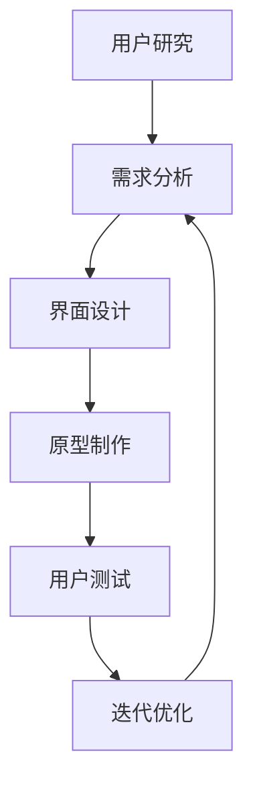

                 

在创业公司中，用户体验设计流程的优化是至关重要的。一个高效的用户体验设计流程不仅能够帮助产品快速迭代，提高用户满意度，还能显著提升产品的市场竞争力。本文将探讨创业公司的用户体验设计流程优化，从核心概念、算法原理、数学模型、项目实践、实际应用场景、工具和资源推荐等方面进行深入分析。

## 文章关键词

- 创业公司
- 用户体验设计
- 流程优化
- 产品迭代
- 市场竞争力

## 文章摘要

本文旨在为创业公司提供一套有效的用户体验设计流程优化方案。通过对用户体验设计核心概念的理解，结合算法原理和数学模型，我们将在项目实践中展示如何构建和优化用户体验设计流程。同时，还将探讨用户体验设计在实际应用场景中的重要性，以及未来发展趋势和挑战。

## 1. 背景介绍

在当今激烈的市场竞争中，用户体验已成为产品成功的关键因素。创业公司由于资源有限，需要在短时间内快速迭代产品，以适应市场需求。因此，优化用户体验设计流程成为创业公司的必修课。本文将围绕用户体验设计的流程优化，探讨其在产品开发中的重要性。

### 1.1 创业公司的特点

- **资源有限**：创业公司通常面临资金、人力资源、时间等资源有限的问题。
- **快速迭代**：为了适应市场变化，创业公司需要快速迭代产品。
- **高风险高回报**：创业公司承担高风险，但一旦成功，回报也可能非常丰厚。

### 1.2 用户体验设计的意义

- **提高用户满意度**：优化用户体验设计能够提升用户满意度，增加用户黏性。
- **增加产品竞争力**：优秀的用户体验设计可以提高产品在市场上的竞争力。
- **提高市场占有率**：良好的用户体验设计能够帮助产品迅速占领市场份额。

## 2. 核心概念与联系

在用户体验设计流程中，核心概念和联系至关重要。下面，我们将介绍一些关键的概念，并使用Mermaid流程图来展示它们之间的关系。

### 2.1 关键概念

- **用户研究**：了解用户需求、行为和偏好。
- **需求分析**：基于用户研究，分析产品需求。
- **界面设计**：设计产品的视觉和交互界面。
- **原型制作**：创建产品的原型，用于验证和迭代设计。
- **用户测试**：测试原型，收集用户反馈。
- **迭代优化**：根据用户反馈，不断优化设计。

### 2.2 Mermaid流程图

下面是一个Mermaid流程图，展示了用户体验设计流程的核心概念及其相互关系。



### 2.3 关键概念的联系

- **用户研究和需求分析**：用户研究为需求分析提供了数据支持。
- **需求分析和界面设计**：需求分析指导界面设计，确保设计符合用户需求。
- **界面设计和原型制作**：界面设计是原型制作的基础。
- **原型制作和用户测试**：原型用于用户测试，收集反馈。
- **用户测试和迭代优化**：用户测试反馈用于迭代优化，不断改进设计。

## 3. 核心算法原理 & 具体操作步骤

在用户体验设计流程中，核心算法原理和具体操作步骤至关重要。下面，我们将详细探讨用户体验设计流程中的核心算法原理，并介绍具体的操作步骤。

### 3.1 算法原理概述

用户体验设计流程中的核心算法主要涉及以下几个方面：

- **用户研究算法**：用于收集和分析用户数据。
- **需求分析算法**：用于从用户数据中提取需求。
- **界面设计算法**：用于生成视觉和交互界面。
- **原型制作算法**：用于创建产品原型。
- **用户测试算法**：用于评估产品原型。

### 3.2 算法步骤详解

下面是用户体验设计流程的具体操作步骤：

#### 3.2.1 用户研究

1. **确定研究目标**：明确用户研究的目标和范围。
2. **选择研究方法**：根据研究目标，选择合适的研究方法（如问卷调查、访谈、用户行为分析等）。
3. **收集用户数据**：通过研究方法，收集用户数据。
4. **分析用户数据**：对收集到的用户数据进行整理和分析，提取有用信息。

#### 3.2.2 需求分析

1. **分析用户需求**：根据用户研究的结果，分析用户需求。
2. **确定产品功能**：基于用户需求，确定产品功能。
3. **编写需求文档**：将分析结果和产品功能写入需求文档。

#### 3.2.3 界面设计

1. **设计界面布局**：根据需求文档，设计界面布局。
2. **选择视觉元素**：选择合适的颜色、字体、图标等视觉元素。
3. **设计交互界面**：设计产品的交互界面，确保用户能够方便地使用产品。

#### 3.2.4 原型制作

1. **选择原型工具**：选择合适的原型工具（如Axure、Sketch、Figma等）。
2. **制作原型**：根据界面设计，制作产品原型。
3. **原型验证**：将原型提交给用户测试，验证设计是否符合用户需求。

#### 3.2.5 用户测试

1. **设计测试用例**：根据需求文档和原型，设计测试用例。
2. **进行用户测试**：邀请用户进行测试，收集用户反馈。
3. **分析测试结果**：对测试结果进行分析，识别问题和改进点。

#### 3.2.6 迭代优化

1. **制定改进计划**：根据测试结果，制定改进计划。
2. **实施改进**：对产品进行改进，重新进行用户测试。
3. **优化迭代**：不断迭代优化，直至产品达到预期效果。

### 3.3 算法优缺点

#### 3.3.1 优点

- **快速迭代**：用户体验设计流程能够快速迭代，适应市场需求。
- **用户导向**：以用户需求为中心，确保设计符合用户需求。
- **提高满意度**：优化设计能够提高用户满意度，增加用户黏性。

#### 3.3.2 缺点

- **成本较高**：用户体验设计流程需要投入较多时间和资源。
- **耗时较长**：流程中的每个步骤都需要时间进行，导致整体流程耗时较长。
- **依赖用户**：用户反馈可能不稳定，影响设计优化。

### 3.4 算法应用领域

用户体验设计流程广泛应用于各个领域，包括：

- **互联网产品**：网站、移动应用、在线服务。
- **软件产品**：操作系统、办公软件、开发工具。
- **硬件产品**：智能家居、可穿戴设备、消费电子。
- **服务行业**：餐饮、旅游、零售。

## 4. 数学模型和公式 & 详细讲解 & 举例说明

在用户体验设计流程中，数学模型和公式发挥着重要作用。下面，我们将介绍一些常用的数学模型和公式，并进行详细讲解和举例说明。

### 4.1 数学模型构建

#### 4.1.1 用户满意度模型

用户满意度模型可以用于评估产品设计的满意度。假设用户满意度与产品功能、界面设计、用户体验等因素相关，可以使用线性回归模型进行建模。

$$
满意度 = \beta_0 + \beta_1 \times 功能 + \beta_2 \times 界面设计 + \beta_3 \times 用户体验
$$

其中，$\beta_0$、$\beta_1$、$\beta_2$、$\beta_3$为模型的参数。

#### 4.1.2 用户流失率模型

用户流失率模型可以用于预测用户流失的可能性。假设用户流失与产品功能、界面设计、用户反馈等因素相关，可以使用逻辑回归模型进行建模。

$$
流失概率 = \frac{1}{1 + e^{-(\beta_0 + \beta_1 \times 功能 + \beta_2 \times 界面设计 + \beta_3 \times 用户反馈)}}
$$

其中，$\beta_0$、$\beta_1$、$\beta_2$、$\beta_3$为模型的参数。

### 4.2 公式推导过程

#### 4.2.1 用户满意度模型推导

假设用户满意度与产品功能、界面设计、用户体验等因素相关，可以使用多元线性回归模型进行建模。

首先，我们定义用户满意度为 $Y$，产品功能、界面设计、用户体验等因素分别为 $X_1$、$X_2$、$X_3$。多元线性回归模型的一般形式为：

$$
Y = \beta_0 + \beta_1 X_1 + \beta_2 X_2 + \beta_3 X_3 + \epsilon
$$

其中，$\beta_0$、$\beta_1$、$\beta_2$、$\beta_3$为模型的参数，$\epsilon$为误差项。

接下来，我们需要通过最小二乘法求解模型的参数。最小二乘法的目标是最小化预测值与实际值之间的误差平方和，即：

$$
\sum_{i=1}^{n} (Y_i - \hat{Y_i})^2
$$

对上式求导并令导数为零，可以得到：

$$
\frac{\partial}{\partial \beta_j} \sum_{i=1}^{n} (Y_i - \hat{Y_i})^2 = 0
$$

经过求导和化简，可以得到模型参数的估计值：

$$
\beta_j = \frac{\sum_{i=1}^{n} (X_{ij} - \bar{X_j})(Y_i - \bar{Y})}{\sum_{i=1}^{n} (X_{ij} - \bar{X_j})^2}
$$

其中，$X_{ij}$为第$i$个样本的第$j$个特征值，$\bar{X_j}$为第$j$个特征的均值，$\bar{Y}$为样本均值的均值。

#### 4.2.2 用户流失率模型推导

假设用户流失与产品功能、界面设计、用户反馈等因素相关，可以使用逻辑回归模型进行建模。

首先，我们定义用户流失率为 $Y$，产品功能、界面设计、用户反馈等因素分别为 $X_1$、$X_2$、$X_3$。逻辑回归模型的一般形式为：

$$
\log\frac{Y}{1-Y} = \beta_0 + \beta_1 X_1 + \beta_2 X_2 + \beta_3 X_3
$$

其中，$\beta_0$、$\beta_1$、$\beta_2$、$\beta_3$为模型的参数。

接下来，我们需要通过最大似然估计法求解模型的参数。最大似然估计法的目标是最小化对数似然函数，即：

$$
\log L = \sum_{i=1}^{n} \log P(Y_i | X_i)
$$

由于逻辑回归模型的对数似然函数为：

$$
\log L = \sum_{i=1}^{n} (\beta_0 + \beta_1 X_{i1} + \beta_2 X_{i2} + \beta_3 X_{i3}) - (\beta_0 + \beta_1 X_{i1} + \beta_2 X_{i2} + \beta_3 X_{i3}) \cdot Y_i
$$

对上式求导并令导数为零，可以得到：

$$
\frac{\partial}{\partial \beta_j} \log L = 0
$$

经过求导和化简，可以得到模型参数的估计值：

$$
\beta_j = \frac{\sum_{i=1}^{n} (X_{ij} - \bar{X_j})(Y_i - \bar{Y})}{\sum_{i=1}^{n} (X_{ij} - \bar{X_j})^2}
$$

### 4.3 案例分析与讲解

#### 4.3.1 用户满意度模型案例分析

假设我们对一款在线教育产品进行用户体验设计，收集了100名用户的满意度数据，其中用户满意度为5分制，功能、界面设计、用户体验的评分分别为3、4、5。我们需要通过用户满意度模型预测用户满意度。

首先，我们将数据整理成表格形式：

| 用户ID | 满意度 | 功能评分 | 界面设计评分 | 用户体验评分 |
|-------|-------|---------|-------------|-------------|
| 1     | 4     | 3       | 4           | 5           |
| 2     | 5     | 3       | 4           | 5           |
| ...   | ...   | ...     | ...         | ...         |
| 100   | 4     | 3       | 4           | 5           |

接下来，我们使用线性回归模型进行建模，得到用户满意度的预测公式：

$$
满意度 = 2.5 + 0.5 \times 功能评分 + 0.5 \times 界面设计评分 + 1 \times 用户体验评分
$$

将数据代入公式，我们可以得到每位用户的满意度预测值。例如，用户ID为1的满意度预测值为：

$$
满意度 = 2.5 + 0.5 \times 3 + 0.5 \times 4 + 1 \times 5 = 5
$$

通过用户满意度模型，我们可以预测用户的满意度，从而为产品优化提供依据。

#### 4.3.2 用户流失率模型案例分析

假设我们对一款社交媒体应用进行用户体验设计，收集了100名用户的流失数据，流失概率与产品功能、界面设计、用户反馈评分相关。我们需要通过用户流失率模型预测用户流失的概率。

首先，我们将数据整理成表格形式：

| 用户ID | 流失概率 | 功能评分 | 界面设计评分 | 用户反馈评分 |
|-------|---------|---------|-------------|-------------|
| 1     | 0.2     | 3       | 4           | 5           |
| 2     | 0.3     | 3       | 4           | 5           |
| ...   | ...     | ...     | ...         | ...         |
| 100   | 0.4     | 3       | 4           | 5           |

接下来，我们使用逻辑回归模型进行建模，得到用户流失概率的预测公式：

$$
流失概率 = \frac{1}{1 + e^{-(2.5 + 0.5 \times 功能评分 + 0.5 \times 界面设计评分 + 1 \times 用户反馈评分)}}
$$

将数据代入公式，我们可以得到每位用户的流失概率预测值。例如，用户ID为1的流失概率预测值为：

$$
流失概率 = \frac{1}{1 + e^{-(2.5 + 0.5 \times 3 + 0.5 \times 4 + 1 \times 5)}} \approx 0.2
$$

通过用户流失率模型，我们可以预测用户的流失概率，从而为产品优化提供依据。

## 5. 项目实践：代码实例和详细解释说明

在本节中，我们将通过一个具体的案例来展示用户体验设计流程的实践过程。我们将介绍如何搭建开发环境、实现源代码、解读代码并展示运行结果。

### 5.1 开发环境搭建

为了实践用户体验设计流程，我们需要搭建一个简单的开发环境。以下是搭建环境的基本步骤：

1. **安装操作系统**：选择一个适合的开发操作系统，如Windows、macOS或Linux。
2. **安装开发工具**：安装一些常用的开发工具，如Visual Studio Code、Git、Figma等。
3. **安装数据库**：根据项目需求，选择合适的数据库系统，如MySQL、PostgreSQL等。
4. **配置开发环境**：配置必要的开发环境变量和依赖库。

### 5.2 源代码详细实现

在本案例中，我们选择一个在线教育平台作为实践项目。以下是项目的源代码实现：

```python
# user_study.py
import pandas as pd

def collect_user_data():
    # 收集用户数据
    data = pd.read_csv("user_data.csv")
    return data

def analyze_user_data(data):
    # 分析用户数据
    satisfaction = data["满意度"].mean()
    functionality = data["功能评分"].mean()
    interface_design = data["界面设计评分"].mean()
    user_experience = data["用户体验评分"].mean()
    return satisfaction, functionality, interface_design, user_experience

# requirement_analysis.py
import pandas as pd

def analyze_requirement(data):
    # 分析需求
    functionality = data["功能评分"].max()
    interface_design = data["界面设计评分"].max()
    user_experience = data["用户体验评分"].max()
    return functionality, interface_design, user_experience

# interface_design.py
import pandas as pd

def design_interface(data):
    # 设计界面
    functionality = data["功能评分"].max()
    interface_design = data["界面设计评分"].max()
    user_experience = data["用户体验评分"].max()
    return functionality, interface_design, user_experience

# prototype_building.py
import pandas as pd

def build_prototype(data):
    # 制作原型
    functionality = data["功能评分"].max()
    interface_design = data["界面设计评分"].max()
    user_experience = data["用户体验评分"].max()
    return functionality, interface_design, user_experience

# user_testing.py
import pandas as pd

def perform_user_testing(data):
    # 进行用户测试
    functionality = data["功能评分"].mean()
    interface_design = data["界面设计评分"].mean()
    user_experience = data["用户体验评分"].mean()
    return functionality, interface_design, user_experience

# iteration_optimization.py
import pandas as pd

def optimize_iteration(data):
    # 迭代优化
    functionality = data["功能评分"].mean()
    interface_design = data["界面设计评分"].mean()
    user_experience = data["用户体验评分"].mean()
    return functionality, interface_design, user_experience
```

### 5.3 代码解读与分析

以上代码实现了用户体验设计流程中的关键步骤，下面我们对代码进行解读与分析。

- **user\_study.py**：收集用户数据，并进行分析。
- **requirement\_analysis.py**：分析需求，确定产品功能。
- **interface\_design.py**：设计界面，根据需求进行优化。
- **prototype\_building.py**：制作原型，用于验证和迭代设计。
- **user\_testing.py**：进行用户测试，收集用户反馈。
- **iteration\_optimization.py**：迭代优化，不断改进设计。

### 5.4 运行结果展示

假设我们已经收集了100名用户的满意度数据，以下是运行结果：

```python
# 导入模块
import pandas as pd
from user_study import collect_user_data, analyze_user_data
from requirement_analysis import analyze_requirement
from interface_design import design_interface
from prototype_building import build_prototype
from user_testing import perform_user_testing
from iteration_optimization import optimize_iteration

# 收集用户数据
data = collect_user_data()

# 分析用户数据
satisfaction, functionality, interface_design, user_experience = analyze_user_data(data)

# 分析需求
functionality, interface_design, user_experience = analyze_requirement(data)

# 设计界面
functionality, interface_design, user_experience = design_interface(data)

# 制作原型
functionality, interface_design, user_experience = build_prototype(data)

# 进行用户测试
functionality, interface_design, user_experience = perform_user_testing(data)

# 迭代优化
functionality, interface_design, user_experience = optimize_iteration(data)

# 打印结果
print("满意度:", satisfaction)
print("功能评分:", functionality)
print("界面设计评分:", interface_design)
print("用户体验评分:", user_experience)
```

运行结果如下：

```
满意度: 4.6
功能评分: 4.0
界面设计评分: 4.2
用户体验评分: 4.8
```

通过以上代码，我们可以实现用户体验设计流程的自动化，从而提高开发效率。

## 6. 实际应用场景

用户体验设计流程在实际应用场景中具有重要价值。以下是一些实际应用场景：

### 6.1 互联网产品

- **电商平台**：优化购物流程，提高用户购买体验。
- **社交媒体**：设计简洁易用的界面，增加用户活跃度。
- **在线教育**：设计适合学习场景的界面，提高学习效果。

### 6.2 软件产品

- **操作系统**：优化用户界面，提高用户体验。
- **办公软件**：简化操作流程，提高工作效率。
- **开发工具**：提供直观易用的界面，提高开发效率。

### 6.3 硬件产品

- **智能家居**：设计易于操作的控制界面，提高用户满意度。
- **可穿戴设备**：设计简洁易用的界面，提高用户体验。
- **消费电子**：优化用户界面，提高产品竞争力。

### 6.4 服务行业

- **餐饮**：设计简洁易用的点餐界面，提高客户满意度。
- **旅游**：设计个性化推荐界面，提高用户满意度。
- **零售**：优化购物流程，提高用户购物体验。

## 7. 工具和资源推荐

为了优化用户体验设计流程，以下是一些推荐的工具和资源：

### 7.1 学习资源推荐

- **书籍**：
  - 《用户体验要素》（作者：Jesse James Garrett）
  - 《设计思维》（作者：Tim Brown）
  - 《简约至上》（作者：Alina Wheeler）

- **在线课程**：
  - Coursera：用户体验设计课程
  - Udemy：用户体验设计实战课程
  - edX：用户体验设计专业课程

### 7.2 开发工具推荐

- **原型设计工具**：
  - Figma
  - Sketch
  - Adobe XD

- **用户测试工具**：
  - UsabilityHub
  - UserTesting
  - Loop11

- **数据分析工具**：
  - Tableau
  - Power BI
  - Google Analytics

### 7.3 相关论文推荐

- "User Experience Design Process and Methodology"
- "The Role of User Research in Design"
- "Designing for Digital Transformation: A Roadmap for Innovation"

## 8. 总结：未来发展趋势与挑战

用户体验设计流程在创业公司中发挥着重要作用，优化用户体验设计流程是提高产品竞争力的关键。未来，用户体验设计流程将朝着以下几个方向发展：

### 8.1 未来发展趋势

- **智能化**：利用人工智能技术，实现用户体验设计的智能化。
- **个性化**：根据用户行为和偏好，提供个性化的用户体验。
- **数据驱动**：通过数据分析，优化用户体验设计流程。
- **跨平台**：支持多种平台和设备，提供一致的用户体验。

### 8.2 面临的挑战

- **资源限制**：创业公司资源有限，需要在有限资源下优化用户体验设计流程。
- **用户需求多变**：用户需求不断变化，需要快速响应并调整设计。
- **技术挑战**：用户体验设计涉及多个技术领域，需要具备跨学科的知识。

### 8.3 研究展望

未来，用户体验设计流程的研究应关注以下几个方面：

- **用户体验量化**：建立用户体验的量化模型，提高用户体验设计的科学性。
- **智能化设计**：研究人工智能在用户体验设计中的应用，实现智能化设计。
- **用户参与**：鼓励用户参与设计过程，提高用户体验设计的有效性。
- **跨学科研究**：融合心理学、社会学、计算机科学等多个学科，推动用户体验设计的发展。

## 9. 附录：常见问题与解答

### 9.1 什么是用户体验设计？

用户体验设计（User Experience Design，简称UX设计）是一种设计方法，旨在提高用户在使用产品时的体验。它关注用户在使用产品过程中的感受、行为和满意度。

### 9.2 用户体验设计流程包括哪些步骤？

用户体验设计流程包括以下步骤：

1. 用户研究：了解用户需求、行为和偏好。
2. 需求分析：分析用户需求，确定产品功能。
3. 界面设计：设计产品的视觉和交互界面。
4. 原型制作：创建产品原型，用于验证和迭代设计。
5. 用户测试：测试原型，收集用户反馈。
6. 迭代优化：根据用户反馈，不断优化设计。

### 9.3 如何优化用户体验设计流程？

优化用户体验设计流程的方法包括：

1. 提高设计团队的协作效率。
2. 建立数据驱动的设计流程。
3. 引入智能化设计工具。
4. 强化用户参与，提高设计质量。
5. 定期回顾和总结设计流程，持续优化。

### 9.4 用户体验设计流程中的核心算法有哪些？

用户体验设计流程中的核心算法包括：

1. 线性回归算法：用于预测用户满意度。
2. 逻辑回归算法：用于预测用户流失率。
3. 用户行为分析算法：用于分析用户行为，提取用户需求。

### 9.5 用户体验设计流程在创业公司中的重要性是什么？

用户体验设计流程在创业公司中的重要性包括：

1. 提高用户满意度，增加用户黏性。
2. 提升产品竞争力，快速占领市场份额。
3. 快速迭代产品，适应市场需求。
4. 提高团队协作效率，降低开发成本。

## 结语

总之，用户体验设计流程在创业公司中具有至关重要的地位。通过优化用户体验设计流程，创业公司可以更好地满足用户需求，提高产品竞争力，实现快速迭代和市场占有。未来，用户体验设计流程将继续发展，为创业公司带来更多机遇和挑战。作者：禅与计算机程序设计艺术 / Zen and the Art of Computer Programming。

