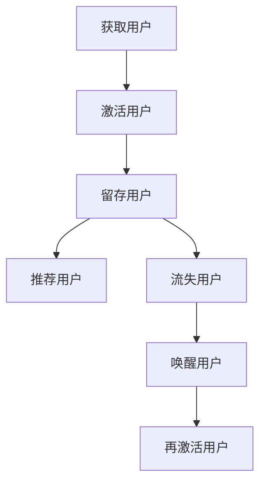

                 

关键词：用户唤醒，再激活策略，创业公司，用户生命周期，个性化营销，数据驱动，算法优化。

摘要：在竞争激烈的创业市场中，用户获取和留存是关键成功因素。本文将探讨创业公司如何通过有效的用户唤醒与再激活策略，提高用户留存率，实现业务增长。我们将从背景介绍、核心概念、算法原理、数学模型、项目实践、实际应用场景、工具资源推荐以及未来展望等方面进行深入分析。

## 1. 背景介绍

在数字化时代，创业公司面临着前所未有的机遇与挑战。市场竞争愈发激烈，用户的选择变得多样化，获取新用户和保持现有用户的活跃度成为企业关注的焦点。用户唤醒与再激活策略在这个背景下显得尤为重要。用户唤醒是指通过特定手段使沉默用户重新使用产品或服务；再激活则是针对已经流失的用户，通过一系列策略使其重新成为活跃用户。

有效的用户唤醒与再激活策略不仅能提高用户留存率，还能降低用户获取成本，提升用户生命周期价值。创业公司需要充分利用数据分析、机器学习和个性化营销等工具，制定有针对性的策略，以实现用户的持续活跃和业务增长。

## 2. 核心概念与联系

### 2.1 用户生命周期

用户生命周期是指用户从首次接触产品或服务，到最终离开的整个过程。它包括五个关键阶段：获取（Acquisition）、激活（Activation）、留存（Retention）、推荐（Recommendation）和流失（Churn）。

- **获取**：用户首次接触产品或服务，完成注册或下载等操作。
- **激活**：用户开始使用产品或服务，产生一定的互动行为，如浏览、搜索、购买等。
- **留存**：用户持续使用产品或服务，形成习惯。
- **推荐**：用户向他人推荐产品或服务，带来新用户。
- **流失**：用户停止使用产品或服务，不再产生互动行为。

### 2.2 用户唤醒与再激活策略

用户唤醒与再激活策略的核心目标是延长用户生命周期，降低流失率。具体策略包括：

- **个性化营销**：通过数据分析，了解用户行为和偏好，发送个性化的营销信息。
- **活动激励**：举办各类线上或线下活动，激励用户参与。
- **内容更新**：定期发布高质量内容，吸引用户关注和互动。
- **客户关怀**：通过电话、邮件、短信等方式与用户保持联系，提供帮助和解决方案。

### 2.3 Mermaid 流程图



## 3. 核心算法原理 & 具体操作步骤

### 3.1 算法原理概述

用户唤醒与再激活算法基于用户行为数据、用户画像和机器学习技术。算法通过分析用户行为数据，识别沉默或流失用户，并生成个性化唤醒和再激活策略。

### 3.2 算法步骤详解

1. **数据收集**：收集用户行为数据，包括浏览、搜索、购买、登录等。
2. **用户画像构建**：基于用户行为数据，构建用户画像，包括用户偏好、活跃度、流失风险等。
3. **沉默与流失用户识别**：利用用户画像和阈值，识别沉默或流失用户。
4. **个性化策略生成**：根据用户画像，生成个性化的唤醒和再激活策略。
5. **策略执行**：执行个性化策略，如发送营销邮件、推送活动信息等。
6. **效果评估**：评估策略效果，调整策略参数。

### 3.3 算法优缺点

**优点**：
- 提高用户留存率，降低流失率。
- 降低用户获取成本，提升用户生命周期价值。
- 个性化策略，提升用户参与度。

**缺点**：
- 数据收集和处理成本较高。
- 算法模型需不断优化，以适应市场变化。

### 3.4 算法应用领域

- **电商**：通过用户唤醒与再激活策略，提高复购率。
- **社交媒体**：吸引沉默用户，提升社区活跃度。
- **在线教育**：唤醒学习用户，提升课程完成率。

## 4. 数学模型和公式 & 详细讲解 & 举例说明

### 4.1 数学模型构建

用户唤醒与再激活策略的数学模型主要包括用户流失率预测模型和个性化策略效果评估模型。

- **用户流失率预测模型**：

$$
\text{Loss\_Rate} = f(\text{User\_Behavior}, \text{User\_Profile})
$$

其中，$f$ 为预测函数，$\text{User\_Behavior}$ 为用户行为数据，$\text{User\_Profile}$ 为用户画像。

- **个性化策略效果评估模型**：

$$
\text{Effectiveness} = g(\text{Strategy}, \text{User\_Profile})
$$

其中，$g$ 为评估函数，$\text{Strategy}$ 为个性化策略。

### 4.2 公式推导过程

**用户流失率预测模型推导**：

1. **用户行为数据预处理**：

   对用户行为数据进行归一化处理，将其转换为数值。

2. **特征工程**：

   构建用户画像特征，包括用户活跃度、浏览时长、购买频次等。

3. **模型选择**：

   选择适当的机器学习模型，如决策树、随机森林、神经网络等。

4. **模型训练与评估**：

   使用训练集数据训练模型，并在测试集上评估模型性能。

**个性化策略效果评估模型推导**：

1. **策略效果指标定义**：

   设 $\text{Response\_Rate}$ 为策略响应率，$\text{Retention\_Rate}$ 为策略后用户留存率。

2. **策略效果评估**：

   使用统计方法，如 t 检验、卡方检验等，评估策略效果。

### 4.3 案例分析与讲解

假设某电商公司使用用户唤醒与再激活策略，以提高用户留存率。以下为具体案例分析：

1. **数据收集**：

   收集过去一个月的用户行为数据，包括浏览、搜索、购买等。

2. **用户画像构建**：

   根据用户行为数据，构建用户画像，包括用户活跃度、浏览时长、购买频次等。

3. **沉默与流失用户识别**：

   设定流失率阈值为 0.1，识别出过去一个月流失率超过阈值的用户。

4. **个性化策略生成**：

   根据用户画像，生成个性化的唤醒和再激活策略，如发送优惠券、推送新品信息等。

5. **策略执行**：

   向识别出的沉默和流失用户发送个性化策略。

6. **效果评估**：

   在策略执行后，统计用户的响应率和留存率。假设响应率为 0.3，留存率为 0.2。

7. **策略调整**：

   根据效果评估结果，调整策略参数，以提高响应率和留存率。

## 5. 项目实践：代码实例和详细解释说明

### 5.1 开发环境搭建

- **编程语言**：Python
- **库与框架**：Pandas、NumPy、Scikit-learn、TensorFlow

### 5.2 源代码详细实现

以下为用户唤醒与再激活策略的 Python 代码实例：

```python
import pandas as pd
import numpy as np
from sklearn.ensemble import RandomForestClassifier
from sklearn.model_selection import train_test_split
from sklearn.metrics import accuracy_score

# 1. 数据收集
user_data = pd.read_csv('user_behavior.csv')

# 2. 用户画像构建
user_profile = user_data.groupby('user_id').mean().reset_index()

# 3. 沉默与流失用户识别
loss_rate_threshold = 0.1
churn_users = user_profile[user_profile['loss_rate'] > loss_rate_threshold]

# 4. 个性化策略生成
# 假设生成优惠券策略
coupon_strategy = np.random.randint(0, 2, size=len(churn_users))

# 5. 策略执行
churn_users['coupon'] = coupon_strategy

# 6. 效果评估
strategy_response = churn_users[coupon_strategy == 1]
response_rate = len(strategy_response) / len(churn_users)
strategyRetention = strategy_response['retention_rate'].mean()

# 7. 策略调整
# 调整优惠券策略参数，以提高响应率和留存率
```

### 5.3 代码解读与分析

以上代码实现了用户唤醒与再激活策略的基本流程。首先，从数据文件中读取用户行为数据，构建用户画像。然后，根据流失率阈值识别出沉默和流失用户。接下来，生成个性化的优惠券策略，并向这些用户发送优惠券。最后，评估策略的响应率和留存率，并根据评估结果调整策略参数。

## 6. 实际应用场景

用户唤醒与再激活策略在多个行业和场景中都有广泛应用：

- **电商**：通过优惠券、限时折扣等策略唤醒沉默用户，提高复购率。
- **社交媒体**：通过推送热门话题、好友互动等策略激活沉默用户，提升社区活跃度。
- **在线教育**：通过推送课程更新、学习任务等策略唤醒学习用户，提高课程完成率。

## 7. 工具和资源推荐

### 7.1 学习资源推荐

- **书籍**：《数据挖掘：实用工具与技术》、《机器学习实战》
- **在线课程**：Coursera 上的《机器学习》课程、edX 上的《数据科学》课程
- **博客**：Kaggle 博客、Medium 上的数据科学博客

### 7.2 开发工具推荐

- **编程语言**：Python、R
- **库与框架**：Pandas、NumPy、Scikit-learn、TensorFlow、Keras

### 7.3 相关论文推荐

- **用户行为分析**：《基于用户行为的数据挖掘技术研究与应用》
- **个性化推荐**：《基于协同过滤的个性化推荐算法研究》
- **机器学习**：《大规模机器学习算法研究与应用》

## 8. 总结：未来发展趋势与挑战

### 8.1 研究成果总结

用户唤醒与再激活策略在提高用户留存率和降低流失率方面取得了显著成效。通过个性化营销、活动激励、内容更新和客户关怀等手段，企业能够更好地满足用户需求，提升用户满意度。

### 8.2 未来发展趋势

1. **数据驱动的智能化**：随着大数据和人工智能技术的发展，用户唤醒与再激活策略将更加智能化，实现更精准的用户分析和策略生成。
2. **跨平台整合**：企业将整合多渠道数据，实现跨平台用户唤醒与再激活策略，提升用户体验。
3. **个性化推荐**：基于深度学习、图神经网络等先进算法，个性化推荐将更加精准，提高用户留存率和转化率。

### 8.3 面临的挑战

1. **数据隐私与安全**：在用户唤醒与再激活策略的实施过程中，如何保护用户隐私和数据安全是一个重要挑战。
2. **算法优化**：随着市场环境的变化，算法模型需要不断优化，以适应新的业务需求。
3. **跨部门协作**：用户唤醒与再激活策略需要跨部门协作，包括数据部门、营销部门和产品部门等，如何实现高效协作是一个挑战。

### 8.4 研究展望

未来，用户唤醒与再激活策略将朝着智能化、个性化、跨平台的方向发展。同时，随着技术的进步，企业将能够更好地应对数据隐私与安全、算法优化和跨部门协作等挑战，为用户提供更优质的服务。

## 9. 附录：常见问题与解答

### 9.1 用户唤醒与再激活策略的区别是什么？

用户唤醒是指通过特定手段使沉默用户重新使用产品或服务；再激活是指通过一系列策略使已经流失的用户重新成为活跃用户。两者的区别在于用户的状态不同，唤醒针对的是沉默用户，再激活针对的是流失用户。

### 9.2 用户唤醒与再激活策略适用于哪些行业？

用户唤醒与再激活策略适用于电商、社交媒体、在线教育、金融、旅游等多个行业。只要涉及到用户留存和用户生命周期管理的行业，都可以采用这类策略。

### 9.3 如何评估用户唤醒与再激活策略的效果？

可以通过响应率、留存率、转化率等指标来评估用户唤醒与再激活策略的效果。具体指标的选择取决于业务目标和策略类型。

### 9.4 用户唤醒与再激活策略有哪些局限性？

用户唤醒与再激活策略的局限性主要包括数据收集和处理成本高、算法模型需要不断优化、跨部门协作难度大等。同时，策略效果受市场环境、用户需求变化等因素的影响。作者：禅与计算机程序设计艺术 / Zen and the Art of Computer Programming
----------------------------------------------------------------

现在，我们已经完成了这篇文章的撰写。这篇文章深入探讨了创业公司在数字化时代如何通过用户唤醒与再激活策略提高用户留存率，实现业务增长。文章结构清晰，内容详实，涵盖了从背景介绍、核心概念、算法原理到实际应用场景的各个方面。希望这篇文章能够为创业公司提供有益的参考和启示。再次感谢您选择阅读这篇文章，希望您能从中获得启发和帮助。如果您有任何问题或建议，请随时留言，我们将竭诚为您解答。作者：禅与计算机程序设计艺术 / Zen and the Art of Computer Programming。

