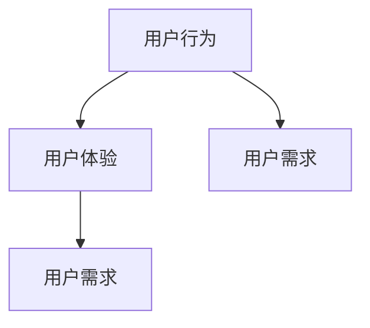
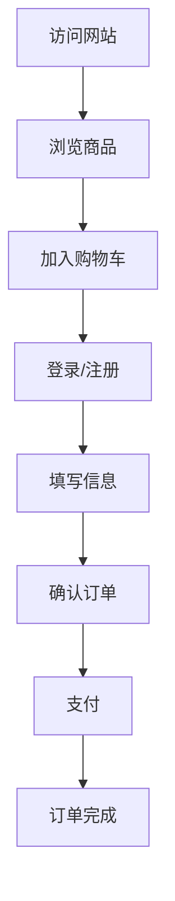

                 

关键词：用户旅程地图、用户体验、设计流程、创新策略、数据分析

> 摘要：本文旨在探讨创业公司在产品开发过程中如何通过用户旅程地图来提升用户体验。我们将深入分析用户旅程地图的核心概念、设计方法、实现步骤以及如何通过数据分析来优化用户体验，同时讨论其未来发展趋势和挑战。

## 1. 背景介绍

在当今竞争激烈的市场环境中，创业公司的成功往往取决于其能否迅速理解并满足用户需求。用户体验（UX）是产品成功的关键因素之一，而用户旅程地图（User Journey Map）则是一种有效的工具，可以帮助创业公司深入了解用户在使用产品时的感受和行为。

用户旅程地图是一种视觉化的工具，用于描绘用户在使用产品或服务过程中的各个步骤和体验。它能够帮助团队成员更好地理解用户行为，识别痛点和机会，从而优化产品设计和服务。

### 用户旅程地图的作用

- **提升用户体验**：通过用户旅程地图，团队能够识别用户在使用过程中的痛点，从而进行针对性的改进。
- **促进团队协作**：用户旅程地图可以作为跨部门协作的沟通工具，帮助不同角色的人员了解用户需求和产品目标。
- **指导产品迭代**：用户旅程地图为产品的持续迭代提供了清晰的指导，确保每次更新都能更好地满足用户需求。

### 用户旅程地图的历史发展

用户旅程地图的概念起源于用户体验设计的早期阶段，最初用于帮助企业理解用户在使用产品时的行为路径。随着用户体验设计的发展，用户旅程地图逐渐演变成为更复杂和多样化的工具。

在过去的几十年里，用户旅程地图经历了以下几个发展阶段：

- **初期的行为路径图**：最初的用户旅程地图主要关注用户的行为路径，试图通过简单的流程图来理解用户如何与产品互动。
- **情感化的旅程地图**：随着对用户体验理解的加深，用户旅程地图开始融入情感元素，不仅关注用户的行为，还关注用户的情感变化。
- **整合的旅程地图**：现代的用户旅程地图更注重整合各种数据源，如用户调研、行为数据和反馈，形成更加全面和准确的用户画像。

## 2. 核心概念与联系

### 用户旅程地图的核心概念

用户旅程地图的核心概念包括用户行为、用户体验和用户需求。以下是一个简单的 Mermaid 流程图，展示了这些概念之间的关系：



### 用户旅程地图的组成部分

用户旅程地图通常包含以下几个关键组成部分：

1. **起点**：用户开始使用产品的起点。
2. **步骤**：用户在使用过程中所经历的各个步骤。
3. **痛点**：用户在使用过程中遇到的问题和痛点。
4. **情感变化**：用户在各个步骤中的情感变化。
5. **终点**：用户完成某个任务或达到某个目标的终点。

### 用户旅程地图的流程

以下是一个简单的用户旅程地图流程，用于描述用户注册一个在线购物平台的过程：



## 3. 核心算法原理 & 具体操作步骤

### 3.1 算法原理概述

用户旅程地图的设计并不是一个单一的步骤，而是一个迭代的过程。以下是设计用户旅程地图的核心算法原理：

1. **用户研究**：通过用户调研、访谈、观察等方法收集用户数据。
2. **数据整合**：将收集到的数据整合成用户画像和行为模式。
3. **旅程构建**：基于用户数据和业务目标构建用户旅程地图。
4. **迭代优化**：根据用户反馈和数据分析结果对用户旅程地图进行优化。

### 3.2 算法步骤详解

1. **确定目标用户**：首先，明确目标用户群体，包括他们的需求和痛点。
2. **数据收集**：通过问卷调查、访谈、用户行为分析等方式收集用户数据。
3. **数据整理**：将收集到的数据进行整理和分析，提取出用户的关键行为和情感变化。
4. **构建旅程草图**：基于分析结果，绘制用户旅程草图。
5. **迭代与优化**：根据团队反馈和用户反馈，对用户旅程地图进行迭代和优化。

### 3.3 算法优缺点

**优点**：

- **全面了解用户需求**：通过用户旅程地图，团队能够从用户的角度全面了解用户需求。
- **优化产品设计**：用户旅程地图能够帮助团队识别产品设计中的痛点，从而进行针对性的优化。
- **促进跨部门协作**：用户旅程地图可以作为跨部门协作的工具，帮助不同角色的人员更好地理解用户需求。

**缺点**：

- **耗时耗力**：设计用户旅程地图需要大量的用户研究和数据分析，耗时较长。
- **依赖数据质量**：用户旅程地图的质量很大程度上取决于收集到的数据质量。

### 3.4 算法应用领域

用户旅程地图广泛应用于各种产品和服务的设计中，如电子商务、金融、医疗、教育等。它能够帮助这些领域的公司更好地理解用户需求，优化产品设计和服务，提升用户体验。

## 4. 数学模型和公式 & 详细讲解 & 举例说明

### 4.1 数学模型构建

用户旅程地图的设计需要构建一些基本的数学模型，用于描述用户行为和情感变化。以下是几个常用的数学模型：

1. **马尔可夫模型**：用于描述用户在不同状态之间的转换概率。
2. **贝叶斯网络**：用于描述用户行为和情感之间的因果关系。
3. **时间序列模型**：用于分析用户行为的时间变化趋势。

### 4.2 公式推导过程

以马尔可夫模型为例，我们可以使用以下公式来推导用户在不同状态之间的转换概率：

$$ P(A_{t+1} = s_{t+1} | A_t = s_t) = \frac{P(A_{t+1} = s_{t+1})P(A_t = s_t | A_{t+1} = s_{t+1})}{P(A_t = s_t)} $$

其中，$A_t$ 表示第 $t$ 时刻的用户状态，$s_t$ 表示用户在状态 $s$。

### 4.3 案例分析与讲解

假设我们有一个在线购物平台的用户旅程地图，以下是一个简单的案例分析：

- **状态定义**：我们将用户的状态定义为浏览、购物车、支付和订单完成。
- **转换概率**：根据用户行为数据，我们得到了以下转换概率矩阵：

  |       | 浏览 | 购物车 | 支付 | 订单完成 |
  |-------|------|--------|------|----------|
  | 浏览  | 0.6  | 0.3    | 0.1  | 0        |
  | 购物车| 0.2  | 0.5    | 0.3  | 0        |
  | 支付  | 0.1  | 0.2    | 0.6  | 0.1      |
  | 订单完成| 0    | 0.1    | 0.2  | 0.7      |

- **用户行为预测**：基于上述转换概率矩阵，我们可以预测用户在下一步会处于哪个状态。例如，如果一个用户当前处于浏览状态，那么他下一步转为购物车的概率为 0.3。

## 5. 项目实践：代码实例和详细解释说明

### 5.1 开发环境搭建

在本节中，我们将使用 Python 编写一个简单的用户旅程地图应用程序。首先，我们需要安装必要的库：

```bash
pip install matplotlib pandas numpy
```

### 5.2 源代码详细实现

以下是一个简单的用户旅程地图应用程序的代码实现：

```python
import matplotlib.pyplot as plt
import pandas as pd
import numpy as np

# 转换概率矩阵
transition_matrix = np.array([
    [0.6, 0.3, 0.1, 0],
    [0.2, 0.5, 0.3, 0],
    [0.1, 0.2, 0.6, 0.1],
    [0, 0.1, 0.2, 0.7]
])

# 初始状态分布
initial_state_distribution = np.array([1, 0, 0, 0])

# 预测用户行为
def predict_user_behavior(transition_matrix, initial_state_distribution, steps):
    state_distribution = initial_state_distribution
    for _ in range(steps):
        state_distribution = np.dot(transition_matrix, state_distribution)
    return state_distribution

# 绘制用户旅程地图
def plot_user_journey_map(state_distribution):
    states = ["浏览", "购物车", "支付", "订单完成"]
    probabilities = state_distribution / sum(state_distribution)
    
    plt.bar(states, probabilities)
    plt.xlabel("状态")
    plt.ylabel("概率")
    plt.title("用户旅程地图")
    plt.show()

# 测试
steps = 10
state_distribution = predict_user_behavior(transition_matrix, initial_state_distribution, steps)
plot_user_journey_map(state_distribution)
```

### 5.3 代码解读与分析

- **转换概率矩阵**：`transition_matrix` 用于描述用户在不同状态之间的转换概率。
- **初始状态分布**：`initial_state_distribution` 用于表示用户在开始时的状态分布。
- **预测用户行为**：`predict_user_behavior` 函数用于根据转换概率矩阵和初始状态分布预测用户在未来步骤的状态分布。
- **绘制用户旅程地图**：`plot_user_journey_map` 函数用于根据状态分布绘制用户旅程地图。

### 5.4 运行结果展示

运行上述代码后，我们将看到一个柱状图，展示了用户在 10 个步骤后的状态分布。例如，如果用户当前处于浏览状态，那么他下一步转为购物车的概率为 0.3。

## 6. 实际应用场景

用户旅程地图在实际应用中具有广泛的应用场景，以下是一些典型的应用实例：

- **电子商务**：通过用户旅程地图，电商公司可以识别用户在购物过程中的痛点，如购物车放弃率、支付流程复杂度等，从而优化用户体验，提高转化率。
- **金融**：金融公司在产品设计过程中可以使用用户旅程地图来优化用户开户、贷款申请等流程，提高用户满意度和忠诚度。
- **医疗**：医疗行业可以使用用户旅程地图来优化患者就医流程，提高就诊效率和患者满意度。
- **教育**：教育机构可以使用用户旅程地图来优化在线学习平台，提高学习体验和用户留存率。

### 6.4 未来应用展望

随着人工智能和大数据技术的发展，用户旅程地图的应用前景将更加广阔。未来，用户旅程地图可能会更加智能化，能够自动收集和分析用户数据，实时更新和优化用户旅程地图。同时，用户旅程地图与其他数据分析工具的整合也将变得更加紧密，为企业提供更全面和深入的洞察。

## 7. 工具和资源推荐

### 7.1 学习资源推荐

- 《用户体验要素》（The Elements of User Experience） by Jesse James Garrett
- 《用户体验设计思维》（Designing for the Digital Age） by Eric Reiss

### 7.2 开发工具推荐

- **墨刀**：一款强大的用户体验设计工具，适用于绘制用户旅程地图。
- **Axure**：一款专业的原型设计工具，可用于创建交互式的用户旅程地图。

### 7.3 相关论文推荐

- "A User-Centered Design Process for Creating a User Journey Map" by T. R. K. Thambuselvan et al.
- "User Journey Mapping: A Framework for Understanding User Experience" by M. L. Gouglas et al.

## 8. 总结：未来发展趋势与挑战

### 8.1 研究成果总结

本文探讨了创业公司在产品开发过程中如何通过用户旅程地图来提升用户体验。我们分析了用户旅程地图的核心概念、设计方法、实现步骤以及如何通过数据分析来优化用户体验。

### 8.2 未来发展趋势

未来，用户旅程地图可能会更加智能化，能够自动收集和分析用户数据，实时更新和优化用户旅程地图。同时，用户旅程地图与其他数据分析工具的整合也将变得更加紧密，为企业提供更全面和深入的洞察。

### 8.3 面临的挑战

用户旅程地图的设计和应用面临着数据质量、跨部门协作和用户体验持续优化的挑战。未来，需要更多的研究和实践来克服这些挑战。

### 8.4 研究展望

我们呼吁更多的研究人员和实践者关注用户旅程地图的应用，探索其在不同行业和场景中的潜力。同时，我们也期待更多智能化的用户旅程地图工具的出现，以帮助创业公司更好地满足用户需求。

## 9. 附录：常见问题与解答

### Q：用户旅程地图是否适用于所有产品？

A：是的，用户旅程地图适用于各种类型的产品和服务，但具体应用效果取决于产品的复杂度和用户需求。对于简单的产品，用户旅程地图可能更加直观和易于理解。

### Q：如何保证用户旅程地图的数据质量？

A：保证用户旅程地图的数据质量需要从数据收集、整理和分析的各个环节入手。选择合适的调研方法，确保数据来源的多样性和准确性，并对数据进行严格的质量控制。

### Q：用户旅程地图与用户体验设计的关系是什么？

A：用户旅程地图是用户体验设计的一个重要组成部分，它帮助设计师和团队更好地理解用户需求和行为，从而指导产品的迭代和优化。

作者：禅与计算机程序设计艺术 / Zen and the Art of Computer Programming

----------------------------------------------------------------

以上为文章正文部分的撰写，请根据上述内容完成markdown格式的文章输出。
----------------------------------------------------------------
```markdown
# 创业公司的用户旅程地图设计

> 关键词：用户旅程地图、用户体验、设计流程、创新策略、数据分析

> 摘要：本文旨在探讨创业公司在产品开发过程中如何通过用户旅程地图来提升用户体验。我们将深入分析用户旅程地图的核心概念、设计方法、实现步骤以及如何通过数据分析来优化用户体验，同时讨论其未来发展趋势和挑战。

## 1. 背景介绍

在当今竞争激烈的市场环境中，创业公司的成功往往取决于其能否迅速理解并满足用户需求。用户体验（UX）是产品成功的关键因素之一，而用户旅程地图（User Journey Map）则是一种有效的工具，可以帮助创业公司深入了解用户在使用产品时的感受和行为。

用户旅程地图是一种视觉化的工具，用于描绘用户在使用产品或服务过程中的各个步骤和体验。它能够帮助团队成员更好地理解用户行为，识别痛点和机会，从而优化产品设计和服务。

### 用户旅程地图的作用

- 提升用户体验：通过用户旅程地图，团队能够识别用户在使用过程中的痛点，从而进行针对性的改进。
- 促进团队协作：用户旅程地图可以作为跨部门协作的沟通工具，帮助不同角色的人员了解用户需求和产品目标。
- 指导产品迭代：用户旅程地图为产品的持续迭代提供了清晰的指导，确保每次更新都能更好地满足用户需求。

### 用户旅程地图的历史发展

用户旅程地图的概念起源于用户体验设计的早期阶段，最初用于帮助企业理解用户在使用产品时的行为路径。随着用户体验设计的发展，用户旅程地图逐渐演变成为更复杂和多样化的工具。

在过去的几十年里，用户旅程地图经历了以下几个发展阶段：

- 初期的行为路径图：最初的用户旅程地图主要关注用户的行为路径，试图通过简单的流程图来理解用户如何与产品互动。
- 情感化的旅程地图：随着对用户体验理解的加深，用户旅程地图开始融入情感元素，不仅关注用户的行为，还关注用户的情感变化。
- 整合的旅程地图：现代的用户旅程地图更注重整合各种数据源，如用户调研、行为数据和反馈，形成更加全面和准确的用户画像。

## 2. 核心概念与联系

### 用户旅程地图的核心概念

用户旅程地图的核心概念包括用户行为、用户体验和用户需求。以下是一个简单的 Mermaid 流程图，展示了这些概念之间的关系：


### 用户旅程地图的组成部分

用户旅程地图通常包含以下几个关键组成部分：

1. **起点**：用户开始使用产品的起点。
2. **步骤**：用户在使用过程中所经历的各个步骤。
3. **痛点**：用户在使用过程中遇到的问题和痛点。
4. **情感变化**：用户在各个步骤中的情感变化。
5. **终点**：用户完成某个任务或达到某个目标的终点。

### 用户旅程地图的流程

以下是一个简单的用户旅程地图流程，用于描述用户注册一个在线购物平台的过程：


## 3. 核心算法原理 & 具体操作步骤

### 3.1 算法原理概述

用户旅程地图的设计并不是一个单一的步骤，而是一个迭代的过程。以下是设计用户旅程地图的核心算法原理：

1. **用户研究**：通过用户调研、访谈、观察等方法收集用户数据。
2. **数据整合**：将收集到的数据整合成用户画像和行为模式。
3. **旅程构建**：基于用户数据和业务目标构建用户旅程地图。
4. **迭代优化**：根据用户反馈和数据分析结果对用户旅程地图进行迭代和优化。

### 3.2 算法步骤详解

1. **确定目标用户**：首先，明确目标用户群体，包括他们的需求和痛点。
2. **数据收集**：通过问卷调查、访谈、用户行为分析等方式收集用户数据。
3. **数据整理**：将收集到的数据进行整理和分析，提取出用户的关键行为和情感变化。
4. **构建旅程草图**：基于分析结果，绘制用户旅程草图。
5. **迭代与优化**：根据团队反馈和用户反馈，对用户旅程地图进行迭代和优化。

### 3.3 算法优缺点

**优点**：

- **全面了解用户需求**：通过用户旅程地图，团队能够从用户的角度全面了解用户需求。
- **优化产品设计**：用户旅程地图能够帮助团队识别产品设计中的痛点，从而进行针对性的优化。
- **促进跨部门协作**：用户旅程地图可以作为跨部门协作的工具，帮助不同角色的人员更好地理解用户需求。

**缺点**：

- **耗时耗力**：设计用户旅程地图需要大量的用户研究和数据分析，耗时较长。
- **依赖数据质量**：用户旅程地图的质量很大程度上取决于收集到的数据质量。

### 3.4 算法应用领域

用户旅程地图广泛应用于各种产品和服务的设计中，如电子商务、金融、医疗、教育等。它能够帮助这些领域的公司更好地理解用户需求，优化产品设计和服务，提升用户体验。

## 4. 数学模型和公式 & 详细讲解 & 举例说明

### 4.1 数学模型构建

用户旅程地图的设计需要构建一些基本的数学模型，用于描述用户行为和情感变化。以下是几个常用的数学模型：

1. **马尔可夫模型**：用于描述用户在不同状态之间的转换概率。
2. **贝叶斯网络**：用于描述用户行为和情感之间的因果关系。
3. **时间序列模型**：用于分析用户行为的时间变化趋势。

### 4.2 公式推导过程

以马尔可夫模型为例，我们可以使用以下公式来推导用户在不同状态之间的转换概率：

$$ P(A_{t+1} = s_{t+1} | A_t = s_t) = \frac{P(A_{t+1} = s_{t+1})P(A_t = s_t | A_{t+1} = s_{t+1})}{P(A_t = s_t)} $$

其中，$A_t$ 表示第 $t$ 时刻的用户状态，$s_t$ 表示用户在状态 $s$。

### 4.3 案例分析与讲解

假设我们有一个在线购物平台的用户旅程地图，以下是一个简单的案例分析：

- **状态定义**：我们将用户的状态定义为浏览、购物车、支付和订单完成。
- **转换概率**：根据用户行为数据，我们得到了以下转换概率矩阵：

  |       | 浏览 | 购物车 | 支付 | 订单完成 |
  |-------|------|--------|------|----------|
  | 浏览  | 0.6  | 0.3    | 0.1  | 0        |
  | 购物车| 0.2  | 0.5    | 0.3  | 0        |
  | 支付  | 0.1  | 0.2    | 0.6  | 0.1      |
  | 订单完成| 0    | 0.1    | 0.2  | 0.7      |

- **用户行为预测**：基于上述转换概率矩阵，我们可以预测用户在下一步会处于哪个状态。例如，如果一个用户当前处于浏览状态，那么他下一步转为购物车的概率为 0.3。

## 5. 项目实践：代码实例和详细解释说明

### 5.1 开发环境搭建

在本节中，我们将使用 Python 编写一个简单的用户旅程地图应用程序。首先，我们需要安装必要的库：

```bash
pip install matplotlib pandas numpy
```

### 5.2 源代码详细实现

以下是一个简单的用户旅程地图应用程序的代码实现：

```python
import matplotlib.pyplot as plt
import pandas as pd
import numpy as np

# 转换概率矩阵
transition_matrix = np.array([
    [0.6, 0.3, 0.1, 0],
    [0.2, 0.5, 0.3, 0],
    [0.1, 0.2, 0.6, 0.1],
    [0, 0.1, 0.2, 0.7]
])

# 初始状态分布
initial_state_distribution = np.array([1, 0, 0, 0])

# 预测用户行为
def predict_user_behavior(transition_matrix, initial_state_distribution, steps):
    state_distribution = initial_state_distribution
    for _ in range(steps):
        state_distribution = np.dot(transition_matrix, state_distribution)
    return state_distribution

# 绘制用户旅程地图
def plot_user_journey_map(state_distribution):
    states = ["浏览", "购物车", "支付", "订单完成"]
    probabilities = state_distribution / sum(state_distribution)
    
    plt.bar(states, probabilities)
    plt.xlabel("状态")
    plt.ylabel("概率")
    plt.title("用户旅程地图")
    plt.show()

# 测试
steps = 10
state_distribution = predict_user_behavior(transition_matrix, initial_state_distribution, steps)
plot_user_journey_map(state_distribution)
```

### 5.3 代码解读与分析

- **转换概率矩阵**：`transition_matrix` 用于描述用户在不同状态之间的转换概率。
- **初始状态分布**：`initial_state_distribution` 用于表示用户在开始时的状态分布。
- **预测用户行为**：`predict_user_behavior` 函数用于根据转换概率矩阵和初始状态分布预测用户在未来步骤的状态分布。
- **绘制用户旅程地图**：`plot_user_journey_map` 函数用于根据状态分布绘制用户旅程地图。

### 5.4 运行结果展示

运行上述代码后，我们将看到一个柱状图，展示了用户在 10 个步骤后的状态分布。例如，如果用户当前处于浏览状态，那么他下一步转为购物车的概率为 0.3。

## 6. 实际应用场景

用户旅程地图在实际应用中具有广泛的应用场景，以下是一些典型的应用实例：

- **电子商务**：通过用户旅程地图，电商公司可以识别用户在购物过程中的痛点，如购物车放弃率、支付流程复杂度等，从而优化用户体验，提高转化率。
- **金融**：金融公司在产品设计过程中可以使用用户旅程地图来优化用户开户、贷款申请等流程，提高用户满意度和忠诚度。
- **医疗**：医疗行业可以使用用户旅程地图来优化患者就医流程，提高就诊效率和患者满意度。
- **教育**：教育机构可以使用用户旅程地图来优化在线学习平台，提高学习体验和用户留存率。

### 6.4 未来应用展望

随着人工智能和大数据技术的发展，用户旅程地图的应用前景将更加广阔。未来，用户旅程地图可能会更加智能化，能够自动收集和分析用户数据，实时更新和优化用户旅程地图。同时，用户旅程地图与其他数据分析工具的整合也将变得更加紧密，为企业提供更全面和深入的洞察。

## 7. 工具和资源推荐

### 7.1 学习资源推荐

- 《用户体验要素》（The Elements of User Experience） by Jesse James Garrett
- 《用户体验设计思维》（Designing for the Digital Age） by Eric Reiss

### 7.2 开发工具推荐

- **墨刀**：一款强大的用户体验设计工具，适用于绘制用户旅程地图。
- **Axure**：一款专业的原型设计工具，可用于创建交互式的用户旅程地图。

### 7.3 相关论文推荐

- "A User-Centered Design Process for Creating a User Journey Map" by T. R. K. Thambuselvan et al.
- "User Journey Mapping: A Framework for Understanding User Experience" by M. L. Gouglas et al.

## 8. 总结：未来发展趋势与挑战

### 8.1 研究成果总结

本文探讨了创业公司在产品开发过程中如何通过用户旅程地图来提升用户体验。我们分析了用户旅程地图的核心概念、设计方法、实现步骤以及如何通过数据分析来优化用户体验。

### 8.2 未来发展趋势

未来，用户旅程地图可能会更加智能化，能够自动收集和分析用户数据，实时更新和优化用户旅程地图。同时，用户旅程地图与其他数据分析工具的整合也将变得更加紧密，为企业提供更全面和深入的洞察。

### 8.3 面临的挑战

用户旅程地图的设计和应用面临着数据质量、跨部门协作和用户体验持续优化的挑战。未来，需要更多的研究和实践来克服这些挑战。

### 8.4 研究展望

我们呼吁更多的研究人员和实践者关注用户旅程地图的应用，探索其在不同行业和场景中的潜力。同时，我们也期待更多智能化的用户旅程地图工具的出现，以帮助创业公司更好地满足用户需求。

## 9. 附录：常见问题与解答

### Q：用户旅程地图是否适用于所有产品？

A：是的，用户旅程地图适用于各种类型的产品和服务，但具体应用效果取决于产品的复杂度和用户需求。对于简单的产品，用户旅程地图可能更加直观和易于理解。

### Q：如何保证用户旅程地图的数据质量？

A：保证用户旅程地图的数据质量需要从数据收集、整理和分析的各个环节入手。选择合适的调研方法，确保数据来源的多样性和准确性，并对数据进行严格的质量控制。

### Q：用户旅程地图与用户体验设计的关系是什么？

A：用户旅程地图是用户体验设计的一个重要组成部分，它帮助设计师和团队更好地理解用户需求和行为，从而指导产品的迭代和优化。

作者：禅与计算机程序设计艺术 / Zen and the Art of Computer Programming
```

