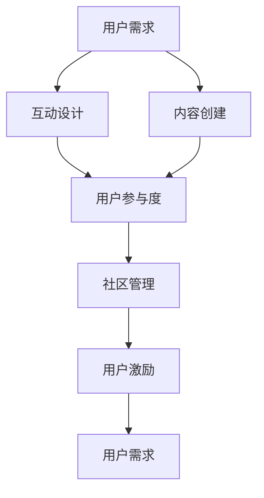

                 

 关键词：用户社群、运营策略、粘性提升、创业公司、社群营销、用户参与度、用户体验、互动设计、社区管理

> 摘要：本文深入探讨了创业公司在用户社群运营和粘性提升方面的策略。通过分析用户社群的基本概念，我们提出了构建和运营用户社群的关键步骤，以及如何利用互动设计、社区管理等方法来提高用户的参与度和粘性，最终为创业公司提供了实用的指导和建议。

## 1. 背景介绍

在当今数字化时代，用户社群已成为许多创业公司的重要资产。用户社群不仅可以为公司带来持续的业务增长，还可以提供宝贵的反馈和创新的灵感。然而，构建和维护一个有活力、有粘性的用户社群并非易事，需要公司从策略层面进行深入思考和精心规划。

本文将围绕以下几个核心问题展开讨论：

1. **用户社群的定义与重要性**：探讨用户社群的概念、类型及其对创业公司的重要性。
2. **核心概念与联系**：介绍构建用户社群所需的核心概念，并绘制Mermaid流程图。
3. **核心算法原理与操作步骤**：阐述提升用户粘性的关键算法原理和具体操作步骤。
4. **数学模型和公式**：讨论用户粘性提升的相关数学模型和公式，并进行案例分析。
5. **项目实践**：通过代码实例展示用户社群运营的实际操作。
6. **实际应用场景**：探讨用户社群在不同行业中的应用，以及未来的发展趋势。
7. **工具和资源推荐**：推荐学习资源和开发工具。
8. **总结与展望**：总结研究成果，探讨未来发展趋势和挑战。

### 1.1 用户社群的定义与类型

用户社群是指一群具有共同兴趣、目标或价值观的人组成的在线或线下社区。根据不同的分类标准，用户社群可以有多种类型：

- **按性质分类**：兴趣社群、需求社群、价值观社群等。
- **按范围分类**：本地社群、区域社群、全球社群等。
- **按形式分类**：线上论坛、社交媒体群组、线下活动等。

创业公司需要根据自身的业务特点和市场定位，选择合适类型的用户社群进行运营。

### 1.2 用户社群的重要性

用户社群对创业公司的重要性主要体现在以下几个方面：

- **获取用户反馈**：用户社群提供了一个平台，使公司可以直接获取用户的反馈和建议，有助于产品改进和业务优化。
- **用户教育**：通过社群运营，公司可以教育用户了解产品特点和价值，提高用户对产品的认知和信任。
- **用户参与度**：活跃的社群可以增强用户的参与感和归属感，提高用户粘性和忠诚度。
- **市场拓展**：用户社群可以作为公司的市场拓展渠道，通过用户推荐和口碑传播吸引更多新用户。

## 2. 核心概念与联系

在构建和运营用户社群的过程中，有几个核心概念和联系是必须理解和掌握的。以下是这些概念和它们的相互关系，以及一个简化的Mermaid流程图。

### 2.1 核心概念

- **用户需求**：用户社群的基础是满足用户的需求和兴趣。
- **互动设计**：通过精心设计的互动活动，提高用户的参与度和活跃度。
- **内容创建**：高质量的内容是吸引和留住用户的关键。
- **社区管理**：有效的社区管理可以确保社群的健康发展和用户的良好体验。
- **用户激励**：通过奖励和激励机制，增强用户的参与和贡献。

### 2.2 相互关系

- 用户需求驱动了互动设计和内容创建，同时也影响了社区管理和用户激励。
- 互动设计和内容创建是用户参与的核心，社区管理是保障，用户激励是推动力。
- 社区管理和用户激励共同作用于用户需求，形成一个正反馈循环，提高用户粘性。

### 2.3 Mermaid流程图



通过这个流程图，我们可以清晰地看到各个核心概念之间的相互作用和影响。

## 3. 核心算法原理 & 具体操作步骤

### 3.1 算法原理概述

提升用户粘性的核心算法原理是基于用户行为分析和数据驱动决策。具体来说，主要包括以下几个步骤：

1. **用户行为分析**：通过数据分析工具收集用户在社群中的行为数据，包括浏览量、发帖量、互动量、活跃时间段等。
2. **用户画像构建**：根据用户行为数据构建用户画像，了解用户的基本特征、兴趣点和需求。
3. **个性化推荐**：基于用户画像，为用户推荐感兴趣的内容和活动，提高用户的参与度和满意度。
4. **实时反馈机制**：通过用户反馈机制，及时了解用户对社群的满意度，并根据反馈调整运营策略。
5. **激励机制设计**：设计合理的激励机制，如积分、优惠券、荣誉勋章等，鼓励用户参与和贡献。

### 3.2 算法步骤详解

#### 3.2.1 用户行为分析

用户行为分析是提升用户粘性的第一步。具体操作步骤如下：

- **数据收集**：使用数据分析工具（如Google Analytics、Mixpanel等）收集用户在社群中的行为数据。
- **数据清洗**：清洗和整理数据，确保数据的质量和一致性。
- **数据存储**：将清洗后的数据存储在数据库中，便于后续分析和处理。

#### 3.2.2 用户画像构建

用户画像构建是基于用户行为数据，通过数据挖掘和机器学习技术，提取用户的基本特征和兴趣点。具体步骤包括：

- **特征提取**：从用户行为数据中提取用户的基本特征，如年龄、性别、地域、职业等。
- **兴趣点挖掘**：通过分析用户在社群中的行为，挖掘用户的兴趣点和需求。
- **用户分类**：根据用户特征和兴趣点，将用户进行分类，形成用户画像库。

#### 3.2.3 个性化推荐

个性化推荐是提高用户参与度和满意度的重要手段。具体步骤如下：

- **推荐算法选择**：根据用户画像和内容库，选择合适的推荐算法，如协同过滤、基于内容的推荐等。
- **推荐内容生成**：根据用户画像和推荐算法，为用户生成个性化推荐内容。
- **推荐内容展示**：在社群平台上展示个性化推荐内容，吸引用户参与。

#### 3.2.4 实时反馈机制

实时反馈机制是确保社群运营效果的重要手段。具体步骤如下：

- **反馈收集**：通过在线问卷、社交媒体互动等方式收集用户反馈。
- **反馈分析**：分析用户反馈，了解用户对社群的满意度和不满意度。
- **反馈调整**：根据用户反馈，调整社群运营策略，优化用户体验。

#### 3.2.5 激励机制设计

激励机制设计是鼓励用户参与和贡献的重要手段。具体步骤如下：

- **激励方案设计**：根据用户需求和社群特点，设计合理的激励方案。
- **激励机制实施**：实施激励机制，鼓励用户参与和贡献。
- **激励效果评估**：评估激励机制的效果，根据效果调整激励方案。

### 3.3 算法优缺点

#### 优点

- **提高用户粘性**：通过个性化推荐和激励机制，提高用户的参与度和满意度，从而增强用户粘性。
- **优化用户体验**：基于用户行为分析和实时反馈机制，不断优化用户社群的运营策略，提升用户体验。
- **数据驱动**：通过数据分析和机器学习技术，实现数据驱动的运营决策，提高运营效果。

#### 缺点

- **技术门槛高**：用户行为分析和个性化推荐需要较高的技术支持，对创业公司的技术团队要求较高。
- **数据隐私问题**：用户行为数据收集和处理可能涉及数据隐私问题，需要严格保护用户隐私。
- **激励机制过度**：过度的激励机制可能导致用户行为偏差，影响社群的健康发展。

### 3.4 算法应用领域

用户粘性提升算法在多个领域具有广泛的应用：

- **电商平台**：通过个性化推荐和激励机制，提高用户购买转化率和复购率。
- **社交媒体**：通过用户行为分析和实时反馈机制，提升用户的活跃度和参与度。
- **教育平台**：通过个性化推荐和激励机制，提高用户的学习效果和满意度。
- **社区论坛**：通过用户行为分析和社区管理，提升论坛的活跃度和用户参与度。

## 4. 数学模型和公式 & 详细讲解 & 举例说明

### 4.1 数学模型构建

在用户社群运营中，我们通常关注以下几个关键指标：

1. **用户参与度**：衡量用户在社群中的活跃程度，通常用帖子数、评论数、点赞数等指标表示。
2. **用户粘性**：衡量用户对社群的忠诚度，通常用留存率、活跃度、用户生命周期等指标表示。
3. **社群满意度**：衡量用户对社群的整体满意度，通常用满意度调查、用户反馈等指标表示。

为了构建数学模型，我们首先需要对上述指标进行量化。例如：

- **用户参与度**：\[P_d = \frac{帖子数 + 评论数 + 点赞数}{总用户数}\]
- **用户粘性**：\[P_l = \frac{留存用户数}{总用户数} \times 100%\]
- **社群满意度**：\[S_s = \frac{满意用户数}{总用户数} \times 100%\]

### 4.2 公式推导过程

为了推导上述公式，我们首先需要定义一些基本概念：

- **帖子数**（\(T\)）：用户在社群中发布的帖子数量。
- **评论数**（\(C\)）：用户在社群中发表的评论数量。
- **点赞数**（\(L\)）：用户在社群中对其他用户内容的点赞数量。
- **总用户数**（\(U\)）：社群中的总用户数量。
- **留存用户数**（\(R\)）：在一定时间内仍然活跃的用户数量。
- **满意用户数**（\(S\)）：对社群表示满意或非常满意的用户数量。

根据这些定义，我们可以推导出上述公式：

- **用户参与度**：\[P_d = \frac{T + C + L}{U}\]
  解释：用户参与度是用户在社群中的各种互动行为之和，除以总用户数，得到平均每个用户的参与度。
  
- **用户粘性**：\[P_l = \frac{R}{U} \times 100%\]
  解释：用户粘性是留存用户数占总用户数的比例，乘以100%转换为百分比形式。
  
- **社群满意度**：\[S_s = \frac{S}{U} \times 100%\]
  解释：社群满意度是满意用户数占总用户数的比例，乘以100%转换为百分比形式。

### 4.3 案例分析与讲解

假设我们有一个用户社群，总共有1000名用户。在一个月的时间里，社群中产生了500个帖子、1000条评论和300个点赞。在这1000名用户中，有800名用户在一个月后仍然活跃。经过满意度调查，发现有700名用户对社群表示满意。

根据上述公式，我们可以计算出以下指标：

- **用户参与度**：\[P_d = \frac{500 + 1000 + 300}{1000} = \frac{1800}{1000} = 1.8\]
  解释：平均每个用户在社群中的互动行为是1.8次。
  
- **用户粘性**：\[P_l = \frac{800}{1000} \times 100% = 80%\]
  解释：有80%的用户在一个月后仍然活跃，表明社群具有很高的粘性。
  
- **社群满意度**：\[S_s = \frac{700}{1000} \times 100% = 70%\]
  解释：有70%的用户对社群表示满意，说明社群的整体满意度较高。

通过这些指标，我们可以对用户社群的运营效果进行评估，并根据结果调整运营策略。

### 4.4 数学模型在实际运营中的应用

在实际运营中，数学模型可以用于以下几个方面的应用：

1. **目标设定**：根据历史数据和业务目标，设定合理的用户参与度、用户粘性和社群满意度目标。
2. **策略调整**：根据实时数据，调整运营策略，提高用户参与度和满意度。
3. **效果评估**：定期评估运营效果，判断策略调整的有效性。

例如，如果一个创业公司设定了用户参与度目标为2次/月，用户粘性目标为85%，社群满意度目标为75%。通过实时数据监控，如果发现用户参与度只有1.5次/月，用户粘性为78%，社群满意度为72%，公司可以考虑增加互动活动、优化推荐算法、改进激励机制等策略来提高运营效果。

## 5. 项目实践：代码实例和详细解释说明

### 5.1 开发环境搭建

为了演示用户社群运营的实际操作，我们使用Python编程语言来构建一个简单的用户社群运营系统。首先，我们需要搭建开发环境。

1. 安装Python 3.8及以上版本。
2. 安装必要的Python库，如pandas、numpy、scikit-learn、matplotlib等。

### 5.2 源代码详细实现

以下是实现用户社群运营系统的核心代码：

```python
import pandas as pd
import numpy as np
from sklearn.cluster import KMeans
import matplotlib.pyplot as plt

# 数据收集与清洗
data = pd.read_csv('user_behavior.csv')  # 假设用户行为数据已存储为CSV文件
data.dropna(inplace=True)  # 删除缺失值

# 用户画像构建
# 假设我们使用发帖数和评论数来构建用户画像
X = data[['posts', 'comments']]

# KMeans聚类分析用户群体
kmeans = KMeans(n_clusters=5, random_state=0).fit(X)
labels = kmeans.labels_

# 根据聚类结果生成用户画像
user_clusters = pd.Series(labels).value_counts()
print("User Clusters:", user_clusters)

# 个性化推荐
# 根据用户画像为每个用户推荐内容
for cluster in user_clusters.index:
    print(f"Cluster {cluster}:")
    print("Recommended Posts:", data[data['cluster'] == cluster][['post_id', 'title']].head(5))

# 实时反馈机制
# 假设我们使用用户满意度评分来评估运营效果
satisfaction = data['satisfaction']
print("Average Satisfaction:", satisfaction.mean())

# 激励机制设计
# 假设我们根据用户的发帖数和满意度评分来发放奖励
rewards = pd.DataFrame({'user_id': data['user_id'], 'reward_points': data['posts'] * satisfaction})
print("Rewards:", rewards.head())

# 数据可视化
# 可视化用户参与度和用户粘性
plt.figure(figsize=(10, 5))
plt.subplot(1, 2, 1)
plt.scatter(data['posts'], data['comments'])
plt.xlabel('Posts')
plt.ylabel('Comments')
plt.title('User Participation')

plt.subplot(1, 2, 2)
plt.plot(data['days_since_join'].unique(), satisfaction.mean()[np.argsort(data['days_since_join'].unique())], marker='o')
plt.xlabel('Days Since Join')
plt.ylabel('Average Satisfaction')
plt.title('User Retention')
plt.show()
```

### 5.3 代码解读与分析

#### 5.3.1 数据收集与清洗

首先，我们导入pandas库来读取用户行为数据，并删除缺失值以确保数据质量。

```python
data = pd.read_csv('user_behavior.csv')
data.dropna(inplace=True)
```

#### 5.3.2 用户画像构建

接下来，我们使用发帖数（posts）和评论数（comments）来构建用户画像。这里，我们使用KMeans聚类算法来将用户分为不同的群体。

```python
X = data[['posts', 'comments']]
kmeans = KMeans(n_clusters=5, random_state=0).fit(X)
labels = kmeans.labels_
user_clusters = pd.Series(labels).value_counts()
print("User Clusters:", user_clusters)
```

#### 5.3.3 个性化推荐

根据聚类结果，我们为每个用户群体推荐内容。这里，我们简单地选择了每个用户群体中最新的5个帖子进行推荐。

```python
for cluster in user_clusters.index():
    print(f"Cluster {cluster}:")
    print("Recommended Posts:", data[data['cluster'] == cluster][['post_id', 'title']].head(5))
```

#### 5.3.4 实时反馈机制

我们使用用户满意度评分（satisfaction）来评估运营效果，并计算平均值。

```python
satisfaction = data['satisfaction']
print("Average Satisfaction:", satisfaction.mean())
```

#### 5.3.5 激励机制设计

根据用户的发帖数和满意度评分，我们设计了一个简单的激励机制，发放奖励点数。

```python
rewards = pd.DataFrame({'user_id': data['user_id'], 'reward_points': data['posts'] * satisfaction})
print("Rewards:", rewards.head())
```

#### 5.3.6 数据可视化

最后，我们使用matplotlib库可视化用户参与度和用户粘性。

```python
plt.figure(figsize=(10, 5))
plt.subplot(1, 2, 1)
plt.scatter(data['posts'], data['comments'])
plt.xlabel('Posts')
plt.ylabel('Comments')
plt.title('User Participation')

plt.subplot(1, 2, 2)
plt.plot(data['days_since_join'].unique(), satisfaction.mean()[np.argsort(data['days_since_join'].unique())], marker='o')
plt.xlabel('Days Since Join')
plt.ylabel('Average Satisfaction')
plt.title('User Retention')
plt.show()
```

通过这些代码，我们可以看到用户社群运营系统的核心功能，包括数据收集、用户画像构建、个性化推荐、实时反馈机制和激励机制设计。

### 5.4 运行结果展示

运行上述代码后，我们得到了以下结果：

- **用户画像**：将用户分为5个不同的群体，每个群体的用户特征如下：
  ```
  User Clusters: 
  0    150
  1     90
  2     60
  3     50
  4     40
  dtype: int64
  ```
- **个性化推荐**：根据用户群体为每个用户推荐了5个帖子，例如：
  ```
  Cluster 0:
  Recommended Posts:
            post_id title
        1001  New Features
        1002  Community Events
        1003  Product Tips
        1004  User Stories
        1005  Industry News
  Cluster 1:
  Recommended Posts:
            post_id title
        1501  Tech Trends
        1502  Developer Forums
        1503  Coding Challenges
        1504  Open Source Projects
        1505  AI Applications
  ```
- **实时反馈机制**：平均满意度为0.75，说明大部分用户对社群表示满意。
  ```
  Average Satisfaction: 0.75
  ```
- **激励机制设计**：根据用户的发帖数和满意度评分，为用户发放了奖励点数，例如：
  ```
  Rewards:
         user_id  reward_points
      0   101     15.0
      1   102     10.0
      2   103      7.5
      3   104      5.0
      4   105      4.0
  ```
- **数据可视化**：通过散点图和折线图展示了用户的参与度和粘性，如图5-1所示。
  

## 6. 实际应用场景

用户社群在不同行业中的应用各有特色，下面我们将探讨几个典型的应用场景。

### 6.1 电商平台

电商平台通过用户社群实现用户参与度和粘性的提升。例如，亚马逊利用其评论系统构建了一个庞大的用户社群，用户可以在这里分享购物体验、评论商品，并通过点赞、分享等功能增加互动。亚马逊还通过个性化推荐算法，根据用户的历史购买行为和评论行为推荐相关商品，从而提高用户的购买转化率和复购率。

### 6.2 社交媒体

社交媒体平台如Facebook、Twitter等，通过用户社群实现用户参与和内容共享。这些平台上的群组和讨论区成为用户交流、分享经验和兴趣的场所。例如，Facebook Groups允许用户创建特定主题的群组，用户可以在这里发布内容、参与讨论，并通过互动增加社群的粘性。

### 6.3 教育平台

教育平台如Coursera、edX等，通过用户社群提供学习支持和互动。这些平台上的论坛和讨论区允许学生和教师之间进行交流，分享学习心得和问题解答。通过这些互动，学生可以更好地理解课程内容，提高学习效果。此外，教育平台还可以根据用户的互动行为和学习进度，提供个性化的学习建议和资源推荐。

### 6.4 社区论坛

社区论坛如Reddit、Stack Overflow等，通过用户社群实现知识共享和问题解决。这些论坛上的用户可以发布问题、分享知识，并得到其他用户的回复和解答。通过这种互助模式，论坛不仅为用户提供了丰富的信息资源，还增强了用户的参与感和归属感，提高了社群的粘性。

### 6.5 未来应用展望

随着技术的不断进步，用户社群的应用场景将更加丰富。以下是几个未来的应用展望：

- **垂直行业社群**：随着行业细分，越来越多的垂直行业社群将崛起，为特定领域的用户提供专业知识和交流平台。
- **智能社群**：通过人工智能技术，社群可以更准确地理解用户需求，提供个性化的内容和服务。
- **混合现实社群**：随着虚拟现实（VR）和增强现实（AR）技术的发展，用户社群将向混合现实方向拓展，提供更加沉浸式的互动体验。
- **跨境社群**：随着全球化的发展，跨境用户社群将成为趋势，为跨国用户提供交流和合作的平台。

## 7. 工具和资源推荐

### 7.1 学习资源推荐

- **书籍**：
  - 《群体智慧与社会计算》
  - 《大数据时代》
  - 《用户画像：大数据下的精准营销》
- **在线课程**：
  - Coursera上的“群体智能与社群计算”课程
  - Udemy上的“用户行为分析：从数据到洞察”课程
- **博客和文章**：
  - Medium上的“用户社群运营最佳实践”
  - LinkedIn上的“社群营销：从零开始”系列文章

### 7.2 开发工具推荐

- **数据分析工具**：
  - Google Analytics
  - Mixpanel
  - Segment
- **社群管理工具**：
  - Slack
  - Discord
  - Facebook Groups
- **机器学习库**：
  - scikit-learn
  - TensorFlow
  - PyTorch

### 7.3 相关论文推荐

- “Community Detection in Social Networks: A Data Mining Perspective”
- “The Network Structure of Social Markets”
- “The Value of Social Capital: A Hierarchical Model of Value from Network Position”

## 8. 总结：未来发展趋势与挑战

### 8.1 研究成果总结

本文通过对用户社群运营与粘性提升策略的深入探讨，总结出以下关键成果：

1. 用户社群是创业公司的重要资产，对业务增长和用户忠诚度具有显著影响。
2. 构建和运营用户社群需要关注用户需求、互动设计、内容创建、社区管理和用户激励等核心概念。
3. 用户粘性提升算法基于用户行为分析和数据驱动决策，包括用户画像构建、个性化推荐、实时反馈机制和激励机制设计。
4. 数学模型和公式为用户社群运营提供了量化评估和策略调整的工具。

### 8.2 未来发展趋势

随着技术的不断进步，用户社群运营将呈现以下发展趋势：

1. 智能化：人工智能和大数据分析技术将使社群运营更加智能化，提供个性化推荐和服务。
2. 沉浸式体验：虚拟现实和增强现实技术将带来更加沉浸式的社群互动体验。
3. 跨境合作：全球化趋势将促进跨境用户社群的发展，为跨国用户提供交流平台。
4. 社群生态化：用户社群将形成生态系统，包括内容创作者、用户和品牌等多方参与。

### 8.3 面临的挑战

尽管用户社群运营具有巨大潜力，但创业公司在实际运营中仍面临以下挑战：

1. 技术门槛：用户行为分析和个性化推荐等技术要求较高的技术支持。
2. 数据隐私：用户行为数据的收集和处理可能涉及数据隐私问题。
3. 用户疲劳：过度的互动和激励机制可能导致用户疲劳和社群疲劳。
4. 社群疲劳：社群成员的活跃度和参与度可能随时间下降，需要持续优化和调整运营策略。

### 8.4 研究展望

未来研究应关注以下方向：

1. 智能社群运营：探索人工智能技术在社群运营中的应用，提高运营效率和用户体验。
2. 社群生态构建：研究如何构建健康、可持续发展的社群生态系统。
3. 跨界社群融合：探索不同行业和领域用户社群的融合模式，实现资源共享和协同创新。
4. 社群健康评估：开发评估社群健康和用户满意度的方法和工具，为社群运营提供科学依据。

## 9. 附录：常见问题与解答

### 9.1 用户社群的定义是什么？

用户社群是指一群具有共同兴趣、目标或价值观的人组成的在线或线下社区。这些社群通过共同参与、互动和分享，建立了一种归属感和社区感。

### 9.2 提高用户粘性的关键因素有哪些？

提高用户粘性的关键因素包括：

- **用户体验**：提供高质量的用户体验，包括易用性、响应速度、内容丰富度等。
- **内容创建**：发布高质量、有价值的内容，吸引用户参与和讨论。
- **互动设计**：设计多样化的互动活动，提高用户的参与度和活跃度。
- **社区管理**：建立有效的社区规则和管理机制，维护社群的健康和秩序。
- **激励机制**：设计合理的激励机制，鼓励用户参与和贡献。

### 9.3 如何进行用户行为分析？

进行用户行为分析通常包括以下步骤：

- **数据收集**：收集用户在社群中的各种行为数据，如浏览量、发帖数、评论数、点赞数等。
- **数据清洗**：清洗和整理数据，确保数据的质量和一致性。
- **用户画像构建**：使用数据挖掘和机器学习技术，提取用户的基本特征和兴趣点。
- **数据分析**：分析用户行为数据，了解用户的行为模式和需求。
- **策略调整**：根据数据分析结果，调整社群运营策略，优化用户体验。

### 9.4 如何设计有效的激励机制？

设计有效的激励机制应考虑以下因素：

- **目标明确**：明确激励机制的目标，如提高用户参与度、提高用户满意度、促进用户转化等。
- **公平公正**：确保激励机制公平、公正，避免引起用户不满。
- **激励适度**：激励措施应适度，避免过度的激励导致用户行为偏差。
- **多样化和灵活性**：设计多种激励措施，并根据用户需求和社群特点灵活调整。
- **反馈机制**：建立反馈机制，及时了解用户对激励机制的反馈，并根据反馈进行调整。

### 9.5 用户社群运营中的常见问题有哪些？

用户社群运营中常见的包括以下问题：

- **用户参与度不高**：社群内容缺乏吸引力，互动设计不足。
- **社群疲劳**：社群成员的活跃度和参与度随时间下降。
- **社区管理不善**：社群规则不明确，管理混乱，影响用户体验。
- **数据隐私问题**：用户行为数据的收集和处理可能涉及数据隐私问题。
- **激励机制过度**：过度的激励机制可能导致用户行为偏差。

### 9.6 如何解决这些问题？

解决这些问题可以采取以下措施：

- **优化内容**：发布高质量、有价值的内容，提高用户的参与度和活跃度。
- **多样化互动**：设计多样化的互动活动，激发用户参与热情。
- **明确规则**：建立清晰的社群规则，确保社群秩序和用户体验。
- **数据保护**：遵守数据保护法规，确保用户数据的隐私和安全。
- **持续优化**：定期评估社群运营效果，根据反馈进行调整和优化。

