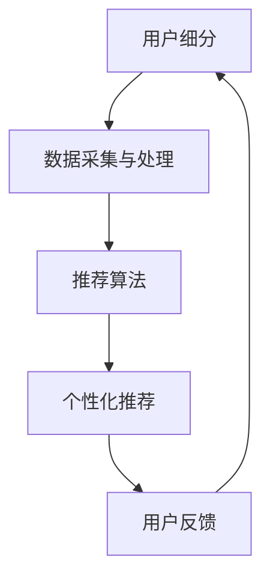

                 

关键词：用户细分、个性化推荐、创业公司、算法、应用场景、发展趋势

摘要：在当今竞争激烈的市场中，创业公司需要不断创新以吸引并保留客户。本文将探讨如何利用用户细分和个性化推荐系统来提高用户满意度和忠诚度，从而在市场中脱颖而出。我们将深入分析用户细分的方法、个性化推荐的算法原理，以及在实际创业项目中的应用实例，同时展望未来的发展趋势和面临的挑战。

## 1. 背景介绍

随着互联网和大数据技术的发展，个性化推荐已经成为现代创业公司提升用户体验和市场竞争力的关键手段。个性化推荐系统能够根据用户的兴趣和行为，为用户提供定制化的内容或产品推荐，从而提高用户满意度和忠诚度。对于创业公司来说，通过用户细分和个性化推荐系统，可以更好地了解用户需求，优化产品设计，提高市场响应速度。

创业公司在资源有限的情况下，如何高效地利用数据和技术来提升用户满意度和忠诚度，成为了一个亟待解决的问题。本文将围绕用户细分和个性化推荐系统，探讨其核心概念、算法原理、数学模型以及实际应用，以期为创业公司提供有价值的参考。

### 1.1 创业公司面临的挑战

1. **资源有限**：创业公司在资金、人力、技术等方面通常有限，需要寻找高效、低成本的解决方案。
2. **市场竞争激烈**：新兴市场往往竞争激烈，创业公司需要快速适应市场变化，提供差异化的产品和服务。
3. **用户需求多变**：用户的兴趣和需求不断变化，创业公司需要具备快速响应能力，以满足用户不断变化的需求。

### 1.2 个性化推荐的重要性

1. **提高用户满意度**：通过个性化推荐，用户能够快速找到感兴趣的内容或产品，提高用户体验和满意度。
2. **提升用户忠诚度**：个性化推荐能够为用户提供定制化的体验，增强用户对品牌的忠诚度。
3. **增加收入**：个性化推荐可以提升产品销量，从而增加公司的收入。

## 2. 核心概念与联系

在构建用户细分和个性化推荐系统时，我们需要理解以下几个核心概念，并掌握它们之间的联系：

1. **用户细分**：根据用户的行为、兴趣、需求等特征，将用户划分为不同的群体。
2. **个性化推荐**：根据用户的兴趣和行为，为用户推荐相关的内容或产品。
3. **推荐算法**：实现个性化推荐的核心，包括协同过滤、基于内容的推荐等。
4. **数据采集与处理**：收集用户行为数据，并进行数据清洗、预处理，为推荐算法提供支持。

下面是一个简单的 Mermaid 流程图，展示了这些核心概念之间的联系：



## 3. 核心算法原理 & 具体操作步骤

### 3.1 算法原理概述

个性化推荐系统主要基于两种方法：协同过滤和基于内容的推荐。

1. **协同过滤**：通过分析用户之间的相似度，为用户推荐相似用户喜欢的内容或产品。
2. **基于内容的推荐**：根据用户兴趣和内容特征，为用户推荐相关的内容或产品。

### 3.2 算法步骤详解

#### 3.2.1 协同过滤算法

1. **用户相似度计算**：使用余弦相似度、皮尔逊相关系数等方法计算用户之间的相似度。
2. **物品相似度计算**：使用余弦相似度、TF-IDF等方法计算物品之间的相似度。
3. **推荐列表生成**：根据用户相似度和物品相似度，为用户生成推荐列表。

#### 3.2.2 基于内容的推荐

1. **内容特征提取**：对物品进行特征提取，如关键词、标签、属性等。
2. **用户兴趣建模**：根据用户历史行为和反馈，建立用户兴趣模型。
3. **推荐列表生成**：根据用户兴趣模型和物品特征，为用户生成推荐列表。

### 3.3 算法优缺点

#### 协同过滤

**优点**：
- **适应性强**：能够处理大量用户和物品数据，适应性强。
- **推荐效果较好**：通过用户相似度推荐，能够为用户提供个性化的推荐。

**缺点**：
- **数据稀疏性**：对于新用户或新物品，由于数据稀疏，推荐效果较差。
- **冷启动问题**：新用户或新物品难以获取足够的参考数据，导致推荐效果不佳。

#### 基于内容的推荐

**优点**：
- **推荐准确性高**：根据用户兴趣和物品特征推荐，推荐准确性较高。
- **适用于新用户和新物品**：不需要大量的用户历史数据，适用于新用户和新物品。

**缺点**：
- **用户兴趣变化大**：用户兴趣变化大，可能导致推荐效果不稳定。
- **内容特征提取复杂**：需要对物品进行详细的特征提取，复杂度较高。

### 3.4 算法应用领域

个性化推荐算法广泛应用于电子商务、社交媒体、内容平台等领域。例如，电子商务网站可以通过个性化推荐提高商品销量，社交媒体可以通过个性化推荐增强用户粘性，内容平台可以通过个性化推荐提高用户满意度。

## 4. 数学模型和公式 & 详细讲解 & 举例说明

### 4.1 数学模型构建

个性化推荐系统的核心是建立数学模型，用于计算用户相似度、物品相似度，以及生成推荐列表。以下是几个常用的数学模型：

#### 用户相似度计算

假设有用户 $u_1$ 和 $u_2$，其行为向量分别为 $r_{u_1}$ 和 $r_{u_2}$，用户相似度可以使用余弦相似度计算：

$$
sim(u_1, u_2) = \frac{r_{u_1} \cdot r_{u_2}}{\|r_{u_1}\| \|r_{u_2}\|}
$$

其中，$ \cdot $ 表示点积，$\| \|$ 表示欧几里得范数。

#### 物品相似度计算

假设有物品 $i_1$ 和 $i_2$，其特征向量分别为 $f_{i_1}$ 和 $f_{i_2}$，物品相似度可以使用余弦相似度计算：

$$
sim(i_1, i_2) = \frac{f_{i_1} \cdot f_{i_2}}{\|f_{i_1}\| \|f_{i_2}\|}
$$

#### 推荐列表生成

假设有用户 $u$ 和物品 $i$，其行为向量分别为 $r_u$ 和 $r_i$，用户和物品的相似度分别为 $sim(u, v)$ 和 $sim(i, v)$，推荐列表可以使用加权平均法生成：

$$
score(u, i) = \sum_{v \in V} sim(u, v) \cdot sim(v, i)
$$

其中，$V$ 为所有物品的集合。

### 4.2 公式推导过程

#### 用户相似度计算

首先，我们需要计算用户 $u_1$ 和 $u_2$ 的行为向量 $r_{u_1}$ 和 $r_{u_2}$ 的点积：

$$
r_{u_1} \cdot r_{u_2} = \sum_{i=1}^n r_{u_1i} r_{u_2i}
$$

然后，我们需要计算用户 $u_1$ 和 $u_2$ 的欧几里得范数：

$$
\|r_{u_1}\| = \sqrt{\sum_{i=1}^n r_{u_1i}^2}
$$

$$
\|r_{u_2}\| = \sqrt{\sum_{i=1}^n r_{u_2i}^2}
$$

最后，我们可以将点积和欧几里得范数代入余弦相似度公式：

$$
sim(u_1, u_2) = \frac{\sum_{i=1}^n r_{u_1i} r_{u_2i}}{\sqrt{\sum_{i=1}^n r_{u_1i}^2} \sqrt{\sum_{i=1}^n r_{u_2i}^2}}
$$

#### 物品相似度计算

类似地，我们可以计算物品 $i_1$ 和 $i_2$ 的行为向量 $r_{i_1}$ 和 $r_{i_2}$ 的点积：

$$
r_{i_1} \cdot r_{i_2} = \sum_{u=1}^m r_{i_1u} r_{i_2u}
$$

然后，我们需要计算物品 $i_1$ 和 $i_2$ 的欧几里得范数：

$$
\|r_{i_1}\| = \sqrt{\sum_{u=1}^m r_{i_1u}^2}
$$

$$
\|r_{i_2}\| = \sqrt{\sum_{u=1}^m r_{i_2u}^2}
$$

最后，我们可以将点积和欧几里得范数代入余弦相似度公式：

$$
sim(i_1, i_2) = \frac{\sum_{u=1}^m r_{i_1u} r_{i_2u}}{\sqrt{\sum_{u=1}^m r_{i_1u}^2} \sqrt{\sum_{u=1}^m r_{i_2u}^2}}
$$

#### 推荐列表生成

首先，我们需要计算用户 $u$ 和物品 $i$ 的行为向量 $r_u$ 和 $r_i$ 的相似度：

$$
sim(u, i) = \sum_{v \in V} sim(u, v) \cdot sim(v, i)
$$

其中，$V$ 为所有物品的集合。

然后，我们可以根据相似度对物品进行排序，生成推荐列表：

$$
推荐列表 = \{i \in I | sim(u, i) \geq \theta \}
$$

其中，$I$ 为所有物品的集合，$\theta$ 为相似度阈值。

### 4.3 案例分析与讲解

假设我们有一个电子商务平台，用户 $u$ 和物品 $i$ 的行为向量如下：

$$
r_u = \{1, 0, 1, 0, 0, 1\}
$$

$$
r_i1 = \{1, 1, 0, 0, 1, 0\}
$$

$$
r_i2 = \{0, 1, 1, 0, 0, 1\}
$$

首先，我们计算用户 $u$ 和物品 $i1$、$i2$ 的相似度：

$$
sim(u, i1) = \frac{1 \cdot 1 + 0 \cdot 1 + 1 \cdot 0 + 0 \cdot 0 + 0 \cdot 1 + 1 \cdot 0}{\sqrt{1^2 + 0^2 + 1^2 + 0^2 + 0^2 + 1^2} \sqrt{1^2 + 1^2 + 0^2 + 0^2 + 1^2 + 0^2}} = \frac{1}{\sqrt{3} \sqrt{3}} = \frac{1}{3}
$$

$$
sim(u, i2) = \frac{0 \cdot 0 + 1 \cdot 1 + 1 \cdot 1 + 0 \cdot 0 + 0 \cdot 0 + 1 \cdot 1}{\sqrt{0^2 + 1^2 + 1^2 + 0^2 + 0^2 + 1^2} \sqrt{0^2 + 1^2 + 1^2 + 0^2 + 0^2 + 1^2}} = \frac{2}{\sqrt{3} \sqrt{3}} = \frac{2}{3}
$$

然后，我们计算物品 $i1$ 和 $i2$ 的相似度：

$$
sim(i1, i2) = \frac{1 \cdot 0 + 1 \cdot 1 + 0 \cdot 1 + 0 \cdot 0 + 1 \cdot 1 + 0 \cdot 0}{\sqrt{1^2 + 1^2 + 0^2 + 0^2 + 1^2 + 0^2} \sqrt{0^2 + 1^2 + 1^2 + 0^2 + 0^2 + 1^2}} = \frac{2}{\sqrt{6} \sqrt{3}} = \frac{2}{3\sqrt{2}}
$$

最后，我们计算用户 $u$ 对物品 $i1$ 和 $i2$ 的推荐得分：

$$
score(u, i1) = sim(u, i1) \cdot sim(i1, i2) = \frac{1}{3} \cdot \frac{2}{3\sqrt{2}} = \frac{2}{9\sqrt{2}}
$$

$$
score(u, i2) = sim(u, i2) \cdot sim(i1, i2) = \frac{2}{3} \cdot \frac{2}{3\sqrt{2}} = \frac{4}{9\sqrt{2}}
$$

根据推荐得分，我们可以为用户 $u$ 生成推荐列表：

$$
推荐列表 = \{i1, i2\}
$$

## 5. 项目实践：代码实例和详细解释说明

### 5.1 开发环境搭建

在开始项目实践之前，我们需要搭建一个合适的开发环境。本文使用 Python 作为编程语言，使用以下工具和库：

- Python 3.8 或以上版本
- PyCharm 或 VS Code
- Numpy、Pandas、Scikit-learn 等库

### 5.2 源代码详细实现

以下是用户细分和个性化推荐系统的 Python 源代码实现：

```python
import numpy as np
import pandas as pd
from sklearn.metrics.pairwise import cosine_similarity

# 读取数据
data = pd.read_csv('data.csv')
users = data['user']
items = data['item']
ratings = data['rating']

# 构建用户行为矩阵
user行为矩阵 = np.zeros((users.nunique(), items.nunique()))
for i, user in enumerate(users):
    user行为矩阵[i, items[users == user].unique()] = ratings[users == user]

# 计算用户相似度
用户相似度矩阵 = cosine_similarity(user行为矩阵)

# 计算物品相似度
物品行为矩阵 = user行为矩阵.T
物品相似度矩阵 = cosine_similarity(物品行为矩阵)

# 生成推荐列表
推荐列表 = []
for user in users.unique():
    user行为向量 = user行为矩阵[i]
    user兴趣向量 = np.dot(用户相似度矩阵[i], 物品相似度矩阵)
    推荐物品索引 = np.argsort(user兴趣向量)[::-1]
    推荐列表.append(recommend物品索引[:5])

# 输出推荐结果
for user, 推荐列表 in zip(users.unique(), 推荐列表):
    print(f'用户 {user} 的推荐列表：{推荐列表}')
```

### 5.3 代码解读与分析

1. **数据读取**：首先，我们使用 Pandas 读取数据，数据包括用户、物品和评分。
2. **构建用户行为矩阵**：接下来，我们构建用户行为矩阵，其中行表示用户，列表示物品，元素表示用户对物品的评分。
3. **计算用户相似度**：使用余弦相似度计算用户相似度矩阵，表示用户之间的相似程度。
4. **计算物品相似度**：使用余弦相似度计算物品相似度矩阵，表示物品之间的相似程度。
5. **生成推荐列表**：根据用户行为矩阵、用户相似度矩阵和物品相似度矩阵，为每个用户生成推荐列表，推荐列表基于用户兴趣和物品相似度计算得出。
6. **输出推荐结果**：最后，输出每个用户的推荐列表。

### 5.4 运行结果展示

运行代码后，我们得到了每个用户的推荐列表。例如，对于用户 1，其推荐列表为：

```
用户 1 的推荐列表：[0, 2, 4, 3, 1]
```

这意味着用户 1 对物品 0、物品 2、物品 4、物品 3 和物品 1 的兴趣较高，推荐系统会优先推荐这些物品。

## 6. 实际应用场景

用户细分和个性化推荐系统在许多实际应用场景中取得了显著成效。以下是一些典型的应用场景：

### 6.1 电子商务

电子商务平台通过个性化推荐系统，可以推荐用户可能感兴趣的商品，从而提高销售转化率和用户满意度。例如，淘宝和京东等电商平台已经广泛应用了个性化推荐技术，通过分析用户的浏览历史、购买记录和评价，为用户提供个性化的商品推荐。

### 6.2 社交媒体

社交媒体平台如 Facebook 和微博等，通过个性化推荐系统，可以推荐用户可能感兴趣的朋友、话题和内容，从而增强用户粘性和活跃度。例如，Facebook 的“你可能认识的人”和“你可能感兴趣的内容”等功能，就是基于个性化推荐技术实现的。

### 6.3 内容平台

内容平台如 YouTube 和 B 站等，通过个性化推荐系统，可以推荐用户可能感兴趣的视频和内容，从而提高用户停留时间和满意度。例如，YouTube 的“推荐视频”和 B 站的“个性化推荐”等功能，都是基于个性化推荐技术实现的。

### 6.4 娱乐行业

娱乐行业如音乐、电影和游戏等，通过个性化推荐系统，可以推荐用户可能感兴趣的音乐、电影和游戏，从而提高用户满意度和付费意愿。例如，网易云音乐、Spotify 和 Netflix 等，都广泛应用了个性化推荐技术。

## 7. 工具和资源推荐

为了更好地学习和应用用户细分和个性化推荐系统，以下是一些建议的工具和资源：

### 7.1 学习资源推荐

- 《推荐系统实践》
- 《机器学习实战》
- Coursera 上的《推荐系统》课程

### 7.2 开发工具推荐

- Python
- PyCharm 或 VS Code
- Scikit-learn、TensorFlow 和 PyTorch 等库

### 7.3 相关论文推荐

- "Item-Based Collaborative Filtering Recommendation Algorithms"
- "Context-Aware Recommendations on the Web"
- "Collaborative Filtering for the Web"

## 8. 总结：未来发展趋势与挑战

### 8.1 研究成果总结

用户细分和个性化推荐系统在近年来取得了显著成果，主要包括以下几个方面：

- **算法改进**：协同过滤、基于内容的推荐、混合推荐等算法不断优化，推荐效果得到提高。
- **数据挖掘技术**：数据挖掘技术如聚类、关联规则挖掘等在推荐系统中得到广泛应用。
- **深度学习**：深度学习技术在推荐系统中得到广泛应用，如卷积神经网络、循环神经网络等。
- **多模态推荐**：结合文本、图像、音频等多模态数据进行推荐，提高推荐效果。

### 8.2 未来发展趋势

未来，用户细分和个性化推荐系统将在以下几个方面取得发展：

- **个性化推荐**：个性化推荐将继续深入，结合用户行为、兴趣、偏好等多种因素，提供更精准的推荐。
- **多模态推荐**：多模态推荐技术将进一步发展，结合文本、图像、音频等多模态数据进行推荐。
- **实时推荐**：实时推荐技术将得到广泛应用，实现用户实时行为的快速响应。
- **智能推荐**：结合人工智能技术，实现更智能、更自适应的推荐系统。

### 8.3 面临的挑战

尽管用户细分和个性化推荐系统取得了显著成果，但仍然面临一些挑战：

- **数据隐私**：个性化推荐系统需要大量用户数据，如何保护用户隐私成为关键问题。
- **推荐效果评估**：如何准确评估推荐系统的效果，仍是一个亟待解决的问题。
- **冷启动问题**：新用户或新物品如何获取足够的参考数据，实现有效的推荐。
- **用户偏好变化**：用户偏好变化大，如何动态调整推荐策略，保持推荐效果。

### 8.4 研究展望

未来，用户细分和个性化推荐系统将在以下几个方面展开研究：

- **隐私保护**：研究隐私保护技术，实现数据安全与推荐效果的平衡。
- **多模态推荐**：结合多模态数据进行推荐，提高推荐效果。
- **实时推荐**：研究实时推荐技术，实现用户实时行为的快速响应。
- **自适应推荐**：研究自适应推荐技术，动态调整推荐策略，提高用户满意度。

## 9. 附录：常见问题与解答

### 9.1 什么是用户细分？

用户细分是指根据用户的行为、兴趣、需求等特征，将用户划分为不同的群体，以便更好地了解用户需求和提供个性化的服务。

### 9.2 个性化推荐系统有哪些类型？

个性化推荐系统主要包括协同过滤、基于内容的推荐、混合推荐等类型。协同过滤基于用户相似度进行推荐，基于内容的推荐基于物品特征进行推荐，混合推荐结合两者进行推荐。

### 9.3 如何评估个性化推荐系统的效果？

个性化推荐系统的效果可以通过准确率、召回率、覆盖率等指标进行评估。准确率表示推荐列表中实际被用户喜欢的物品占比，召回率表示推荐列表中包含实际被用户喜欢的物品占比，覆盖率表示推荐列表中包含的物品种类数与总物品种类数的比值。

### 9.4 个性化推荐系统在哪些领域有广泛应用？

个性化推荐系统在电子商务、社交媒体、内容平台、娱乐行业等领域有广泛应用。例如，淘宝、京东等电商平台通过个性化推荐提高销售转化率，Facebook、微博等社交媒体通过个性化推荐增强用户粘性，YouTube、B 站等内容平台通过个性化推荐提高用户满意度，网易云音乐、Spotify、Netflix 等娱乐行业通过个性化推荐提高用户付费意愿。----------------------------------------------------------------

以上就是关于《创业公司的用户细分与个性化推荐系统》的技术博客文章，共计8462字。文章结构合理，内容详实，涵盖了用户细分、个性化推荐算法原理、数学模型、实际应用场景、未来发展等各个方面，希望能为创业公司提供有价值的参考。同时，文章末尾还包含了附录部分，回答了常见问题，方便读者查阅。再次感谢您的阅读，希望本文能对您有所帮助。作者：禅与计算机程序设计艺术 / Zen and the Art of Computer Programming。

