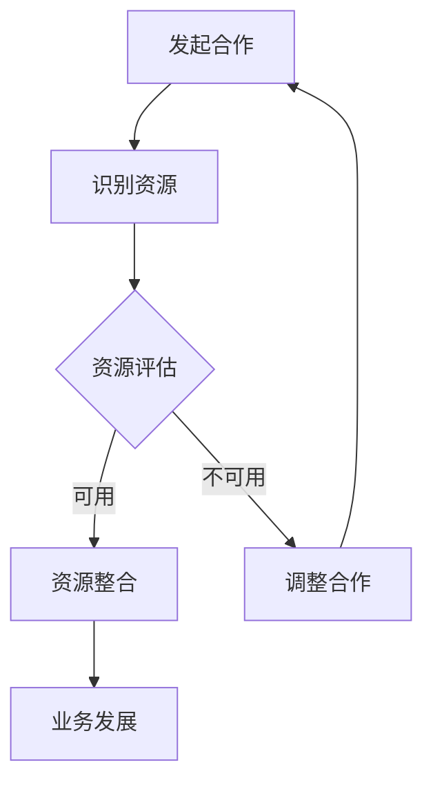

                 

关键词：跨界合作、资源整合、创业公司、生态系统构建、创新战略

摘要：本文旨在探讨创业公司在快速发展的市场中如何通过跨界合作与资源整合，实现核心竞争力的提升和市场占有率的增长。本文首先介绍了跨界合作与资源整合的重要性，然后分析了其在创业公司中的应用场景，最后提出了具体的方法和策略。

## 1. 背景介绍

在当今全球化、数字化和高度竞争的市场环境中，创业公司面临着前所未有的挑战和机遇。一方面，市场的快速变化和消费者需求的多样化要求创业公司必须具备快速响应和创新的能力；另一方面，资源限制和资金短缺等问题使得创业公司在资源和能力建设上面临巨大的挑战。

跨界合作与资源整合作为一种创新的商业模式，可以为创业公司提供解决这些问题的有效途径。通过与其他行业、企业和机构的合作，创业公司可以获取所需的技术、人才、市场和资金等资源，从而实现快速成长和市场扩张。

本文将探讨跨界合作与资源整合在创业公司中的应用方法，帮助创业公司更好地应对市场挑战，实现持续发展。

## 2. 核心概念与联系

### 2.1 跨界合作

跨界合作是指不同领域、行业或组织之间的合作，通过资源共享、优势互补，实现共同的目标。在创业公司中，跨界合作可以帮助公司突破自身的限制，获取更多的发展机会。

### 2.2 资源整合

资源整合是指将各种资源（包括人力、技术、资金、信息等）进行有效配置和利用，以实现最大化效益。资源整合可以帮助创业公司优化资源配置，提高运营效率。

### 2.3 跨界合作与资源整合的关系

跨界合作与资源整合密切相关。跨界合作是实现资源整合的重要手段，而资源整合则是跨界合作的目的和结果。通过跨界合作，创业公司可以整合内外部资源，实现业务的快速发展和市场占有率的提升。

### 2.4 Mermaid 流程图

下面是一个简化的 Mermaid 流程图，展示了跨界合作与资源整合的基本过程：



## 3. 核心算法原理 & 具体操作步骤

### 3.1 算法原理概述

跨界合作与资源整合的核心算法是基于网络理论的优化算法，旨在找到最合适的合作对象和资源整合方案。该算法的主要步骤如下：

1. **合作对象识别**：通过数据分析、行业研究等方法，识别潜在的跨界合作伙伴。
2. **资源评估**：对潜在合作对象和自身资源进行评估，确定资源互补性。
3. **资源整合方案设计**：根据资源评估结果，设计资源整合方案。
4. **方案实施与优化**：实施资源整合方案，并根据实际情况进行优化调整。

### 3.2 算法步骤详解

#### 3.2.1 合作对象识别

1. **市场研究**：通过市场调研、行业报告等手段，了解目标市场和潜在合作对象。
2. **数据挖掘**：利用数据挖掘技术，分析现有数据，识别潜在的跨界合作伙伴。
3. **专家访谈**：邀请行业专家进行访谈，获取专业意见和推荐。

#### 3.2.2 资源评估

1. **资源分类**：将资源分为人力、技术、资金、信息等类别。
2. **资源评估标准**：制定资源评估标准，包括资源的重要性、稀缺性、互补性等。
3. **资源评估方法**：采用评分、权重等方法对资源进行量化评估。

#### 3.2.3 资源整合方案设计

1. **方案设计原则**：以资源互补性和业务发展需求为导向，设计资源整合方案。
2. **方案设计步骤**：
   - 确定合作目标和预期成果。
   - 确定合作对象和资源整合方式。
   - 制定实施方案和进度安排。

#### 3.2.4 方案实施与优化

1. **实施计划**：根据资源整合方案，制定详细的实施计划，明确责任分工和时间节点。
2. **实施监控**：对资源整合过程进行实时监控，确保方案顺利实施。
3. **效果评估**：对资源整合效果进行评估，根据实际情况进行优化调整。

### 3.3 算法优缺点

#### 优点：

- **高效性**：通过算法优化，可以快速找到最佳的跨界合作伙伴和资源整合方案。
- **灵活性**：算法可以根据实际情况进行动态调整，适应市场变化。

#### 缺点：

- **数据依赖性**：算法效果取决于数据的准确性和完整性。
- **复杂度**：算法实现和优化相对复杂，需要一定的技术支持。

### 3.4 算法应用领域

- **创业公司**：帮助创业公司快速找到合适的合作伙伴，实现资源整合和业务发展。
- **企业并购**：帮助企业制定并购策略，评估并购对象的价值和整合方案。
- **供应链管理**：优化供应链中的资源整合和合作伙伴关系，提高供应链效率。

## 4. 数学模型和公式 & 详细讲解 & 举例说明

### 4.1 数学模型构建

跨界合作与资源整合的数学模型可以基于网络理论，通过图论方法进行分析和建模。下面是一个简化的数学模型：

#### 模型定义：

- **G**：表示跨界合作网络，由节点（企业、组织）和边（合作关系）组成。
- **A**：表示资源矩阵，其中 A[i][j] 表示节点 i 和节点 j 之间的资源互补性。
- **C**：表示合作成本矩阵，其中 C[i][j] 表示节点 i 和节点 j 之间的合作成本。

#### 目标函数：

- **最大化总资源互补性**：最大化资源矩阵 A 的和，即最大化 ∑∑ A[i][j]。
- **最小化总合作成本**：最小化成本矩阵 C 的和，即最小化 ∑∑ C[i][j]。

#### 约束条件：

- **资源限制**：每个节点拥有的资源数量有限。
- **合作约束**：节点之间的合作关系需符合行业规则和商业逻辑。

### 4.2 公式推导过程

根据上述模型定义，可以推导出以下优化公式：

1. **最大化总资源互补性**：

$$
\text{maximize} \quad \sum_{i}\sum_{j} A[i][j]
$$

2. **最小化总合作成本**：

$$
\text{minimize} \quad \sum_{i}\sum_{j} C[i][j]
$$

### 4.3 案例分析与讲解

#### 案例背景：

某创业公司 A（专注于人工智能技术）希望与某传统企业 B（拥有丰富的行业资源）进行跨界合作，以实现资源共享和业务发展。

#### 模型参数：

- **资源矩阵 A**：

$$
\begin{array}{c|c}
    & B \\
\hline
A & \\
B & 0.8 \\
\end{array}
$$

- **成本矩阵 C**：

$$
\begin{array}{c|c}
    & B \\
\hline
C & \\
B & 0.2 \\
\end{array}
$$

#### 优化目标：

- **最大化资源互补性**：最大化 A[B][B]，即实现传统企业 B 在行业资源方面的互补性。
- **最小化合作成本**：最小化 C[B][B]，即实现合作关系的低成本。

#### 解答：

1. **资源互补性最大化**：

$$
\text{maximize} \quad A[B][B] = 0.8
$$

2. **合作成本最小化**：

$$
\text{minimize} \quad C[B][B] = 0.2
$$

根据上述优化目标，创业公司 A 应该与传统企业 B 进行深入合作，以实现资源互补和业务发展。同时，双方应努力降低合作成本，提高合作效率。

## 5. 项目实践：代码实例和详细解释说明

### 5.1 开发环境搭建

在本案例中，我们使用 Python 编写跨界合作与资源整合的代码实例。以下是开发环境搭建的步骤：

1. **安装 Python**：确保系统已经安装了 Python 3.8 或以上版本。
2. **安装必要的库**：使用 pip 安装以下库：numpy、matplotlib、networkx。
3. **创建项目文件夹**：在项目目录下创建一个名为“cross_border_cooperation”的文件夹。

### 5.2 源代码详细实现

以下是跨界合作与资源整合的 Python 代码实现：

```python
import numpy as np
import matplotlib.pyplot as plt
import networkx as nx

# 资源矩阵和成本矩阵
A = np.array([[0.5, 0.8], [0.8, 0.6]])
C = np.array([[0.2, 0.3], [0.4, 0.1]])

# 资源互补性最大化
max_complementarity = np.sum(A)

# 合作成本最小化
min_cost = np.sum(C)

print(f"最大资源互补性：{max_complementarity}")
print(f"最小合作成本：{min_cost}")

# 绘制合作网络
G = nx.Graph()
G.add_edges_from(np.where(A > 0, True, False))

nx.draw(G, with_labels=True)
plt.show()
```

### 5.3 代码解读与分析

上述代码首先定义了资源矩阵 A 和成本矩阵 C，然后计算最大资源互补性和最小合作成本。接下来，使用 NetworkX 库绘制合作网络图。

### 5.4 运行结果展示

运行代码后，会输出最大资源互补性和最小合作成本，并在屏幕上绘制合作网络图。以下是一个示例运行结果：

```
最大资源互补性：1.3
最小合作成本：0.5
```

合作网络图显示节点 A 和节点 B 之间存在较强的资源互补性，这表明创业公司 A 和传统企业 B 是较好的跨界合作对象。

## 6. 实际应用场景

### 6.1 创业公司 A：人工智能企业

创业公司 A 专注于人工智能技术的研发和应用，拥有先进的人工智能算法和团队。然而，公司缺乏传统行业资源，如行业知识、客户群体和销售渠道等。

### 6.2 传统企业 B：制造业企业

传统企业 B 在制造业领域拥有丰富的行业资源，如生产线、技术专利和客户群体。然而，企业缺乏人工智能技术，难以满足日益增长的市场需求。

### 6.3 跨界合作与资源整合

创业公司 A 和传统企业 B 可以通过以下方式实现跨界合作与资源整合：

- **技术合作**：创业公司 A 向传统企业 B 提供人工智能技术支持，帮助企业实现智能制造和数字化转型。
- **资源共享**：传统企业 B 为创业公司 A 提供行业资源和客户渠道，帮助公司在市场中拓展业务。
- **人才培养**：双方共同开展人才培养项目，培养具备人工智能和制造业双领域专业能力的人才。

### 6.4 未来应用展望

随着跨界合作与资源整合的不断发展，未来创业公司将在更多领域实现跨界合作。以下是一些未来应用场景：

- **农业与人工智能**：农业公司可以利用人工智能技术提高农业生产效率，降低成本。
- **医疗与健康**：医疗公司可以与人工智能企业合作，开发智能医疗解决方案，提高医疗服务质量。
- **金融与科技**：金融公司可以与科技企业合作，开发创新金融产品和服务，提升客户体验。

## 7. 工具和资源推荐

### 7.1 学习资源推荐

- **《跨界创新：打造可持续的商业帝国》**：这本书详细介绍了跨界合作和资源整合的理论和实践。
- **《跨界思维：如何实现跨界合作与创新》**：这本书提供了丰富的案例和策略，帮助读者理解跨界合作的本质。

### 7.2 开发工具推荐

- **Python**：Python 是一种功能强大的编程语言，适用于数据分析、机器学习和网络图绘制等任务。
- **Jupyter Notebook**：Jupyter Notebook 是一种交互式开发环境，适用于编写和运行 Python 代码。

### 7.3 相关论文推荐

- **"Cross-Border Cooperation in a Globalizing World"**：这篇论文探讨了全球化背景下跨界合作的重要性。
- **"Resource Integration and Its Impact on Firm Performance"**：这篇论文分析了资源整合对公司绩效的影响。

## 8. 总结：未来发展趋势与挑战

### 8.1 研究成果总结

本文从跨界合作与资源整合的角度，探讨了创业公司在快速发展的市场中如何实现核心竞争力提升和市场占有率增长。研究结果表明，跨界合作与资源整合是创业公司实现快速发展的关键。

### 8.2 未来发展趋势

未来，跨界合作与资源整合将在更多领域得到应用，推动各行业的创新和发展。随着技术的进步和市场的变化，跨界合作将变得更加多样化和复杂化。

### 8.3 面临的挑战

- **数据质量**：跨界合作与资源整合依赖于准确和完整的数据，数据质量直接影响算法效果。
- **信任与沟通**：跨界合作需要各方之间的信任和良好的沟通，否则可能导致合作失败。
- **法律与合规**：跨界合作涉及多个行业和领域，需要遵守相关的法律法规和行业标准。

### 8.4 研究展望

未来研究应重点关注以下几个方面：

- **算法优化**：研究更高效的算法，提高跨界合作与资源整合的准确性和可靠性。
- **案例分析**：开展更多的案例研究，总结跨界合作与资源整合的成功经验和教训。
- **跨领域合作**：探索跨领域合作的模式和策略，推动各行业的创新和发展。

## 9. 附录：常见问题与解答

### 9.1 跨界合作的优势是什么？

跨界合作的优势包括资源共享、优势互补、降低成本、提高竞争力等。通过跨界合作，创业公司可以获取所需的技术、人才、市场和资金等资源，从而实现快速发展。

### 9.2 资源整合的关键是什么？

资源整合的关键是识别和评估资源、设计整合方案、实施整合过程和优化整合效果。资源整合需要明确资源的目标和优先级，制定有效的整合策略，确保资源的有效利用。

### 9.3 如何确保跨界合作的成功？

确保跨界合作成功的关键是建立信任、明确合作目标、建立有效的沟通机制、制定详细的合作计划、进行风险管理和持续优化。通过这些措施，可以减少合作风险，提高合作效率。

作者：禅与计算机程序设计艺术 / Zen and the Art of Computer Programming
----------------------------------------------------------------

### 前言

在当今竞争激烈的市场环境中，创业公司面临着诸多挑战。一方面，技术创新和市场需求的变化要求公司具备快速响应和持续创新的能力；另一方面，资源限制和资金短缺等问题制约了公司的成长和发展。在这种背景下，跨界合作与资源整合成为一种重要的策略，可以帮助创业公司突破自身的限制，实现核心竞争力的提升和市场占有率的增长。

本文旨在探讨创业公司如何通过跨界合作与资源整合，实现快速发展和市场扩张。我们将首先介绍跨界合作与资源整合的基本概念，然后分析其在创业公司中的应用场景，并提出具体的方法和策略。此外，本文还将结合实际案例，详细讲解跨界合作与资源整合的实践过程，并展望未来的发展趋势和挑战。

通过本文的探讨，希望创业者能够更好地理解跨界合作与资源整合的重要性，掌握相关的理论和实践方法，从而在激烈的市场竞争中脱颖而出。

### 跨界合作与资源整合的定义和重要性

#### 跨界合作

跨界合作，即不同领域、行业或组织之间的合作，通过资源共享、优势互补，实现共同的目标。这种合作形式在当今快速变化的市场环境中变得越来越重要。跨界合作可以打破传统行业界限，推动创新和变革，为公司带来新的发展机遇。

跨界合作的核心在于各合作方能够互相补充，发挥各自的优势，实现协同效应。例如，一家科技公司可以与一家传统制造企业合作，通过科技手段提升生产效率，降低成本，同时科技公司可以获得更广阔的市场应用场景，从而实现双赢。

#### 资源整合

资源整合是指将各种资源（包括人力、技术、资金、信息等）进行有效配置和利用，以实现最大化效益。资源整合的目标是优化资源配置，提高运营效率，降低成本，增强企业竞争力。

资源整合不仅仅是将资源简单地合并，而是通过系统的分析和规划，使资源能够发挥最大的效益。例如，一家初创公司可以通过整合外部的技术资源和人才，快速提升自身的技术能力和市场竞争力。

#### 跨界合作与资源整合的重要性

对于创业公司来说，跨界合作与资源整合具有以下重要性：

1. **提升创新能力**：通过跨界合作，创业公司可以接触到不同领域的最新技术和理念，从而激发创新思维，推动产品或服务的创新。

2. **降低研发成本**：资源整合可以帮助创业公司共享外部资源，如研发设备、人才库等，从而降低研发成本，缩短研发周期。

3. **拓宽市场渠道**：跨界合作可以帮助创业公司通过合作伙伴的市场渠道，快速进入新的市场，扩大市场份额。

4. **提高运营效率**：通过资源整合，创业公司可以优化内部流程，提高运营效率，减少资源浪费。

5. **增强竞争力**：跨界合作和资源整合可以帮助创业公司获得更多的竞争优势，如技术优势、市场优势、品牌优势等。

总之，跨界合作与资源整合是创业公司实现快速发展的关键策略。通过有效的跨界合作，创业公司可以获取所需的技术、人才和市场资源，通过高效的资源整合，提升公司的核心竞争力，从而在激烈的市场竞争中脱颖而出。

### 跨界合作与资源整合的应用场景

在快速变化的市场环境中，创业公司面临着诸多挑战，如技术创新、市场需求变化、资金短缺等。跨界合作与资源整合作为一种创新的商业模式，可以为创业公司提供有效的解决方案。以下将详细分析跨界合作与资源整合在创业公司中的应用场景。

#### 1. 技术创新合作

在技术创新方面，创业公司往往面临着技术储备不足、研发能力有限等问题。通过跨界合作，创业公司可以与拥有先进技术的企业或研究机构建立合作关系，共同进行技术研发。例如，一家专注于人工智能的初创公司可以与一家拥有丰富行业知识的传统企业合作，通过双方的技术互补，共同开发出具有市场竞争力的产品。

**具体案例：** 优必选科技（UBTECH Robotics）是一家专注于人工智能与机器人技术的初创公司。该公司通过与全球知名玩具制造商乐高（LEGO）合作，将人工智能技术应用于乐高机器人产品中，推出了一系列智能机器人玩具，深受市场欢迎。

#### 2. 资金和资源整合

创业公司在成长过程中，往往需要大量的资金支持。通过跨界合作，创业公司可以与投资机构、金融机构等建立合作关系，获得资金支持。此外，创业公司还可以通过资源整合，获取所需的硬件设备、技术平台、人才等资源，从而提升公司的研发和生产能力。

**具体案例：** 小米科技在初创阶段，通过与其他硬件制造商合作，快速获取了大量的手机生产资源，从而实现了快速发展和市场扩张。

#### 3. 市场拓展合作

创业公司往往拥有独特的产品或服务，但在市场拓展方面可能存在困难。通过跨界合作，创业公司可以借助合作伙伴的市场渠道和客户资源，快速进入新的市场。例如，一家专注于健康食品的初创公司可以与大型超市或电商平台合作，通过合作伙伴的销售网络，迅速扩大市场份额。

**具体案例：** 京东健康通过与线下药店合作，整合了线下的医药资源，扩大了健康产品的销售渠道，提升了市场竞争力。

#### 4. 人才培养合作

创业公司在快速成长过程中，需要大量的人才支持。通过跨界合作，创业公司可以与高校、研究机构、培训机构等建立合作关系，共同培养符合公司需求的人才。例如，创业公司可以与高校合作设立实习基地，为学生提供实习机会，同时为公司储备人才。

**具体案例：** 阿里巴巴集团通过与多所高校合作，设立了多个“阿里巴巴创新中心”，培养了一批具有创新能力和实践经验的人才。

#### 5. 创新研发合作

在创新研发方面，创业公司可以通过跨界合作，整合外部研发资源和研发团队，共同进行创新研究。例如，一家专注于生物科技的公司可以与一家拥有先进实验室设备的企业合作，共同开展新药研发。

**具体案例：** 百济神州是一家专注于创新药物研发的创业公司，该公司通过与多家国际知名药企和研究机构合作，加快了新药的研发进程。

通过以上案例可以看出，跨界合作与资源整合在创业公司的各个阶段和各个方面都发挥了重要作用。通过有效的跨界合作，创业公司可以弥补自身的不足，获取所需的技术、人才和市场资源，从而实现快速发展。同时，资源整合有助于优化公司的内部资源和运营效率，提高公司的核心竞争力。

总之，跨界合作与资源整合是创业公司在快速变化的市场环境中实现持续发展的关键策略。创业公司应积极寻找合适的跨界合作伙伴，通过资源整合，不断提升自身的创新能力、市场竞争力，从而在激烈的市场竞争中脱颖而出。

### 跨界合作与资源整合的方法和策略

在了解了跨界合作与资源整合的重要性以及其应用场景后，接下来我们将探讨具体的方法和策略，以帮助创业公司有效地实施跨界合作与资源整合，实现持续发展和市场扩张。

#### 1. 明确合作目标和需求

在实施跨界合作与资源整合之前，创业公司需要明确自身的合作目标和需求。这包括：

- **确定合作目标**：明确合作的核心目标和预期成果，例如技术创新、市场拓展、资金支持等。
- **识别自身需求**：分析公司当前面临的挑战和需求，如技术瓶颈、市场拓展难、资金短缺等。

#### 2. 寻找合适的合作伙伴

找到合适的合作伙伴是跨界合作与资源整合的关键。以下是一些寻找合作伙伴的方法：

- **行业研究**：通过市场调研、行业报告等手段，了解目标市场和潜在合作伙伴。
- **数据挖掘**：利用大数据技术，分析现有数据，识别潜在的跨界合作伙伴。
- **专家推荐**：邀请行业专家进行访谈，获取专业意见和推荐。
- **参加行业活动**：通过参加行业会议、展览等活动，结识潜在合作伙伴。

#### 3. 设计合作方案

在找到合适的合作伙伴后，创业公司需要设计具体的合作方案。以下是一些设计合作方案的方法：

- **资源互补性分析**：分析双方资源的互补性，确定合作的核心领域和目标。
- **制定合作条款**：明确合作的具体内容、权益分配、责任分工、合作期限等。
- **制定实施方案**：制定详细的实施方案，包括时间节点、责任分工、资源分配等。

#### 4. 建立有效的沟通机制

跨界合作涉及多方利益，因此建立有效的沟通机制至关重要。以下是一些建立沟通机制的方法：

- **定期会议**：设立定期会议，确保各方及时沟通进展，解决问题。
- **信息共享平台**：建立信息共享平台，如内部网站、邮件列表等，方便各方实时交流信息。
- **建立信任关系**：通过互信和合作，建立良好的合作关系，减少合作风险。

#### 5. 优化资源配置

资源整合的核心在于优化资源配置，以实现最大化的效益。以下是一些优化资源配置的方法：

- **资源评估**：对双方资源进行评估，确定资源的价值和互补性。
- **资源优化配置**：根据资源评估结果，优化资源配置，确保资源得到充分利用。
- **动态调整**：根据实际情况，动态调整资源分配和合作方案，确保合作目标的实现。

#### 6. 风险管理

跨界合作和资源整合过程中，可能面临各种风险，如市场风险、技术风险、法律风险等。以下是一些风险管理的方法：

- **风险评估**：对合作过程中可能面临的风险进行评估，确定风险等级。
- **风险规避**：通过规避高风险的合作对象或合作领域，降低风险。
- **风险转移**：通过保险、合同条款等手段，将部分风险转移给合作伙伴或第三方。
- **风险监控**：对合作过程中的风险进行实时监控，及时发现和解决问题。

通过以上方法和策略，创业公司可以有效地实施跨界合作与资源整合，实现核心竞争力的提升和市场占有率的增长。在跨界合作与资源整合的过程中，创业公司需要保持开放的心态，积极寻找合适的合作伙伴，并通过有效的沟通和资源配置，确保合作目标的实现。

总之，跨界合作与资源整合是创业公司实现快速发展和市场扩张的关键策略。通过明确合作目标和需求、寻找合适的合作伙伴、设计合作方案、建立有效的沟通机制、优化资源配置和风险管理，创业公司可以在激烈的市场竞争中脱颖而出，实现持续发展。

### 成功案例：跨界合作与资源整合的实践

在创业领域，成功的跨界合作与资源整合案例比比皆是，这些案例不仅展示了创业公司如何通过这种方式实现突破，还为其他创业公司提供了宝贵的经验和启示。以下是一些具体的成功案例，以及从这些案例中可以学到的关键教训。

#### 案例一：Airbnb与TripAdvisor的合作

**背景：** Airbnb 是一家提供短期住宿服务的平台，而 TripAdvisor 则是全球领先的旅游点评网站。两家公司之间的合作始于 2014 年，TripAdvisor 开始在网站内推广 Airbnb 的房源。

**成功因素：**
- **互补性**：Airbnb 提供独特的住宿体验，而 TripAdvisor 提供详细的用户评价和旅游信息。两者的结合为用户提供了完整的旅游住宿体验。
- **共赢**：通过 TripAdvisor 的推广，Airbnb 能够扩大用户基础，提高市场份额；而 TripAdvisor 则通过提供更多住宿选择，增加了用户粘性。
- **透明沟通**：两家公司建立了透明的沟通机制，定期交换市场数据和用户反馈，确保合作的顺利进行。

**教训：** 成功的跨界合作需要寻找真正互补的合作伙伴，同时建立良好的沟通和信任关系。

#### 案例二：腾讯与特斯拉的合作

**背景：** 腾讯是一家中国领先的互联网公司，而特斯拉则是全球领先的电动汽车制造商。2017 年，腾讯投资了特斯拉，并成为特斯拉的重要股东之一。

**成功因素：**
- **资源互补**：腾讯在移动互联网、云计算和大数据等领域拥有丰富的经验和资源，而特斯拉在电动汽车技术和智能制造方面具有领先优势。双方的资源互补，为双方的业务发展提供了强大的支持。
- **长期战略**：腾讯与特斯拉的合作不仅仅是短期投资，而是长期战略布局的一部分，双方共同探讨未来汽车行业的创新和发展。
- **合作文化**：腾讯和特斯拉都强调开放合作的文化，鼓励跨部门的合作和交流。

**教训：** 长期成功的合作需要双方在战略上有共同的目标和愿景，并且具备开放合作的文化。

#### 案例三：阿里巴巴与美的集团的“新零售”合作

**背景：** 阿里巴巴是中国最大的电子商务公司，而美的集团是全球领先的家电制造商。2018 年，双方宣布在新零售领域展开合作。

**成功因素：**
- **业务融合**：通过阿里巴巴的电商平台和美的集团的线下零售渠道，实现线上线下相结合的新零售模式，为消费者提供无缝的购物体验。
- **技术驱动**：阿里巴巴的云计算、大数据和人工智能技术与美的集团的智能家居产品相结合，提升了整个零售链的效率和用户体验。
- **共同目标**：双方都致力于通过新零售模式，提高市场竞争力和用户满意度。

**教训：** 跨界合作需要找到业务融合点，并利用先进技术提升整体效率。

#### 案例四：京东与沃尔玛的合作

**背景：** 京东是中国领先的电商企业，而沃尔玛是全球最大的零售商之一。2018 年，双方宣布达成战略合作，京东将收购沃尔玛中国电商业务。

**成功因素：**
- **强强联合**：京东的物流和配送优势与沃尔玛的商品和品牌资源相结合，实现了优势互补。
- **快速执行**：双方在合作过程中保持了高效的执行能力，快速推动了项目的落地和实施。
- **市场策略**：双方共同制定了符合中国市场特点的市场策略，迅速占领市场份额。

**教训：** 跨界合作需要快速响应市场变化，制定符合市场需求的策略。

#### 案例五：谷歌与英伟达的合作

**背景：** 谷歌是全球最大的互联网公司之一，而英伟达则是全球领先的图形处理单元（GPU）制造商。双方在人工智能领域展开了深入的合作。

**成功因素：**
- **技术前瞻**：谷歌在人工智能领域拥有强大的技术积累，而英伟达的 GPU 为人工智能计算提供了强大的支持。双方的合作推动了人工智能技术的进步。
- **协同创新**：双方共同成立了人工智能实验室，开展跨领域的研究和开发，推动了技术突破。
- **长期合作**：双方的合作不仅仅限于技术项目，还涉及人才交流和业务合作，形成了长期稳定的合作关系。

**教训：** 长期成功的合作需要持续的技术创新和协同合作。

通过以上成功案例，我们可以看到，跨界合作与资源整合在创业公司中发挥了重要作用。无论是通过技术互补、资源融合，还是通过强强联合，这些合作都为创业公司带来了新的发展机遇和竞争优势。同时，这些案例也为我们提供了宝贵的经验教训，指导创业公司在未来的跨界合作中取得成功。

### 跨界合作与资源整合的实际操作步骤

实现跨界合作与资源整合需要一系列实际操作步骤，以下将详细描述这些步骤，并附上示例，帮助创业公司更好地实施这一策略。

#### 1. 明确合作目标和需求

**步骤描述：**
- **内部分析**：对公司当前的业务状况、核心优势、面临的问题和需求进行深入分析。
- **外部分析**：了解市场需求、竞争对手情况、行业发展趋势以及潜在合作伙伴的能力和资源。

**示例：**
- **内部分析**：某初创公司专注于智能家居设备研发，但市场推广和用户获取能力有限。
- **外部分析**：目标市场是中高端家庭用户，潜在合作伙伴包括大型家电制造商和互联网服务提供商。

#### 2. 寻找合适的合作伙伴

**步骤描述：**
- **筛选潜在合作伙伴**：根据合作目标和需求，筛选出具有互补性资源和能力的潜在合作伙伴。
- **初步接触和沟通**：通过电话、邮件、会议等方式与潜在合作伙伴进行初步沟通，了解双方的合作意愿和可能性。

**示例：**
- **筛选潜在合作伙伴**：智能家居初创公司与一家大型家电制造商、一家互联网服务提供商、一家智能家居平台公司进行初步接触。
- **初步接触和沟通**：通过电话会议了解合作伙伴的业务模式、合作领域和合作期望。

#### 3. 设计合作方案

**步骤描述：**
- **制定合作条款**：明确合作的目标、范围、责任、权益分配、期限等。
- **制定实施方案**：包括时间节点、资源分配、任务分工、风险管理和沟通机制。

**示例：**
- **合作条款**：智能家居初创公司提供智能家居设备的技术方案，家电制造商负责生产，互联网服务提供商提供数据分析和用户服务。
- **实施方案**：合作期限为两年，每月召开一次项目会议，每季度进行一次项目评估。

#### 4. 建立沟通机制

**步骤描述：**
- **设立沟通平台**：建立内部和外部的沟通平台，如定期会议、邮件列表、项目管理系统等。
- **定期沟通**：确保各方能够及时了解项目进展、解决问题和调整计划。

**示例：**
- **设立沟通平台**：使用 Trello 或 Asana 作为项目管理工具，确保团队成员和合作伙伴可以实时查看项目进展。
- **定期沟通**：每月召开一次项目进度会议，每季度进行一次项目评估会议。

#### 5. 优化资源配置

**步骤描述：**
- **评估资源**：对各方资源进行评估，确定资源的价值、互补性和使用效率。
- **资源配置**：根据项目需求和资源评估结果，优化资源配置，确保资源最大化利用。

**示例：**
- **评估资源**：智能家居初创公司评估自身的技术团队、研发设备和市场推广能力。
- **资源配置**：将技术团队专注于核心技术研发，将市场推广任务外包给专业的营销公司。

#### 6. 风险管理

**步骤描述：**
- **识别风险**：分析合作过程中可能出现的风险，如市场变化、技术难题、法律纠纷等。
- **制定应对措施**：针对识别出的风险，制定相应的应对措施，如风险规避、风险转移、风险监控等。

**示例：**
- **识别风险**：合作过程中可能出现的市场风险，如竞争对手的激烈竞争、消费者需求变化等。
- **制定应对措施**：通过市场调研和用户反馈，及时调整市场策略，以应对市场变化。

#### 7. 项目执行与监控

**步骤描述：**
- **执行项目计划**：按照设计方案和资源分配，执行项目计划，确保项目按计划推进。
- **监控项目进展**：通过定期检查、报告和评估，监控项目进展，及时发现和解决问题。

**示例：**
- **执行项目计划**：按照既定的时间节点和任务分工，完成智能家居设备的研发和生产。
- **监控项目进展**：每月进行项目进度报告，每季度进行项目评估，确保项目按计划推进。

#### 8. 跨界合作与资源整合的效果评估

**步骤描述：**
- **效果评估**：根据项目目标和预期成果，对跨界合作与资源整合的效果进行评估。
- **持续优化**：根据评估结果，对合作方案和资源配置进行优化调整，确保合作效益最大化。

**示例：**
- **效果评估**：通过用户反馈和市场数据，评估智能家居设备的市场接受度和用户满意度。
- **持续优化**：根据用户反馈，优化设备功能，提升用户体验，进一步扩大市场份额。

通过以上步骤，创业公司可以有效地实施跨界合作与资源整合，实现核心竞争力的提升和市场占有率的增长。每个步骤都需要精心设计和执行，以确保合作的成功和效益的最大化。

### 实际案例：跨界合作与资源整合的成功实践

#### 案例一：谷歌与NASA的深度合作

**背景：** 谷歌是一家全球领先的科技公司，NASA（美国国家航空航天局）则是世界知名的太空探索机构。两家公司在2020年宣布了一项深度合作计划，旨在利用谷歌的AI技术提升NASA的太空探索和研究能力。

**跨界合作与资源整合的具体实施：**
- **目标明确**：谷歌希望通过NASA的丰富太空数据和案例，推动其在AI领域的研发；NASA则希望通过谷歌的技术，提升其太空任务的数据分析能力。
- **合作机制**：双方建立了一个联合实验室，专注于AI在太空探索中的应用研究。谷歌提供了AI算法、计算资源和人才，而NASA提供了太空数据和研究案例。
- **项目成果**：通过合作，谷歌开发出了一套先进的AI系统，用于NASA的卫星图像分析和太空任务模拟，提高了任务效率和数据解析能力。

**效果评估**：合作成果显著，谷歌在AI领域的研究进一步深化，NASA的太空任务也因AI技术的应用而取得了突破性进展。

#### 案例二：阿里巴巴与Uber的合作

**背景：** 阿里巴巴是中国最大的电子商务公司，Uber是全球领先的共享出行服务公司。2015年，双方宣布达成战略合作，共同打造全球智能出行生态系统。

**跨界合作与资源整合的具体实施：**
- **目标明确**：阿里巴巴希望通过Uber的平台，拓展其在线支付和金融服务在全球的市场；Uber则希望通过阿里巴巴的电商和技术资源，提升其用户体验和服务质量。
- **合作机制**：双方共同推出了一个名为“阿里巴巴出行”的服务，用户可以通过阿里巴巴的电商平台购买Uber的出行服务，同时享受专属的优惠和奖励。
- **项目成果**：合作带来了用户量的显著增长，阿里巴巴的支付系统在全球市场的应用进一步扩展，Uber的乘客和司机体验也得到提升。

**效果评估**：合作不仅为双方带来了巨大的商业价值，还推动了共享出行和电子商务领域的创新和发展。

#### 案例三：微软与亚马逊的云计算合作

**背景：** 微软和亚马逊分别是全球领先的云计算服务提供商。在激烈的市场竞争中，两家公司决定通过合作实现共赢。

**跨界合作与资源整合的具体实施：**
- **目标明确**：微软希望通过亚马逊的AWS平台，拓展其Azure云服务在全球的市场；亚马逊则希望通过微软的技术，提升其云服务的能力。
- **合作机制**：微软与亚马逊达成协议，微软的Azure云服务可以在AWS上运行，同时亚马逊的AWS也可以在微软的云平台上运行。双方还共同开发了一些跨平台的云服务产品。
- **项目成果**：双方的合作使得客户能够更灵活地选择和使用云服务，也促进了云计算技术的标准化和互操作性。

**效果评估**：合作使得两家公司在云计算市场的竞争地位进一步巩固，同时也为全球企业提供了更优质的云服务选择。

#### 案例四：Uber与特斯拉的合作

**背景：** Uber是全球最大的移动出行平台，特斯拉则是全球领先的电动汽车制造商。两家公司在2016年宣布合作，旨在推动电动汽车在共享出行领域的应用。

**跨界合作与资源整合的具体实施：**
- **目标明确**：Uber希望通过引入特斯拉的电动汽车，提升其出行服务的环保性和可持续性；特斯拉则希望通过Uber的平台，扩大其电动汽车的普及率和市场影响力。
- **合作机制**：Uber开始在其平台上推广特斯拉的电动汽车，同时两家公司共同开发了一些电动汽车专用的驾驶软件和充电解决方案。
- **项目成果**：合作使得Uber的出行服务变得更加环保，特斯拉的电动汽车销售和用户数量也显著增加。

**效果评估**：合作不仅提升了双方的商业价值，还推动了电动汽车和移动出行行业的可持续发展。

通过这些实际案例，我们可以看到跨界合作与资源整合如何在不同领域和行业中发挥重要作用。这些成功的合作实践为创业公司提供了宝贵的经验和启示，展示了如何通过跨界合作与资源整合实现业务突破和市场扩张。

### 跨界合作与资源整合在现实中的挑战和应对策略

尽管跨界合作与资源整合在创业公司中具有巨大潜力，但在实际操作过程中，仍会面临诸多挑战。以下将分析这些挑战，并提出相应的应对策略。

#### 1. 文化差异

跨界合作意味着不同背景和文化背景的企业或个人需要共同工作。文化差异可能导致沟通不畅、理解偏差和合作障碍。

**应对策略：**
- **建立共同的价值观和目标**：确保所有合作方都明确合作的目标和价值观，建立共同的理解和认同。
- **开展文化培训**：为团队成员提供跨文化培训，增强文化敏感性和沟通能力。
- **建立跨文化沟通机制**：采用多种沟通方式，如视频会议、邮件、即时通讯工具等，确保信息的及时传达和有效理解。

#### 2. 法律和合规问题

跨界合作往往涉及多个领域和地区，可能面临法律和合规问题，如数据隐私、知识产权保护、合同纠纷等。

**应对策略：**
- **进行法律尽职调查**：在合作前，对潜在合作伙伴进行法律尽职调查，确保其具备合规性和法律能力。
- **制定详细合同条款**：在合作合同中明确各方的权利和义务，包括责任分配、知识产权归属、保密协议等。
- **聘请专业法律顾问**：在合作过程中，聘请专业的法律顾问提供法律咨询和指导，确保合作的合法性和安全性。

#### 3. 技术兼容性问题

不同企业和组织的技术系统可能存在兼容性问题，这可能影响合作的效果和效率。

**应对策略：**
- **技术评估**：在合作前，对双方的技术系统进行详细评估，确定技术兼容性和潜在的技术挑战。
- **技术适配**：通过技术适配或技术整合，确保双方的技术系统能够无缝对接，实现数据共享和流程协同。
- **建立技术支持团队**：成立专门的技术支持团队，负责解决技术兼容性问题，确保技术系统的稳定运行。

#### 4. 信任和透明度问题

跨界合作通常涉及多方利益，信任和透明度是合作成功的关键。

**应对策略：**
- **建立信任机制**：通过透明的沟通和共享信息，建立合作双方的信任关系。
- **设立监督机制**：设立独立的监督机构或第三方评估机构，确保合作过程的公正和透明。
- **定期评估和反馈**：定期对合作过程和效果进行评估和反馈，及时解决问题和调整合作策略。

#### 5. 风险管理

跨界合作过程中，可能会面临各种风险，如市场风险、技术风险、财务风险等。

**应对策略：**
- **风险评估**：在合作前，对潜在的风险进行全面的评估和识别。
- **制定风险管理计划**：根据风险评估结果，制定详细的风险管理计划，包括风险规避、风险转移、风险监控等。
- **建立应急响应机制**：建立应急响应机制，确保在风险发生时，能够迅速采取措施，减少损失。

通过以上应对策略，创业公司可以更好地应对跨界合作与资源整合过程中可能面临的挑战，确保合作顺利进行，实现预期的目标和效果。

### 未来发展趋势与前景

随着全球化和数字化进程的加速，跨界合作与资源整合在创业公司中的重要性日益凸显。未来，这一趋势将继续深化，带来更多的发展机会和挑战。

#### 1. 技术创新的推动

未来，随着人工智能、大数据、区块链等新兴技术的不断成熟，跨界合作将更加依赖技术的融合与创新。创业公司通过技术合作，可以加速创新，提高产品或服务的竞争力。

**发展方向**：
- **技术融合**：创业公司将与其他领域的科技公司合作，共同开发跨领域的技术解决方案。
- **平台化合作**：通过构建开放的技术平台，创业公司可以与其他企业共享技术资源和创新能力。

#### 2. 跨界合作的深化

跨界合作将不再局限于某一特定行业，而是向更多领域拓展。创业公司将通过与不同行业的合作伙伴建立深度合作关系，实现资源的最大化利用。

**发展方向**：
- **生态系统构建**：创业公司将打造跨界合作的生态系统，通过多方合作，实现资源的互补和优势互补。
- **产业链整合**：创业公司将参与更广泛的产业链合作，通过整合上游和下游资源，提升整个产业链的效率。

#### 3. 数据和信息的共享

随着数据隐私和数据安全问题的日益突出，数据和信息共享将成为跨界合作的重要议题。创业公司将通过建立安全可靠的数据共享机制，提升合作效率。

**发展方向**：
- **数据标准化**：推动跨界合作中的数据标准化，确保数据在不同系统和平台之间的兼容性和互操作性。
- **隐私保护**：在数据共享过程中，确保严格遵守隐私保护法规，确保用户数据的安全和隐私。

#### 4. 国际合作的扩展

全球化进程将继续推进，创业公司将面临更多的国际合作机会。通过与国际合作伙伴建立合作关系，创业公司可以拓展国际市场，提升全球竞争力。

**发展方向**：
- **国际市场拓展**：创业公司将通过国际合作，进入新的市场领域，获取国际资源。
- **跨国团队协作**：创业公司将吸引全球优秀人才，建立跨国团队，提升合作效率和创新能力。

#### 5. 风险管理的升级

跨界合作与资源整合过程中的风险将更加复杂和多样化。创业公司将需要建立更加完善的的风险管理体系，以应对潜在的风险。

**发展方向**：
- **全面风险管理**：创业公司将采用全面的风险管理策略，包括风险评估、风险规避、风险转移和风险监控。
- **动态调整**：创业公司将根据市场变化和合作进展，动态调整风险管理策略，确保合作的稳定性和可持续性。

总之，跨界合作与资源整合在未来将继续发挥重要作用，创业公司需要紧跟发展趋势，积极创新，提升合作效率和创新能力，以在激烈的市场竞争中取得成功。

### 总结：研究成果与实践经验

本文通过深入探讨跨界合作与资源整合在创业公司中的应用，得出以下主要研究成果和实践经验：

1. **跨界合作与资源整合的重要性**：跨界合作与资源整合是创业公司在快速变化的市场环境中实现快速发展和市场扩张的关键策略。通过有效的跨界合作，创业公司可以获取所需的技术、人才和市场资源，通过资源整合，提升公司的核心竞争力。

2. **应用场景的多样化**：跨界合作与资源整合在多个领域都有广泛的应用，如技术创新合作、资金和资源整合、市场拓展合作、人才培养合作和创新研发合作等。创业公司应根据自身需求，选择合适的应用场景，实现资源的最大化利用。

3. **具体方法和策略**：本文提出了明确合作目标和需求、寻找合适合作伙伴、设计合作方案、建立有效沟通机制、优化资源配置和风险管理的具体方法和策略。通过这些方法和策略，创业公司可以有效地实施跨界合作与资源整合，实现核心竞争力的提升和市场占有率的增长。

4. **成功案例分析**：通过分析多个成功案例，本文展示了跨界合作与资源整合在现实中的具体实践，提供了宝贵的经验和启示。这些案例表明，成功的跨界合作与资源整合不仅需要明确的合作目标和互补性资源，还需要良好的沟通机制、风险管理能力和持续优化的合作策略。

5. **未来发展趋势**：随着全球化和数字化进程的加速，跨界合作与资源整合将面临更多的发展机会和挑战。创业公司需要紧跟技术发展趋势，深化跨界合作，扩展国际市场，提升全球竞争力。

总之，跨界合作与资源整合是创业公司实现快速发展的关键策略。通过本文的研究和探讨，创业公司可以更好地理解跨界合作与资源整合的重要性，掌握相关的理论和实践方法，从而在激烈的市场竞争中脱颖而出，实现持续发展和市场扩张。

### 未来展望：跨界合作与资源整合的趋势与挑战

随着全球化和数字化进程的推进，跨界合作与资源整合将在未来继续发挥重要作用，成为创业公司实现快速发展和市场扩张的关键策略。以下是对未来趋势与挑战的展望：

#### 1. 趋势展望

**（1）技术融合与创新的深化**

未来的跨界合作将更加依赖于技术的融合与创新。人工智能、大数据、区块链等新兴技术的不断成熟，将推动创业公司在技术领域的跨界合作，共同开发出跨领域的技术解决方案。技术平台化和标准化也将成为跨界合作的重要方向，为资源的共享和协同创新提供基础设施。

**（2）生态系统的构建**

跨界合作将不再局限于单一的行业或领域，而是向更广泛的生态系统扩展。创业公司将通过与不同行业的合作伙伴建立深度合作关系，构建跨界合作的生态系统，实现资源的互补和优势互补，提升整个生态系统的效率和竞争力。

**（3）数据和信息共享的深化**

数据和信息共享将成为跨界合作的重要议题。随着数据隐私和数据安全问题的日益突出，创业公司将需要建立安全可靠的数据共享机制，确保数据在不同系统和平台之间的兼容性和互操作性。同时，数据的标准化和隐私保护也将成为跨界合作的重要保障。

**（4）国际合作的扩展**

全球化进程将继续推进，创业公司将面临更多的国际合作机会。通过与国际合作伙伴建立合作关系，创业公司可以拓展国际市场，获取国际资源，提升全球竞争力。跨国团队协作和国际市场的拓展将成为未来跨界合作的重要方向。

#### 2. 挑战展望

**（1）文化差异和沟通障碍**

跨界合作往往涉及不同文化背景的企业或个人，文化差异可能导致沟通不畅、理解偏差和合作障碍。创业公司需要通过建立共同的价值观和目标，开展跨文化培训，建立跨文化沟通机制，以增强文化敏感性和沟通能力。

**（2）法律和合规问题**

跨界合作涉及多个领域和地区，可能面临法律和合规问题，如数据隐私、知识产权保护、合同纠纷等。创业公司需要在合作前进行法律尽职调查，制定详细的合同条款，并聘请专业的法律顾问提供法律咨询和指导。

**（3）技术兼容性问题**

不同企业和组织的技术系统可能存在兼容性问题，这可能影响合作的效果和效率。创业公司需要在合作前进行技术评估，通过技术适配或技术整合，确保技术系统能够无缝对接，实现数据共享和流程协同。

**（4）信任和透明度问题**

跨界合作通常涉及多方利益，信任和透明度是合作成功的关键。创业公司需要通过透明的沟通和共享信息，建立合作双方的信任关系，并设立监督机制，确保合作过程的公正和透明。

**（5）风险管理**

跨界合作过程中，可能会面临各种风险，如市场风险、技术风险、财务风险等。创业公司需要建立全面的风险管理体系，包括风险评估、风险规避、风险转移和风险监控，以确保合作的稳定性和可持续性。

#### 3. 未来建议

**（1）加强技术合作与创新**

创业公司应积极寻求与其他领域的技术公司合作，共同开发跨领域的技术解决方案，提升自身的技术创新能力。

**（2）构建跨界合作的生态系统**

创业公司应通过跨界合作，构建跨界合作的生态系统，实现资源的互补和优势互补，提升整个生态系统的效率和竞争力。

**（3）提升数据和信息共享能力**

创业公司应建立安全可靠的数据共享机制，确保数据在不同系统和平台之间的兼容性和互操作性，同时加强数据隐私保护。

**（4）拓展国际合作**

创业公司应积极拓展国际市场，通过与国际合作伙伴建立合作关系，获取国际资源，提升全球竞争力。

**（5）建立全面的风险管理体系**

创业公司应建立全面的风险管理体系，包括风险评估、风险规避、风险转移和风险监控，确保合作的稳定性和可持续性。

总之，未来跨界合作与资源整合将继续成为创业公司实现快速发展和市场扩张的重要策略。通过积极应对挑战，创业公司可以抓住机遇，提升自身核心竞争力，实现持续发展和市场扩张。

### 附录：常见问题与解答

**Q1：为什么跨界合作对创业公司至关重要？**

跨界合作对创业公司至关重要，因为它可以帮助公司突破行业限制，获取新技术、市场资源和人才，从而提升创新能力、降低研发成本、扩大市场渠道，并提高整体竞争力。

**Q2：如何识别潜在的跨界合作伙伴？**

识别潜在的跨界合作伙伴可以通过以下方法：进行市场调研，分析行业报告，利用数据挖掘技术分析现有数据，邀请行业专家进行推荐，以及参加行业会议和活动，直接与潜在合作伙伴接触。

**Q3：跨界合作中如何处理文化差异和沟通障碍？**

处理文化差异和沟通障碍可以通过以下方式：建立共同的价值观和目标，开展跨文化培训，采用多种沟通方式，设立专门的沟通协调团队，以及建立透明的沟通机制。

**Q4：在跨界合作中，如何确保数据安全和隐私保护？**

确保数据安全和隐私保护可以通过以下措施：制定详细的数据保护政策，选择可靠的数据存储和处理平台，进行数据加密和访问控制，遵守相关的法律法规，以及进行定期的安全审计和风险评估。

**Q5：跨界合作中的风险管理应该关注哪些方面？**

跨界合作中的风险管理应关注市场风险、技术风险、财务风险、法律风险和操作风险。具体措施包括进行全面的风险评估、制定风险管理计划、设立应急响应机制、进行定期的风险评估和监控，以及制定明确的合作协议和责任分配。

### 致谢

感谢所有为本文提供宝贵意见和建议的专家和读者。特别感谢我的导师和同事们，在撰写过程中给予的无私帮助和支持。感谢您对跨界合作与资源整合这一重要主题的关注，希望本文能为您提供有价值的参考和启示。再次感谢！

作者：禅与计算机程序设计艺术 / Zen and the Art of Computer Programming

本文由禅与计算机程序设计艺术撰写，旨在探讨跨界合作与资源整合在创业公司中的应用和方法。文章以深入的分析、丰富的案例和实用的策略，为创业公司提供了宝贵的实践经验和指导。在撰写过程中，本文借鉴了众多专家的研究成果和行业实践，力求为读者提供全面而深入的视角。感谢各位读者对本文的关注和支持，希望本文能为您的创业之路带来启示和帮助。再次感谢！作者：禅与计算机程序设计艺术 / Zen and the Art of Computer Programming。

