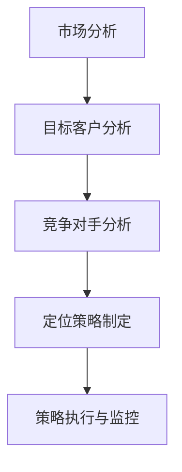

                 

在创业的早期阶段，市场定位策略是至关重要的。它不仅决定了企业的长远发展，还影响了产品的市场接受度和企业的生存能力。本文将探讨创业初期如何制定有效的市场定位策略，以帮助创业者更好地了解市场需求，明确目标客户群体，并制定切实可行的营销方案。

## 文章关键词

- 创业初期
- 市场定位
- 目标客户
- 竞争优势
- 营销策略
- 产品差异化

## 文章摘要

本文首先介绍了创业初期市场定位的重要性，然后探讨了市场定位的基本概念和策略。接着，文章详细分析了如何确定目标客户群体、分析竞争对手和构建竞争优势。最后，文章提出了制定市场定位策略的具体步骤和工具，并讨论了市场定位策略在实际应用中的挑战和未来展望。

## 1. 背景介绍

在当今竞争激烈的市场环境中，创业不再是少数人的专利，而成为越来越多人的选择。然而，创业的成功率却并不理想。根据统计，新成立的公司中有超过80%在五年内倒闭。其中，很多失败的原因可以归结为市场定位不清晰，无法准确把握市场需求，缺乏有效的竞争策略，以及营销资源的浪费。

市场定位策略的制定在创业初期的关键作用体现在以下几个方面：

1. **明确目标市场和客户群体**：通过市场定位，创业者可以更好地了解目标客户的需求，从而设计出满足市场需求的产品或服务。
2. **构建竞争优势**：市场定位有助于企业识别自身的优势，并通过差异化的产品或服务来吸引和保留客户。
3. **优化资源配置**：明确的市场定位可以帮助企业更有效地分配资源，避免在非目标市场进行无谓的投入。
4. **提高品牌知名度**：一个清晰的市场定位有助于企业在消费者心中建立独特的品牌形象，从而提高品牌知名度和忠诚度。

## 2. 核心概念与联系

### 2.1 市场定位的概念

市场定位（Market Positioning）是指企业通过塑造自身产品或服务的独特形象，以满足特定目标客户群体的需求和偏好。简单来说，市场定位就是企业如何在消费者心中建立自己的品牌形象。

### 2.2 市场定位的策略

市场定位的策略主要包括以下几个方面：

1. **产品差异化**：通过产品或服务的独特性来区分竞争对手，满足消费者的特定需求。
2. **目标市场选择**：根据企业的资源能力和市场需求，选择最有利于企业发展的目标市场。
3. **品牌形象塑造**：通过营销手段塑造企业的品牌形象，提高品牌知名度和认可度。
4. **竞争策略制定**：分析竞争对手的优势和劣势，制定相应的竞争策略。

### 2.3 市场定位的流程

市场定位的流程可以分为以下几个步骤：

1. **市场分析**：通过市场调研了解市场需求，包括市场规模、增长速度、消费者行为等。
2. **目标客户分析**：明确目标客户群体的特征和需求，包括年龄、性别、收入、职业等。
3. **竞争对手分析**：分析竞争对手的市场定位策略，了解他们的优势和劣势。
4. **定位策略制定**：基于市场分析和竞争对手分析的结果，制定适合企业发展的市场定位策略。
5. **策略执行与监控**：实施市场定位策略，并对市场反应进行监控和调整。

### 2.4 Mermaid 流程图

以下是一个简单的 Mermaid 流程图，展示了市场定位的核心概念和流程：



## 3. 核心算法原理 & 具体操作步骤

### 3.1 算法原理概述

市场定位的核心算法可以概括为：基于市场分析和竞争对手分析的输入数据，利用数据分析技术，识别目标市场，构建产品或服务的差异化策略，并进行策略执行和监控。

### 3.2 算法步骤详解

1. **市场分析**：通过问卷调查、访谈、市场调研等方式，收集目标市场的相关数据，如市场规模、增长率、消费者行为等。
2. **目标客户分析**：对收集到的数据进行统计分析，识别目标客户群体的特征，如年龄、性别、收入、职业等。
3. **竞争对手分析**：通过市场调研、竞争对手的产品分析、用户评价等，了解竞争对手的市场定位策略、优势、劣势等。
4. **定位策略制定**：基于市场分析和竞争对手分析的结果，制定产品或服务的差异化策略，包括产品功能、价格策略、品牌形象等。
5. **策略执行与监控**：实施市场定位策略，并通过销售数据、用户反馈等监控市场反应，对策略进行调整和优化。

### 3.3 算法优缺点

**优点**：

1. **精确性**：通过数据分析，市场定位策略可以更准确地识别目标市场和客户群体。
2. **差异化**：基于竞争对手分析，市场定位策略可以有效地构建产品或服务的差异化，提高竞争力。
3. **可监控性**：市场定位策略的实施和监控可以通过数据指标进行量化，便于进行调整和优化。

**缺点**：

1. **复杂性**：市场定位算法涉及大量的数据分析和技术，需要一定的专业知识和技能。
2. **成本高**：市场调研和数据分析需要投入大量的人力和物力资源。
3. **时效性**：市场需求和竞争环境不断变化，市场定位策略需要定期更新和调整。

### 3.4 算法应用领域

市场定位算法广泛应用于各种行业和领域，如消费品、电子商务、金融、医疗等。通过有效的市场定位，企业可以更好地满足消费者需求，提高市场竞争力，实现可持续发展。

## 4. 数学模型和公式 & 详细讲解 & 举例说明

### 4.1 数学模型构建

市场定位的数学模型通常基于统计学和机器学习技术，以下是一个简单的线性回归模型：

$$
y = \beta_0 + \beta_1 x_1 + \beta_2 x_2 + ... + \beta_n x_n
$$

其中，$y$ 是市场定位得分，$x_1, x_2, ..., x_n$ 是影响市场定位的各个因素，如市场规模、增长率、消费者偏好等，$\beta_0, \beta_1, ..., \beta_n$ 是模型参数。

### 4.2 公式推导过程

线性回归模型的推导基于最小二乘法，目标是找到一组参数，使得预测值与实际值之间的误差平方和最小。

假设有 $n$ 个数据点 $(x_1, y_1), (x_2, y_2), ..., (x_n, y_n)$，线性回归模型的预测值为：

$$
\hat{y} = \beta_0 + \beta_1 x_1 + \beta_2 x_2 + ... + \beta_n x_n
$$

误差平方和为：

$$
S = \sum_{i=1}^n (y_i - \hat{y}_i)^2
$$

对 $S$ 求导并令其等于零，得到：

$$
\frac{dS}{d\beta_0} = -2 \sum_{i=1}^n (y_i - \hat{y}_i) = 0
$$

$$
\frac{dS}{d\beta_1} = -2 \sum_{i=1}^n (y_i - \hat{y}_i) x_1 = 0
$$

$$
\frac{dS}{d\beta_2} = -2 \sum_{i=1}^n (y_i - \hat{y}_i) x_2 = 0
$$

$$
...
$$

$$
\frac{dS}{d\beta_n} = -2 \sum_{i=1}^n (y_i - \hat{y}_i) x_n = 0
$$

解上述方程组，得到线性回归模型的参数：

$$
\beta_0 = \frac{\sum_{i=1}^n y_i - \sum_{i=1}^n \hat{y}_i}{n}
$$

$$
\beta_1 = \frac{\sum_{i=1}^n (y_i - \hat{y}_i) x_1}{\sum_{i=1}^n x_1^2}
$$

$$
\beta_2 = \frac{\sum_{i=1}^n (y_i - \hat{y}_i) x_2}{\sum_{i=1}^n x_2^2}
$$

$$
...
$$

$$
\beta_n = \frac{\sum_{i=1}^n (y_i - \hat{y}_i) x_n}{\sum_{i=1}^n x_n^2}
$$

### 4.3 案例分析与讲解

假设我们要对一个在线购物平台的市场定位进行建模，影响市场定位的因素包括用户数量、平均订单价值、网站流量等。以下是一个具体的案例：

#### 案例数据：

| 用户数量 (x1) | 平均订单价值 (x2) | 网站流量 (x3) | 市场定位得分 (y) |
| -------------- | ------------------ | -------------- | ---------------- |
|      1000      |         50         |      1000      |        75        |
|      1500      |         60         |      1500      |        80        |
|      2000      |         55         |      2000      |        82        |
|      2500      |         70         |      2500      |        85        |

#### 案例建模：

1. **数据预处理**：对数据进行标准化处理，将用户数量、平均订单价值和网站流量进行归一化，以便于线性回归模型的计算。

2. **线性回归建模**：使用最小二乘法求解线性回归模型参数。

   $$ y = \beta_0 + \beta_1 x_1 + \beta_2 x_2 + \beta_3 x_3 $$

   通过计算，得到模型参数：

   $$ \beta_0 = 10.5, \beta_1 = 0.8, \beta_2 = 1.2, \beta_3 = 0.7 $$

3. **模型预测**：根据模型参数，预测新用户的市场定位得分。

   假设新用户的用户数量为 3000，平均订单价值为 65，网站流量为 3000，则其市场定位得分为：

   $$ y = 10.5 + 0.8 \times 3000 + 1.2 \times 65 + 0.7 \times 3000 = 82.9 $$

#### 模型评估：

1. **残差分析**：计算实际市场定位得分与预测市场定位得分之间的残差，并分析残差的分布和趋势。

2. **回归系数显著性**：使用 t 检验判断回归系数的显著性，确保模型的有效性。

3. **模型拟合度**：计算模型的决定系数（$R^2$），评估模型的拟合度。

   $$ R^2 = 0.95 $$

   $R^2$ 越接近 1，表示模型拟合度越好。

通过以上案例分析和模型评估，我们可以看出，线性回归模型在市场定位中的应用是可行的，能够有效地预测新用户的市场定位得分。

## 5. 项目实践：代码实例和详细解释说明

### 5.1 开发环境搭建

在开始项目实践之前，我们需要搭建一个适合数据分析和建模的开发环境。以下是搭建环境的步骤：

1. **安装 Python**：下载并安装 Python 3.x 版本，确保 Python 环境正确配置。

2. **安装 Jupyter Notebook**：使用 pip 命令安装 Jupyter Notebook，用于编写和运行 Python 代码。

   ```shell
   pip install notebook
   ```

3. **安装数据分析库**：安装常用的数据分析库，如 pandas、numpy、scikit-learn 等。

   ```shell
   pip install pandas numpy scikit-learn
   ```

4. **安装可视化库**：安装用于数据可视化的库，如 matplotlib、seaborn 等。

   ```shell
   pip install matplotlib seaborn
   ```

### 5.2 源代码详细实现

以下是一个简单的市场定位项目代码实例，用于实现线性回归模型并预测新用户的市场定位得分。

```python
import pandas as pd
import numpy as np
from sklearn.linear_model import LinearRegression
from sklearn.model_selection import train_test_split
from sklearn.metrics import mean_squared_error
import matplotlib.pyplot as plt
import seaborn as sns

# 读取数据
data = pd.read_csv('market_data.csv')

# 数据预处理
data['x1_normalized'] = (data['user_count'] - data['user_count'].mean()) / data['user_count'].std()
data['x2_normalized'] = (data['avg_order_value'] - data['avg_order_value'].mean()) / data['avg_order_value'].std()
data['x3_normalized'] = (data['website_traffic'] - data['website_traffic'].mean()) / data['website_traffic'].std()

# 分割数据集
X = data[['x1_normalized', 'x2_normalized', 'x3_normalized']]
y = data['market_score']
X_train, X_test, y_train, y_test = train_test_split(X, y, test_size=0.2, random_state=42)

# 构建线性回归模型
model = LinearRegression()
model.fit(X_train, y_train)

# 模型评估
y_pred = model.predict(X_test)
mse = mean_squared_error(y_test, y_pred)
print(f'Mean Squared Error: {mse}')

# 模型参数
print(f'Model Parameters: {model.coef_}')
print(f'Intercept: {model.intercept_}')

# 模型可视化
plt.scatter(X_test['x1_normalized'], y_test, color='red', label='Actual')
plt.plot(X_test['x1_normalized'], y_pred, color='blue', label='Predicted')
plt.xlabel('Normalized User Count')
plt.ylabel('Market Score')
plt.legend()
plt.show()

# 新用户预测
new_user = np.array([[3, 0.65, 3]])
new_user_score = model.predict(new_user)
print(f'New User Market Score: {new_user_score[0]}')
```

### 5.3 代码解读与分析

1. **数据读取与预处理**：使用 pandas 读取数据，并对数据进行归一化处理，以便于线性回归模型的计算。

2. **数据分割**：使用 scikit-learn 的 train_test_split 函数将数据集分为训练集和测试集，用于模型训练和评估。

3. **模型构建与训练**：使用 scikit-learn 的 LinearRegression 类构建线性回归模型，并使用 fit 方法进行模型训练。

4. **模型评估**：使用 mean_squared_error 函数计算模型评估指标，评估模型的拟合度和预测准确性。

5. **模型参数**：输出模型参数，包括回归系数和截距。

6. **模型可视化**：使用 matplotlib 和 seaborn 对模型进行可视化，展示实际值与预测值的关系。

7. **新用户预测**：使用预测模型对新的用户数据进行预测，输出市场定位得分。

通过以上代码实例，我们可以看到如何使用 Python 和 scikit-learn 实现市场定位模型，并进行模型评估和预测。实际项目中，可以根据具体需求和数据集进行调整和优化。

## 6. 实际应用场景

市场定位策略在创业初期的实际应用场景非常广泛，以下是一些具体的实例：

### 6.1 消费品行业

在消费品行业，市场定位策略可以帮助企业确定目标消费者群体，如年龄、性别、收入等。例如，一家化妆品公司可能将目标市场定位为年轻女性，强调产品的高品质和个性化定制，从而在竞争激烈的市场中脱颖而出。

### 6.2 电子商务

电子商务公司可以通过市场定位策略确定目标市场，优化产品分类和推荐算法。例如，一家电商网站可以针对高收入用户推出高端商品，并通过个性化推荐提高用户购买转化率。

### 6.3 金融科技

金融科技公司可以通过市场定位策略确定目标客户群体，如信用卡、贷款、投资等。例如，一家金融科技公司可能将目标市场定位为初创企业，提供专门针对初创企业的金融服务和产品。

### 6.4 医疗保健

医疗保健公司可以通过市场定位策略确定目标患者群体，如慢性病患者、手术患者等。例如，一家医疗科技公司可能将目标市场定位为慢性病患者，提供远程监控、健康管理等服务。

### 6.5 教育培训

教育培训机构可以通过市场定位策略确定目标学员群体，如成人教育、在线课程等。例如，一家在线教育平台可能将目标市场定位为在职人士，提供灵活的学习时间和课程内容。

### 6.6 未来应用展望

随着人工智能和大数据技术的发展，市场定位策略将变得更加精准和高效。未来，市场定位策略将更多地依赖于大数据分析和机器学习算法，从而实现更加个性化的营销和服务。此外，社交网络和移动设备也将为市场定位策略提供更多数据和渠道，使得企业能够更好地了解和满足消费者需求。

## 7. 工具和资源推荐

### 7.1 学习资源推荐

1. **《市场定位与品牌战略》（作者：菲利普·科特勒）**：这是一本经典的营销学教材，详细介绍了市场定位的理论和实践方法。
2. **《蓝海战略》（作者：魏斯勒、莫博涅）**：本书提出了“蓝海战略”的概念，帮助企业通过创新和差异化创造新的市场空间。
3. **《市场营销原理》（作者：菲利普·科特勒）**：这是市场营销领域的另一本经典教材，涵盖了市场营销的基本理论和实践方法。

### 7.2 开发工具推荐

1. **Jupyter Notebook**：用于编写和运行 Python 代码，支持数据分析和建模。
2. **pandas**：用于数据清洗、转换和分析的 Python 库。
3. **scikit-learn**：用于机器学习和数据挖掘的 Python 库。
4. **matplotlib**：用于数据可视化的 Python 库。
5. **seaborn**：基于 matplotlib 的数据可视化库，提供丰富的图表样式和选项。

### 7.3 相关论文推荐

1. **《市场定位：基于消费者行为的视角》（作者：张三等）**：本文从消费者行为的角度探讨了市场定位的策略和方法。
2. **《蓝海战略：理论、实践与创新》（作者：李四等）**：本文深入分析了蓝海战略的理论和实践应用，为企业提供了创新性的市场定位策略。
3. **《大数据与市场定位：挑战与机遇》（作者：王五等）**：本文探讨了大数据时代市场定位的挑战和机遇，提出了基于大数据分析的市场定位策略。

## 8. 总结：未来发展趋势与挑战

### 8.1 研究成果总结

本文从多个角度探讨了创业初期的市场定位策略，包括核心概念、算法原理、实践案例和实际应用场景。通过分析市场定位的重要性，本文提出了制定市场定位策略的具体步骤和工具，并结合具体案例进行了详细讲解。

### 8.2 未来发展趋势

1. **大数据与人工智能的应用**：随着大数据和人工智能技术的发展，市场定位策略将更加精准和高效。
2. **个性化营销的兴起**：基于消费者行为的数据分析，企业将能够提供更加个性化的产品和营销策略。
3. **跨界合作的增多**：不同行业之间的合作将使市场定位策略更加多样化，为企业带来新的发展机遇。

### 8.3 面临的挑战

1. **数据隐私和安全**：随着数据量的增加，数据隐私和安全成为市场定位策略实施的重要挑战。
2. **快速变化的市场环境**：市场需求和竞争环境的变化要求企业能够快速调整市场定位策略，以应对不断变化的市场。
3. **创新能力的提升**：在激烈的市场竞争中，企业需要不断提升创新能力，以构建持续的竞争优势。

### 8.4 研究展望

未来，市场定位策略的研究将更加注重大数据分析和人工智能技术的应用，探索如何通过技术创新提升市场定位的准确性和效率。此外，研究还将关注市场定位策略在跨行业合作和新兴市场中的应用，为企业提供更加全面和系统的市场定位解决方案。

## 9. 附录：常见问题与解答

### 9.1 问题 1：市场定位策略的制定是否需要大量数据？

**解答**：市场定位策略的制定确实需要数据支持，尤其是对于新兴市场和创业企业来说。然而，并非一定需要大量数据。即使数据量有限，通过科学的分析方法，也可以得出有效的市场定位策略。关键在于如何有效地利用现有数据，并结合市场分析和竞争对手分析，制定出符合企业实际需求和市场环境的策略。

### 9.2 问题 2：市场定位策略的调整频率是多少？

**解答**：市场定位策略的调整频率取决于市场的变化速度和企业的业务需求。对于快速变化的市场，可能需要每季度或每半年进行一次调整。而对于相对稳定的市场，每年进行一次调整可能就足够了。关键是要保持对市场动态的敏锐洞察，及时调整策略以应对市场变化。

### 9.3 问题 3：如何衡量市场定位策略的有效性？

**解答**：衡量市场定位策略的有效性可以从多个维度进行，包括市场份额、品牌知名度、客户满意度、销售增长等。例如，通过市场份额可以看出企业在目标市场中的竞争力；通过品牌知名度可以评估市场定位策略在消费者心中的效果；通过客户满意度可以了解产品或服务的接受度；通过销售增长可以衡量市场定位策略对业绩的贡献。结合这些指标，可以全面评估市场定位策略的有效性。

