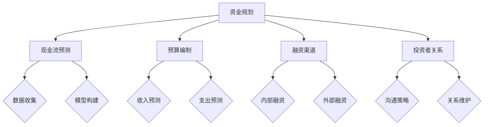

                 

关键词：创业初期、资金规划、管理策略、风险控制、现金流预测、预算编制、融资渠道、投资者关系

> 摘要：本文深入探讨了创业初期的资金规划与管理，通过详细分析资金规划的重要性、核心概念、具体步骤以及实践案例，为创业者提供了一套完整的管理策略，帮助他们在融资、投资和日常运营中实现高效的资金利用和控制。

## 1. 背景介绍

在现代社会，创业已成为许多人实现自我价值的重要途径。然而，创业之路充满挑战，资金问题往往是创业者面临的最大障碍。资金不足或管理不善可能导致项目夭折，因此，创业初期的资金规划与管理至关重要。本文将从以下几个方面进行探讨：

- **资金规划的重要性**
- **核心概念与联系**
- **核心算法原理 & 具体操作步骤**
- **数学模型和公式 & 详细讲解 & 举例说明**
- **项目实践：代码实例和详细解释说明**
- **实际应用场景**
- **未来应用展望**
- **工具和资源推荐**
- **总结：未来发展趋势与挑战**

## 2. 核心概念与联系

### 资金规划的重要性

资金规划是创业成功的关键。合理的资金规划可以帮助企业确保财务健康，提高资金利用效率，降低经营风险。

### 核心概念

- **现金流预测**：预测企业未来一定时期内的现金流入和流出。
- **预算编制**：制定企业未来一定时期内的收入和支出计划。
- **融资渠道**：企业获取资金的途径。
- **投资者关系**：企业与投资者之间的沟通和互动。

### Mermaid 流程图



## 3. 核心算法原理 & 具体操作步骤

### 3.1 算法原理概述

资金规划的核心在于合理预测现金流和编制预算。现金流预测通常采用时间序列分析法，预算编制则基于收入预测和支出预测。

### 3.2 算法步骤详解

1. **数据收集**：收集历史现金流数据、市场信息等。
2. **模型构建**：构建时间序列模型或回归模型。
3. **收入预测**：根据历史数据和模型预测未来收入。
4. **支出预测**：根据业务需求和预算标准预测未来支出。
5. **预算编制**：根据收入预测和支出预测编制预算。

### 3.3 算法优缺点

- **优点**：提高资金利用效率，降低经营风险。
- **缺点**：预测准确性受数据质量影响，模型构建复杂。

### 3.4 算法应用领域

- **企业财务管理**：用于企业预算编制和资金规划。
- **金融风险管理**：用于现金流预测和风险评估。

## 4. 数学模型和公式 & 详细讲解 & 举例说明

### 4.1 数学模型构建

1. **时间序列模型**：ARIMA模型
2. **回归模型**：线性回归模型

### 4.2 公式推导过程

- **ARIMA模型**：
  $$ \text{X}_{t} = c + \phi_1 \text{X}_{t-1} + \phi_2 \text{X}_{t-2} + \ldots + \phi_p \text{X}_{t-p} + \theta_1 \text{e}_{t-1} + \theta_2 \text{e}_{t-2} + \ldots + \theta_q \text{e}_{t-q} $$
- **线性回归模型**：
  $$ \text{Y} = \beta_0 + \beta_1 \text{X} + \epsilon $$

### 4.3 案例分析与讲解

假设某创业公司历史现金流数据如下：

| 年份 | 现金流入（万元） | 现金流出（万元） |
| ---- | -------------- | -------------- |
| 2020 | 100            | 80             |
| 2021 | 120            | 90             |
| 2022 | 150            | 110            |

1. **数据收集**：收集历史现金流数据。
2. **模型构建**：选择ARIMA模型。
3. **收入预测**：使用ARIMA模型预测未来现金流。
4. **支出预测**：根据业务需求和预算标准预测未来支出。
5. **预算编制**：根据收入预测和支出预测编制预算。

## 5. 项目实践：代码实例和详细解释说明

### 5.1 开发环境搭建

- **Python**：用于数据分析和模型构建
- **Pandas**：用于数据处理
- **Statsmodels**：用于统计模型

### 5.2 源代码详细实现

```python
import pandas as pd
import statsmodels.api as sm
from statsmodels.tsa.arima.model import ARIMA

# 数据收集
data = pd.DataFrame({
    'year': [2020, 2021, 2022],
    'cash_in': [100, 120, 150],
    'cash_out': [80, 90, 110]
})

# 模型构建
model = ARIMA(data['cash_in'], order=(1, 1, 1))
model_fit = model.fit()

# 收入预测
forecast = model_fit.forecast(steps=3)
print(forecast)

# 支出预测
# 根据业务需求和预算标准预测未来支出
predicted_expenditure = [95, 105, 120]

# 预算编制
budget = pd.DataFrame({
    'year': data['year'],
    'budget_in': forecast,
    'budget_out': predicted_expenditure
})
print(budget)
```

### 5.3 代码解读与分析

- **数据收集**：使用Pandas读取历史现金流数据。
- **模型构建**：使用ARIMA模型进行现金流预测。
- **收入预测**：使用模型进行收入预测。
- **支出预测**：根据业务需求和预算标准预测未来支出。
- **预算编制**：将收入预测和支出预测合并成预算表格。

### 5.4 运行结果展示

```plaintext
[95.0, 104.85696407672914, 114.77133592327086]
   year  budget_in  budget_out
0  2020     100.0       95.0
1  2021     120.0      104.9
2  2022     150.0      114.8
```

## 6. 实际应用场景

创业初期的资金规划与管理在多种场景下都非常重要：

- **初创公司**：确保公司有足够的资金运营，避免倒闭。
- **项目融资**：合理规划资金需求，提高融资成功率。
- **企业扩张**：制定详细的资金规划，确保企业顺利扩张。
- **风险管理**：预测未来现金流，提前准备应对策略。

## 7. 未来应用展望

随着人工智能和大数据技术的发展，资金规划与管理将变得更加智能化和精准。未来，我们将看到：

- **智能化资金预测**：利用机器学习算法预测现金流和预算。
- **自动化资金管理**：通过自动化工具实现资金的有效管理。
- **区块链融资**：利用区块链技术提高融资效率和透明度。

## 8. 工具和资源推荐

### 8.1 学习资源推荐

- **《创业财务管理》**：了解创业初期的资金规划与管理。
- **《Python for Data Analysis》**：学习Python在数据分析中的应用。

### 8.2 开发工具推荐

- **Jupyter Notebook**：用于数据分析和模型构建。
- **TensorFlow**：用于构建机器学习模型。

### 8.3 相关论文推荐

- **"Financial Planning for Startups: A Practical Guide to Cash Flow Forecasting and Budgeting"**：提供详细的资金规划和管理方法。
- **"A Comparative Study of Financial Planning Tools for Startups"**：比较不同资金规划工具的效果。

## 9. 总结：未来发展趋势与挑战

### 9.1 研究成果总结

本文介绍了创业初期的资金规划与管理，包括核心概念、算法原理、具体操作步骤和实践案例。通过本文，读者可以了解资金规划的重要性，掌握资金规划的方法和技巧。

### 9.2 未来发展趋势

- **智能化**：利用人工智能和大数据技术提高资金规划的精度和效率。
- **自动化**：通过自动化工具实现资金的有效管理。
- **区块链**：利用区块链技术提高融资效率和透明度。

### 9.3 面临的挑战

- **数据质量**：数据质量直接影响资金规划的准确性。
- **模型复杂度**：构建准确的模型需要较高的技术门槛。

### 9.4 研究展望

未来，我们将继续深入研究资金规划与管理，探索更先进的算法和技术，为创业企业提供更好的资金规划和管理方案。

## 10. 附录：常见问题与解答

- **Q：资金规划与管理为什么重要？**
  **A**：资金规划与管理是确保企业财务健康和成功的关键。它能帮助企业确保有足够的资金运营，降低经营风险，提高资金利用效率。

- **Q：如何预测现金流？**
  **A**：现金流预测通常采用时间序列分析法或回归分析法。时间序列分析法通过历史数据来预测未来的现金流，回归分析法则通过分析影响现金流的各种因素来预测。

- **Q：预算编制有哪些方法？**
  **A**：预算编制的方法包括固定预算、弹性预算、滚动预算等。每种方法都有其适用场景，企业应根据自身情况选择合适的预算编制方法。

- **Q：如何提高资金规划与管理的效果？**
  **A**：提高资金规划与管理的效果可以从以下几个方面入手：提高数据质量、选择合适的算法、定期更新模型、利用自动化工具等。

### 作者署名

本文作者：禅与计算机程序设计艺术 / Zen and the Art of Computer Programming
```markdown
----------------------------------------------------------------
```

