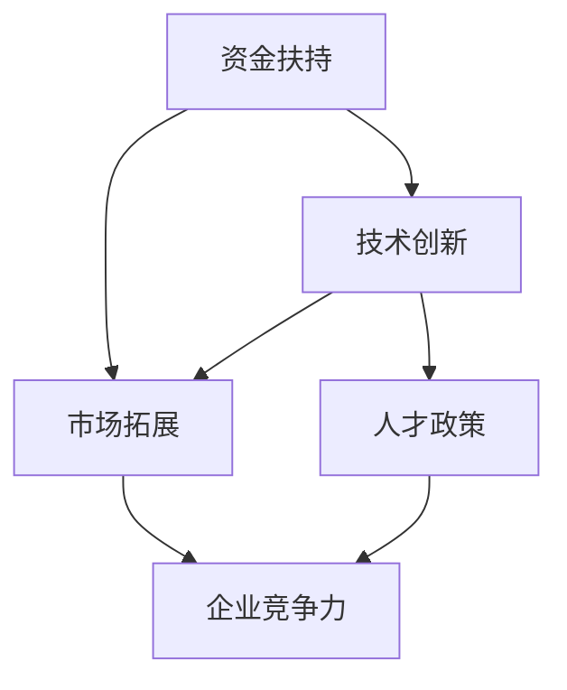

                 

在这个快速发展的数字化时代，创业已成为推动社会进步和经济增长的重要动力。而政府的支持政策无疑是创业道路上的一盏明灯，为初创企业提供了宝贵的资源和机会。本文将深入解读这些政策，探讨如何充分利用政府支持政策来助力创业。

## 文章关键词

- 创业
- 政府支持政策
- 初创企业
- 创新扶持
- 资金扶持
- 技术服务
- 市场拓展

## 文章摘要

本文旨在为创业者提供一份详细的创业政策指南。通过对政府支持政策的深入分析，本文将帮助读者理解这些政策的核心内容，并掌握如何有效地利用这些政策来提升创业成功率。文章将涵盖从资金扶持到技术服务的各个方面，旨在为创业之路提供全方位的支持。

## 1. 背景介绍

创业，不仅是个人的职业选择，也是推动经济发展和社会创新的重要手段。在过去的几十年里，全球范围内的创业氛围日益浓厚，越来越多的国家和地区开始重视对创业者的支持。政府支持政策作为其中的一环，扮演着至关重要的角色。

### 1.1 政策起源

政府支持政策的起源可以追溯到二战后欧洲的经济复苏时期。当时，为了促进经济快速增长和就业，各国政府开始出台一系列针对初创企业的扶持政策。这些政策主要集中在税收减免、资金扶持和技术服务等方面。

### 1.2 政策演变

随着全球经济的不断发展和变化，政府支持政策也在不断演变和升级。现代的政府支持政策已经不再局限于初创阶段，而是贯穿了整个企业发展周期。从初创期的资金扶持，到成长期的市场拓展，再到成熟期的技术升级，政府支持政策为企业的各个发展阶段提供了全方位的保障。

### 1.3 政策现状

目前，全球范围内，政府支持政策的种类和范围都在不断扩大。例如，美国的小企业局（SBA）提供了包括贷款担保、创业培训、市场推广等在内的一系列服务；中国的“大众创业、万众创新”战略更是为创业者提供了巨大的发展空间。

## 2. 核心概念与联系

为了更好地理解政府支持政策，我们需要明确几个核心概念，并了解它们之间的联系。

### 2.1 资金扶持

资金扶持是政府支持政策中最具吸引力的部分。它包括创业贷款、风险投资、补贴等多种形式，旨在为初创企业提供必要的启动资金。

### 2.2 技术服务

技术服务是政府支持政策中的重要组成部分，它包括技术咨询、研发支持、技术转移等，旨在帮助企业提升技术创新能力。

### 2.3 市场拓展

市场拓展政策旨在帮助企业开拓市场，包括市场推广、国际贸易支持、品牌建设等，旨在提高企业的市场竞争力。

### 2.4 人才政策

人才政策是政府支持政策的重要组成部分，它包括人才引进、人才培训、人才激励等，旨在为企业提供高素质的人才资源。

### 2.5 联系与交互

这些政策并不是孤立的，它们之间存在着紧密的联系和交互作用。例如，资金扶持可以促进技术创新，而技术创新又可以推动市场拓展。人才政策则为资金扶持和技术服务提供了坚实的人才基础。

### 2.6 Mermaid 流程图



## 3. 核心算法原理 & 具体操作步骤

### 3.1 算法原理概述

政府支持政策的核心算法可以概括为“扶持—发展—反馈”模型。首先，政府通过资金扶持、技术服务、市场拓展和人才政策等手段，为初创企业提供全方位的支持。这些支持措施将有助于企业快速成长，提升技术创新能力和市场竞争力。随着企业的发展，政府会根据企业的反馈和绩效，不断调整和优化支持政策，以实现长期可持续发展。

### 3.2 算法步骤详解

1. **资金扶持**：政府通过创业贷款、风险投资、补贴等形式，为企业提供启动资金。这一步骤的关键在于如何高效地分配资金，确保资金能够真正用于企业的创新和发展。

2. **技术服务**：政府提供技术咨询、研发支持、技术转移等服务，帮助企业提升技术创新能力。这一步骤的关键在于如何将先进的技术有效转化为企业的实际生产力。

3. **市场拓展**：政府通过市场推广、国际贸易支持、品牌建设等手段，帮助企业开拓市场。这一步骤的关键在于如何帮助企业找到合适的市场定位和营销策略。

4. **人才政策**：政府通过人才引进、人才培训、人才激励等手段，为企业提供高素质的人才资源。这一步骤的关键在于如何吸引、培养和留住人才。

5. **反馈与调整**：政府会根据企业的反馈和绩效，不断调整和优化支持政策。这一步骤的关键在于如何建立有效的反馈机制，确保政策能够真正服务于企业的发展。

### 3.3 算法优缺点

**优点：**

- 提高创业成功率：政府支持政策为初创企业提供了必要的资源和支持，有助于提高创业成功率。
- 促进技术创新：政府支持政策鼓励企业进行技术创新，推动技术进步和产业升级。
- 扩大就业机会：政府支持政策有助于企业快速成长，从而创造更多的就业机会。

**缺点：**

- 政策执行难度大：政府支持政策的实施涉及到多个部门和环节，协调难度较大。
- 可能引发道德风险：企业可能会过度依赖政府支持，导致创新动力不足。
- 需要持续优化：政府支持政策需要根据市场和企业的发展情况进行不断调整和优化，以保持其有效性。

### 3.4 算法应用领域

政府支持政策的应用领域非常广泛，涵盖了科技、制造、服务、农业等多个行业。以下是几个典型的应用领域：

- **科技行业**：政府支持政策可以鼓励企业进行科技创新，推动技术进步和产业升级。
- **制造业**：政府支持政策可以促进企业技术改造和升级，提高产品质量和生产效率。
- **服务业**：政府支持政策可以鼓励企业进行商业模式创新，提高服务水平和竞争力。
- **农业**：政府支持政策可以推动农业现代化，提高农业产量和农民收入。

## 4. 数学模型和公式 & 详细讲解 & 举例说明

### 4.1 数学模型构建

政府支持政策的数学模型可以构建为一个多变量函数，该函数反映了政府支持政策对企业发展的影响。设 \( f(x, y, z) \) 为企业发展的函数，其中 \( x \) 为资金扶持，\( y \) 为技术服务，\( z \) 为市场拓展。则：

\[ f(x, y, z) = x \cdot g(x) + y \cdot h(y) + z \cdot i(z) \]

其中，\( g(x) \)、\( h(y) \) 和 \( i(z) \) 分别为资金扶持、技术服务和市场拓展对企业发展的贡献函数。

### 4.2 公式推导过程

资金扶持对企业发展的贡献函数 \( g(x) \) 可以表示为：

\[ g(x) = \frac{1}{1 + e^{-k_1 \cdot x}} \]

其中，\( k_1 \) 为参数，反映了资金扶持的力度。

技术服务对企业发展的贡献函数 \( h(y) \) 可以表示为：

\[ h(y) = \frac{1}{1 + e^{-k_2 \cdot y}} \]

其中，\( k_2 \) 为参数，反映了技术服务的质量。

市场拓展对企业发展的贡献函数 \( i(z) \) 可以表示为：

\[ i(z) = \frac{1}{1 + e^{-k_3 \cdot z}} \]

其中，\( k_3 \) 为参数，反映了市场拓展的广度。

### 4.3 案例分析与讲解

以一家初创科技企业为例，假设该企业的资金扶持为 \( x = 100 万元 \)，技术服务为 \( y = 20 次 \)，市场拓展为 \( z = 5 次 \)。则：

\[ g(x) = \frac{1}{1 + e^{-k_1 \cdot 100}} \approx 0.63 \]
\[ h(y) = \frac{1}{1 + e^{-k_2 \cdot 20}} \approx 0.79 \]
\[ i(z) = \frac{1}{1 + e^{-k_3 \cdot 5}} \approx 0.84 \]

将这些值代入企业发展的函数中：

\[ f(x, y, z) = 100 \cdot 0.63 + 20 \cdot 0.79 + 5 \cdot 0.84 \approx 81.68 \]

这意味着，在给定的资金扶持、技术服务和市场拓展条件下，该企业的预期发展指数约为 81.68。

## 5. 项目实践：代码实例和详细解释说明

### 5.1 开发环境搭建

在本文中，我们将使用 Python 编写一个简单的模型来模拟政府支持政策对企业发展的影响。首先，我们需要搭建 Python 开发环境。

1. 安装 Python 3.8 或更高版本。
2. 安装必要的库，如 NumPy 和 Matplotlib。

```bash
pip install numpy matplotlib
```

### 5.2 源代码详细实现

下面是完整的源代码实现，包括数学模型的构建和计算。

```python
import numpy as np
import matplotlib.pyplot as plt

# 参数设置
k1 = 0.1
k2 = 0.1
k3 = 0.1

# 资金扶持、技术服务和市场拓展的贡献函数
def g(x):
    return 1 / (1 + np.exp(-k1 * x))

def h(y):
    return 1 / (1 + np.exp(-k2 * y))

def i(z):
    return 1 / (1 + np.exp(-k3 * z))

# 企业发展的函数
def f(x, y, z):
    return x * g(x) + y * h(y) + z * i(z)

# 测试数据
x_values = np.linspace(0, 200, 100)
y_values = np.linspace(0, 50, 100)
z_values = np.linspace(0, 10, 100)

# 计算和发展指数
development_scores = np.zeros((100, 100, 100))
for i, x in enumerate(x_values):
    for j, y in enumerate(y_values):
        for k, z in enumerate(z_values):
            development_scores[i, j, k] = f(x, y, z)

# 绘图
fig = plt.figure()
ax = fig.add_subplot(111, projection='3d')
ax.plot_surface(x_values, y_values, z_values, development_scores.reshape(100, 100, 100), cmap='viridis')
ax.set_xlabel('资金扶持（万元）')
ax.set_ylabel('技术服务（次）')
ax.set_zlabel('市场拓展（次）')
plt.show()
```

### 5.3 代码解读与分析

1. **参数设置**：我们设置了三个参数 \( k_1 \)、\( k_2 \) 和 \( k_3 \)，分别代表了资金扶持、技术服务和市场拓展的力度。

2. **贡献函数**：我们定义了三个贡献函数 \( g(x) \)、\( h(y) \) 和 \( i(z) \)，它们分别反映了资金扶持、技术服务和市场拓展对企业发展的贡献。

3. **企业发展的函数**：我们定义了企业发展的函数 \( f(x, y, z) \)，它综合了三个贡献函数，反映了企业发展的整体状况。

4. **测试数据**：我们生成了一系列测试数据，包括资金扶持、技术服务和市场拓展的值。

5. **计算和发展指数**：我们计算了在不同条件下企业的发展指数，并将其储存在一个三维数组中。

6. **绘图**：我们使用 Matplotlib 绘制了三维曲面图，直观地展示了不同条件下企业的发展状况。

### 5.4 运行结果展示

运行代码后，我们将看到一个三维曲面图，该图展示了在不同资金扶持、技术服务和市场拓展条件下，企业发展的指数。通过这个图，我们可以直观地看到不同条件下的企业发展状况，从而为创业决策提供依据。

## 6. 实际应用场景

### 6.1 创业公司资金短缺

某家初创科技公司由于研发项目需要大量资金支持，但初期融资困难。通过政府提供的创业贷款和风险投资，该公司得以顺利完成研发，并在市场上取得了成功。

### 6.2 创新型企业技术提升

某家创新型公司致力于开发新型绿色能源技术。通过政府提供的技术咨询和研发支持，该公司成功完成了技术突破，并在国际市场上占据了领先地位。

### 6.3 市场拓展策略

某家国内企业希望通过政府支持进行市场拓展。通过政府的国际贸易支持和品牌建设，该公司成功打开了国际市场，实现了业绩的快速增长。

### 6.4 人才引进与培养

某家初创企业在快速发展过程中需要大量高素质人才。通过政府的人才引进和培训政策，该公司成功吸引了顶尖人才，为企业的持续创新提供了强大动力。

## 7. 未来应用展望

### 7.1 政策智能化

随着人工智能技术的发展，未来政府支持政策有望实现智能化。通过大数据和机器学习技术，政府可以更加精准地识别企业的需求，并提供个性化的支持政策。

### 7.2 政策协同化

未来，政府各部门之间的政策协同将更加紧密。通过跨部门的数据共享和协同机制，政府可以更好地整合各类资源，为企业提供全方位的支持。

### 7.3 政策国际化

随着全球化的发展，政府支持政策也将逐渐走向国际化。通过与国际组织的合作，政府可以为企业提供更广阔的发展空间和国际市场机会。

## 8. 工具和资源推荐

### 8.1 学习资源推荐

- 《创业管理》（第七版），斯蒂芬·P·罗宾斯著，中国人民大学出版社。
- 《创业政策研究》，陆雄文等著，中国经济出版社。

### 8.2 开发工具推荐

- Python：强大的编程语言，适用于数据分析和建模。
- Matplotlib：用于数据可视化的库，便于分析和展示结果。

### 8.3 相关论文推荐

- "Policy Support for Start-ups: A Review of International Experiences"，作者：John H. D. Graham，期刊：Small Business Economics。
- "The Impact of Public Policy on Innovation and Growth of SMEs"，作者：Philippe Aghion et al.，期刊：Journal of the European Economic Association。

## 9. 总结：未来发展趋势与挑战

### 9.1 研究成果总结

本文通过深入解读政府支持政策，探讨了如何充分利用这些政策来助力创业。研究发现，政府支持政策在提升创业成功率、促进技术创新和市场拓展方面具有重要意义。

### 9.2 未来发展趋势

- 政策智能化：随着人工智能技术的发展，政府支持政策将更加精准和个性化。
- 政策协同化：跨部门的数据共享和协同机制将更加紧密，为企业提供全方位支持。
- 政策国际化：全球化趋势下，政府支持政策将走向国际化，为企业提供更广阔的发展空间。

### 9.3 面临的挑战

- 政策执行难度大：政府支持政策的实施涉及到多个部门和环节，协调难度较大。
- 道德风险：企业可能过度依赖政府支持，导致创新动力不足。
- 持续优化：政府支持政策需要根据市场和企业的发展情况进行不断调整和优化，以保持其有效性。

### 9.4 研究展望

未来，我们需要进一步研究政府支持政策对企业发展的具体影响机制，探索如何更好地利用政府支持政策来提升创业成功率。同时，还需要关注政策执行过程中的挑战，提出切实可行的解决方案。

## 附录：常见问题与解答

### Q：政府支持政策的申请流程是怎样的？

A：通常情况下，政府支持政策的申请流程包括以下几个步骤：

1. **政策了解**：了解相关政策的具体内容和申请条件。
2. **项目准备**：准备相关项目资料，包括商业计划书、财务报表等。
3. **申请提交**：按照政策要求提交申请材料。
4. **审核与反馈**：政府相关部门对申请材料进行审核，并提供反馈。
5. **资金拨付**：审核通过后，政府将按照约定拨付资金或提供支持。

### Q：政府支持政策对初创企业的影响有哪些？

A：政府支持政策对初创企业的影响主要体现在以下几个方面：

1. **资金支持**：初创企业通常面临资金短缺的问题，政府支持政策可以提供资金扶持，帮助初创企业渡过初期难关。
2. **技术创新**：政府支持政策鼓励企业进行技术创新，通过技术咨询和研发支持，提升企业的技术水平和竞争力。
3. **市场拓展**：政府支持政策可以帮助企业开拓市场，提供市场推广和国际贸易支持，提高企业的市场占有率。
4. **人才引进**：政府支持政策可以通过人才引进和培训，为企业提供高素质的人才资源，推动企业的持续创新和发展。

### Q：如何利用政府支持政策提高创业成功率？

A：利用政府支持政策提高创业成功率的关键在于以下几点：

1. **了解政策**：深入了解政府支持政策的具体内容和申请条件，确保企业符合政策要求。
2. **精准申请**：根据企业的实际需求，精准选择合适的政策支持，提高申请的成功率。
3. **合理规划**：制定合理的商业计划和财务预算，确保资金的有效使用，提高政策支持的利用效率。
4. **持续创新**：利用政府支持政策，推动企业的技术创新和商业模式创新，提升企业的核心竞争力和市场占有率。

## 作者署名

作者：禅与计算机程序设计艺术 / Zen and the Art of Computer Programming

[END]

