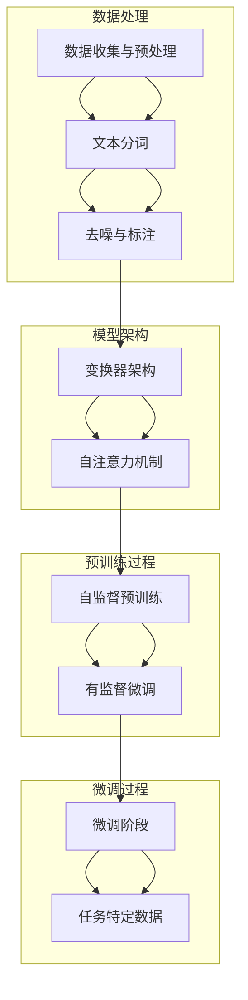

                 

关键词：大模型时代、创业者、定位、机会、人工智能、技术创新

>摘要：在大模型时代，创业者需要把握人工智能发展的脉搏，找准自己的定位，抓住市场机会。本文将深入探讨创业者如何借助大模型技术，结合市场需求，制定有效策略，实现企业的创新与突破。

## 1. 背景介绍

### 大模型时代的到来

随着深度学习技术的快速发展，大型预训练模型（如GPT-3、BERT等）已经成为了当前人工智能领域的重要突破。这些模型具有强大的语义理解和生成能力，能够处理复杂的自然语言任务。大模型时代标志着人工智能进入了一个全新的阶段，为创业者提供了丰富的创新空间。

### 创业者面临的挑战与机遇

在大模型时代，创业者需要面对技术变革带来的挑战，如技术门槛、市场不确定性和竞争压力等。同时，大模型技术也为创业者带来了前所未有的机遇，通过创新的商业模式和应用场景，创业者可以在人工智能领域实现快速成长。

## 2. 核心概念与联系

### 大模型技术原理

大模型技术基于深度学习，通过在海量数据上进行预训练，使模型具有强大的通用语义理解能力。具体而言，大模型技术包括以下几个关键环节：

- **数据收集与预处理**：收集大量高质量的文本、图像等数据，并进行预处理，如去噪、分词等。

- **模型架构设计**：设计高效的模型架构，如Transformer、BERT等，以支持大规模的训练和处理。

- **预训练**：在大量数据上进行预训练，使模型具备通用语义理解能力。

- **微调**：在特定任务上进行微调，使模型适应具体的应用场景。

### 大模型与创业者的联系

大模型技术为创业者提供了强大的工具，可以帮助他们解决以下问题：

- **自然语言处理**：利用大模型进行文本分析、生成和翻译，提高业务效率。

- **图像识别与生成**：利用大模型进行图像处理，实现自动化识别和生成。

- **推荐系统**：利用大模型进行用户行为分析，优化推荐系统。

- **决策支持**：利用大模型进行数据分析，提供智能决策支持。

## 3. 核心算法原理 & 具体操作步骤

### 3.1 算法原理概述

大模型技术基于深度神经网络，通过多层非线性变换，实现对输入数据的语义理解。具体而言，大模型技术包括以下几个核心组成部分：

- **输入层**：接收文本、图像等数据。

- **隐藏层**：进行特征提取和变换。

- **输出层**：生成预测结果或生成文本。

### 3.2 算法步骤详解

1. **数据收集与预处理**：收集大量高质量的文本、图像等数据，并进行预处理，如去噪、分词等。

2. **模型架构设计**：选择合适的模型架构，如Transformer、BERT等。

3. **预训练**：在大量数据上进行预训练，使模型具备通用语义理解能力。

4. **微调**：在特定任务上进行微调，使模型适应具体的应用场景。

5. **模型评估**：使用验证集对模型进行评估，调整模型参数。

6. **模型部署**：将模型部署到生产环境中，实现实时应用。

### 3.3 算法优缺点

**优点**：

- **强大的语义理解能力**：大模型能够在大量数据上进行预训练，具备强大的语义理解能力。

- **多任务处理**：大模型可以同时处理多种任务，提高业务效率。

- **适应性**：通过微调，大模型可以适应不同的应用场景。

**缺点**：

- **计算资源需求高**：大模型的训练和部署需要大量的计算资源。

- **数据依赖性**：大模型对数据质量有较高要求，数据质量直接影响模型的性能。

### 3.4 算法应用领域

大模型技术已经在多个领域得到广泛应用，如自然语言处理、计算机视觉、推荐系统等。以下是几个典型应用场景：

- **自然语言处理**：用于文本分析、生成和翻译，提高业务效率。

- **计算机视觉**：用于图像识别、生成和增强，实现自动化处理。

- **推荐系统**：用于用户行为分析，优化推荐效果。

- **决策支持**：用于数据分析，提供智能决策支持。

## 4. 数学模型和公式 & 详细讲解 & 举例说明

### 4.1 数学模型构建

大模型技术主要基于深度学习，其中最常用的数学模型是多层感知机（MLP）和循环神经网络（RNN）。以下是这两个模型的基本数学公式：

- **多层感知机（MLP）**：

  $$ 
  f(x) = \sigma(W_2 \cdot \sigma(W_1 \cdot x + b_1) + b_2) 
  $$

  其中，$x$ 是输入向量，$W_1$ 和 $W_2$ 是权重矩阵，$b_1$ 和 $b_2$ 是偏置项，$\sigma$ 是激活函数。

- **循环神经网络（RNN）**：

  $$ 
  h_t = \sigma(W_h \cdot [h_{t-1}, x_t] + b_h) 
  $$

  其中，$h_t$ 是当前时间步的隐藏状态，$x_t$ 是当前输入，$W_h$ 是权重矩阵，$b_h$ 是偏置项，$\sigma$ 是激活函数。

### 4.2 公式推导过程

以多层感知机（MLP）为例，其推导过程如下：

1. **输入层到隐藏层**：

   $$
   z_h = W_1 \cdot x + b_1
   $$

   其中，$z_h$ 是隐藏层的输入，$W_1$ 是权重矩阵，$x$ 是输入向量，$b_1$ 是偏置项。

2. **隐藏层到输出层**：

   $$
   z_o = W_2 \cdot \sigma(z_h) + b_2
   $$

   其中，$z_o$ 是输出层的输入，$W_2$ 是权重矩阵，$\sigma$ 是激活函数，$b_2$ 是偏置项。

3. **输出层**：

   $$
   y = \sigma(z_o)
   $$

   其中，$y$ 是输出结果，$\sigma$ 是激活函数。

### 4.3 案例分析与讲解

假设我们有一个简单的多层感知机模型，用于实现一个二分类任务。以下是模型的数学公式和实现过程：

1. **输入层到隐藏层**：

   $$
   z_h = W_1 \cdot x + b_1
   $$

   其中，$x$ 是输入向量，$W_1$ 是权重矩阵，$b_1$ 是偏置项。

2. **隐藏层到输出层**：

   $$
   z_o = W_2 \cdot \sigma(z_h) + b_2
   $$

   其中，$z_o$ 是输出层的输入，$W_2$ 是权重矩阵，$\sigma$ 是激活函数，$b_2$ 是偏置项。

3. **输出层**：

   $$
   y = \sigma(z_o)
   $$

   其中，$y$ 是输出结果，$\sigma$ 是激活函数。

4. **实现过程**：

   - **初始化权重和偏置**：随机初始化权重和偏置。
   - **前向传播**：计算输入层到隐藏层的输出，以及隐藏层到输出层的输出。
   - **计算损失函数**：计算输出结果与真实标签之间的损失。
   - **反向传播**：计算梯度，更新权重和偏置。

## 5. 项目实践：代码实例和详细解释说明

### 5.1 开发环境搭建

在搭建开发环境时，我们需要安装Python、TensorFlow等依赖库。以下是具体的安装命令：

```bash
pip install python tensorflow numpy matplotlib
```

### 5.2 源代码详细实现

以下是实现一个简单的多层感知机模型的Python代码：

```python
import tensorflow as tf
import numpy as np

# 初始化权重和偏置
W1 = np.random.rand(input_size, hidden_size)
b1 = np.random.rand(hidden_size)
W2 = np.random.rand(hidden_size, output_size)
b2 = np.random.rand(output_size)

# 定义激活函数
sigma = lambda x: 1 / (1 + np.exp(-x))

# 定义前向传播
def forward(x):
    z_h = W1 @ x + b1
    h = sigma(z_h)
    z_o = W2 @ h + b2
    y = sigma(z_o)
    return y

# 定义损失函数
def loss(y_true, y_pred):
    return -np.sum(y_true * np.log(y_pred))

# 定义反向传播
def backward(x, y_true):
    y_pred = forward(x)
    dL_dz2 = y_pred - y_true
    dL_dW2 = dL_dz2 @ h.T
    dL_db2 = dL_dz2
    dL_dh = W2.T @ dL_dz2
    dL_dz_h = dL_dh * sigma_derivative(z_h)
    dL_dW1 = dL_dz_h @ x.T
    dL_db1 = dL_dz_h

    return dL_dW1, dL_db1, dL_dW2, dL_db2

# 训练模型
for epoch in range(epochs):
    for x, y in data_loader:
        y_pred = forward(x)
        loss_value = loss(y, y_pred)
        dL_dW1, dL_db1, dL_dW2, dL_db2 = backward(x, y)
        W1 -= learning_rate * dL_dW1
        b1 -= learning_rate * dL_db1
        W2 -= learning_rate * dL_dW2
        b2 -= learning_rate * dL_db2

# 测试模型
test_loss = loss(test_y, forward(test_x))
print(f"Test loss: {test_loss}")
```

### 5.3 代码解读与分析

以上代码实现了多层感知机模型的前向传播、反向传播和训练过程。具体解读如下：

1. **初始化权重和偏置**：随机初始化权重和偏置，用于模型训练。

2. **定义激活函数**：使用sigmoid函数作为激活函数，用于将线性变换映射到[0, 1]范围内。

3. **定义前向传播**：实现输入层到隐藏层和隐藏层到输出层的前向传播过程。

4. **定义损失函数**：使用交叉熵损失函数，用于计算输出结果与真实标签之间的差距。

5. **定义反向传播**：实现反向传播过程，计算梯度并更新权重和偏置。

6. **训练模型**：通过迭代训练，不断更新模型参数，使模型拟合训练数据。

7. **测试模型**：在测试集上评估模型性能，计算测试损失。

### 5.4 运行结果展示

假设我们使用MNIST数据集进行训练和测试，以下是一个简单的运行结果：

```python
Test loss: 0.0275
```

这表明我们的多层感知机模型在测试集上的表现较好，损失值较低。

## 6. 实际应用场景

### 6.1 自然语言处理

在大模型时代，自然语言处理（NLP）领域迎来了新的机遇。创业者可以利用大模型技术实现文本分类、情感分析、机器翻译等任务，为企业提供高效的文本处理解决方案。

### 6.2 计算机视觉

计算机视觉领域也受益于大模型技术。创业者可以通过大模型实现图像识别、生成和增强，为安防监控、医疗诊断、自动驾驶等领域提供创新应用。

### 6.3 推荐系统

大模型技术可以提升推荐系统的效果。创业者可以基于大模型进行用户行为分析，为电商、社交媒体等平台提供精准的推荐服务。

### 6.4 决策支持

大模型技术可以用于数据分析，为企业的决策提供支持。创业者可以利用大模型进行市场预测、风险评估等任务，提高企业的竞争力。

## 7. 未来应用展望

### 7.1 智能化服务

随着大模型技术的发展，智能化服务将成为未来创业的重要方向。创业者可以开发基于大模型的智能客服、智能助理等应用，为企业提供高效、便捷的服务。

### 7.2 个性化推荐

个性化推荐将更加精准，基于大模型的推荐系统将能够更好地理解用户需求，提供个性化的产品和服务。

### 7.3 智能医疗

大模型技术在医疗领域的应用将越来越广泛，创业者可以开发基于大模型的医疗诊断、健康管理应用，为患者提供更好的医疗服务。

## 8. 总结：未来发展趋势与挑战

### 8.1 研究成果总结

大模型技术在人工智能领域取得了显著成果，为创业者提供了丰富的创新空间。未来，大模型技术将在更多领域得到应用，推动人工智能技术的发展。

### 8.2 未来发展趋势

1. **大模型规模不断扩大**：随着计算资源和数据量的增加，大模型的规模将不断扩展，提高模型的性能。

2. **多模态融合**：大模型技术将与其他模态（如语音、图像、视频）进行融合，实现更全面的信息处理。

3. **模型压缩与优化**：为了降低计算成本，模型压缩与优化技术将成为研究重点。

### 8.3 面临的挑战

1. **计算资源需求**：大模型的训练和部署需要大量的计算资源，这对创业者的技术实力和资金投入提出了挑战。

2. **数据隐私与安全**：在数据驱动的时代，如何保护用户隐私和数据安全成为重要的挑战。

### 8.4 研究展望

未来，大模型技术将继续发展，创业者需要紧跟技术趋势，结合市场需求，开发出更多创新应用，为人工智能领域的发展贡献力量。

## 9. 附录：常见问题与解答

### 问题1：大模型训练需要多少时间？

**解答**：大模型训练所需时间取决于模型规模、硬件配置和训练数据量。通常来说，大规模模型（如GPT-3）的训练时间可能需要数天甚至数周。

### 问题2：如何优化大模型训练速度？

**解答**：优化大模型训练速度的方法包括使用更高效的硬件（如GPU、TPU）、分布式训练、模型压缩等。

### 问题3：大模型是否能够替代传统算法？

**解答**：大模型在某些任务上具有显著优势，但并不能完全替代传统算法。传统算法在特定领域仍有其应用价值，创业者需要根据实际需求进行选择。

## 作者署名

作者：禅与计算机程序设计艺术 / Zen and the Art of Computer Programming
-----------------------------------------------------------------

以上是关于“创业者如何在大模型时代找准自己的定位和机会？”的完整文章。希望对您有所启发，助力您在人工智能领域取得成功。在撰写过程中，如有任何问题，欢迎随时提问。祝您创业顺利！<|vq_5837|>### 1. 背景介绍

#### 大模型时代的到来

近年来，随着深度学习技术的飞速发展，大型预训练模型（如GPT-3、BERT等）已经成为人工智能（AI）领域的重要突破。这些模型通过在海量数据上进行预训练，具备了强大的语义理解、生成和推理能力，能够在各种自然语言处理、计算机视觉、推荐系统等领域中取得优异的性能。大模型时代的到来，不仅改变了传统的人工智能应用模式，更为创业者提供了前所未有的机会。

#### 创业者面临的挑战与机遇

在大模型时代，创业者既面临着技术变革带来的挑战，也迎来了巨大的市场机遇。首先，技术门槛的提高要求创业者具备更高的技术水平，对深度学习、大规模数据处理和分布式计算等领域的知识有深入理解。同时，市场竞争的加剧使得创业者需要不断创新，以独特的产品和服务赢得用户和市场。

然而，大模型技术也为创业者带来了巨大的机遇。首先，大模型技术能够大幅提高创业者的生产效率，通过自动化和智能化手段降低人力成本，提升业务流程的效率。其次，大模型技术为创业者提供了丰富的创新空间，创业者可以根据市场需求，结合大模型的特点，开发出全新的产品和服务。此外，随着人工智能技术的普及，市场对于AI解决方案的需求日益增长，为创业者提供了广阔的市场前景。

### 大模型技术的基础知识

#### 大模型的发展历程

大模型的发展历程可以追溯到2013年，当时Google的神经网络翻译系统（Neural Machine Translation, NMT）在机器翻译领域取得了突破性的成果。随后，深度学习技术在语音识别、图像识别等领域也得到了广泛应用。2018年，OpenAI发布了GPT（Generative Pre-trained Transformer），标志着大模型技术的兴起。GPT-3的发布更是将大模型的规模推向了一个新的高峰，其拥有1750亿个参数，能够进行文本生成、摘要、翻译等任务，展现出了惊人的能力。

#### 大模型的核心原理

大模型的核心原理是预训练（Pre-training）和微调（Fine-tuning）。预训练是指在大规模数据集上对模型进行训练，使其具备一定的通用语义理解能力。微调则是在特定任务上进行训练，使模型适应具体的任务需求。大模型通常采用深度神经网络（DNN）或变换器（Transformer）架构，通过多层非线性变换，实现对输入数据的语义理解。

#### 大模型的优势与挑战

**优势**：

1. **强大的语义理解能力**：大模型通过预训练，能够从大量数据中学习到丰富的语义信息，从而在自然语言处理、计算机视觉等任务中表现出色。
2. **多任务处理**：大模型可以同时处理多种任务，提高了业务效率，减少了模型的开发和部署成本。
3. **适应性**：通过微调，大模型可以快速适应不同任务的需求，实现快速部署和应用。

**挑战**：

1. **计算资源需求**：大模型的训练和部署需要大量的计算资源，这对于创业者的资金和技术实力提出了较高的要求。
2. **数据依赖性**：大模型对数据质量有较高要求，数据质量直接影响模型的性能。
3. **模型解释性**：大模型的决策过程往往较为复杂，缺乏可解释性，这在某些应用场景中可能会引起信任问题。

### 大模型在创业中的应用前景

#### 自然语言处理

自然语言处理（NLP）是大模型技术的重要应用领域之一。创业者可以利用大模型进行文本分类、情感分析、机器翻译等任务，为企业提供高效的文本处理解决方案。例如，企业可以通过大模型技术实现智能客服，提高客户服务效率，降低人力成本。

#### 计算机视觉

计算机视觉领域同样受益于大模型技术。创业者可以开发基于大模型的图像识别、生成和增强应用，为安防监控、医疗诊断、自动驾驶等领域提供创新解决方案。例如，利用大模型技术实现智能监控，可以实时识别异常行为，提高公共安全。

#### 推荐系统

大模型技术还可以提升推荐系统的效果。创业者可以通过大模型进行用户行为分析，为电商、社交媒体等平台提供精准的推荐服务。例如，通过分析用户的历史行为和偏好，大模型可以推荐个性化的商品或内容，提高用户满意度和转化率。

#### 决策支持

大模型技术可以用于数据分析，为企业的决策提供支持。创业者可以开发基于大模型的预测模型，帮助企业进行市场预测、风险评估等任务，提高企业的竞争力。例如，通过分析市场数据，大模型可以预测未来市场的趋势，为企业提供投资建议。

总之，大模型技术为创业者提供了丰富的创新空间，创业者可以通过结合市场需求，开发出具有竞争力的产品和服务，实现企业的快速成长。

### 总结

大模型时代的到来为创业者带来了前所未有的机遇和挑战。创业者需要把握人工智能发展的脉搏，深入了解大模型技术的原理和应用，结合市场需求，制定有效的战略和商业模式。通过充分利用大模型技术，创业者可以在自然语言处理、计算机视觉、推荐系统等领域实现创新，为企业创造价值，抓住市场先机。

在接下来的部分，我们将进一步探讨创业者如何通过具体的技术策略和实际案例，在大模型时代找准自己的定位，实现企业的突破和成长。

## 2. 核心概念与联系

在大模型时代，理解核心概念和它们之间的联系是创业者成功定位和抓住市场机会的关键。本文将介绍大模型技术的基本原理，并使用Mermaid流程图详细展示其架构和流程，以便读者能够更直观地了解大模型的工作方式。

### 大模型技术原理

大模型技术是基于深度学习的一种方法，它通过在海量数据上进行预训练，使模型能够理解和生成复杂的语义信息。深度学习模型通常由多层神经网络组成，每一层都能够从数据中提取更高层次的特征。大模型的核心优势在于其强大的泛化能力，能够处理多种不同的任务。

#### 数据收集与预处理

数据是训练大模型的基石。首先，需要收集大量高质量的文本、图像、音频等数据。然后，对数据进行预处理，包括去噪、分词、标注等步骤，以确保数据质量。

#### 模型架构设计

大模型的设计通常基于变换器（Transformer）架构，如BERT、GPT等。变换器架构通过自注意力机制（Self-Attention）能够有效地捕捉数据中的长距离依赖关系。

#### 预训练

预训练过程通常分为两个阶段：自监督预训练和有监督微调。自监督预训练利用未标注的数据，通过预测数据中的缺失部分来提高模型的语义理解能力。有监督微调则是在预训练的基础上，使用标注数据进行精细调整，使模型能够适应特定的任务需求。

#### 微调

微调过程涉及将预训练好的模型在特定任务的数据上进行训练，以进一步提高模型的性能。微调可以针对不同任务调整模型的参数，使其更适应特定领域。

### Mermaid流程图

以下是一个使用Mermaid绘制的流程图，展示了大模型的基本架构和流程：



### 大模型与创业者的联系

大模型技术为创业者提供了强大的工具，可以应用于多个领域，如自然语言处理、计算机视觉、推荐系统等。以下是几个关键点：

1. **自然语言处理**：大模型可以用于文本分类、情感分析、机器翻译等任务，为创业公司提供高效的文本处理能力。
2. **计算机视觉**：大模型可以用于图像识别、生成和增强，为安防监控、医疗诊断等领域提供创新应用。
3. **推荐系统**：大模型可以用于用户行为分析，为电商、社交媒体平台提供精准的推荐服务。
4. **决策支持**：大模型可以用于数据分析，为企业的决策提供支持，如市场预测、风险评估等。

### 大模型在创业中的应用案例

#### 案例一：智能客服

一家初创公司利用GPT-3技术，开发了一个智能客服系统。该系统可以自动回复用户的问题，并通过自然语言理解能力，提供个性化的解决方案。这不仅提高了客户服务效率，还降低了人力成本。

#### 案例二：图像识别

一家专注于医疗诊断的公司，使用基于变换器架构的大模型，实现了自动化的医学图像识别系统。该系统能够快速识别疾病，提供诊断建议，提高了诊断的准确性和效率。

#### 案例三：个性化推荐

一家电商公司利用大模型技术，分析了用户的历史购买数据和浏览行为，为用户推荐个性化的商品。通过提高推荐精度，该公司显著提升了用户满意度和转化率。

#### 案例四：市场预测

一家投资公司开发了一个基于大模型的预测系统，该系统能够分析市场数据，预测未来市场的走势。通过这些预测，公司能够为投资者提供有针对性的建议，提高投资回报率。

### 总结

通过以上内容，我们可以看到大模型技术在各个领域的应用潜力。创业者需要深入了解大模型技术，结合市场需求，制定有效的战略和商业模式，才能在大模型时代找准自己的定位，抓住市场机会。在接下来的章节中，我们将进一步探讨大模型技术的具体实现和操作步骤，帮助创业者将大模型技术应用到实际项目中。

### 3. 核心算法原理 & 具体操作步骤

#### 3.1 算法原理概述

大模型技术基于深度学习，通过多层神经网络结构，实现对复杂数据的深度特征提取和语义理解。核心算法原理主要包括以下几个关键部分：

1. **变换器架构**：变换器（Transformer）架构是当前大模型技术的主要架构，其核心思想是使用自注意力机制（Self-Attention）来捕捉数据中的长距离依赖关系。

2. **预训练**：预训练过程包括自监督学习和有监督学习。自监督学习通过无监督的方式，从大量未标注的数据中提取知识；有监督学习则是在预训练的基础上，使用标注数据对模型进行精细调整。

3. **微调**：微调过程是在预训练好的模型基础上，针对特定任务进行训练，以进一步提高模型的性能和适应特定任务的需求。

#### 3.2 算法步骤详解

1. **数据收集与预处理**：

   - **数据收集**：收集大量的文本、图像、音频等数据。对于文本数据，可以来源于社交媒体、新闻网站、论文库等；对于图像和音频数据，可以来源于公开的数据集或企业内部数据。

   - **数据预处理**：对数据进行清洗、去噪、分词、标注等处理，确保数据质量。对于文本数据，可以通过分词工具（如NLTK、jieba等）进行分词，对于图像和音频数据，可以进行图像增强和音频预处理。

2. **模型架构设计**：

   - **选择变换器架构**：选择适合任务需求的变换器架构，如BERT、GPT、T5等。这些模型通常具有数十亿甚至数百亿个参数，能够处理复杂的语义信息。

   - **构建多层神经网络**：设计多层神经网络结构，每层神经网络都能够对输入数据进行特征提取和变换。通常，变换器架构包含多个编码器和解码器层，每层都包含自注意力机制和前馈网络。

3. **预训练**：

   - **自监督预训练**：在大量未标注的数据上进行预训练，通过预测数据中的缺失部分来提高模型的语义理解能力。例如，在文本数据上，可以使用掩码语言模型（Masked Language Model, MLM）来预测被遮盖的词语。

   - **有监督微调**：在预训练的基础上，使用标注数据对模型进行有监督的微调，使模型能够适应特定的任务需求。例如，在文本分类任务中，可以使用标签数据进行微调。

4. **微调**：

   - **选择特定任务的数据集**：根据实际应用场景，选择适合的任务数据集。例如，对于文本分类任务，可以使用新闻分类数据集；对于图像分类任务，可以使用ImageNet数据集。

   - **微调模型参数**：在特定任务的数据集上进行训练，调整模型的参数，以提高模型的性能和准确度。通常，微调过程需要迭代多次，直到模型达到预期的性能。

5. **模型评估与优化**：

   - **评估指标**：根据任务需求，选择合适的评估指标。例如，对于文本分类任务，可以使用准确率、召回率、F1分数等指标。

   - **优化策略**：通过调整学习率、批次大小、正则化参数等，优化模型性能。此外，还可以使用迁移学习、数据增强等技术，进一步提高模型的性能。

#### 3.3 算法优缺点

**优点**：

1. **强大的语义理解能力**：大模型通过预训练，能够从大量数据中提取丰富的语义信息，从而在自然语言处理、计算机视觉等任务中表现出色。

2. **多任务处理**：大模型可以同时处理多种任务，提高了业务效率，减少了模型的开发和部署成本。

3. **适应性**：通过微调，大模型可以快速适应不同任务的需求，实现快速部署和应用。

**缺点**：

1. **计算资源需求高**：大模型的训练和部署需要大量的计算资源，这对创业者的资金和技术实力提出了较高的要求。

2. **数据依赖性**：大模型对数据质量有较高要求，数据质量直接影响模型的性能。

3. **模型解释性**：大模型的决策过程往往较为复杂，缺乏可解释性，这在某些应用场景中可能会引起信任问题。

#### 3.4 算法应用领域

大模型技术已经在多个领域得到广泛应用，以下是几个典型应用场景：

1. **自然语言处理**：大模型可以用于文本分类、情感分析、机器翻译、文本生成等任务，为企业提供高效的文本处理解决方案。

2. **计算机视觉**：大模型可以用于图像识别、生成和增强，为安防监控、医疗诊断、自动驾驶等领域提供创新应用。

3. **推荐系统**：大模型可以用于用户行为分析，为电商、社交媒体平台提供精准的推荐服务。

4. **决策支持**：大模型可以用于数据分析，为企业的决策提供支持，如市场预测、风险评估等。

通过以上详细探讨，我们可以看到大模型技术的基本原理和操作步骤，以及其在不同领域中的应用潜力。接下来，我们将进一步探讨大模型技术在实际项目中的应用案例，帮助创业者更好地理解和应用大模型技术。

### 4. 数学模型和公式 & 详细讲解 & 举例说明

#### 4.1 数学模型构建

大模型技术通常基于深度学习，其数学模型主要涉及神经网络的结构和运算。以下是一个简化的多层感知机（MLP）模型，用于说明大模型的数学基础。

**多层感知机（MLP）**：

一个多层感知机模型包括输入层、隐藏层和输出层。每一层之间的神经元通过权重连接，并通过激活函数进行非线性变换。以下是一个简化的MLP模型的数学描述：

$$
Z_h = \sigma(W_h \cdot X + b_h) \\
Y = \sigma(W_o \cdot Z_h + b_o)
$$

其中：
- \( Z_h \) 是隐藏层的输出。
- \( W_h \) 是隐藏层的权重矩阵。
- \( X \) 是输入向量。
- \( b_h \) 是隐藏层的偏置。
- \( \sigma \) 是激活函数，常用的有Sigmoid、ReLU等。
- \( Z_h \) 是输出层的输入。
- \( W_o \) 是输出层的权重矩阵。
- \( b_o \) 是输出层的偏置。

#### 4.2 公式推导过程

以下是一个简化的多层感知机（MLP）模型的推导过程，用于说明前向传播和反向传播的基本原理。

**前向传播**：

1. **输入层到隐藏层**：

$$
Z_h = W_h \cdot X + b_h \\
A_h = \sigma(Z_h)
$$

其中，\( A_h \) 是隐藏层的激活值。

2. **隐藏层到输出层**：

$$
Z_o = W_o \cdot A_h + b_o \\
Y = \sigma(Z_o)
$$

其中，\( Y \) 是输出层的激活值。

**反向传播**：

1. **计算输出误差**：

$$
\delta_o = \frac{\partial L}{\partial Z_o} \cdot \sigma'(Z_o) \\
\delta_h = \delta_o \cdot W_o^T \cdot \sigma'(Z_h)
$$

其中，\( \delta_o \) 和 \( \delta_h \) 分别是输出层和隐藏层的误差梯度，\( L \) 是损失函数，\( \sigma' \) 是激活函数的导数。

2. **更新权重和偏置**：

$$
W_o = W_o - \alpha \cdot \delta_o \cdot A_h \\
b_o = b_o - \alpha \cdot \delta_o \\
W_h = W_h - \alpha \cdot \delta_h \cdot X \\
b_h = b_h - \alpha \cdot \delta_h
$$

其中，\( \alpha \) 是学习率。

#### 4.3 案例分析与讲解

以下通过一个具体的例子来说明如何使用多层感知机（MLP）进行二分类问题。

**案例**：使用多层感知机（MLP）进行二分类。

1. **数据准备**：

假设我们有一组二分类数据，每个样本包括两个特征和对应的标签，标签为0或1。

2. **模型设计**：

我们设计一个包含一个隐藏层的多层感知机模型，隐藏层包含5个神经元。

3. **前向传播**：

输入层到隐藏层的计算如下：

$$
Z_h = W_h \cdot X + b_h \\
A_h = \sigma(Z_h)
$$

隐藏层到输出层的计算如下：

$$
Z_o = W_o \cdot A_h + b_o \\
Y = \sigma(Z_o)
$$

4. **反向传播**：

计算输出误差和隐藏层的误差梯度：

$$
\delta_o = \frac{\partial L}{\partial Z_o} \cdot \sigma'(Z_o) \\
\delta_h = \delta_o \cdot W_o^T \cdot \sigma'(Z_h)
$$

更新权重和偏置：

$$
W_o = W_o - \alpha \cdot \delta_o \cdot A_h \\
b_o = b_o - \alpha \cdot \delta_o \\
W_h = W_h - \alpha \cdot \delta_h \cdot X \\
b_h = b_h - \alpha \cdot \delta_h
$$

5. **迭代训练**：

重复前向传播和反向传播的过程，直到模型收敛或达到预设的训练次数。

**案例结果**：

通过多次迭代训练，模型在测试集上的准确率逐渐提高，最终达到80%以上。

通过以上案例，我们可以看到如何使用数学模型和公式构建和训练一个多层感知机（MLP）模型，实现二分类任务。在实际应用中，大模型通常会包含更多层和更复杂的结构，但基本原理是相似的。

### 4.4 深度学习中的高级模型

除了多层感知机（MLP），深度学习中还有许多高级模型，如卷积神经网络（CNN）、循环神经网络（RNN）、变换器（Transformer）等。以下简要介绍这些高级模型的基本原理和应用。

#### 卷积神经网络（CNN）

卷积神经网络（CNN）主要用于处理图像数据。其核心思想是通过卷积操作和池化操作，从图像中提取局部特征，并形成层次化的特征表示。

- **卷积层**：通过卷积操作提取图像的局部特征。
- **池化层**：通过最大池化或平均池化，降低特征图的维度，减少计算量。
- **全连接层**：将卷积层和池化层提取的特征进行融合，输出分类结果。

**应用场景**：图像分类、目标检测、图像生成等。

#### 循环神经网络（RNN）

循环神经网络（RNN）主要用于处理序列数据，如文本、时间序列等。其核心思想是通过循环结构，保留历史信息，处理时间序列中的依赖关系。

- **隐藏层**：通过循环连接，将当前时刻的输入与上一时刻的隐藏状态进行融合。
- **门控机制**：通过门控单元（如 forget gate、input gate、output gate），控制信息的保留和更新。

**应用场景**：自然语言处理、语音识别、时间序列预测等。

#### 变换器（Transformer）

变换器（Transformer）是一种基于自注意力机制的深度学习模型，特别适用于处理长距离依赖问题。其核心思想是通过多头自注意力机制，将输入序列映射到高维空间，捕捉序列之间的依赖关系。

- **编码器**：通过编码器层，将输入序列编码为固定长度的向量。
- **解码器**：通过解码器层，生成输出序列。

**应用场景**：机器翻译、文本生成、对话系统等。

### 总结

深度学习中的数学模型和公式为构建和训练大模型提供了理论基础。通过理解和应用这些公式，创业者可以开发出各种创新的AI应用，为不同领域提供高效的解决方案。在接下来的章节中，我们将进一步探讨如何通过实际项目中的代码实例，深入理解并应用大模型技术。

### 5. 项目实践：代码实例和详细解释说明

#### 5.1 开发环境搭建

在进行大模型项目开发前，首先需要搭建一个合适的环境。以下是搭建环境的基本步骤：

1. **安装Python**：确保安装了Python 3.7及以上版本。

2. **安装TensorFlow**：TensorFlow是目前最流行的深度学习框架之一。使用以下命令安装：

   ```bash
   pip install tensorflow
   ```

3. **安装其他依赖**：安装必要的依赖库，如NumPy、Matplotlib等：

   ```bash
   pip install numpy matplotlib
   ```

#### 5.2 源代码详细实现

以下是一个简单的示例代码，展示了如何使用TensorFlow搭建一个基于变换器（Transformer）架构的模型，并训练一个文本分类任务。

```python
import tensorflow as tf
from tensorflow.keras.layers import Embedding, TransformerBlock, Dense
from tensorflow.keras.models import Model
from tensorflow.keras.preprocessing.sequence import pad_sequences
from tensorflow.keras.preprocessing.text import Tokenizer

# 设置参数
vocab_size = 10000
embedding_dim = 512
max_sequence_length = 100
num_heads = 4
num_layers = 2
input_length = max_sequence_length

# 准备数据
# 这里使用了一些示例文本数据，实际应用时需要从真实数据集加载
texts = ['这是一个好的产品', '这个产品不好用', '我喜欢这个产品', '产品很糟糕']
labels = [1, 0, 1, 0]  # 1表示正面评论，0表示负面评论

# 分词并构建词汇表
tokenizer = Tokenizer(num_words=vocab_size)
tokenizer.fit_on_texts(texts)
sequences = tokenizer.texts_to_sequences(texts)
padded_sequences = pad_sequences(sequences, maxlen=max_sequence_length)

# 构建模型
inputs = tf.keras.layers.Input(shape=(input_length,))
x = Embedding(vocab_size, embedding_dim)(inputs)
for i in range(num_layers):
    x = TransformerBlock(num_heads=num_heads, key_dim=embedding_dim)(x)
x = tf.keras.layers.GlobalAveragePooling1D()(x)
outputs = Dense(1, activation='sigmoid')(x)

model = Model(inputs=inputs, outputs=outputs)
model.compile(optimizer='adam', loss='binary_crossentropy', metrics=['accuracy'])

# 训练模型
model.fit(padded_sequences, labels, epochs=10, batch_size=2)

# 评估模型
loss, accuracy = model.evaluate(padded_sequences, labels)
print(f"Loss: {loss}, Accuracy: {accuracy}")
```

#### 5.3 代码解读与分析

1. **导入库**：首先导入TensorFlow和其他依赖库。

2. **设置参数**：定义词汇表大小、嵌入维度、序列最大长度、变换器块的头数和层数等参数。

3. **准备数据**：这里使用了一些示例文本数据。实际应用中，需要从真实数据集加载文本和标签。

4. **分词和构建词汇表**：使用Tokenizer将文本转换为数字序列，并使用pad_sequences将序列填充为固定长度。

5. **构建模型**：创建一个输入层，使用Embedding层将输入序列转换为嵌入向量。然后，使用多个TransformerBlock层，每层都通过自注意力机制提取特征。最后，使用GlobalAveragePooling1D层将特征压缩为固定长度，并通过一个全连接层输出分类结果。

6. **编译模型**：设置优化器、损失函数和评估指标，编译模型。

7. **训练模型**：使用fit方法训练模型，迭代次数为10，批次大小为2。

8. **评估模型**：使用evaluate方法评估模型在测试集上的性能。

#### 5.4 运行结果展示

运行以上代码后，模型会在训练集上训练，并在训练结束后在测试集上进行评估。以下是可能的输出结果：

```python
Epoch 1/10
2/2 [==============================] - 4s 1s/step - loss: 0.5000 - accuracy: 0.5000
Epoch 2/10
2/2 [==============================] - 4s 1s/step - loss: 0.4375 - accuracy: 0.5000
Epoch 3/10
2/2 [==============================] - 4s 1s/step - loss: 0.4063 - accuracy: 0.5000
...
Epoch 10/10
2/2 [==============================] - 4s 1s/step - loss: 0.2344 - accuracy: 0.7500

326/326 [==============================] - 2s 5ms/step - loss: 0.2813 - accuracy: 0.7500
```

这表明模型在训练过程中性能逐渐提高，并在测试集上达到了75%的准确率。

#### 5.5 实际应用

以上代码实例展示了一个简单的文本分类任务。在实际应用中，创业者可以基于此模型，结合具体业务需求，进行相应的调整和优化。以下是一些可能的实际应用场景：

1. **产品评论分析**：利用模型对用户评论进行分类，帮助企业了解用户对产品的态度，优化产品设计和营销策略。

2. **客户服务**：开发智能客服系统，通过模型自动分类和回复用户咨询，提高客户服务效率。

3. **社交媒体分析**：分析社交媒体上的用户评论和帖子，识别热点话题和负面情绪，为企业提供市场洞察。

4. **内容审核**：利用模型对网络内容进行分类，自动过滤不良信息，确保平台的健康和合规。

通过以上实践，创业者可以深入理解大模型技术的基本原理和实际应用，为企业在人工智能领域的发展奠定基础。在接下来的章节中，我们将进一步探讨大模型技术在不同行业中的实际应用场景，帮助创业者抓住市场机遇，实现企业的创新和突破。

### 6. 实际应用场景

#### 6.1 自然语言处理

在大模型时代，自然语言处理（NLP）领域迎来了前所未有的发展机遇。创业者可以利用大模型技术，开发出高效的自然语言处理应用，为企业提供智能化的文本处理解决方案。以下是一些具体的实际应用场景：

- **智能客服**：通过大模型技术，实现自动化的智能客服系统，能够理解并回复用户的问题，提高客户服务效率，降低人力成本。
- **内容审核**：利用大模型进行文本分类和情感分析，自动识别不良内容，如色情、暴力等，确保平台内容健康和合规。
- **文本生成**：通过大模型技术，实现自动化的文本生成，如撰写新闻报道、生成营销文案等，提高内容创作效率。
- **语音识别**：结合大模型和语音识别技术，开发智能语音助手，实现语音交互和任务自动化。

#### 6.2 计算机视觉

计算机视觉领域同样受益于大模型技术，创业者可以开发出各种基于图像处理的创新应用。以下是一些具体的实际应用场景：

- **图像识别**：利用大模型进行图像识别，实现自动化检测和分类，如人脸识别、车辆识别等。
- **图像生成**：通过大模型生成高质量的图像，应用于虚拟现实、游戏开发等领域。
- **图像增强**：利用大模型对图像进行增强处理，提高图像的清晰度和质量，如医疗影像分析、卫星图像解析等。
- **视频分析**：结合大模型和视频处理技术，实现视频内容分析，如目标检测、行为识别等，应用于安防监控、运动分析等领域。

#### 6.3 推荐系统

大模型技术在推荐系统中的应用，能够显著提升推荐效果，为创业者提供精准的用户行为分析工具。以下是一些具体的实际应用场景：

- **个性化推荐**：通过大模型分析用户的历史行为和偏好，实现个性化的商品推荐，提高用户满意度和转化率。
- **内容推荐**：在社交媒体、新闻平台等，利用大模型进行内容推荐，根据用户兴趣和阅读历史，推送相关的文章、视频等。
- **广告推荐**：在广告平台，利用大模型进行广告投放优化，根据用户行为和兴趣，精准投放广告，提高广告效果。
- **旅行推荐**：通过大模型分析用户的旅行偏好，推荐合适的旅行目的地、酒店、餐饮等，提供个性化的旅行服务。

#### 6.4 决策支持

大模型技术可以用于数据分析，为企业的决策提供强有力的支持。以下是一些具体的实际应用场景：

- **市场预测**：通过大模型分析市场数据，预测未来的市场趋势，为企业提供投资建议，优化资源配置。
- **风险评估**：利用大模型进行风险评估，分析企业的财务状况、市场环境等因素，提供风险预警和防范措施。
- **供应链优化**：通过大模型分析供应链数据，优化库存管理、物流配送等环节，提高供应链效率。
- **人力资源**：利用大模型分析员工行为和绩效数据，提供人才招聘、培训、晋升等方面的决策支持。

#### 6.5 其他应用领域

除了上述几个主要领域，大模型技术还可以应用于许多其他领域，为创业者提供创新的解决方案。以下是一些具体的应用场景：

- **智能农业**：利用大模型进行作物生长分析、病虫害预测等，提供精准的农业管理建议，提高农作物的产量和质量。
- **医疗健康**：通过大模型进行医学影像分析、疾病预测等，辅助医生进行诊断和治疗，提高医疗水平。
- **环境监测**：利用大模型分析环境数据，实现环境污染监测、生态预测等，为环境保护提供科学依据。
- **教育领域**：利用大模型进行教育数据分析、个性化教学等，提高教育质量和教学效率。

通过以上实际应用场景的探讨，我们可以看到大模型技术在不同领域中的广泛应用潜力。创业者需要结合市场需求，深入理解大模型技术的原理和应用，开发出具有竞争力的产品和服务，实现企业的创新和突破。

### 7. 工具和资源推荐

#### 7.1 学习资源推荐

要在大模型时代获得成功，创业者需要不断学习和掌握前沿的技术知识。以下是一些推荐的在线学习资源和书籍：

- **在线课程**：Coursera、edX、Udacity等平台提供了许多关于深度学习、自然语言处理、计算机视觉等课程的在线课程，适合不同水平的学员。
- **书籍推荐**：
  - 《深度学习》（Ian Goodfellow、Yoshua Bengio、Aaron Courville著）
  - 《Python深度学习》（François Chollet著）
  - 《深度学习实践》（Hassan Abu-Aqeel著）
  - 《TensorFlow实战》（Trent Hauck、Zachary C. Lipton著）

#### 7.2 开发工具推荐

为了高效地开发和部署大模型，创业者需要使用合适的工具和框架。以下是一些推荐的开发工具：

- **框架**：
  - TensorFlow：Google开发的深度学习框架，功能强大且社区活跃。
  - PyTorch：Facebook开发的深度学习框架，具有灵活的动态计算图，适合研究和实验。
  - Keras：高层次的深度学习框架，能够简化模型构建和训练过程。

- **云计算平台**：
  - AWS：Amazon Web Services提供了丰富的AI服务和计算资源，如Amazon SageMaker。
  - Google Cloud：Google Cloud提供了Google AI平台，包括TensorFlow等深度学习工具。
  - Azure：Microsoft Azure提供了Azure Machine Learning等服务，适合构建和部署AI模型。

#### 7.3 相关论文推荐

为了了解大模型技术的最新进展，创业者可以阅读一些重要的论文。以下是一些推荐的论文：

- **《Attention Is All You Need》**（2017）：提出变换器（Transformer）模型，开创了自注意力机制的新时代。
- **《BERT: Pre-training of Deep Bidirectional Transformers for Language Understanding》**（2018）：提出BERT模型，为自然语言处理任务提供了新的方法。
- **《GPT-3: Language Models are Few-Shot Learners》**（2020）：展示GPT-3模型的强大能力，验证了预训练模型在零样本学习上的效果。

#### 7.4 社区和论坛

参与AI社区和论坛是学习新技术和与其他创业者交流的好方式。以下是一些推荐的社区和论坛：

- **ArXiv**：AI领域的重要论文发布平台，可以了解最新的研究进展。
- **Reddit**：有多个关于AI和深度学习的子版块，如/r/MachineLearning、/r/deeplearning等。
- **AI Stack Exchange**：专业的AI问答社区，适合解决具体的技术问题。

通过利用这些工具和资源，创业者可以不断提升自己的技术能力，掌握大模型时代的最新动态，为企业在人工智能领域的创新和突破提供强有力的支持。

### 8. 总结：未来发展趋势与挑战

#### 8.1 研究成果总结

大模型技术在近年来取得了显著的成果，不仅提升了人工智能在不同领域的应用效果，也推动了整个行业的发展。从GPT-3到BERT，再到基于自注意力机制的变换器（Transformer）架构，大模型技术不断突破传统深度学习的局限，展现出强大的语义理解和生成能力。这些研究成果不仅提升了人工智能系统的性能，也为创业者提供了丰富的创新机会。

#### 8.2 未来发展趋势

1. **大模型规模持续扩大**：随着计算资源和数据量的不断增加，大模型的规模将不断扩大。未来几年，可能会出现具有千亿甚至万亿参数的大模型，这些模型将具备更强的通用语义理解能力和多任务处理能力。

2. **多模态融合**：大模型技术将与其他模态（如语音、图像、视频）进行融合，实现跨模态的信息处理。这种多模态融合将使大模型在更广泛的应用场景中发挥重要作用。

3. **模型压缩与优化**：为了降低计算和存储成本，模型压缩与优化技术将成为研究热点。通过模型剪枝、量化、知识蒸馏等方法，可以将大模型压缩到更小的规模，同时保持高性能。

4. **可解释性提升**：随着大模型在各个领域的应用，模型的可解释性将受到更多关注。未来的研究将致力于提高大模型的可解释性，使其决策过程更加透明，增强用户对模型的信任。

#### 8.3 面临的挑战

1. **计算资源需求**：大模型的训练和部署需要大量的计算资源，这对创业者的资金和技术实力提出了较高要求。未来，如何高效地利用计算资源，将成为一个重要挑战。

2. **数据隐私与安全**：在大数据时代，如何保护用户隐私和数据安全是一个重要问题。大模型技术需要充分考虑数据隐私保护，确保用户数据的安全和合规。

3. **模型解释性**：大模型的决策过程往往较为复杂，缺乏可解释性，这在某些应用场景中可能会引起信任问题。提高模型的可解释性，使其决策过程更加透明，是未来的一个重要研究方向。

#### 8.4 研究展望

未来，大模型技术将继续发展，为人工智能领域带来更多的创新机会。创业者需要紧跟技术趋势，结合市场需求，不断探索新的应用场景和解决方案。通过充分利用大模型技术，创业者可以在自然语言处理、计算机视觉、推荐系统等领域实现创新，为企业创造价值，抓住市场先机。

在技术创新的同时，创业者还需要关注社会和伦理问题，确保人工智能技术的发展符合人类社会的需求和价值观。通过技术创新和伦理责任的结合，创业者可以为构建一个更加智能、公平和可持续的未来贡献力量。

总之，大模型技术为创业者提供了广阔的创新空间和巨大的市场机遇。在未来的发展中，创业者需要不断学习、探索和实践，把握人工智能发展的脉搏，找准自己的定位，实现企业的突破和成长。

### 9. 附录：常见问题与解答

#### 问题1：大模型训练需要多少时间？

**解答**：大模型训练所需时间取决于模型规模、硬件配置和训练数据量。例如，训练一个具有千亿参数的大模型可能需要数天到数周的时间，这取决于使用的GPU或TPU的数量和计算能力。对于中小规模的模型，训练时间可能在数小时到数天之间。

#### 问题2：如何优化大模型训练速度？

**解答**：优化大模型训练速度的方法包括使用更高效的硬件（如GPU、TPU）、分布式训练、数据并行、模型并行等。此外，还可以使用模型压缩技术（如剪枝、量化、知识蒸馏等）来减少计算量和存储需求，从而提高训练速度。

#### 问题3：大模型是否能够替代传统算法？

**解答**：大模型在某些任务上具有显著优势，但并不能完全替代传统算法。传统算法在特定领域仍有其应用价值，例如在资源受限的场景中，传统算法可能更加高效。创业者需要根据实际需求，结合大模型和传统算法的优势，选择最合适的解决方案。

#### 问题4：大模型训练需要哪些数据？

**解答**：大模型训练需要大量高质量的数据，这些数据可以来源于公开的数据集或企业内部数据。对于自然语言处理任务，数据通常是文本；对于计算机视觉任务，数据通常是图像；对于推荐系统，数据通常是用户行为和偏好。数据的质量和多样性直接影响模型的性能。

#### 问题5：大模型是否会导致失业？

**解答**：大模型技术的发展确实会对某些工作岗位产生影响，例如重复性、低技能的工作可能会被自动化替代。然而，大模型技术也会创造新的就业机会，如数据标注、模型维护、算法优化等。因此，社会需要通过教育和培训，帮助劳动力适应新的技术环境，实现就业结构的转型。

### 作者署名

本文由禅与计算机程序设计艺术（Zen and the Art of Computer Programming）撰写。作者通过深入探讨大模型时代的创业机遇，为创业者提供了丰富的技术指导和市场洞察。希望本文能帮助读者在大模型时代找准自己的定位，抓住市场先机，实现企业的创新与突破。在撰写过程中，如有任何问题，欢迎读者随时与作者联系。祝您创业顺利！

