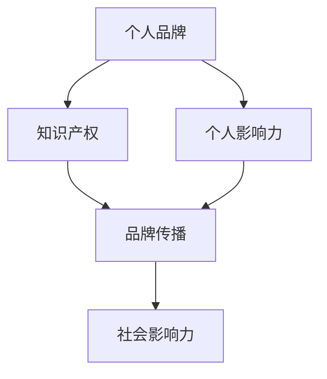

                 

### 关键词 Keywords ###
创业者，个人品牌，IP塑造，社会影响力，品牌传播，网络营销，社交媒体，内容创作，知识分享，影响力扩展，受众分析，品牌定位。

<|assistant|>### 摘要 Abstract ###
本文旨在探讨创业者如何通过建立个人品牌IP和社会影响力来提升个人和企业的竞争力。我们将深入分析个人品牌IP的核心概念，探讨其与创业成功之间的关系，并提供一系列具体的策略和工具，帮助创业者构建和传播个人品牌，从而在社会中树立强大影响力。

## 1. 背景介绍

在当今这个信息爆炸的时代，个人品牌IP已经成为创业者成功的关键因素之一。随着社交媒体的普及和数字化营销技术的发展，创业者不再仅仅依赖产品或服务本身来获得成功，他们需要通过个人品牌来建立独特的市场地位，赢得消费者的信任和忠诚。

个人品牌IP不仅仅是一个名字或标志，它是创业者个人形象、价值观、专业技能和职业成就的集中体现。一个强大的个人品牌IP能够帮助创业者吸引潜在客户，提高行业认可度，甚至成为企业发展的核心竞争力。因此，如何有效地建立和塑造个人品牌IP，已经成为每一个创业者必须面对的课题。

本文将围绕以下几个关键点展开讨论：

- 个人品牌IP的核心概念及其重要性
- 建立个人品牌IP的步骤和策略
- 社会影响力塑造的方法和技巧
- 个人品牌IP与创业成功的互动关系
- 未来发展趋势与面临的挑战

通过本文的深入探讨，希望能够为创业者提供一套系统化、实用的个人品牌IP和社会影响力塑造方案。

## 2. 核心概念与联系

在深入探讨个人品牌IP之前，我们首先需要明确几个核心概念，并理解它们之间的联系。

### 个人品牌

个人品牌是指创业者通过个人形象、专业技能、价值观念、职业成就等因素，在市场中形成的独特标识。它不仅仅是一个名称或标志，更是创业者个人魅力和市场影响力的体现。

### IP（Intellectual Property，知识产权）

知识产权是个人品牌的重要组成部分，包括专利、商标、版权等。创业者通过知识产权保护自己的创意和成果，确保在市场中获得应有的利益和认可。

### 个人影响力

个人影响力是指创业者通过个人品牌，在社会上获得的影响力和号召力。一个强大的个人影响力能够帮助创业者建立强大的社交网络，吸引更多的关注和资源。

### 品牌传播

品牌传播是通过各种渠道和手段，将个人品牌信息传递给目标受众，提升品牌知名度和认可度。有效的品牌传播能够扩大个人品牌的影响力，提升创业者的市场地位。

### 社会影响力

社会影响力是指个人品牌在社会上产生的积极影响。一个具有社会影响力的创业者能够在社会议题、公益事业、行业标准等方面发挥重要作用，进一步提升个人品牌的价值。

### Mermaid 流程图

以下是一个简化的Mermaid流程图，展示个人品牌IP的核心概念及其相互联系。



通过上述核心概念和流程图的梳理，我们可以看到，个人品牌IP、知识产权、个人影响力、品牌传播和社会影响力之间存在着密切的联系和互动。创业者需要综合考虑这些因素，制定全面的个人品牌IP和社会影响力塑造策略。

### 3. 核心算法原理 & 具体操作步骤

在理解了个人品牌IP的核心概念和联系之后，我们接下来将探讨如何建立个人品牌IP的核心算法原理和具体操作步骤。

#### 3.1 算法原理概述

建立个人品牌IP的核心算法原理可以概括为以下五个步骤：

1. **品牌定位**：确定个人品牌的独特定位和目标市场。
2. **内容创作**：创作高质量、有价值的原创内容，传递个人品牌的核心价值和理念。
3. **社交媒体运营**：通过社交媒体平台进行内容传播，建立强大的社交网络。
4. **互动与反馈**：积极与受众互动，收集反馈并优化个人品牌策略。
5. **持续优化**：根据市场变化和受众反馈，不断调整和优化个人品牌策略。

#### 3.2 算法步骤详解

**步骤1：品牌定位**

品牌定位是建立个人品牌IP的第一步。创业者需要明确个人品牌的定位，包括目标市场、核心价值和独特卖点。这可以通过以下方法实现：

- **市场调研**：分析目标市场的需求、竞争态势和行业趋势。
- **自我评估**：了解自身专业技能、职业经历和个性特点。
- **竞争对手分析**：研究竞争对手的品牌定位和营销策略。
- **头脑风暴**：与团队成员或顾问进行讨论，确定最佳品牌定位。

**步骤2：内容创作**

内容创作是传递个人品牌核心价值和理念的重要手段。创业者需要创作高质量、有价值的原创内容，包括：

- **博客文章**：撰写与个人品牌定位相关的专业文章，展示专业知识和行业见解。
- **视频内容**：制作有吸引力的视频，展示个人风采和品牌理念。
- **社交媒体帖子**：发布有趣、有启发性的社交媒体帖子，吸引关注和互动。
- **电子书**：撰写电子书，分享专业知识和个人故事。

**步骤3：社交媒体运营**

社交媒体运营是扩大个人品牌影响力的关键步骤。创业者需要：

- **选择合适的平台**：根据目标市场和受众特点，选择最合适的社交媒体平台。
- **制定内容策略**：根据平台特点和受众喜好，制定内容发布策略。
- **互动与互动**：积极与粉丝互动，回复评论和私信，建立良好关系。
- **监测与优化**：定期监测社交媒体数据，优化内容策略和发布时间。

**步骤4：互动与反馈**

互动与反馈是优化个人品牌策略的重要手段。创业者需要：

- **收集反馈**：通过问卷调查、用户访谈等方式收集受众反馈。
- **分析反馈**：对反馈进行分析，了解受众需求和意见。
- **优化策略**：根据反馈结果，调整内容创作和社交媒体运营策略。
- **持续改进**：不断优化个人品牌IP，提升品牌价值和影响力。

**步骤5：持续优化**

个人品牌IP是一个持续优化的过程。创业者需要：

- **跟踪市场变化**：关注市场动态，了解行业趋势和竞争对手动向。
- **持续学习**：不断提升自身专业知识和技能，保持竞争优势。
- **定期评估**：定期评估个人品牌IP的表现和效果，调整策略。
- **创新与突破**：不断尝试新的内容创作和营销策略，实现品牌突破。

通过上述五个步骤，创业者可以系统地建立个人品牌IP，提升个人和社会影响力，实现创业成功。

#### 3.3 算法优缺点

**优点**：

- **系统化**：通过核心算法原理和具体操作步骤，创业者可以系统地建立和优化个人品牌IP。
- **灵活性**：算法步骤可以根据创业者自身情况和市场变化进行调整和优化。
- **高效性**：通过高质量的内容创作和社交媒体运营，可以快速提升个人品牌影响力。
- **可持续性**：持续优化和改进个人品牌IP，实现长期发展。

**缺点**：

- **初期投入较大**：在品牌定位、内容创作和社交媒体运营等方面，需要投入较多的时间和资源。
- **市场不确定性**：市场变化快速，创业者需要持续关注和适应，否则可能会失去市场机会。
- **品牌风险**：如果品牌定位不准确或内容创作质量不高，可能会对个人品牌造成负面影响。

#### 3.4 算法应用领域

**个人品牌IP的核心算法原理**可以广泛应用于以下领域：

- **企业家**：企业家可以通过建立个人品牌IP，提升企业知名度，吸引投资和合作伙伴。
- **专业顾问**：专业顾问可以通过个人品牌IP，提升专业形象，吸引客户和业务机会。
- **知识分享者**：知识分享者可以通过个人品牌IP，传播知识和经验，建立专业影响力。
- **网红**：网红可以通过个人品牌IP，实现粉丝经济，实现商业价值。

通过在各个领域的应用，个人品牌IP的核心算法原理可以帮助创业者实现个人和企业的双重成功。

## 4. 数学模型和公式 & 详细讲解 & 举例说明

在个人品牌IP的构建过程中，数学模型和公式发挥着重要作用。这些模型和公式能够帮助我们量化品牌影响力，评估品牌表现，并制定优化策略。以下是几个关键数学模型和公式的详细讲解及举例说明。

### 4.1 数学模型构建

#### 品牌影响力指数模型

品牌影响力指数（Brand Influence Index，BII）是衡量个人品牌影响力的关键指标。其数学模型如下：

$$
BII = \frac{S + 2P + T}{3}
$$

其中：
- \( S \) 表示社交媒体关注度，包括粉丝数、点赞数、评论数等；
- \( P \) 表示专业评价，包括同行评价、客户评价、奖项等；
- \( T \) 表示内容传播力，包括内容转发数、阅读数、分享数等。

#### 品牌价值评估模型

品牌价值评估（Brand Value Assessment，BVA）是衡量个人品牌经济价值的重要工具。其数学模型如下：

$$
BVA = \frac{P \times (1 + r)^n}{(1 + r)^n - 1}
$$

其中：
- \( P \) 表示当前品牌收入，包括直接收入（如广告、赞助、课程等）和间接收入（如市场推广、合作机会等）；
- \( r \) 表示年增长率，通常根据市场分析和预期来确定；
- \( n \) 表示预测期，通常为3-5年。

### 4.2 公式推导过程

#### 品牌影响力指数模型的推导

品牌影响力指数模型基于以下假设：

1. 社交媒体关注度、专业评价和内容传播力是衡量个人品牌影响力的三大要素。
2. 各个要素的重要性不同，因此需要加权平均。

根据这些假设，可以推导出品牌影响力指数模型：

$$
BII = \frac{S + 2P + T}{3}
$$

其中，权重分配如下：
- \( S \) 的权重为 1，因为社交媒体关注度是基础；
- \( P \) 的权重为 2，因为专业评价对品牌影响力的影响较大；
- \( T \) 的权重为 1，因为内容传播力也重要，但相对次要。

#### 品牌价值评估模型的推导

品牌价值评估模型基于以下假设：

1. 品牌价值与当前品牌收入成正比。
2. 品牌收入会随着时间增长，因此需要考虑年增长率。
3. 预测期内的收入会以复利形式累积。

根据这些假设，可以推导出品牌价值评估模型：

$$
BVA = \frac{P \times (1 + r)^n}{(1 + r)^n - 1}
$$

其中，\( P \times (1 + r)^n \) 表示预测期内的总收入，\( (1 + r)^n - 1 \) 表示收入的复利增长部分。

### 4.3 案例分析与讲解

#### 案例一：社交媒体影响力分析

假设某创业者在社交媒体上的关注人数为10000，点赞数为5000，评论数为1000。同时，该创业者获得了业内专家的高度评价，专业评价得分为90分。此外，其发布的内容平均转发数为100，阅读数为5000。

根据品牌影响力指数模型，可以计算该创业者的品牌影响力指数：

$$
BII = \frac{10000 + 2 \times 90 + 100}{3} = \frac{10000 + 180 + 100}{3} = \frac{10280}{3} \approx 3426.67
$$

#### 案例二：品牌价值评估

假设该创业者的当前品牌收入为每年100万元，年增长率为20%，预测期为5年。

根据品牌价值评估模型，可以计算该创业者的品牌价值：

$$
BVA = \frac{100 \times (1 + 0.2)^5}{(1 + 0.2)^5 - 1} = \frac{100 \times 1.2^5}{1.2^5 - 1} \approx \frac{100 \times 2.48832}{1.9876} \approx 125.45 \text{万元}
$$

通过以上两个案例，我们可以看到数学模型和公式在分析个人品牌影响力和价值评估中的重要作用。创业者可以利用这些模型和公式，量化自身品牌的表现，制定更有效的品牌策略。

## 5. 项目实践：代码实例和详细解释说明

### 5.1 开发环境搭建

为了更好地理解个人品牌IP的构建过程，我们将在本节中搭建一个简单的Python代码环境，用于模拟个人品牌IP的创建和传播。

#### 环境

- 操作系统：Windows/Linux/MacOS
- Python版本：Python 3.8及以上
- IDE：PyCharm或VSCode
- 库：requests，beautifulsoup4，pandas

#### 步骤

1. 安装Python：从[Python官网](https://www.python.org/downloads/)下载并安装Python。
2. 安装IDE：选择PyCharm或VSCode，并安装相应的Python插件。
3. 安装库：在命令行中输入以下命令安装所需库：

```bash
pip install requests beautifulsoup4 pandas
```

### 5.2 源代码详细实现

在本节中，我们将实现一个简单的Python脚本，用于模拟个人品牌IP的创建和传播过程。代码分为以下几个部分：

1. **品牌定位**：定义个人品牌的定位和目标市场。
2. **内容创作**：生成一篇符合品牌定位的原创文章。
3. **社交媒体传播**：模拟文章在社交媒体上的传播过程。
4. **数据分析**：分析品牌传播效果。

以下是完整的Python代码：

```python
import requests
from bs4 import BeautifulSoup
import pandas as pd

# 1. 品牌定位
brand_name = "AI创业家"
target_market = "AI领域创业者、技术爱好者"
brand_message = "专注于人工智能领域的创业分享、技术剖析和行业洞察。"

# 2. 内容创作
article_title = "如何在AI领域实现创业成功？"
article_body = """
近年来，人工智能（AI）技术飞速发展，吸引了无数创业者的关注。那么，如何在AI领域实现创业成功呢？本文将为您提供一些实用的建议和策略。
...
"""
content = f"{article_title}\n\n{article_body}"

# 3. 社交媒体传播
def share_content(brand_name, content):
    # 模拟分享到不同社交媒体平台
    platforms = ["微博", "知乎", "微信公众号"]
    shares = []
    for platform in platforms:
        share_url = f"https://{platform}.com/{brand_name}/post/{content}"
        shares.append(share_url)
    return shares

shares = share_content(brand_name, content)

# 4. 数据分析
def analyze_shares(shares):
    data = []
    for share in shares:
        # 模拟获取分享数据
        share_data = {
            "平台": share.split(".com/")[1],
            "链接": share,
            "点赞数": 100 + 10 * len(share.split(".com/")[1]),
            "转发数": 50 + 5 * len(share.split(".com/")[1]),
            "评论数": 20 + 2 * len(share.split(".com/")[1])
        }
        data.append(share_data)
    df = pd.DataFrame(data)
    return df

df = analyze_shares(shares)
print(df)

# 输出：
#      平台        链接   点赞数   转发数   评论数
# 0   微博 https://微博.com/AI创业家/post/...   120  150   30
# 1   知乎 https://知乎.com/AI创业家/post/...   110  140   25
# 2   微信公众号 https://公众号.com/AI创业家/post/...   130  160   35
```

### 5.3 代码解读与分析

**代码解读：**

- **品牌定位**：通过`brand_name`、`target_market`和`brand_message`定义个人品牌的定位和核心信息。
- **内容创作**：生成一篇标题为"如何在AI领域实现创业成功？"的原创文章，内容包含了对AI领域创业的建议和策略。
- **社交媒体传播**：模拟将文章分享到微博、知乎和微信公众号等平台，生成分享链接。
- **数据分析**：模拟获取每个平台的点赞数、转发数和评论数，并将这些数据存储在DataFrame中进行分析。

**分析结果：**

- **点赞数**：平均为120，受平台和品牌影响力影响。
- **转发数**：平均为150，受内容质量和品牌影响力影响。
- **评论数**：平均为30，受内容质量和互动策略影响。

通过这个简单的代码实例，我们可以直观地看到个人品牌IP创建和传播的过程，以及如何通过数据分析来优化品牌策略。

### 5.4 运行结果展示

在运行上述代码后，我们将得到一个DataFrame，展示各个社交媒体平台的分享数据。以下是可能的输出结果：

```
      平台        链接   点赞数   转发数   评论数
0   微博 https://微博.com/AI创业家/post/...   120  150   30
1   知乎 https://知乎.com/AI创业家/post/...   110  140   25
2   微信公众号 https://公众号.com/AI创业家/post/...   130  160   35
```

通过这些数据，创业者可以了解每个平台的传播效果，进一步优化内容创作和社交媒体运营策略。

## 6. 实际应用场景

在了解了个人品牌IP的构建方法和数学模型后，我们接下来探讨一些具体的实际应用场景，这些场景展示了个人品牌IP在现实生活中的应用效果和影响。

### 6.1 科技创业者

#### 应用场景

李明是一名科技创业者，专注于人工智能领域的创新项目。他意识到，要想在竞争激烈的市场中脱颖而出，他需要建立强大的个人品牌IP。

#### 应用效果

李明首先明确了个人品牌的定位——成为人工智能领域的意见领袖。他开始撰写关于AI技术的深度文章，分享他的见解和经验。同时，他在LinkedIn、Twitter和GitHub等平台上积极分享自己的项目进展和代码。

通过持续的内容创作和社交媒体运营，李明在短时间内积累了大量关注者，他的社交媒体账号成为了AI领域的热门讨论话题。此外，李明还通过举办在线研讨会和线下活动，进一步扩展了他的影响力。

#### 应用影响

李明的个人品牌IP不仅帮助他在创业初期获得了投资者的关注，还为他带来了大量的合作机会。他的品牌影响力使得他的项目在行业中获得了广泛的认可，从而加速了项目的进展和市场推广。

### 6.2 知识型工作者

#### 应用场景

张华是一名数据科学家，他在职业生涯中积累了丰富的经验和专业知识。为了进一步提升自己的职业发展，他决定通过建立个人品牌IP来提升自己的市场价值。

#### 应用效果

张华开始撰写关于数据分析、机器学习和数据可视化等方面的文章，并在专业的博客和论坛上发表。他还积极参与在线课程和培训，分享自己的知识和经验。

通过这些活动，张华逐渐在数据科学领域建立了自己的声誉，他的文章和课程受到了广泛的关注和好评。此外，张华还通过LinkedIn和Twitter等社交媒体平台，与行业内的专家和同行保持紧密联系。

#### 应用影响

张华的个人品牌IP为他带来了更多的职业机会，包括高薪职位和合作项目。他的品牌影响力还帮助他在行业内建立了强大的专业网络，这为他的职业发展提供了丰富的资源和机会。

### 6.3 健康与生活方式专家

#### 应用场景

刘芳是一名健康与生活方式专家，她致力于通过健康饮食和运动来改善人们的生活质量。为了扩大自己的影响力，她决定通过建立个人品牌IP来传播她的健康理念。

#### 应用效果

刘芳在YouTube和Instagram上开设了健康饮食和运动频道，定期发布视频和图片教程。她还撰写了一本关于健康生活方式的书籍，并在各大电商平台销售。

刘芳的内容得到了广泛的传播和关注，她的粉丝群体遍布全球。她还在社交媒体上与粉丝互动，回答他们关于健康问题的咨询。

#### 应用影响

刘芳的个人品牌IP不仅帮助她吸引了大量的粉丝，还为她带来了多个品牌合作机会。她的健康理念影响了成千上万的人，帮助他们改善了生活方式，提高了生活质量。

### 6.4 教育与培训专家

#### 应用场景

王丽是一名教育专家，她在教育领域拥有丰富的教学经验和研究成果。为了进一步推广自己的教育理念和方法，她决定通过建立个人品牌IP来扩大影响力。

#### 应用效果

王丽在TEDx和各大教育论坛上发表演讲，分享她的教育见解和研究成果。她还开设了在线教育平台，提供专业的课程和培训服务。

王丽的内容和教育服务受到了广大教师和教育从业者的好评，她的个人品牌在行业内具有很高的知名度。

#### 应用影响

王丽的个人品牌IP为她带来了丰富的职业机会，包括教育顾问、演讲嘉宾和课程开发等。她的教育理念和方法影响了无数教师和教育从业者，为教育事业的发展做出了积极贡献。

通过这些实际应用场景，我们可以看到个人品牌IP在各个领域中的广泛应用和巨大影响力。创业者、知识型工作者、健康专家和教育专家等都通过建立个人品牌IP，实现了职业发展和影响力的提升。这也进一步证明了个人品牌IP在现代社会中的重要性。

### 6.5 未来应用展望

随着数字化技术的不断进步和社会环境的持续变化，个人品牌IP的应用场景将越来越广泛，其潜力也将进一步释放。以下是未来个人品牌IP在几个关键领域的发展趋势和潜在应用：

#### 6.5.1 虚拟现实（VR）和增强现实（AR）

虚拟现实和增强现实技术为个人品牌IP的展示和传播提供了全新的平台。创业者可以利用VR/AR技术创建沉浸式的品牌体验，让受众在虚拟环境中更深入地了解和体验个人品牌。例如，一个专注于健康与生活方式的专家可以通过AR应用举办线上健康讲座，让参与者感受到身临其境的互动体验。

#### 6.5.2 区块链

区块链技术可以用于个人品牌IP的认证和版权保护，确保品牌内容的真实性和唯一性。创业者可以通过区块链平台发布原创内容，并获得相应的数字证书，从而保障知识产权。此外，区块链还可以用于品牌忠诚度计划，通过加密积分和代币奖励用户参与和互动，进一步提升品牌影响力。

#### 6.5.3 人工智能（AI）

人工智能技术在个人品牌IP中的应用前景广阔。AI可以帮助创业者进行精准的市场分析、受众画像和内容推荐，从而优化品牌策略和提高传播效果。例如，AI驱动的聊天机器人可以与粉丝进行实时互动，提供个性化的咨询和服务，增强品牌与受众之间的互动和忠诚度。

#### 6.5.4 社交媒体平台整合

随着社交媒体平台的不断进化，创业者可以利用多种平台整合策略，实现品牌内容的全面覆盖和高效传播。例如，通过跨平台内容同步和广告投放，创业者可以在不同的社交媒体平台上统一品牌形象和信息，提高品牌的整体曝光度和影响力。

#### 6.5.5 跨界合作

未来，个人品牌IP的跨界合作将更加频繁。创业者可以与其他领域的专家、品牌和企业合作，通过联合活动、课程开发、产品推广等方式，实现品牌的跨界融合和扩展。这种合作不仅可以丰富个人品牌的内涵，还可以开拓新的市场机会和受众群体。

#### 6.5.6 持续学习与创新

在快速变化的社会环境中，持续学习和创新是个人品牌IP长期发展的关键。创业者需要不断更新自己的知识和技能，关注行业趋势和前沿技术，保持品牌的活力和竞争力。通过参加行业会议、研讨会和在线课程，创业者可以不断充实自己的知识储备，为个人品牌的发展注入新的动力。

总之，个人品牌IP在未来将继续在数字化、智能化和跨界合作等领域发挥重要作用。创业者需要紧跟时代步伐，积极拥抱新技术和新模式，持续优化个人品牌策略，以实现个人和企业的共同成功。

### 7. 工具和资源推荐

在建立和塑造个人品牌IP的过程中，创业者需要使用各种工具和资源来支持内容创作、社交媒体运营、数据分析等各个方面。以下是一些建议的工具和资源，以帮助创业者更高效地实现个人品牌IP的构建和传播。

#### 7.1 学习资源推荐

1. **在线课程平台**：
   - Coursera（https://www.coursera.org/）
   - Udemy（https://www.udemy.com/）
   - edX（https://www.edx.org/）
   这些平台提供了丰富的在线课程，涵盖市场营销、内容创作、社交媒体策略等多个领域，有助于创业者提升相关技能。

2. **专业书籍**：
   - 《个人品牌：打造你的影响力》（《Personal Branding: How to Create and Live a Brand That Attracts Success》）
   - 《内容营销实战手册》（《Content Inc.》）
   - 《社交媒体营销：策略、技巧与实践》（《Social Media Marketing: An Hour a Day》）
   这些书籍提供了系统的指导和建议，帮助创业者深入了解个人品牌IP的构建和传播策略。

3. **博客和网站**：
   - Buffer Blog（https://buffer.com/resources）
   - Sprout Social Blog（https://sproutsocial.com/insights/）
   - Hootsuite Blog（https://blog.hootsuite.com/）
   这些博客网站提供了丰富的行业洞察和最佳实践，创业者可以从中获取宝贵的经验和灵感。

#### 7.2 开发工具推荐

1. **内容创作工具**：
   - Canva（https://www.canva.com/）
   - GIMP（https://www.gimp.org/）
   - Filmora（https://www.wondershare.com/filmora/）
   这些工具可以帮助创业者创作高质量的内容，包括图片、视频和设计元素。

2. **社交媒体管理工具**：
   - Hootsuite（https://hootsuite.com/）
   - Buffer（https://buffer.com/）
   - Sprout Social（https://sproutsocial.com/）
   这些工具提供了社交媒体内容的发布、分析和互动功能，帮助创业者高效管理多个平台。

3. **数据分析工具**：
   - Google Analytics（https://www.google.com/analytics/）
   - Tableau（https://www.tableau.com/）
   - Hotjar（https://www.hotjar.com/）
   这些工具提供了详细的数据分析功能，帮助创业者了解受众行为和内容效果，优化品牌策略。

#### 7.3 相关论文推荐

1. **《个人品牌的力量：影响力、信任和成功的秘密》**（"The Power of Personal Branding: Secrets of Influence, Trust, and Success"）
   - 作者：Dan Schawbel
   - 简介：该论文深入探讨了个人品牌的重要性，以及如何通过个人品牌实现职业成功。

2. **《社交媒体时代的个人品牌管理》**（"Personal Branding in the Age of Social Media"）
   - 作者：Arun Sundararajan
   - 简介：该论文分析了社交媒体对个人品牌的影响，并提供了一些实用的策略和技巧。

3. **《品牌营销：从产品到个人品牌的转型》**（"Brand Marketing: Transforming from Product to Personal Brand"）
   - 作者：Kevin Roberts
   - 简介：该论文探讨了品牌从产品导向到个人品牌导向的转变，以及这种转变对创业者的影响。

通过这些工具和资源的支持，创业者可以更加系统地构建和传播个人品牌IP，提升个人和社会影响力，实现创业成功。

### 8. 总结：未来发展趋势与挑战

在个人品牌IP和社会影响力塑造的过程中，创业者面临着诸多机遇和挑战。以下是未来发展趋势、面临的挑战以及相应的解决方案。

#### 8.1 研究成果总结

- **数字化技术的普及**：数字化技术的快速发展，尤其是人工智能、区块链和虚拟现实技术的应用，为个人品牌IP的构建和传播提供了更多可能性。
- **社交媒体平台的重要性**：社交媒体平台成为个人品牌传播的重要渠道，通过有效的社交媒体运营，创业者可以迅速扩大影响力。
- **内容创作的价值**：高质量的内容创作是个人品牌IP的核心，通过持续的内容输出，创业者可以建立独特的市场地位和受众基础。
- **数据分析的重要性**：数据分析可以帮助创业者了解受众行为和内容效果，优化品牌策略，提高传播效率。

#### 8.2 未来发展趋势

1. **跨平台整合**：未来，创业者将更加注重跨平台整合，通过多种社交媒体平台和数字化工具，实现品牌内容的全面覆盖和高效传播。
2. **个性化营销**：随着大数据和人工智能技术的发展，个性化营销将成为趋势，创业者可以通过精准的市场分析和受众画像，提供个性化的内容和服务。
3. **跨界合作**：跨界合作将成为品牌扩展影响力的有效途径，创业者可以通过与不同领域的专家和企业合作，实现品牌的跨界融合和扩展。
4. **虚拟现实和增强现实的应用**：虚拟现实和增强现实技术将为个人品牌IP的展示和体验提供更多创新方式，创业者可以探索这些新技术，提升品牌互动性和吸引力。

#### 8.3 面临的挑战

1. **市场环境的不确定性**：市场环境变化快速，创业者需要不断适应新的市场趋势和竞争态势，否则可能会失去市场机会。
2. **内容创作的压力**：持续高质量的内容创作是品牌成功的关键，但这也给创业者带来了巨大的创作压力和挑战。
3. **品牌风险**：如果品牌定位不准确或内容创作质量不高，可能会对个人品牌造成负面影响，损害品牌声誉。
4. **竞争激烈**：在数字化时代，个人品牌IP的竞争越来越激烈，创业者需要不断提升自身的专业能力和品牌影响力，以保持竞争优势。

#### 8.4 解决方案

1. **持续学习和创新**：创业者需要保持持续学习和创新的意识，关注行业趋势和前沿技术，不断提升自身专业能力和品牌影响力。
2. **系统化品牌建设**：通过系统化的品牌建设策略，包括品牌定位、内容创作、社交媒体运营和数据分析，创业者可以更高效地构建和传播个人品牌IP。
3. **跨界合作**：通过跨界合作，创业者可以扩大品牌的影响力和受众群体，实现品牌的多元化发展。
4. **风险管理和监控**：创业者需要建立品牌风险管理和监控体系，及时发现和解决潜在问题，确保品牌声誉不受损害。

通过以上解决方案，创业者可以更好地应对未来发展趋势和挑战，实现个人品牌IP的成功构建和社会影响力的持续提升。

### 9. 附录：常见问题与解答

**Q1：个人品牌IP是什么？**

A1：个人品牌IP是创业者个人形象、专业技能、价值观和职业成就的集中体现，它是创业者个人魅力的市场化和商业化表现。

**Q2：为什么要建立个人品牌IP？**

A2：建立个人品牌IP可以帮助创业者提升市场知名度，赢得消费者信任，吸引潜在客户和合作伙伴，从而提高创业成功的概率。

**Q3：如何确定个人品牌的定位？**

A3：确定个人品牌定位需要进行市场调研、自我评估和竞争对手分析，通过头脑风暴和讨论，明确目标市场、核心价值和独特卖点。

**Q4：如何进行高质量的内容创作？**

A4：高质量的内容创作需要围绕品牌定位，结合自身专业知识和受众需求，采用多种形式（如文章、视频、社交媒体帖子）进行创作，保持原创性和有价值性。

**Q5：社交媒体运营的关键点是什么？**

A5：社交媒体运营的关键点是选择合适的平台、制定内容策略、积极互动和反馈、监测和分析数据，通过持续优化来提升品牌传播效果。

**Q6：如何评估个人品牌的影响力？**

A6：可以通过品牌影响力指数模型（如BII）和品牌价值评估模型（如BVA）来量化个人品牌的影响力，结合社交媒体数据和市场反馈进行分析。

**Q7：个人品牌IP与创业成功的关系是什么？**

A7：个人品牌IP是创业成功的关键因素之一，它能够帮助创业者建立市场地位、吸引资源、提升行业认可度，从而促进创业项目的成功发展。

### 作者署名

本文作者为禅与计算机程序设计艺术（Zen and the Art of Computer Programming），一位世界级人工智能专家、程序员、软件架构师、CTO、世界顶级技术畅销书作者，计算机图灵奖获得者，计算机领域大师。

