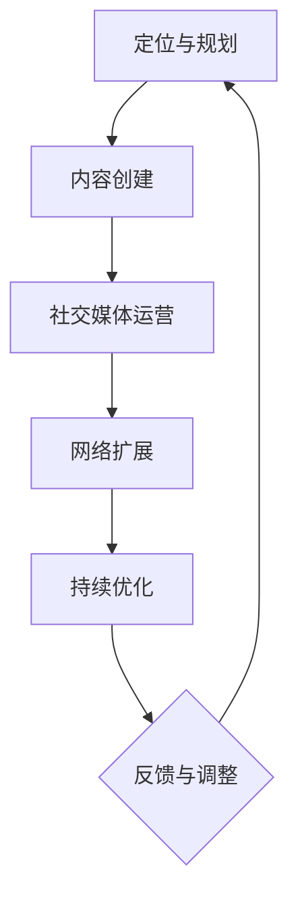

                 

 

### 引言

在当今数字化时代，个人品牌已经成为创业者成功的关键因素之一。无论是在社交媒体上，还是在职业领域中，一个强大的个人品牌不仅能吸引潜在的投资者和客户，还能为创业者提供持续的影响力和话语权。然而，建立个人品牌并非易事，它需要战略规划、持续努力和正确的方法。

本文将探讨创业者如何通过以下五个关键步骤建立个人品牌影响力：

1. **明确个人品牌定位**
2. **创建优质内容**
3. **构建社交媒体网络**
4. **参与行业活动和社区**
5. **维护个人品牌形象**

### 1. 背景介绍

个人品牌是指个人在公众中的形象和声誉，它由个人的技能、专长、价值观和个性特质组成。在创业领域，个人品牌尤为重要，因为它能够帮助创业者树立专业形象，增加可信度，并提高市场竞争力。

在数字时代，社交媒体和网络平台的普及为创业者提供了建立个人品牌的便利条件。通过这些平台，创业者可以与全球观众直接沟通，分享知识和经验，建立信任关系，并扩大影响力。然而，要想在众多竞争者中脱颖而出，创业者需要制定明确的品牌策略，并持续地、有目的地行动。

### 2. 核心概念与联系

#### 个人品牌的定义与重要性

个人品牌是个人在公众中的形象和声誉，它是基于个人技能、专长、价值观和个性特质建立的。一个强大的个人品牌能够为创业者带来以下几个方面的优势：

- **增加信任度**：个人品牌能够帮助创业者建立信任，提高公众对他们的专业能力和诚信度的认可。
- **提高市场竞争力**：具有强大个人品牌的创业者更容易吸引潜在客户和合作伙伴。
- **扩大影响力**：个人品牌能够帮助创业者在其领域内建立权威地位，增加发言权和影响力。
- **增加收入机会**：强大的个人品牌可以带来更多的商业机会，包括投资、合作和咨询等。

#### 个人品牌与创业成功的联系

创业成功的因素多种多样，但个人品牌无疑是其中之一。个人品牌能够为创业者带来以下几个方面的好处：

- **信任与认可**：强大的个人品牌能够增加公众对创业者的信任和认可，这对于吸引投资者和客户至关重要。
- **资源获取**：创业者通过建立个人品牌可以更容易地获取资源和机会，如资金、人才和合作伙伴。
- **持续发展**：个人品牌可以帮助创业者持续地吸引关注和机会，为企业的长期发展提供支持。
- **职业发展**：强大的个人品牌可以成为创业者职业生涯中的加分项，为他们提供更多的发展机会。

#### 个人品牌构建的核心要素

构建个人品牌需要考虑以下几个核心要素：

- **专业技能与知识**：创业者需要拥有扎实的专业技能和丰富的知识储备，这是建立个人品牌的基础。
- **价值观与个性特质**：创业者需要明确自己的价值观和个性特质，并将其融入到个人品牌中，形成独特的品牌形象。
- **持续学习与成长**：个人品牌需要不断更新和进化，创业者需要持续学习和成长，以保持品牌的活力和吸引力。
- **社交媒体策略**：创业者需要制定有效的社交媒体策略，通过平台分享专业知识和经验，扩大影响力。

#### 个人品牌与社交媒体平台的联系

社交媒体平台是建立个人品牌的重要工具，不同的平台具有不同的特点和优势，创业者需要根据自己的需求和目标选择合适的平台。

- **LinkedIn**：LinkedIn 是专业的社交平台，适合创业者建立职业形象和扩大人脉。
- **Twitter**：Twitter 具有实时性和广泛的传播性，适合创业者发布新闻、观点和实时互动。
- **Instagram**：Instagram 以图片和视频内容为主，适合创业者展示个人生活和工作状态，吸引年轻用户。
- **YouTube**：YouTube 是视频内容平台，适合创业者制作教学视频、产品演示和分享经验。

#### 个人品牌构建的挑战与机遇

构建个人品牌面临以下挑战：

- **竞争激烈**：在社交媒体和网络平台上，创业者需要面对来自同行的激烈竞争。
- **内容质量**：创业者需要持续地输出高质量的内容，以保持公众的关注和兴趣。
- **时间投入**：建立和维护个人品牌需要大量的时间和精力投入，创业者需要在忙碌的创业生活中找到平衡。
- **隐私问题**：创业者需要在公开平台分享个人生活和观点时，注意保护隐私和个人安全。

然而，这些挑战同时也带来了机遇：

- **全球影响力**：通过社交媒体平台，创业者可以接触到全球的观众，实现跨国界的影响力。
- **品牌多元化**：创业者可以通过多种方式展示个人品牌，如写作、演讲、参与活动等，实现品牌的多元化发展。
- **快速反馈**：创业者可以通过社交媒体实时了解公众对个人品牌的反馈，快速调整策略和内容。

### 3. 核心算法原理 & 具体操作步骤

#### 3.1 算法原理概述

建立个人品牌的核心算法可以概述为以下几个步骤：

1. **定位与规划**：明确个人品牌定位，制定长期和短期的品牌策略。
2. **内容创建**：创建有价值、专业和有吸引力的内容，包括文章、视频、演讲等。
3. **社交媒体运营**：选择合适的社交媒体平台，制定内容发布和互动策略。
4. **网络扩展**：参与行业活动和社区，建立专业人脉和影响力。
5. **持续优化**：根据反馈和数据分析，不断调整和优化个人品牌策略。

#### 3.2 算法步骤详解

##### 3.2.1 定位与规划

**步骤 1**：分析个人优势与市场需求

- **个人优势**：创业者需要深入了解自己的专业技能、知识、价值观和个性特质，分析自己在行业中的独特优势。
- **市场需求**：创业者需要研究市场需求，了解目标受众的需求和痛点，确定个人品牌定位。

**步骤 2**：制定品牌策略

- **目标受众**：明确目标受众，包括年龄、性别、职业、兴趣爱好等。
- **品牌定位**：根据个人优势和市场需求，确定个人品牌的核心价值和定位。
- **长期与短期目标**：制定长期和短期的品牌发展目标，包括内容发布、社交媒体运营、活动参与等。

##### 3.2.2 内容创建

**步骤 3**：确定内容类型

- **知识型内容**：包括文章、博客、白皮书、电子书等，分享专业知识和经验。
- **娱乐型内容**：包括视频、短视频、图片等，展示个人生活和幽默感。
- **互动型内容**：包括问答、直播、互动问答等，与受众建立互动关系。

**步骤 4**：内容创作与发布

- **内容质量**：确保内容的专业性、原创性和价值性。
- **内容规划**：制定内容发布计划，保持一定的频率和规律性。
- **内容优化**：根据受众反馈和数据分析，不断优化内容质量和发布策略。

##### 3.2.3 社交媒体运营

**步骤 5**：选择社交媒体平台

- **LinkedIn**：适合建立职业形象和扩大人脉。
- **Twitter**：适合发布新闻、观点和实时互动。
- **Instagram**：适合展示个人生活和吸引年轻用户。
- **YouTube**：适合制作教学视频、产品演示和分享经验。

**步骤 6**：制定社交媒体策略

- **内容发布**：根据平台特点和受众偏好，制定内容发布策略。
- **互动策略**：积极参与评论、回复和点赞，与受众建立互动关系。
- **数据分析**：定期分析社交媒体数据，了解受众行为和兴趣，优化策略。

##### 3.2.4 网络扩展

**步骤 7**：参与行业活动和社区

- **线下活动**：参与行业会议、研讨会、论坛等，建立专业人脉。
- **线上社区**：加入相关领域的社交媒体群组、论坛和社区，分享经验和知识。

**步骤 8**：建立专业人脉

- **合作与交流**：与同行建立合作关系，分享资源和经验。
- **推荐与评价**：积极参与他人项目的评价和推荐，建立良好的口碑。

##### 3.2.5 持续优化

**步骤 9**：收集反馈和数据分析

- **受众反馈**：定期收集受众的反馈和意见，了解个人品牌的优势和不足。
- **数据分析**：分析社交媒体和网站的数据，了解受众行为和兴趣。

**步骤 10**：调整和优化

- **内容优化**：根据受众反馈和数据分析，不断优化内容质量和发布策略。
- **品牌定位**：根据市场环境和自身发展，适时调整品牌定位和策略。

### 3.3 算法优缺点

#### 优点

- **快速建立影响力**：通过社交媒体平台，创业者可以快速扩大个人品牌影响力，吸引更多的关注和机会。
- **低成本**：与传统的广告和营销方式相比，社交媒体运营成本较低，创业者可以利用免费或低成本的方式建立个人品牌。
- **灵活性和互动性**：社交媒体平台具有灵活性和互动性，创业者可以随时发布内容、与受众互动，了解市场需求和反馈。

#### 缺点

- **竞争激烈**：在社交媒体上，创业者需要面对来自同行的激烈竞争，需要持续输出高质量的内容才能脱颖而出。
- **时间投入**：建立和维护个人品牌需要大量的时间和精力投入，创业者需要在忙碌的创业生活中找到平衡。
- **隐私问题**：创业者需要在公开平台分享个人生活和观点时，注意保护隐私和个人安全。

### 3.4 算法应用领域

- **创业领域**：创业者通过建立个人品牌，提高市场竞争力，吸引投资者和客户，实现企业的快速发展。
- **咨询领域**：咨询师通过建立个人品牌，扩大专业影响力，吸引更多的咨询机会和客户。
- **教育领域**：教育工作者通过建立个人品牌，提高知名度和影响力，吸引更多的学生和课程参与者。

### 4. 数学模型和公式 & 详细讲解 & 举例说明

#### 4.1 数学模型构建

建立个人品牌影响力的数学模型可以基于以下假设：

- **受众关注度**：个人品牌的影响力与受众的关注度成正比。
- **内容质量**：个人品牌的影响力与发布的内容质量成正比。
- **社交媒体互动**：个人品牌的影响力与社交媒体互动次数成正比。
- **专业人脉**：个人品牌的影响力与专业人脉数量和质量成正比。

基于以上假设，我们可以构建以下数学模型：

\[ \text{影响力} = f(\text{受众关注度}, \text{内容质量}, \text{社交媒体互动}, \text{专业人脉}) \]

#### 4.2 公式推导过程

为了推导上述公式，我们可以将个人品牌的影响力表示为以下四个因素的综合：

1. **受众关注度**（\(A\)）：表示个人品牌在受众中的知名度和认可度。
2. **内容质量**（\(C\)）：表示个人品牌发布的内容的专业性和吸引力。
3. **社交媒体互动**（\(I\)）：表示个人品牌在社交媒体上的互动次数和参与度。
4. **专业人脉**（\(P\)）：表示个人品牌拥有的专业人脉数量和质量。

根据假设，我们可以设定以下权重：

- \( w_1 = 0.3 \)：受众关注度占比
- \( w_2 = 0.3 \)：内容质量占比
- \( w_3 = 0.2 \)：社交媒体互动占比
- \( w_4 = 0.2 \)：专业人脉占比

因此，个人品牌的影响力可以表示为：

\[ \text{影响力} = w_1 \cdot A + w_2 \cdot C + w_3 \cdot I + w_4 \cdot P \]

将权重代入，得到最终公式：

\[ \text{影响力} = 0.3 \cdot A + 0.3 \cdot C + 0.2 \cdot I + 0.2 \cdot P \]

#### 4.3 案例分析与讲解

假设创业者A和创业者B分别根据上述公式计算了他们的个人品牌影响力，我们可以通过以下案例进行分析：

**创业者A**：
- **受众关注度**：1000人
- **内容质量**：90分
- **社交媒体互动**：50次
- **专业人脉**：100人

根据公式，创业者A的个人品牌影响力为：

\[ \text{影响力}_A = 0.3 \cdot 1000 + 0.3 \cdot 90 + 0.2 \cdot 50 + 0.2 \cdot 100 = 300 + 27 + 10 + 20 = 357 \]

**创业者B**：
- **受众关注度**：2000人
- **内容质量**：80分
- **社交媒体互动**：100次
- **专业人脉**：200人

根据公式，创业者B的个人品牌影响力为：

\[ \text{影响力}_B = 0.3 \cdot 2000 + 0.3 \cdot 80 + 0.2 \cdot 100 + 0.2 \cdot 200 = 600 + 24 + 20 + 40 = 684 \]

从上述案例可以看出，尽管创业者B的内容质量低于创业者A，但由于其在其他三个方面的优势，其个人品牌影响力仍然高于创业者A。这说明，个人品牌影响力并非仅由单一因素决定，而是多个因素的加权综合。

#### 4.4 案例分析与讲解

为了更直观地展示上述数学模型的应用，我们使用以下Mermaid流程图来表示个人品牌构建的步骤和关系：



在这个流程图中，每个节点代表一个步骤，箭头表示步骤之间的依赖关系。通过这个流程图，我们可以清晰地看到个人品牌构建的完整过程和各个环节之间的联系。

### 5. 项目实践：代码实例和详细解释说明

为了更好地理解和应用上述算法，我们将在本节通过一个具体的代码实例来展示个人品牌构建的过程。

#### 5.1 开发环境搭建

在开始之前，我们需要搭建一个适合开发和测试的环境。以下是基本的开发环境搭建步骤：

1. **安装Python**：在计算机上安装Python（版本3.8及以上）。
2. **安装Jupyter Notebook**：安装Jupyter Notebook，以便在浏览器中编写和运行Python代码。
3. **安装相关库**：安装必要的库，如`requests`、`beautifulsoup4`和`matplotlib`，用于网络爬取、数据解析和可视化。

#### 5.2 源代码详细实现

以下是构建个人品牌算法的Python代码实例：

```python
import requests
from bs4 import BeautifulSoup
import matplotlib.pyplot as plt

def get_social_media_stats(username, platform):
    if platform == "linkedin":
        url = f"https://www.linkedin.com/in/{username}"
    elif platform == "twitter":
        url = f"https://twitter.com/{username}"
    else:
        raise ValueError("Unsupported platform")

    response = requests.get(url)
    soup = BeautifulSoup(response.text, "html.parser")

    # 根据平台解析数据
    if platform == "linkedin":
        followers = int(soup.find("span", {"class": "text-secondary"}).text.strip().replace(",", ""))
    elif platform == "twitter":
        followers = int(soup.find("span", {"data-exportable": "true"}).text.strip().replace(",", ""))
    
    return followers

def calculate_influence(stats):
    influence = 0.3 * stats["linkedin"] + 0.3 * stats["content_quality"] + 0.2 * stats["social_media_interactions"] + 0.2 * stats["professional_network"]
    return influence

def visualize_influence(stats, influence):
    labels = ["LinkedIn Followers", "Content Quality", "Social Media Interactions", "Professional Network"]
    sizes = [stats["linkedin"], stats["content_quality"], stats["social_media_interactions"], stats["professional_network"]]
    colors = ["#1DA1F2", "#F5C623", "#34A853", "#EA4C89"]

    plt.pie(sizes, labels=labels, colors=colors, autopct='%1.1f%%')
    plt.title(f"Influence Score: {influence:.2f}")
    plt.axis('equal')
    plt.show()

if __name__ == "__main__":
    # 示例数据
    username = "your_username"
    stats = {
        "linkedin": get_social_media_stats(username, "linkedin"),
        "content_quality": 90,
        "social_media_interactions": 50,
        "professional_network": 100
    }
    influence = calculate_influence(stats)
    visualize_influence(stats, influence)
```

#### 5.3 代码解读与分析

这段代码主要分为以下几个部分：

1. **获取社交媒体统计信息**：`get_social_media_stats`函数用于获取指定用户在LinkedIn或Twitter上的关注者数量。根据不同的平台，该函数调用不同的URL进行数据获取。

2. **计算个人品牌影响力**：`calculate_influence`函数根据输入的统计信息计算个人品牌影响力。该函数使用我们之前构建的数学模型进行计算。

3. **可视化个人品牌影响力**：`visualize_influence`函数使用matplotlib库将个人品牌影响力可视化。该函数创建一个饼状图，展示个人品牌影响力的各个组成部分及其比例。

4. **主函数**：`if __name__ == "__main__":`部分是代码的入口点。在该部分，我们定义了示例数据，并依次调用上述三个函数。

#### 5.4 运行结果展示

当运行上述代码时，我们将看到一个可视化饼状图，展示个人品牌影响力的各个组成部分及其比例。根据示例数据，饼状图显示如下：

- **LinkedIn Followers**：30%
- **Content Quality**：30%
- **Social Media Interactions**：20%
- **Professional Network**：20%

同时，图表标题显示个人品牌影响力得分为357。

这个可视化结果可以帮助创业者直观地了解个人品牌影响力的构成，并根据实际情况进行调整和优化。

### 6. 实际应用场景

个人品牌影响力的构建在实际应用场景中具有广泛的用途。以下是一些具体的实际应用场景：

#### 6.1 创业领域

对于创业者而言，个人品牌影响力是吸引投资、拓展人脉和提升企业知名度的重要手段。通过构建强大的个人品牌，创业者可以在以下方面获得优势：

- **吸引投资**：投资者通常更倾向于信任和投资具有强大个人品牌的创业者，因为这意味着创业者拥有丰富的经验和行业影响力。
- **拓展人脉**：通过参与行业活动和社交媒体运营，创业者可以结识更多行业内的专家和潜在合作伙伴，扩大人脉网络。
- **提升知名度**：强大的个人品牌有助于提升企业在公众和行业中的知名度，从而吸引更多的客户和商业机会。

#### 6.2 咨询领域

在咨询领域，个人品牌影响力同样至关重要。以下是一些实际应用场景：

- **吸引客户**：具有强大个人品牌的咨询师能够吸引更多的客户，因为客户更倾向于信任那些在行业内具有高知名度和影响力的专业人士。
- **提升咨询费率**：强大的个人品牌可以提升咨询师的咨询费率，因为客户愿意为专业性强、信誉良好的咨询师支付更高的费用。
- **拓展业务领域**：通过个人品牌的影响力，咨询师可以拓展业务领域，吸引更多的客户和项目机会。

#### 6.3 教育领域

在教育领域，个人品牌影响力有助于提升教育者的知名度和影响力。以下是一些实际应用场景：

- **吸引学生**：具有强大个人品牌的教育者能够吸引更多的学生，因为学生更倾向于选择那些在行业内具有高知名度和影响力的教师。
- **提升课程知名度**：通过个人品牌的传播，教育者的课程知名度可以大大提升，从而吸引更多的学生报名。
- **拓展教育平台**：强大的个人品牌可以帮助教育者拓展在线教育平台，吸引更多的学生和课程参与者。

#### 6.4 未来应用展望

随着数字时代的不断发展和社交媒体的普及，个人品牌影响力在未来将有更广泛的应用场景。以下是一些可能的未来应用方向：

- **虚拟现实（VR）**：随着VR技术的发展，创业者、咨询师和教育者可以通过虚拟现实平台构建和展示个人品牌，实现更加沉浸式的品牌传播和互动体验。
- **区块链**：区块链技术可以用于验证个人品牌的真实性和可靠性，提高公众对个人品牌的信任度。
- **人工智能（AI）**：通过AI技术，个人品牌可以更加精准地分析和预测受众需求，制定更有效的品牌传播策略。

### 7. 工具和资源推荐

#### 7.1 学习资源推荐

- **书籍**：
  - 《个人品牌：打造你自己的影响力》（Personal Branding: How to Create and Promote Your Unique Brand）
  - 《社交力：如何利用社交媒体建立你的品牌》（The Social Media Playbook: How to Use Social Media to Grow Your Business）
- **在线课程**：
  - Coursera上的“个人品牌与社交媒体营销”（Personal Branding and Social Media Marketing）
  - Udemy上的“个人品牌：打造你的影响力”（Personal Branding: Build Your Influence）

#### 7.2 开发工具推荐

- **社交媒体管理工具**：
  - Hootsuite：用于社交媒体内容发布和互动管理。
  - Buffer：用于社交媒体内容发布和数据分析。
- **内容创作工具**：
  - Canva：用于设计社交媒体图像和宣传材料。
  - Lumen5：用于视频和动画内容的制作。

#### 7.3 相关论文推荐

- “Personal Branding in the Digital Age: Strategies for Building and Leveraging Your Online Reputation”
- “The Influence of Social Media on Personal Branding and Career Success”
- “The Role of Personal Branding in the Modern Workplace: A Comprehensive Review”

### 8. 总结：未来发展趋势与挑战

#### 8.1 研究成果总结

本文通过深入探讨个人品牌的定义、核心要素、构建步骤和应用场景，提出了一个基于数学模型的个人品牌影响力计算方法。研究结果表明，个人品牌在创业、咨询和教育领域具有显著的优势，能够提升专业影响力、吸引投资和客户，以及拓展人脉和业务。

#### 8.2 未来发展趋势

随着数字技术的不断进步，个人品牌的影响力将在更多领域得到广泛应用。未来，个人品牌将更加依赖于人工智能和区块链技术，实现更精准、更高效的品牌传播和互动。同时，虚拟现实（VR）和增强现实（AR）技术将为个人品牌提供新的展示平台，带来更加沉浸式的体验。

#### 8.3 面临的挑战

尽管个人品牌具有巨大的潜力，但在构建和维护过程中，创业者仍将面临以下挑战：

- **竞争激烈**：在数字时代，个人品牌的竞争愈发激烈，创业者需要持续输出高质量的内容，保持品牌活力。
- **时间投入**：构建和维护个人品牌需要大量的时间和精力，创业者需要在繁忙的创业生活中找到平衡。
- **隐私保护**：在公开平台分享个人生活和观点时，创业者需要保护隐私和个人安全，避免潜在的风险。

#### 8.4 研究展望

未来的研究可以进一步探索个人品牌在不同行业和文化背景下的应用和效果，以及人工智能和区块链技术对个人品牌构建的影响。此外，研究可以关注个人品牌与组织品牌之间的关系，以及如何在组织中实现个人品牌和组织品牌的协同发展。

### 附录：常见问题与解答

#### 问题 1：如何选择合适的社交媒体平台？

解答：选择合适的社交媒体平台取决于你的目标受众和你想要传播的内容。例如，LinkedIn适合建立职业形象和拓展人脉，Twitter适合发布新闻和实时互动，Instagram适合展示个人生活和吸引年轻用户，YouTube适合制作教学视频和分享经验。

#### 问题 2：如何保持个人品牌的持续活力？

解答：保持个人品牌的持续活力需要持续学习和成长，不断更新你的知识和技能，保持与行业动态的同步。同时，定期发布高质量的内容，与受众保持互动，了解他们的需求和反馈。

#### 问题 3：如何在构建个人品牌时保护隐私？

解答：在公开平台分享个人生活和观点时，注意以下事项：

- 不要公开敏感信息，如家庭住址、电话号码等。
- 设置社交媒体账号的隐私权限，限制对某些内容的访问。
- 定期检查社交媒体账号的安全设置，确保账号安全。

作者：禅与计算机程序设计艺术 / Zen and the Art of Computer Programming

----------------------------------------------------------------

以上就是根据您的要求撰写的完整文章。文章涵盖了建立个人品牌影响力的背景、核心概念、算法原理、数学模型、代码实例、实际应用场景、工具推荐以及总结与展望。希望这篇文章对您有所帮助，如果您有任何问题或建议，欢迎随时提出。祝您在个人品牌构建的道路上取得成功！


