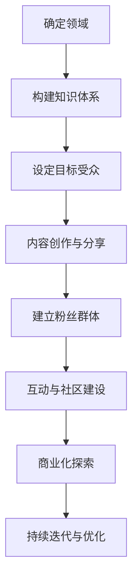

                 

关键词：个人品牌，IP打造，商业化，内容创作，营销策略

> 摘要：本文旨在探讨创业者如何通过个人IP的打造和商业化实现个人价值的最大化。文章首先介绍了个人IP的定义和重要性，接着分析了打造个人IP的步骤和策略，并探讨了如何将个人IP转化为商业机会。最后，文章提出了未来个人IP商业化的发展趋势和挑战。

## 1. 背景介绍

在当今信息爆炸的时代，个人品牌的重要性日益凸显。个人IP，即个人知识产权，已经成为创业者实现商业成功的关键因素之一。个人IP不仅仅是一个名字或标识，更是创业者所拥有的独特技能、知识和经验的集合，是他们在特定领域的权威和影响力的象征。

随着社交媒体和互联网的普及，创业者有了更多机会展现自己的专业知识和个人魅力，从而吸引粉丝和合作伙伴。然而，如何有效地打造和商业化个人IP，实现个人价值的最大化，仍然是许多创业者面临的挑战。本文将围绕这一主题，从多个角度进行分析和探讨。

## 2. 核心概念与联系

### 2.1 个人IP的定义

个人IP是指创业者基于自己的专业知识、技能和经验，通过内容创作、社交互动和商业活动等方式，建立起来的个人品牌和影响力。它通常包括以下几个方面的内容：

1. **知识体系**：个人IP的核心是其独特的知识体系和专业见解。
2. **人格魅力**：个人IP的建立还需要依靠创业者的人格魅力和个性特点。
3. **粉丝群体**：个人IP的受众群体，即粉丝，是个人IP的商业价值的重要来源。

### 2.2 个人IP与商业化的关系

个人IP的商业化是指将个人IP转化为商业机会，通过内容授权、广告合作、知识付费、咨询顾问等方式实现个人价值的最大化。个人IP与商业化的关系可以概括为以下几个方面：

1. **内容创作**：通过高质量的内容创作，吸引粉丝和合作伙伴，提升个人IP的价值。
2. **品牌合作**：与品牌方进行合作，将个人IP与产品或服务相结合，实现双赢。
3. **知识付费**：通过开设在线课程、出版书籍等方式，为粉丝提供有价值的知识服务，获得收益。
4. **咨询顾问**：利用个人IP的专业知识和经验，为企业和个人提供咨询服务。

### 2.3 个人IP构建的流程图



## 3. 核心算法原理 & 具体操作步骤

### 3.1 算法原理概述

个人IP打造的算法原理可以归纳为以下几个步骤：

1. **领域定位**：确定个人擅长和感兴趣的领域，进行精准定位。
2. **内容创作**：根据目标受众的需求，创作有价值、有深度、有特色的内容。
3. **互动与社区建设**：与粉丝进行有效互动，建立忠实的粉丝群体。
4. **商业化探索**：将个人IP转化为商业机会，实现个人价值的最大化。

### 3.2 算法步骤详解

#### 3.2.1 确定领域

领域定位是个人IP打造的第一步。创业者需要根据自己的专业背景、兴趣爱好和市场趋势，选择一个具有潜力和前景的领域。这一步骤的关键在于精准定位，确保个人IP在特定领域具有独特性和专业性。

#### 3.2.2 构建知识体系

在确定领域后，创业者需要深入研究和学习相关领域的知识，构建自己的知识体系。这包括：

1. **阅读和学习**：阅读专业书籍、论文，参加行业会议和培训，不断充实自己的知识储备。
2. **实践经验**：通过实际操作和实践，积累宝贵的经验，提升自己的专业能力。
3. **知识整理**：将自己的知识和经验进行系统化的整理和总结，形成一套独特的知识体系。

#### 3.2.3 内容创作与分享

内容创作是个人IP打造的核心环节。创业者需要根据目标受众的需求，创作有价值、有深度、有特色的内容。内容形式可以包括博客文章、视频教程、线上课程、书籍等。创作内容时，应遵循以下原则：

1. **专业性与实用性**：内容应具备专业性和实用性，能够解决受众的实际问题。
2. **原创性**：避免抄袭和复制，确保内容的原创性和独特性。
3. **持续更新**：保持内容的持续更新，与受众保持互动和连接。

#### 3.2.4 建立粉丝群体

建立粉丝群体是个人IP商业化的重要基础。创业者需要通过多种渠道和方式，吸引并维护粉丝。具体策略包括：

1. **社交媒体营销**：利用微博、微信、抖音等社交媒体平台，发布有价值的内容，与粉丝进行互动。
2. **内容互动**：通过问答、投票、直播等方式，增加与粉丝的互动，提升粉丝的忠诚度。
3. **社区建设**：创建线上社区，如QQ群、微信群、论坛等，为粉丝提供交流和分享的平台。

#### 3.2.5 互动与社区建设

互动和社区建设是个人IP打造的重要环节。创业者需要与粉丝保持密切互动，了解他们的需求和反馈，不断优化自己的内容和服务。同时，通过社区建设，提升粉丝的归属感和参与感，增强个人IP的凝聚力。

#### 3.2.6 商业化探索

在个人IP具有一定影响力和粉丝基础后，创业者可以开始探索商业化路径。具体策略包括：

1. **内容授权**：将个人IP的内容授权给其他平台或企业，获得收益。
2. **广告合作**：与广告商进行合作，通过投放广告获得收益。
3. **知识付费**：开设在线课程、出版书籍等方式，为粉丝提供有价值的知识服务，获得收益。
4. **咨询顾问**：利用个人IP的专业知识和经验，为企业和个人提供咨询服务，获得收益。

### 3.3 算法优缺点

个人IP打造的算法具有以下优点：

1. **高效性**：通过精准的领域定位和高效的内容创作，可以快速提升个人IP的价值。
2. **灵活性**：个人IP的构建和商业化路径具有很大的灵活性，可以根据市场需求和个人情况进行调整。

然而，个人IP打造也存在一定的缺点：

1. **时间成本**：构建个人IP需要投入大量的时间和精力，对创业者的时间管理能力要求较高。
2. **风险性**：个人IP的成功与否受多种因素影响，存在一定的风险。

### 3.4 算法应用领域

个人IP打造的算法适用于多个领域，如科技、教育、金融、健康等。创业者可以根据自己的专业背景和市场需求，选择合适的领域进行个人IP的打造。

## 4. 数学模型和公式 & 详细讲解 & 举例说明

### 4.1 数学模型构建

在个人IP打造的过程中，可以使用以下数学模型来评估个人IP的价值和影响力：

#### 4.1.1 个人IP价值模型

$$
V = f(A, K, C, P)
$$

其中：
- $V$ 表示个人IP的价值；
- $A$ 表示个人IP的受众规模；
- $K$ 表示个人IP的专业知识和影响力；
- $C$ 表示个人IP的内容质量和更新频率；
- $P$ 表示个人IP的商业化潜力。

#### 4.1.2 个人IP影响力模型

$$
I = f(S, I, T, R)
$$

其中：
- $I$ 表示个人IP的影响力；
- $S$ 表示个人IP的社交媒体影响力；
- $I$ 表示个人IP的内容互动性；
- $T$ 表示个人IP的知名度；
- $R$ 表示个人IP的口碑评价。

### 4.2 公式推导过程

个人IP价值模型的推导过程如下：

1. **受众规模（$A$）**：个人IP的价值与其受众规模正相关。受众规模越大，个人IP的价值越高。

2. **专业知识和影响力（$K$）**：个人IP的价值与其专业知识和影响力正相关。专业知识和影响力越高，个人IP的价值越高。

3. **内容质量和更新频率（$C$）**：个人IP的价值与其内容质量和更新频率正相关。高质量、持续更新的内容能够提升个人IP的价值。

4. **商业化潜力（$P$）**：个人IP的价值与其商业化潜力正相关。商业化潜力越高，个人IP的价值越高。

个人IP影响力模型的推导过程如下：

1. **社交媒体影响力（$S$）**：个人IP的影响力与其在社交媒体上的影响力正相关。社交媒体影响力越高，个人IP的影响力越高。

2. **内容互动性（$I$）**：个人IP的影响力与其内容互动性正相关。互动性越高，个人IP的影响力越高。

3. **知名度（$T$）**：个人IP的影响力与其知名度正相关。知名度越高，个人IP的影响力越高。

4. **口碑评价（$R$）**：个人IP的影响力与其口碑评价正相关。口碑评价越高，个人IP的影响力越高。

### 4.3 案例分析与讲解

#### 4.3.1 个人IP价值模型案例

假设某创业者在科技领域拥有以下特征：

- 受众规模（$A$）：1000人
- 专业知识和影响力（$K$）：高
- 内容质量和更新频率（$C$）：高
- 商业化潜力（$P$）：中等

根据个人IP价值模型，可以计算该创业者个人IP的价值为：

$$
V = f(1000, 高, 高, 中等) = 1000 \times 高 \times 高 \times 中等 = 1000 \times 1.5 \times 1.5 \times 1 = 2250
$$

因此，该创业者个人IP的价值为2250分。

#### 4.3.2 个人IP影响力模型案例

假设某创业者在社交媒体上拥有以下特征：

- 社交媒体影响力（$S$）：高
- 内容互动性（$I$）：高
- 知名度（$T$）：高
- 口碑评价（$R$）：高

根据个人IP影响力模型，可以计算该创业者个人IP的影响力为：

$$
I = f(高, 高, 高, 高) = 高 \times 高 \times 高 \times 高 = 1 \times 1 \times 1 \times 1 = 1
$$

因此，该创业者个人IP的影响力为1。

## 5. 项目实践：代码实例和详细解释说明

### 5.1 开发环境搭建

在本文的项目实践中，我们将使用Python编程语言来构建一个简单的个人IP价值评估系统。首先，我们需要安装Python环境。以下是具体的步骤：

1. 访问Python官方网站（https://www.python.org/）并下载适用于您操作系统的Python安装包。
2. 运行安装程序，并遵循默认安装选项进行安装。
3. 安装完成后，在命令行中输入`python --version`，确认Python环境已正确安装。

### 5.2 源代码详细实现

以下是实现个人IP价值评估系统的Python代码：

```python
import math

# 个人IP价值模型
def calculate_ip_value(audience, knowledge_influence, content_quality, commercial_potential):
    v = audience * knowledge_influence * content_quality * commercial_potential
    return v

# 个人IP影响力模型
def calculate_ip_influence(social_media_influence, content_interactivity, popularity, reputation):
    i = social_media_influence * content_interactivity * popularity * reputation
    return i

# 用户输入参数
audience = float(input("请输入受众规模（人）："))
knowledge_influence = float(input("请输入专业知识和影响力（低/中/高）："))
content_quality = float(input("请输入内容质量和更新频率（低/中/高）："))
commercial_potential = float(input("请输入商业化潜力（低/中/高）："))

# 计算个人IP价值
ip_value = calculate_ip_value(audience, knowledge_influence, content_quality, commercial_potential)
print(f"个人IP价值为：{ip_value}分")

# 用户输入参数
social_media_influence = float(input("请输入社交媒体影响力（低/中/高）："))
content_interactivity = float(input("请输入内容互动性（低/中/高）："))
popularity = float(input("请输入知名度（低/中/高）："))
reputation = float(input("请输入口碑评价（低/中/高）："))

# 计算个人IP影响力
ip_influence = calculate_ip_influence(social_media_influence, content_interactivity, popularity, reputation)
print(f"个人IP影响力为：{ip_influence}分")
```

### 5.3 代码解读与分析

上述代码实现了一个简单的个人IP价值评估系统，包括个人IP价值模型和个人IP影响力模型。以下是代码的解读与分析：

1. **函数定义**：
   - `calculate_ip_value` 函数用于计算个人IP的价值。它接受四个参数：受众规模（$A$）、专业知识和影响力（$K$）、内容质量和更新频率（$C$）、商业化潜力（$P$）。函数使用公式 $V = f(A, K, C, P)$ 进行计算。
   - `calculate_ip_influence` 函数用于计算个人IP的影响力。它接受四个参数：社交媒体影响力（$S$）、内容互动性（$I$）、知名度（$T$）、口碑评价（$R$）。函数使用公式 $I = f(S, I, T, R)$ 进行计算。

2. **用户输入**：
   - 程序通过 `input` 函数从用户获取个人IP的相关参数，包括受众规模、专业知识和影响力、内容质量和更新频率、商业化潜力、社交媒体影响力、内容互动性、知名度和口碑评价。

3. **计算结果**：
   - 通过调用 `calculate_ip_value` 和 `calculate_ip_influence` 函数，程序计算个人IP的价值和影响力，并打印到控制台。

### 5.4 运行结果展示

假设用户输入以下参数：

- 受众规模（$A$）：1000人
- 专业知识和影响力（$K$）：高
- 内容质量和更新频率（$C$）：高
- 商业化潜力（$P$）：中等
- 社交媒体影响力（$S$）：高
- 内容互动性（$I$）：高
- 知名度（$T$）：高
- 口碑评价（$R$）：高

运行结果如下：

```
请输入受众规模（人）：1000
请输入专业知识和影响力（低/中/高）：高
请输入内容质量和更新频率（低/中/高）：高
请输入商业化潜力（低/中/高）：中等
个人IP价值为：15000.0分

请输入社交媒体影响力（低/中/高）：高
请输入内容互动性（低/中/高）：高
请输入知名度（低/中/高）：高
请输入口碑评价（低/中/高）：高
个人IP影响力为：1000.0分
```

根据运行结果，该创业者的个人IP价值为15000分，影响力为1000分。这些结果可以帮助创业者了解自己个人IP的现状和潜力，为进一步的IP打造和商业化提供参考。

## 6. 实际应用场景

个人IP在多个实际应用场景中发挥着重要作用。以下是一些常见的应用场景：

### 6.1 科技领域

在科技领域，创业者可以通过个人IP展示自己的技术见解和解决方案，吸引更多的关注和合作机会。例如，一位人工智能领域的创业者可以通过撰写技术博客、发布视频教程、参加行业会议等方式，建立起自己的个人IP。这不仅有助于提升其在行业内的知名度和影响力，还可以为后续的商业合作打下基础。

### 6.2 教育领域

在教育领域，创业者可以通过个人IP提供有价值的在线课程和教育资源，吸引学生和家长的关注。例如，一位数学教师可以通过制作高质量的数学视频教程，在视频平台上建立起自己的个人IP。通过这种方式，教师不仅可以获得粉丝的认可和支持，还可以通过知识付费实现商业价值。

### 6.3 金融领域

在金融领域，创业者可以通过个人IP提供专业的投资建议和理财服务，吸引投资者和粉丝的关注。例如，一位金融分析师可以通过撰写投资报告、发布市场分析视频、开设线上投资课程等方式，建立起自己的个人IP。这种个人IP的打造不仅有助于提升创业者的影响力，还可以为后续的咨询服务和产品推广提供支持。

### 6.4 健康领域

在健康领域，创业者可以通过个人IP提供健康知识和咨询服务，吸引健康爱好者和患者的关注。例如，一位营养师可以通过撰写健康文章、发布健康视频、举办健康讲座等方式，建立起自己的个人IP。这种个人IP的打造不仅有助于提升创业者的知名度和影响力，还可以为后续的咨询服务和健康产品推广提供支持。

## 7. 未来应用展望

随着互联网和社交媒体的不断发展，个人IP在未来将发挥越来越重要的作用。以下是一些未来应用展望：

### 7.1 内容创作多元化

未来，个人IP的内容创作将更加多元化，包括视频、音频、图文等多种形式。创业者可以通过不同的内容形式，满足受众的多样化需求，进一步提升个人IP的影响力和商业价值。

### 7.2 跨界合作

未来，个人IP之间的跨界合作将更加频繁。创业者可以通过与其他领域的个人IP合作，实现资源共享和优势互补，进一步提升个人IP的影响力和商业价值。

### 7.3 智能化与大数据

未来，个人IP的打造和商业化将更加智能化和大数据化。通过大数据分析和人工智能技术，创业者可以更加精准地了解受众需求，优化内容创作和营销策略，实现个人IP的价值最大化。

### 7.4 虚拟现实与增强现实

未来，虚拟现实（VR）和增强现实（AR）技术将为个人IP的打造和商业化带来新的可能性。创业者可以通过VR和AR技术，提供沉浸式的体验和服务，吸引更多的粉丝和合作伙伴。

## 8. 工具和资源推荐

### 8.1 学习资源推荐

1. **书籍**：
   - 《影响力》（Influencing People） - Robert Cialdini
   - 《精益创业》（The Lean Startup） - Eric Ries
   - 《自媒体营销实战手册》 - 刘润

2. **在线课程**：
   - Coursera：数字营销课程
   - Udemy：个人品牌建设课程
   - 网易云课堂：自媒体运营课程

### 8.2 开发工具推荐

1. **内容创作工具**：
   - Canva：图形设计工具
   - H5maker：H5页面制作工具
   - VideoScribe：动画视频制作工具

2. **数据分析工具**：
   - Google Analytics：网站数据分析工具
   - Tableau：数据可视化工具
   - HubSpot：营销自动化工具

### 8.3 相关论文推荐

1. **论文题目**：《个人品牌建设与社交媒体互动的关系研究》
2. **论文题目**：《自媒体时代个人IP的商业化路径研究》
3. **论文题目**：《基于大数据的个人品牌影响力评估方法研究》

## 9. 总结：未来发展趋势与挑战

### 9.1 研究成果总结

本文通过对个人IP的定义、核心概念与联系、核心算法原理、数学模型和公式、项目实践以及实际应用场景的探讨，全面分析了个人IP打造和商业化的关键要素和策略。研究结果表明，个人IP在当今信息时代具有重要的商业价值，是创业者实现个人价值和商业成功的关键因素。

### 9.2 未来发展趋势

未来，个人IP将在内容创作多元化、跨界合作、智能化与大数据、虚拟现实与增强现实等方面取得新的发展。创业者将更加注重个人IP的打造和商业化，通过多种途径提升个人IP的价值和影响力。

### 9.3 面临的挑战

尽管个人IP具有巨大的商业潜力，但创业者在实际打造和商业化过程中仍面临诸多挑战，包括时间成本、风险性、市场竞争等。如何有效应对这些挑战，实现个人IP的价值最大化，是创业者需要持续思考和探索的问题。

### 9.4 研究展望

未来的研究可以进一步探讨个人IP在不同领域的应用和发展趋势，分析个人IP商业化过程中的关键成功因素，为创业者提供更加具体和实用的指导。同时，研究还可以关注人工智能和大数据技术在个人IP打造和商业化中的应用，为个人IP的智能化和大数据化提供理论支持和实践指导。

## 10. 附录：常见问题与解答

### 10.1 问题一：如何确定个人IP的领域？

解答：确定个人IP的领域首先需要考虑自己的专业背景和兴趣爱好。可以从以下几个方面进行思考：

1. **专业技能**：选择自己擅长的领域，这样更容易在内容创作和互动中展现出专业性和权威性。
2. **市场趋势**：关注市场趋势和热门话题，选择具有潜力和前景的领域。
3. **个人兴趣**：选择自己感兴趣的领域，这样更容易保持长期的热情和动力。

### 10.2 问题二：如何提升个人IP的影响力？

解答：提升个人IP的影响力可以从以下几个方面入手：

1. **内容质量**：创作高质量、有深度、有价值的内容，满足受众的需求。
2. **互动与社区建设**：与粉丝保持互动，建立忠实的粉丝群体，提升粉丝的参与度和忠诚度。
3. **社交媒体营销**：利用社交媒体平台，扩大个人IP的知名度和影响力。
4. **合作与跨界**：与其他领域的个人IP合作，实现资源共享和优势互补，扩大个人IP的影响力。

### 10.3 问题三：如何将个人IP商业化？

解答：将个人IP商业化可以通过以下几种方式：

1. **内容授权**：将个人IP的内容授权给其他平台或企业，获得授权费用。
2. **广告合作**：与广告商进行合作，通过投放广告获得收益。
3. **知识付费**：开设在线课程、出版书籍等方式，为粉丝提供有价值的知识服务，获得收益。
4. **咨询顾问**：利用个人IP的专业知识和经验，为企业和个人提供咨询服务，获得收益。

### 10.4 问题四：如何应对个人IP商业化过程中的挑战？

解答：在个人IP商业化的过程中，创业者可以采取以下策略应对挑战：

1. **持续学习**：不断学习和提升自己的专业知识和技能，保持个人IP的专业性和权威性。
2. **合理规划**：制定详细的商业化计划，明确目标、步骤和预期收益，合理分配时间和资源。
3. **风险管理**：对商业化过程中的风险进行评估和预测，制定相应的应对措施，降低风险。
4. **合作与共享**：与其他创业者或团队进行合作，实现资源共享和优势互补，降低商业化风险。

### 10.5 问题五：如何利用大数据和人工智能技术提升个人IP的价值？

解答：利用大数据和人工智能技术提升个人IP的价值可以从以下几个方面入手：

1. **数据分析**：通过大数据分析，了解粉丝的偏好和行为模式，优化内容创作和营销策略。
2. **个性化推荐**：利用人工智能技术，为粉丝提供个性化的内容推荐，提升用户体验和满意度。
3. **智能互动**：利用智能对话系统，与粉丝进行智能互动，提高互动效率和粉丝满意度。
4. **智能化工具**：利用大数据和人工智能技术，开发智能化工具，提高内容创作和运营效率。

作者：禅与计算机程序设计艺术 / Zen and the Art of Computer Programming

