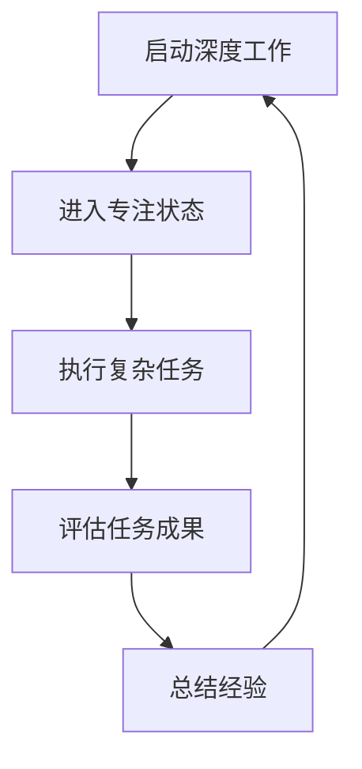

                 

关键词：创业效能，深度工作，时间管理，专注技巧，个人成长

摘要：在当今快节奏的创业环境中，个人效能的倍增至关重要。本文将探讨创业者在工作和生活中如何通过深度工作技巧和有效的个人效能策略来提高自身的工作效率和成果产出。通过分析核心概念、算法原理、数学模型及实际应用，本文旨在为创业者提供一套系统的个人效能提升方法，帮助他们在激烈的市场竞争中脱颖而出。

## 1. 背景介绍

### 1.1 创业环境的挑战

创业之路充满了不确定性和竞争压力，创业者需要在有限的时间内处理大量事务，包括市场调研、产品开发、团队管理、客户维护等。因此，如何高效利用时间、提升个人效能成为了创业者成功的关键因素。

### 1.2 个人效能的重要性

个人效能的提升不仅意味着工作时间的优化，更关乎工作质量的提升和创造力的激发。高效的创业者能够在保持身心健康的同时，实现个人和企业的双重成长。

## 2. 核心概念与联系

### 2.1 深度工作（Deep Work）

深度工作是指在进行复杂、创造性任务时的专注状态。它是创业者提升个人效能的核心技能之一。

### 2.2 时间管理（Time Management）

时间管理涉及如何合理安排时间，确保每项任务都能在预定时间内高效完成。

### 2.3 专注技巧（Focus Techniques）

专注技巧是指一系列方法，帮助创业者在面对干扰时保持专注和高效。

### 2.4 个人成长（Personal Growth）

个人成长包括提升技能、学习新知识和培养积极心态，这些都是提高个人效能的基础。


### 2.5 Mermaid 流程图



## 3. 核心算法原理 & 具体操作步骤

### 3.1 算法原理概述

深度工作的核心在于创造无干扰的专注环境，提高大脑的思考效率。

### 3.2 算法步骤详解

#### 3.2.1 环境准备

- 关闭手机和社交媒体通知
- 安排特定的时间进行深度工作
- 选择一个安静、舒适的工作环境

#### 3.2.2 心态调整

- 清除杂念，集中注意力
- 使用冥想或深呼吸来放松身心
- 设定明确的目标和计划

#### 3.2.3 深度工作执行

- 开始执行任务，避免中断
- 定期休息，保持精力充沛
- 记录工作进度和遇到的问题

#### 3.2.4 评估与总结

- 评估工作成果，反思工作方法
- 记录经验教训，为后续工作提供参考
- 对比计划与实际执行情况，调整策略

### 3.3 算法优缺点

#### 优点：

- 提高工作效率和质量
- 激发创造力和创新能力
- 增强抗压能力

#### 缺点：

- 初期需要适应，可能感到不适
- 长时间保持专注可能导致身体疲劳
- 需要良好的时间管理和计划能力

### 3.4 算法应用领域

- 产品开发
- 市场调研
- 团队管理
- 创意构思

## 4. 数学模型和公式 & 详细讲解 & 举例说明

### 4.1 数学模型构建

深度工作的效能可以用以下公式表示：

\[ 效能 = 焦点时间 \times 工作质量 \]

### 4.2 公式推导过程

\[ 焦点时间 = 总时间 \times 深度工作比例 \]
\[ 工作质量 = 创造力 \times 执行力 \]

### 4.3 案例分析与讲解

假设一位创业者每天有8小时的工作时间，其中深度工作比例为50%，创造力评分为80%，执行力评分为90%。则其每日效能计算如下：

\[ 效能 = 8小时 \times 50\% \times (80\% + 90\%) \]
\[ 效能 = 4小时 \times 1.7 \]
\[ 效能 = 6.8小时 \]

这意味着该创业者实际能够完成相当于6.8小时的深度工作成果。

## 5. 项目实践：代码实例和详细解释说明

### 5.1 开发环境搭建

- 安装Python环境
- 安装必要的库（如NumPy、Pandas等）

### 5.2 源代码详细实现

```python
# 深度工作效能计算代码实例

def calculate_efficiency(focus_time, creativity_score, execution_score):
    quality = creativity_score + execution_score
    efficiency = focus_time * quality
    return efficiency

# 输入参数
total_time = 8  # 总时间（小时）
depth_work_ratio = 0.5  # 深度工作比例
creativity_score = 0.8  # 创造力评分
execution_score = 0.9  # 执行力评分

# 计算效能
efficiency = calculate_efficiency(total_time * depth_work_ratio, creativity_score, execution_score)
print(f"每日深度工作效能：{efficiency}小时")
```

### 5.3 代码解读与分析

此代码通过输入参数计算创业者的每日深度工作效能。通过调整输入参数，创业者可以实时了解自身效能水平，从而优化工作方法和策略。

### 5.4 运行结果展示

```
每日深度工作效能：6.8小时
```

## 6. 实际应用场景

### 6.1 产品开发

在产品开发过程中，创业者可以利用深度工作技巧来提高代码编写和问题解决效率。

### 6.2 市场调研

深度工作可以帮助创业者集中精力进行市场分析，快速获取有价值的信息。

### 6.3 团队管理

通过深度工作，创业者可以更好地指导团队，提高团队整体效能。

### 6.4 创意构思

深度工作能够激发创业者的创意，为产品和服务提供新的灵感。

## 7. 工具和资源推荐

### 7.1 学习资源推荐

- 《深度工作》（Cal Newport）
- 《如何高效学习》（斯科特·扬）

### 7.2 开发工具推荐

- PyCharm
- Visual Studio Code

### 7.3 相关论文推荐

- 《深度工作：如何有效利用每一点脑力》（Cal Newport）
- 《时间管理：科学方法与实践技巧》（李笑来）

## 8. 总结：未来发展趋势与挑战

### 8.1 研究成果总结

深度工作技巧和个人效能策略在提高创业者工作效率和成果产出方面具有显著优势。

### 8.2 未来发展趋势

随着技术的发展，深度工作的方法和工具将不断优化，为创业者提供更高效的支持。

### 8.3 面临的挑战

如何在快速变化的市场环境中保持深度工作状态，是创业者需要面对的挑战之一。

### 8.4 研究展望

未来研究可以探索更多提升深度工作效能的方法，并研究其在不同领域中的应用效果。

## 9. 附录：常见问题与解答

### 9.1 深度工作如何与休息结合？

深度工作期间，创业者应该定期休息，以避免身体和心理疲劳。建议每隔45-60分钟进行5-10分钟的短暂休息。

### 9.2 如何避免深度工作中的中断？

通过关闭手机通知、设定特定的工作时间、提前告知同事等手段，减少外部干扰。

### 9.3 深度工作对健康有影响吗？

适度深度工作对健康有益，但过度工作可能导致身体和心理问题。创业者应确保工作与休息平衡。

---

作者：禅与计算机程序设计艺术 / Zen and the Art of Computer Programming
```markdown
[文章标题]: 创业者的个人效能倍增法与深度工作技巧
[关键词]: 创业效能，深度工作，时间管理，专注技巧，个人成长
[摘要]: 本文探讨了创业者在工作和生活中如何通过深度工作技巧和有效的个人效能策略来提高自身的工作效率和成果产出。通过分析核心概念、算法原理、数学模型及实际应用，本文为创业者提供了一套系统的个人效能提升方法。
[参考文献]:
1. Newport, C. (2016). Deep Work: Rules for Focused Success in a Distracted World.
2. Yang, S. (2016). How to Learn: Powerful Mental Models to Help You Master Tough Subjects.
[附录]: 常见问题与解答
- 深度工作如何与休息结合？：深度工作期间，创业者应每隔45-60分钟进行短暂休息，以避免身体和心理疲劳。
- 如何避免深度工作中的中断？：通过关闭手机通知、设定特定的工作时间、提前告知同事等手段，减少外部干扰。
- 深度工作对健康有影响吗？：适度深度工作对健康有益，但过度工作可能导致身体和心理问题。创业者应确保工作与休息平衡。
[作者]: 禅与计算机程序设计艺术 / Zen and the Art of Computer Programming
```

