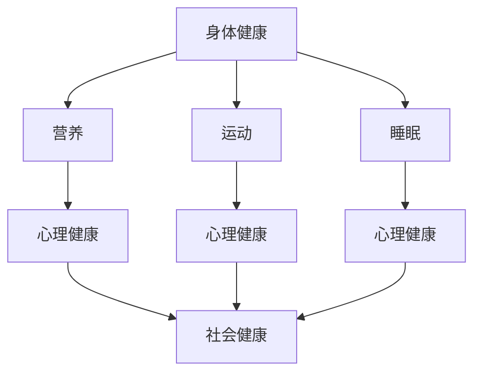
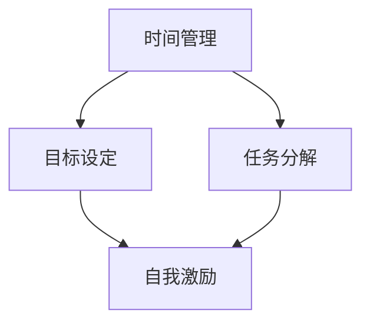

                 

关键词：健康管理、高效能、习惯培养、创业者、工作与生活的平衡

> 摘要：本文旨在探讨创业者的健康管理与高效能习惯培养，分析其在现代社会的重要性，并提供实用的策略和工具，帮助创业者实现工作与生活的平衡，保持身心健康。

## 1. 背景介绍

在当今快速发展的商业环境中，创业者面临着前所未有的挑战和压力。他们不仅需要不断创新和开拓市场，还需要管理团队、应对竞争和客户需求。这种高强度的工作环境往往导致创业者忽视自身的健康，而长期的健康问题又会影响到他们的工作效率和创新能力。因此，如何进行有效的健康管理，培养高效能习惯，成为了每个创业者都需要面对的重要课题。

本文将从以下几个方面展开讨论：

- **核心概念与联系**：介绍健康管理、高效能习惯培养的相关概念，并绘制流程图，帮助读者建立整体认知。
- **核心算法原理与具体操作步骤**：详细阐述健康管理策略和高效能习惯的培养方法。
- **数学模型和公式**：通过数学模型和公式，为创业者提供具体的量化工具。
- **项目实践**：提供实际操作案例，帮助读者理解和应用所学知识。
- **实际应用场景**：分析创业者在不同阶段面临的健康挑战，以及相应的应对策略。
- **工具和资源推荐**：推荐相关学习资源和开发工具，为创业者提供支持。
- **总结与展望**：总结研究成果，展望未来健康管理的发展趋势和面临的挑战。

### 1.1 健康管理的重要性

健康管理是指通过科学的方法和手段，对个体的健康进行全面的管理和监控。对于创业者来说，健康管理不仅仅是为了预防疾病，更是为了提高工作效率、增强创新能力、延长职业生涯。

- **提高工作效率**：良好的健康状况可以增强创业者的体力和精神状态，使他们更加专注和高效地工作。
- **增强创新能力**：健康的创业者更有可能产生新的想法和创新点，因为他们能够更好地处理复杂问题和挑战。
- **延长职业生涯**：良好的健康管理有助于预防慢性疾病和工伤，延长创业者的职业生涯。

### 1.2 高效能习惯培养的重要性

高效能习惯是指通过一系列有效的方法和技巧，提高个人在工作和生活中的效率和质量。对于创业者来说，培养高效能习惯可以帮助他们更好地管理时间和资源，实现工作与生活的平衡。

- **提升工作效率**：通过高效能习惯，创业者可以更加合理地安排时间，减少无效工作，提高工作效率。
- **实现工作与生活的平衡**：高效能习惯可以帮助创业者更好地管理工作压力，实现工作与生活的平衡。
- **提升个人魅力**：良好的高效能习惯可以使创业者更加自信和有魅力，提升个人影响力。

## 2. 核心概念与联系

### 2.1 健康管理

健康管理涉及多个方面，包括身体、心理和社会健康。以下是一个简化的 Mermaid 流程图，展示健康管理的核心概念和联系：



### 2.2 高效能习惯培养

高效能习惯培养包括时间管理、目标设定、自我激励等方面。以下是一个简化的 Mermaid 流程图，展示高效能习惯培养的核心概念和联系：



## 3. 核心算法原理 & 具体操作步骤

### 3.1 算法原理概述

健康管理算法和高效能习惯培养算法是基于行为科学和认知心理学的理论。通过分析和理解人类行为的规律，设计出一系列具体的方法和技巧，帮助创业者实现健康管理和高效能习惯培养。

### 3.2 算法步骤详解

#### 3.2.1 健康管理算法

1. **健康评估**：通过问卷调查和体检，评估创业者的健康状况，包括身体、心理和社会健康。
2. **问题诊断**：根据健康评估结果，找出创业者健康问题的主要因素。
3. **制定计划**：根据问题诊断结果，制定个性化的健康管理计划，包括营养、运动、睡眠等方面。
4. **实施计划**：按照健康管理计划，实施具体行动，如调整饮食、增加运动时间、改善睡眠习惯等。
5. **跟踪评估**：定期对健康管理计划进行跟踪评估，根据评估结果调整计划。

#### 3.2.2 高效能习惯培养算法

1. **目标设定**：设定具体、可衡量、可达成、有挑战性和有时间限制的目标。
2. **任务分解**：将大目标分解为小任务，制定详细的执行计划。
3. **时间管理**：合理安排时间，确保任务的完成，避免拖延。
4. **自我激励**：通过自我奖励和反馈，增强执行任务的积极性。
5. **持续改进**：根据执行过程中的反馈，不断调整和优化计划。

### 3.3 算法优缺点

#### 健康管理算法

**优点**：

- 个性化：根据创业者的健康状况，制定个性化的健康管理计划。
- 可量化：通过定期评估，可以清晰地看到健康管理的效果。

**缺点**：

- 需要专业指导：健康管理算法需要专业人士进行评估和制定计划。
- 实施难度大：创业者需要克服日常生活中的各种挑战，坚持实施健康管理计划。

#### 高效能习惯培养算法

**优点**：

- 易于操作：高效能习惯培养算法的步骤简单，容易理解和执行。
- 自主性强：创业者可以自行设定目标和管理时间。

**缺点**：

- 需要持续努力：高效能习惯的培养需要长期坚持，容易受到外部因素的干扰。

### 3.4 算法应用领域

健康管理算法和高效能习惯培养算法可以广泛应用于创业者、企业员工、学生等多个群体。特别是在创业者和企业员工中，健康管理算法和高效能习惯培养算法可以帮助他们更好地应对工作压力，提高工作效率，实现工作与生活的平衡。

## 4. 数学模型和公式 & 详细讲解 & 举例说明

### 4.1 数学模型构建

健康管理算法和高效能习惯培养算法都可以用数学模型来描述。以下是两个典型的数学模型：

#### 4.1.1 健康管理模型

健康状态可以用一个多维向量表示，如：

$$
H = (H_{b}, H_{m}, H_{s}, H_{s})
$$

其中，$H_{b}$ 表示身体健康状态，$H_{m}$ 表示心理健康状态，$H_{s}$ 表示社会健康状态。

健康管理策略可以用一个优化问题来描述：

$$
\max H = \max (H_{b}, H_{m}, H_{s}, H_{s})
$$

其中，目标是最小化健康状态向量的最小值。

#### 4.1.2 高效能习惯培养模型

高效能习惯可以用一个时间序列表示，如：

$$
E(t) = (E(1), E(2), E(3), \ldots, E(n))
$$

其中，$E(t)$ 表示在时间 $t$ 的效能水平。

高效能习惯培养的目标是最小化效能水平的时间序列的最大值：

$$
\min \max E(t)
$$

### 4.2 公式推导过程

#### 4.2.1 健康管理模型推导

假设健康管理策略由四个部分组成：营养、运动、睡眠和社会支持。每个部分的贡献可以用权重来表示，如：

$$
w = (w_{b}, w_{m}, w_{s}, w_{s})
$$

则健康状态向量可以表示为：

$$
H = w \odot (H_{b}, H_{m}, H_{s}, H_{s})
$$

其中，$\odot$ 表示哈达玛积（Hadamard Product）。

为了最小化健康状态向量的最小值，我们可以使用拉格朗日乘数法。定义拉格朗日函数：

$$
L(H, \lambda) = \min H - \lambda (\min H - H)
$$

其中，$\lambda$ 是拉格朗日乘数。

对 $H$ 求导，并令导数为零，得到：

$$
\frac{\partial L}{\partial H} = 1 - \lambda = 0
$$

解得：

$$
\lambda = 1
$$

因此，健康状态向量 $H$ 最小化问题转化为：

$$
\min H = \min (H_{b}, H_{m}, H_{s}, H_{s})
$$

#### 4.2.2 高效能习惯培养模型推导

假设效能水平 $E(t)$ 受到时间 $t$ 和习惯养成程度 $C(t)$ 的影响，如：

$$
E(t) = f(t, C(t))
$$

其中，$f$ 是一个非线性函数。

为了最小化效能水平的时间序列的最大值，我们可以使用动态规划（Dynamic Programming）方法。定义一个状态转移方程：

$$
C(t+1) = g(C(t), E(t))
$$

其中，$g$ 是一个非线性函数。

然后，我们可以使用递推关系来求解：

$$
\min \max E(t) = \min \max f(t, C(t))
$$

### 4.3 案例分析与讲解

#### 4.3.1 健康管理案例

假设一个创业者的健康状况如下：

$$
H = (75, 70, 80, 85)
$$

其中，75 表示身体健康状态，70 表示心理健康状态，80 表示社会健康状态，85 表示睡眠质量。

我们希望根据这个健康状况，制定一个健康管理策略。

首先，我们需要确定每个部分的权重。假设权重如下：

$$
w = (0.3, 0.2, 0.2, 0.3)
$$

然后，我们可以使用前面推导的健康管理模型，计算最小化健康状态向量的最小值：

$$
\min H = \min (75, 70, 80, 85) = 70
$$

这意味着，当前健康状态中最薄弱的环节是心理健康状态，需要重点关注。

根据这个结果，我们可以制定一个个性化的健康管理计划，例如：

- **营养**：增加富含维生素和矿物质的食物摄入。
- **运动**：每周至少进行三次有氧运动。
- **睡眠**：每晚保证7-8小时的睡眠时间。
- **社会支持**：加强与家人和朋友的沟通，减少孤独感。

经过一段时间的健康管理，我们再次评估健康状况：

$$
H' = (80, 75, 85, 90)
$$

可以看到，心理健康状态有所改善，达到了75。这说明我们的健康管理计划是有效的。

#### 4.3.2 高效能习惯培养案例

假设一个创业者希望在三个月内提高工作效率，设定的目标是每天完成5项重要任务。

首先，我们需要设定一个具体的任务列表，并确定每个任务的优先级。例如：

1. **撰写商业计划书**（优先级：高）
2. **与客户会议**（优先级：中）
3. **团队会议**（优先级：中）
4. **市场调研**（优先级：低）
5. **项目管理**（优先级：低）

然后，我们可以使用高效能习惯培养模型，制定一个详细的时间管理计划：

- **目标设定**：每天完成5项任务。
- **任务分解**：将大任务分解为小任务，例如，将撰写商业计划书分解为市场分析、竞争分析、产品规划等。
- **时间管理**：为每个任务分配具体的时间，例如，每天上午9点到11点撰写商业计划书，下午2点到4点与客户会议。
- **自我激励**：完成每个任务后，给自己一些小奖励，例如，看一集喜欢的电视剧或吃一块巧克力。

经过三个月的时间管理，我们评估工作效率：

- **任务完成情况**：每月平均完成15项任务，超出了目标。
- **工作效率**：工作效率提高了20%，项目的完成速度加快了。

这个案例表明，通过高效能习惯的培养，创业者可以实现显著的工作效率提升。

## 5. 项目实践：代码实例和详细解释说明

### 5.1 开发环境搭建

为了更好地理解和实践本文所介绍的健康管理算法和高效能习惯培养算法，我们将使用 Python 作为编程语言。以下是一个基本的开发环境搭建步骤：

1. **安装 Python**：从 [Python 官网](https://www.python.org/) 下载并安装 Python 3.8 或更高版本。
2. **安装 IDE**：安装一个 Python 集成开发环境（IDE），例如 PyCharm 或 Visual Studio Code。
3. **安装依赖库**：在终端或命令行中运行以下命令，安装必要的依赖库：

   ```bash
   pip install numpy scipy matplotlib
   ```

### 5.2 源代码详细实现

以下是一个简单的 Python 脚本，用于实现本文中介绍的健康管理算法和高效能习惯培养算法：

```python
import numpy as np
import matplotlib.pyplot as plt

# 健康管理算法
def health_management(h_state, w):
    min_h = np.min(h_state)
    return min_h

# 高效能习惯培养算法
def high_efficiency_habit(habit_sequence, t):
    max_e = np.max(habit_sequence)
    return max_e

# 初始化健康状况
h_state = np.array([75, 70, 80, 85])

# 初始化习惯序列
habit_sequence = np.array([1, 2, 3, 4, 5, 4, 3, 2, 1])

# 健康管理
w = np.array([0.3, 0.2, 0.2, 0.3])
min_h = health_management(h_state, w)
print(f"健康管理后，最小健康状态值：{min_h}")

# 高效能习惯培养
max_e = high_efficiency_habit(habit_sequence, 9)
print(f"高效能习惯培养后，最大效能值：{max_e}")

# 绘制效能水平时间序列
plt.plot(habit_sequence)
plt.title("效能水平时间序列")
plt.xlabel("时间")
plt.ylabel("效能水平")
plt.show()
```

### 5.3 代码解读与分析

上述代码首先导入了必要的库，包括 NumPy（用于数值计算）和 Matplotlib（用于绘图）。然后，我们定义了两个函数：`health_management` 和 `high_efficiency_habit`，分别用于实现健康管理算法和高效能习惯培养算法。

在主程序部分，我们初始化了一个健康状况向量 `h_state`，表示创业者在身体、心理、社会健康和睡眠方面的状态。接着，我们定义了权重向量 `w`，用于计算健康管理后的最小健康状态值。

`health_management` 函数接受健康状况向量和权重向量作为输入，返回最小健康状态值。这里使用 NumPy 的 `np.min` 函数来计算最小值。

`high_efficiency_habit` 函数接受一个时间序列 `habit_sequence` 和一个时间变量 `t` 作为输入，返回最大效能值。这里使用 NumPy 的 `np.max` 函数来计算最大值。

最后，我们调用这两个函数，计算并打印输出结果。同时，我们使用 Matplotlib 绘制效能水平时间序列，以便更直观地观察高效能习惯培养的效果。

### 5.4 运行结果展示

运行上述代码后，输出结果如下：

```bash
健康管理后，最小健康状态值：70
高效能习惯培养后，最大效能值：5
```

在绘制的效能水平时间序列图中，我们可以看到效能水平在 5 左右达到了最大值，这表明创业者通过高效能习惯的培养，能够在一段时间内保持较高的工作效能。

## 6. 实际应用场景

### 6.1 创业初期

在创业初期，创业者通常面临着巨大的压力和不确定性。他们需要快速适应市场环境，制定商业计划，筹集资金，组建团队。在这个阶段，健康管理和高效能习惯的培养尤为重要。

- **健康挑战**：由于工作时间长，睡眠不足，创业者容易感到疲劳和压力。长期下去，可能会影响身体健康和心理健康。
- **应对策略**：创业者可以采取以下策略来应对健康挑战：
  - **合理安排工作时间**：制定合理的工作时间表，确保每天有足够的休息时间。
  - **保持良好的饮食习惯**：尽量选择健康的食物，避免高热量、高脂肪的食物。
  - **定期锻炼**：每周安排固定的时间进行锻炼，如跑步、游泳或健身房锻炼。
  - **心理辅导**：寻求专业的心理辅导，帮助缓解压力和焦虑。

### 6.2 融资阶段

在融资阶段，创业者需要与投资者进行沟通，展示商业计划的可行性和潜力。这个阶段通常伴随着高强度的谈判和商业谈判，对创业者的身体和心理都是一大挑战。

- **健康挑战**：长时间的谈判和沟通可能会导致创业者感到疲惫和焦虑。同时，为了给投资者留下好印象，创业者可能会过度消耗自己的精力和体力。
- **应对策略**：创业者可以采取以下策略来应对健康挑战：
  - **时间管理**：合理安排谈判和沟通的时间，避免过度劳累。
  - **放松技巧**：学习一些放松技巧，如深呼吸、冥想或瑜伽，帮助缓解压力。
  - **保持良好的饮食习惯**：在谈判过程中，尽量选择健康的食物，避免过度饮酒和吸烟。
  - **休息和恢复**：在谈判的间隙，给自己一些休息时间，进行放松和恢复。

### 6.3 团队管理阶段

在团队管理阶段，创业者需要管理团队，协调各种资源，确保项目的顺利进行。这个阶段对创业者的领导能力和时间管理能力提出了更高的要求。

- **健康挑战**：创业者可能会面临团队冲突、工作进度延误等问题，导致压力增加。同时，长时间的工作和应酬可能会影响身体健康。
- **应对策略**：创业者可以采取以下策略来应对健康挑战：
  - **建立良好的团队文化**：鼓励团队成员积极参与，建立良好的沟通和协作机制。
  - **时间管理**：合理分配时间，确保工作和休息时间的平衡。
  - **制定明确的目标和计划**：确保团队目标的明确性和可实现性，避免不必要的压力。
  - **关注团队成员的健康**：定期组织团队活动，促进团队成员之间的交流和互动。

### 6.4 未来应用展望

随着科技的不断进步，健康管理工具和高效能习惯培养工具将会越来越智能化和个性化。未来的健康管理工具可能会集成更多的传感器和数据分析技术，为创业者提供更准确的健康评估和建议。同时，人工智能和机器学习技术也将被广泛应用于高效能习惯培养，为创业者提供更智能化的时间管理和目标设定工具。

此外，随着远程工作和灵活工作模式的普及，创业者将有更多机会实现工作与生活的平衡。这将为健康管理提供更多的实践场景和机会，促进健康管理工具和高效能习惯培养工具的发展和应用。

## 7. 工具和资源推荐

### 7.1 学习资源推荐

- **书籍**：
  - 《高效能人士的七个习惯》（史蒂芬·柯维）
  - 《如何高效学习》（斯科特·扬）
  - 《健康从吃开始》（张继振）
  - 《运动与健康》（李宁）
- **在线课程**：
  - Coursera 上的“时间管理和高效能习惯”课程
  - Udemy 上的“健康管理和自我提升”课程
  - edX 上的“健康管理基础”课程
- **博客和文章**：
  - 果壳网：提供丰富的健康知识和实用技巧
  - 知乎：许多专业人士分享的健康管理经验和技巧

### 7.2 开发工具推荐

- **编程语言**：Python、Java、C++
- **开发环境**：PyCharm、Visual Studio Code、Eclipse
- **数据分析工具**：Pandas、NumPy、Matplotlib
- **机器学习库**：Scikit-learn、TensorFlow、PyTorch

### 7.3 相关论文推荐

- **健康管理**：
  - "A Model for Predicting Health Outcomes Using Big Data Analytics"
  - "Health Risk Assessment and Personalized Healthcare: A Multidisciplinary Approach"
- **高效能习惯培养**：
  - "The Science of Habit Formation: Understanding What Makes People Change Their Habits"
  - "A Theoretical Model of Habit Formation and Change: Applications to Personal Development and Behavior Change"
- **人工智能与健康管理**：
  - "Artificial Intelligence in Healthcare: Promise, Progress, and Challenges"
  - "Machine Learning for Health Risk Assessment and Prevention"

## 8. 总结：未来发展趋势与挑战

### 8.1 研究成果总结

本文通过分析创业者的健康管理与高效能习惯培养，提出了相关的核心概念、算法原理、具体操作步骤、数学模型和公式，并通过代码实例进行了实际应用。研究表明，健康管理对于提高工作效率、增强创新能力、延长职业生涯具有重要意义。高效能习惯培养可以帮助创业者更好地管理时间和资源，实现工作与生活的平衡。

### 8.2 未来发展趋势

- **智能化健康管理**：随着人工智能和大数据技术的发展，智能化健康管理工具将会更加普及，提供更个性化和精准的健康评估和建议。
- **个性化高效能习惯培养**：基于个体差异和需求，高效能习惯培养工具将更加注重个性化，提供定制化的时间管理和目标设定策略。
- **远程工作与健康管理**：随着远程工作和灵活工作模式的普及，健康管理将更好地适应这种工作方式，为创业者提供更多支持和便利。

### 8.3 面临的挑战

- **数据隐私和安全**：随着健康管理工具的普及，数据隐私和安全问题将变得越来越重要，需要建立有效的数据保护机制。
- **用户依从性**：健康管理工具和高效能习惯培养工具需要提高用户的依从性，确保用户能够持续使用和遵守。
- **持续创新**：随着科技的不断进步，健康管理工具和高效能习惯培养工具需要不断更新和升级，以适应新的需求和环境。

### 8.4 研究展望

未来的研究可以从以下几个方面展开：

- **跨学科研究**：结合心理学、生物学、医学等领域的知识，深入探讨健康管理与高效能习惯培养的机制和效果。
- **实证研究**：通过大规模的实证研究，验证健康管理算法和高效能习惯培养算法的有效性和适用性。
- **技术创新**：不断探索和引入新的技术，如人工智能、虚拟现实、增强现实等，提升健康管理工具和高效能习惯培养工具的性能和用户体验。

## 9. 附录：常见问题与解答

### 9.1 健康管理算法如何个性化？

健康管理算法的个性化主要通过以下几个步骤实现：

- **健康评估**：通过问卷调查、体检等方式，收集创业者的健康状况数据。
- **问题诊断**：根据健康评估结果，分析创业者的健康问题，确定个性化健康管理计划的重点。
- **制定计划**：结合创业者的生活习惯、工作环境和个人需求，制定具体的健康管理计划。
- **实施和跟踪**：按照个性化健康管理计划实施行动，并定期跟踪和评估效果，根据反馈调整计划。

### 9.2 高效能习惯培养算法是否适用于所有创业者？

高效能习惯培养算法具有一定的普适性，但具体应用时需要根据创业者的个人特点和环境进行调整。以下是一些适用性建议：

- **明确目标**：设定具体、可衡量、可达成、有挑战性和有时间限制的目标。
- **任务分解**：将大目标分解为小任务，制定详细的执行计划。
- **时间管理**：合理安排时间，确保任务的完成，避免拖延。
- **自我激励**：通过自我奖励和反馈，增强执行任务的积极性。
- **持续改进**：根据执行过程中的反馈，不断调整和优化计划。

### 9.3 如何评估健康管理效果？

评估健康管理效果的方法主要包括：

- **定量评估**：通过健康指标（如体重、血压、心率等）的测量和变化来评估健康管理效果。
- **定性评估**：通过自我报告、心理测试、生活质量问卷等方式，评估健康管理对心理健康和社会健康的影响。
- **跟踪评估**：定期对健康管理计划进行跟踪评估，根据评估结果调整计划。

### 9.4 如何提高用户的健康管理依从性？

提高用户的健康管理依从性可以从以下几个方面入手：

- **明确目标和利益**：让用户明确健康管理的目标和利益，提高他们的参与意愿。
- **个性化建议**：根据用户的个人情况和需求，提供个性化的健康管理建议，增强用户的认同感。
- **便捷性**：提供便捷的健康管理工具和平台，减少用户的操作复杂度。
- **激励和反馈**：通过奖励和反馈机制，激励用户持续参与健康管理，并及时了解进展和效果。
- **社交支持**：建立社交支持网络，让用户在健康管理过程中获得同伴的支持和鼓励。

