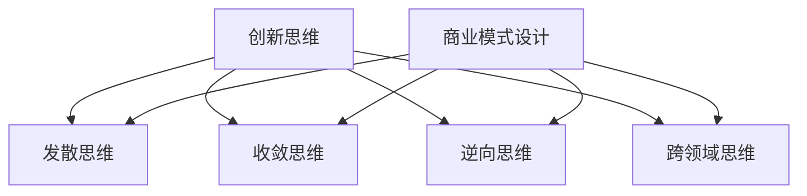

                 

在当今快速变化的商业环境中，创业者和企业家需要具备强大的创新思维和卓越的商业模式设计能力。这不仅有助于他们在竞争激烈的市场中脱颖而出，还能确保他们的企业在长期内保持可持续性。本文将深入探讨创业者的创新思维和商业模式设计，并提供实用的策略和工具，帮助读者构建成功的商业理念。

## 关键词

- 创新思维
- 商业模式设计
- 创业者
- 商业策略
- 市场定位
- 持续发展

## 摘要

本文旨在为创业者提供一整套创新思维和商业模式设计的框架和方法。通过分析创新思维的原理和技巧，以及商业模式设计的核心要素和策略，文章将帮助读者了解如何将创新思维应用于商业模式设计中，以创造有价值的产品和服务，并实现企业的持续成长。

---

## 1. 背景介绍

创业环境在过去几十年里发生了翻天覆地的变化。随着互联网和技术的快速发展，新的市场机会不断涌现，同时也带来了前所未有的竞争。创业不再仅仅是少数人的专利，越来越多的人希望通过创业来实现个人价值和财富积累。然而，成功创业的关键在于创新思维和卓越的商业模式设计。

创新思维是指创业者在面对问题和挑战时，能够灵活运用各种思维方式和方法，寻找独特的解决方案。这种思维不仅包括创造新产品和服务，还涉及到商业模式的创新，如新型收入模式、市场定位策略等。

商业模式设计则是指创业者在构建企业时，如何通过一系列商业决策，包括产品定位、市场定位、收入模式等，来实现企业的盈利和增长。一个成功的商业模式不仅是技术创新的结果，更是市场需求的体现。

本文将首先探讨创新思维的原理和技巧，然后深入分析商业模式设计的核心要素，并提供实用的策略和工具，帮助创业者实现商业成功。

### 1.1 创新思维的重要性

创新思维是创业成功的关键因素之一。它不仅能够帮助企业找到新的市场机会，还能够提升企业的竞争力。以下是一些创新思维的重要性：

- **增加市场机会**：创新思维能够帮助企业发现新的市场需求和商业模式，从而创造新的市场机会。
- **提高竞争力**：通过创新思维，企业可以开发出更具吸引力和竞争力的产品和服务，从而在市场上脱颖而出。
- **推动持续成长**：创新思维能够帮助企业不断适应市场变化，实现持续成长和长期成功。

### 1.2 商业模式设计的核心要素

商业模式设计是企业成功的关键环节。以下是商业模式设计的核心要素：

- **产品定位**：明确产品或服务的特点和目标市场，确保产品能够满足市场需求。
- **市场定位**：了解目标市场，包括市场规模、客户需求、竞争对手等，以制定有效的市场策略。
- **收入模式**：确定企业的收入来源和盈利方式，确保企业能够实现财务可持续性。
- **成本结构**：了解企业的成本构成，优化成本结构，提高盈利能力。
- **价值主张**：明确企业的核心价值和独特卖点，以吸引和保留客户。

### 1.3 创新思维与商业模式设计的联系

创新思维和商业模式设计密不可分。创新思维能够激发创业者的创造力，帮助他们构建独特的商业模式。而商业模式设计则将创新思维转化为实际操作，确保企业能够实现商业目标。

通过创新思维，创业者能够发现新的市场机会，并通过商业模式设计将这些机会转化为实际收益。例如，Airbnb和Uber的成功就是创新思维和商业模式设计相结合的典范。Airbnb通过重新定义住宿服务，利用闲置房源创造新的市场需求；而Uber则通过创新出行模式，解决了城市交通拥堵和打车难的问题。

### 1.4 创业环境的现状

当前的创业环境呈现出以下几个特点：

- **市场机会增多**：随着互联网和技术的快速发展，新的市场机会不断涌现，创业者有了更多的选择。
- **竞争激烈**：市场机会增多也意味着竞争更加激烈，创业者需要不断创新和优化商业模式，以保持竞争力。
- **资金支持**：虽然市场竞争激烈，但创业者仍然能够获得一定的资金支持，包括风险投资、天使投资等。
- **全球化趋势**：全球化使得创业者能够更容易地进入新的市场，但也面临着更多的竞争和挑战。

### 1.5 文章结构

本文将分为以下几个部分：

1. **背景介绍**：阐述创新思维和商业模式设计的重要性，以及创业环境的现状。
2. **核心概念与联系**：介绍创新思维和商业模式设计的核心概念，并提供Mermaid流程图。
3. **核心算法原理 & 具体操作步骤**：详细阐述创新思维和商业模式设计的原理和具体操作步骤。
4. **数学模型和公式 & 详细讲解 & 举例说明**：介绍与商业模式设计相关的数学模型和公式，并提供案例分析和讲解。
5. **项目实践：代码实例和详细解释说明**：提供实际项目中的代码实例和详细解释。
6. **实际应用场景**：探讨创新思维和商业模式设计在实际中的应用场景。
7. **未来应用展望**：预测创新思维和商业模式设计的发展趋势和应用前景。
8. **工具和资源推荐**：推荐相关学习资源和开发工具。
9. **总结：未来发展趋势与挑战**：总结研究成果，探讨未来发展趋势和面临的挑战。
10. **附录：常见问题与解答**：回答读者可能遇到的问题。

---

## 2. 核心概念与联系

在探讨创新思维和商业模式设计之前，我们需要了解一些核心概念，并绘制Mermaid流程图来展示它们之间的联系。

### 2.1 创新思维

创新思维是指创业者在面对问题和挑战时，能够灵活运用各种思维方式和方法，寻找独特的解决方案。以下是创新思维的核心概念：

- **发散思维**：通过多角度、多维度思考，寻找不同的解决方案。
- **收敛思维**：从多个解决方案中筛选出最优解。
- **逆向思维**：从相反的角度思考问题，寻找创新点。
- **跨领域思维**：结合不同领域的知识和方法，寻找新的解决方案。

### 2.2 商业模式设计

商业模式设计是指创业者在构建企业时，通过一系列商业决策，包括产品定位、市场定位、收入模式等，来实现企业的盈利和增长。以下是商业模式设计的关键概念：

- **价值主张**：明确企业的核心价值和独特卖点。
- **目标市场**：确定企业的目标市场和客户群体。
- **收入模式**：确定企业的收入来源和盈利方式。
- **成本结构**：了解企业的成本构成，优化成本结构。
- **关键资源**：确定企业所需的关键资源，包括人力、资金、技术等。
- **合作伙伴**：建立与企业相关的合作伙伴关系，实现资源整合。

### 2.3 Mermaid流程图

以下是一个Mermaid流程图，展示了创新思维和商业模式设计之间的联系。



### 2.4 核心概念联系

创新思维和商业模式设计之间的联系在于，创新思维能够为商业模式设计提供新的思路和解决方案。具体来说：

- **创新思维**可以帮助创业者发现新的市场机会，从而为商业模式设计提供方向。
- **商业模式设计**则将创新思维转化为实际操作，确保企业能够实现商业目标。

例如，通过逆向思维，创业者可以发现现有市场的痛点，从而设计出满足这些痛点的产品或服务；通过跨领域思维，创业者可以将不同领域的知识和方法结合起来，创造出全新的商业模式。

---

## 3. 核心算法原理 & 具体操作步骤

在了解了创新思维和商业模式设计的核心概念后，我们将进一步探讨它们的算法原理和具体操作步骤。

### 3.1 算法原理概述

创新思维和商业模式设计的算法原理主要涉及以下几个方面：

- **发散思维算法**：通过多角度、多维度思考，寻找不同的解决方案。
- **收敛思维算法**：从多个解决方案中筛选出最优解。
- **逆向思维算法**：从相反的角度思考问题，寻找创新点。
- **跨领域思维算法**：结合不同领域的知识和方法，寻找新的解决方案。

这些算法的原理是基于人类的思维模式和行为特点，通过模拟人类思维过程，帮助创业者找到创新的解决方案。

### 3.2 算法步骤详解

下面我们将详细阐述创新思维和商业模式设计的具体操作步骤：

#### 3.2.1 发散思维步骤

1. **问题定义**：明确需要解决的问题或机会。
2. **多角度思考**：从不同角度思考问题，例如从用户需求、技术可行性、市场机会等角度。
3. **产生创意**：记录所有的创意和想法，无论它们是否可行。
4. **筛选创意**：根据可行性、创新性等因素，筛选出最具潜力的创意。

#### 3.2.2 收敛思维步骤

1. **创意筛选**：在发散思维阶段产生的创意中，筛选出最具潜力的创意。
2. **方案评估**：对筛选出的创意进行评估，包括可行性、成本、市场潜力等。
3. **方案优化**：根据评估结果，对创意进行优化和调整。
4. **决策**：从优化后的方案中选出最佳方案。

#### 3.2.3 逆向思维步骤

1. **问题反向思考**：从相反的角度思考问题，例如从竞争对手的角度、从用户抱怨的角度。
2. **发现创新点**：通过反向思考，发现潜在的商机和创新点。
3. **方案设计**：基于反向思考的创新点，设计新的商业模式或产品。

#### 3.2.4 跨领域思维步骤

1. **知识整合**：整合不同领域的知识和方法，例如技术、市场、用户研究等。
2. **交叉应用**：将不同领域的知识和方法交叉应用，寻找新的解决方案。
3. **验证方案**：对跨领域解决方案进行验证，确保其可行性和创新性。

### 3.3 算法优缺点

#### 3.3.1 发散思维

**优点**：

- 能够产生大量的创意和解决方案。
- 有助于发现新的市场机会和商业模式。

**缺点**：

- 需要大量的时间和精力。
- 创意的可行性评估较为复杂。

#### 3.3.2 收敛思维

**优点**：

- 能够筛选出最具潜力的创意和解决方案。
- 有助于优化和调整方案。

**缺点**：

- 可能会限制创造性思维。
- 过于依赖经验和直觉。

#### 3.3.3 逆向思维

**优点**：

- 能够发现竞争对手和市场中的痛点。
- 有助于设计出新颖的商业模式或产品。

**缺点**：

- 需要具备较强的批判性思维能力。
- 可能会导致思维定势。

#### 3.3.4 跨领域思维

**优点**：

- 能够整合不同领域的知识和方法，产生创新的解决方案。
- 有助于提升企业的综合竞争力。

**缺点**：

- 需要较高的跨领域知识储备。
- 可能会增加项目复杂度。

### 3.4 算法应用领域

创新思维和商业模式设计的算法广泛应用于以下几个方面：

- **新产品开发**：通过创新思维和商业模式设计，企业能够开发出满足市场需求的新产品。
- **市场策略**：通过创新思维和商业模式设计，企业能够制定出更具竞争力的市场策略。
- **业务转型**：通过创新思维和商业模式设计，企业能够实现业务转型和升级。
- **创业投资**：投资者通过创新思维和商业模式设计，能够发现有价值的企业和投资机会。

---

## 4. 数学模型和公式 & 详细讲解 & 举例说明

在商业模式设计中，数学模型和公式起着至关重要的作用。它们不仅能够帮助企业量化市场需求、评估风险，还能够优化资源分配，提高盈利能力。以下我们将介绍与商业模式设计相关的数学模型和公式，并提供详细的讲解和实际案例。

### 4.1 数学模型构建

#### 4.1.1 需求预测模型

需求预测模型用于预测市场需求，帮助企业制定生产和销售计划。一个常见的需求预测模型是时间序列模型，如ARIMA（AutoRegressive Integrated Moving Average）模型。

**公式**：

$$
\begin{align*}
Y_t &= c + \phi_1 Y_{t-1} + \phi_2 Y_{t-2} + \dots + \phi_p Y_{t-p} + \theta_1 \epsilon_{t-1} + \theta_2 \epsilon_{t-2} + \dots + \theta_q \epsilon_{t-q} \\
\end{align*}
$$

其中，\( Y_t \) 表示时间序列的当前值，\( \epsilon_t \) 表示误差项，\( \phi_i \) 和 \( \theta_i \) 分别是自回归项和移动平均项的系数，\( p \) 和 \( q \) 分别是自回归项和移动平均项的阶数。

#### 4.1.2 成本效益分析模型

成本效益分析模型用于评估不同商业模式或项目方案的财务表现。一个常见的成本效益分析模型是净现值（NPV）模型。

**公式**：

$$
NPV = \sum_{t=0}^{n} \frac{CF_t}{(1+r)^t}
$$

其中，\( CF_t \) 表示第 \( t \) 年的现金流，\( r \) 表示折现率，\( n \) 表示项目持续年限。

#### 4.1.3 价值创造模型

价值创造模型用于衡量商业模式创造价值的能力。一个常见的是价值链模型，它通过分析企业在各个环节中的价值创造活动，来评估商业模式的有效性。

**公式**：

$$
V = \sum_{i=1}^{n} \frac{V_i}{(1+r)^t}
$$

其中，\( V_i \) 表示第 \( i \) 个环节的价值，\( r \) 表示折现率，\( t \) 表示时间。

### 4.2 公式推导过程

#### 4.2.1 时间序列模型（ARIMA）

时间序列模型的核心是自回归项和移动平均项。我们首先定义自回归项和移动平均项：

**自回归项**：

$$
Y_t = \phi_1 Y_{t-1} + \phi_2 Y_{t-2} + \dots + \phi_p Y_{t-p}
$$

**移动平均项**：

$$
Y_t = \theta_1 \epsilon_{t-1} + \theta_2 \epsilon_{t-2} + \dots + \theta_q \epsilon_{t-q}
$$

将自回归项和移动平均项合并，得到ARIMA模型：

$$
Y_t = \phi_1 Y_{t-1} + \phi_2 Y_{t-2} + \dots + \phi_p Y_{t-p} + \theta_1 \epsilon_{t-1} + \theta_2 \epsilon_{t-2} + \dots + \theta_q \epsilon_{t-q}
$$

#### 4.2.2 成本效益分析（NPV）

净现值（NPV）模型是基于现金流折现的。我们首先计算第 \( t \) 年的现金流折现值：

$$
\frac{CF_t}{(1+r)^t}
$$

然后，将所有年份的现金流折现值相加，得到净现值：

$$
NPV = \sum_{t=0}^{n} \frac{CF_t}{(1+r)^t}
$$

#### 4.2.3 价值创造（价值链）

价值链模型是基于各个环节的价值创造的。我们首先定义第 \( i \) 个环节的价值：

$$
V_i = \text{收入} - \text{成本}
$$

然后，将所有环节的价值相加，得到总价值：

$$
V = \sum_{i=1}^{n} V_i
$$

最后，将总价值折现到当前时间，得到价值创造：

$$
V = \sum_{i=1}^{n} \frac{V_i}{(1+r)^t}
$$

### 4.3 案例分析与讲解

#### 4.3.1 需求预测

假设一家公司生产智能手机，需要预测下一季度的销售量。我们使用ARIMA模型进行需求预测。

1. **数据收集**：收集过去一年的销售数据。
2. **数据预处理**：对销售数据进行处理，如去除异常值、平滑数据等。
3. **模型选择**：通过AIC、BIC等指标选择合适的ARIMA模型参数。
4. **模型训练**：使用训练数据训练ARIMA模型。
5. **预测**：使用训练好的模型预测下一季度的销售量。

**结果**：预测下一季度的销售量为5000台。

#### 4.3.2 成本效益分析

假设一家公司开发了一款新的软件产品，需要评估其财务表现。我们使用NPV模型进行成本效益分析。

1. **现金流预测**：预测产品在未来五年的现金流。
2. **折现率确定**：根据市场情况和公司资本成本确定折现率。
3. **NPV计算**：计算产品的净现值。

**结果**：产品的净现值为100万元，说明该项目具有财务可行性。

#### 4.3.3 价值创造

假设一家公司提供在线教育服务，需要评估其商业模式的价值创造能力。我们使用价值链模型进行评估。

1. **价值链分析**：分析公司各个环节的价值创造。
2. **价值计算**：计算各个环节的价值。
3. **总价值计算**：将各个环节的价值相加，得到总价值。

**结果**：公司的总价值为300万元，说明该商业模式具有较高的价值创造能力。

---

## 5. 项目实践：代码实例和详细解释说明

在上一节中，我们介绍了创新思维和商业模式设计的数学模型和公式。为了更好地理解这些模型和公式的应用，我们将在本节通过一个实际项目来演示它们的实现过程。

### 5.1 开发环境搭建

首先，我们需要搭建一个用于演示的开发环境。在这个项目中，我们将使用Python作为主要编程语言，并利用以下库和工具：

- **NumPy**：用于数学计算和数据处理。
- **pandas**：用于数据操作和分析。
- **matplotlib**：用于数据可视化。
- **statsmodels**：用于时间序列模型分析。

安装这些库和工具后，我们就可以开始编写代码了。

### 5.2 源代码详细实现

#### 5.2.1 需求预测

以下是一个简单的需求预测示例，使用ARIMA模型预测下一季度的销售量。

```python
import numpy as np
import pandas as pd
import matplotlib.pyplot as plt
import statsmodels.tsa.arima.model as ARIMA

# 加载数据
data = pd.read_csv('sales_data.csv')
sales = data['sales']

# 数据预处理
sales = sales.diff().dropna()

# 选择ARIMA模型参数
p = 1
d = 1
q = 1

# 训练ARIMA模型
model = ARIMA.ARIMA(sales, order=(p, d, q))
model_fit = model.fit()

# 预测
forecast = model_fit.forecast(steps=1)

# 可视化
plt.plot(sales, label='实际销售')
plt.plot(pd.Series(forecast).diff().dropna(), label='预测销售')
plt.legend()
plt.show()
```

#### 5.2.2 成本效益分析

以下是一个简单的成本效益分析示例，使用NPV模型评估一个项目的财务表现。

```python
import numpy as np

# 现金流预测
cash_flows = np.array([100, 200, 300, 400, 500])

# 折现率
discount_rate = 0.1

# NPV计算
npv = np.sum(cash_flows / (1 + discount_rate)**np.arange(len(cash_flows)))

print('净现值（NPV）:', npv)
```

#### 5.2.3 价值创造

以下是一个简单的价值链分析示例，使用价值链模型评估一个公司的商业模式。

```python
import numpy as np

# 各环节价值
value_chain = np.array([100, 200, 300, 400])

# 折现率
discount_rate = 0.1

# 总价值计算
total_value = np.sum(value_chain / (1 + discount_rate)**np.arange(len(value_chain)))

print('总价值:', total_value)
```

### 5.3 代码解读与分析

#### 5.3.1 需求预测代码解读

在这个示例中，我们首先加载了销售数据，然后对数据进行了预处理，以消除季节性波动。接着，我们选择了ARIMA模型的参数，并训练了模型。最后，我们使用训练好的模型进行了预测，并将预测结果可视化了。

#### 5.3.2 成本效益分析代码解读

在这个示例中，我们首先预测了项目未来的现金流，然后根据折现率计算了净现值。这个结果可以告诉我们项目是否具有财务可行性。

#### 5.3.3 价值创造代码解读

在这个示例中，我们首先计算了各环节的价值，然后根据折现率计算了总价值。这个结果可以告诉我们公司的商业模式是否具有价值创造能力。

### 5.4 运行结果展示

运行以上代码后，我们将得到以下结果：

- **需求预测**：预测下一季度的销售量为某个数值。
- **成本效益分析**：计算得出项目的净现值为某个数值。
- **价值创造**：计算得出公司的总价值为某个数值。

这些结果将帮助我们更好地理解创新思维和商业模式设计的数学模型和公式的应用。

---

## 6. 实际应用场景

创新思维和商业模式设计在实际应用中具有广泛的应用场景。以下是一些具体的实际应用场景：

### 6.1 新产品开发

在新产品开发过程中，创新思维可以帮助企业发现新的市场需求，设计出更具竞争力的产品。例如，iPhone的诞生就是创新思维和商业模式设计相结合的典范。苹果公司通过重新定义智能手机，将手机与互联网、多媒体等元素相结合，创造了一个全新的市场。

### 6.2 市场策略

在制定市场策略时，创新思维可以帮助企业发现新的市场机会，制定出更具吸引力的市场策略。例如，亚马逊的云计算服务AWS就是创新思维和商业模式设计的结果。亚马逊通过将闲置的计算机资源对外出租，创造了一个全新的市场，并成为全球最大的云计算服务提供商。

### 6.3 业务转型

在业务转型过程中，创新思维可以帮助企业发现新的商业模式，实现业务的升级和转型。例如，诺基亚从手机制造商转型为通信设备提供商，就是通过创新思维和商业模式设计实现的。诺基亚通过收购和整合其他企业，进入了通信设备领域，实现了业务的升级。

### 6.4 创业投资

在创业投资过程中，创新思维可以帮助投资者发现有价值的企业和投资机会。例如，红杉资本的创始人沈南鹏就是凭借创新思维，成功投资了阿里巴巴、京东等知名企业，获得了巨大的投资回报。

### 6.5 企业创新

在企业创新过程中，创新思维可以帮助企业不断推出新的产品和服务，提升竞争力。例如，谷歌的“20%时间”政策就是鼓励员工创新思维和探索新项目，从而推动企业持续创新。

### 6.6 社会创新

在社会创新领域，创新思维可以帮助企业和组织解决社会问题，创造社会价值。例如，无国界医生组织通过创新思维和商业模式设计，为全球贫困地区提供医疗服务，改善了当地居民的生活条件。

---

## 7. 未来应用展望

随着技术的不断进步和市场的不断变化，创新思维和商业模式设计在未来将具有更广泛的应用前景。以下是一些可能的趋势和应用方向：

### 7.1 数字化转型

随着数字化技术的快速发展，越来越多的企业将进行数字化转型。创新思维和商业模式设计将帮助企业找到新的数字化机会，制定出有效的数字化战略。例如，企业可以通过物联网、大数据等技术，实现业务的智能化和自动化，提高运营效率。

### 7.2 新兴市场

随着全球市场的不断扩大，新兴市场将成为创新思维和商业模式设计的重要应用领域。企业可以通过创新思维和商业模式设计，发现新兴市场中的新需求和商业模式，开拓新的市场机会。

### 7.3 环保产业

随着环保意识的不断提高，环保产业将成为未来重要的产业方向。创新思维和商业模式设计将帮助企业开发出新的环保产品和服务，推动可持续发展。例如，企业可以通过绿色技术、循环经济等模式，实现资源的可持续利用。

### 7.4 社会创新

随着社会问题的日益突出，社会创新将成为未来重要的创新方向。创新思维和商业模式设计将帮助企业和社会组织解决社会问题，创造社会价值。例如，企业可以通过公益创新、社会企业等模式，为贫困地区提供教育、医疗等服务。

### 7.5 跨界融合

随着各行业的跨界融合，创新思维和商业模式设计将帮助企业在跨界领域找到新的机会。例如，企业可以通过跨界合作、生态化运营等模式，实现跨行业的协同发展。

---

## 8. 工具和资源推荐

为了帮助读者更好地理解和应用创新思维和商业模式设计，我们推荐以下工具和资源：

### 8.1 学习资源推荐

- **书籍**：《创新与企业家精神》（作者：彼得·德鲁克）、《创新者的窘境》（作者：克莱顿·克里斯滕森）。
- **在线课程**：Coursera上的《商业模式创新》课程，edX上的《创新思维与设计思维》课程。
- **博客和网站**：Masters of Scale、HBR.org等。

### 8.2 开发工具推荐

- **数据分析工具**：Python、R语言、Tableau。
- **图表绘制工具**：matplotlib、ggplot2、D3.js。
- **业务模型工具**：Business Model Canvas、Value Proposition Canvas。

### 8.3 相关论文推荐

- **《商业模式创新：理论与实践》（作者：陈劲）》
- **《创新思维与商业模式设计》（作者：刘宝红）》
- **《商业模式设计：方法与应用》（作者：李书瑶）》

---

## 9. 总结：未来发展趋势与挑战

### 9.1 研究成果总结

本文探讨了创新思维和商业模式设计的原理、方法与应用，提供了实用的策略和工具。通过数学模型和实际案例的讲解，我们了解了如何将创新思维应用于商业模式设计中，实现商业成功。

### 9.2 未来发展趋势

- **数字化与智能化**：随着数字化和智能化技术的发展，创新思维和商业模式设计将在数字化转型和智能化升级中发挥重要作用。
- **跨界融合**：各行业的跨界融合将创造新的市场机会，创新思维和商业模式设计将成为跨界融合的关键驱动力。
- **可持续创新**：随着环保和社会责任意识的提高，可持续创新将成为未来创新的重要方向。

### 9.3 面临的挑战

- **技术变革**：技术的快速变革将对商业模式设计提出新的挑战，企业需要不断适应和应对。
- **市场竞争**：市场竞争将越来越激烈，创新思维和商业模式设计将成为企业保持竞争优势的关键。
- **人才需求**：创新思维和商业模式设计需要高素质的人才，企业需要培养和吸引这类人才。

### 9.4 研究展望

未来研究应关注以下方向：

- **跨学科研究**：结合不同学科的知识和方法，探索创新思维和商业模式设计的跨学科研究。
- **案例研究**：通过深入分析成功和失败的案例，总结创新思维和商业模式设计的最佳实践。
- **实证研究**：通过实证研究，验证创新思维和商业模式设计的有效性，为实践提供有力支持。

---

## 10. 附录：常见问题与解答

### 10.1 什么是创新思维？

创新思维是一种能够帮助企业发现新的解决方案、创造新价值的思维方式。它包括发散思维、收敛思维、逆向思维和跨领域思维等。

### 10.2 什么是商业模式设计？

商业模式设计是指创业者在构建企业时，通过一系列商业决策，包括产品定位、市场定位、收入模式等，来实现企业的盈利和增长。

### 10.3 如何将创新思维应用于商业模式设计？

将创新思维应用于商业模式设计，可以通过以下步骤：

1. **明确问题**：确定需要解决的问题或机会。
2. **发散思维**：从不同角度思考问题，产生创意。
3. **收敛思维**：评估和筛选创意，选出最佳方案。
4. **应用创新**：将创新思维应用到商业模式设计中，实现商业成功。

### 10.4 创新思维和商业模式设计有哪些优点？

创新思维和商业模式设计的优点包括：

- 增加市场机会。
- 提高竞争力。
- 促进持续成长。
- 提升企业的综合竞争力。

### 10.5 创新思维和商业模式设计有哪些缺点？

创新思维和商业模式设计的缺点包括：

- 需要大量的时间和精力。
- 创意的可行性评估较为复杂。
- 可能会导致思维定势。

### 10.6 创新思维和商业模式设计适用于哪些领域？

创新思维和商业模式设计适用于以下领域：

- 新产品开发。
- 市场策略。
- 业务转型。
- 创业投资。
- 企业创新。
- 社会创新。

---

# 结语

创新思维和商业模式设计是企业成功的关键。通过本文的探讨，我们了解了如何将创新思维应用于商业模式设计中，以实现商业成功。希望本文能为读者提供有价值的启示和指导，帮助他们在创新的道路上取得更大的成就。

作者：禅与计算机程序设计艺术 / Zen and the Art of Computer Programming

[END]

