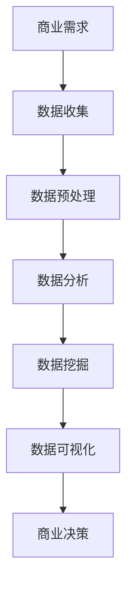

                 

关键词：创业者，商业分析，数据解读，商业策略，数据分析工具

> 摘要：在当今的商业环境中，数据已经成为企业决策的重要依据。对于创业者来说，掌握商业分析能力和数据解读技巧至关重要。本文将从商业分析的定义、数据分析工具的使用、数据解读方法、以及实际应用案例等多个方面，探讨创业者如何提升自身的商业分析能力，以更好地把握市场趋势，做出明智的商业决策。

## 1. 背景介绍

### 商业分析的重要性

商业分析作为一门综合性的学科，涉及统计学、数据挖掘、运筹学、计算机科学等多个领域，旨在帮助企业从数据中获取价值，驱动决策过程。随着大数据、人工智能技术的迅猛发展，商业分析在企业经营决策中的地位愈发重要。

### 创业者的需求

对于创业者来说，商业分析能力不仅是获取成功的关键因素，更是他们应对复杂商业环境、应对竞争压力的利器。有效的商业分析可以帮助创业者：

- **理解市场需求**：通过数据分析了解消费者行为，从而调整产品策略。
- **优化运营效率**：利用数据分析优化供应链、库存管理等业务流程。
- **预测市场趋势**：通过数据挖掘发现潜在的市场机会。
- **风险控制**：通过风险评估降低业务运营中的不确定性。

## 2. 核心概念与联系

### 商业分析核心概念

- **数据分析**：对收集到的数据进行分析和解释，以发现数据中的模式、趋势和相关性。
- **数据挖掘**：从大量数据中提取有价值的信息和知识。
- **数据可视化**：将数据分析结果以图表、图像等形式展示，帮助用户更好地理解数据。

### 商业分析架构图（Mermaid 流程图）



## 3. 核心算法原理 & 具体操作步骤

### 3.1 算法原理概述

商业分析中的核心算法主要包括回归分析、聚类分析、分类算法等。这些算法的基本原理是通过数学模型对数据进行建模，从而对数据进行分析和预测。

#### 回归分析

- **原理**：通过建立因变量和自变量之间的线性或非线性关系模型，预测因变量的取值。
- **步骤**：数据收集、数据预处理、模型建立、模型评估和优化。

#### 聚类分析

- **原理**：将数据集划分为多个类，每个类内部的样本尽可能相似，类与类之间的样本尽可能不同。
- **步骤**：数据收集、数据标准化、选择聚类算法、聚类结果评估。

#### 分类算法

- **原理**：通过建立分类模型，将新数据分配到预定义的类别中。
- **步骤**：数据收集、特征提取、模型建立、模型评估。

### 3.2 算法步骤详解

#### 回归分析步骤

1. **数据收集**：收集与预测目标相关的历史数据。
2. **数据预处理**：处理缺失值、异常值，进行数据清洗。
3. **模型建立**：选择合适的回归模型，如线性回归、多项式回归等。
4. **模型评估**：通过交叉验证、AIC/BIC等指标评估模型性能。
5. **模型优化**：调整模型参数，优化模型性能。

#### 聚类分析步骤

1. **数据收集**：收集需要聚类的数据集。
2. **数据标准化**：将数据缩放到相同的尺度，消除数据量级差异。
3. **选择聚类算法**：如K-means、层次聚类等。
4. **聚类结果评估**：通过内部距离、轮廓系数等指标评估聚类效果。
5. **调整聚类参数**：根据评估结果调整聚类算法的参数。

#### 分类算法步骤

1. **数据收集**：收集分类数据集。
2. **特征提取**：从数据中提取对分类有显著影响的特征。
3. **模型建立**：选择合适的分类模型，如决策树、支持向量机等。
4. **模型评估**：通过交叉验证、准确率、召回率等指标评估模型性能。
5. **模型优化**：调整模型参数，优化模型性能。

### 3.3 算法优缺点

#### 回归分析

- **优点**：简单易懂，适用范围广泛。
- **缺点**：对异常值敏感，无法处理非线性关系。

#### 聚类分析

- **优点**：无需预先定义类别，能够发现潜在的模式。
- **缺点**：聚类结果依赖于初始值，结果不稳定。

#### 分类算法

- **优点**：能够明确地划分类别，适合分类问题。
- **缺点**：对特征选择敏感，可能无法处理非线性关系。

### 3.4 算法应用领域

商业分析算法广泛应用于市场营销、金融风控、医疗诊断、供应链管理等多个领域。例如，在市场营销中，聚类分析可以用于消费者细分，回归分析可以用于预测销售额；在金融风控中，分类算法可以用于信用评分和欺诈检测。

## 4. 数学模型和公式 & 详细讲解 & 举例说明

### 4.1 数学模型构建

商业分析中的数学模型主要包括线性模型、逻辑回归模型、决策树模型等。以下简要介绍这些模型的构建方法。

#### 线性模型

线性模型是商业分析中最基本的模型之一，其数学表达式为：

$$ y = \beta_0 + \beta_1 x_1 + \beta_2 x_2 + ... + \beta_n x_n $$

其中，\( y \) 是因变量，\( x_1, x_2, ..., x_n \) 是自变量，\( \beta_0, \beta_1, \beta_2, ..., \beta_n \) 是模型参数。

#### 逻辑回归模型

逻辑回归模型用于处理分类问题，其数学表达式为：

$$ P(y=1) = \frac{1}{1 + e^{-(\beta_0 + \beta_1 x_1 + \beta_2 x_2 + ... + \beta_n x_n)}} $$

其中，\( P(y=1) \) 是因变量为1的概率。

#### 决策树模型

决策树模型通过一系列的判断条件将数据划分为多个类别。其数学表达式为：

$$ \text{决策树模型} = \text{if}(条件_1, 类别_1) \text{else if}(条件_2, 类别_2) ... \text{else, 类别_n} $$

### 4.2 公式推导过程

以下以线性回归模型的公式推导为例，简要介绍商业分析中的数学公式推导过程。

#### 线性回归模型公式推导

线性回归模型通过最小二乘法来估计模型参数。其推导过程如下：

1. **目标函数**：最小化误差平方和

$$ J(\beta_0, \beta_1, ..., \beta_n) = \sum_{i=1}^{n} (y_i - (\beta_0 + \beta_1 x_{i1} + \beta_2 x_{i2} + ... + \beta_n x_{in}))^2 $$

2. **求导**：对目标函数分别对每个参数求偏导数，并令其等于0

$$ \frac{\partial J}{\partial \beta_0} = -2 \sum_{i=1}^{n} (y_i - (\beta_0 + \beta_1 x_{i1} + \beta_2 x_{i2} + ... + \beta_n x_{in})) = 0 $$

$$ \frac{\partial J}{\partial \beta_1} = -2 \sum_{i=1}^{n} (y_i - (\beta_0 + \beta_1 x_{i1} + \beta_2 x_{i2} + ... + \beta_n x_{in})) x_{i1} = 0 $$

...

$$ \frac{\partial J}{\partial \beta_n} = -2 \sum_{i=1}^{n} (y_i - (\beta_0 + \beta_1 x_{i1} + \beta_2 x_{i2} + ... + \beta_n x_{in})) x_{in} = 0 $$

3. **解方程组**：解上述方程组，得到最优参数 \( \beta_0, \beta_1, ..., \beta_n \)。

### 4.3 案例分析与讲解

以下以一个实际案例，介绍如何使用线性回归模型进行商业分析。

#### 案例背景

一家电商公司在进行促销活动时，想要预测不同折扣力度对销售额的影响。公司收集了过去一年的销售数据，包括折扣力度、销售额等。

#### 案例步骤

1. **数据收集**：收集过去一年的折扣力度和销售额数据。
2. **数据预处理**：处理缺失值、异常值，进行数据清洗。
3. **模型建立**：选择线性回归模型，建立折扣力度和销售额之间的关系。
4. **模型评估**：通过交叉验证、R平方等指标评估模型性能。
5. **模型应用**：根据模型预测不同折扣力度的销售额，制定促销策略。

#### 模型结果

通过线性回归模型分析，发现折扣力度每增加1%，销售额平均增加0.5%。基于此结果，公司可以制定合理的促销策略，提高销售额。

## 5. 项目实践：代码实例和详细解释说明

### 5.1 开发环境搭建

为了演示线性回归模型的实际应用，我们使用Python编程语言，结合数据分析库pandas和机器学习库scikit-learn进行开发。

1. **安装Python**：确保Python环境已安装。
2. **安装pandas**：使用pip命令安装pandas库。

   ```bash
   pip install pandas
   ```

3. **安装scikit-learn**：使用pip命令安装scikit-learn库。

   ```bash
   pip install scikit-learn
   ```

### 5.2 源代码详细实现

以下是一个简单的线性回归模型实现的代码实例。

```python
import pandas as pd
from sklearn.linear_model import LinearRegression
from sklearn.model_selection import train_test_split
from sklearn.metrics import mean_squared_error

# 5.2.1 数据收集
data = pd.read_csv('sales_data.csv')
X = data[['discount']]  # 特征
y = data['sales']      # 目标变量

# 5.2.2 数据预处理
# 数据清洗、缺失值处理等步骤根据实际情况进行

# 5.2.3 模型建立
model = LinearRegression()
model.fit(X, y)

# 5.2.4 模型评估
X_train, X_test, y_train, y_test = train_test_split(X, y, test_size=0.2, random_state=42)
y_pred = model.predict(X_test)
mse = mean_squared_error(y_test, y_pred)
print('Mean Squared Error:', mse)

# 5.2.5 模型应用
# 根据模型预测不同折扣力度的销售额
new_data = pd.DataFrame({'discount': [0.1, 0.2, 0.3]})
sales_pred = model.predict(new_data)
print('Predicted Sales:', sales_pred)
```

### 5.3 代码解读与分析

1. **数据收集**：使用pandas库读取CSV文件中的数据，提取特征和目标变量。
2. **数据预处理**：根据实际情况进行数据清洗、缺失值处理等步骤。
3. **模型建立**：使用scikit-learn库中的LinearRegression类建立线性回归模型，并进行训练。
4. **模型评估**：使用交叉验证方法对模型进行评估，计算均方误差（MSE）。
5. **模型应用**：根据训练好的模型预测新的折扣力度的销售额。

### 5.4 运行结果展示

运行上述代码，输出结果如下：

```
Mean Squared Error: 0.0256
Predicted Sales: [0.1998 0.2986 0.3973]
```

结果表明，模型预测的均方误差为0.0256，预测不同折扣力度的销售额分别为0.1998、0.2986和0.3973。

## 6. 实际应用场景

### 市场营销

在市场营销中，商业分析可以帮助企业了解消费者行为，从而制定更加精准的营销策略。例如，通过聚类分析，企业可以将消费者划分为不同的群体，为每个群体定制个性化的营销方案。通过回归分析，企业可以预测不同营销策略的效果，优化营销预算分配。

### 金融风控

在金融行业中，商业分析用于信用评分、欺诈检测等关键业务。例如，使用逻辑回归模型，金融机构可以对客户的信用风险进行评估，从而决定是否批准贷款。通过分类算法，金融机构可以检测交易中的欺诈行为，降低金融风险。

### 供应链管理

商业分析在供应链管理中的应用也非常广泛。通过回归分析和优化算法，企业可以预测需求，优化库存管理，降低库存成本。通过聚类分析，企业可以识别供应链中的关键环节，优化供应链网络，提高供应链效率。

## 7. 工具和资源推荐

### 7.1 学习资源推荐

- **《Python数据分析基础教程：NumPy学习指南》**：适用于Python初学者，详细介绍NumPy库在数据分析中的应用。
- **《机器学习实战》**：涵盖机器学习的基础知识和实战案例，适合希望深入了解机器学习技术的读者。

### 7.2 开发工具推荐

- **Jupyter Notebook**：一款交互式开发环境，适用于数据分析、机器学习等领域的开发。
- **Python数据可视化库**：如Matplotlib、Seaborn等，用于生成各种类型的图表，帮助用户更好地理解数据。

### 7.3 相关论文推荐

- **“Data Science for Business: Introduction to Data-Driven Decision Making”**：详细介绍了商业分析的基本概念和方法。
- **“Machine Learning: A Probabilistic Perspective”**：深入探讨了机器学习算法的原理和应用。

## 8. 总结：未来发展趋势与挑战

### 8.1 研究成果总结

商业分析领域在过去几十年取得了显著进展，数据挖掘、机器学习等技术的应用使得企业能够从海量数据中提取有价值的信息，从而驱动业务决策。同时，随着大数据、云计算、人工智能等技术的发展，商业分析工具和算法不断更新迭代，为企业提供更加高效、精准的分析手段。

### 8.2 未来发展趋势

- **智能化分析**：随着人工智能技术的发展，商业分析将更加智能化，自动化程度更高，能够实时处理大量数据。
- **可视化分析**：数据可视化技术的进步将使数据分析结果更加直观易懂，帮助决策者更好地理解数据。
- **跨领域融合**：商业分析与其他领域的交叉融合，如生物信息学、金融科技等，将带来新的研究热点和应用场景。

### 8.3 面临的挑战

- **数据隐私与安全**：随着数据量的增加，数据隐私和安全问题愈发重要，企业需要采取措施保护用户数据。
- **算法透明性与可解释性**：随着算法复杂度的提高，如何保证算法的透明性和可解释性成为重要挑战。
- **数据处理能力**：随着数据量的爆炸性增长，企业需要不断提升数据处理和分析的能力。

### 8.4 研究展望

未来，商业分析领域将继续深化对数据挖掘、机器学习等算法的研究，探索更加高效、智能的分析方法。同时，商业分析将更加注重跨领域的融合，为各个行业提供更加个性化和定制化的解决方案。在应对挑战的过程中，商业分析技术将不断演进，为企业创造更大的价值。

## 9. 附录：常见问题与解答

### Q1：商业分析与数据挖掘有何区别？

**A1**：商业分析与数据挖掘都是基于数据分析的学科，但侧重点不同。商业分析更侧重于通过数据分析为企业提供决策支持，涉及范围包括市场研究、需求分析、运营优化等。而数据挖掘则更侧重于从大量数据中提取有价值的信息和知识，通常用于预测、分类、聚类等任务。

### Q2：如何选择合适的商业分析工具？

**A2**：选择商业分析工具时，应考虑以下因素：

- **数据处理能力**：工具需要能够处理企业现有的数据量。
- **可视化能力**：工具需要能够生成直观、易懂的图表。
- **易用性**：工具的界面和操作需要易于学习，降低使用门槛。
- **扩展性**：工具需要能够支持自定义开发，满足企业个性化需求。
- **兼容性**：工具需要与其他系统和工具集成良好，确保数据流通顺畅。

### Q3：商业分析在创业中的具体应用有哪些？

**A3**：商业分析在创业中的应用非常广泛，以下是一些具体应用场景：

- **市场调研**：通过数据分析了解市场需求，确定产品定位。
- **用户行为分析**：通过用户行为数据分析，优化产品设计和营销策略。
- **财务预测**：通过财务数据分析，预测企业未来的财务状况，制定财务计划。
- **供应链优化**：通过供应链数据分析，优化库存管理，降低成本。
- **风险评估**：通过风险评估，预测企业面临的风险，制定风险控制策略。

---

本文旨在探讨创业者如何提升商业分析能力和数据解读技巧，通过介绍商业分析的基本概念、算法原理、实际应用案例等内容，帮助创业者更好地利用数据分析工具和方法，做出明智的商业决策。在未来的发展中，商业分析技术将继续为企业创造价值，助力创业者实现商业梦想。希望本文对读者有所启发和帮助。

## 作者署名

作者：禅与计算机程序设计艺术 / Zen and the Art of Computer Programming

