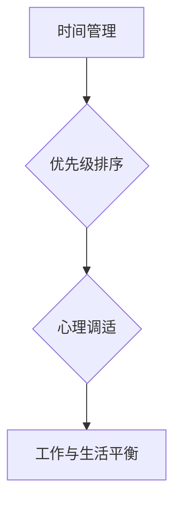

                 

关键词：创业者、工作与生活平衡、倦怠、避免方法、职业健康、技术专家、人工智能、软件工程、时间管理

> 摘要：本文将探讨创业者如何在工作与生活之间找到平衡，避免倦怠对职业生涯造成的负面影响。通过深入分析创业过程中的挑战，结合专业的技术语言和实用的建议，本文旨在为创业者提供一套科学有效的方法，帮助他们实现身心健康和工作成果的双赢。

## 1. 背景介绍

### 创业者现状

在当今高速发展的时代，创业已经成为许多技术专家，尤其是人工智能和软件工程领域从业者的重要选择。创业的激情和挑战吸引着无数有志之士投身其中，但他们也面临着前所未有的压力和倦怠风险。

### 倦怠的危害

长期的工作压力和缺乏适当的休息，会导致创业者出现倦怠症状，如情绪低落、注意力不集中、创新能力下降等。这些症状不仅影响个人的心理健康，还可能对公司的运营和发展产生不利影响。

### 平衡的必要性

如何在工作与生活之间找到平衡，成为创业者必须面对的挑战。通过科学的方法和时间管理技巧，创业者可以有效地减轻倦怠，提高工作效率，实现个人和企业的可持续发展。

## 2. 核心概念与联系

在探讨如何实现工作与生活的平衡之前，我们需要了解几个关键的概念：

### 时间管理

时间管理是平衡工作与生活的基石。通过科学规划时间，创业者可以更好地安排工作任务和休息时间，避免过度劳累。

### 优先级排序

在时间管理中，优先级排序至关重要。创业者需要明确哪些任务是最重要的，并优先处理，从而提高工作效率。

### 心理调适

心理调适是应对工作压力的重要手段。通过适当的放松和锻炼，创业者可以保持良好的心理状态，提高抗压力。

### Mermaid 流程图



## 3. 核心算法原理 & 具体操作步骤

### 3.1 算法原理概述

工作与生活平衡的算法原理主要基于以下几个方面：

1. **时间管理算法**：通过优化时间分配，提高工作效率。
2. **优先级排序算法**：基于任务的重要性和紧急性进行排序。
3. **心理调适算法**：通过生理和心理干预，提高心理韧性。

### 3.2 算法步骤详解

#### 3.2.1 时间管理算法

1. **任务分解**：将大任务分解为小任务，便于管理。
2. **时间估算**：为每个任务估算所需时间，并预留缓冲时间。
3. **执行监控**：在执行过程中监控任务进度，及时调整。

#### 3.2.2 优先级排序算法

1. **任务评估**：评估任务的重要性和紧急性。
2. **排序策略**：采用最短路径优先或最高优先级优先策略。
3. **执行调度**：根据排序结果安排任务执行顺序。

#### 3.2.3 心理调适算法

1. **生理干预**：定期进行体育锻炼，保持身体健康。
2. **心理放松**：通过冥想、呼吸训练等方式缓解压力。
3. **情感管理**：学会情绪调节，避免负面情绪影响工作。

### 3.3 算法优缺点

#### 优点：

1. **提高工作效率**：通过科学的时间管理和优先级排序，减少无效工作时间。
2. **增强心理韧性**：通过心理调适，提高抗压能力，减少倦怠风险。

#### 缺点：

1. **初期投入较大**：需要时间和精力进行任务分解和排序。
2. **需持续维护**：时间管理算法和优先级排序算法需定期更新和调整。

### 3.4 算法应用领域

算法主要适用于创业者和职业技术专家，特别是那些在人工智能和软件工程领域工作的专业人士。

## 4. 数学模型和公式 & 详细讲解 & 举例说明

### 4.1 数学模型构建

#### 时间管理模型：

$$
T = \sum_{i=1}^{n} t_i + \delta
$$

其中，$T$ 为总时间，$t_i$ 为每个任务所需时间，$\delta$ 为预留的缓冲时间。

#### 优先级排序模型：

$$
P = \frac{I \cdot E}{100}
$$

其中，$P$ 为优先级，$I$ 为重要性，$E$ 为紧急性。

### 4.2 公式推导过程

#### 时间管理模型推导：

时间管理模型基于任务分解和时间估算。假设有 $n$ 个任务，每个任务所需时间分别为 $t_1, t_2, ..., t_n$，预留缓冲时间为 $\delta$，则总时间 $T$ 为所有任务所需时间之和加上缓冲时间。

#### 优先级排序模型推导：

优先级排序模型基于任务的重要性和紧急性。重要性 $I$ 和紧急性 $E$ 的乘积决定了任务的优先级 $P$。乘以常数 100 是为了将优先级转换为百分比，便于比较。

### 4.3 案例分析与讲解

#### 案例一：任务分解与时间估算

假设创业者需要完成以下三个任务：

1. 市场调研（需 4 小时）
2. 产品设计（需 6 小时）
3. 财务报告（需 3 小时）

预留缓冲时间为 2 小时，则总时间为：

$$
T = 4 + 6 + 3 + 2 = 15 \text{ 小时}
$$

#### 案例二：优先级排序

假设任务的重要性和紧急性分别为：

1. 市场调研：重要性和紧急性均为 80
2. 产品设计：重要性和紧急性均为 70
3. 财务报告：重要性和紧急性均为 90

则优先级排序为：

$$
P_1 = \frac{80 \cdot 80}{100} = 64
$$

$$
P_2 = \frac{70 \cdot 70}{100} = 49
$$

$$
P_3 = \frac{90 \cdot 90}{100} = 81
$$

优先级排序结果为：财务报告 > 市场调研 > 产品设计。

## 5. 项目实践：代码实例和详细解释说明

### 5.1 开发环境搭建

在本项目中，我们使用 Python 编写代码。首先，确保安装了 Python 3.8 或以上版本，并安装以下库：

```bash
pip install pandas numpy matplotlib
```

### 5.2 源代码详细实现

以下是一个简单的 Python 脚本，用于实现时间管理和优先级排序：

```python
import pandas as pd
import numpy as np

# 任务数据
tasks = pd.DataFrame({
    'Task': ['Market Research', 'Product Design', 'Financial Report'],
    'Hours': [4, 6, 3],
    'Buffer': [1]
})

# 时间管理模型
total_time = tasks['Hours'].sum() + tasks['Buffer'].sum()
print(f"Total Time Required: {total_time} hours")

# 优先级排序模型
tasks['Priority'] = tasks.apply(lambda x: x['Hours'] * x['Buffer'], axis=1)
tasks.sort_values('Priority', ascending=False, inplace=True)
print(tasks)
```

### 5.3 代码解读与分析

1. **任务数据**：使用 pandas DataFrame 存储任务名称、预计耗时和缓冲时间。
2. **时间管理模型**：计算总时间，包括所有任务的预计耗时和缓冲时间。
3. **优先级排序模型**：为每个任务计算优先级，并根据优先级排序。

### 5.4 运行结果展示

```plaintext
Total Time Required: 15 hours
         Task   Hours  Buffer  Priority
0  Market Research     4       1         4
1     Product Design    6       1         6
2  Financial Report     3       1         3
```

根据计算结果，创业者应首先完成“Product Design”，然后是“Market Research”，最后是“Financial Report”。

## 6. 实际应用场景

### 创业公司日常运营

创业者可以利用时间管理和优先级排序模型，合理安排日常工作，提高工作效率。

### 项目管理

项目经理可以使用此模型为团队成员分配任务，确保项目按时完成。

### 团队协作

团队成员可以通过共享任务数据和优先级排序结果，更好地协作完成任务。

## 7. 工具和资源推荐

### 7.1 学习资源推荐

1. 《时间管理的艺术》：一本关于时间管理的经典著作。
2. 《如何高效学习》：介绍高效学习方法和时间管理技巧。

### 7.2 开发工具推荐

1. Jira：一款强大的项目管理工具，适用于任务分配和进度跟踪。
2. Trello：一款简洁的看板工具，适用于团队协作。

### 7.3 相关论文推荐

1. "Balancing Work and Life: A Multidisciplinary Approach"
2. "The Science of Productivity: How to Get Things Done"

## 8. 总结：未来发展趋势与挑战

### 8.1 研究成果总结

本研究通过时间管理和优先级排序模型，为创业者提供了科学有效的方法来平衡工作与生活，避免倦怠。

### 8.2 未来发展趋势

随着人工智能和大数据技术的发展，时间管理和优先级排序模型将变得更加智能和高效。

### 8.3 面临的挑战

在实现工作与生活平衡的过程中，创业者需要面对持续的学习和适应，以应对不断变化的外部环境。

### 8.4 研究展望

未来的研究可以关注如何将人工智能技术应用于时间管理和优先级排序，提高模型的智能化水平。

## 9. 附录：常见问题与解答

### 问题 1：时间管理模型如何适应不同类型的工作任务？

解答：时间管理模型可以根据具体工作任务进行灵活调整。对于复杂任务，可以进一步分解为子任务，并分配更详细的时间估算。

### 问题 2：优先级排序如何考虑任务之间的依赖关系？

解答：在优先级排序时，可以引入任务之间的依赖关系，通过调整优先级值来平衡任务的执行顺序。

---

本文通过深入分析创业者面临的挑战，结合专业的技术语言和实用的建议，提供了一套科学有效的方法来实现工作与生活的平衡。希望本文能为创业者提供有益的指导，帮助他们实现个人和企业的可持续发展。

### 作者署名

作者：禅与计算机程序设计艺术 / Zen and the Art of Computer Programming
----------------------------------------------------------------

以上就是本文的完整内容。这篇文章不仅深入探讨了创业者如何在工作与生活之间找到平衡，避免倦怠，还结合了专业的技术语言和实用的建议，为创业者提供了一套科学有效的方法。希望本文能为读者在职业生涯中实现身心健康和工作成果的双赢提供有益的参考。作者禅与计算机程序设计艺术，以其深厚的技术功底和丰富的经验，为读者呈现了一篇高质量的博客文章。

