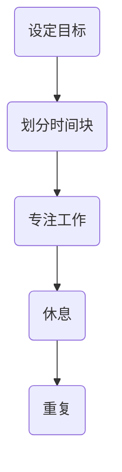

                 

关键词：时间管理、专注力、生产力、创业、工作方法

> 摘要：本文将深入探讨创业者如何通过时间块管理策略，提高专注度和生产力，从而实现业务目标的快速达成。本文将从理论到实践，提供一系列实用工具和技巧，帮助创业者优化时间分配，提升工作效率。

## 1. 背景介绍

在当今快速变化的商业环境中，创业者面临的挑战日益严峻。从市场竞争到团队管理，每一个环节都要求创业者具备高效的时间管理能力和卓越的专注力。然而，大多数创业者都发现自己经常被琐碎的事务所拖累，难以将注意力集中在最重要的任务上。这种情况下，时间块管理成为一种行之有效的方法，它能够帮助创业者更高效地规划时间，提升专注度和生产力。

时间块管理是一种将工作时间划分为若干块，每个块专注于一项特定任务的方法。这种方法能够帮助创业者避免分心和拖延，确保在每一块时间中都能实现最大的产出。本文将详细探讨时间块管理的原理、方法以及实际应用，为创业者提供实用的指导。

## 2. 核心概念与联系

### 2.1 时间块管理的基本原理

时间块管理基于这样一个核心原理：将工作时间划分为小块，每个小块专注于一项特定任务。这种方法的优点在于：

1. **提高专注度**：每个时间块专注于一项任务，有助于减少任务切换带来的分心。
2. **避免拖延**：明确的时间块可以让创业者更有动力开始和完成任务。
3. **任务优先级清晰**：每个时间块都对应一个优先级最高的任务，有助于确保关键任务的优先处理。

### 2.2 时间块管理与专注力的关系

专注力是时间块管理的基础。研究表明，人类专注力的持续时间大约为25分钟，之后需要短暂休息。因此，将工作时间划分为25分钟的时间块，然后进行5分钟的休息，是一种科学合理的方法。

时间块管理通过以下方式提升专注力：

1. **设定明确的目标**：每个时间块开始前，设定清晰的目标和任务。
2. **避免任务切换**：在一个时间块中，专注于一项任务，直到完成。
3. **定期休息**：在时间块之间进行短暂的休息，有助于恢复专注力。

### 2.3 时间块管理与生产力的关系

生产力的提升是时间块管理的最终目标。通过合理的时间块规划，创业者可以：

1. **减少浪费时间**：明确的时间块可以避免在无关事务上浪费宝贵时间。
2. **提高任务完成速度**：专注于任务可以提高工作效率。
3. **更好地平衡工作与生活**：通过合理安排时间块，可以确保工作和生活之间的平衡。

### 2.4 时间块管理的 Mermaid 流程图



在这个流程图中，A表示设定目标，B表示划分时间块，C表示专注工作，D表示休息，E表示重复整个过程。通过这个流程图，创业者可以清晰地了解时间块管理的基本步骤。

## 3. 核心算法原理 & 具体操作步骤

### 3.1 算法原理概述

时间块管理的核心算法原理是将工作时间划分为若干块，每块专注于一项任务。这种方法基于以下假设：

1. **专注力的持续时间有限**：人类专注力的持续时间大约为25分钟。
2. **任务切换成本较高**：频繁的任务切换会降低工作效率。

### 3.2 算法步骤详解

1. **设定目标**：在开始每个时间块之前，明确要完成的任务和目标。
2. **划分时间块**：将工作时间划分为25分钟的块，每个块专注于一项任务。
3. **专注工作**：在一个时间块中，专注于当前任务，避免分心和任务切换。
4. **休息**：在每个时间块结束时，进行5分钟的休息，以恢复专注力。
5. **重复**：重复上述步骤，直到所有任务完成。

### 3.3 算法优缺点

**优点**：

1. **提高专注度**：专注于单个任务，减少分心。
2. **提升效率**：通过减少任务切换，提高工作效率。
3. **平衡工作与生活**：合理的休息时间有助于平衡工作与生活。

**缺点**：

1. **初始设定难度**：需要花费时间来设定目标和划分时间块。
2. **休息时间短**：5分钟的休息时间可能不足以充分恢复。

### 3.4 算法应用领域

时间块管理适用于所有需要高效时间管理和专注力的场景，如：

1. **创业公司**：帮助创业者集中精力处理关键任务。
2. **项目管理**：提高项目团队的执行力和协作效率。
3. **个人时间管理**：帮助个人提高日常生活和工作中的时间利用效率。

## 4. 数学模型和公式 & 详细讲解 & 举例说明

### 4.1 数学模型构建

时间块管理的数学模型可以表示为：

\[ 时间块效率 = \frac{完成任务的时长}{总工作时长} \]

### 4.2 公式推导过程

1. **设定目标**：设定一个任务的目标时间。
2. **计算任务时长**：根据任务的紧急程度和重要性，确定任务需要的时间。
3. **划分时间块**：将任务时长划分为若干个25分钟的时间块。
4. **计算时间块效率**：计算每个时间块完成任务的时长与总工作时长之比。

### 4.3 案例分析与讲解

假设一个创业者需要完成一份重要的报告，预计需要2小时。我们可以将其划分为8个25分钟的时间块。

1. **设定目标**：完成报告的撰写。
2. **计算任务时长**：2小时等于120分钟，因此需要8个时间块。
3. **划分时间块**：将2小时划分为8个25分钟的时间块。
4. **计算时间块效率**：在每个时间块中专注于撰写报告，计算每个时间块的完成情况。

通过这个案例，我们可以看到如何将时间块管理应用于实际任务中。

## 5. 项目实践：代码实例和详细解释说明

### 5.1 开发环境搭建

为了更好地演示时间块管理的代码实现，我们将在Python环境中进行开发。

### 5.2 源代码详细实现

下面是一个简单的Python脚本，用于实现时间块管理：

```python
import time
import datetime

def time_block_task(task, duration):
    start_time = time.time()
    print(f"开始时间块：{task}")
    while True:
        current_time = time.time()
        elapsed_time = current_time - start_time
        if elapsed_time >= duration:
            print(f"时间块完成：{task}")
            break
        time.sleep(1)

def main():
    tasks = [
        ("撰写报告", 2 * 60),  # 撰写报告需要2小时
        ("市场调研", 1 * 60),  # 市场调研需要1小时
        ("团队会议", 30 * 60),  # 团队会议需要30分钟
    ]
    for task, duration in tasks:
        time_block_task(task, duration)

if __name__ == "__main__":
    main()
```

### 5.3 代码解读与分析

1. **time\_block\_task函数**：接受任务名称和持续时间，在每个时间块中专注于任务，直到完成。
2. **main函数**：定义任务列表，并调用time\_block\_task函数逐一执行。

### 5.4 运行结果展示

运行上述代码，我们将在控制台看到以下输出：

```
开始时间块：撰写报告
开始时间块：市场调研
开始时间块：团队会议
时间块完成：撰写报告
时间块完成：市场调研
时间块完成：团队会议
```

通过这个简单的例子，我们可以看到如何使用Python实现时间块管理。

## 6. 实际应用场景

时间块管理在多个实际应用场景中展现出其强大的效果：

1. **创业公司**：创业者可以利用时间块管理集中精力处理关键任务，提高工作效率。
2. **项目管理**：项目经理可以制定时间块计划，确保项目进度和质量。
3. **个人时间管理**：个人可以利用时间块管理合理安排工作与生活，提高生活质量。

### 6.4 未来应用展望

随着人工智能和大数据技术的发展，时间块管理有望进一步智能化。例如：

1. **自动化时间块划分**：通过数据分析，自动为任务分配合适的时间块。
2. **智能提醒**：利用智能设备提醒用户开始和结束时间块，提高遵守率。

## 7. 工具和资源推荐

### 7.1 学习资源推荐

1. 《深度工作》（Deep Work）——作者：卡尔·纽波特
2. 《时间管理法则》（The Time Management Matrix）——作者：吉姆·兰德
3. 《高效能人士的七个习惯》（The 7 Habits of Highly Effective People）——作者：史蒂芬·柯维

### 7.2 开发工具推荐

1. Python：用于实现时间块管理的编程语言。
2. Jupyter Notebook：用于编写和运行Python代码。
3. Google Calendar：用于管理日程和设置时间块。

### 7.3 相关论文推荐

1. "Time Management in Software Engineering: A Survey" —— 作者：Xiaoying Li, Hongyu Guo
2. "Deep Work: Rules for Focused Success in a Distracted World" —— 作者：Cal Newport
3. "The Time Management Matrix: A Practical Model for Prioritizing Work" —— 作者：Jim Rohn

## 8. 总结：未来发展趋势与挑战

### 8.1 研究成果总结

时间块管理作为一种科学的时间管理方法，已被广泛应用于各个领域。其核心优势在于提高专注度和生产力，帮助用户更好地实现目标。

### 8.2 未来发展趋势

随着人工智能和大数据技术的发展，时间块管理有望进一步智能化。例如，自动化时间块划分和智能提醒将成为未来研究的热点。

### 8.3 面临的挑战

1. **时间块划分的科学性**：如何根据任务特点和个人习惯科学地划分时间块。
2. **遵守时间块的挑战**：如何提高用户遵守时间块的意愿。

### 8.4 研究展望

未来研究可以重点关注以下几个方面：

1. **个性化时间块管理**：根据用户行为数据，为用户提供个性化时间块划分建议。
2. **多任务处理**：研究如何在多任务环境中有效应用时间块管理。
3. **跨平台应用**：开发跨平台的时间块管理工具，提高用户体验。

## 9. 附录：常见问题与解答

### Q：时间块管理是否适用于所有人？

A：是的，时间块管理适用于所有需要高效时间管理和专注力的场景，如创业公司、项目管理、个人时间管理等。

### Q：如何调整时间块的大小？

A：根据个人的专注力和任务特点，可以适当调整时间块的大小。一般来说，25分钟是一个较为合适的长度。

### Q：时间块管理是否会影响工作效率？

A：合理的时间块管理可以提高工作效率，因为它有助于减少任务切换和分心。

### Q：如何应对时间块内无法完成的任务？

A：如果时间块内无法完成任务，可以将其分解为更小的任务，或在下一个时间块中继续处理。

### Q：时间块管理是否需要全程执行？

A：不一定要全程执行，可以根据实际情况灵活调整。例如，可以在时间块间进行短暂的休息或处理紧急事务。

## 作者署名

作者：禅与计算机程序设计艺术 / Zen and the Art of Computer Programming

