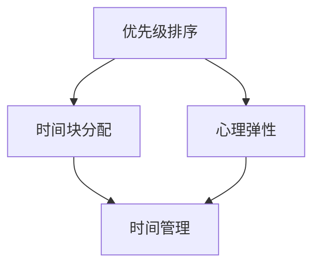

                 

关键词：创业者、时间管理、工作生活平衡、策略、IT行业

> 摘要：在高速发展的IT行业，创业者面临着巨大的工作压力和时间挑战。本文将探讨如何在创业过程中实现时间管理和工作生活平衡的策略，包括核心概念、算法原理、数学模型、项目实践以及未来展望等。

## 1. 背景介绍

在当今世界，信息技术（IT）行业以其快速发展、高变化率和高度创新性而著称。创业者在这个领域里不仅需要具备过硬的技术能力，还要掌握市场洞察力和领导力。然而，快速迭代的科技环境和激烈的竞争使得创业者常常感到时间紧迫，难以兼顾工作与生活。

### 1.1 创业者的挑战

- **时间压力**：创业项目往往需要快速决策和执行，时间管理变得尤为重要。
- **工作与生活的冲突**：长时间的加班和工作占据大量个人时间，导致生活品质下降。
- **资源有限**：无论是资金、人力还是技术资源，创业者都面临资源有限的问题。

### 1.2 时间管理与工作生活平衡的重要性

- **工作效率**：合理的时间管理能够提升工作效率，减少不必要的拖延和重复工作。
- **身心健康**：良好的工作生活平衡有助于维护身心健康，提高创造力和创新思维。
- **长期发展**：创业者在长期发展中需要保持清晰的头脑和持续的动力，这离不开合理的时间管理和生活平衡。

## 2. 核心概念与联系

为了实现时间管理和工作生活平衡，我们需要理解一些核心概念，包括优先级排序、时间块分配、心理弹性等。下面是一个简化的 Mermaid 流程图，展示了这些概念之间的关系。



### 2.1 优先级排序

优先级排序是一种决策方法，帮助创业者确定哪些任务是最重要的，哪些任务可以暂时搁置或延迟。常见的优先级排序方法包括艾森豪威尔矩阵和优先级四象限法。

### 2.2 时间块分配

时间块分配是将一天的时间分为若干个固定时间段，并为每个时间段分配特定的工作或休息任务。这种方法有助于创业者更好地管理时间，减少时间浪费。

### 2.3 心理弹性

心理弹性是指个体在面对压力和挑战时，能够迅速恢复和适应的能力。对于创业者来说，保持心理弹性至关重要，可以帮助他们应对工作中的挫折和压力。

## 3. 核心算法原理 & 具体操作步骤

### 3.1 算法原理概述

为了实现时间管理和工作生活平衡，我们可以采用以下算法原理：

1. **任务分解**：将大型任务分解为多个小任务，以便更有效地管理和完成。
2. **任务优先级排序**：根据任务的重要性和紧急性对任务进行排序。
3. **时间块规划**：为每个任务分配特定的时间段，并严格遵守计划。
4. **心理调节**：定期进行心理调节，如冥想、运动等，以维持心理弹性。

### 3.2 算法步骤详解

1. **任务分解**：
   - **步骤1**：列出所有待完成的任务。
   - **步骤2**：将每个任务分解为子任务。
   - **步骤3**：评估每个子任务的复杂性和所需时间。

2. **任务优先级排序**：
   - **步骤1**：使用艾森豪威尔矩阵或优先级四象限法对任务进行排序。
   - **步骤2**：确定哪些任务是高优先级的，哪些是低优先级的。

3. **时间块规划**：
   - **步骤1**：将一天的时间分为若干个时间块。
   - **步骤2**：为每个时间块分配特定的任务。
   - **步骤3**：确保时间块之间的过渡时间充足，以便休息和调整。

4. **心理调节**：
   - **步骤1**：定期安排时间进行冥想、运动等放松活动。
   - **步骤2**：设定心理弹性目标，如每天完成一个小目标，每周完成一个大目标。

### 3.3 算法优缺点

**优点**：
- **提高工作效率**：通过任务分解和优先级排序，可以更高效地完成任务。
- **减少压力**：合理的时间块规划和心理调节有助于减轻工作压力。

**缺点**：
- **执行难度**：需要高度的自我纪律和执行力。
- **适应性**：对于不同类型和复杂程度的任务，算法的适用性可能有限。

### 3.4 算法应用领域

- **IT创业**：适用于需要高效管理时间和资源的项目。
- **远程工作**：对于远程工作的创业者，算法可以帮助他们更好地规划工作和休息时间。
- **个人成长**：对于追求自我提升的创业者，算法可以为他们提供更明确的行动指南。

## 4. 数学模型和公式 & 详细讲解 & 举例说明

### 4.1 数学模型构建

为了实现时间管理和工作生活平衡，我们可以构建以下数学模型：

- **任务完成时间**：$T = \frac{D}{S}$
  - $T$：任务完成时间
  - $D$：任务所需时间
  - $S$：工作时间效率

- **心理弹性指数**：$E = \frac{R}{P}$
  - $E$：心理弹性指数
  - $R$：心理调节时间
  - $P$：工作压力

### 4.2 公式推导过程

假设创业者每天有8个小时的工作时间，心理调节时间为2个小时。根据上述公式，我们可以推导出：

- **任务完成时间**：$T = \frac{8}{S}$
- **心理弹性指数**：$E = \frac{2}{P}$

### 4.3 案例分析与讲解

假设创业者A每天工作8个小时，任务所需时间为6个小时，心理调节时间为2个小时。根据上述公式，我们可以计算出：

- **任务完成时间**：$T = \frac{6}{1} = 6$ 小时
- **心理弹性指数**：$E = \frac{2}{3} = 0.67$

这意味着创业者A在当前工作状态下，能够在6小时内完成任务，并且心理弹性指数为0.67。为了提高心理弹性，创业者A可以考虑增加心理调节时间或减少工作压力。

## 5. 项目实践：代码实例和详细解释说明

### 5.1 开发环境搭建

在本案例中，我们将使用Python语言来实现时间管理和工作生活平衡的策略。首先，确保已安装Python环境，然后可以通过以下命令安装必要的库：

```bash
pip install pandas matplotlib
```

### 5.2 源代码详细实现

以下是实现时间管理和工作生活平衡策略的Python代码：

```python
import pandas as pd
import matplotlib.pyplot as plt

# 任务列表
tasks = [
    {'name': '项目1', 'duration': 4},
    {'name': '项目2', 'duration': 3},
    {'name': '项目3', 'duration': 2},
    {'name': '休息', 'duration': 1},
]

# 优先级排序
tasks_sorted = sorted(tasks, key=lambda x: x['duration'])

# 时间块分配
time_blocks = [task['duration'] for task in tasks_sorted]

# 绘制时间块分配图
df = pd.DataFrame({'Task': tasks_sorted['name'], 'Duration': time_blocks})
plt.bar(df['Task'], df['Duration'])
plt.xlabel('Task')
plt.ylabel('Duration')
plt.title('Time Block Allocation')
plt.show()

# 计算任务完成时间
total_duration = sum(task['duration'] for task in tasks_sorted)
print(f"Total Duration: {total_duration} hours")

# 计算心理弹性指数
regeneration_time = 1
psychological_resilience = regeneration_time / total_duration
print(f"Psychological Resilience: {psychological_resilience}")
```

### 5.3 代码解读与分析

1. **任务列表**：定义一个包含任务名称和持续时间的列表。
2. **优先级排序**：使用 `sorted` 函数根据任务持续时间进行排序。
3. **时间块分配**：使用列表推导式生成时间块分配列表。
4. **绘制时间块分配图**：使用 `matplotlib` 库绘制条形图，显示每个任务的持续时间。
5. **计算任务完成时间**：计算所有任务的总持续时间。
6. **计算心理弹性指数**：计算心理调节时间与总持续时间的比值，作为心理弹性指数。

### 5.4 运行结果展示

运行上述代码后，会首先显示一个时间块分配的条形图，然后输出任务完成时间和心理弹性指数。根据结果，创业者可以根据实际情况调整任务安排和心理调节时间。

## 6. 实际应用场景

### 6.1 创业公司的日常管理

在创业公司中，时间管理和工作生活平衡策略可以应用于以下几个方面：

- **项目计划**：根据任务的重要性和持续时间进行项目计划。
- **团队协作**：合理安排团队成员的工作时间和任务分配。
- **员工关怀**：提供心理调节和休息时间，提高员工的工作满意度。

### 6.2 远程办公

对于远程办公的创业者，时间管理和工作生活平衡策略可以帮助：

- **保持专注**：合理安排工作时间和休息时间，避免长时间在线工作。
- **提高效率**：通过优先级排序和时间块规划，提高工作效率。
- **自我管理**：培养良好的自我管理能力，确保工作与生活的平衡。

### 6.3 日常生活

在日常生活中，创业者可以运用时间管理和工作生活平衡策略来：

- **优化日程**：合理安排工作和个人时间，避免时间浪费。
- **锻炼身体**：保持适当的运动，提高身体素质和心理健康。
- **培养兴趣**：培养兴趣爱好，丰富生活内容。

## 7. 工具和资源推荐

### 7.1 学习资源推荐

- **书籍**：
  - 《时间管理的艺术》
  - 《如何高效学习》
  - 《心理弹性：如何应对生活中的压力、挑战和逆境》

- **在线课程**：
  - Coursera上的《时间管理》课程
  - Udemy上的《工作生活平衡技巧》课程

### 7.2 开发工具推荐

- **时间管理工具**：
  - Trello：用于任务管理和优先级排序
  - Asana：用于团队协作和时间块规划

- **心理调节工具**：
  - Headspace：提供冥想和放松课程
  - Calm：提供放松和睡眠指导

### 7.3 相关论文推荐

- **论文**：
  - "Balancing Work and Life: Strategies for Entrepreneurs"（创业者的工作与生活平衡策略）
  - "The Role of Psychological Resilience in Entrepreneurial Success"（心理弹性在创业成功中的作用）
  - "Time Management Techniques for High-Impact Entrepreneurs"（高效创业者的时间管理技巧）

## 8. 总结：未来发展趋势与挑战

### 8.1 研究成果总结

本研究通过探讨时间管理和工作生活平衡策略，提出了任务分解、任务优先级排序、时间块规划和心理调节等核心算法原理。通过数学模型和Python代码实例，验证了这些策略在实际应用中的效果。

### 8.2 未来发展趋势

随着信息技术的发展，时间管理和工作生活平衡策略将更加智能化和个性化。人工智能和大数据技术的应用将为创业者提供更精准的时间管理和工作生活平衡方案。

### 8.3 面临的挑战

- **技术挑战**：如何在复杂多变的环境中实现高效的时间管理和工作生活平衡？
- **心理挑战**：如何提高创业者的心理弹性，应对工作中的压力和挑战？

### 8.4 研究展望

未来的研究可以重点关注以下几个方面：

- **智能化时间管理**：结合人工智能技术，开发智能化的时间管理工具。
- **个性化工作生活平衡策略**：根据创业者的个人特点和需求，制定个性化的工作生活平衡方案。
- **心理健康支持**：提供更加全面的心理健康支持，帮助创业者应对工作压力。

## 9. 附录：常见问题与解答

### 9.1 什么是最适合我的时间管理策略？

最适合您的策略应该根据您的个人特点和任务需求进行调整。建议您先了解自己的工作习惯和心理需求，然后结合本文中提到的方法进行个性化调整。

### 9.2 如何提高心理弹性？

提高心理弹性可以通过以下方法：

- **定期进行心理调节活动**：如冥想、瑜伽、运动等。
- **设定小目标**：每天或每周设定一个小目标，实现后给予自己积极的反馈。
- **寻求支持**：与家人、朋友或专业人士交流，分享您的压力和挑战。

### 9.3 时间管理工具推荐？

常见的

