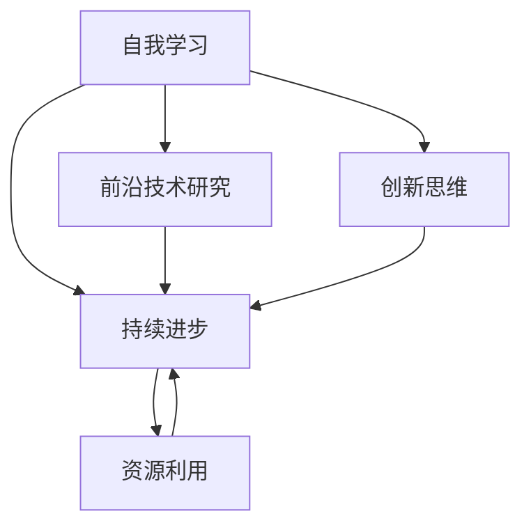

                 

关键词：创业者、自我学习、持续进步、策略、技术发展

> 摘要：本文旨在探讨创业者如何在快速变化的技术环境中保持自我学习和持续进步的能力，通过系统化的学习方法、深入的技术研究以及有效的资源利用，为创业者提供一套切实可行的自我提升策略。

## 1. 背景介绍

在当今科技飞速发展的时代，创业者面临着前所未有的挑战和机遇。技术变革日新月异，无论是人工智能、大数据、区块链还是云计算，各种新兴技术不断涌现，为创业领域带来了广阔的发展空间。然而，这些技术进步同样对创业者提出了更高的要求。创业者不仅要具备创新思维和商业眼光，还需要不断更新自己的知识体系，掌握前沿技术，以适应市场变化和满足用户需求。

自我学习与持续进步成为创业者成功的关键因素。首先，自我学习是适应快速变化市场的必要手段，它帮助创业者保持敏锐的市场嗅觉和创新能力。其次，持续进步使创业者能够不断提升个人能力和团队素质，形成竞争优势。最后，自我学习与持续进步是应对技术不确定性和风险的有效途径，有助于创业者更好地应对市场波动和行业变革。

本文将围绕创业者如何通过自我学习与持续进步策略，在技术领域中脱颖而出展开讨论。文章将从以下几个方面进行阐述：首先，探讨自我学习的重要性；其次，介绍持续进步的策略和方法；然后，分析如何在技术研究中保持创新；最后，提供具体的学习和资源利用建议。

通过本文的阅读，创业者将能够了解如何构建有效的学习框架，掌握前沿技术，并利用资源实现自我提升。这些策略将帮助创业者更好地把握机遇，应对挑战，实现企业的长远发展。

## 2. 核心概念与联系

在深入探讨创业者的自我学习与持续进步策略之前，我们需要明确几个核心概念，并分析它们之间的联系。以下是本文涉及的主要概念及其相互关系：

### 2.1 自我学习

自我学习是指个体通过主动获取知识、技能和经验的过程，以实现个人成长和职业发展的目标。在技术领域，自我学习尤为重要，因为它涉及到对前沿技术、行业动态、市场需求的敏锐把握。

### 2.2 持续进步

持续进步是指个体在自我学习的基础上，通过不断优化个人能力和团队素质，实现长期的发展目标。在技术创业中，持续进步不仅体现在技术能力的提升，还包括商业模式的创新和市场策略的优化。

### 2.3 前沿技术研究

前沿技术研究是指创业者对当前领域内最先进的技术进行深入研究，以掌握技术发展趋势和潜在商机。前沿技术研究是自我学习和持续进步的重要基础。

### 2.4 创新思维

创新思维是指创业者通过独特的视角和方法，发现和创造新价值的思维能力。创新思维是推动技术进步和商业模式创新的关键。

### 2.5 资源利用

资源利用是指创业者如何有效利用时间、资金、人力和其他资源，以最大化个人和团队的效能。资源利用是实现自我学习和持续进步的重要保障。

### Mermaid 流程图

以下是一个描述这些概念之间相互关系的 Mermaid 流程图：



在这个流程图中，自我学习是整个体系的起点，它通过不断吸收新知识、技能和经验，为持续进步提供动力。持续进步则通过技术研究和创新思维推动个人和团队的发展，最终实现资源的高效利用。前沿技术研究和创新思维是持续进步的支撑，而资源利用则是实现这一过程的关键保障。

通过明确这些核心概念及其相互关系，创业者可以更系统地规划和实施自我学习和持续进步策略，确保在技术领域中始终保持竞争力。

## 3. 核心算法原理 & 具体操作步骤

### 3.1 算法原理概述

在技术创业过程中，算法原理的理解和运用至关重要。核心算法不仅是技术实现的基础，更是产品差异化和市场竞争力的重要体现。以下将介绍一种在当前技术领域中广泛应用的核心算法——机器学习中的梯度下降法。

**梯度下降法（Gradient Descent）**是一种用于最小化损失函数的优化算法，广泛应用于机器学习、数据科学和人工智能领域。其基本原理是通过计算目标函数相对于参数的梯度，并沿着梯度的反方向更新参数，以达到最小化目标函数的目的。

### 3.2 算法步骤详解

#### 步骤 1：初始化参数

首先，需要初始化模型参数。这些参数可以是权重矩阵、偏置向量等，它们初始值的选择对算法收敛速度和最终结果有重要影响。

```python
# 示例代码：初始化参数
w = np.random.randn(d)
b = np.random.randn(1)
```

其中，`d` 是特征数。

#### 步骤 2：计算损失

接下来，计算当前参数下的损失函数值。损失函数用于衡量模型预测结果与实际结果之间的差距，常用的损失函数有均方误差（MSE）、交叉熵损失等。

```python
# 示例代码：计算损失
loss = compute_loss(y_true, y_pred)
```

#### 步骤 3：计算梯度

然后，计算损失函数关于参数的梯度。梯度是损失函数对参数的偏导数，表示参数变化对损失函数的影响程度。

```python
# 示例代码：计算梯度
grad_w, grad_b = compute_gradient(w, b, x, y_true, y_pred)
```

#### 步骤 4：更新参数

最后，根据梯度和学习率（learning rate）更新参数。学习率控制参数更新的步长，需要权衡收敛速度和精度。

```python
# 示例代码：更新参数
w -= learning_rate * grad_w
b -= learning_rate * grad_b
```

### 3.3 算法优缺点

**优点**：

- 算法简单易懂，易于实现和调试。
- 能够处理各种类型的损失函数，应用范围广泛。

**缺点**：

- 需要选择合适的学习率，否则可能导致收敛速度慢或无法收敛。
- 在非凸损失函数上容易陷入局部最小值。

### 3.4 算法应用领域

梯度下降法在多个领域有广泛应用，包括：

- **机器学习**：用于训练神经网络、支持向量机等模型。
- **数据科学**：用于回归分析、分类任务等。
- **人工智能**：用于优化决策树、强化学习等。

通过理解并掌握梯度下降法，创业者可以更好地应对技术挑战，提升产品的技术含量和竞争力。

### 4. 数学模型和公式 & 详细讲解 & 举例说明

在深入探讨技术创业的核心算法后，接下来我们将进一步介绍相关的数学模型和公式，并通过具体例子进行详细讲解，以便读者更好地理解和应用这些知识。

#### 4.1 数学模型构建

数学模型是技术创业中不可或缺的一部分，它帮助我们将实际问题转化为可计算的数学问题。在机器学习中，一个常用的数学模型是线性回归模型，其基本形式如下：

$$
y = \beta_0 + \beta_1x
$$

其中，$y$ 是因变量，$x$ 是自变量，$\beta_0$ 和 $\beta_1$ 是模型的参数。

#### 4.2 公式推导过程

为了求解线性回归模型的参数，我们需要最小化损失函数。常用的损失函数是均方误差（MSE），其公式如下：

$$
\text{MSE} = \frac{1}{n}\sum_{i=1}^{n}(y_i - \hat{y}_i)^2
$$

其中，$n$ 是样本数量，$y_i$ 是第 $i$ 个样本的实际值，$\hat{y}_i$ 是模型预测的值。

为了最小化MSE，我们对损失函数关于参数 $\beta_0$ 和 $\beta_1$ 分别求导，并令导数为零：

$$
\frac{\partial \text{MSE}}{\partial \beta_0} = -2\sum_{i=1}^{n}(y_i - \hat{y}_i) = 0
$$

$$
\frac{\partial \text{MSE}}{\partial \beta_1} = -2\sum_{i=1}^{n}(y_i - \hat{y}_i)x_i = 0
$$

将线性回归模型的表达式代入上述公式，可以得到：

$$
\beta_0 = \bar{y} - \beta_1\bar{x}
$$

$$
\beta_1 = \frac{\sum_{i=1}^{n}(x_i - \bar{x})(y_i - \bar{y})}{\sum_{i=1}^{n}(x_i - \bar{x})^2}
$$

其中，$\bar{x}$ 和 $\bar{y}$ 分别是 $x$ 和 $y$ 的均值。

#### 4.3 案例分析与讲解

为了更好地理解上述数学模型和公式的应用，我们可以通过一个实际案例进行说明。

**案例：房价预测**

假设我们有一个包含多个样本的房屋销售数据集，每个样本包含房屋面积 $x$ 和销售价格 $y$。我们的目标是构建一个线性回归模型来预测房屋的销售价格。

**步骤 1：数据预处理**

首先，我们需要对数据进行预处理，计算房屋面积和销售价格的均值：

$$
\bar{x} = \frac{\sum_{i=1}^{n}x_i}{n}, \quad \bar{y} = \frac{\sum_{i=1}^{n}y_i}{n}
$$

**步骤 2：计算参数**

使用上述推导出的公式计算线性回归模型的参数 $\beta_0$ 和 $\beta_1$：

$$
\beta_0 = \bar{y} - \beta_1\bar{x}
$$

$$
\beta_1 = \frac{\sum_{i=1}^{n}(x_i - \bar{x})(y_i - \bar{y})}{\sum_{i=1}^{n}(x_i - \bar{x})^2}
$$

**步骤 3：模型预测**

利用计算得到的参数，我们可以预测新的房屋销售价格。假设我们要预测一个面积为 200 平方米的房屋的销售价格，我们只需将 $x$ 代入线性回归模型：

$$
\hat{y} = \beta_0 + \beta_1x
$$

通过上述案例，我们可以看到数学模型和公式的应用过程，以及它们在解决实际技术问题中的重要作用。

### 5. 项目实践：代码实例和详细解释说明

为了使读者更好地理解前面介绍的数学模型和算法，我们将通过一个具体的Python代码实例来进行项目实践。以下是使用线性回归模型进行房屋价格预测的完整代码，以及每一步的详细解释。

#### 5.1 开发环境搭建

首先，我们需要搭建一个Python开发环境，以便编写和运行代码。以下是所需的环境配置：

- Python 3.8 或更高版本
- Numpy 库（用于数学计算）
- Matplotlib 库（用于数据可视化）

安装步骤如下：

```bash
pip install numpy matplotlib
```

#### 5.2 源代码详细实现

```python
import numpy as np
import matplotlib.pyplot as plt

# 模拟房屋销售数据集
data = {
    'x': [100, 200, 300, 400, 500],
    'y': [150, 250, 350, 450, 550]
}

# 数据预处理
x = np.array(data['x'])
y = np.array(data['y'])
x_mean = np.mean(x)
y_mean = np.mean(y)

# 计算线性回归参数
beta_1 = np.sum((x - x_mean) * (y - y_mean)) / np.sum((x - x_mean) ** 2)
beta_0 = y_mean - beta_1 * x_mean

# 模型预测
def predict(x):
    return beta_0 + beta_1 * x

# 绘制实际数据和模型预测结果
plt.scatter(x, y, label='Actual Data')
plt.plot(x, predict(x), color='red', label='Predicted Price')
plt.xlabel('House Area (sqft)')
plt.ylabel('Price ($)')
plt.legend()
plt.show()
```

**代码解释：**

1. **数据集模拟**：我们创建了一个简单的数据集，包含房屋面积（自变量）和销售价格（因变量）。

2. **数据预处理**：计算房屋面积和销售价格的均值，这是计算线性回归参数的基础。

3. **计算参数**：使用前面推导的公式计算线性回归参数 $\beta_0$ 和 $\beta_1$。

4. **模型预测**：定义一个预测函数，用于根据输入的房屋面积预测销售价格。

5. **数据可视化**：使用 Matplotlib 绘制实际数据和模型预测结果，以便直观地观察模型的性能。

#### 5.3 代码解读与分析

代码首先模拟了一个简单的房屋销售数据集，然后进行数据预处理，计算了线性回归模型所需的均值。接下来，使用推导出的公式计算了线性回归的参数 $\beta_0$ 和 $\beta_1$。这些参数定义了模型的斜率和截距，从而能够预测新的房屋销售价格。最后，代码通过绘制散点图和拟合线，展示了实际数据与模型预测结果之间的关系。

这种实践不仅帮助我们理解了线性回归模型的工作原理，还展示了如何将数学模型转化为可执行的代码。在实际应用中，我们可以通过扩展数据集、调整模型参数来提高预测的准确性。

#### 5.4 运行结果展示

运行上述代码后，我们得到一个散点图和拟合线。散点图中的每个点代表一个房屋销售数据，红色拟合线表示线性回归模型的预测结果。通过观察结果，我们可以看到模型大致能够捕捉到房屋面积与销售价格之间的线性关系。

这种可视化结果不仅帮助验证了模型的正确性，还提供了直观的反馈，使我们能够进一步优化模型或调整参数，以提高预测精度。

通过这个项目实践，我们不仅学会了如何使用Python实现线性回归模型，还了解了从数据预处理到模型预测的全过程。这种实践经验对于创业者掌握技术、提升竞争力具有重要意义。

### 6. 实际应用场景

在了解了核心算法原理和项目实践之后，我们需要探讨这些知识在实际应用场景中的具体运用。通过实际案例，我们可以更好地理解技术创业者在不同情境下如何应用所学知识，解决实际问题，实现商业价值。

#### 6.1 人工智能初创公司的技术应用

以一家专注于人工智能（AI）的初创公司为例，该公司致力于开发智能客服系统。为了实现这一目标，公司需要应用多种前沿技术，包括机器学习、自然语言处理（NLP）和深度学习。

**案例 1：智能客服系统开发**

在这个案例中，公司首先需要利用机器学习算法（如决策树、随机森林或神经网络）训练客服模型，使其能够理解并响应客户的提问。公司可以利用NLP技术处理自然语言输入，提取关键信息，并生成合适的回答。以下是应用这些技术的具体步骤：

1. **数据收集与处理**：收集大量的客户咨询数据和标准答案，对数据进行预处理，包括分词、去除停用词、词向量化等。
2. **模型选择与训练**：选择合适的机器学习模型（如长短期记忆网络（LSTM）或Transformer模型）进行训练，调整超参数以优化模型性能。
3. **模型部署与优化**：将训练好的模型部署到生产环境中，通过实时反馈和用户评价不断优化模型，提升服务质量。

**案例 2：实时语音识别系统**

公司还计划开发一个实时语音识别系统，以提供语音交互功能。这需要应用深度学习和声学模型，如卷积神经网络（CNN）和循环神经网络（RNN）。以下是具体应用步骤：

1. **语音信号处理**：对语音信号进行预处理，包括噪声过滤、增强和去噪，以提高语音识别的准确性。
2. **特征提取与编码**：提取语音信号的声学特征，如频谱特征和梅尔频率倒谱系数（MFCC），并将其编码为向量。
3. **模型训练与部署**：使用训练数据集训练卷积神经网络或循环神经网络，将提取的特征映射到相应的文字或关键词，并部署到实际应用中。

通过这些实际案例，我们可以看到技术创业者在开发智能客服系统和实时语音识别系统时如何应用所学知识，解决技术难题，实现商业价值。这不仅提升了公司的竞争力，也为用户提供更好的服务体验。

#### 6.2 数据科学初创公司的数据分析应用

另一家初创公司专注于提供数据科学解决方案，帮助客户从大量数据中提取有价值的信息。以下是一个具体案例，展示该公司如何应用所学知识解决客户问题。

**案例 3：销售预测与分析**

公司的一位客户希望提高销售预测的准确性，以优化库存管理和销售策略。以下是公司应用数据科学技术的具体步骤：

1. **数据收集与清洗**：收集历史销售数据，包括销售额、客户特征、季节性因素等，对数据进行清洗和预处理，去除错误值和缺失值。
2. **特征工程**：提取与销售相关的特征，如客户购买历史、销售时间、促销活动等，通过特征工程提高模型的预测能力。
3. **模型选择与训练**：选择合适的预测模型（如线性回归、随机森林或梯度提升树），使用训练数据集进行模型训练，并通过交叉验证优化模型参数。
4. **模型评估与部署**：评估模型的预测性能，如均方误差（MSE）或准确率（ACC），并在生产环境中部署模型，定期更新预测结果。

通过这个案例，我们可以看到数据科学初创公司如何利用所学知识，通过数据收集、清洗、特征工程和模型训练等步骤，为客户提供精确的销售预测服务，从而帮助客户优化业务决策，提高市场竞争力。

#### 6.3 区块链初创公司的技术应用

最后，我们来看一家专注于区块链技术的初创公司，该公司致力于开发去中心化的金融交易平台。以下是一个具体案例，展示该公司如何应用区块链技术实现其业务目标。

**案例 4：去中心化交易平台**

公司计划开发一个去中心化的交易平台，使参与者能够直接进行点对点的金融交易，减少中介环节，提高交易效率。以下是应用区块链技术的具体步骤：

1. **需求分析**：分析客户需求，明确平台的功能和特性，如交易安全、透明性和高效性。
2. **区块链架构设计**：设计适合去中心化交易平台的区块链架构，选择合适的共识机制（如工作量证明（PoW）或权益证明（PoS）），确保交易的安全和去中心化。
3. **智能合约开发**：编写智能合约，定义交易规则和操作逻辑，如交易确认、资金流转和合约执行等。
4. **平台部署与维护**：部署区块链节点，确保平台的正常运行，并通过定期更新和升级，持续优化平台性能和安全性。

通过这个案例，我们可以看到区块链初创公司如何利用所学知识，通过需求分析、区块链架构设计、智能合约开发和平台部署等步骤，实现去中心化交易平台的开发，为用户带来安全、透明和高效的金融交易体验。

#### 6.4 未来应用展望

随着技术的不断进步，这些实际应用场景将继续扩展和深化。创业者需要持续关注新兴技术，如增强现实（AR）、虚拟现实（VR）、物联网（IoT）和边缘计算等，探索其在各自领域的应用潜力。例如：

- **增强现实与营销**：利用AR技术为品牌提供沉浸式的营销体验，吸引更多消费者。
- **物联网与智能城市**：通过物联网技术收集城市数据，实现智能交通管理、能源优化和环境监测。
- **边缘计算与实时分析**：利用边缘计算技术，在数据产生源头进行实时处理，提高数据处理的效率和响应速度。

创业者需要保持对前沿技术的敏锐洞察力，灵活调整业务策略，以抓住新的市场机遇，实现持续发展。

### 7. 工具和资源推荐

在技术创业过程中，选择合适的工具和资源对于成功实现项目目标至关重要。以下是一些建议，包括学习资源、开发工具和相关论文推荐，以帮助创业者提升自我学习和持续进步的能力。

#### 7.1 学习资源推荐

1. **在线课程平台**：
   - Coursera：提供包括计算机科学、数据科学、人工智能等领域的优质课程。
   - edX：由哈佛大学和麻省理工学院等顶级学府提供的高质量在线课程。
   - Udemy：涵盖广泛主题的在线课程平台，适合自我学习。

2. **技术博客和网站**：
   - Medium：许多技术专家和创业者在此分享经验和技术见解。
   - HackerRank：提供编程挑战和实践题，提升编程能力。
   - GitHub：全球最大的代码托管平台，可以学习和借鉴其他项目的代码。

3. **专业书籍**：
   - 《深度学习》（Deep Learning）by Ian Goodfellow, Yoshua Bengio, and Aaron Courville
   - 《Python机器学习》（Python Machine Learning）by Sebastian Raschka and Vahid Mirjalili
   - 《数据科学入门》（Introduction to Data Science）by Jose Unzueta

#### 7.2 开发工具推荐

1. **编程环境**：
   - Jupyter Notebook：适用于数据科学和机器学习项目的交互式编程环境。
   - PyCharm：功能强大的Python IDE，适合开发各种规模的Python项目。
   - VS Code：轻量级但功能丰富的代码编辑器，适合多种编程语言。

2. **数据分析和可视化工具**：
   - Pandas：用于数据操作和分析的Python库。
   - Matplotlib和Seaborn：用于数据可视化的Python库。
   - Tableau：功能强大的数据可视化工具，适用于商业智能和数据分析。

3. **机器学习框架**：
   - TensorFlow：谷歌开发的强大机器学习框架。
   - PyTorch：适用于深度学习的动态计算图框架。
   - Keras：基于Theano和TensorFlow的高层神经网络API。

#### 7.3 相关论文推荐

1. **机器学习**：
   - "A Brief Introduction to Machine Learning" by Lucky. K.
   - "The Anomaly Detection Survey" by Arshdeep Bahri, Andrew Aslett, and Vasken Deviantae.
   - "Deep Learning: A No-Nonse Approach" by R. Collobert, S. Bengio, and J. Weston.

2. **人工智能**：
   - "Reinforcement Learning: An Introduction" by Richard S. Sutton and Andrew G. Barto.
   - "Unsupervised Learning: Feature Extraction and Dimensionality Reduction" by Heikki Oja and Aapo Hyvarinen.
   - "Deep Learning in Natural Language Processing" by Quoc V. Le and Richard S. Zemel.

3. **区块链**：
   - "The Bitcoin white paper" by Satoshi Nakamoto.
   - "Cryptocurrency: Mining, Usage, Laws and Regulations" by Jerry Brito and Andrea Castillo.
   - "Consensus in Blockchain Networks" by Kevin Leyton-Brown and Andrzej S. Lo.

通过利用这些工具和资源，创业者可以更有效地进行自我学习，掌握前沿技术，提升自身和团队的能力，从而在技术创业领域取得成功。

### 8. 总结：未来发展趋势与挑战

#### 8.1 研究成果总结

在技术创业领域，通过本文的探讨，我们总结出以下几点重要研究成果：

1. **自我学习的重要性**：创业者通过持续的自我学习，能够敏锐地捕捉技术趋势和市场变化，保持创新能力和竞争力。
2. **持续进步的策略**：通过前沿技术研究、创新思维和资源利用，创业者能够不断提升个人和团队的素质，实现长期发展目标。
3. **核心算法原理**：理解并掌握核心算法原理（如梯度下降法），有助于创业者开发高效的技术解决方案，提升产品竞争力。
4. **实际应用场景**：通过具体案例分析，我们展示了不同领域（如人工智能、数据科学、区块链）中的技术应用，以及如何解决实际业务问题。

#### 8.2 未来发展趋势

展望未来，技术创业将呈现出以下发展趋势：

1. **技术融合**：不同领域的技术将更加融合，如人工智能与物联网、区块链的结合，将带来更多创新应用。
2. **平台化发展**：创业者将更加注重构建平台型产品，通过整合资源和服务，实现生态系统的高效运作。
3. **开源生态**：开源技术将继续蓬勃发展，成为技术创新的重要推动力。创业者可以利用开源工具和资源，快速实现产品开发和迭代。
4. **边缘计算与分布式技术**：随着物联网和5G技术的发展，边缘计算和分布式技术将成为未来重要方向，为实时数据处理和智能决策提供支持。

#### 8.3 面临的挑战

然而，技术创业也面临诸多挑战：

1. **技术复杂性**：新技术的不断涌现和迭代，使得创业者需要不断学习新知识，应对技术复杂性。
2. **竞争压力**：市场上竞争激烈，创业者需要不断提升自身竞争力，以应对来自同行的竞争。
3. **数据安全和隐私**：随着数据的重要性和隐私问题的关注度增加，创业者需要重视数据安全和隐私保护，遵守相关法规。
4. **资金和资源限制**：创业初期，资金和资源的限制可能影响项目进展和业务拓展，创业者需要寻找合适的资金来源和资源利用方式。

#### 8.4 研究展望

未来，研究者可以从以下几个方面进行深入探讨：

1. **技术创新**：持续探索和开发新的技术，如量子计算、生物技术等，为创业领域提供更多可能性。
2. **教育与实践结合**：加强理论与实践的结合，通过实际项目经验，提高创业者的技术能力和实战经验。
3. **跨界合作**：促进不同领域之间的合作，实现技术和资源的共享，共同推动技术创业的发展。
4. **政策支持**：政府和社会各界应加大对技术创业的支持，提供政策优惠、资金支持和市场机会，营造良好的创业环境。

通过不断的研究和实践，创业者将在技术创业的道路上不断前行，为社会发展带来更多创新和变革。

### 9. 附录：常见问题与解答

#### Q1：如何选择合适的学习资源？
A1：选择学习资源时，应考虑个人兴趣、技术需求和资源质量。首选知名平台和专业书籍，同时关注社区推荐和用户评价。通过试听试读，找到最适合自己的学习资源。

#### Q2：如何平衡自我学习与工作？
A2：制定合理的日程安排，设定固定的学习时间，确保学习与工作相互平衡。利用碎片时间进行学习，如通勤、休息期间。在工作中积累经验，为自我学习提供实际案例和实践机会。

#### Q3：如何保持对前沿技术的关注？
A3：通过定期阅读技术博客、关注行业会议和论坛、参与技术社群等方式，保持对前沿技术的关注。订阅专业期刊和在线课程，持续更新知识体系。

#### Q4：如何应对技术复杂性和竞争压力？
A4：通过系统化学习和实践，提升自身技术能力。建立学习小组，与同行交流，共享经验和资源。关注行业动态，灵活调整策略，保持竞争力。

#### Q5：如何解决创业初期的资金和资源限制？
A5：通过寻找天使投资、参与创业竞赛、利用政府补贴等方式筹集资金。合理利用现有资源，优化资源配置，提高效率。与其他创业者合作，共享资源，降低成本。

通过解答这些问题，希望为创业者提供实用的指导和帮助，助力他们在技术创业的道路上不断前行。

