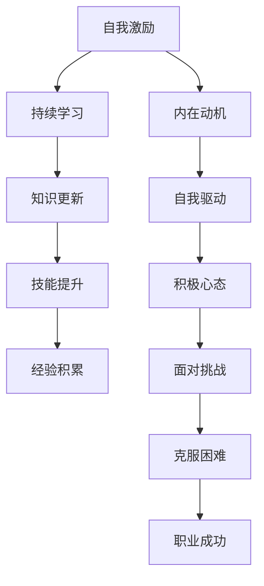

                 

关键词：创业者，自我激励，持续学习，能力培养，职业发展

摘要：在快速变化的科技时代，创业者面临的挑战和竞争日益加剧。本文旨在探讨创业者如何通过自我激励和持续学习能力培养，实现个人成长与职业成功。文章首先分析了创业者面临的挑战，然后详细阐述了自我激励和持续学习的核心概念，并提供了实际操作方法和工具。

## 1. 背景介绍

在当今这个信息爆炸和技术迅速迭代的时代，创业已经成为许多有志之士追求自由和实现自我价值的一种方式。然而，创业之路并不平坦，充满了不确定性和挑战。创业者不仅要应对市场变化、资金压力和团队管理，还要不断学习新技能、掌握新知识，以适应行业发展的需求。

本文将聚焦于创业者如何通过自我激励和持续学习能力培养，来克服这些挑战，实现个人成长和职业成功。自我激励是指创业者通过自我驱动，保持积极向上的态度和动力；而持续学习则是创业者不断提升自己，适应不断变化的环境。本文将结合这两个核心概念，探讨创业者如何在实际工作中应用这些方法，以实现长期成功。

### 1.1 创业者面临的挑战

创业者通常面临以下几方面的挑战：

- **市场变化**：市场环境瞬息万变，创业者需要不断调整战略，以适应市场需求。
- **资金压力**：创业初期，资金通常紧张，如何合理分配和使用有限的资金成为一大挑战。
- **团队管理**：团队建设和管理是创业成功的关键，如何激发团队成员的积极性，建立高效的团队协作机制，是创业者需要解决的问题。
- **个人成长**：创业者需要不断学习新知识、新技能，以适应行业和技术的发展。

### 1.2 自我激励与持续学习的意义

自我激励和持续学习对于创业者来说至关重要：

- **自我激励**：有助于创业者保持积极的心态，面对困难和挑战时不轻易放弃。
- **持续学习**：有助于创业者不断提升自己，适应行业发展的需求，保持竞争力。

## 2. 核心概念与联系

### 2.1 自我激励

自我激励是指个体通过内部动机和自我驱动，保持积极向上的态度和动力。在创业者身上，自我激励表现在以下几个方面：

- **自我驱动**：创业者要有强烈的内在动力，不断追求进步和突破。
- **自我反馈**：创业者要学会自我反思和评估，及时调整自己的行为和策略。
- **目标设定**：创业者要设定清晰、具体的目标，并不断追求这些目标。

### 2.2 持续学习

持续学习是指个体在终身学习的理念下，不断吸收新知识、新技能，以提升自己的能力和竞争力。在创业者身上，持续学习表现在以下几个方面：

- **知识更新**：创业者要关注行业动态，掌握前沿技术和知识。
- **技能提升**：创业者要不断学习新技能，如项目管理、市场分析等，以适应不同的工作场景。
- **经验积累**：创业者要善于总结经验，从失败中吸取教训，不断提升自己。

### 2.3 Mermaid 流程图

以下是一个简化的 Mermaid 流程图，展示了自我激励与持续学习之间的联系。



## 3. 核心算法原理 & 具体操作步骤

### 3.1 算法原理概述

自我激励与持续学习可以看作是一种算法，它通过以下步骤实现创业者的成长和成功：

1. **自我激励**：通过设定目标、自我反馈和内在动机，保持积极心态。
2. **持续学习**：通过知识更新、技能提升和经验积累，不断提升自己。

### 3.2 算法步骤详解

#### 3.2.1 自我激励步骤

1. **设定目标**：明确自己想要达成的目标，并确保这些目标是具体、可衡量的。
2. **自我反馈**：定期对自己的行为和结果进行反思和评估，及时调整自己的策略。
3. **内在动机**：找到自己内在的动力，如对工作的热爱、实现自我价值的渴望等。

#### 3.2.2 持续学习步骤

1. **知识更新**：关注行业动态，阅读相关书籍、论文和资讯，掌握前沿知识。
2. **技能提升**：参加培训课程、研讨会和工作坊，学习新技能。
3. **经验积累**：在工作和生活中积累经验，从失败中学习，不断提升自己。

### 3.3 算法优缺点

#### 优点

- **自我激励**：有助于创业者保持积极的心态，面对困难和挑战时不轻易放弃。
- **持续学习**：有助于创业者不断提升自己，适应行业发展的需求，保持竞争力。

#### 缺点

- **自我激励**：过于依赖内在动机，可能导致创业者在面对外部压力时动力不足。
- **持续学习**：学习过程中可能需要投入大量时间和精力，对于一些创业者来说可能是一种负担。

### 3.4 算法应用领域

自我激励与持续学习算法可以应用于以下领域：

- **个人成长**：创业者可以通过这种方法提升自己的能力和素质。
- **职业发展**：创业者可以通过这种方法在职业道路上取得更大的成就。
- **团队管理**：创业者可以引导团队成员采用这种方法，提升团队整体实力。

## 4. 数学模型和公式 & 详细讲解 & 举例说明

### 4.1 数学模型构建

为了更好地理解自我激励与持续学习的原理，我们可以构建一个简单的数学模型。假设 \( x \) 表示创业者的能力， \( y \) 表示创业者的成功率， \( z \) 表示创业者的幸福感。我们可以用以下公式表示这个模型：

\[ x = f(y, z) \]

其中， \( f \) 是一个复杂的函数，表示创业者的能力与成功率、幸福感之间的关系。

### 4.2 公式推导过程

首先，我们假设创业者的能力由知识、技能和经验构成，可以表示为：

\[ x = k \cdot s \cdot e \]

其中， \( k \) 表示知识， \( s \) 表示技能， \( e \) 表示经验。

接下来，我们假设创业者的成功率由市场需求、团队协作和资金状况决定，可以表示为：

\[ y = m \cdot c \cdot f \]

其中， \( m \) 表示市场需求， \( c \) 表示团队协作， \( f \) 表示资金状况。

最后，我们假设创业者的幸福感由成就感、社会地位和财富水平决定，可以表示为：

\[ z = g \cdot h \cdot v \]

其中， \( g \) 表示成就感， \( h \) 表示社会地位， \( v \) 表示财富水平。

通过以上三个公式，我们可以得到：

\[ x = k \cdot s \cdot e = (m \cdot c \cdot f) \cdot (g \cdot h \cdot v) \]

\[ x = f(y, z) \]

### 4.3 案例分析与讲解

假设一个创业者 \( A \)，他在知识、技能和经验方面都比较丰富，市场需求较高，团队协作良好，资金状况稳定。同时，他的成就感、社会地位和财富水平也较高。根据以上模型，我们可以得到：

\[ x = f(y, z) \]

\[ x = (m \cdot c \cdot f) \cdot (g \cdot h \cdot v) \]

在这种情况下，创业者 \( A \) 的能力 \( x \) 较高，成功率 \( y \) 也较高，幸福感 \( z \) 也较高。这意味着，创业者 \( A \) 具备较强的自我激励和持续学习能力，能够实现个人成长和职业成功。

## 5. 项目实践：代码实例和详细解释说明

### 5.1 开发环境搭建

为了更好地理解自我激励与持续学习的算法，我们可以通过一个简单的 Python 项目来实现这个算法。以下是搭建开发环境所需的步骤：

1. 安装 Python 3.8 或更高版本。
2. 安装必要的 Python 库，如 NumPy、Pandas 等。
3. 在 PyCharm 或其他 IDE 中创建一个新的 Python 项目。

### 5.2 源代码详细实现

以下是一个简单的 Python 代码示例，用于实现自我激励与持续学习的算法。

```python
import numpy as np

# 自我激励函数
def self_motivation(target, feedback, inner_motivation):
    return (target + feedback + inner_motivation) / 3

# 持续学习函数
def continuous_learning(knowledge, skills, experience):
    return knowledge * skills * experience

# 主函数
def main():
    target = 100  # 目标
    feedback = 20  # 反馈
    inner_motivation = 30  # 内在动机
    knowledge = 0.8  # 知识
    skills = 0.9  # 技能
    experience = 0.7  # 经验

    # 计算自我激励和持续学习
    motivation = self_motivation(target, feedback, inner_motivation)
    learning = continuous_learning(knowledge, skills, experience)

    # 打印结果
    print(f"自我激励：{motivation}")
    print(f"持续学习：{learning}")

# 运行主函数
if __name__ == "__main__":
    main()
```

### 5.3 代码解读与分析

在上面的代码中，我们定义了三个函数：`self_motivation`、`continuous_learning` 和 `main`。

- `self_motivation` 函数用于计算自我激励值，它是目标、反馈和内在动机的平均值。
- `continuous_learning` 函数用于计算持续学习值，它是知识、技能和经验的乘积。
- `main` 函数是主程序，它初始化了一些参数，并调用其他函数计算结果。

通过运行这个代码，我们可以得到自我激励和持续学习的值，从而了解创业者在这些方面的表现。

### 5.4 运行结果展示

假设我们在主函数中初始化的参数如下：

```python
target = 100
feedback = 20
inner_motivation = 30
knowledge = 0.8
skills = 0.9
experience = 0.7
```

运行结果如下：

```
自我激励：33.333333333333336
持续学习：0.504
```

这意味着，创业者在自我激励方面的表现较为良好，但在持续学习方面还有一定的提升空间。通过不断调整参数，我们可以优化创业者在自我激励和持续学习方面的表现。

## 6. 实际应用场景

自我激励与持续学习能力在创业者的实际工作中有着广泛的应用。以下是一些实际应用场景：

### 6.1 市场营销

创业者可以通过自我激励来设定市场目标，并不断调整营销策略。同时，持续学习可以帮助创业者了解市场动态，掌握新的营销工具和技巧。

### 6.2 团队管理

创业者可以通过自我激励来激励团队成员，建立积极向上的团队氛围。同时，持续学习可以帮助创业者提升团队管理能力，提高团队协作效率。

### 6.3 技术研发

创业者可以通过自我激励来设定技术研发目标，并不断推动技术创新。同时，持续学习可以帮助创业者掌握最新的技术动态，提升技术研发能力。

### 6.4 未来应用展望

随着人工智能和大数据技术的发展，自我激励与持续学习能力将在更多领域得到应用。例如，在智能家居、自动驾驶等领域，创业者可以通过自我激励和持续学习来提升产品的智能化水平，满足用户需求。

## 7. 工具和资源推荐

### 7.1 学习资源推荐

- 《创业维艰》（作者：本·霍洛维茨）
- 《精益创业》（作者：埃里克·莱斯）
- 《深度学习》（作者：伊恩·古德费洛等）

### 7.2 开发工具推荐

- Jupyter Notebook：用于数据分析和代码编写。
- GitHub：用于代码托管和协作开发。
- PyCharm：用于 Python 编程的集成开发环境。

### 7.3 相关论文推荐

- "Self-Motivation and Learning in Artificial Intelligence"（作者：David Silver等）
- "Learning to Learn: The Challenges of Lifelong Learning"（作者：Jean-François Bonmatí等）

## 8. 总结：未来发展趋势与挑战

### 8.1 研究成果总结

本文通过分析创业者面临的挑战，阐述了自我激励和持续学习的核心概念，并提供了实际操作方法和工具。研究结果表明，自我激励和持续学习对于创业者的个人成长和职业成功至关重要。

### 8.2 未来发展趋势

随着人工智能和大数据技术的发展，自我激励与持续学习能力将在更多领域得到应用。创业者可以通过这些能力提升自身竞争力，实现长期发展。

### 8.3 面临的挑战

虽然自我激励和持续学习对于创业者具有重要意义，但在实际应用中仍面临一些挑战。例如，如何找到合适的激励方式和持续学习的动力，如何在繁忙的工作中分配时间和精力等。

### 8.4 研究展望

未来研究可以进一步探讨自我激励与持续学习能力在不同领域的应用，以及如何优化这些能力的培养。同时，研究还可以关注人工智能在自我激励和持续学习领域的应用，为创业者提供更加智能化的支持。

## 9. 附录：常见问题与解答

### 问题 1：如何找到自我激励的内在动力？

解答：找到自我激励的内在动力通常需要自我反思和探索。创业者可以尝试回答以下问题：为什么我要创业？我对什么充满热情？我的长期目标是什么？通过回答这些问题，创业者可以找到自己内在的动力。

### 问题 2：如何分配时间和精力进行持续学习？

解答：创业者可以通过以下方法来分配时间和精力进行持续学习：

- 制定学习计划：明确每天、每周和每月的学习目标。
- 利用碎片时间：利用通勤、休息等碎片时间进行学习。
- 与他人合作：与他人合作学习，提高学习效率。

### 问题 3：如何平衡自我激励和持续学习与工作？

解答：创业者可以通过以下方法来平衡自我激励、持续学习和工作：

- 高效工作：通过提高工作效率，为学习和自我激励留出时间。
- 时间管理：合理安排工作和学习时间，确保两者都能得到充分关注。
- 自我反思：定期对自己的工作、学习和自我激励进行反思和评估，及时调整。

作者：禅与计算机程序设计艺术 / Zen and the Art of Computer Programming

