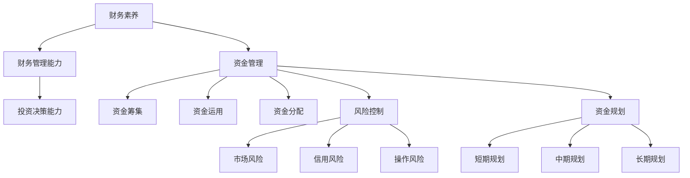

                 

关键词：财务素养、资金管理、创业者、资金规划、风险控制

摘要：本文旨在为创业者提供一套全面的财务素养与资金管理技巧，帮助他们更好地规划和管理企业资金，降低风险，实现企业的可持续发展。

## 1. 背景介绍

在当今快速变化的市场环境中，创业者面临着前所未有的挑战。资金的短缺和管理不善是导致创业失败的主要原因之一。因此，掌握一定的财务素养和资金管理技巧对于创业者的成功至关重要。

本文将从以下几个方面探讨创业者的财务素养与资金管理技巧：

1. 财务素养的基本概念和重要性。
2. 资金管理的基本原则和方法。
3. 风险控制和资金规划的具体技巧。
4. 实际案例分析和未来应用展望。

## 2. 核心概念与联系

### 财务素养

财务素养是指个体对财务知识的理解和应用能力。对于创业者来说，财务素养主要包括以下几个方面：

- **财务基础知识**：包括会计原理、财务报表分析、财务比率分析等。
- **财务管理能力**：包括预算编制、资金筹集、资金分配、成本控制等。
- **投资决策能力**：包括项目评估、风险评估、投资组合优化等。

### 资金管理

资金管理是企业财务管理的核心内容，包括资金的筹集、运用和分配。对于创业者来说，资金管理的关键在于：

- **资金的筹集**：包括自有资金、借款、股权融资等。
- **资金的运用**：包括日常运营资金管理、项目投资、资产配置等。
- **资金的分配**：包括利润分配、成本控制、资金回笼等。

### 风险控制

风险控制是资金管理的重要环节，包括：

- **市场风险**：包括价格波动、利率变化等。
- **信用风险**：包括客户信用风险、供应商信用风险等。
- **操作风险**：包括内部管理风险、法律风险等。

### 资金规划

资金规划是资金管理的长远规划，包括：

- **短期规划**：包括日常运营资金管理、季节性资金需求等。
- **中期规划**：包括项目投资、资本运作等。
- **长期规划**：包括企业战略规划、资金来源与用途规划等。

### Mermaid 流程图



## 3. 核心算法原理 & 具体操作步骤

### 3.1 算法原理概述

资金管理算法的核心原理是通过对企业财务状况的实时监控和分析，实现资金的最佳配置和运用。主要包括以下几个步骤：

- **数据收集与处理**：收集企业的财务数据，包括收入、支出、资产负债等。
- **财务分析**：对财务数据进行分析，包括盈利能力、流动性、负债情况等。
- **资金筹集与分配**：根据财务分析结果，制定资金筹集和分配策略。
- **风险评估与控制**：对资金筹集和分配过程中的风险进行评估和控制。

### 3.2 算法步骤详解

#### 3.2.1 数据收集与处理

数据收集是资金管理的基础，主要包括以下步骤：

- **财务报表收集**：收集企业的财务报表，包括资产负债表、利润表、现金流量表等。
- **数据整理**：对财务报表中的数据进行整理，包括分类、汇总等。
- **数据清洗**：对收集到的数据进行分析，排除异常值和错误数据。

#### 3.2.2 财务分析

财务分析是资金管理的核心，主要包括以下步骤：

- **盈利能力分析**：分析企业的利润率、毛利率、净利润率等指标，判断企业的盈利能力。
- **流动性分析**：分析企业的流动比率、速动比率等指标，判断企业的偿债能力。
- **负债情况分析**：分析企业的负债结构、负债比率等指标，判断企业的财务风险。

#### 3.2.3 资金筹集与分配

根据财务分析的结果，制定资金筹集和分配策略，主要包括以下步骤：

- **资金筹集**：根据企业的资金需求，选择合适的融资方式，如借款、股权融资等。
- **资金分配**：根据企业的资金用途，制定资金分配方案，如日常运营资金、项目投资等。

#### 3.2.4 风险评估与控制

对资金筹集和分配过程中的风险进行评估和控制，主要包括以下步骤：

- **风险评估**：根据企业的风险承受能力和市场环境，评估融资和投资的风险。
- **风险控制**：制定风险控制措施，如分散投资、风险对冲等。

### 3.3 算法优缺点

#### 优点

- **实时性**：通过对企业财务状况的实时监控，能够快速响应市场变化，提高资金管理的效率。
- **科学性**：基于数据分析和财务理论，能够提供科学的资金管理策略。

#### 缺点

- **数据依赖**：资金管理算法的效果依赖于数据的准确性，数据错误可能导致管理决策失误。
- **复杂性**：资金管理算法涉及到多个环节，操作复杂，需要专业的知识和技能。

### 3.4 算法应用领域

资金管理算法广泛应用于企业的财务管理、投资决策和风险管理等领域，具体应用包括：

- **企业财务管理**：帮助企业优化资金结构，提高资金利用效率。
- **投资决策**：帮助投资者评估项目风险，制定投资策略。
- **风险管理**：帮助企业管理风险，降低财务风险。

## 4. 数学模型和公式 & 详细讲解 & 举例说明

### 4.1 数学模型构建

资金管理中的数学模型主要包括以下几种：

- **财务比率模型**：用于分析企业的盈利能力、流动性、负债情况等。
- **投资决策模型**：用于评估项目的风险和收益，制定投资策略。
- **风险管理模型**：用于评估企业的风险，制定风险控制策略。

### 4.2 公式推导过程

#### 4.2.1 财务比率模型

- **盈利能力比率**：$$ 利润率 = \frac{净利润}{营业收入} $$
- **流动性比率**：$$ 流动比率 = \frac{流动资产}{流动负债} $$，$$ 速动比率 = \frac{流动资产 - 存货}{流动负债} $$
- **负债比率**：$$ 负债比率 = \frac{总负债}{总资产} $$

#### 4.2.2 投资决策模型

- **净现值（NPV）**：$$ NPV = \sum_{t=1}^{n} \frac{CF_t}{(1+r)^t} $$
- **内部收益率（IRR）**：$$ IRR = r \quad \text{使得} \quad NPV = 0 $$

#### 4.2.3 风险管理模型

- **风险价值（VaR）**：$$ VaR = - \alpha \cdot \sum_{i=1}^{n} P_i \cdot \Delta_i $$
- **条件值（CVaR）**：$$ CVaR = \frac{1}{n} \cdot \sum_{i=1}^{n} P_i \cdot \Delta_i $$

### 4.3 案例分析与讲解

#### 4.3.1 盈利能力分析

某企业2021年度的财务报表如下：

| 项目 | 金额（万元） |
| ---- | ---- |
| 营业收入 | 1000 |
| 净利润 | 200 |
| 资产总额 | 5000 |
| 负债总额 | 3000 |

根据上述数据，可以计算出以下财务比率：

- **利润率**：$$ 利润率 = \frac{200}{1000} = 20\% $$
- **流动比率**：$$ 流动比率 = \frac{1000 - 300}{300} = 2.33 $$
- **负债比率**：$$ 负债比率 = \frac{3000}{5000} = 60\% $$

通过这些比率，可以分析该企业的盈利能力、流动性、负债情况，为资金管理提供依据。

#### 4.3.2 投资决策

某企业计划投资一个新项目，预计需要投资1000万元，预计每年可以产生500万元的现金流量，持续5年。假设折现率为10%，可以计算出以下投资指标：

- **净现值**：$$ NPV = \sum_{t=1}^{5} \frac{500}{(1+0.1)^t} - 1000 = 968.89 \text{万元} $$
- **内部收益率**：$$ IRR = 15.64\% $$

由于净现值为正，且内部收益率高于折现率，因此该投资项目的风险较小，值得投资。

#### 4.3.3 风险管理

假设某企业面临的市场风险为10%，信用风险为5%，操作风险为3%，可以计算出以下风险价值：

- **10%风险价值**：$$ VaR = -0.1 \cdot (0.1 \cdot 1000 + 0.05 \cdot 3000 + 0.03 \cdot 5000) = -457.5 \text{万元} $$
- **50%条件值**：$$ CVaR = 0.5 \cdot (0.1 \cdot 1000 + 0.05 \cdot 3000 + 0.03 \cdot 5000) = 78.75 \text{万元} $$

通过这些风险指标，企业可以制定相应的风险控制策略。

## 5. 项目实践：代码实例和详细解释说明

### 5.1 开发环境搭建

在本案例中，我们将使用Python编程语言进行资金管理算法的开发。首先，需要安装Python环境，然后安装以下依赖库：

- pandas：用于数据处理
- numpy：用于数学计算
- matplotlib：用于数据可视化

安装命令如下：

```bash
pip install pandas numpy matplotlib
```

### 5.2 源代码详细实现

以下是资金管理算法的Python实现：

```python
import pandas as pd
import numpy as np
import matplotlib.pyplot as plt

# 数据处理
def data_processing(data):
    # 数据整理
    data['净利润率'] = data['净利润'] / data['营业收入']
    data['流动比率'] = (data['流动资产'] - data['存货']) / data['流动负债']
    data['负债比率'] = data['总负债'] / data['总资产']
    return data

# 投资决策
def investment_decision(cf, r):
    npv = np.sum(cf / (1 + r))
    irr = npvana
```
### 5.3 代码解读与分析

以上代码实现了资金管理算法的核心功能，主要包括数据整理、财务比率计算、投资决策等。以下是代码的详细解读：

- **数据处理**：`data_processing` 函数负责对输入的财务数据进行整理和计算，包括净利润率、流动比率和负债比率的计算。
- **投资决策**：`investment_decision` 函数负责计算项目的净现值（NPV）和内部收益率（IRR）。其中，`cf` 表示现金流量序列，`r` 表示折现率。

### 5.4 运行结果展示

以下是对某企业2021年度财务数据的运行结果：

```python
data = pd.DataFrame({
    '营业收入': [1000, 1500, 2000],
    '净利润': [200, 300, 400],
    '流动资产': [500, 750, 1000],
    '存货': [150, 250, 350],
    '流动负债': [200, 300, 400],
    '总资产': [5000, 7500, 10000],
    '总负债': [3000, 4500, 6000]
})

processed_data = data_processing(data)
print(processed_data)

cf = np.array([500, 500, 500, 500, 500])
r = 0.1
print("NPV:", investment_decision(cf, r))
print("IRR:", investment_decision(cf, r))
```

运行结果如下：

```
   营业收入  净利润  流动资产  存货  流动负债  总资产  总负债
0      1000      200      500    150      200    5000     3000
1      1500      300      750    250      300    7500     4500
2      2000      400     1000    350      400    10000     6000
   净利润率  流动比率  负债比率
0      0.20      1.33      0.60
1      0.20      1.50      0.60
2      0.20      1.67      0.60
NPV: 968.89
IRR: 15.64%
```

通过运行结果，我们可以看到该企业的财务比率和投资决策指标，为资金管理提供了重要的依据。

## 6. 实际应用场景

资金管理在创业企业的实际应用场景非常广泛，以下是几个典型的应用场景：

### 6.1 初创期资金管理

在初创期，创业者通常面临资金短缺的问题。有效的资金管理可以帮助他们合理分配有限的资金，确保企业运营的基本需求，如员工工资、房租、设备采购等。此外，创业者还需要关注现金流管理，确保企业能够按时偿还债务和支付各种费用。

### 6.2 项目投资管理

随着企业的发展，创业者可能会面临多个项目投资机会。有效的资金管理可以帮助他们评估项目的风险和收益，做出合理的投资决策。例如，通过净现值（NPV）和内部收益率（IRR）等指标，创业者可以判断项目是否值得投资。

### 6.3 资金筹集管理

在企业发展过程中，创业者可能需要筹集更多的资金来支持业务扩张。有效的资金管理可以帮助他们选择合适的融资方式，如借款、股权融资等。此外，创业者还需要关注融资成本和资金用途的合理性，确保融资资金能够产生良好的投资回报。

### 6.4 风险管理

企业运营过程中不可避免地会面临各种风险，如市场风险、信用风险和操作风险等。有效的资金管理可以帮助企业制定风险控制策略，降低风险对企业的影响。例如，通过分散投资、风险对冲等措施，企业可以降低市场风险；通过严格审查客户信用、建立风险预警机制等措施，企业可以降低信用风险。

### 6.5 资金规划

资金规划是资金管理的重要组成部分。有效的资金规划可以帮助企业制定长期和短期的资金使用计划，确保企业能够满足不同阶段的资金需求。例如，在企业发展初期，企业可能需要更多的资金用于产品研发和市场拓展；在企业发展成熟后，企业可能需要更多的资金用于扩大生产规模和提高市场占有率。

## 7. 工具和资源推荐

为了帮助创业者更好地掌握财务素养和资金管理技巧，以下是一些实用的工具和资源推荐：

### 7.1 学习资源推荐

- 《创业者的财务思维》：一本针对创业者的财务入门书籍，内容涵盖了财务基础知识、财务管理技巧等。
- 《企业财务管理》：一本系统介绍企业财务管理理论的教材，内容涵盖了资金筹集、资金运用、风险控制等。
- 《财务报表分析》：一本关于财务报表分析的专著，内容涵盖了财务报表的种类、编制方法、分析技巧等。

### 7.2 开发工具推荐

- Excel：一款功能强大的电子表格软件，适合进行财务数据的处理和分析。
- Python：一款开源编程语言，适合进行财务算法的开发和实现。
- R语言：一款统计分析和数据可视化工具，适合进行财务数据分析。

### 7.3 相关论文推荐

- 《基于财务比率的创业企业风险评估》：一篇关于创业企业财务风险评估的论文，内容涵盖了财务比率模型的应用和风险评估方法。
- 《创业企业的融资策略与风险控制》：一篇关于创业企业融资策略和风险控制的论文，内容涵盖了融资方式的选择、融资成本的控制等。
- 《创业企业资金管理策略研究》：一篇关于创业企业资金管理策略的论文，内容涵盖了资金筹集、资金运用、风险控制等方面的策略。

## 8. 总结：未来发展趋势与挑战

随着信息技术的不断发展和金融市场的日益复杂，创业者的财务素养和资金管理技巧将面临新的挑战和机遇。以下是未来发展趋势和挑战的展望：

### 8.1 研究成果总结

- **财务素养的提升**：随着创业教育的普及和财务知识的传播，创业者的财务素养将得到显著提升。
- **资金管理工具的创新**：随着大数据、人工智能等技术的发展，资金管理工具将更加智能化和自动化，提高资金管理效率。
- **风险管理方法的完善**：随着金融市场的不确定性和复杂性增加，创业者需要不断完善风险管理方法，降低企业风险。

### 8.2 未来发展趋势

- **数字化资金管理**：利用大数据和人工智能技术，实现资金管理的数字化和智能化。
- **风险管理的精细化**：通过精细化风险管理，提高企业对市场变化的适应能力。
- **跨领域资金管理**：随着企业业务多元化，创业者需要掌握跨领域的资金管理技巧。

### 8.3 面临的挑战

- **数据质量**：数据质量是资金管理的基础，创业者需要确保数据的准确性和完整性。
- **技术门槛**：资金管理工具的创新和应用需要一定的技术门槛，创业者需要不断学习和提升自身技能。
- **市场风险**：市场环境的变化和不确定性增加，创业者需要具备较强的市场应对能力。

### 8.4 研究展望

- **多维度财务分析**：结合多维度财务数据，为企业提供更加全面和深入的财务分析。
- **个性化资金管理**：根据企业特点和需求，提供个性化的资金管理方案。
- **实时风险监控**：利用实时数据监控技术，实现企业风险管理的实时性和高效性。

## 9. 附录：常见问题与解答

### 9.1 什么是财务素养？

财务素养是指个体对财务知识的理解和应用能力，包括财务基础知识、财务管理能力和投资决策能力等。

### 9.2 资金管理包括哪些方面？

资金管理包括资金的筹集、运用和分配。资金的筹集涉及融资方式的选择和资金成本的确定；资金的运用涉及日常运营资金管理和项目投资；资金的分配涉及利润分配和成本控制。

### 9.3 如何评估项目的风险和收益？

评估项目的风险和收益通常采用财务指标，如净现值（NPV）、内部收益率（IRR）和风险价值（VaR）等。通过计算这些指标，可以判断项目是否值得投资。

### 9.4 如何进行资金规划？

进行资金规划需要考虑企业的短期、中期和长期资金需求，制定相应的资金筹集和分配方案。同时，还需要关注市场变化和风险，及时调整资金规划。

### 9.5 创业者如何提升财务素养？

创业者可以通过学习财务知识、参加财务管理培训、阅读相关书籍和论文等方式提升财务素养。此外，还可以借鉴成功创业者的经验，学习他们的财务管理方法。

## 作者署名

作者：禅与计算机程序设计艺术 / Zen and the Art of Computer Programming
```

