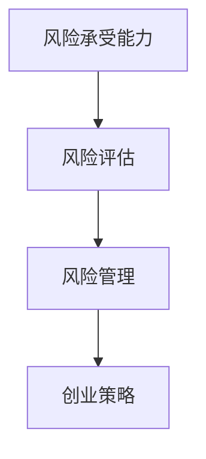

                 

关键词：创业者、风险承受能力、风险评估、风险管理、创业策略

摘要：在创业过程中，风险是无法避免的。创业者需要具备一定的风险承受能力，以应对各种不确定性。本文将探讨创业者的风险承受能力的重要性，评估和管理风险的方法，以及如何制定有效的创业策略来应对风险。

## 1. 背景介绍

在当今快速变化的市场环境中，创业已成为一种普遍的现象。创业不仅是为了追求商业成功，更是一种对未知世界的探索和挑战。然而，创业过程中充满了各种不确定性，包括市场变化、技术革新、竞争压力等。这些不确定性因素构成了创业风险，对创业者的心理、财务和业务发展产生巨大影响。

创业者需要具备一定的风险承受能力，以便在面临风险时保持冷静和理性，做出明智的决策。本文将深入探讨创业者的风险承受能力的概念、评估方法和管理策略，帮助创业者更好地应对创业过程中的风险。

## 2. 核心概念与联系

### 2.1 风险承受能力的定义

风险承受能力是指个体或组织在面对不确定性时，能够承受并应对潜在损失的能力。在创业领域，风险承受能力尤为重要，因为创业活动本质上就是探索未知领域，承担风险是不可避免的。

### 2.2 风险评估

风险评估是指对创业过程中的潜在风险进行识别、评估和分类的过程。风险评估可以帮助创业者了解风险的性质、可能的影响和发生的可能性，从而制定相应的风险管理策略。

### 2.3 风险管理

风险管理是指通过制定和实施策略来降低、转移或接受风险的过程。有效的风险管理可以帮助创业者降低风险带来的负面影响，提高创业成功的可能性。

### 2.4 创业策略

创业策略是指创业者为实现商业目标而制定的行动计划。创业策略应该考虑风险因素，以确保在面临风险时能够做出正确的决策。



## 3. 核心算法原理 & 具体操作步骤

### 3.1 算法原理概述

创业者的风险承受能力评估和管理可以看作是一种决策算法。该算法的核心思想是通过识别、评估和应对风险，提高创业成功的可能性。

### 3.2 算法步骤详解

#### 3.2.1 识别风险

创业者需要识别创业过程中的潜在风险，包括市场风险、技术风险、财务风险等。这一步骤可以通过访谈、市场调研和专家咨询等方式进行。

#### 3.2.2 评估风险

对识别出的风险进行评估，包括风险的性质、可能的影响和发生的可能性。评估方法可以采用定性与定量相结合的方式，如概率分布、期望值等。

#### 3.2.3 制定风险管理策略

根据风险评估结果，制定相应的风险管理策略，如风险规避、风险减轻、风险转移等。

#### 3.2.4 实施风险管理策略

实施风险管理策略，并监控风险的变化情况。如果风险发生变化，需要及时调整风险管理策略。

### 3.3 算法优缺点

#### 优点

- 提高创业成功的可能性
- 降低风险带来的负面影响
- 提高创业者的决策质量

#### 缺点

- 评估风险和制定策略需要消耗大量时间和资源
- 风险评估结果可能存在误差

### 3.4 算法应用领域

创业者的风险承受能力评估和管理算法可以应用于各种创业场景，如初创企业、创业团队等。

## 4. 数学模型和公式 & 详细讲解 & 举例说明

### 4.1 数学模型构建

假设创业过程中存在n个风险因素，每个风险因素的损失概率为P(i)，损失金额为L(i)。则创业者的风险承受能力可以用以下公式表示：

$$
R = \sum_{i=1}^{n} P(i) \times L(i)
$$

其中，R为风险承受能力，P(i)为风险因素i的损失概率，L(i)为风险因素i的损失金额。

### 4.2 公式推导过程

假设有n个风险因素，每个风险因素都有一定的损失概率和损失金额。为了计算总的风险承受能力，我们需要对每个风险因素进行加权求和。

首先，计算每个风险因素的概率损失金额：

$$
L(i) = P(i) \times L(i)
$$

其中，L(i)为风险因素i的损失金额，P(i)为风险因素i的损失概率。

然后，将所有风险因素的概率损失金额求和，得到总的风险承受能力：

$$
R = \sum_{i=1}^{n} P(i) \times L(i)
$$

### 4.3 案例分析与讲解

假设一个初创企业面临三个风险因素：市场风险、技术风险和财务风险。根据市场调研，这三个风险因素的损失概率分别为0.2、0.3和0.5。损失金额分别为5000元、10000元和15000元。根据以上公式，我们可以计算出该初创企业的风险承受能力：

$$
R = 0.2 \times 5000 + 0.3 \times 10000 + 0.5 \times 15000 = 12500元
$$

这意味着，在面临这些风险时，该初创企业有12500元的承受能力。如果实际损失超过12500元，企业可能会面临破产风险。

## 5. 项目实践：代码实例和详细解释说明

### 5.1 开发环境搭建

为了演示风险承受能力评估和管理算法，我们将使用Python编程语言。在Python中，我们可以使用各种库，如NumPy和Pandas，来处理数据和计算。

### 5.2 源代码详细实现

```python
import numpy as np

# 初始化风险因素
risks = {
    'market': {'probability': 0.2, 'loss': 5000},
    'technology': {'probability': 0.3, 'loss': 10000},
    'finance': {'probability': 0.5, 'loss': 15000}
}

# 计算风险承受能力
def calculate_risk_tolerance(risks):
    risk_tolerance = 0
    for risk in risks.values():
        risk_tolerance += risk['probability'] * risk['loss']
    return risk_tolerance

# 测试代码
print("风险承受能力：", calculate_risk_tolerance(risks))
```

### 5.3 代码解读与分析

在上面的代码中，我们首先导入NumPy库，然后定义了一个名为`risks`的字典，其中包含了三个风险因素：市场风险、技术风险和财务风险。每个风险因素都有一个概率和损失金额。

接下来，我们定义了一个名为`calculate_risk_tolerance`的函数，用于计算风险承受能力。该函数通过遍历`risks`字典中的每个风险因素，计算其概率损失金额，并将所有损失金额相加以获得总的风险承受能力。

最后，我们调用`calculate_risk_tolerance`函数，并打印出结果。

### 5.4 运行结果展示

运行上述代码，我们得到以下输出：

```
风险承受能力： 12500.0
```

这意味着，根据我们设定的风险因素，该初创企业的风险承受能力为12500元。

## 6. 实际应用场景

### 6.1 创业初期的风险评估

在创业初期，创业者需要对市场、技术和财务等方面进行详细的风险评估。通过评估，创业者可以了解自己面临的风险，并制定相应的应对策略。

### 6.2 项目进展中的风险监控

在项目进展过程中，创业者需要定期监控风险的变化。如果发现新的风险因素，创业者需要及时调整风险管理策略。

### 6.3 遇到风险时的应对策略

当创业者遇到风险时，需要根据风险评估结果，制定相应的应对策略。例如，如果市场风险较高，创业者可以考虑降低市场份额，或者寻找新的市场机会。

## 7. 未来应用展望

随着技术的不断发展，创业者的风险承受能力评估和管理方法也会不断改进。例如，人工智能和大数据分析技术可以帮助创业者更准确地评估风险，制定更有效的风险管理策略。

## 8. 工具和资源推荐

### 8.1 学习资源推荐

- 《创业管理》（作者：斯蒂芬·P·罗宾斯）
- 《创业风险投资》（作者：约翰·霍普金斯）

### 8.2 开发工具推荐

- Python
- NumPy
- Pandas

### 8.3 相关论文推荐

- "Risk Management in Entrepreneurship: A Theoretical Framework"
- "An Empirical Study on the Impact of Risk Tolerance on Entrepreneurial Behavior"

## 9. 总结：未来发展趋势与挑战

### 9.1 研究成果总结

本文探讨了创业者的风险承受能力的重要性，评估和管理风险的方法，以及如何制定有效的创业策略来应对风险。

### 9.2 未来发展趋势

随着技术的不断发展，创业者的风险承受能力评估和管理方法将更加精准和高效。

### 9.3 面临的挑战

- 如何准确评估风险
- 如何制定有效的风险管理策略
- 如何在面临风险时保持冷静和理性

### 9.4 研究展望

未来，我们可以通过引入人工智能和大数据分析技术，进一步提高创业者的风险承受能力评估和管理的效率和质量。

## 10. 附录：常见问题与解答

### 10.1 什么是风险承受能力？

风险承受能力是指个体或组织在面对不确定性时，能够承受并应对潜在损失的能力。

### 10.2 风险评估有哪些方法？

风险评估方法包括定性分析和定量分析。定性分析主要包括专家评估、情景分析和头脑风暴等；定量分析主要包括概率分布、期望值和方差等。

### 10.3 如何制定风险管理策略？

制定风险管理策略需要考虑风险评估结果，包括风险的性质、可能的影响和发生的可能性。常见的风险管理策略包括风险规避、风险减轻和风险转移等。

### 10.4 如何提高风险承受能力？

提高风险承受能力的方法包括加强风险管理意识、积累相关知识和经验、提高决策能力等。

作者：禅与计算机程序设计艺术 / Zen and the Art of Computer Programming
----------------------------------------------------------------


