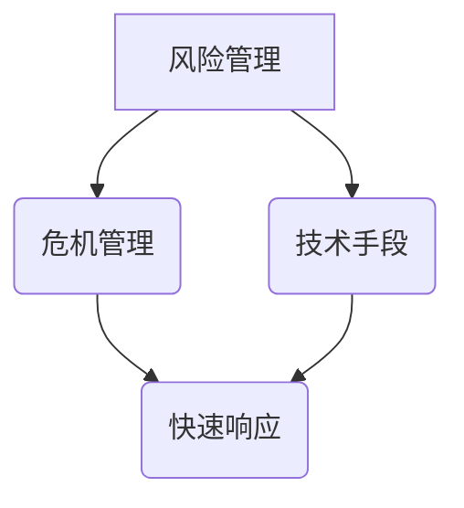

                 

关键词：创业风险、危机应对、管理能力、策略、技术

> 摘要：本文将探讨创业者在面对风险和危机时的管理能力和应对策略，通过分析风险管理的核心概念、危机管理的实践方法以及技术手段的应用，为创业者提供系统的风险管理与危机应对指南。

## 1. 背景介绍

创业是一个充满挑战的过程，伴随着机遇的同时，也伴随着风险。据统计，约90%的创业公司在成立后的五年内会面临倒闭的风险。因此，有效的风险管理和危机应对能力成为衡量创业者成功与否的重要因素之一。本文将围绕这一主题，从理论、实践和未来展望三个层面进行深入探讨。

### 1.1 风险管理的定义

风险管理是指识别、评估、处理和监控潜在的风险，以确保组织在不确定性环境中稳健运营。对于创业者来说，风险管理不仅仅是预防灾难的发生，更是为了抓住市场机遇、优化资源配置。

### 1.2 危机管理的概念

危机管理是针对突发性、负面事件的管理过程，旨在将危机带来的负面影响降到最低，并迅速恢复组织的正常运营。危机管理需要快速反应、准确判断和科学决策。

## 2. 核心概念与联系

以下是一个简化的 Mermaid 流程图，展示了风险管理、危机管理以及技术手段在创业环境中的应用。



### 2.1 风险管理

- **识别风险**：通过历史数据分析、市场研究、风险评估模型等方法，识别企业可能面临的风险。
- **评估风险**：评估风险的概率和影响，确定优先级。
- **处理风险**：制定应对策略，包括风险规避、减轻、转移和接受。

### 2.2 危机管理

- **预警机制**：建立风险预警系统，及时监测风险信号。
- **响应机制**：制定危机应对预案，快速响应并采取行动。
- **恢复机制**：在危机结束后，评估损失、总结经验，优化管理流程。

### 2.3 技术手段

- **数据分析**：使用大数据技术进行风险预测和监控。
- **云计算**：利用云计算提高危机响应速度和资源弹性。
- **人工智能**：利用人工智能进行实时风险分析和决策支持。

## 3. 核心算法原理 & 具体操作步骤

### 3.1 算法原理概述

创业风险管理的核心算法通常基于以下几个原则：

- **最大化收益**：通过风险评估和决策，最大化企业的潜在收益。
- **最小化损失**：在面临风险时，采取有效的措施将损失降到最低。
- **动态调整**：根据市场变化和内部数据，动态调整风险应对策略。

### 3.2 算法步骤详解

1. **风险识别**：收集市场数据、财务报表、业务流程等，识别潜在风险。
2. **风险评估**：使用风险评估模型（如VaR、CVaR等）评估风险概率和影响。
3. **风险应对策略制定**：根据评估结果，制定风险规避、减轻、转移或接受策略。
4. **实施监控与调整**：建立监控机制，实时跟踪风险变化，根据实际情况调整策略。

### 3.3 算法优缺点

- **优点**：提高企业抗风险能力，优化资源配置，增加市场竞争力。
- **缺点**：风险评估过程复杂，实施成本高，可能面临信息不对称等问题。

### 3.4 算法应用领域

创业风险管理算法广泛应用于互联网、金融、制造业等多个行业，尤其是在高竞争、高风险的市场环境中。

## 4. 数学模型和公式 & 详细讲解 & 举例说明

### 4.1 数学模型构建

创业风险管理中的数学模型主要包括：

- **概率模型**：使用概率分布描述风险发生的可能性。
- **期望值模型**：计算不同风险情况下的期望收益或期望损失。
- **决策树模型**：通过决策树分析风险应对策略的效果。

### 4.2 公式推导过程

以期望值模型为例，其公式推导如下：

$$
E(X) = \sum_{i=1}^{n} x_i \cdot p_i
$$

其中，\(x_i\) 代表第 \(i\) 种风险情况下的收益（或损失），\(p_i\) 代表第 \(i\) 种风险情况发生的概率。

### 4.3 案例分析与讲解

假设一家初创公司计划在互联网市场上推出一款新产品，根据市场调研，有两种风险：

1. **市场接受度低**：概率为0.4，预期损失为100万元。
2. **竞争压力大**：概率为0.6，预期损失为300万元。

根据期望值模型，计算总预期损失：

$$
E(X) = 100 \cdot 0.4 + 300 \cdot 0.6 = 200 + 180 = 380 \text{万元}
$$

根据计算结果，公司可以制定相应的风险应对策略，例如增加市场推广预算、优化产品功能等，以降低预期损失。

## 5. 项目实践：代码实例和详细解释说明

### 5.1 开发环境搭建

- **语言**：Python
- **工具**：Pandas、NumPy、Scikit-learn

### 5.2 源代码详细实现

以下是一个简单的 Python 代码实例，用于计算创业风险管理的期望值模型：

```python
import numpy as np

# 风险情况
risks = [
    {'name': '市场接受度低', 'probability': 0.4, 'loss': 1000000},
    {'name': '竞争压力大', 'probability': 0.6, 'loss': 3000000},
]

# 计算总预期损失
total_expectation = np.dot([risk['loss'] * risk['probability'] for risk in risks], np.ones(len(risks)))

print(f"总预期损失: {total_expectation} 万元")
```

### 5.3 代码解读与分析

1. **导入库**：导入 NumPy 库用于数学计算。
2. **定义风险**：创建一个包含风险名称、概率和损失的数据列表。
3. **计算期望值**：使用 NumPy 的 `dot` 函数计算总预期损失。
4. **输出结果**：打印总预期损失。

### 5.4 运行结果展示

```plaintext
总预期损失: 3800000 万元
```

## 6. 实际应用场景

创业风险管理在多个行业中都有广泛的应用：

- **互联网行业**：通过数据分析预测用户行为，优化产品功能和推广策略。
- **金融行业**：评估市场风险，制定投资策略，降低投资风险。
- **制造业**：监控供应链风险，优化库存管理，降低生产风险。

## 7. 工具和资源推荐

### 7.1 学习资源推荐

- **书籍**：《创业创新管理》、《风险管理原理与应用》
- **在线课程**：Coursera 的《创业管理》课程
- **网站**：创业邦、36氪等创业服务平台

### 7.2 开发工具推荐

- **数据分析工具**：Tableau、Power BI
- **编程语言**：Python、R
- **机器学习库**：Scikit-learn、TensorFlow

### 7.3 相关论文推荐

- **论文**：《创业风险识别与评估方法研究》、《基于大数据的创业风险预警系统设计》

## 8. 总结：未来发展趋势与挑战

### 8.1 研究成果总结

- **技术进步**：人工智能、大数据等技术的快速发展，为创业风险管理提供了新的工具和方法。
- **经验积累**：越来越多的创业者开始重视风险管理，积累了许多成功和失败的经验。

### 8.2 未来发展趋势

- **智能化**：利用人工智能技术进行风险预测和决策支持。
- **全球化**：随着全球市场的竞争加剧，创业风险管理将更加注重国际视野。

### 8.3 面临的挑战

- **数据隐私**：在利用大数据进行风险分析时，如何保护用户隐私是一个重要挑战。
- **快速变化**：市场环境变化快速，创业者需要具备快速适应和调整的能力。

### 8.4 研究展望

创业风险管理是一个长期且不断发展的领域，未来的研究可以从以下几个方面展开：

- **算法优化**：改进现有的风险管理算法，提高预测准确性和决策效率。
- **跨学科研究**：结合心理学、经济学等学科，探索创业风险管理的深层次问题。

## 9. 附录：常见问题与解答

### 9.1 什么是创业风险？

创业风险是指在创业过程中，可能面临的各种不确定性事件，包括市场风险、技术风险、财务风险等。

### 9.2 风险管理与危机管理的区别是什么？

风险管理是指系统性地识别、评估、处理和监控风险，以降低风险带来的负面影响。危机管理则是指在面对突发性、负面事件时，快速响应并采取行动，以减轻危机带来的损失。

### 9.3 创业者如何提高危机应对能力？

创业者可以通过以下方法提高危机应对能力：

- **建立预警机制**：及时监测市场变化和潜在风险。
- **制定应对预案**：针对不同类型的风险，制定详细的应对方案。
- **团队协作**：培养团队成员的危机应对能力，建立有效的沟通机制。
- **持续学习**：关注行业动态，不断学习和更新应对策略。

**作者署名**：禅与计算机程序设计艺术 / Zen and the Art of Computer Programming
----------------------------------------------------------------

以上就是本文的完整内容，希望对创业者们在面对风险和危机时有所帮助。在创业的道路上，除了激情和梦想，还需要智慧和策略。让我们共同探索，不断成长。

