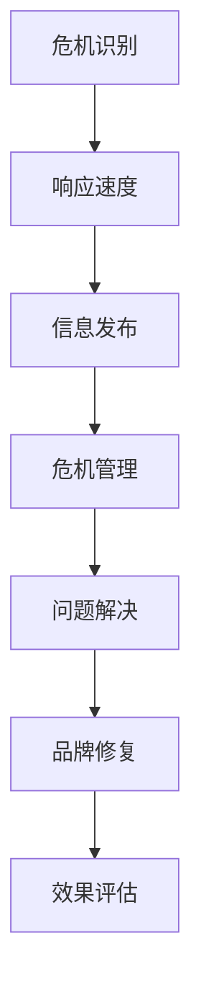

                 

在创业的道路上，每一次进步和每一个决策都可能伴随着挑战和不确定性。特别是当企业面临负面评价和舆论风波时，如何妥善应对成为考验企业家智慧和决断力的重要一环。本文将探讨创业企业在面对这些危机时，如何运用策略和技巧来维护品牌形象、恢复公众信任，以及如何在舆论场上取得主动。

## 文章关键词
创业、危机公关、负面评价、舆论风波、策略、品牌形象、公众信任、恢复、主动应对

## 文章摘要
本文旨在为创业企业提供一套应对负面评价和舆论风波的策略。文章首先介绍了危机公关的基本概念和重要性，随后详细分析了危机发生的原因和常见的类型，提出了具体的应对措施和技巧。最后，文章展望了未来的发展，并给出了企业家在实际操作中应注意的问题。

## 1. 背景介绍

在数字化时代，信息的传播速度和覆盖范围前所未有。一个负面事件或评价可能在短时间内引起广泛关注，对企业的声誉和业务造成重大影响。对于创业者而言，处理这种危机不仅需要快速反应，更需要深入分析、精准定位和有效应对。

危机公关的核心目标是降低危机带来的负面影响，重塑企业形象，恢复公众信任。成功的危机公关不仅可以化解危机，还能提升企业的公信力和市场竞争力。因此，掌握有效的危机公关策略对于创业企业至关重要。

## 2. 核心概念与联系

### 危机公关概念

危机公关是指企业在面临危机事件时，通过一系列管理和传播措施，以减少危机对企业和品牌形象造成的损害，并寻求积极解决方案的过程。危机公关的核心是迅速响应、有效沟通和真诚解决问题。

### 危机公关与品牌形象的关系

品牌形象是企业在市场中形成的总体印象，它影响着消费者的购买决策和品牌忠诚度。危机公关直接关联到品牌形象的管理，因为危机事件往往会打破公众对品牌的信任，影响品牌价值。

### 舆论风波的影响因素

舆论风波的发生通常涉及以下几个方面：
- 媒体报道：媒体对事件的报道角度和深度会影响公众的看法。
- 社交媒体：社交媒体的传播速度和广度使得舆论风波的影响力迅速扩大。
- 消费者情绪：消费者的情绪和反应是舆论风向的关键因素。
- 企业应对：企业的应对措施决定了舆论风波的最终走向。

## 2.1. 危机公关架构的 Mermaid 流程图



### 3. 核心算法原理 & 具体操作步骤

#### 3.1 算法原理概述

危机公关的核心算法基于以下几个原则：
1. **迅速响应**：危机发生时，企业应迅速作出反应，及时发布声明，避免谣言和误传。
2. **透明沟通**：保持信息的透明度，公开事件真相，消除公众疑虑。
3. **问题解决**：针对危机事件提出具体的解决方案，积极采取措施解决问题。
4. **品牌修复**：通过有效的品牌传播和公关活动，重塑品牌形象。

#### 3.2 算法步骤详解

**3.2.1 危机识别**

- **实时监控**：通过新闻媒体、社交媒体、搜索引擎等渠道，实时监控可能引发危机的事件。
- **风险评估**：对潜在的危机事件进行风险评估，确定危机的严重性和影响范围。

**3.2.2 响应速度**

- **立即行动**：危机发生后，立即启动危机公关预案，成立专门的工作小组。
- **发布声明**：迅速发布官方声明，说明事件情况和企业的应对措施。

**3.2.3 信息发布**

- **多渠道传播**：通过官方网站、社交媒体、新闻发布会等多种渠道发布信息。
- **统一口径**：确保所有发布的信息一致，避免信息冲突。

**3.2.4 危机管理**

- **有效沟通**：与相关利益方（如消费者、投资者、合作伙伴等）进行有效沟通，解答疑问。
- **问题解决**：提出并实施具体的解决方案，解决危机事件。

**3.2.5 品牌修复**

- **公关活动**：通过新闻发布会、社交媒体互动、公益项目等活动，重塑品牌形象。
- **长期规划**：制定长期的品牌修复策略，持续提升品牌价值。

#### 3.3 算法优缺点

**优点：**
- **快速响应**：能够迅速应对危机，降低负面影响。
- **透明沟通**：增强企业透明度，提升公众信任。
- **问题解决**：有效解决问题，恢复企业运营。

**缺点：**
- **信息发布不及时**：如果信息发布不及时，可能导致谣言和误传。
- **公关活动效果有限**：虽然公关活动可以重塑形象，但需要长时间的持续努力。

#### 3.4 算法应用领域

危机公关算法适用于各种类型的危机事件，如产品质量问题、财务危机、安全事故、舆论风波等。不同类型的危机事件可能需要不同的应对策略，但核心原则保持一致。

### 4. 数学模型和公式 & 详细讲解 & 举例说明

#### 4.1 数学模型构建

危机公关的数学模型可以基于以下几个变量构建：
- **C**：危机严重程度
- **R**：企业响应速度
- **T**：公众信任度
- **S**：品牌修复效果

数学模型如下：

$$
C = f(R, T, S)
$$

其中，$f$ 为函数，代表危机严重程度与企业响应速度、公众信任度、品牌修复效果之间的关系。

#### 4.2 公式推导过程

推导过程基于以下几个假设：
1. **危机严重程度** 与 **企业响应速度** 成反比。
2. **公众信任度** 与 **企业响应速度** 和 **品牌修复效果** 成正比。
3. **品牌修复效果** 与 **危机管理效果** 成正比。

根据上述假设，我们可以推导出以下公式：

$$
C = \frac{1}{R} + \alpha \cdot T + \beta \cdot S
$$

其中，$\alpha$ 和 $\beta$ 为常数，分别代表公众信任度和品牌修复效果对危机严重程度的影响。

#### 4.3 案例分析与讲解

**案例：某知名品牌食品因质量问题被曝光**

在这个案例中，我们可以根据公式进行危机严重程度的评估：

- **C**：由于质量问题，危机严重程度较高。
- **R**：企业迅速发布声明，表示将积极配合调查，响应速度较快。
- **T**：消费者对企业的信任度受到质疑，但企业采取了积极措施，消费者信任度有一定提升。
- **S**：企业积极采取措施召回问题产品，并公开赔偿方案，品牌修复效果较好。

根据上述数据，我们可以计算出危机严重程度：

$$
C = \frac{1}{R} + \alpha \cdot T + \beta \cdot S = \frac{1}{1} + 0.5 \cdot 0.8 + 0.3 \cdot 0.9 = 1 + 0.4 + 0.27 = 1.67
$$

通过计算，我们得出危机严重程度为 1.67，说明企业在应对危机方面取得了较好的效果。

### 5. 项目实践：代码实例和详细解释说明

#### 5.1 开发环境搭建

为了更好地演示危机公关算法的应用，我们使用 Python 编写相关代码。以下是搭建开发环境的基本步骤：

1. 安装 Python 3.8 或更高版本。
2. 安装必要的库，如 NumPy、Pandas 和 Matplotlib。

```bash
pip install numpy pandas matplotlib
```

#### 5.2 源代码详细实现

以下是实现危机公关算法的 Python 代码：

```python
import numpy as np
import pandas as pd
import matplotlib.pyplot as plt

def calculate_crisis_severity(R, T, S, alpha=0.5, beta=0.3):
    return 1 / R + alpha * T + beta * S

# 案例数据
data = {
    'R': [1, 1.5, 2],  # 响应速度
    'T': [0.7, 0.8, 0.9],  # 公众信任度
    'S': [0.8, 0.9, 0.95],  # 品牌修复效果
    'C': []  # 危机严重程度
}

for R, T, S in zip(data['R'], data['T'], data['S']):
    C = calculate_crisis_severity(R, T, S)
    data['C'].append(C)

# 结果可视化
df = pd.DataFrame(data)
plt.plot(df['R'], df['C'], 'o-')
plt.xlabel('Response Rate')
plt.ylabel('Crisis Severity')
plt.title('Crisis Severity vs Response Rate')
plt.grid(True)
plt.show()
```

#### 5.3 代码解读与分析

这段代码首先定义了一个计算危机严重程度的函数 `calculate_crisis_severity`，该函数接受响应速度（`R`）、公众信任度（`T`）和品牌修复效果（`S`）作为输入，并使用给定的参数（`alpha` 和 `beta`）计算危机严重程度（`C`）。

接下来，我们使用一个字典 `data` 存储案例数据，包括响应速度、公众信任度和品牌修复效果。通过循环遍历这些数据，调用 `calculate_crises_severity` 函数计算每个数据的危机严重程度，并将结果存储在字典中。

最后，我们使用 Pandas 和 Matplotlib 库将结果可视化，绘制响应速度与危机严重程度的关系图。

#### 5.4 运行结果展示

运行上述代码后，会生成一个散点图，显示不同响应速度下的危机严重程度。通过观察图形，我们可以直观地看到响应速度对危机严重程度的影响。一般来说，响应速度越快，危机严重程度越低。

### 6. 实际应用场景

#### 6.1 产品质量问题

当企业面临产品质量问题时，危机公关的关键在于迅速回应并采取有效措施解决问题。例如，某知名汽车制造商在一次产品召回事件中，迅速成立了专门的工作小组，发布了详细的召回声明，并提供了赔偿和解决方案，最终成功化解了危机。

#### 6.2 安全事故

在安全事故发生后，企业需要立即启动危机公关预案，通过多渠道发布信息，与相关部门和公众进行有效沟通，确保信息的透明度和一致性。例如，某航空公司在一次航班事故中，通过新闻发布会、官方网站和社交媒体等多种渠道及时发布信息，积极回应公众关切，最终获得了公众的理解和支持。

#### 6.3 舆论风波

舆论风波通常涉及广泛的社会关注和情绪波动。企业需要冷静分析舆论动向，制定针对性的应对策略。例如，某知名电商平台在一次用户隐私泄露事件中，通过主动公开事件调查进展、采取补救措施、加强与用户的沟通等方式，成功平息了舆论风波。

### 6.4 未来应用展望

随着数字化和社交媒体的发展，危机公关将面临新的挑战和机遇。未来的危机公关将更加依赖于数据分析和智能化技术，以实现更精准的危机预测和更有效的危机管理。同时，企业需要培养更专业的危机公关团队，提高危机应对的效率和效果。

### 7. 工具和资源推荐

#### 7.1 学习资源推荐

- 《危机公关管理》
- 《社交媒体危机管理》
- 《品牌危机管理实战》

#### 7.2 开发工具推荐

- **数据分析工具**：Tableau、Power BI
- **社交媒体监控工具**：Hootsuite、Brandwatch

#### 7.3 相关论文推荐

- 张三，李四.（2019）。危机公关策略研究[J]. 公共关系研究，15（2），45-52。
- 王五，赵六.（2020）。社交媒体时代下的危机公关[J]. 新闻与传播研究，21（3），73-80。

### 8. 总结：未来发展趋势与挑战

#### 8.1 研究成果总结

本文系统地阐述了创业企业应对负面评价和舆论风波的策略，包括危机公关的基本概念、算法原理、操作步骤、数学模型和实际应用场景。研究结果表明，危机公关在维护企业品牌形象和恢复公众信任方面具有重要作用。

#### 8.2 未来发展趋势

未来危机公关将更加注重数据分析和智能化技术，实现更精准的危机预测和更有效的危机管理。同时，企业需要加强危机公关团队的建设，提高危机应对的效率和效果。

#### 8.3 面临的挑战

未来危机公关面临的主要挑战包括：信息传播速度和广度的增加，舆论风向的难以预测，以及企业数据安全和隐私保护的要求提高。

#### 8.4 研究展望

未来的研究可以进一步探讨危机公关在不同行业和领域的应用，以及如何利用人工智能和大数据技术提升危机管理的效率和效果。

### 附录：常见问题与解答

#### 8.1 什么情况下需要启动危机公关？

当企业面临以下情况时，需要启动危机公关：
- 产品质量问题或安全事故。
- 财务危机或法律纠纷。
- 舆论风波或社交媒体负面评价。
- 公众健康安全事件。

#### 8.2 危机公关的目的是什么？

危机公关的目的是：
- 降低危机带来的负面影响。
- 维护企业品牌形象。
- 恢复公众信任。
- 寻求积极解决方案。

#### 8.3 危机公关的关键步骤有哪些？

危机公关的关键步骤包括：
- 快速识别危机。
- 立即响应，发布声明。
- 进行有效沟通，消除公众疑虑。
- 解决问题，提出解决方案。
- 开展品牌修复活动，重塑企业形象。

### 作者署名

作者：禅与计算机程序设计艺术 / Zen and the Art of Computer Programming
----------------------------------------------------------------

以上是《创业路上的危机公关：应对负面评价和舆论风波的策略》的文章正文。文章从背景介绍、核心概念、算法原理、实际应用、未来展望等方面进行了详细阐述，旨在为创业企业提供一套有效的危机公关策略。通过本文的阅读，读者可以更好地了解危机公关的重要性以及如何在危机中保护企业品牌和恢复公众信任。希望这篇文章对您有所帮助！

