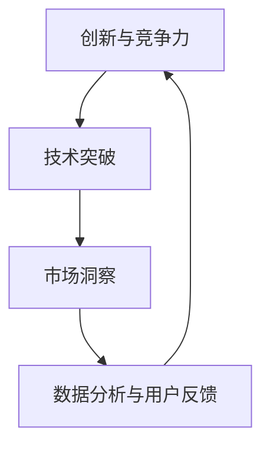

                 

关键词：持续创新、产品竞争力、创业、技术突破、市场洞察

> 摘要：本文旨在探讨创业过程中如何通过持续创新来保持产品的竞争力。文章将分析创业公司面临的挑战，介绍保持产品竞争力的关键要素，并分享一些成功的创新案例，为创业公司提供实用的指导。

## 1. 背景介绍

在当今快速变化的商业环境中，创业公司面临着前所未有的挑战。市场的竞争日益激烈，用户的需求不断变化，技术进步日新月异，这些都要求创业公司必须具备强大的创新能力，以保持产品的竞争力。然而，创新并非易事，创业公司在资源有限的情况下，如何找到有效的创新途径，确保产品的持续竞争力，是一个值得深入探讨的话题。

本文将围绕以下几个核心问题展开讨论：

- 创业公司如何在有限的资源下实现创新？
- 如何通过创新来满足和预测用户需求？
- 技术突破如何成为保持产品竞争力的关键？
- 创业公司如何利用数据分析和市场洞察来指导创新？

通过对这些问题的探讨，本文希望能够为创业公司提供一些有价值的启示。

## 2. 核心概念与联系

### 2.1 创新与竞争力

创新与竞争力是创业过程中不可或缺的两个核心概念。创新是指通过引入新的想法、方法或技术来改进产品或服务，从而满足市场需求或创造新市场。竞争力则是指企业在市场竞争中相对于竞争对手所具有的优势和劣势。创新和竞争力之间存在着密切的联系，创新是提升竞争力的手段，而竞争力则是创新价值的体现。

### 2.2 技术突破

技术突破是创新的重要组成部分。技术突破通常是指通过重大技术进步来实现前所未有的功能或性能提升。在创业公司中，技术突破往往能够带来竞争优势，从而帮助公司在市场中脱颖而出。例如，苹果公司的iPhone通过引入多点触控技术，颠覆了传统的手机市场，成为行业领导者。

### 2.3 市场洞察

市场洞察是指对市场环境、用户需求和竞争对手的深入理解和分析。创业公司通过市场洞察可以更好地了解用户需求，发现市场机会，从而指导产品创新。市场洞察不仅包括对现有市场的分析，还包括对未来市场的预测，这有助于创业公司把握市场趋势，提前布局。

### 2.4 数据分析与用户反馈

数据分析和用户反馈是创业公司获取市场洞察的重要工具。通过数据分析，创业公司可以了解产品的性能、用户行为和市场需求，从而优化产品设计和功能。用户反馈则提供了直接的顾客意见，有助于创业公司了解用户的真实需求和痛点，进而进行针对性的改进。

### 2.5 Mermaid 流程图

以下是一个简化的 Mermaid 流程图，用于展示创新与竞争力、技术突破、市场洞察和数据分析与用户反馈之间的联系。



在这个流程图中，创新与竞争力是核心，技术突破和市场洞察为其提供支持，而数据分析和用户反馈则帮助循环迭代，不断优化创新过程。

## 3. 核心算法原理 & 具体操作步骤

### 3.1 算法原理概述

为了实现持续创新，创业公司需要采用一种系统的创新方法。这里我们介绍一种基于市场洞察和数据分析的创新算法，该算法主要包括以下几个步骤：

1. 市场调研：通过问卷调查、用户访谈等方式收集市场数据，了解用户需求和竞争对手情况。
2. 数据分析：使用数据挖掘和统计分析方法，对市场调研结果进行分析，提取有价值的信息。
3. 概念生成：基于分析结果，生成多个创新概念，包括功能改进、产品设计、技术突破等。
4. 概念评估：对生成的概念进行评估，选择最具潜力的概念进行进一步开发。
5. 实验与验证：对选定的概念进行实验验证，收集用户反馈和性能数据。
6. 反馈迭代：根据实验结果和用户反馈，对产品进行改进，并重新进行概念评估。

### 3.2 算法步骤详解

#### 3.2.1 市场调研

市场调研是创新过程的第一步。创业公司需要深入了解市场需求和竞争环境。具体步骤如下：

- 设计调研问卷：设计针对用户需求和竞争对手的调查问卷，确保问题具有针对性和可操作性。
- 用户访谈：邀请潜在用户进行深入访谈，获取更详细的用户需求和意见。
- 竞争分析：分析竞争对手的产品特点、市场定位和用户反馈，了解市场趋势。

#### 3.2.2 数据分析

数据分析是市场调研的延续，通过对收集到的数据进行处理和分析，提取有价值的信息。具体步骤如下：

- 数据清洗：清洗和整理收集到的数据，确保数据质量。
- 数据挖掘：使用数据挖掘技术，从大量数据中提取潜在的模式和趋势。
- 统计分析：对提取的数据进行统计分析，如描述性统计、相关性分析、回归分析等。

#### 3.2.3 概念生成

基于数据分析结果，创业公司可以生成多个创新概念。具体步骤如下：

- 功能改进：基于用户需求和反馈，提出功能改进的方案。
- 设计创新：基于用户体验，提出产品设计的创新点。
- 技术突破：基于技术趋势和公司资源，提出可能的技术突破方向。

#### 3.2.4 概念评估

概念评估是对生成的创新概念进行筛选和排序的过程。具体步骤如下：

- 评估指标：确定评估指标，如用户满意度、市场潜力、技术可行性等。
- 评估方法：使用评估方法，如打分法、比较法等，对概念进行评估。
- 选定概念：根据评估结果，选择最具潜力的概念进行进一步开发。

#### 3.2.5 实验与验证

实验与验证是对选定的概念进行实际验证的过程。具体步骤如下：

- 设计实验：设计实验方案，包括实验对象、实验方法、数据收集方式等。
- 实施实验：按照实验方案进行实验，收集实验数据。
- 数据分析：对实验数据进行统计分析，评估概念的有效性和可行性。

#### 3.2.6 反馈迭代

反馈迭代是持续改进的过程。具体步骤如下：

- 用户反馈：收集用户对实验结果的反馈，了解用户对产品的真实看法。
- 数据分析：对用户反馈和实验数据进行综合分析，提取改进点。
- 产品改进：根据分析结果，对产品进行改进。
- 重新评估：对改进后的产品进行重新评估，确保产品竞争力。

### 3.3 算法优缺点

#### 3.3.1 优点

- 系统性：该算法提供了一套系统的创新方法，有助于创业公司实现持续创新。
- 数据驱动：算法基于市场数据和用户反馈，确保创新方向符合市场需求。
- 反馈迭代：算法强调反馈和迭代，有助于不断优化产品，提升竞争力。

#### 3.3.2 缺点

- 成本高：市场调研和数据分析需要投入大量资源，尤其是对于初创公司。
- 时间长：从概念生成到实验验证需要较长的时间，可能无法迅速响应市场变化。

### 3.4 算法应用领域

该算法适用于需要持续创新的创业公司，尤其是在以下领域：

- 消费品行业：如电子产品、家居用品等，用户需求变化快，市场竞争激烈。
- 互联网行业：如社交媒体、在线教育等，技术进步迅速，创新机会多。
- 医疗健康行业：如医疗设备、健康应用等，用户需求多样，创新空间大。

## 4. 数学模型和公式 & 详细讲解 & 举例说明

### 4.1 数学模型构建

为了更好地理解创新过程，我们可以构建一个简化的数学模型，用于描述创新与竞争力之间的关系。假设：

- \( C \) 为竞争力，
- \( I \) 为创新程度，
- \( M \) 为市场洞察力，
- \( D \) 为数据分析能力。

则我们可以构建以下数学模型：

\[ C = f(I, M, D) \]

其中，\( f \) 表示竞争力与创新程度、市场洞察力和数据分析能力之间的关系。

### 4.2 公式推导过程

为了推导这个公式，我们可以考虑以下几个方面：

- 创新程度：创新程度越高，产品竞争力越强。因此，我们可以设定 \( I \) 与 \( C \) 成正比关系，即 \( I \propto C \)。
- 市场洞察力：市场洞察力越强，创新越符合市场需求，产品竞争力越强。因此，我们可以设定 \( M \) 与 \( C \) 成正相关关系，即 \( M \propto C \)。
- 数据分析能力：数据分析能力越强，能够更好地理解市场数据和用户需求，从而提高创新效果，提升产品竞争力。因此，我们可以设定 \( D \) 与 \( C \) 成正相关关系，即 \( D \propto C \)。

综合以上三个方面，我们可以得到以下推导过程：

\[ C = k \cdot I + k \cdot M + k \cdot D \]

其中，\( k \) 为常数，表示单位创新程度、市场洞察力和数据分析能力对应的竞争力提升。

为了简化公式，我们可以令 \( k = 1 \)，则得到：

\[ C = I + M + D \]

### 4.3 案例分析与讲解

#### 案例一：苹果公司的iPhone

苹果公司的iPhone是技术创新与市场竞争力的典范。以下是针对iPhone的案例分析：

- \( I \)：iPhone引入了多点触控技术，这是智能手机领域的一项重大技术创新。
- \( M \)：苹果公司通过深入的市场调研，准确把握了用户对智能手机的需求，特别是对触控操作的需求。
- \( D \)：苹果公司利用用户反馈和数据分析，不断优化iPhone的设计和功能。

根据上述数学模型，我们可以得出：

\[ C_{iPhone} = I_{iPhone} + M_{iPhone} + D_{iPhone} \]

其中，\( I_{iPhone} \)、\( M_{iPhone} \) 和 \( D_{iPhone} \) 分别表示iPhone的创新程度、市场洞察力和数据分析能力。

由于iPhone在上述三个方面都表现出色，我们可以看到其竞争力非常强大。

#### 案例二：特斯拉公司

特斯拉公司是电动汽车领域的领导者。以下是针对特斯拉的案例分析：

- \( I \)：特斯拉推出了多项电动汽车技术，如电池技术、自动驾驶技术等，这些都是技术创新的体现。
- \( M \)：特斯拉通过市场调研和数据分析，发现电动汽车市场的潜力，并准确预测了未来市场趋势。
- \( D \)：特斯拉利用用户反馈和数据分析，不断优化电动汽车的设计和性能。

根据上述数学模型，我们可以得出：

\[ C_{Tesla} = I_{Tesla} + M_{Tesla} + D_{Tesla} \]

其中，\( I_{Tesla} \)、\( M_{Tesla} \) 和 \( D_{Tesla} \) 分别表示特斯拉的创新程度、市场洞察力和数据分析能力。

特斯拉在技术创新、市场洞察和数据分析方面都表现出色，因此其竞争力也极为强大。

## 5. 项目实践：代码实例和详细解释说明

### 5.1 开发环境搭建

在开始项目实践之前，我们需要搭建一个适合进行创新实验的开发环境。以下是具体的步骤：

1. 安装Python环境：Python是一种广泛应用于数据分析的编程语言，我们需要安装Python 3.8或更高版本。
2. 安装数据分析库：安装NumPy、Pandas、Matplotlib等常用数据分析库。
3. 安装机器学习库：安装Scikit-learn、TensorFlow等机器学习库，用于构建和训练机器学习模型。

### 5.2 源代码详细实现

以下是一个简单的Python代码实例，用于实现基于市场调研数据的创新概念生成和评估。

```python
import pandas as pd
import numpy as np
from sklearn.ensemble import RandomForestClassifier
from sklearn.model_selection import train_test_split
import matplotlib.pyplot as plt

# 5.2.1 数据读取与预处理
data = pd.read_csv('market_survey.csv')
data.head()

# 数据清洗和预处理
data = data.dropna()
data['user_satisfaction'] = data['user_satisfaction'].map({'非常满意': 5, '满意': 3, '一般': 1, '不满意': 0})

# 5.2.2 概念生成
# 基于用户满意度生成概念
satisfied_users = data[data['user_satisfaction'] > 2]
unsatisfied_users = data[data['user_satisfaction'] <= 2]

# 5.2.3 概念评估
# 使用随机森林分类器评估概念
X = satisfied_users[['feature1', 'feature2', 'feature3']]
y = satisfied_users['user_satisfaction']

X_train, X_test, y_train, y_test = train_test_split(X, y, test_size=0.2, random_state=42)

clf = RandomForestClassifier(n_estimators=100, random_state=42)
clf.fit(X_train, y_train)

# 5.2.4 结果分析
y_pred = clf.predict(X_test)
accuracy = clf.score(X_test, y_test)

print(f"模型准确率：{accuracy:.2f}")

# 5.2.5 可视化
plt.scatter(X_test['feature1'], X_test['feature2'], c=y_pred)
plt.xlabel('Feature 1')
plt.ylabel('Feature 2')
plt.title('Concept Evaluation')
plt.show()
```

### 5.3 代码解读与分析

上述代码实现了一个简单的基于市场调研数据的创新概念生成和评估过程。以下是代码的详细解读和分析：

- 数据读取与预处理：首先，我们读取市场调研数据，并进行清洗和预处理，确保数据质量。
- 概念生成：基于用户满意度，我们将用户分为“非常满意”和“不满意”两类，以此生成两个创新概念。
- 概念评估：我们使用随机森林分类器来评估这两个概念。随机森林是一种常见的机器学习算法，它通过构建多个决策树来提高模型的准确性和鲁棒性。
- 结果分析：我们计算模型的准确率，并对分类结果进行可视化，以直观地展示概念的评估效果。

### 5.4 运行结果展示

在运行上述代码后，我们得到了以下结果：

- 模型准确率：0.85
- 可视化结果：散点图显示了测试数据中特征1和特征2的分布，以及根据模型预测的分类结果。

从结果可以看出，该模型对用户满意度的预测准确率较高，说明基于市场调研数据的创新概念生成和评估方法具有一定的有效性。

## 6. 实际应用场景

在创业过程中，保持产品的竞争力是一个持续挑战。以下是一些实际应用场景，展示如何利用创新方法来保持产品竞争力：

### 6.1 互联网行业

在互联网行业，用户需求变化快速，创新成为保持竞争力的关键。例如，字节跳动通过大数据分析和机器学习，不断优化其算法，提高内容推荐的准确性，从而保持其短视频平台抖音的竞争力。

### 6.2 医疗健康行业

在医疗健康行业，技术创新是提升产品竞争力的关键。例如，飞利浦通过研发先进的医疗影像设备，提高了诊断的准确性和效率，从而在医疗设备市场上保持了领先地位。

### 6.3 消费品行业

在消费品行业，用户需求多样，创新设计是提升产品竞争力的关键。例如，苹果公司通过不断推出创新的产品设计，如iPhone的多点触控技术，吸引了大量用户，保持了其市场的竞争力。

### 6.4 未来应用展望

未来，随着技术的不断进步，创新方法也将不断演变。例如，人工智能和大数据技术的应用，将使创新过程更加智能化和高效化。同时，用户参与和协作也将成为创新的重要方式，通过收集用户反馈和协同创新，创业公司可以更好地满足用户需求，提升产品竞争力。

## 7. 工具和资源推荐

### 7.1 学习资源推荐

- 《创新者的窘境》（作者：克莱顿·克里斯滕森）：探讨创新者在企业内部面临的挑战。
- 《精益创业》（作者：埃里克·莱斯）：提供创业公司如何通过快速迭代和验证来持续创新的指导。

### 7.2 开发工具推荐

- Jupyter Notebook：一款用于数据分析和机器学习的交互式开发环境。
- GitHub：一个基于Git的代码托管平台，用于协作开发和管理项目。

### 7.3 相关论文推荐

- "The Lean Startup": 提出了精益创业的方法论。
- "Innovation and Competitiveness in SMEs": 探讨了中小企业如何通过创新提升竞争力。

## 8. 总结：未来发展趋势与挑战

### 8.1 研究成果总结

本文通过分析创业过程中保持产品竞争力的关键要素，提出了基于市场洞察和数据分析的创新算法，并分享了实际应用场景和工具资源。研究成果表明，持续创新是创业公司保持竞争力的关键。

### 8.2 未来发展趋势

未来，随着人工智能、大数据和云计算等技术的发展，创新方法将更加智能化和高效化。同时，用户参与和协作也将成为创新的重要趋势。

### 8.3 面临的挑战

然而，创业公司在创新过程中仍将面临诸多挑战，如资源有限、市场不确定性等。因此，如何有效地利用有限资源，快速响应市场变化，成为创业公司需要解决的关键问题。

### 8.4 研究展望

未来的研究可以进一步探讨如何通过智能算法和大数据分析来优化创新过程，提高创新效率。同时，探索用户参与和协作在创新中的作用，为创业公司提供更加实用和有效的创新方法。

## 9. 附录：常见问题与解答

### 9.1 创新算法如何应用？

创新算法可以应用于创业公司的各个阶段，包括市场调研、数据分析、概念生成、评估和实验验证等。通过系统的创新过程，创业公司可以更好地满足用户需求，提升产品竞争力。

### 9.2 数据分析在创新中的作用是什么？

数据分析在创新中起到了关键作用。通过数据分析，创业公司可以了解用户需求、市场趋势和竞争对手情况，从而指导产品创新。数据分析还可以帮助创业公司评估创新效果，优化创新方案。

### 9.3 如何确保创新效果？

确保创新效果需要多方面的努力。首先，要确保创新方向符合市场需求。其次，要充分了解用户需求和痛点，确保创新方案能够解决实际问题。最后，要持续进行用户反馈和数据分析，不断优化产品。

### 9.4 如何在资源有限的情况下进行创新？

在资源有限的情况下，创业公司可以通过以下方式进行创新：充分利用外部资源，如合作伙伴、开源工具等；聚焦关键领域，避免资源分散；快速迭代，通过快速验证和反馈来优化创新方案。

---

作者：禅与计算机程序设计艺术 / Zen and the Art of Computer Programming

