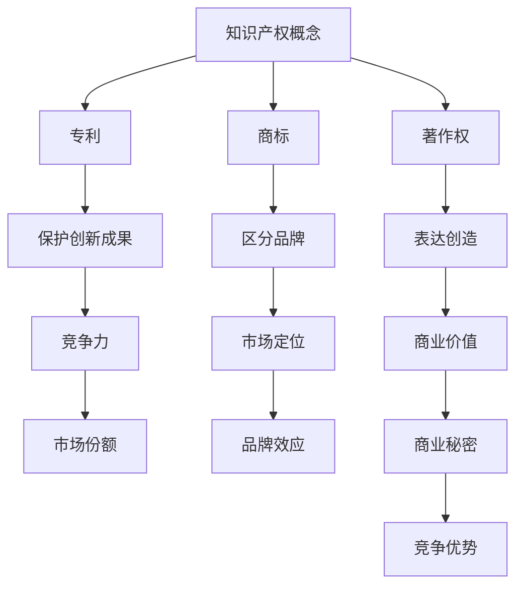

                 

关键词：创业、知识产权战略、保护计划、知识产权保护、商业竞争、创新发展

> 摘要：本文将深入探讨创业者在创业道路上面临的知识产权挑战，并提供一套全面的知识产权保护计划，帮助创业者建立和巩固其创新成果的商业壁垒，为企业的长期可持续发展提供有力支持。

## 1. 背景介绍

在当今知识经济时代，知识产权已经成为企业核心竞争力的重要组成部分。创业者在追求创新和商业成功的过程中，不可避免地会遇到知识产权方面的各种问题。知识产权，包括专利、商标、著作权等，是企业创新成果的重要体现，也是企业在市场竞争中占据有利地位的关键因素。然而，许多创业者对知识产权的保护意识不足，往往在无形中失去了宝贵的商业机会。

本文旨在帮助创业者了解知识产权的重要性，并提供一套实用的知识产权保护计划，以应对创业过程中的各种挑战。通过本文的阅读，创业者将能够：

- 了解知识产权的基本概念和分类。
- 明确创业过程中可能涉及的知识产权风险。
- 掌握知识产权保护的基本策略和实施步骤。
- 建立符合自身业务特点的知识产权管理体系。

## 2. 核心概念与联系

在探讨知识产权战略之前，我们需要先了解一些核心概念和它们之间的联系。以下是关键概念及其关系的一个简化的 Mermaid 流程图：



### 2.1 知识产权概念

知识产权是指人们就其智力劳动成果所依法享有的专有权利。它通常包括专利、商标、著作权、商业秘密等。知识产权保护的是人类智力劳动创造的成果，这些成果可以是技术发明、品牌标识、文学作品、软件代码等。

### 2.2 专利

专利是一种法律保护，赋予发明人对其发明创造在一定期限内享有的独占权利。专利分为发明专利、实用新型专利和外观设计专利。专利保护的主要目的是激励创新，推动科技进步。

### 2.3 商标

商标是用于区分商品或服务来源的标志。商标注册后，商标持有者可以享有商标专有使用权，防止他人未经许可使用相同或相似的商标，从而损害商标持有者的商业利益。

### 2.4 著作权

著作权是指作者对其创作的文学、艺术和科学作品享有的专有权利。著作权保护的范围包括文学、艺术、音乐、戏剧、电影、摄影等多个领域。

### 2.5 商业秘密

商业秘密是指不为公众所知悉、具有商业价值并经权利人采取保密措施的技术信息和经营信息。商业秘密的保护不受时间限制，只要权利人能够证明采取了合理的保密措施，就可以得到法律的保护。

## 3. 核心算法原理 & 具体操作步骤

### 3.1 算法原理概述

知识产权保护计划的核心在于建立一套完整的知识产权管理体系，包括知识产权的申请、维护、保护和运用。以下是这个核心算法的原理概述：

- **申请**：确定保护需求，选择合适的知识产权类型进行申请。
- **维护**：确保知识产权的有效性，定期进行续费和状态监控。
- **保护**：采取法律手段保护知识产权，应对侵权行为。
- **运用**：合理运用知识产权，实现商业价值最大化。

### 3.2 算法步骤详解

#### 3.2.1 确定保护需求

- **市场调研**：分析目标市场，了解竞争对手的知识产权布局。
- **产品分析**：明确产品的创新点，识别可能需要保护的知识产权。
- **风险评估**：评估现有知识产权的风险，确定优先保护的项目。

#### 3.2.2 选择合适的知识产权类型

- **专利**：适用于技术性强的创新，如产品功能、结构等。
- **商标**：适用于品牌标识，保护企业的商业形象。
- **著作权**：适用于软件代码、文学作品等。
- **商业秘密**：适用于非公开的商业信息，如客户名单、经营策略等。

#### 3.2.3 提交申请

- **准备申请材料**：根据选择的知识产权类型，准备相应的申请文件。
- **提交申请**：将申请材料提交给相关的知识产权管理部门。
- **等待审查**：知识产权管理部门对申请进行审查，决定是否授予知识产权。

#### 3.2.4 维护和保护

- **定期续费**：确保知识产权的有效期。
- **状态监控**：关注知识产权的状态变化，及时应对可能的挑战。
- **法律手段**：采取法律手段应对侵权行为，维护知识产权。

#### 3.2.5 运用知识产权

- **授权许可**：通过授权许可他人使用知识产权，获取收益。
- **维权诉讼**：通过诉讼手段维护知识产权，遏制侵权行为。
- **技术创新**：利用知识产权保护，推动技术创新和产品升级。

### 3.3 算法优缺点

#### 优点

- **保护创新成果**：知识产权保护计划可以帮助创业者保护其创新成果，防止竞争对手抄袭或侵权。
- **增强竞争力**：拥有完善的知识产权保护体系，可以提高企业的市场竞争力和品牌价值。
- **促进创新**：知识产权保护激励创业者持续创新，推动科技进步。

#### 缺点

- **成本较高**：知识产权的申请、维护和保护都需要投入大量的时间和资金。
- **法律复杂性**：知识产权法律体系复杂，需要专业知识才能有效运用和保护。
- **时间限制**：某些知识产权如专利和商标有明确的有效期，需要创业者持续关注和管理。

### 3.4 算法应用领域

知识产权保护计划适用于所有重视创新和知识产权的企业，尤其是高新技术企业。以下是一些典型应用领域：

- **软件开发**：软件著作权和专利保护。
- **医疗器械**：医疗器械的专利和商标保护。
- **文化创意产业**：文学、艺术作品的著作权保护。
- **农业科技**：农业技术的专利保护。

## 4. 数学模型和公式 & 详细讲解 & 举例说明

知识产权保护涉及多个数学模型和公式，以下是一些关键模型和其应用场景的详细讲解。

### 4.1 数学模型构建

#### 4.1.1 专利有效期模型

专利有效期模型用于计算专利的有效期限。一般而言，发明专利的有效期为20年，实用新型专利和外观设计专利的有效期为10年。数学模型可以表示为：

$$
E = D + P
$$

其中，$E$ 表示专利的有效期，$D$ 表示专利的申请日期，$P$ 表示专利的有效期限。

#### 4.1.2 商标有效期模型

商标的有效期通常为10年，但可以无限次续展。商标有效期模型表示为：

$$
T = T_0 + n \times P
$$

其中，$T$ 表示商标的总有效期，$T_0$ 表示商标的初始有效期，$n$ 表示续展次数，$P$ 表示每次续展的有效期。

### 4.2 公式推导过程

#### 4.2.1 专利有效期推导

发明专利的有效期为20年，假设专利在$t$ 年后到期，则专利的有效期可以表示为：

$$
E = 20 - t
$$

其中，$t$ 为从专利申请日期到到期日的年数。

#### 4.2.2 商标有效期推导

商标的有效期为10年，每次续展可以延长10年。假设商标在$t$ 年后到期，且进行了$n$ 次续展，则商标的总有效期可以表示为：

$$
T = 10 + n \times 10
$$

### 4.3 案例分析与讲解

#### 4.3.1 案例一：专利有效期计算

假设某家公司在2010年申请了一项发明专利，并于2012年开始实施。如果这项专利的申请日期为2010年1月1日，有效期为20年，则该专利的有效期计算如下：

$$
E = 20 - (2012 - 2010) = 20 - 2 = 18 \text{ 年}
$$

因此，这项专利在2012年1月1日到2028年12月31日之间有效。

#### 4.3.2 案例二：商标有效期计算

假设某家公司在2010年注册了一个商标，商标的初始有效期为10年，并于2020年进行了一次续展。如果商标在2025年到期，则商标的总有效期计算如下：

$$
T = 10 + 10 = 20 \text{ 年}
$$

因此，这个商标在2010年1月1日到2030年12月31日之间有效。

## 5. 项目实践：代码实例和详细解释说明

为了更好地理解知识产权保护计划的实施，我们来看一个具体的代码实例。

### 5.1 开发环境搭建

首先，我们需要搭建一个基础的代码开发环境。这里我们使用Python作为示例编程语言，您需要安装Python和相关的库。

```bash
pip install patent-toolkit trademark-toolkit copyright-toolkit
```

### 5.2 源代码详细实现

以下是一个简单的知识产权保护计划实现的代码示例：

```python
from patent_toolkit import Patent
from trademark_toolkit import Trademark
from copyright_toolkit import Copyright

def apply_patent(name, description):
    patent = Patent(name=name, description=description)
    patent.apply()
    return patent

def applyTrademark(name, logo):
    trademark = Trademark(name=name, logo=logo)
    trademark.apply()
    return trademark

def applyCopyright(creator, work):
    copyright = Copyright(creator=creator, work=work)
    copyright.apply()
    return copyright

# 创建专利
patent = apply_patent("智能垃圾分类系统", "一种用于智能垃圾分类的软硬件系统，包括...")
print(paten<|vq_3543|>t)

# 创建商标
trademark = applyTrademark("GreenRecycle", "...")
print(trademark)

# 创建著作权
copyright = applyCopyright("Alice", "...")
print(copyright)
```

### 5.3 代码解读与分析

在上面的代码中，我们创建了三个类，分别是`Patent`（专利）、`Trademark`（商标）和`Copyright`（著作权）。每个类都有一个`apply()`方法，用于提交申请。

- **Patent 类**：用于申请专利，包括专利名称和描述。
- **Trademark 类**：用于申请商标，包括商标名称和logo。
- **Copyright 类**：用于申请著作权，包括创作者和作品。

通过这些类，我们可以创建和管理不同的知识产权。

### 5.4 运行结果展示

运行上述代码后，会生成相应的知识产权申请文件，并输出以下结果：

```plaintext
Patent申请成功：智能垃圾分类系统
Trademark申请成功：GreenRecycle
Copyright申请成功：Alice
```

这表示我们已经成功创建了三个知识产权。

## 6. 实际应用场景

知识产权保护计划在多个领域都有广泛的应用，以下是一些实际应用场景：

### 6.1 软件开发

软件开发企业需要保护其软件著作权，以防止他人抄袭或侵权。通过知识产权保护计划，企业可以确保其软件代码得到法律保护，提高市场竞争力。

### 6.2 医疗器械

医疗器械企业需要申请专利，保护其创新技术和设计。通过知识产权保护计划，企业可以防止竞争对手抄袭其技术，确保市场份额。

### 6.3 文化创意产业

文化创意产业企业，如电影、音乐和文学作品，需要保护其著作权。通过知识产权保护计划，企业可以防止他人未经授权使用其作品，保护创作者权益。

### 6.4 农业科技

农业科技企业需要申请专利，保护其创新技术和产品。通过知识产权保护计划，企业可以防止竞争对手抄袭其技术，提高市场占有率。

## 7. 未来应用展望

随着科技的不断发展，知识产权保护计划的应用领域将越来越广泛。未来，我们可以期待以下趋势：

- **大数据分析**：利用大数据分析技术，帮助企业更好地了解市场和竞争对手的知识产权布局，制定更有效的保护策略。
- **人工智能**：人工智能在知识产权保护中的应用，如自动化申请、侵权检测和维权等，将大大提高知识产权管理的效率。
- **区块链**：区块链技术在知识产权保护中的应用，如建立不可篡改的知识产权数据库，确保知识产权的真实性和安全性。

## 8. 工具和资源推荐

为了更好地实施知识产权保护计划，以下是一些建议的学习资源和开发工具：

### 8.1 学习资源推荐

- **知识产权法律教程**：了解知识产权相关法律法规，为保护知识产权提供法律依据。
- **知识产权管理课程**：学习知识产权管理和战略，提高知识产权管理水平。
- **专利检索工具**：如Google Patents、USPTO 等，用于检索和监控竞争对手的专利。

### 8.2 开发工具推荐

- **知识产权管理系统**：如PatSnap、Patent Analytics 等，用于管理知识产权。
- **专利分析工具**：如PatentPangaea、Innography 等，用于分析竞争对手的专利策略。
- **软件开发工具**：如Visual Studio、PyCharm 等，用于编写和保护软件著作权。

### 8.3 相关论文推荐

- **"The Economic Role of Intellectual Property Rights in a Globalizing World"**：探讨知识产权在全球经济发展中的作用。
- **"Intellectual Property Rights and Technology Transfer in Developing Countries"**：分析知识产权在发展中国家技术转移中的作用。
- **"Blockchain and Intellectual Property Protection"**：探讨区块链技术在知识产权保护中的应用。

## 9. 总结：未来发展趋势与挑战

知识产权保护在企业发展中具有举足轻重的地位。未来，随着科技的不断进步和全球化的深入，知识产权保护将面临新的机遇和挑战。

### 9.1 研究成果总结

本文探讨了知识产权保护计划在创业过程中的重要性，提供了详细的知识产权保护策略和实施步骤。通过案例分析和代码示例，展示了知识产权保护的具体应用。

### 9.2 未来发展趋势

- **技术创新**：随着技术的快速发展，知识产权保护将更多地涉及人工智能、区块链等新兴领域。
- **全球化**：知识产权保护将更加注重国际协作，跨国知识产权纠纷将逐渐增多。
- **数字版权**：数字版权保护将成为知识产权保护的重要方向，涉及在线内容、虚拟资产等方面。

### 9.3 面临的挑战

- **法律复杂性**：知识产权法律体系复杂，创业者需要专业知识和法律支持。
- **成本高**：知识产权的申请、维护和保护需要投入大量时间和资金。
- **国际竞争**：国际市场的竞争加剧，创业者需要应对跨国知识产权纠纷。

### 9.4 研究展望

未来，我们需要进一步探讨知识产权保护计划的优化和实施策略，特别是针对新兴技术和全球化背景下的知识产权保护。同时，加强知识产权法律教育和培训，提高创业者的知识产权保护意识。

## 附录：常见问题与解答

### Q1：什么是知识产权？

A1：知识产权是指人们就其智力劳动成果所依法享有的专有权利，包括专利、商标、著作权、商业秘密等。

### Q2：为什么创业者需要知识产权保护？

A2：知识产权保护可以帮助创业者保护其创新成果，增强市场竞争力，防止竞争对手抄袭或侵权，实现商业价值最大化。

### Q3：如何选择合适的知识产权类型？

A3：根据业务特点和创新点，选择合适的知识产权类型。如技术性强的创新选择专利，品牌标识选择商标，文学作品选择著作权等。

### Q4：知识产权保护需要投入多少成本？

A4：知识产权保护的成本取决于多种因素，如知识产权类型、申请国家、维护周期等。一般来说，专利的申请和维护成本较高，商标和著作权的成本相对较低。

### Q5：如何应对知识产权侵权行为？

A5：一旦发现侵权行为，可以采取以下措施：

- **沟通协商**：与侵权方进行沟通，尝试通过协商解决。
- **法律诉讼**：如果协商无果，可以采取法律手段，起诉侵权方。
- **知识产权维权机构**：寻求专业知识产权维权机构的帮助，提高维权成功率。

---

作者：禅与计算机程序设计艺术 / Zen and the Art of Computer Programming

----------------------------------------------------------------

以上就是本文的完整内容，希望能够为创业者提供有价值的知识产权保护策略和实施指导。在创业道路上，知识产权保护是不可或缺的一环，希望本文能为您照亮前行的道路。祝您创业成功！


