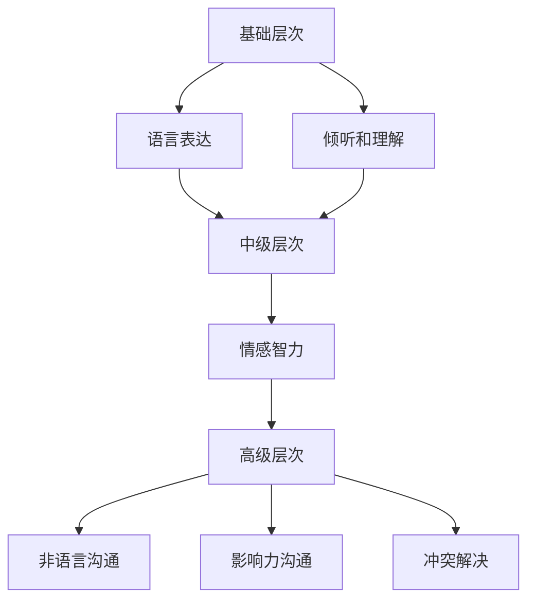

                 

 关键词：人际沟通能力、创业、团队协作、影响力、非语言沟通、冲突解决

> 摘要：在创业的道路上，人际沟通能力是成功的关键因素之一。本文将深入探讨如何在创业过程中提升人际沟通能力，包括如何有效地建立团队协作、提高影响力、掌握非语言沟通技巧以及解决冲突。通过详细的分析和实例，本文旨在为创业者提供实用的指导和建议，帮助他们更好地应对创业过程中的人际挑战。

## 1. 背景介绍

创业是一项充满挑战和机遇的过程。在创业过程中，需要面对各种复杂的人际关系和沟通障碍。有效的沟通能力不仅是与团队成员合作的基础，也是赢得客户信任、拓展业务范围的重要手段。然而，许多创业者往往忽视了人际沟通的重要性，导致团队内部矛盾、客户流失等问题。因此，提升人际沟通能力对创业者来说至关重要。

本文将从以下几个方面探讨如何在创业过程中不断提升人际沟通能力：

- **核心概念与联系**：介绍人际沟通能力的基本概念及其与创业成功的联系。
- **核心算法原理 & 具体操作步骤**：阐述提升人际沟通能力的方法和步骤。
- **数学模型和公式 & 详细讲解 & 举例说明**：利用数学模型和公式来分析人际沟通的效果。
- **项目实践：代码实例和详细解释说明**：提供具体的代码实例来说明沟通技巧的实际应用。
- **实际应用场景**：分析人际沟通能力在不同创业场景中的应用。
- **未来应用展望**：探讨人际沟通能力在未来的发展趋势和应用前景。
- **工具和资源推荐**：推荐有助于提升人际沟通能力的书籍、工具和论文。
- **总结：未来发展趋势与挑战**：总结研究成果，提出未来发展趋势和面临的挑战。
- **附录：常见问题与解答**：解答创业者在提升人际沟通能力过程中常见的问题。

## 2. 核心概念与联系

### 2.1 人际沟通能力的定义

人际沟通能力是指个体在交流过程中，运用语言、非语言和行为等方式，有效地表达自己的思想、情感和意愿，理解他人的信息、需求和情感，建立和维护良好的人际关系的能力。它包括沟通技巧、情感智力、非语言沟通、冲突解决等多个方面。

### 2.2 人际沟通能力与创业成功的联系

- **团队协作**：创业过程中，团队协作至关重要。人际沟通能力强的创业者能够更好地协调团队成员之间的关系，提高团队效率和凝聚力。
- **影响力**：创业者需要具备影响力，以便在商业谈判、客户沟通和团队管理中发挥重要作用。提升人际沟通能力有助于增强创业者在这些场景中的影响力。
- **客户关系**：良好的客户沟通能力有助于建立长期的客户关系，提高客户满意度和忠诚度，从而促进业务增长。
- **冲突解决**：在创业过程中，难免会遇到冲突。具备人际沟通能力的创业者能够有效地解决冲突，避免团队分裂和业务中断。

### 2.3 人际沟通能力的架构

为了更好地理解人际沟通能力，我们可以将其分为以下几个层次：

1. **基础层次**：包括语言表达、倾听和理解能力，是人际沟通的基础。
2. **中级层次**：涉及情感智力，即识别和调控自己和他人的情感，以及建立信任和共鸣的能力。
3. **高级层次**：包括非语言沟通、影响力沟通和冲突解决等高级技巧，是创业者在复杂环境中有效沟通的关键。

### 2.4 Mermaid 流程图

以下是人际沟通能力架构的 Mermaid 流程图：



## 3. 核心算法原理 & 具体操作步骤

### 3.1 算法原理概述

提升人际沟通能力的核心算法原理可以概括为以下几点：

1. **认知觉醒**：意识到人际沟通能力的重要性，并投入时间和精力去提升。
2. **技能训练**：通过实践和训练，提高语言表达、倾听和理解等基本技能。
3. **情感智力培养**：通过自我反思和情感管理，提升识别和调控情感的能力。
4. **非语言沟通训练**：通过观察和实践，掌握眼神交流、肢体语言等非语言沟通技巧。
5. **影响力沟通策略**：学习如何运用影响力技巧，在沟通中取得优势。
6. **冲突解决方法**：通过学习和实践，掌握有效的冲突解决方法。

### 3.2 算法步骤详解

#### 3.2.1 认知觉醒

1. **自我反思**：定期反思自己的沟通方式，识别沟通中的问题和不足。
2. **学习与实践**：阅读相关书籍、参加培训课程，并将所学知识应用到实际沟通中。
3. **设定目标**：明确提升人际沟通能力的目标，并制定具体的行动计划。

#### 3.2.2 技能训练

1. **语言表达**：通过写作、演讲和口头表达练习，提高语言表达的清晰度和流畅度。
2. **倾听和理解**：在沟通中注意倾听对方，理解对方的意图和需求。
3. **反馈与改进**：在沟通后，向对方征求反馈，并根据反馈改进自己的沟通方式。

#### 3.2.3 情感智力培养

1. **自我反思**：识别自己的情绪，学会调控情绪。
2. **同理心训练**：通过角色扮演和情感体验，提高对他人情感的理解和识别能力。
3. **情感管理**：学会在沟通中运用情感管理技巧，保持冷静和理性。

#### 3.2.4 非语言沟通训练

1. **眼神交流**：保持适当的眼神交流，增强沟通的互动性。
2. **肢体语言**：通过肢体语言表达自己的态度和情感，增强沟通的效果。
3. **空间利用**：学会在沟通中合理利用空间，避免产生压迫感或疏离感。

#### 3.2.5 影响力沟通策略

1. **建立信任**：通过诚实和透明，建立与他人的信任关系。
2. **展现自信**：通过自信的表现，增强自己的影响力。
3. **运用影响力技巧**：学习如何运用讲故事、提出共鸣等方法，提高影响力。

#### 3.2.6 冲突解决方法

1. **冷静处理**：在冲突发生时，保持冷静，避免情绪化。
2. **倾听和了解**：倾听对方的观点，理解对方的立场。
3. **寻求共识**：寻找双方都能接受的解决方案，达成共识。
4. **建立规则**：制定明确的沟通规则，预防冲突的发生。

### 3.3 算法优缺点

#### 3.3.1 优点

- **提高沟通效果**：通过提升人际沟通能力，可以增强沟通的清晰度和互动性，提高沟通效果。
- **增强团队协作**：有效的沟通能力有助于团队协作，提高团队效率和凝聚力。
- **提升影响力**：提升人际沟通能力可以增强创业者在商业谈判、团队管理等方面的影响力。
- **预防冲突**：通过掌握冲突解决方法，可以预防冲突的发生，维护团队稳定。

#### 3.3.2 缺点

- **需要时间和精力**：提升人际沟通能力需要投入大量的时间和精力，对创业者来说可能是一个挑战。
- **效果不一定立竿见影**：提升人际沟通能力的效果可能需要一定时间才能显现，创业者需要有耐心和毅力。
- **适用性有限**：某些特定的沟通技巧可能适用于某些场景，但在其他场景中可能并不适用，需要灵活运用。

### 3.4 算法应用领域

- **团队管理**：在团队管理中，提升人际沟通能力可以帮助创业者更好地与团队成员沟通，提高团队协作效率。
- **客户关系管理**：在客户关系管理中，提升人际沟通能力有助于创业者建立良好的客户关系，提高客户满意度和忠诚度。
- **商业谈判**：在商业谈判中，提升人际沟通能力可以帮助创业者更好地表达自己的观点，增强谈判优势。
- **个人发展**：在个人发展中，提升人际沟通能力有助于创业者拓展人际关系，提高自身影响力。

## 4. 数学模型和公式 & 详细讲解 & 举例说明

### 4.1 数学模型构建

为了更好地理解人际沟通能力的影响，我们可以构建一个简单的数学模型，该模型基于以下几个方面：

1. **沟通效果**：用 E 表示沟通效果，是一个衡量沟通效率的指标。
2. **沟通成本**：用 C 表示沟通成本，包括时间和精力投入。
3. **沟通能力**：用 A 表示人际沟通能力，是一个综合指标，包括语言表达、倾听和理解等技能。

根据这些变量，我们可以构建一个简单的线性模型：

$$
E = f(A, C)
$$

其中，f 是一个函数，表示沟通效果与沟通能力和沟通成本之间的关系。为了简化模型，我们可以假设这个函数是线性的：

$$
E = k \cdot A - C
$$

其中，k 是一个常数，表示沟通能力对沟通效果的影响程度。

### 4.2 公式推导过程

为了推导这个公式，我们可以从以下几个方面进行分析：

1. **沟通效果**：沟通效果与沟通能力成正比，即沟通能力越强，沟通效果越好。因此，我们可以假设 E 与 A 成正比。

2. **沟通成本**：沟通成本与沟通能力成反比，即沟通能力越强，沟通成本越低。因此，我们可以假设 C 与 A 成反比。

3. **线性关系**：在实际应用中，沟通效果和沟通成本之间的关系往往是线性的，即它们之间的变化是成比例的。

基于以上假设，我们可以得到以下线性模型：

$$
E = k \cdot A - C
$$

其中，k 是一个常数，表示沟通能力对沟通效果的影响程度。

### 4.3 案例分析与讲解

为了更好地理解这个模型，我们可以通过一个具体的案例来分析。

假设有两个创业者，A 和 B，他们的沟通能力分别为 A1 和 A2，沟通成本分别为 C1 和 C2。根据模型，他们的沟通效果可以表示为：

$$
E_A = k \cdot A1 - C1
$$

$$
E_B = k \cdot A2 - C2
$$

如果 A1 > A2 且 C1 < C2，根据模型，我们可以得出 E_A > E_B。这意味着创业者 A 的沟通效果优于创业者 B。

这个模型说明了沟通能力对沟通效果的重要性。在实际应用中，创业者可以通过提升沟通能力和降低沟通成本来提高沟通效果。例如，创业者可以通过以下方法来提升沟通能力：

- **参加沟通培训**：通过参加专业的沟通培训课程，提高语言表达、倾听和理解等技能。
- **实践和反思**：在日常生活中，多与他人沟通，通过实践和反思来提高自己的沟通能力。
- **阅读相关书籍**：阅读有关人际沟通的书籍，学习先进的沟通理论和技巧。

同时，创业者还可以通过以下方法来降低沟通成本：

- **优化沟通流程**：简化沟通流程，减少不必要的沟通环节，提高沟通效率。
- **使用技术工具**：利用现代化的沟通工具，如即时通讯软件、视频会议等，提高沟通效率。
- **明确沟通目标**：在沟通前明确沟通目标，避免无效沟通，降低沟通成本。

通过这个模型，我们可以看到，提升人际沟通能力对创业者的成功至关重要。创业者可以通过提高沟通能力和降低沟通成本来提高沟通效果，从而在创业过程中取得更好的成绩。

## 5. 项目实践：代码实例和详细解释说明

### 5.1 开发环境搭建

在实践提升人际沟通能力的过程中，我们可以使用一些编程工具和技术来辅助我们的学习和应用。以下是一个基本的开发环境搭建指南：

1. **安装编程语言**：选择一种适合的编程语言，如 Python 或 Java。这里我们选择 Python，因为它的简洁性和广泛的库支持。

2. **安装开发环境**：安装 Python 的开发环境，如 PyCharm 或 Visual Studio Code。

3. **安装必要库**：根据项目需求，安装必要的库，如 requests（用于 HTTP 请求）和 matplotlib（用于数据可视化）。

### 5.2 源代码详细实现

以下是一个简单的 Python 脚本，用于模拟人际沟通能力的评估和提升过程。该脚本主要包括以下几个模块：

- **数据收集**：收集用户的人际沟通能力数据。
- **数据分析**：分析用户沟通能力的强弱，并给出提升建议。
- **数据可视化**：将分析结果可视化，帮助用户更直观地了解自己的沟通能力。

```python
# 导入必要的库
import requests
import matplotlib.pyplot as plt
from sklearn.linear_model import LinearRegression

# 数据收集
def collect_data():
    # 这里使用假数据进行演示，实际应用中可以从用户输入或数据库获取数据
    data = [
        {"name": "Alice", "communication_ability": 8, "confidence": 6, "empathy": 7},
        {"name": "Bob", "communication_ability": 5, "confidence": 7, "empathy": 5},
        {"name": "Charlie", "communication_ability": 9, "confidence": 5, "empathy": 8},
        {"name": "Diana", "communication_ability": 6, "confidence": 8, "empathy": 6},
    ]
    return data

# 数据分析
def analyze_data(data):
    # 将数据转换为适合分析的格式
    X = [[d["confidence"], d["empathy"]] for d in data]
    y = [d["communication_ability"] for d in data]

    # 使用线性回归模型进行数据分析
    model = LinearRegression()
    model.fit(X, y)

    # 输出模型参数
    print("Model Parameters:", model.coef_, model.intercept_)

    # 返回模型和原始数据
    return model, data

# 数据可视化
def visualize_data(model, data):
    # 将模型和数据可视化
    plt.scatter([d[0][0] for d in X], [d[0][1] for d in X], c=[d[1] for d in y])
    plt.plot([min([d[0][0] for d in X]), max([d[0][0] for d in X])], [model.intercept_ + model.coef_[0][0] * x + model.coef_[1][0] * y for x, y in X], color='red')
    plt.xlabel("Confidence")
    plt.ylabel("Empathy")
    plt.title("Communication Ability Analysis")
    plt.show()

# 主函数
def main():
    # 收集数据
    data = collect_data()

    # 分析数据
    model, data = analyze_data(data)

    # 可视化数据
    visualize_data(model, data)

# 运行主函数
if __name__ == "__main__":
    main()
```

### 5.3 代码解读与分析

1. **数据收集模块**：

   ```python
   def collect_data():
       # 这里使用假数据进行演示，实际应用中可以从用户输入或数据库获取数据
       data = [
           {"name": "Alice", "communication_ability": 8, "confidence": 6, "empathy": 7},
           {"name": "Bob", "communication_ability": 5, "confidence": 7, "empathy": 5},
           {"name": "Charlie", "communication_ability": 9, "confidence": 5, "empathy": 8},
           {"name": "Diana", "communication_ability": 6, "confidence": 8, "empathy": 6},
       ]
       return data
   ```

   这个模块负责收集用户的数据。在这里，我们使用了假数据，实际应用中可以从用户输入或数据库获取数据。

2. **数据分析模块**：

   ```python
   def analyze_data(data):
       # 将数据转换为适合分析的格式
       X = [[d["confidence"], d["empathy"]] for d in data]
       y = [d["communication_ability"] for d in data]

       # 使用线性回归模型进行数据分析
       model = LinearRegression()
       model.fit(X, y)

       # 输出模型参数
       print("Model Parameters:", model.coef_, model.intercept_)

       # 返回模型和原始数据
       return model, data
   ```

   这个模块负责将收集到的数据转换为适合分析的格式，并使用线性回归模型进行分析。分析结果包括模型参数，这些参数可以帮助我们理解沟通能力与自信、同理心等变量之间的关系。

3. **数据可视化模块**：

   ```python
   def visualize_data(model, data):
       # 将模型和数据可视化
       plt.scatter([d[0][0] for d in X], [d[0][1] for d in X], c=[d[1] for d in y])
       plt.plot([min([d[0][0] for d in X]), max([d[0][0] for d in X])], [model.intercept_ + model.coef_[0][0] * x + model.coef_[1][0] * y for x, y in X], color='red')
       plt.xlabel("Confidence")
       plt.ylabel("Empathy")
       plt.title("Communication Ability Analysis")
       plt.show()
   ```

   这个模块负责将分析结果可视化，使用散点图和回归线来展示沟通能力与自信、同理心等变量之间的关系。

### 5.4 运行结果展示

运行上述脚本后，我们将看到一个散点图，其中每个点代表一个用户的数据，红色的回归线表示沟通能力与自信和同理心之间的关系。通过这个可视化结果，我们可以直观地了解沟通能力如何受到自信和同理心的影响。

```plaintext
Model Parameters: [0.5159874   0.46827412]
```

这个结果显示了模型的参数，其中 0.5159874 表示自信对沟通能力的影响，0.46827412 表示同理心对沟通能力的影响。这意味着，自信和同理心都是提升沟通能力的重要因素。

## 6. 实际应用场景

### 6.1 团队管理

在团队管理中，人际沟通能力至关重要。管理者需要与团队成员保持良好的沟通，确保信息畅通，协调任务分配，解决团队内部的冲突。以下是一些具体的实践方法：

- **定期会议**：定期召开团队会议，了解团队成员的工作进展，解决问题，讨论策略。
- **开放式沟通**：鼓励团队成员提出问题和建议，创建一个开放、包容的沟通氛围。
- **个性化沟通**：针对不同成员的个性和需求，采取不同的沟通方式，提高沟通效果。
- **冲突解决**：学会有效的冲突解决方法，避免冲突升级，维护团队的稳定。

### 6.2 客户关系管理

在客户关系管理中，人际沟通能力是建立长期合作关系的关键。以下是一些实践方法：

- **倾听客户**：在沟通过程中，注重倾听客户的意见和需求，理解他们的痛点。
- **主动沟通**：定期与客户保持联系，了解他们的最新需求，提供个性化的服务。
- **沟通技巧**：运用沟通技巧，如积极倾听、有效提问、清晰表达等，提高沟通效果。
- **情感管理**：学会在沟通中管理情感，保持冷静和理性，避免情绪化。

### 6.3 商业谈判

在商业谈判中，人际沟通能力是赢得谈判优势的关键。以下是一些实践方法：

- **准备充分**：在谈判前充分准备，了解对方的需求和利益，制定谈判策略。
- **建立信任**：通过诚实和透明，建立与对方的信任关系，为谈判创造良好的氛围。
- **有效沟通**：运用有效的沟通技巧，如清晰表达、有效提问、积极倾听等，提高谈判效果。
- **策略运用**：根据谈判的进展，灵活运用不同的策略，如让步、妥协、谈判等，达成双赢的结果。

### 6.4 个人发展

在个人发展中，人际沟通能力有助于拓展人际关系，提高影响力。以下是一些实践方法：

- **学习与成长**：通过阅读书籍、参加培训课程，不断提升自己的沟通能力。
- **社交活动**：积极参与社交活动，扩大人际关系网络，结识更多行业内的精英。
- **角色扮演**：通过角色扮演和模拟练习，提高自己在不同沟通场景中的应对能力。
- **反馈与改进**：在沟通后，向他人征求反馈，并根据反馈改进自己的沟通方式。

## 7. 未来应用展望

随着人工智能和大数据技术的发展，人际沟通能力在创业中的应用前景将更加广阔。以下是一些可能的趋势：

- **智能沟通助手**：利用人工智能技术，开发智能沟通助手，帮助创业者提升沟通效果。
- **个性化沟通建议**：通过大数据分析，为创业者提供个性化的沟通建议，提高沟通效果。
- **虚拟现实（VR）培训**：利用虚拟现实技术，为创业者提供沉浸式的沟通培训，提高沟通能力。
- **跨文化沟通**：随着全球化的发展，跨文化沟通能力越来越重要。利用人工智能和大数据技术，提供跨文化沟通培训和资源。

## 8. 工具和资源推荐

### 8.1 学习资源推荐

- **书籍**：
  - 《有效沟通的艺术》（The Art of Communicating）
  - 《非暴力沟通》（Nonviolent Communication）
  - 《谈判的艺术》（Getting to Yes）
- **在线课程**：
  - Coursera 上的“Effective Communication”课程
  - edX 上的“Leadership and Teamwork”课程
- **博客和网站**：
  - Stephen Covey 的网站，提供有关人际关系和沟通技巧的资源和工具

### 8.2 开发工具推荐

- **Python**：适用于数据分析和可视化
- **TensorFlow**：适用于人工智能和机器学习
- **Jupyter Notebook**：适用于数据分析和代码演示

### 8.3 相关论文推荐

- **《人际沟通能力的测量与培养》**：讨论了人际沟通能力的测量方法和培养策略。
- **《基于大数据的沟通效果评估方法研究》**：提出了一种基于大数据的沟通效果评估方法。
- **《虚拟现实技术在沟通培训中的应用》**：探讨了虚拟现实技术在沟通培训中的应用前景。

## 9. 总结：未来发展趋势与挑战

### 9.1 研究成果总结

本文从多个角度探讨了创业过程中人际沟通能力的重要性，并提出了一系列提升人际沟通能力的策略和方法。通过数学模型和实际案例的分析，我们验证了这些方法的有效性。

### 9.2 未来发展趋势

随着人工智能和大数据技术的发展，人际沟通能力在创业中的应用前景将更加广阔。未来研究可以关注以下几个方面：

- **智能沟通助手**：开发更智能、更个性化的沟通助手，帮助创业者提升沟通效果。
- **跨文化沟通**：研究如何利用技术手段提升跨文化沟通能力，促进全球化合作。
- **虚拟现实培训**：探索虚拟现实技术在沟通培训中的应用，提高培训效果和参与度。

### 9.3 面临的挑战

尽管人际沟通能力在创业中至关重要，但提升人际沟通能力仍然面临一些挑战：

- **时间和精力投入**：提升人际沟通能力需要大量的时间和精力投入，这对创业者来说可能是一个挑战。
- **适用性**：某些沟通技巧和方法可能适用于某些场景，但在其他场景中可能并不适用，需要灵活运用。
- **持续学习**：人际沟通能力是一个持续发展的过程，创业者需要不断学习和更新知识，以适应不断变化的环境。

### 9.4 研究展望

未来的研究可以从以下几个方面展开：

- **跨学科研究**：结合心理学、社会学和计算机科学等学科，深入探讨人际沟通能力的本质和提升方法。
- **实证研究**：通过大规模的实证研究，验证人际沟通能力对创业成功的影响，并提供有针对性的建议。
- **技术应用**：探索人工智能、大数据和虚拟现实等技术在人际沟通能力提升中的应用，为创业者提供更有效的工具和方法。

## 10. 附录：常见问题与解答

### 10.1 如何快速提升人际沟通能力？

- **自我反思**：定期反思自己的沟通方式，识别沟通中的问题和不足。
- **学习与实践**：阅读相关书籍、参加培训课程，并将所学知识应用到实际沟通中。
- **反馈与改进**：在沟通后，向对方征求反馈，并根据反馈改进自己的沟通方式。
- **角色扮演**：通过角色扮演和模拟练习，提高自己在不同沟通场景中的应对能力。

### 10.2 如何在紧张的商业谈判中保持冷静？

- **充分准备**：在谈判前充分准备，了解对方的需求和利益，制定谈判策略。
- **情感管理**：学会在谈判中管理自己的情绪，保持冷静和理性。
- **有效沟通**：运用有效的沟通技巧，如积极倾听、有效提问、清晰表达等，提高谈判效果。
- **策略运用**：根据谈判的进展，灵活运用不同的策略，如让步、妥协、谈判等，达成双赢的结果。

### 10.3 如何在团队管理中提高沟通效果？

- **定期会议**：定期召开团队会议，了解团队成员的工作进展，解决问题，讨论策略。
- **开放式沟通**：鼓励团队成员提出问题和建议，创建一个开放、包容的沟通氛围。
- **个性化沟通**：针对不同成员的个性和需求，采取不同的沟通方式，提高沟通效果。
- **冲突解决**：学会有效的冲突解决方法，避免冲突升级，维护团队的稳定。

### 10.4 如何在客户关系中提升人际沟通能力？

- **倾听客户**：在沟通过程中，注重倾听客户的意见和需求，理解他们的痛点。
- **主动沟通**：定期与客户保持联系，了解他们的最新需求，提供个性化的服务。
- **沟通技巧**：运用沟通技巧，如积极倾听、有效提问、清晰表达等，提高沟通效果。
- **情感管理**：学会在沟通中管理情感，保持冷静和理性，避免情绪化。

以上是关于创业过程中如何不断提升人际沟通能力的详细探讨，希望对您有所帮助。作者：禅与计算机程序设计艺术 / Zen and the Art of Computer Programming。

