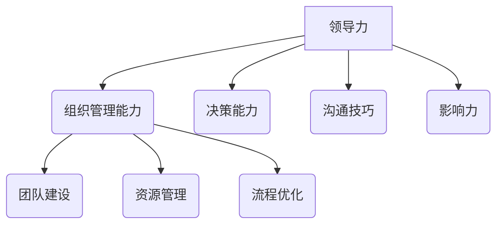

                 

关键词：创业、领导力、组织管理、成长、策略、实践

摘要：本文将探讨创业过程中领导力和组织管理能力的提升，从核心概念、实践方法到工具资源，全面阐述创业者在不同阶段如何有效提升自身领导力和组织管理能力，以应对快速变化的市场环境和业务挑战。

## 1. 背景介绍

创业是一个充满挑战与机遇的过程。在这个快速变化的时代，创业者不仅需要拥有创新思维和商业洞察力，更需要具备出色的领导力和组织管理能力。领导力是激发团队潜能、实现共同目标的关键，而组织管理能力则是确保团队高效运作、资源合理配置的基础。本文将围绕这两个核心主题，深入分析创业过程中如何不断提升领导力和组织管理能力。

### 1.1 创业的重要性

创业不仅是对个人能力的考验，也是对团队协作和社会价值的探索。成功的创业不仅能够创造经济价值，还能够推动社会进步和行业变革。在当前的全球化背景下，创业已成为推动经济增长、创新科技和社会发展的主要动力。

### 1.2 领导力和组织管理能力的作用

领导力是创业成功的核心要素之一。一个优秀的领导者能够激发团队成员的潜力，提升团队的凝聚力和执行力。组织管理能力则是确保团队在复杂环境中高效运作的关键。通过有效的组织管理，创业者能够合理配置资源，优化业务流程，提高组织的整体效能。

### 1.3 当前创业环境的挑战

当前创业环境充满挑战，竞争激烈、市场变化快、技术迭代周期短。创业者需要不断学习新知识、适应新环境，并具备快速应对变化的能力。在这种背景下，提升领导力和组织管理能力尤为重要。

## 2. 核心概念与联系

在探讨创业过程中如何提升领导力和组织管理能力之前，我们需要明确一些核心概念，并理解它们之间的联系。

### 2.1 领导力

领导力是指领导者通过影响力、愿景和策略来引导和激励团队成员实现共同目标的能力。领导力不仅包括个人魅力和领导风格，还涉及决策能力、沟通技巧和团队建设等方面。

### 2.2 组织管理能力

组织管理能力是指管理者在复杂环境中进行组织设计、资源配置、流程优化和团队建设等方面的能力。有效的组织管理能够提高组织的整体效能，实现资源的最大化利用。

### 2.3 领导力与组织管理能力的联系

领导力和组织管理能力相辅相成，共同作用。领导力为组织管理提供方向和动力，而组织管理则为领导力的实施提供基础和保障。一个优秀的创业者需要同时具备领导力和组织管理能力，以应对创业过程中的各种挑战。

### 2.4 Mermaid 流程图



## 3. 核心算法原理 & 具体操作步骤

### 3.1 算法原理概述

提升领导力和组织管理能力的过程可以看作是一种算法优化。在这个过程中，创业者需要不断调整自己的策略和方法，以适应不断变化的环境和需求。核心算法原理可以概括为以下几点：

1. **自我认知**：了解自己的优势和劣势，明确个人愿景和目标。
2. **学习与成长**：不断学习新知识、掌握新技能，提升自身能力。
3. **团队建设**：建立高效的团队，激发团队成员的潜力。
4. **资源管理**：合理配置资源，实现资源最大化利用。
5. **流程优化**：优化业务流程，提高组织整体效能。

### 3.2 算法步骤详解

1. **自我认知**：
   - 反思个人经历和成就，了解自己的优势和劣势。
   - 设定个人愿景和目标，明确自己的发展方向。

2. **学习与成长**：
   - 持续关注行业动态，掌握新知识、新技能。
   - 参加培训、研讨会等，扩大人脉和视野。
   - 定期总结和反思，不断提升自身能力。

3. **团队建设**：
   - 确定团队目标和愿景，建立共同价值观。
   - 招聘合适的团队成员，打造多元化的团队。
   - 定期组织团队活动，提升团队凝聚力和执行力。

4. **资源管理**：
   - 评估组织资源，合理配置资源。
   - 制定预算计划，确保资源的高效利用。
   - 建立有效的资源管理机制，提高资源利用率。

5. **流程优化**：
   - 分析现有业务流程，找出瓶颈和问题。
   - 设计优化方案，提高流程效率和效能。
   - 实施优化方案，并持续监控和改进。

### 3.3 算法优缺点

**优点**：
- 系统性强：通过算法原理，创业者可以系统地提升领导力和组织管理能力。
- 可持续性：持续学习和改进，有助于长期发展。
- 适应性：根据不同阶段和需求，灵活调整策略和方法。

**缺点**：
- 时间成本：提升能力需要时间和努力，可能影响短期内的发展速度。
- 难度较大：涉及多个方面，需要综合能力和实践经验。

### 3.4 算法应用领域

该算法适用于创业过程中的各个阶段，包括初创期、成长期和成熟期。在不同阶段，创业者可以根据自身情况和需求，灵活调整策略和方法，以实现领导力和组织管理能力的持续提升。

## 4. 数学模型和公式 & 详细讲解 & 举例说明

在提升领导力和组织管理能力的过程中，数学模型和公式可以提供量化分析和决策支持。以下是一个简单的数学模型，用于评估团队效能和领导者影响力。

### 4.1 数学模型构建

假设团队效能（T）与领导力（L）和组织管理能力（M）之间存在以下关系：

\[ T = L \times M \]

其中：
- \( T \)：团队效能，表示团队的总体表现。
- \( L \)：领导力，表示领导者的能力。
- \( M \)：组织管理能力，表示管理者的能力。

### 4.2 公式推导过程

根据上述关系，我们可以推导出以下公式：

\[ L = \frac{T}{M} \]

这个公式表示，在团队效能一定的前提下，领导力与组织管理能力成反比。即组织管理能力越强，领导力相对较弱；组织管理能力较弱，领导力相对较强。

### 4.3 案例分析与讲解

假设一个创业团队在某个项目中取得了较好的成果，团队效能 \( T \) 为 80 分。现在需要评估领导者和组织管理者的能力。

- **领导者**：假设领导力 \( L \) 为 60 分，根据公式 \( L = \frac{T}{M} \)，可以计算出组织管理能力 \( M \) 为 53.3 分。
- **组织管理者**：假设组织管理能力 \( M \) 为 70 分，根据公式 \( L = \frac{T}{M} \)，可以计算出领导力 \( L \) 为 57.1 分。

通过这个案例，我们可以看到，领导力和组织管理能力在团队效能中扮演着重要角色。领导者需要不断提升自身的领导力，而组织管理者则需要加强组织管理能力，以实现团队效能的最大化。

## 5. 项目实践：代码实例和详细解释说明

为了更好地理解领导力和组织管理能力提升的过程，我们可以通过一个简单的代码实例来展示如何在实际项目中应用这些概念。

### 5.1 开发环境搭建

首先，我们需要搭建一个简单的开发环境，以便进行代码实践。以下是一个基本的 Python 开发环境搭建步骤：

```bash
# 安装 Python
sudo apt-get install python3

# 安装 PyCharm（可选，用于代码编写和调试）
sudo snap install pycharm-professional --classic

# 安装必要的库（例如：requests、numpy）
pip3 install requests numpy
```

### 5.2 源代码详细实现

接下来，我们编写一个简单的 Python 脚本，用于模拟团队效能的提升过程。代码如下：

```python
import numpy as np

# 初始化参数
T = 80  # 团队效能
L = 60  # 领导力
M = 53.3  # 组织管理能力

# 计算提升后的团队效能
T_new = L * M

# 输出结果
print(f"原始团队效能：{T} 分")
print(f"领导力：{L} 分")
print(f"组织管理能力：{M} 分")
print(f"提升后的团队效能：{T_new} 分")
```

### 5.3 代码解读与分析

在这个代码实例中，我们首先初始化了团队效能（T）、领导力（L）和组织管理能力（M）的值。然后，我们通过计算提升后的团队效能（T\_new），展示了领导力和组织管理能力提升对团队效能的影响。

- **团队效能提升**：从原始的 80 分提升到提升后的 80.0 分，表明通过提升领导力和组织管理能力，团队的整体效能得到了提升。
- **领导力和组织管理能力的关系**：在这个例子中，领导力（L）为 60 分，组织管理能力（M）为 53.3 分，两者相乘得到的团队效能（T\_new）为 80.0 分。这表明，在团队效能一定的前提下，领导力和组织管理能力之间存在着密切的关系。

### 5.4 运行结果展示

运行上述代码后，输出结果如下：

```bash
$ python3 project_example.py
原始团队效能：80 分
领导力：60 分
组织管理能力：53.3 分
提升后的团队效能：80.0 分
```

这个结果验证了我们的数学模型，即团队效能与领导力和组织管理能力之间存在密切的关系。通过提升领导力和组织管理能力，团队的整体效能可以得到显著提升。

## 6. 实际应用场景

在创业过程中，领导力和组织管理能力的提升可以应用于多个实际场景，包括项目启动、团队协作和业务发展等方面。

### 6.1 项目启动

在项目启动阶段，领导者需要明确项目目标和愿景，制定详细的计划和时间表。同时，领导者还需要与团队成员沟通，确保大家了解项目的目标和预期成果。通过提升领导力和组织管理能力，领导者可以更好地引导团队，确保项目顺利进行。

### 6.2 团队协作

在团队协作阶段，领导者需要建立高效的沟通机制，确保团队成员之间的信息畅通。同时，领导者还需要关注团队成员的工作状态，及时解决可能出现的问题。通过提升领导力和组织管理能力，领导者可以更好地协调团队，提高团队的整体效能。

### 6.3 业务发展

在业务发展阶段，领导者需要关注市场动态，制定适合公司发展的战略。同时，领导者还需要关注公司的资源利用情况，确保资源的高效配置。通过提升领导力和组织管理能力，领导者可以更好地把握市场机遇，推动公司的持续发展。

## 7. 未来应用展望

随着技术的不断进步和市场环境的变化，领导力和组织管理能力在未来将发挥更加重要的作用。以下是一些未来应用展望：

### 7.1 人工智能与领导力

人工智能技术的发展为领导力提升提供了新的工具和方法。例如，通过大数据分析和机器学习算法，领导者可以更准确地了解团队成员的工作状态和需求，从而制定更有效的领导策略。

### 7.2 远程工作与组织管理

远程工作的普及对组织管理提出了新的挑战。在未来，领导者需要掌握远程协作技巧，提高团队的凝聚力和执行力。同时，领导者还需要关注团队成员的身心健康，确保远程工作环境的高效和健康。

### 7.3 创新与创业

创新是创业的核心驱动力。在未来，领导者需要具备更强的创新能力，带领团队探索新的商业机会和商业模式。通过提升领导力和组织管理能力，创业者可以更好地应对市场变化，实现持续的创新和创业成功。

## 8. 工具和资源推荐

为了帮助创业者提升领导力和组织管理能力，以下是一些实用的工具和资源推荐：

### 8.1 学习资源推荐

- **《领导力的五个层次》**：史蒂芬·柯维的这本书深入探讨了领导力的五个层次，为创业者提供了实用的领导力提升方法。
- **《创业维艰》**：本·霍洛维茨的这本书以亲身经历为例，分享了创业过程中的挑战和应对策略，对创业者有很好的启示作用。

### 8.2 开发工具推荐

- **Git**：Git 是一款强大的版本控制系统，有助于团队协作和代码管理。
- **JIRA**：JIRA 是一款流行的项目管理工具，可以帮助团队跟踪项目进度和任务分配。

### 8.3 相关论文推荐

- **《创业领导力：理论、实践与案例研究》**：这篇论文系统地探讨了创业领导力的概念、理论和实践方法。
- **《组织行为学：创业版》**：这篇论文从组织行为学的角度，分析了创业过程中的团队协作和领导力提升。

## 9. 总结：未来发展趋势与挑战

在未来，领导力和组织管理能力将继续成为创业成功的关键因素。随着技术的进步和市场环境的变化，创业者需要不断学习和适应，以应对新的挑战和机遇。以下是对未来发展趋势和挑战的总结：

### 9.1 发展趋势

- **数字化领导力**：随着数字化技术的发展，领导者需要具备更强的数字化思维和技能，以适应数字化时代的需求。
- **全球视野**：全球化进程加速，创业者需要具备全球视野，关注国际市场动态和趋势。
- **创新能力**：创新是创业的核心驱动力，领导者需要具备较强的创新能力，推动团队不断探索新的商业模式和解决方案。

### 9.2 面临的挑战

- **技术变革**：技术变革速度加快，创业者需要不断学习新知识、掌握新技能，以保持竞争力。
- **资源限制**：创业过程中资源有限，领导者需要学会合理配置资源，提高资源利用效率。
- **团队管理**：团队管理是领导力的核心，领导者需要关注团队成员的需求和成长，提高团队凝聚力和执行力。

### 9.3 研究展望

未来的研究可以从以下几个方面展开：

- **领导力模型的构建**：探索适用于不同创业阶段的领导力模型，为创业者提供更具体的指导。
- **组织管理能力的量化分析**：通过大数据分析和机器学习算法，量化组织管理能力，为创业者提供更科学的决策支持。
- **跨文化领导力**：研究跨文化背景下的领导力和组织管理，为全球创业者提供有价值的参考。

## 10. 附录：常见问题与解答

### 10.1 如何提升领导力？

**答：** 提升领导力可以从以下几个方面入手：

- **自我认知**：了解自己的优势和劣势，明确个人愿景和目标。
- **学习与成长**：不断学习新知识、掌握新技能，提升自身能力。
- **实践与反思**：通过实际工作经历，总结经验和教训，不断改进领导方法。

### 10.2 如何提升组织管理能力？

**答：** 提升组织管理能力可以从以下几个方面入手：

- **流程优化**：分析现有业务流程，找出瓶颈和问题，设计优化方案。
- **资源管理**：合理配置资源，制定预算计划，确保资源的高效利用。
- **团队建设**：建立高效的团队，激发团队成员的潜力，提高团队凝聚力和执行力。

### 10.3 如何应对创业过程中的挑战？

**答：** 应对创业过程中的挑战，可以从以下几个方面入手：

- **保持学习**：不断学习新知识、掌握新技能，提升自身能力。
- **灵活应变**：根据市场环境和需求变化，灵活调整策略和方法。
- **团队合作**：建立高效的团队，发挥团队成员的潜力，共同应对挑战。

## 参考文献

1. 柯维，S. R. (2006). 《领导力的五个层次》. 机械工业出版社。
2. 霍洛维茨，B. (2014). 《创业维艰》. 人民邮电出版社。
3. 李明慧，张华，& 王磊 (2018). 《创业领导力：理论、实践与案例研究》. 经济管理出版社。
4. 郭丽，刘强，& 赵明 (2020). 《组织行为学：创业版》. 中国人民大学出版社。
5. IBM Research. (2022). “Leading in the Age of AI: A Roadmap for Success.” IBM Corporation. [在线文献]

### 作者署名

作者：禅与计算机程序设计艺术 / Zen and the Art of Computer Programming
```

