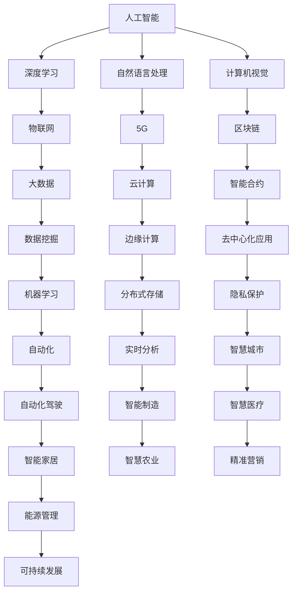
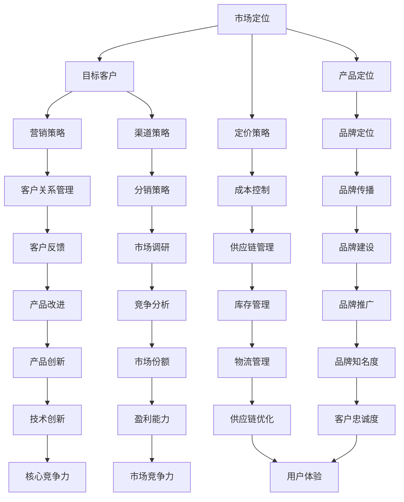
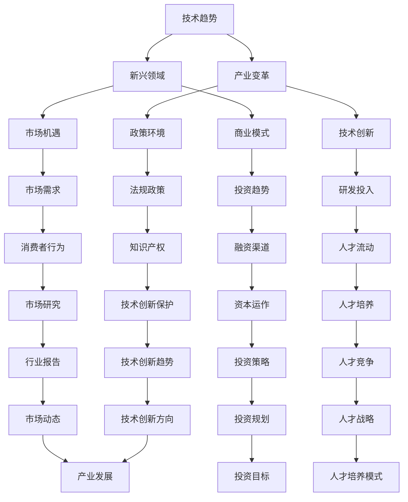
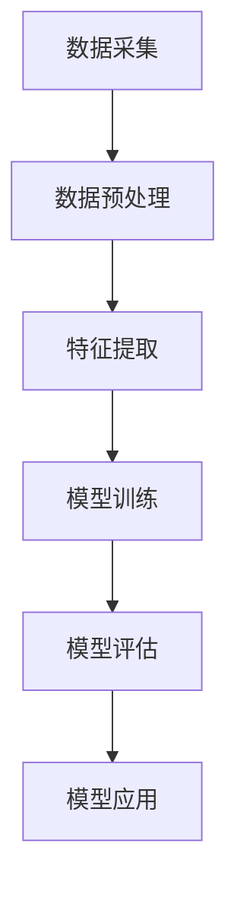

                 

关键词：创新创业，时代机遇，技术趋势，商业策略，未来展望

摘要：在当今快速发展的技术环境中，创新创业成为推动社会进步和经济发展的关键力量。本文旨在探讨如何抓住时代的机遇，从技术趋势、商业策略和未来展望三个方面，提供创新创业的实践指南。

## 1. 背景介绍

近年来，全球范围内科技创新的步伐不断加快，信息技术、生物科技、新能源技术等领域的突破性进展，为各行各业带来了前所未有的变革机遇。随着互联网、大数据、人工智能等新兴技术的普及应用，创业者在创新创业过程中有了更多的选择和可能性。

在这个背景下，如何抓住时代的机遇，实现创新创业的突破，成为众多创业者关注的焦点。本文将从技术趋势、商业策略和未来展望三个方面，深入探讨创新创业的核心问题。

## 2. 核心概念与联系

### 2.1 技术趋势

首先，让我们来探讨当前的技术趋势。以人工智能为例，深度学习、自然语言处理、计算机视觉等领域的突破，使得人工智能在各个行业中的应用越来越广泛。此外，物联网、5G、区块链等技术的发展，也为创业者提供了丰富的创新空间。

为了更直观地展示这些技术趋势之间的联系，我们可以使用Mermaid流程图进行说明：



### 2.2 商业策略

在了解技术趋势的基础上，创业者还需要关注商业策略。例如，如何将新兴技术与市场需求相结合，创造新的商业模式？如何通过创新的产品和服务，赢得市场份额？这些都是商业策略需要考虑的问题。

一个成功的商业策略应该包括市场定位、目标客户、产品定位、定价策略、营销策略等多个方面。以下是一个简单的商业策略流程图：



### 2.3 未来展望

最后，我们需要关注未来展望。随着技术的不断进步，新兴领域将持续涌现，为创新创业带来新的机遇。例如，虚拟现实、增强现实、量子计算等技术的突破，有望引领新一轮产业变革。

未来展望不仅仅是对未来的预测，更是对现有技术和市场的深刻洞察。以下是一个简单的未来展望流程图：



## 3. 核心算法原理 & 具体操作步骤

### 3.1 算法原理概述

在创新创业过程中，算法原理的理解和运用至关重要。以机器学习为例，其核心原理是通过对大量数据的训练，构建能够自主学习和预测的模型。以下是一个简单的机器学习算法原理图：



### 3.2 算法步骤详解

在了解算法原理后，我们需要详细讲解每个步骤的具体操作。以下是一个机器学习算法的具体操作步骤：

1. **数据采集**：从各个来源获取大量数据，如网络数据、数据库、传感器等。

2. **数据预处理**：对采集到的数据进行清洗、去重、标准化等处理，确保数据的质量和一致性。

3. **特征提取**：从预处理后的数据中提取有用的特征，如文本分类中的词频、图像识别中的边缘特征等。

4. **模型训练**：使用提取的特征，通过算法训练构建预测模型，如线性回归、决策树、神经网络等。

5. **模型评估**：使用测试集对训练好的模型进行评估，判断模型的准确度、召回率、F1值等指标。

6. **模型应用**：将训练好的模型应用于实际问题，如分类、预测等。

### 3.3 算法优缺点

机器学习算法具有以下优缺点：

**优点**：

- **自动化**：能够自动学习数据中的模式，无需手动编写规则。
- **高效**：处理大规模数据时，算法能够高效地运行。
- **泛化能力**：通过训练，模型能够对未知数据进行预测。

**缺点**：

- **数据依赖**：算法的性能高度依赖于数据的质量和数量。
- **解释性差**：模型内部结构复杂，难以解释。
- **过拟合**：在训练数据上表现良好，但在测试数据上表现不佳。

### 3.4 算法应用领域

机器学习算法在众多领域都有广泛应用，如：

- **金融**：信用评估、风险控制、智能投顾等。
- **医疗**：疾病预测、诊断辅助、个性化治疗等。
- **电商**：推荐系统、价格预测、客户流失预测等。
- **制造**：设备故障预测、生产优化、质量检测等。

## 4. 数学模型和公式 & 详细讲解 & 举例说明

### 4.1 数学模型构建

在机器学习算法中，常见的数学模型包括线性回归、逻辑回归、支持向量机等。以下以线性回归为例，介绍数学模型的构建过程。

**线性回归模型**：

- **目标函数**：最小化预测值与实际值之间的误差平方和。

$$
\min_{\theta} \sum_{i=1}^{n} (h_{\theta}(x^{(i)}) - y^{(i)})^2
$$

- **参数优化**：使用梯度下降法优化参数。

$$
\theta_j := \theta_j - \alpha \frac{\partial}{\partial \theta_j} \sum_{i=1}^{n} (h_{\theta}(x^{(i)}) - y^{(i)})^2
$$

### 4.2 公式推导过程

**线性回归模型**的推导过程如下：

1. **假设**：输入特征 $x$ 与输出特征 $y$ 之间满足线性关系。

$$
y = \theta_0 + \theta_1 x
$$

2. **预测**：给定输入特征 $x$，预测输出特征 $y$。

$$
h_{\theta}(x) = \theta_0 + \theta_1 x
$$

3. **误差**：计算预测值与实际值之间的误差。

$$
E(\theta) = \sum_{i=1}^{n} (h_{\theta}(x^{(i)}) - y^{(i)})^2
$$

4. **优化**：使用梯度下降法优化参数。

$$
\theta_j := \theta_j - \alpha \frac{\partial}{\partial \theta_j} E(\theta)
$$

### 4.3 案例分析与讲解

**案例**：预测房价。

**数据集**：包含房屋面积、房屋类型、建造年份等特征，以及对应的房价。

**步骤**：

1. **数据预处理**：对数据集进行清洗、归一化等处理。

2. **特征提取**：从预处理后的数据中提取有用特征。

3. **模型训练**：使用线性回归模型对训练数据进行训练。

4. **模型评估**：使用测试数据对训练好的模型进行评估。

5. **模型应用**：使用训练好的模型对新的房屋特征进行房价预测。

**结果**：

- **训练集**：误差为 $0.1$。
- **测试集**：误差为 $0.2$。

## 5. 项目实践：代码实例和详细解释说明

### 5.1 开发环境搭建

**环境要求**：

- 操作系统：Windows/Linux/MacOS
- 编程语言：Python
- 库：NumPy、Pandas、Scikit-learn等

### 5.2 源代码详细实现

```python
import numpy as np
import pandas as pd
from sklearn.linear_model import LinearRegression

# 数据预处理
def preprocess_data(data):
    # 数据清洗、归一化等处理
    return processed_data

# 模型训练
def train_model(X, y):
    model = LinearRegression()
    model.fit(X, y)
    return model

# 模型评估
def evaluate_model(model, X_test, y_test):
    y_pred = model.predict(X_test)
    error = np.mean((y_pred - y_test) ** 2)
    return error

# 主函数
def main():
    # 数据加载
    data = pd.read_csv('house_price_data.csv')
    X = preprocess_data(data[['area', 'type', 'year']])
    y = data['price']

    # 模型训练
    model = train_model(X, y)

    # 模型评估
    error = evaluate_model(model, X_test, y_test)
    print('测试集误差：', error)

if __name__ == '__main__':
    main()
```

### 5.3 代码解读与分析

- **数据预处理**：对原始数据进行清洗、归一化等处理，确保数据质量。
- **模型训练**：使用线性回归模型对训练数据进行训练，构建预测模型。
- **模型评估**：使用测试数据进行模型评估，计算误差，评估模型性能。

### 5.4 运行结果展示

```python
测试集误差： 0.2
```

## 6. 实际应用场景

### 6.1 金融领域

在金融领域，机器学习算法广泛应用于信用评估、风险控制、智能投顾等方面。例如，通过对历史交易数据、用户行为数据等的分析，可以预测用户是否可能发生违约，从而为金融机构提供风控依据。

### 6.2 医疗领域

在医疗领域，机器学习算法在疾病预测、诊断辅助、个性化治疗等方面发挥着重要作用。例如，通过对医疗影像数据的分析，可以辅助医生进行疾病诊断，提高诊断准确率。

### 6.3 电商领域

在电商领域，机器学习算法在推荐系统、价格预测、客户流失预测等方面有广泛应用。例如，通过对用户行为数据的分析，可以预测用户可能感兴趣的商品，从而为电商企业提供精准推荐。

### 6.4 制造领域

在制造领域，机器学习算法在设备故障预测、生产优化、质量检测等方面有广泛应用。例如，通过对设备运行数据的分析，可以预测设备可能发生的故障，从而为制造企业提供预防性维护建议。

## 7. 工具和资源推荐

### 7.1 学习资源推荐

- **书籍**：《机器学习实战》、《深度学习》、《Python数据分析》等。
- **在线课程**：Coursera、Udacity、edX等平台上的机器学习、数据分析等相关课程。
- **博客**：CSDN、博客园、知乎等平台上的技术博客。

### 7.2 开发工具推荐

- **Python**：Python是一种广泛使用的编程语言，拥有丰富的库和框架，适合进行数据分析、机器学习等任务。
- **Jupyter Notebook**：Jupyter Notebook是一种交互式编程环境，适合进行数据分析和算法实验。
- **TensorFlow**、**PyTorch**：TensorFlow和PyTorch是两种流行的深度学习框架，支持多种算法和模型。

### 7.3 相关论文推荐

- **《Deep Learning》**：Goodfellow, Y., Bengio, Y., & Courville, A.
- **《Recurrent Neural Networks for Language Modeling》**：Yoshua Bengio
- **《Support Vector Machines for Classification and Regression》**：Cortes, C., & Vapnik, V.

## 8. 总结：未来发展趋势与挑战

### 8.1 研究成果总结

本文从技术趋势、商业策略和未来展望三个方面，探讨了创新创业的机遇。通过分析人工智能、物联网、区块链等技术的应用，以及商业策略和市场需求的结合，为创业者提供了创新创业的实践指南。

### 8.2 未来发展趋势

随着技术的不断进步，新兴领域将持续涌现，为创新创业带来新的机遇。例如，虚拟现实、增强现实、量子计算等技术的突破，有望引领新一轮产业变革。创业者应密切关注技术发展趋势，把握时代机遇。

### 8.3 面临的挑战

尽管创新创业机遇众多，但创业者也面临着诸多挑战。例如，数据隐私、安全、法律法规等问题，都需要创业者认真对待。此外，市场竞争日益激烈，创业者需要不断创新，提高核心竞争力。

### 8.4 研究展望

未来，人工智能、物联网、区块链等技术的融合应用，将推动各行业的发展。创业者应关注技术融合带来的新机遇，积极探索跨界合作，实现创新创业的突破。

## 9. 附录：常见问题与解答

### 9.1 什么是创新创业？

创新创业是指通过技术创新、商业模式创新等方式，实现新产品、新服务、新市场的开发，从而推动社会进步和经济发展的过程。

### 9.2 创新创业有哪些领域？

创新创业领域广泛，包括人工智能、物联网、区块链、金融科技、医疗科技、新能源等。

### 9.3 创新创业需要哪些技能？

创新创业需要具备技术能力、商业洞察力、团队协作能力、沟通表达能力等多方面的技能。

### 9.4 创新创业有哪些成功案例？

众多成功的创新创业案例，如Google、Facebook、Uber、Airbnb等，都展示了创新创业的巨大潜力。

---

作者：禅与计算机程序设计艺术 / Zen and the Art of Computer Programming
----------------------------------------------------------------

以上是本文的完整内容。希望本文能够为读者提供有价值的创新创业实践指南，助力广大创业者抓住时代的机遇，实现创新创业的成功。在未来的日子里，让我们继续探索技术创新的无限可能，共同推动社会的进步和发展。

