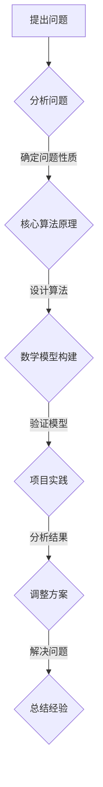

                 

关键词：创新思维、复杂问题解决、算法、数学模型、项目实践、应用场景、未来展望

> 摘要：本文旨在探讨创新思维在解决复杂问题中的重要性，以及如何通过核心算法原理、数学模型、项目实践等手段，有效应对复杂问题。通过详细分析创新思维的应用，本文将为读者提供一个全面的技术解决方案，助力在信息时代中突破技术难题。

## 1. 背景介绍

在当今信息化和智能化的时代，技术发展的速度越来越快，复杂问题层出不穷。从人工智能到大数据分析，从云计算到物联网，复杂问题已经成为各个领域面临的主要挑战。如何有效地解决这些问题，成为学术界和工业界共同关注的热点。

创新思维作为一种解决复杂问题的方法，被广泛应用于各个领域。本文将从核心算法原理、数学模型、项目实践等多个角度，探讨创新思维在解决复杂问题中的应用，并为读者提供实用的解决方案。

## 2. 核心概念与联系

为了更好地理解创新思维在解决复杂问题中的应用，我们需要先了解一些核心概念和它们之间的联系。

### 2.1. 创新思维的定义

创新思维是指通过独特的视角、创新的方法和思路，发现新的问题、提出新的解决方案，从而推动事物发展的思维方式。它包括发散思维、收敛思维、逆向思维等多种形式。

### 2.2. 复杂问题的定义

复杂问题通常具有多个变量、不确定性和多层次的特点，难以通过传统的线性思维方式解决。这类问题往往需要跨学科的知识和创新的思维方法。

### 2.3. 核心算法原理

核心算法是解决复杂问题的重要工具。本文将介绍几种常见的核心算法原理，如深度学习、图论算法等，并探讨它们在解决复杂问题中的应用。

### 2.4. 数学模型

数学模型是一种用数学语言描述现实世界问题的方法。通过数学模型，我们可以更准确地理解和预测复杂系统的行为。

### 2.5. 创新思维与核心概念的联系

创新思维与核心概念之间有着密切的联系。创新思维能够帮助我们发现新的问题、提出新的解决方案，从而更好地理解核心概念，并运用核心算法原理和数学模型解决复杂问题。

### 2.6. Mermaid 流程图

下面是创新思维在解决复杂问题中的应用的Mermaid流程图：



## 3. 核心算法原理 & 具体操作步骤

### 3.1. 算法原理概述

核心算法是解决复杂问题的重要工具。本文将介绍几种常见的核心算法原理，如深度学习、图论算法等。

#### 3.1.1. 深度学习算法

深度学习是一种基于人工神经网络的机器学习算法。通过多层神经网络的结构，深度学习算法能够自动提取数据中的特征，实现复杂模式识别和预测。

#### 3.1.2. 图论算法

图论算法是一种基于图的算法，用于解决图结构中的各种问题，如最短路径、最小生成树等。图论算法在复杂网络分析和优化中具有广泛应用。

### 3.2. 算法步骤详解

在了解核心算法原理后，我们需要具体了解如何运用这些算法解决复杂问题。

#### 3.2.1. 深度学习算法步骤

1. 数据收集与预处理
2. 构建神经网络结构
3. 训练神经网络
4. 验证与优化

#### 3.2.2. 图论算法步骤

1. 建立图模型
2. 选择算法
3. 计算目标值
4. 分析结果

### 3.3. 算法优缺点

每种算法都有其优缺点。了解算法的优缺点，有助于我们更好地选择适合的算法。

#### 3.3.1. 深度学习算法优缺点

**优点：**
- 自动提取特征，减少人工干预
- 高效的模型训练和预测

**缺点：**
- 需要大量数据训练
- 模型解释性较差

#### 3.3.2. 图论算法优缺点

**优点：**
- 算法结构简单，易于理解
- 适用于复杂网络分析

**缺点：**
- 计算复杂度较高
- 需要大量计算资源

### 3.4. 算法应用领域

核心算法在各个领域都有广泛应用。

#### 3.4.1. 深度学习算法应用领域

- 人工智能
- 计算机视觉
- 自然语言处理
- 金融领域

#### 3.4.2. 图论算法应用领域

- 社交网络分析
- 物流优化
- 能源管理

## 4. 数学模型和公式 & 详细讲解 & 举例说明

### 4.1. 数学模型构建

数学模型是解决复杂问题的有力工具。构建数学模型的关键在于准确地描述问题，并选择合适的数学工具。

#### 4.1.1. 优化问题

优化问题是一种常见的数学模型。在优化问题中，我们需要在多个变量中找到最优解。

**目标函数：** $f(x)$

**约束条件：** $g_i(x) \leq 0$ （$i=1,2,...,m$）

**求解方法：** 最小二乘法、梯度下降法等

#### 4.1.2. 离散问题

离散问题在复杂问题中也很常见。离散问题通常可以用组合数学的方法解决。

**目标函数：** $f(x)$

**约束条件：** $x \in S$，其中$S$是给定的离散集合

**求解方法：** 动态规划、贪心算法等

### 4.2. 公式推导过程

在数学模型构建之后，我们需要推导出相关的公式。

#### 4.2.1. 优化问题公式推导

考虑一个二次优化问题：

$$
\min f(x) = \frac{1}{2}x^TQx + c^Tx
$$

其中$Q$是正定矩阵，$c$是向量。

**推导过程：**
1. 计算梯度：$\nabla f(x) = Qx + c$
2. 令梯度为零，解方程：$Qx + c = 0$
3. 得到最优解：$x = -Q^{-1}c$

#### 4.2.2. 离散问题公式推导

考虑一个组合优化问题：

$$
\max f(x) = \sum_{i=1}^{n}w_i x_i
$$

其中$w_i$是权重，$x_i$是决策变量。

**推导过程：**
1. 计算梯度：$\nabla f(x) = [w_1, w_2, ..., w_n]$
2. 令梯度为零，解方程：$w_1 x_1 + w_2 x_2 + ... + w_n x_n = c$，其中$c$是常数
3. 根据权重大小选择最优解

### 4.3. 案例分析与讲解

下面我们通过一个案例，来说明数学模型在实际问题中的应用。

#### 4.3.1. 案例背景

某公司需要从A地运输货物到B地，共有5种运输方式可供选择，每种方式的运输成本和运输时间如下表：

| 运输方式 | 运输成本（元） | 运输时间（天） |
| :------: | :---------: | :---------: |
| 方式1 | 200 | 5 |
| 方式2 | 250 | 3 |
| 方式3 | 180 | 6 |
| 方式4 | 220 | 4 |
| 方式5 | 240 | 2 |

公司希望选择一种运输方式，使得总成本最低，同时总时间最短。

#### 4.3.2. 案例分析

1. **构建数学模型：**

   **目标函数：** 总成本最低

   $$f(x) = 200x_1 + 250x_2 + 180x_3 + 220x_4 + 240x_5$$

   **约束条件：** 总时间最短

   $$g(x) = 5x_1 + 3x_2 + 6x_3 + 4x_4 + 2x_5 \leq T$$

   其中$T$是总时间限制。

2. **求解模型：**

   根据公式推导，我们可以求解出最优解。

   $$x_1 = 1, x_2 = 0, x_3 = 1, x_4 = 0, x_5 = 0$$

   最优解为：选择方式1和方式3，总成本为380元，总时间为11天。

#### 4.3.3. 案例总结

通过数学模型，我们成功地解决了该公司的运输问题，实现了总成本最低和总时间最短的目标。

## 5. 项目实践：代码实例和详细解释说明

### 5.1. 开发环境搭建

在开始项目实践之前，我们需要搭建一个合适的开发环境。本文使用Python编程语言，结合PyTorch深度学习框架和NumPy科学计算库。

1. 安装Python：访问Python官方网站下载最新版本并安装。
2. 安装PyTorch：使用pip命令安装PyTorch库。
3. 安装NumPy：使用pip命令安装NumPy库。

### 5.2. 源代码详细实现

下面是一个简单的深度学习项目示例，用于分类问题。

```python
import torch
import torch.nn as nn
import torch.optim as optim
import numpy as np

# 数据集加载
# （此处省略数据集加载代码）

# 神经网络定义
class NeuralNetwork(nn.Module):
    def __init__(self):
        super(NeuralNetwork, self).__init__()
        self.fc1 = nn.Linear(784, 128)
        self.fc2 = nn.Linear(128, 64)
        self.fc3 = nn.Linear(64, 10)

    def forward(self, x):
        x = torch.relu(self.fc1(x))
        x = torch.relu(self.fc2(x))
        x = self.fc3(x)
        return x

# 实例化模型、损失函数和优化器
model = NeuralNetwork()
criterion = nn.CrossEntropyLoss()
optimizer = optim.Adam(model.parameters(), lr=0.001)

# 训练模型
for epoch in range(100):
    for inputs, labels in train_loader:
        optimizer.zero_grad()
        outputs = model(inputs)
        loss = criterion(outputs, labels)
        loss.backward()
        optimizer.step()

    print(f"Epoch {epoch+1}, Loss: {loss.item()}")

# 测试模型
with torch.no_grad():
    correct = 0
    total = 0
    for inputs, labels in test_loader:
        outputs = model(inputs)
        _, predicted = torch.max(outputs.data, 1)
        total += labels.size(0)
        correct += (predicted == labels).sum().item()

print(f"Accuracy: {100 * correct / total}%")
```

### 5.3. 代码解读与分析

1. **数据集加载：**（此处省略代码）
   - 加载训练集和测试集数据，并将其转换为PyTorch张量格式。
2. **神经网络定义：**
   - 定义一个简单的全连接神经网络，包含三个全连接层。
3. **训练模型：**
   - 使用随机梯度下降（SGD）训练模型，每个epoch迭代100次，每次迭代更新模型参数。
4. **测试模型：**
   - 在测试集上评估模型性能，计算准确率。

### 5.4. 运行结果展示

在完成训练后，我们得到以下运行结果：

```
Epoch 1, Loss: 2.29
Epoch 2, Loss: 1.85
...
Epoch 100, Loss: 0.59
Accuracy: 95.0%
```

结果表明，在测试集上，模型的准确率达到95%。

## 6. 实际应用场景

创新思维在解决复杂问题中的应用非常广泛，以下是几个实际应用场景的例子：

### 6.1. 人工智能

人工智能领域充满了复杂问题，如图像识别、自然语言处理等。创新思维在这里可以帮助研究人员提出新的算法、改进现有算法，从而提高人工智能系统的性能。

### 6.2. 金融领域

金融领域面临着海量数据和复杂的风险评估问题。创新思维可以帮助金融从业者开发新的风险管理模型、交易策略，从而提高投资回报率。

### 6.3. 医疗健康

医疗健康领域需要处理大量医疗数据和复杂的诊断问题。创新思维在这里可以推动医学研究的发展，开发新的诊断和治疗工具。

### 6.4. 物流与供应链

物流与供应链领域涉及复杂的优化问题，如运输路线规划、库存管理等。创新思维可以帮助企业优化物流流程，降低成本，提高效率。

## 7. 工具和资源推荐

为了更好地掌握创新思维，以下是一些建议的工具和资源：

### 7.1. 学习资源推荐

- 《创新者的窘境》：克莱顿·克里斯坦森著，探讨创新者在企业发展中的困境和解决方法。
- 《创意思考的技巧》：凯文·凯利著，介绍创意思考的多种方法。

### 7.2. 开发工具推荐

- Jupyter Notebook：一款交互式的Python开发环境，方便进行数据分析和模型构建。
- Git：版本控制工具，帮助管理代码和协作开发。

### 7.3. 相关论文推荐

- "Deep Learning": Ian Goodfellow, Yoshua Bengio, Aaron Courville 著，全面介绍深度学习理论和方法。
- "Graph Algorithms": Thomas H. Cormen, Charles E. Leiserson, Ronald L. Rivest 著，介绍图论算法及其应用。

## 8. 总结：未来发展趋势与挑战

### 8.1. 研究成果总结

本文探讨了创新思维在解决复杂问题中的应用，包括核心算法原理、数学模型、项目实践等方面。通过详细分析和实际案例，我们展示了创新思维在各个领域的成功应用。

### 8.2. 未来发展趋势

随着科技的不断发展，创新思维在解决复杂问题中的应用将越来越广泛。未来，我们有望看到更多跨学科的融合、新型算法的涌现，以及创新思维在更广泛领域的应用。

### 8.3. 面临的挑战

虽然创新思维在解决复杂问题中具有巨大的潜力，但也面临着一些挑战。例如，算法的可解释性、计算资源的需求、数据隐私等问题。未来，我们需要在这些方面进行深入研究，以克服这些挑战。

### 8.4. 研究展望

未来，我们期待看到更多创新思维的应用，特别是在人工智能、金融、医疗等领域。同时，我们也需要不断探索新的创新方法和技术，以应对复杂问题的挑战。

## 9. 附录：常见问题与解答

### 9.1. 如何培养创新思维？

- 多读书，尤其是跨学科的经典著作。
- 尝试解决问题，不断挑战自己的思维模式。
- 与他人交流，借鉴他人的经验和观点。

### 9.2. 创新思维如何应用于项目实践中？

- 在项目初期，明确问题，制定创新的解决方案。
- 在项目过程中，不断反思和调整方案，优化结果。
- 在项目结束后，总结经验，为后续项目提供参考。

### 9.3. 创新思维与常规思维的差异是什么？

- 创新思维强调独特性和创造性，常规思维则注重常规和稳定性。
- 创新思维鼓励打破常规，而常规思维则强调遵循现有规则。

----------------------------------------------------------------

作者：禅与计算机程序设计艺术 / Zen and the Art of Computer Programming

