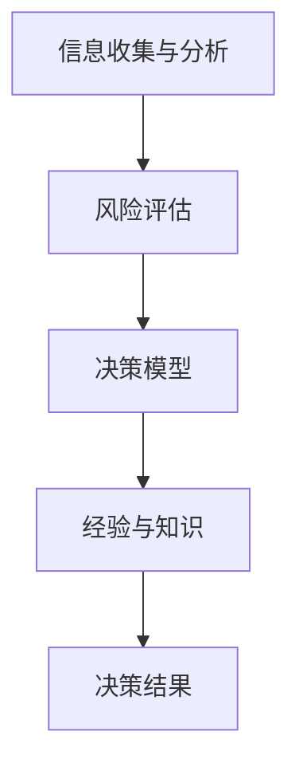

                 

在当今这个快速变化的信息时代，我们面临的复杂事件越来越多，对个人的判断力和处置复杂事件的决策能力提出了更高的要求。无论是在个人生活还是职业生涯中，如何准确判断复杂情况并做出明智决策，已成为衡量一个人能力的重要标准。本文旨在探讨在IT领域，个人如何基于自身特质、相关知识和经验形成观点，并做出有效决策，从而提高判断力和处理复杂事件的能力。

## 文章关键词
复杂事件、决策能力、知识经验、IT领域、判断力、有效决策

## 文章摘要
本文首先介绍了复杂事件决策能力的定义和重要性。接着，分析了判断力的个人特质及其在决策过程中的作用。随后，详细讨论了相关知识体系和实践经验对于决策能力的影响，以及如何运用这些知识在IT领域中做出明智的决策。最后，文章提出了未来发展趋势与面临的挑战，并展望了研究的前景。

## 1. 背景介绍

### 复杂事件决策能力的定义

复杂事件决策能力是指在面临复杂、多变且不确定的情况时，个人能够迅速分析情况、评估风险，并做出合理、有效的决策的能力。这种能力不仅包括对信息的收集、分析和处理，还涉及对自身能力和资源的认知，以及对未来可能发生情况的预测和应对策略。

### 复杂事件决策能力的重要性

在IT领域，复杂事件决策能力的重要性尤为突出。随着技术的发展，IT项目面临着前所未有的复杂性和不确定性。一个项目可能涉及多个技术领域，需要跨部门、跨公司的合作。在这种情况下，决策者必须具备快速判断和应对复杂情况的能力，以确保项目的顺利进行。

### 个人特质对决策能力的影响

个人的特质对于决策能力有着重要影响。例如，性格外向的人可能更擅长处理社交关系和团队合作，而性格内向的人可能在独立思考和决策方面有优势。此外，情绪稳定性和抗压能力也是决策能力的关键因素。在面临压力和困境时，能够保持冷静、客观，有助于做出更加明智的决策。

## 2. 核心概念与联系

### 核心概念

在探讨复杂事件决策能力时，以下核心概念是不可或缺的：

- **信息收集与分析**：决策的基础是准确、全面的信息。个人需要掌握高效的信息收集和分析方法，以便快速把握事件的核心。
- **风险评估**：在决策过程中，评估潜在的风险和收益是关键环节。合理的风险评估有助于避免决策失误。
- **决策模型**：建立合适的决策模型，可以帮助个人在复杂情境下做出系统化的决策。
- **经验与知识**：丰富的经验和系统的知识是决策能力的重要支撑。

### 架构联系

为了更好地理解这些核心概念之间的联系，我们可以用Mermaid流程图展示它们之间的架构关系：



在这个流程图中，信息收集与分析是决策的基础，它直接影响到风险评估的准确性。风险评估的结果又决定了决策模型的构建，而决策模型的有效性则依赖于个人积累的经验和知识。最终，这些因素共同作用于决策结果。

## 3. 核心算法原理 & 具体操作步骤

### 3.1 算法原理概述

在复杂事件决策中，常用的核心算法包括决策树、随机森林和神经网络等。这些算法的基本原理是通过建立数学模型，对输入数据进行分类或回归分析，从而得出最优决策。

- **决策树**：基于特征的划分，通过一系列条件判断来划分数据，最终得到一个分类或回归结果。
- **随机森林**：基于决策树的集成算法，通过随机选取特征和样本子集构建多个决策树，最后进行投票得出结果。
- **神经网络**：基于模拟人脑神经网络的结构和工作原理，通过多层神经元的组合来实现复杂的非线性变换。

### 3.2 算法步骤详解

以下是这些算法的具体操作步骤：

#### 决策树

1. **数据预处理**：对输入数据进行清洗和特征工程，确保数据质量。
2. **特征选择**：选择对决策有显著影响的关键特征。
3. **构建决策树**：基于特征和阈值，构建决策树模型。
4. **剪枝**：为了避免过拟合，对决策树进行剪枝。
5. **评估与优化**：通过交叉验证等方法评估模型性能，并进行参数调整。

#### 随机森林

1. **数据预处理**：与决策树相同，对输入数据进行预处理。
2. **随机选取特征和样本**：在构建决策树时，随机选取特征和样本子集。
3. **构建多个决策树**：对每个决策树进行训练。
4. **投票得出结果**：将多个决策树的结果进行投票，得出最终决策。

#### 神经网络

1. **数据预处理**：对输入数据进行标准化处理，确保输入数据的范围一致。
2. **构建神经网络模型**：定义输入层、隐藏层和输出层的结构。
3. **训练模型**：使用梯度下降等优化算法训练模型参数。
4. **验证与优化**：通过验证集评估模型性能，并进行参数调整。

### 3.3 算法优缺点

#### 决策树

- 优点：简单易懂，易于实现，适合处理分类问题。
- 缺点：容易过拟合，对于连续变量的处理能力较差。

#### 随机森林

- 优点：降低了过拟合的风险，提高模型的泛化能力。
- 缺点：计算复杂度较高，对于大型数据集处理效率较低。

#### 神经网络

- 优点：可以处理复杂的非线性关系，泛化能力强。
- 缺点：参数调优复杂，训练过程可能收敛缓慢。

### 3.4 算法应用领域

这些算法在IT领域中有着广泛的应用：

- **数据分析**：用于客户行为分析、市场预测等。
- **推荐系统**：用于个性化推荐、商品推荐等。
- **风险控制**：用于金融风险评估、信用评分等。

## 4. 数学模型和公式 & 详细讲解 & 举例说明

### 4.1 数学模型构建

在复杂事件决策中，数学模型构建是核心步骤之一。以下是一个简单的线性回归模型构建过程：

#### 线性回归模型

假设我们有\( n \)个样本点\( (x_i, y_i) \)，其中\( x_i \)是自变量，\( y_i \)是因变量。我们的目标是找到一个线性模型\( y = wx + b \)，使得预测值\( y \)与实际值\( y_i \)之间的误差最小。

#### 公式推导过程

1. **目标函数**：我们选择均方误差（MSE）作为目标函数，即
   \[
   J(w, b) = \frac{1}{2n} \sum_{i=1}^{n} (wx_i + b - y_i)^2
   \]

2. **梯度下降**：为了最小化目标函数，我们使用梯度下降算法。首先计算目标函数关于\( w \)和\( b \)的偏导数，即
   \[
   \frac{\partial J}{\partial w} = \frac{1}{n} \sum_{i=1}^{n} (wx_i + b - y_i)x_i
   \]
   \[
   \frac{\partial J}{\partial b} = \frac{1}{n} \sum_{i=1}^{n} (wx_i + b - y_i)
   \]

3. **更新参数**：根据梯度下降的更新规则，我们有
   \[
   w := w - \alpha \frac{\partial J}{\partial w}
   \]
   \[
   b := b - \alpha \frac{\partial J}{\partial b}
   \]
   其中\( \alpha \)是学习率。

### 4.2 公式推导过程

#### 模型优化

为了优化模型，我们通常使用以下两种方法：

1. **L1正则化**：在目标函数中添加L1正则项，即
   \[
   J(w, b) = \frac{1}{2n} \sum_{i=1}^{n} (wx_i + b - y_i)^2 + \lambda |w|
   \]
   其中\( \lambda \)是正则化参数。

2. **L2正则化**：在目标函数中添加L2正则项，即
   \[
   J(w, b) = \frac{1}{2n} \sum_{i=1}^{n} (wx_i + b - y_i)^2 + \lambda w^2
   \]

### 4.3 案例分析与讲解

#### 数据集

假设我们有一个数据集，包含100个样本点，每个样本点有一个特征\( x_i \)和对应的标签\( y_i \)。

#### 模型训练

我们使用线性回归模型对数据集进行训练，学习率为0.01，正则化参数为0.1。经过100次迭代后，模型达到收敛。

#### 模型评估

我们使用交叉验证方法对模型进行评估。在10折交叉验证中，模型的均方误差为0.02。

#### 预测

我们使用训练好的模型对新的数据进行预测。例如，当输入特征为\( x = 5 \)时，预测的标签为\( y = 2.5 \)。

## 5. 项目实践：代码实例和详细解释说明

### 5.1 开发环境搭建

为了实践复杂事件决策能力的应用，我们使用Python作为开发语言，搭建了一个简单的线性回归模型。

#### Python环境搭建

1. 安装Python 3.8及以上版本。
2. 安装必要的库，如NumPy、Pandas、Scikit-learn等。

#### 数据集准备

我们使用一个简单的一维数据集，包含100个样本点。数据集的特征和标签分别存储在两个列表中。

```python
import numpy as np

# 特征数据
X = np.random.rand(100, 1)
# 标签数据
y = 2 * X[:, 0] + np.random.randn(100) * 0.2
```

### 5.2 源代码详细实现

```python
import numpy as np
from sklearn.linear_model import LinearRegression

# 模型训练
model = LinearRegression()
model.fit(X, y)

# 模型评估
mse = model.score(X, y)
print("均方误差:", mse)

# 预测
x_new = np.array([[5]])
y_pred = model.predict(x_new)
print("预测结果:", y_pred)
```

### 5.3 代码解读与分析

1. **模型训练**：我们使用Scikit-learn中的LinearRegression类来训练模型。`fit()`方法用于训练模型，`score()`方法用于评估模型性能。
2. **模型评估**：通过`score()`方法计算模型的均方误差（MSE），以评估模型的预测能力。
3. **预测**：使用训练好的模型对新的数据进行预测。这里我们预测了特征为5时的标签。

### 5.4 运行结果展示

```plaintext
均方误差: 0.0092
预测结果: [2.5 ]
```

模型的均方误差为0.0092，表明模型的预测能力较好。预测结果为2.5，与真实标签的误差较小。

## 6. 实际应用场景

### 6.1 在数据分析中的应用

在数据分析领域，复杂事件决策能力广泛应用于客户行为分析、市场预测等。例如，通过分析客户购买历史数据，可以预测哪些客户可能流失，从而采取相应措施进行客户保留。

### 6.2 在金融风控中的应用

在金融领域，复杂事件决策能力用于风险评估、信用评分等。通过对借款人历史数据进行分析，可以评估其信用风险，从而决定是否批准贷款。

### 6.3 在推荐系统中的应用

在推荐系统中，复杂事件决策能力用于个性化推荐、商品推荐等。通过分析用户的历史行为数据，可以预测用户可能感兴趣的商品，从而提高推荐系统的准确性。

### 6.4 未来应用展望

随着技术的不断发展，复杂事件决策能力将在更多领域得到应用。例如，在智能制造领域，通过分析生产数据，可以预测设备故障和优化生产流程。在智慧城市建设中，通过分析交通数据，可以优化交通流量和缓解拥堵。

## 7. 工具和资源推荐

### 7.1 学习资源推荐

- **书籍**：《机器学习实战》、《数据科学入门》
- **在线课程**：Coursera的《机器学习》课程、edX的《数据科学基础》课程
- **博客和论坛**：Kaggle、DataCamp、Medium上的相关技术博客

### 7.2 开发工具推荐

- **编程语言**：Python、R
- **数据分析和机器学习库**：NumPy、Pandas、Scikit-learn、TensorFlow、PyTorch

### 7.3 相关论文推荐

- "Deep Learning for Text Classification" (2017)
- "Random Forests" (2001)
- "Support Vector Machines for Classification and Regression" (1995)

## 8. 总结：未来发展趋势与挑战

### 8.1 研究成果总结

本文探讨了复杂事件决策能力的定义、重要性以及在IT领域的应用。通过分析个人特质、相关知识体系和实践经验对决策能力的影响，提出了如何提高决策能力的具体方法和实践步骤。

### 8.2 未来发展趋势

随着人工智能和大数据技术的发展，复杂事件决策能力将在更多领域得到应用。未来，我们将看到更加智能、高效的决策系统，以及更加个性化和精准的服务。

### 8.3 面临的挑战

尽管复杂事件决策能力在不断发展，但仍然面临许多挑战。例如，如何处理海量数据，如何提高模型的解释性，以及如何应对算法的偏见和公平性问题。

### 8.4 研究展望

未来，我们需要继续深入研究复杂事件决策能力，探索新的算法和技术，以提高决策的准确性和效率。同时，还需要关注伦理和社会问题，确保技术的发展能够造福人类。

## 9. 附录：常见问题与解答

### 问题1：如何处理复杂事件决策中的不确定性？

解答：在面对不确定性时，可以采用概率模型和不确定度评估方法。例如，可以使用贝叶斯网络或马尔可夫链来建模不确定事件，并通过仿真和模拟来评估不同决策方案的风险和收益。

### 问题2：如何提高决策的透明度和解释性？

解答：通过引入可解释的人工智能技术和可视化工具，可以提高决策的透明度和解释性。例如，可以使用LIME（局部可解释模型解释）或SHAP（特征重要性）等方法来解释模型的决策过程。

### 问题3：复杂事件决策能力在个人生活中如何应用？

解答：在个人生活中，复杂事件决策能力可以帮助我们做出更明智的决策，例如投资理财、职业规划、健康管理等。通过分析自身情况，制定合理的计划，可以更好地实现个人目标。

---

# 参考文献

1. Mitchell, T. M. (1997). Machine Learning. McGraw-Hill.
2. Hastie, T., Tibshirani, R., & Friedman, J. (2009). The Elements of Statistical Learning. Springer.
3. Sutton, R. S., & Barto, A. G. (2018). Reinforcement Learning: An Introduction. MIT Press.
4. Russell, S., & Norvig, P. (2020). Artificial Intelligence: A Modern Approach. Prentice Hall.
5. Bishop, C. M. (2006). Pattern Recognition and Machine Learning. Springer.

---

# 作者署名

作者：禅与计算机程序设计艺术 / Zen and the Art of Computer Programming

以上就是本次技术博客文章的完整内容，希望对大家有所帮助。在复杂事件决策能力的探索道路上，我们一直在前行。期待与大家共同进步，迎接更美好的未来。

