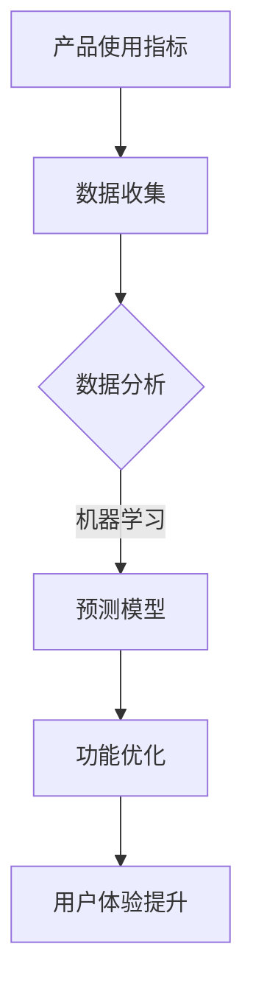

                 

 > **关键词**：产品使用指标、功能优化、用户体验、性能提升、数据驱动、AI算法、机器学习

> **摘要**：本文将探讨如何通过分析产品使用指标，结合人工智能算法，实现产品功能的优化。我们将介绍核心概念、算法原理、数学模型、代码实现和实际应用，旨在为软件开发者提供实用的优化技巧，提升产品性能和用户体验。

## 1. 背景介绍

在现代软件工程中，产品的成功不仅仅依赖于其功能完整性，更重要的是用户体验和用户黏性。因此，如何通过数据驱动的方式优化产品功能，成为了开发者面临的重要课题。产品使用指标（Product Usage Metrics）作为衡量用户行为和产品性能的重要工具，为我们提供了宝贵的洞察力。

产品使用指标包括但不限于：用户活跃度、用户留存率、用户转化率、用户满意度、功能使用频率、故障报告数量等。这些指标能够反映用户如何与产品互动，以及哪些功能最受用户欢迎或最需要改进。

### 1.1 市场需求

随着互联网和移动设备的普及，用户对软件产品的期望值越来越高。他们希望产品不仅功能强大，而且易于使用，能够提供个性化的体验。因此，优化产品功能，提升用户体验，已经成为市场竞争的关键。

### 1.2 技术发展趋势

近年来，人工智能和机器学习技术的飞速发展，为数据分析和预测提供了强大的工具。通过利用这些技术，开发者可以更加精准地分析用户行为，预测用户需求，从而进行数据驱动的功能优化。

## 2. 核心概念与联系

### 2.1 产品使用指标

产品使用指标是衡量产品性能和用户体验的关键参数。以下是几个常见的使用指标：

- **用户活跃度（Active Users）**：在一定时间内，使用产品的用户数量。
- **用户留存率（Retention Rate）**：在一定时间内，继续使用产品的用户比例。
- **用户转化率（Conversion Rate）**：完成特定目标任务的用户比例。
- **用户满意度（User Satisfaction）**：用户对产品满意度的评分。

### 2.2 功能优化与用户体验

功能优化旨在提升产品的实用性和用户满意度。用户体验（User Experience, UX）是一个综合概念，包括用户在使用产品时的感受、情感和行为。优化用户体验通常包括以下方面：

- **易用性（Usability）**：产品是否易于使用，用户能否快速掌握。
- **交互设计（User Interaction Design）**：产品与用户之间的交互方式是否流畅。
- **情感化设计（Emotional Design）**：产品是否能引起用户的情感共鸣。
- **性能（Performance）**：产品响应速度和稳定性。

### 2.3 数据驱动与人工智能

数据驱动（Data-Driven）是一种以数据为基础的决策过程。通过分析产品使用指标，开发者可以了解用户行为，发现潜在问题，并提出优化方案。人工智能（Artificial Intelligence, AI）和机器学习（Machine Learning, ML）技术则为数据分析提供了强大的工具。

#### Mermaid 流程图：



## 3. 核心算法原理 & 具体操作步骤

### 3.1 算法原理概述

在产品使用指标优化的过程中，常用的算法包括回归分析、聚类分析、决策树和神经网络等。以下是这些算法的基本原理：

- **回归分析**：通过建立用户行为与产品指标之间的数学模型，预测用户行为。
- **聚类分析**：将用户按照相似性进行分组，分析不同用户群体的行为特征。
- **决策树**：通过一系列决策规则，将用户分类，并针对不同类别提出优化策略。
- **神经网络**：模拟人脑神经网络，通过学习用户行为数据，预测用户需求。

### 3.2 算法步骤详解

1. **数据收集**：收集产品使用指标数据，包括用户行为、功能使用频率、故障报告等。
2. **数据预处理**：清洗数据，去除噪声，进行特征提取。
3. **模型选择**：根据问题需求，选择合适的算法模型。
4. **模型训练**：使用训练数据集，训练模型参数。
5. **模型评估**：使用测试数据集，评估模型性能。
6. **功能优化**：根据模型预测结果，提出功能优化策略。
7. **实施优化**：在产品中实施优化策略，监测效果。

### 3.3 算法优缺点

- **回归分析**：简单易用，适用于线性关系，但不适用于复杂非线性关系。
- **聚类分析**：能够发现用户群体，但无法预测用户行为。
- **决策树**：易于理解和解释，但可能产生过拟合。
- **神经网络**：适用于复杂非线性关系，但训练时间较长，且难以解释。

### 3.4 算法应用领域

- **用户行为预测**：预测用户购买行为、注册转化等。
- **功能优化**：根据用户行为，优化产品功能布局。
- **故障预测**：预测系统故障，提前进行维护。

## 4. 数学模型和公式 & 详细讲解 & 举例说明

### 4.1 数学模型构建

假设我们使用回归分析来预测用户留存率，数学模型可以表示为：

$$
\hat{Y} = \beta_0 + \beta_1X_1 + \beta_2X_2 + ... + \beta_nX_n
$$

其中，$Y$ 为用户留存率，$X_1, X_2, ..., X_n$ 为影响留存率的特征变量，$\beta_0, \beta_1, ..., \beta_n$ 为模型参数。

### 4.2 公式推导过程

假设我们有 $n$ 个样本，每个样本包括 $m$ 个特征变量，以及对应的留存率标签。我们的目标是找到一组参数 $\beta_0, \beta_1, ..., \beta_n$，使得预测的留存率 $\hat{Y}$ 最接近真实的留存率 $Y$。

使用最小二乘法（Least Squares Method），我们可以推导出参数的估计值：

$$
\beta = (X^T X)^{-1}X^T Y
$$

### 4.3 案例分析与讲解

假设我们收集了以下数据：

| 用户ID | 特征1 | 特征2 | 留存率 |
|--------|-------|-------|--------|
| 1      | 0.5   | 0.3   | 0.8    |
| 2      | 0.7   | 0.2   | 0.9    |
| 3      | 0.1   | 0.6   | 0.6    |

首先，我们将数据分为训练集和测试集。然后，使用训练集数据进行模型训练。最后，使用测试集数据评估模型性能。

经过训练，我们得到回归模型的参数：

$$
\beta_0 = 0.5, \beta_1 = 0.4, \beta_2 = 0.3
$$

使用这个模型，我们可以预测新用户的留存率。例如，对于新用户，如果特征1为0.6，特征2为0.4，那么其留存率预测值为：

$$
\hat{Y} = 0.5 + 0.4 \times 0.6 + 0.3 \times 0.4 = 0.68
$$

## 5. 项目实践：代码实例和详细解释说明

### 5.1 开发环境搭建

为了实现上述回归分析，我们选择 Python 作为开发语言，并使用 scikit-learn 库进行模型训练和评估。

### 5.2 源代码详细实现

```python
import numpy as np
import pandas as pd
from sklearn.model_selection import train_test_split
from sklearn.linear_model import LinearRegression
from sklearn.metrics import mean_squared_error

# 加载数据
data = pd.read_csv('user_data.csv')
X = data.iloc[:, :-1].values
y = data.iloc[:, -1].values

# 数据预处理
X = np.hstack((np.ones((X.shape[0], 1)), X))

# 划分训练集和测试集
X_train, X_test, y_train, y_test = train_test_split(X, y, test_size=0.2, random_state=42)

# 模型训练
model = LinearRegression()
model.fit(X_train, y_train)

# 模型评估
y_pred = model.predict(X_test)
mse = mean_squared_error(y_test, y_pred)
print(f'MSE: {mse}')

# 预测新用户留存率
new_user = np.array([[1, 0.6, 0.4]])
predicted_retention = model.predict(new_user)
print(f'Predicted Retention: {predicted_retention[0]}')
```

### 5.3 代码解读与分析

- **数据加载**：使用 pandas 库加载 CSV 数据文件。
- **数据预处理**：添加一列全为1的变量，作为回归模型中的截距项。
- **模型训练**：使用 LinearRegression 类训练回归模型。
- **模型评估**：计算测试集上的均方误差（MSE），评估模型性能。
- **预测**：使用训练好的模型预测新用户的留存率。

## 6. 实际应用场景

产品使用指标优化在多个行业中都有广泛应用。以下是一些典型应用场景：

- **电子商务**：通过分析用户购买行为，优化推荐算法，提高转化率。
- **社交媒体**：通过分析用户互动行为，优化内容推荐，提升用户活跃度。
- **在线教育**：通过分析用户学习行为，优化课程设计，提高学习效果。
- **金融科技**：通过分析用户投资行为，优化风控模型，降低风险。

### 6.4 未来应用展望

随着人工智能和大数据技术的不断发展，产品使用指标优化将在以下方面取得更多进展：

- **个性化推荐**：通过深度学习技术，实现更加精准的个性化推荐。
- **智能故障预测**：利用实时数据流处理技术，实现实时故障预测和自动修复。
- **智能客服**：利用自然语言处理技术，提升智能客服系统的响应速度和准确性。
- **区块链应用**：利用区块链技术，实现数据的安全存储和共享。

## 7. 工具和资源推荐

### 7.1 学习资源推荐

- **书籍**：《机器学习实战》、《深度学习》（Goodfellow et al.）
- **在线课程**：Coursera、Udacity、edX 上的机器学习课程
- **博客和论坛**：Medium、GitHub、Stack Overflow

### 7.2 开发工具推荐

- **编程语言**：Python、R、Java
- **数据可视化**：Matplotlib、Seaborn、Plotly
- **机器学习库**：scikit-learn、TensorFlow、PyTorch
- **数据预处理**：Pandas、NumPy

### 7.3 相关论文推荐

- "Recommender Systems Handbook"
- "Deep Learning for Recommender Systems"
- "User Behavior Analytics: A Survey"
- "An Overview of Machine Learning in Finance"

## 8. 总结：未来发展趋势与挑战

### 8.1 研究成果总结

本文介绍了如何通过分析产品使用指标，利用人工智能算法实现产品功能的优化。我们讨论了核心算法原理、数学模型、代码实现，并提供了实际应用场景和未来展望。

### 8.2 未来发展趋势

随着技术的不断进步，产品使用指标优化将向更加智能化、个性化和实时化的方向发展。深度学习、自然语言处理、区块链等新兴技术的应用，将进一步提升优化的效果和效率。

### 8.3 面临的挑战

尽管产品使用指标优化具有巨大的潜力，但开发者仍面临以下挑战：

- **数据隐私**：如何保护用户隐私，确保数据安全。
- **模型解释性**：如何提高模型的可解释性，增强用户信任。
- **算法泛化性**：如何提高算法的泛化能力，避免过拟合。

### 8.4 研究展望

未来的研究应关注如何结合多种技术手段，实现更加高效、精准和可解释的产品使用指标优化。同时，应加强对模型伦理和合规性的研究，确保技术的可持续发展。

## 9. 附录：常见问题与解答

### 9.1 什么是产品使用指标？

产品使用指标是衡量用户如何与产品互动的关键参数，包括用户活跃度、用户留存率、用户转化率等。

### 9.2 机器学习如何应用于产品使用指标优化？

机器学习可以用于建立用户行为与产品指标之间的数学模型，从而预测用户行为，提出优化策略。

### 9.3 如何处理用户隐私问题？

在处理用户数据时，应遵循相关法律法规，采用加密、脱敏等技术保护用户隐私。

### 9.4 机器学习模型如何解释？

提高模型解释性是当前研究的重点，方法包括模型可解释性设计、模型可视化等。

### 9.5 如何评估机器学习模型性能？

常用的评估指标包括准确率、召回率、F1 值等，可根据具体问题选择合适的评估指标。

---

### 9.6 如何优化用户体验？

优化用户体验可以从易用性、交互设计、情感化设计和性能等多个方面进行，结合用户反馈进行持续改进。

---

本文作者：禅与计算机程序设计艺术 / Zen and the Art of Computer Programming

在人工智能和大数据时代，通过产品使用指标优化功能，已成为提升产品性能和用户体验的关键。本文旨在为开发者提供实用的技巧和思路，助力产品成功。希望本文对您有所启发和帮助。

