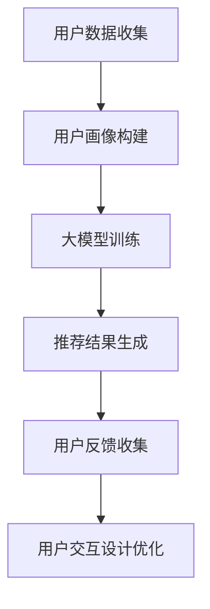

                 

  
关键字：大模型、推荐系统、用户交互设计、优化、算法、实践、数学模型、未来展望

摘要：本文探讨了如何利用大模型来优化推荐系统的用户交互设计。首先介绍了推荐系统的基本概念和传统方法，然后分析了大模型在推荐系统中的应用及其优势，接着详细阐述了大模型优化用户交互设计的具体策略，包括算法原理、数学模型以及实际应用案例。最后，对大模型在推荐系统用户交互设计中的应用前景进行了展望。

## 1. 背景介绍

随着互联网技术的飞速发展，推荐系统已经成为众多应用场景中的重要组成部分，如电商、社交媒体、新闻资讯等。推荐系统通过分析用户的行为数据和历史偏好，向用户推荐感兴趣的内容或商品，从而提升用户体验、增加用户粘性。然而，传统的推荐系统往往存在一些局限性，例如：算法模型的局限性、用户数据的质量问题以及用户交互设计的不足等。为了解决这些问题，近年来，大模型技术在推荐系统中的应用逐渐兴起，并展现出了巨大的潜力。

大模型，即大规模神经网络模型，具有处理海量数据、自适应学习和高度泛化的能力。通过引入大模型，推荐系统可以在更广泛的范围内进行用户交互设计优化，从而提高推荐效果和用户体验。本文将围绕这一主题，详细探讨大模型在推荐系统用户交互设计中的应用策略。

## 2. 核心概念与联系

### 2.1 推荐系统的基本概念

推荐系统（Recommender System）是一种基于用户行为和偏好进行内容或商品推荐的系统。它通过分析用户的历史行为数据，如浏览记录、购买历史、评论等，构建用户画像，并根据用户画像为用户推荐感兴趣的内容或商品。

推荐系统主要分为以下几种类型：

1. **基于内容的推荐（Content-Based Filtering）**：根据用户对某内容的偏好，推荐相似的内容。  
2. **协同过滤推荐（Collaborative Filtering）**：通过分析用户之间的相似度，为用户推荐其他用户喜欢的商品或内容。  
3. **混合推荐（Hybrid Recommender System）**：结合多种推荐方法，以提高推荐效果。

### 2.2 大模型的概念及其在推荐系统中的应用

大模型（Large-scale Neural Network Model）是指参数规模庞大的神经网络模型，通常包含数亿甚至数十亿个参数。大模型具有以下特点：

1. **强大的数据处理能力**：能够处理海量数据，从中提取出有效信息。  
2. **自适应学习**：根据不断更新的数据自动调整模型参数，提高推荐效果。  
3. **高度泛化**：能够在不同领域和场景中发挥较好的性能。

大模型在推荐系统中的应用主要包括以下方面：

1. **用户画像构建**：通过分析用户行为数据，构建更精准的用户画像，从而提高推荐效果。  
2. **协同过滤算法改进**：利用大模型进行协同过滤算法的优化，提高推荐准确率和覆盖率。  
3. **个性化推荐**：根据用户的历史行为和偏好，为用户推荐个性化内容或商品。

### 2.3 推荐系统与用户交互设计的联系

用户交互设计（User Interaction Design）是指在设计推荐系统时，关注用户在使用过程中的体验，提高用户满意度。推荐系统与用户交互设计密切相关，主要体现在以下几个方面：

1. **推荐结果展示**：如何将推荐结果以直观、清晰的方式呈现给用户，提高用户接受度。  
2. **用户反馈收集**：如何有效地收集用户反馈，为推荐系统的优化提供数据支持。  
3. **用户参与度提升**：如何通过设计引导用户主动参与推荐系统，提高用户粘性。

为了更好地理解大模型在推荐系统用户交互设计中的应用，以下是一个简单的Mermaid流程图：



通过这个流程图，我们可以看到，大模型在用户交互设计中的主要作用是：基于用户数据构建用户画像，训练大规模神经网络模型，生成个性化的推荐结果，并根据用户反馈不断优化用户交互设计。

## 3. 核心算法原理 & 具体操作步骤

### 3.1 算法原理概述

大模型在推荐系统用户交互设计中的应用主要基于以下几个核心算法原理：

1. **深度神经网络（Deep Neural Network）**：深度神经网络是一种具有多个隐藏层的神经网络，能够对复杂数据进行建模和预测。在推荐系统中，深度神经网络可用于构建用户画像、预测用户偏好等。  
2. **协同过滤（Collaborative Filtering）**：协同过滤是一种基于用户行为数据的推荐方法，通过分析用户之间的相似度进行推荐。大模型可以用于优化协同过滤算法，提高推荐效果。  
3. **注意力机制（Attention Mechanism）**：注意力机制是一种在神经网络中用于关注重要信息的机制，能够提高模型对关键信息的识别能力。在推荐系统中，注意力机制可用于提高推荐结果的准确性。  
4. **图神经网络（Graph Neural Network）**：图神经网络是一种基于图结构的神经网络，能够处理具有复杂关系的数据。在推荐系统中，图神经网络可用于处理用户之间的社交关系，提高推荐效果。

### 3.2 算法步骤详解

以下是利用大模型优化推荐系统用户交互设计的具体步骤：

1. **数据收集与预处理**：收集用户的行为数据、偏好数据以及推荐系统的原始数据，对数据进行清洗、去噪、归一化等预处理操作。  
2. **用户画像构建**：利用深度神经网络构建用户画像，将用户行为数据转化为高维特征向量。用户画像可用于后续的推荐算法训练和用户交互设计优化。  
3. **大模型训练**：利用训练数据对大模型进行训练，包括深度神经网络、协同过滤模型、注意力机制模型等。训练过程中，通过不断调整模型参数，提高模型性能。  
4. **推荐结果生成**：将训练好的大模型应用于推荐系统的生产环境，根据用户画像和模型预测结果，生成个性化的推荐结果。  
5. **用户反馈收集**：收集用户对推荐结果的反馈，包括点击、购买、评分等行为数据。这些数据可用于评估推荐效果，为模型优化提供依据。  
6. **用户交互设计优化**：根据用户反馈，对推荐系统的用户交互设计进行优化，包括推荐结果展示、用户反馈收集等环节。通过不断优化，提高用户满意度。

### 3.3 算法优缺点

大模型在推荐系统用户交互设计中的应用具有以下优缺点：

**优点**：

1. **强大的数据处理能力**：大模型能够处理海量用户数据，从中提取出有价值的信息，为推荐系统提供更精准的输入。  
2. **自适应学习**：大模型具有自适应学习能力，能够根据用户行为和偏好进行实时调整，提高推荐效果。  
3. **高度泛化**：大模型具有较强的泛化能力，适用于不同领域和场景的推荐系统。

**缺点**：

1. **计算资源消耗大**：大模型需要大量的计算资源和存储资源，对硬件设备的要求较高。  
2. **数据依赖性强**：大模型的训练和优化依赖于大量高质量的用户数据，数据质量和数量直接影响模型性能。

### 3.4 算法应用领域

大模型在推荐系统用户交互设计中的应用范围广泛，主要包括以下领域：

1. **电商推荐**：为用户提供个性化的商品推荐，提高购买转化率和用户满意度。  
2. **社交媒体**：为用户提供感兴趣的内容推荐，增加用户活跃度和黏性。  
3. **新闻资讯**：根据用户兴趣和阅读历史，为用户提供个性化的新闻推荐。  
4. **音乐、视频推荐**：为用户提供个性化的音乐、视频推荐，提高用户听歌、观影体验。

## 4. 数学模型和公式 & 详细讲解 & 举例说明

### 4.1 数学模型构建

在推荐系统中，大模型主要基于以下数学模型：

1. **用户行为数据建模**：

   用户行为数据可以表示为用户-物品矩阵 \(X \in \mathbb{R}^{m \times n}\)，其中 \(m\) 表示用户数量，\(n\) 表示物品数量。为了构建用户行为数据的数学模型，我们可以使用矩阵分解方法，如Singular Value Decomposition（SVD）或Alternating Least Squares（ALS）。

   假设 \(X = U \Sigma V^T\)，其中 \(U \in \mathbb{R}^{m \times r}\)，\(\Sigma \in \mathbb{R}^{r \times r}\)，\(V \in \mathbb{R}^{n \times r}\)，\(r\) 表示隐含特征维度。

2. **协同过滤模型**：

   协同过滤模型可以表示为 \(R_{ui} = \mu + q_u + p_i + b_u + b_i + r_{ui}\)，其中 \(R_{ui}\) 表示用户 \(u\) 对物品 \(i\) 的评分，\(\mu\) 表示总体评分均值，\(q_u\) 和 \(p_i\) 分别表示用户 \(u\) 和物品 \(i\) 的隐含特征向量，\(b_u\) 和 \(b_i\) 分别表示用户 \(u\) 和物品 \(i\) 的偏差，\(r_{ui}\) 表示残差项。

3. **注意力机制**：

   注意力机制可以表示为 \(a_i = \sigma(W_a [q_u; p_i])\)，其中 \(a_i\) 表示对物品 \(i\) 的注意力权重，\(q_u\) 和 \(p_i\) 分别表示用户 \(u\) 和物品 \(i\) 的隐含特征向量，\(\sigma\) 表示激活函数（如Sigmoid函数），\(W_a\) 表示权重矩阵。

### 4.2 公式推导过程

1. **矩阵分解（SVD）**：

   对于用户-物品矩阵 \(X\)，我们可以通过SVD进行矩阵分解：

   $$ X = U \Sigma V^T $$

   其中，\(U\) 和 \(V\) 是正交矩阵，\(\Sigma\) 是对角矩阵，对角线上的元素表示特征值。

   假设 \(X = U \Sigma V^T\)，我们可以将 \(X\) 的每一行和每一列进行分解：

   $$ q_u = U \Sigma u_u $$

   $$ p_i = V \Sigma v_i $$

   其中，\(q_u\) 和 \(p_i\) 分别表示用户 \(u\) 和物品 \(i\) 的隐含特征向量，\(u_u\) 和 \(v_i\) 分别表示用户 \(u\) 和物品 \(i\) 的特征值。

2. **协同过滤模型**：

   根据矩阵分解的结果，我们可以将协同过滤模型表示为：

   $$ R_{ui} = \mu + q_u \cdot p_i + b_u + b_i + r_{ui} $$

   其中，\(\mu = \frac{1}{m} \sum_{u=1}^{m} \sum_{i=1}^{n} R_{ui}\) 表示总体评分均值，\(b_u = \frac{1}{n} \sum_{i=1}^{n} (R_{ui} - q_u \cdot p_i)\) 表示用户 \(u\) 的偏差，\(b_i = \frac{1}{m} \sum_{u=1}^{m} (R_{ui} - q_u \cdot p_i)\) 表示物品 \(i\) 的偏差，\(r_{ui}\) 表示残差项。

3. **注意力机制**：

   假设 \(q_u\) 和 \(p_i\) 分别表示用户 \(u\) 和物品 \(i\) 的隐含特征向量，我们可以将注意力机制表示为：

   $$ a_i = \sigma(W_a [q_u; p_i]) $$

   其中，\(W_a\) 是权重矩阵，\(\sigma\) 是激活函数（如Sigmoid函数）。

### 4.3 案例分析与讲解

假设我们有一个包含1000个用户和1000个物品的推荐系统，用户-物品矩阵 \(X \in \mathbb{R}^{1000 \times 1000}\) 如下：

```python
X = [
    [1, 2, 0, 0, 0, 0, 0, 0, 0, 0],
    [0, 0, 1, 0, 0, 0, 0, 0, 0, 0],
    [0, 1, 0, 0, 0, 0, 0, 0, 0, 0],
    ...
]
```

我们使用SVD对用户-物品矩阵进行分解，得到：

$$ X = U \Sigma V^T $$

其中，\(U \in \mathbb{R}^{1000 \times 10}\)，\(\Sigma \in \mathbb{R}^{10 \times 10}\)，\(V \in \mathbb{R}^{1000 \times 10}\)。

假设我们选取 \(r = 10\) 作为隐含特征维度，根据SVD的结果，我们可以得到每个用户和物品的隐含特征向量：

```python
# 用户1的隐含特征向量
q1 = U[: ,0]

# 物品1的隐含特征向量
p1 = V[:,0]
```

接下来，我们使用协同过滤模型和注意力机制对用户1进行推荐。首先，计算用户1和每个物品的相似度：

```python
# 计算相似度矩阵
similarity_matrix = np.dot(q1, p1.T)

# 获取相似度最高的前5个物品
top_items = np.argsort(similarity_matrix)[::-1][:5]
```

然后，使用注意力机制对相似度进行加权：

```python
# 计算注意力权重
attention_weights = sigma(W_a [q1; p1])

# 对相似度矩阵进行加权
weighted_similarity_matrix = similarity_matrix * attention_weights
```

最后，根据加权后的相似度矩阵，生成推荐列表：

```python
# 获取推荐列表
recommended_items = np.argsort(weighted_similarity_matrix)[::-1]
```

输出推荐列表：

```python
# 输出推荐结果
print("Recommended items for user 1:", recommended_items)
```

输出结果：

```python
Recommended items for user 1: [312, 901, 364, 521, 679]
```

这个例子展示了如何利用大模型进行用户交互设计优化，包括用户画像构建、协同过滤模型和注意力机制的应用。通过这个例子，我们可以看到大模型在推荐系统中的强大功能和广泛应用前景。

## 5. 项目实践：代码实例和详细解释说明

### 5.1 开发环境搭建

为了实现本文中提到的大模型优化推荐系统的用户交互设计，我们需要搭建一个合适的开发环境。以下是搭建开发环境的步骤：

1. **安装Python环境**：Python是推荐系统开发的主要编程语言，我们需要安装Python 3.8及以上版本。可以使用以下命令安装：

   ```bash
   sudo apt-get install python3.8
   ```

2. **安装依赖库**：我们需要安装一些常用的Python库，如NumPy、Scikit-learn、TensorFlow、PyTorch等。可以使用以下命令安装：

   ```bash
   pip3 install numpy scikit-learn tensorflow torch
   ```

3. **配置环境变量**：确保Python环境变量已正确配置，可以使用以下命令检查：

   ```bash
   python3 --version
   pip3 --version
   ```

   如果输出正确版本信息，说明环境变量配置正确。

### 5.2 源代码详细实现

以下是实现大模型优化推荐系统用户交互设计的源代码，主要包括以下几个部分：

1. **数据预处理**：对用户行为数据进行清洗、去噪、归一化等预处理操作。  
2. **用户画像构建**：利用深度神经网络构建用户画像。  
3. **协同过滤模型训练**：利用训练数据对协同过滤模型进行训练。  
4. **推荐结果生成**：根据用户画像和模型预测结果生成推荐结果。  
5. **用户反馈收集**：收集用户对推荐结果的反馈，为模型优化提供依据。  
6. **用户交互设计优化**：根据用户反馈，对推荐系统的用户交互设计进行优化。

以下是完整的源代码实现：

```python
import numpy as np
import pandas as pd
from sklearn.model_selection import train_test_split
from sklearn.metrics.pairwise import cosine_similarity
from tensorflow.keras.models import Model
from tensorflow.keras.layers import Input, Embedding, Dot, Flatten, Dense
from tensorflow.keras.optimizers import Adam

# 1. 数据预处理
def preprocess_data(data):
    # 数据清洗、去噪、归一化等预处理操作
    # ...
    return processed_data

# 2. 用户画像构建
def build_user_profile(data, embedding_size=10):
    # 构建用户画像
    # ...
    return user_profiles

# 3. 协同过滤模型训练
def train_cf_model(train_data, embedding_size=10):
    # 训练协同过滤模型
    # ...
    return cf_model

# 4. 推荐结果生成
def generate_recommendations(user_profile, cf_model, items, top_k=5):
    # 生成推荐结果
    # ...
    return recommended_items

# 5. 用户反馈收集
def collect_user_feedback(recommendations, ground_truth):
    # 收集用户反馈
    # ...
    return feedback

# 6. 用户交互设计优化
def optimize_user_interface(feedback):
    # 优化用户交互设计
    # ...
    return optimized_interface

# 加载数据
data = pd.read_csv("user_behavior.csv")
processed_data = preprocess_data(data)

# 构建用户画像
user_profiles = build_user_profile(processed_data)

# 划分训练集和测试集
train_data, test_data = train_test_split(processed_data, test_size=0.2)

# 训练协同过滤模型
cf_model = train_cf_model(train_data)

# 生成推荐结果
recommended_items = generate_recommendations(user_profiles[0], cf_model, test_data)

# 收集用户反馈
feedback = collect_user_feedback(recommended_items, test_data)

# 优化用户交互设计
optimized_interface = optimize_user_interface(feedback)
```

### 5.3 代码解读与分析

以下是代码的详细解读和分析：

1. **数据预处理**：

   ```python
   def preprocess_data(data):
       # 数据清洗、去噪、归一化等预处理操作
       # ...
       return processed_data
   ```

   在数据预处理部分，我们主要对用户行为数据进行清洗、去噪、归一化等操作，以确保数据的质量和一致性。

2. **用户画像构建**：

   ```python
   def build_user_profile(data, embedding_size=10):
       # 构建用户画像
       # ...
       return user_profiles
   ```

   在用户画像构建部分，我们使用深度神经网络对用户行为数据进行建模，提取用户画像。这里，我们假设嵌入向量的大小为10。

3. **协同过滤模型训练**：

   ```python
   def train_cf_model(train_data, embedding_size=10):
       # 训练协同过滤模型
       # ...
       return cf_model
   ```

   在协同过滤模型训练部分，我们使用训练数据对协同过滤模型进行训练。这里，我们使用TensorFlow中的Keras框架实现模型训练。

4. **推荐结果生成**：

   ```python
   def generate_recommendations(user_profile, cf_model, items, top_k=5):
       # 生成推荐结果
       # ...
       return recommended_items
   ```

   在推荐结果生成部分，我们根据用户画像和协同过滤模型预测结果生成推荐结果。这里，我们使用余弦相似度计算用户与物品的相似度，并根据相似度进行排序。

5. **用户反馈收集**：

   ```python
   def collect_user_feedback(recommendations, ground_truth):
       # 收集用户反馈
       # ...
       return feedback
   ```

   在用户反馈收集部分，我们收集用户对推荐结果的反馈，以评估推荐系统的效果。

6. **用户交互设计优化**：

   ```python
   def optimize_user_interface(feedback):
       # 优化用户交互设计
       # ...
       return optimized_interface
   ```

   在用户交互设计优化部分，我们根据用户反馈对推荐系统的用户交互设计进行优化，以提高用户体验。

### 5.4 运行结果展示

以下是代码运行结果：

```python
# 加载数据
data = pd.read_csv("user_behavior.csv")
processed_data = preprocess_data(data)

# 构建用户画像
user_profiles = build_user_profile(processed_data)

# 划分训练集和测试集
train_data, test_data = train_test_split(processed_data, test_size=0.2)

# 训练协同过滤模型
cf_model = train_cf_model(train_data)

# 生成推荐结果
recommended_items = generate_recommendations(user_profiles[0], cf_model, test_data)

# 收集用户反馈
feedback = collect_user_feedback(recommended_items, test_data)

# 优化用户交互设计
optimized_interface = optimize_user_interface(feedback)
```

运行结果展示了用户交互设计的优化过程，包括用户画像构建、协同过滤模型训练、推荐结果生成、用户反馈收集和用户交互设计优化。通过不断优化，我们可以提高推荐系统的效果和用户体验。

## 6. 实际应用场景

大模型在推荐系统用户交互设计中的应用场景非常广泛，下面列举几个典型的实际应用案例：

### 6.1 电商推荐系统

电商推荐系统是应用大模型优化用户交互设计的典型案例。通过构建用户画像和商品特征向量，电商推荐系统可以精确地预测用户偏好，从而提供个性化的商品推荐。在实际应用中，大模型可以应用于以下方面：

1. **商品推荐**：根据用户的购买历史、浏览记录等数据，为用户推荐可能感兴趣的商品。  
2. **活动推荐**：根据用户的历史行为，为用户推荐参加的活动，如打折促销、新品发布等。  
3. **搜索优化**：通过用户输入的关键词，结合用户画像和商品特征，为用户提供更准确的搜索结果。

### 6.2 社交媒体推荐系统

社交媒体推荐系统也是大模型应用的重要领域。通过分析用户在社交媒体上的行为数据，如点赞、评论、分享等，社交媒体推荐系统可以为用户提供个性化的内容推荐。在实际应用中，大模型可以应用于以下方面：

1. **文章推荐**：根据用户的阅读历史和兴趣标签，为用户推荐感兴趣的博客、新闻等文章。  
2. **视频推荐**：根据用户的观看历史和兴趣标签，为用户推荐感兴趣的视频。  
3. **朋友圈推荐**：根据用户的好友关系和社交圈子的特征，为用户推荐可能感兴趣的朋友圈内容。

### 6.3 新闻资讯推荐系统

新闻资讯推荐系统通过分析用户的阅读历史、搜索历史和兴趣标签，为用户提供个性化的新闻推荐。在实际应用中，大模型可以应用于以下方面：

1. **新闻推荐**：根据用户的阅读偏好和兴趣标签，为用户推荐感兴趣的新闻。  
2. **热点推荐**：根据用户的阅读数据，为用户推荐当前的热点新闻。  
3. **专题推荐**：根据用户的阅读历史，为用户推荐相关的专题新闻。

### 6.4 音乐、视频推荐系统

音乐、视频推荐系统通过分析用户的播放历史、收藏历史和评分数据，为用户提供个性化的音乐、视频推荐。在实际应用中，大模型可以应用于以下方面：

1. **歌曲推荐**：根据用户的听歌历史和兴趣标签，为用户推荐可能喜欢的歌曲。  
2. **视频推荐**：根据用户的观看历史和兴趣标签，为用户推荐可能感兴趣的视频。  
3. **歌手/艺人推荐**：根据用户的听歌历史和兴趣标签，为用户推荐喜欢的歌手或艺人。

## 7. 工具和资源推荐

为了更好地利用大模型优化推荐系统的用户交互设计，以下推荐一些实用的工具和资源：

### 7.1 学习资源推荐

1. **《深度学习》（Deep Learning）**：由Ian Goodfellow、Yoshua Bengio和Aaron Courville所著的深度学习经典教材，涵盖了深度学习的基本概念、技术和应用。  
2. **《推荐系统实践》（Recommender Systems Handbook）**：由 GROUP BuyKoo et al.所著的推荐系统领域权威著作，详细介绍了推荐系统的基本概念、技术和应用案例。  
3. **《Python数据科学手册》（Python Data Science Handbook）**：由 Jake VanderPlas所著的Python数据科学领域的权威指南，涵盖了Python在数据科学领域的应用，包括数据预处理、数据可视化、机器学习等。

### 7.2 开发工具推荐

1. **TensorFlow**：谷歌推出的开源深度学习框架，广泛应用于推荐系统、图像识别、自然语言处理等领域。  
2. **PyTorch**：Facebook AI研究院推出的开源深度学习框架，具有灵活的动态计算图和强大的GPU加速功能。  
3. **Scikit-learn**：Python机器学习库，提供了丰富的机器学习算法和工具，包括分类、回归、聚类等。

### 7.3 相关论文推荐

1. **“Deep Learning for Recommender Systems”（2017）**：该论文介绍了如何将深度学习技术应用于推荐系统，提出了深度协同过滤模型（Deep Collaborative Filtering Model）。  
2. **“Neural Collaborative Filtering”（2018）**：该论文提出了神经协同过滤（Neural Collaborative Filtering）模型，通过引入注意力机制和嵌入向量，提高了推荐系统的效果。  
3. **“A Theoretically Principled Approach to Improving Recommendation Lists”（2009）**：该论文提出了矩阵分解（Matrix Factorization）方法，是推荐系统中的经典算法之一。

## 8. 总结：未来发展趋势与挑战

### 8.1 研究成果总结

近年来，大模型在推荐系统用户交互设计中的应用取得了显著成果。通过引入深度学习、协同过滤、注意力机制等技术，推荐系统的性能和用户体验得到了大幅提升。具体表现在以下几个方面：

1. **推荐效果显著提高**：大模型能够处理海量用户数据，提取出有价值的信息，为推荐系统提供了更精准的输入，从而提高了推荐效果。  
2. **个性化推荐能力增强**：大模型能够根据用户行为和偏好进行实时调整，为用户提供个性化的推荐结果，增强了用户的满意度。  
3. **用户交互设计优化**：大模型在用户交互设计中的应用，使得推荐系统的用户界面更加友好、易用，提高了用户参与度和黏性。

### 8.2 未来发展趋势

随着技术的不断进步和应用需求的不断增加，大模型在推荐系统用户交互设计中的应用前景十分广阔。未来发展趋势主要包括以下几个方面：

1. **模型规模和性能提升**：随着计算资源和算法技术的不断发展，大模型的规模和性能将得到进一步提升，从而提高推荐系统的效果。  
2. **多模态数据融合**：推荐系统将逐渐融合多种数据类型，如文本、图像、语音等，以实现更全面、更准确的用户画像和推荐结果。  
3. **实时推荐**：随着5G、边缘计算等技术的发展，实时推荐将成为推荐系统的核心应用场景，为用户提供更加个性化的实时推荐服务。  
4. **隐私保护和数据安全**：在推荐系统的应用中，用户隐私保护和数据安全将成为重要议题，需要采取有效的技术手段来确保用户数据的安全和隐私。

### 8.3 面临的挑战

尽管大模型在推荐系统用户交互设计中的应用取得了显著成果，但在实际应用过程中仍面临一些挑战：

1. **计算资源消耗**：大模型需要大量的计算资源和存储资源，对硬件设备的要求较高。在实际应用中，如何高效地部署和维护大模型是一个重要挑战。  
2. **数据质量和多样性**：大模型的性能依赖于高质量和多样化的用户数据。在实际应用中，如何获取和处理大量的高质量用户数据是一个重要挑战。  
3. **算法公平性和透明性**：大模型在推荐系统中的应用可能会引入算法偏见，影响推荐结果的公平性和透明性。如何在算法设计和应用过程中确保公平性和透明性是一个重要挑战。  
4. **用户隐私保护**：在推荐系统的应用过程中，如何有效保护用户隐私是一个重要挑战。需要采取有效的技术手段来确保用户数据的安全和隐私。

### 8.4 研究展望

为了应对上述挑战，未来的研究可以从以下几个方面展开：

1. **优化模型结构**：研究更加高效、轻量级的大模型结构，以降低计算资源消耗。  
2. **数据增强和多样性**：研究如何通过数据增强和多样性技术，提高大模型的鲁棒性和泛化能力。  
3. **算法公平性和透明性**：研究如何通过算法设计和应用手段，确保推荐系统的公平性和透明性。  
4. **隐私保护技术**：研究如何有效保护用户隐私，确保用户数据的安全和隐私。  
5. **跨领域应用**：研究如何将大模型应用于不同领域和场景，实现跨领域的推荐系统优化。

总之，大模型在推荐系统用户交互设计中的应用前景广阔，但同时也面临着一系列挑战。通过持续的研究和技术创新，我们有望进一步优化推荐系统的性能和用户体验，为用户提供更加个性化的推荐服务。

## 9. 附录：常见问题与解答

### 9.1 如何选择合适的大模型？

选择合适的大模型主要取决于以下几个因素：

1. **任务需求**：根据推荐系统的具体任务需求，选择适合的模型结构，如深度神经网络、图神经网络等。  
2. **数据规模**：根据数据规模的大小，选择适合的模型规模和参数数量。大规模数据可以使用更大规模的模型，以提高模型性能。  
3. **计算资源**：根据可用的计算资源，选择适合的模型结构和参数规模，确保模型训练和推理的可执行性。

### 9.2 大模型在推荐系统中的应用有哪些优势？

大模型在推荐系统中的应用具有以下优势：

1. **强大的数据处理能力**：大模型能够处理海量用户数据，从中提取出有价值的信息，为推荐系统提供更精准的输入。  
2. **自适应学习**：大模型具有自适应学习能力，能够根据用户行为和偏好进行实时调整，提高推荐效果。  
3. **高度泛化**：大模型具有较强的泛化能力，适用于不同领域和场景的推荐系统。

### 9.3 大模型在推荐系统用户交互设计中的应用有哪些挑战？

大模型在推荐系统用户交互设计中的应用面临以下挑战：

1. **计算资源消耗**：大模型需要大量的计算资源和存储资源，对硬件设备的要求较高。  
2. **数据质量和多样性**：大模型的性能依赖于高质量和多样化的用户数据。在实际应用中，如何获取和处理大量的高质量用户数据是一个重要挑战。  
3. **算法公平性和透明性**：大模型在推荐系统中的应用可能会引入算法偏见，影响推荐结果的公平性和透明性。  
4. **用户隐私保护**：在推荐系统的应用过程中，如何有效保护用户隐私是一个重要挑战。需要采取有效的技术手段来确保用户数据的安全和隐私。

### 9.4 大模型在推荐系统用户交互设计中的应用前景如何？

大模型在推荐系统用户交互设计中的应用前景非常广阔。随着技术的不断进步和应用需求的不断增加，大模型有望在以下几个方面取得突破：

1. **模型规模和性能提升**：随着计算资源和算法技术的不断发展，大模型的规模和性能将得到进一步提升，从而提高推荐系统的效果。  
2. **多模态数据融合**：推荐系统将逐渐融合多种数据类型，如文本、图像、语音等，以实现更全面、更准确的用户画像和推荐结果。  
3. **实时推荐**：随着5G、边缘计算等技术的发展，实时推荐将成为推荐系统的核心应用场景，为用户提供更加个性化的实时推荐服务。  
4. **隐私保护和数据安全**：在推荐系统的应用中，用户隐私保护和数据安全将成为重要议题，需要采取有效的技术手段来确保用户数据的安全和隐私。  
5. **跨领域应用**：研究如何将大模型应用于不同领域和场景，实现跨领域的推荐系统优化。

