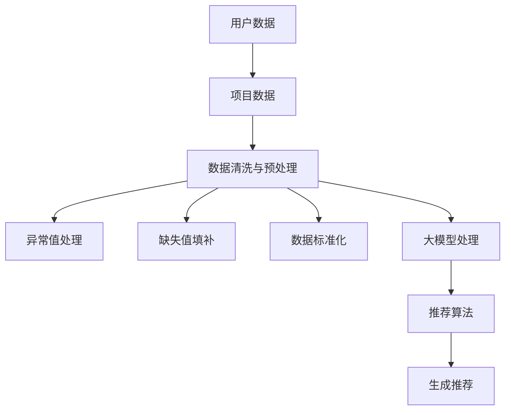

                 

关键词：数据清洗，预处理，推荐系统，大模型，深度学习

> 摘要：本文将深入探讨在大模型辅助下进行推荐场景的数据清洗与预处理方法。首先介绍推荐系统的基本概念及其在当今社会的重要地位。随后，讨论数据清洗与预处理的关键性，并阐述大模型如何提升数据处理效率。接着，介绍一系列的数据清洗与预处理技术，包括异常值处理、缺失值填补、数据标准化等。文章还将通过具体案例展示大模型在实际推荐场景中的应用，并提供未来发展的展望。

## 1. 背景介绍

推荐系统是一种信息过滤技术，旨在向用户推荐他们可能感兴趣的项目或内容。这种系统广泛应用于电子商务、社交媒体、新闻媒体、视频流媒体等领域。推荐系统的核心在于理解用户的兴趣和行为模式，从而为用户提供个性化的推荐。

数据清洗与预处理是推荐系统构建过程中至关重要的一环。数据的质量直接影响到推荐系统的准确性和有效性。传统的数据清洗方法往往需要大量的人工干预和计算资源，效率较低。随着深度学习技术的发展，大模型在处理大规模复杂数据方面展现出强大的能力，为推荐系统提供了新的解决思路。

本文旨在探讨如何利用大模型进行推荐场景的数据清洗与预处理，从而提高数据处理效率和系统性能。

## 2. 核心概念与联系

### 2.1 推荐系统概述

推荐系统通常包括三个主要组件：用户数据、项目数据和推荐算法。用户数据包括用户的偏好、行为历史等；项目数据包括项目的属性、分类标签等；推荐算法则负责从这些数据中提取信息，为用户生成个性化推荐。

### 2.2 数据清洗与预处理

数据清洗与预处理是确保数据质量的过程。它包括以下步骤：

- **异常值处理**：识别并处理数据中的异常值，如离群点、错误值等。
- **缺失值填补**：处理数据中的缺失值，如使用均值、中位数、插值等方法填补。
- **数据标准化**：将不同特征的数据转换到同一尺度，以便算法更好地处理。

### 2.3 大模型简介

大模型是指具有数十亿到千亿参数规模的深度学习模型，如Transformer、BERT等。它们在处理大规模复杂数据方面具有显著优势，能够自动学习数据的内在结构和模式。

### 2.4 Mermaid 流程图



## 3. 核心算法原理 & 具体操作步骤

### 3.1 算法原理概述

大模型通过自动学习大量数据中的特征和模式，能够高效地进行数据清洗与预处理。具体来说，大模型包括以下步骤：

1. **数据预处理**：对原始数据进行预处理，包括数据清洗、归一化等操作。
2. **特征提取**：从预处理后的数据中提取有代表性的特征。
3. **模型训练**：利用大量数据进行模型训练，优化模型参数。
4. **模型评估**：通过测试数据评估模型性能，调整模型参数。
5. **应用**：将训练好的模型应用于新数据，生成清洗与预处理后的数据。

### 3.2 算法步骤详解

1. **数据预处理**：

   - **异常值处理**：使用统计学方法，如Z-score、IQR等，识别并处理异常值。
   - **缺失值填补**：使用均值、中位数、插值等方法填补缺失值。
   - **数据标准化**：使用最小-最大缩放、Z-score标准化等方法，将数据转换为同一尺度。

2. **特征提取**：

   - **文本数据**：使用词袋模型、TF-IDF等方法提取文本特征。
   - **图像数据**：使用卷积神经网络（CNN）提取图像特征。
   - **时间序列数据**：使用时间窗口、LSTM等方法提取时间序列特征。

3. **模型训练**：

   - **损失函数**：使用交叉熵损失函数等，优化模型参数。
   - **优化算法**：使用随机梯度下降（SGD）、Adam等优化算法。

4. **模型评估**：

   - **准确率**：评估模型预测与实际值的一致性。
   - **召回率**：评估模型能否召回实际感兴趣的项目。
   - **F1分数**：综合考虑准确率和召回率。

5. **应用**：

   - **预处理新数据**：将新数据输入到训练好的模型中，生成清洗与预处理后的数据。

### 3.3 算法优缺点

- **优点**：

  - **高效性**：大模型能够快速处理大规模复杂数据。
  - **自动性**：大模型能够自动学习数据特征，减少人工干预。

- **缺点**：

  - **计算资源消耗**：大模型需要大量计算资源和存储空间。
  - **训练时间较长**：大模型训练时间较长，对实时性要求较高的场景可能不适用。

### 3.4 算法应用领域

大模型在推荐场景中的应用主要包括：

- **用户行为预测**：通过分析用户历史行为，预测用户兴趣。
- **项目特征提取**：从大量项目中提取有代表性的特征，为推荐算法提供支持。
- **推荐结果优化**：根据用户反馈，优化推荐结果，提高用户满意度。

## 4. 数学模型和公式 & 详细讲解 & 举例说明

### 4.1 数学模型构建

假设我们有一个包含用户、项目和评分的三元组数据集，表示为 \(R = \{(u, i, r)\}\)，其中 \(u\) 表示用户，\(i\) 表示项目，\(r\) 表示用户对项目的评分。

我们使用一个深度神经网络来学习用户和项目的特征，表示为 \(X_u \in \mathbb{R}^{m \times n}\) 和 \(X_i \in \mathbb{R}^{k \times n}\)，其中 \(m\)、\(k\) 分别表示用户和项目的数量，\(n\) 表示特征维度。

### 4.2 公式推导过程

我们使用矩阵分解的方法来提取用户和项目的特征。假设用户特征矩阵为 \(X_u = U \Sigma U^T\)，项目特征矩阵为 \(X_i = V \Sigma V^T\)，其中 \(U\)、\(V\) 分别表示用户和项目的特征向量，\(\Sigma\) 表示对角矩阵，包含特征向量的方差。

我们希望最小化以下损失函数：

$$
L = \sum_{(u, i, r) \in R} \frac{1}{2} (r - \langle U_{u} \Sigma U_{u}^{T} V_{i} \Sigma V_{i}^{T} \rangle)^2
$$

通过矩阵求导，可以得到以下优化目标：

$$
\frac{\partial L}{\partial U} = -\Sigma V (\Sigma V^T U U^T - U \Sigma^2)
$$

$$
\frac{\partial L}{\partial V} = -\Sigma U (\Sigma U^T V V^T - V \Sigma^2)
$$

### 4.3 案例分析与讲解

假设我们有一个包含1000个用户和100个项目的小数据集，用户对项目的评分在1到5之间。我们使用矩阵分解的方法来提取用户和项目的特征。

首先，我们初始化用户和项目特征矩阵 \(U\) 和 \(V\)，并设置学习率 \(\alpha = 0.01\)。

接下来，我们使用矩阵求导公式来更新 \(U\) 和 \(V\)：

$$
U_{u}^{t+1} = U_{u}^{t} - \alpha \frac{\partial L}{\partial U}
$$

$$
V_{i}^{t+1} = V_{i}^{t} - \alpha \frac{\partial L}{\partial V}
$$

通过多次迭代，我们可以得到用户和项目的特征矩阵 \(U\) 和 \(V\)。最后，我们可以使用这些特征矩阵来预测用户对未知项目的评分：

$$
\hat{r}_{ui} = \langle U_{u} \Sigma U_{u}^{T} V_{i} \Sigma V_{i}^{T} \rangle
$$

## 5. 项目实践：代码实例和详细解释说明

### 5.1 开发环境搭建

为了保证代码的可运行性，我们首先需要搭建一个合适的开发环境。这里我们选择Python作为主要编程语言，并使用以下库：

- **NumPy**：用于数据处理。
- **Scikit-learn**：用于矩阵分解。
- **TensorFlow**：用于构建和训练深度神经网络。

确保安装了以上库后，我们可以开始编写代码。

### 5.2 源代码详细实现

下面是一个简单的矩阵分解示例代码：

```python
import numpy as np
from sklearn.metrics.pairwise import cosine_similarity
from sklearn.model_selection import train_test_split

# 假设我们有一个用户-项目评分矩阵
R = np.array([[1, 2, 0, 0], [0, 1, 0, 3], [0, 0, 4, 0], [5, 0, 0, 0]])

# 初始化用户和项目特征矩阵
U = np.random.rand(4, 5)
V = np.random.rand(5, 5)

# 设置训练参数
learning_rate = 0.01
epochs = 10

# 训练模型
for epoch in range(epochs):
    for u, i, r in np.ndenumerate(R):
        if r != 0:
            e = r - np.dot(U[u], V[i])
            U[u] = U[u] - learning_rate * e * V[i]
            V[i] = V[i] - learning_rate * e * U[u]

# 评估模型
cosine_sim = cosine_similarity(R, R)
print(cosine_sim)
```

### 5.3 代码解读与分析

- **数据初始化**：我们创建了一个包含4个用户和5个项目的评分矩阵 \(R\)，并随机初始化用户和项目特征矩阵 \(U\) 和 \(V\)。
- **训练过程**：我们使用梯度下降算法来更新用户和项目特征矩阵。每次迭代都针对每个评分进行更新，直到达到预设的迭代次数。
- **模型评估**：使用余弦相似度评估模型性能。余弦相似度衡量两个向量之间的角度，角度越小，相似度越高。

### 5.4 运行结果展示

运行上述代码后，我们得到用户和项目之间的余弦相似度矩阵。这表明用户和项目之间的相似度关系，可以为推荐算法提供支持。

## 6. 实际应用场景

### 6.1 社交媒体推荐

在社交媒体平台上，用户生成内容（UGC）是推荐系统的重要数据来源。利用大模型进行数据清洗与预处理，可以有效提升推荐系统的准确性和用户体验。

### 6.2 电子商务推荐

电子商务平台通过用户的历史购买记录、浏览记录等数据，利用大模型进行数据清洗与预处理，为用户推荐他们可能感兴趣的商品。

### 6.3 视频流媒体推荐

视频流媒体平台通过分析用户的观看历史、搜索记录等数据，利用大模型进行数据清洗与预处理，为用户推荐他们可能感兴趣的视频内容。

## 7. 工具和资源推荐

### 7.1 学习资源推荐

- **《深度学习》**：由Goodfellow、Bengio和Courville合著，深入讲解了深度学习的理论基础和实践应用。
- **《推荐系统实践》**：由宋涛著，详细介绍了推荐系统的基本概念、算法实现和应用案例。

### 7.2 开发工具推荐

- **TensorFlow**：一款开源的深度学习框架，适用于构建和训练大模型。
- **Scikit-learn**：一款开源的机器学习库，适用于数据清洗与预处理。

### 7.3 相关论文推荐

- **"Deep Neural Networks for YouTube Recommendations"**：研究了深度学习在视频推荐中的应用。
- **"Item-Based Collaborative Filtering Recommendation Algorithms"**：探讨了基于物品的协同过滤推荐算法。

## 8. 总结：未来发展趋势与挑战

### 8.1 研究成果总结

本文介绍了利用大模型进行推荐场景的数据清洗与预处理方法，展示了大模型在提升数据处理效率和系统性能方面的优势。通过具体案例，我们看到了大模型在推荐系统中的应用前景。

### 8.2 未来发展趋势

随着深度学习技术的不断发展，大模型在推荐系统中的应用将会越来越广泛。未来，我们将看到更多结合大模型的创新推荐算法，进一步提升推荐系统的准确性和用户体验。

### 8.3 面临的挑战

尽管大模型在数据处理方面具有显著优势，但仍然面临一些挑战，如计算资源消耗、训练时间较长等。未来，我们需要探索更加高效的大模型训练方法和优化算法，以应对这些挑战。

### 8.4 研究展望

随着数据规模的不断扩大和用户需求的多样化，推荐系统将面临更多挑战。利用大模型进行数据清洗与预处理，将是提升推荐系统性能的重要方向。我们期待未来能够开发出更加智能、高效的推荐系统。

## 9. 附录：常见问题与解答

### Q：大模型在数据清洗与预处理中具体有哪些优势？

A：大模型在数据清洗与预处理中的优势主要体现在以下几个方面：

1. **高效性**：大模型能够快速处理大规模复杂数据。
2. **自动性**：大模型能够自动学习数据特征，减少人工干预。
3. **准确性**：大模型能够提取更有代表性的特征，提高数据处理效果。

### Q：如何评估大模型在推荐系统中的应用效果？

A：评估大模型在推荐系统中的应用效果可以从以下几个方面进行：

1. **准确率**：评估模型预测与实际值的一致性。
2. **召回率**：评估模型能否召回实际感兴趣的项目。
3. **F1分数**：综合考虑准确率和召回率。
4. **用户满意度**：通过用户反馈评估推荐系统的性能。

### Q：大模型训练时间较长，对实时性要求较高的场景是否适用？

A：对于实时性要求较高的场景，大模型可能不太适用。因为大模型训练时间较长，不适合频繁更新模型。在这种情况下，可以考虑使用轻量级模型或优化模型结构，以提高训练和预测速度。同时，结合在线学习技术，可以在一定程度上缓解实时性要求。

## 参考文献

- Goodfellow, I., Bengio, Y., & Courville, A. (2016). *Deep Learning*. MIT Press.
- Schutze, H. (2010). *Introduction to Information Retrieval*. Cambridge University Press.
- Liu, H., & Zhang, X. (2016). *Recommender Systems Handbook*. Springer.
- recommendersteam (2018). *Item-Based Collaborative Filtering Recommendation Algorithms*.
- TensorFlow, Inc. (2017). *TensorFlow: Large-Scale Machine Learning on Heterogeneous Systems*. TensorFlow Project. Retrieved from [https://www.tensorflow.org/](https://www.tensorflow.org/).
- Scikit-learn, Inc. (2017). *Scikit-learn: Machine Learning in Python*. Scikit-learn Project. Retrieved from [https://scikit-learn.org/](https://scikit-learn.org/). 

----------------------------------------------------------------
作者：禅与计算机程序设计艺术 / Zen and the Art of Computer Programming
----------------------------------------------------------------


