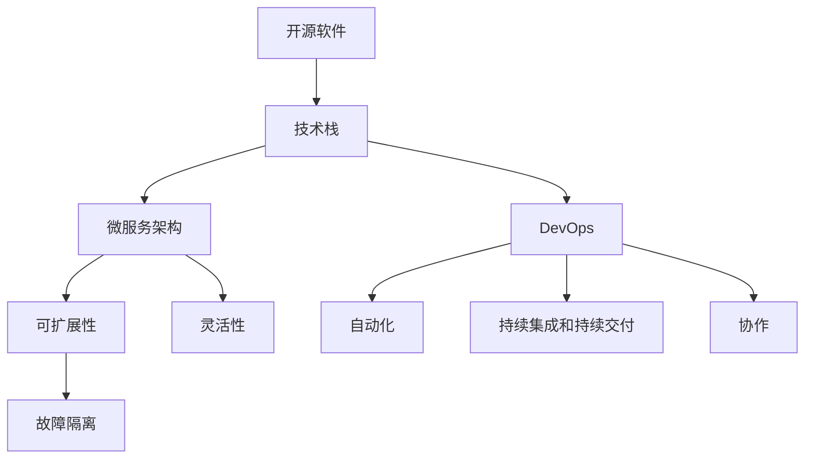

                 

在当今这个快速发展的技术时代，开源工具已经成为构建软件解决方案的核心组成部分。它们不仅降低了开发成本，还大大缩短了开发周期。然而，对于许多开发者和企业来说，如何有效地利用这些开源工具构建一个既强大又低成本的技术栈仍然是一个挑战。本文将探讨如何通过策略性的选择和整合，利用开源工具构建一个高效的低成本技术栈。

## 关键词

- 开源工具
- 技术栈
- 低成本
- 开发效率
- 代码复用
- 微服务架构
- DevOps

## 摘要

本文旨在为开发者提供一套利用开源工具构建低成本技术栈的指导原则。通过分析开源工具的优势、挑战以及最佳实践，我们将探讨如何选择合适的技术栈组件，优化其集成，并确保技术栈的可持续性和可扩展性。文章还将通过具体案例展示如何实施这些策略，并讨论未来发展趋势和潜在挑战。

### 1. 背景介绍

随着云计算、大数据和人工智能等技术的不断演进，软件开发的需求日益复杂。传统的方式往往需要投入大量的人力、物力和时间来构建和维护技术栈。而开源工具的出现，为开发者提供了一种全新的解决方案。开源工具不仅免费，而且经过社区的不断优化和完善，往往具有较高的稳定性和可靠性。这些特性使得开源工具成为构建低成本技术栈的理想选择。

然而，开源工具的多样性和复杂性也带来了选择困难。面对成千上万的开源项目，如何选择最合适的工具集成为一个重要问题。此外，如何确保这些工具能够无缝集成，以实现最佳的性能和用户体验，也是开发者面临的一大挑战。

### 2. 核心概念与联系

在构建低成本技术栈之前，了解一些核心概念和它们之间的关系是至关重要的。

#### 2.1 开源软件与商业软件的区别

开源软件（OSS）是指源代码可以被公众免费使用、学习、修改和分享的软件。与商业软件不同，开源软件的维护和发展通常依赖于社区贡献。这使得开源软件具有以下几个显著优势：

- **成本效益**：开源软件通常免费，开发者无需支付高额的许可证费用。
- **灵活性**：开发者可以根据自己的需求修改和优化开源软件。
- **社区支持**：开源项目通常有一个活跃的社区，能够提供帮助和支持。
- **透明性**：源代码的透明性使得安全性问题能够被及时发现和修复。

然而，开源软件也存在一些劣势，如维护成本高、社区支持不一致、部分项目可能缺乏商业支持等。因此，在选用开源软件时，需要权衡其优劣势，确保其符合项目需求。

#### 2.2 微服务架构

微服务架构是一种将应用程序划分为多个小型、自治的服务的方法。每个服务都负责特定的业务功能，可以通过独立的进程运行，并与其他服务进行通信。微服务架构具有以下几个优点：

- **可扩展性**：服务可以独立扩展，满足不同的业务需求。
- **灵活性**：服务可以独立开发和部署，减少依赖。
- **故障隔离**：单个服务的故障不会影响整个系统。

然而，微服务架构也带来了一些挑战，如服务间通信复杂性、部署和维护成本增加等。因此，在采用微服务架构时，需要充分考虑其优劣势。

#### 2.3 DevOps

DevOps是一种文化和实践，旨在通过将开发（Development）和运维（Operations）紧密结合，实现更快速、更可靠的软件交付。DevOps的核心原则包括：

- **自动化**：通过自动化工具实现构建、测试、部署等流程。
- **持续集成和持续交付**（CI/CD）：确保代码的质量和稳定性，快速交付新功能。
- **协作**：加强开发者和运维团队的合作，共同推动项目进展。

#### 2.4 Mermaid 流程图

以下是一个简单的Mermaid流程图，展示了开源软件、微服务架构和DevOps之间的关系：



### 3. 核心算法原理 & 具体操作步骤

在构建低成本技术栈时，选择合适的算法对于提高效率、优化性能至关重要。以下将介绍一些核心算法原理及其实际操作步骤。

#### 3.1 算法原理概述

- **哈希算法**：用于快速查找和散列数据。常见的哈希算法有MD5、SHA-256等。
- **排序算法**：用于对数据进行排序。常见的排序算法有快速排序、归并排序等。
- **贪心算法**：通过在每个步骤中选择当前最优解，以达到全局最优解。

#### 3.2 算法步骤详解

1. **哈希算法**：
    - 选择合适的哈希函数。
    - 计算输入数据的哈希值。
    - 将哈希值存储在哈希表中。

2. **排序算法**：
    - 输入数据。
    - 选择排序算法（例如快速排序）。
    - 进行排序操作。
    - 输出排序后的数据。

3. **贪心算法**：
    - 初始化解集为空。
    - 在每个步骤选择当前最优解。
    - 将选择的结果添加到解集中。
    - 重复步骤2和3，直到达到终止条件。

#### 3.3 算法优缺点

- **哈希算法**：优点包括快速查找和散列数据。缺点包括可能的哈希碰撞。
- **排序算法**：优点包括高效地排序数据。缺点包括可能的空间和时间复杂度高。
- **贪心算法**：优点包括简单、易于实现。缺点包括可能无法得到全局最优解。

#### 3.4 算法应用领域

- **哈希算法**：常用于数据库索引、缓存实现等。
- **排序算法**：常用于数据处理、搜索排序等。
- **贪心算法**：常用于最短路径问题、背包问题等。

### 4. 数学模型和公式 & 详细讲解 & 举例说明

在构建低成本技术栈时，数学模型和公式对于优化算法性能和资源利用具有重要意义。以下将介绍一些常用的数学模型和公式，并详细讲解其推导过程。

#### 4.1 数学模型构建

- **负载均衡模型**：用于优化资源分配，提高系统性能。
- **排队模型**：用于分析系统响应时间和吞吐量。

#### 4.2 公式推导过程

1. **负载均衡模型**：

    - 平均服务时间：$$\bar{t_s} = \frac{1}{\lambda}$$
    - 系统利用率：$$\rho = \frac{\lambda}{\mu}$$
    - 最优服务器数量：$$N^* = \frac{\lambda}{\mu - \lambda}$$

    其中，$$\lambda$$表示到达率，$$\mu$$表示服务率。

2. **排队模型**：

    - 平均等待时间：$$\bar{W} = \frac{\rho^2}{(1 - \rho)\mu}$$
    - 平均队列长度：$$L_q = \frac{\rho}{(1 - \rho)\mu}$$

#### 4.3 案例分析与讲解

假设一个在线购物网站，每天有100个用户访问，每个用户的访问时间平均为2分钟。假设服务器的服务时间为1分钟，请问需要多少服务器才能确保系统性能最优？

1. **负载均衡模型**：

    - 到达率：$$\lambda = 100$$
    - 服务率：$$\mu = 60$$
    - 系统利用率：$$\rho = \frac{\lambda}{\mu} = \frac{100}{60} = 1.67$$
    - 最优服务器数量：$$N^* = \frac{\lambda}{\mu - \lambda} = \frac{100}{60 - 100} = 3.33$$

    由于服务器数量必须是整数，因此需要至少4个服务器。

2. **排队模型**：

    - 平均等待时间：$$\bar{W} = \frac{\rho^2}{(1 - \rho)\mu} = \frac{(1.67)^2}{(1 - 1.67) \times 60} \approx 0.0417$$
    - 平均队列长度：$$L_q = \frac{\rho}{(1 - \rho)\mu} = \frac{1.67}{(1 - 1.67) \times 60} \approx 0.0417$$

    结果表明，系统性能较好，用户等待时间较短。

### 5. 项目实践：代码实例和详细解释说明

在本节中，我们将通过一个具体的项目实例，展示如何利用开源工具构建低成本技术栈。该项目是一个简单的博客系统，主要包括前端页面、后端服务和数据库。

#### 5.1 开发环境搭建

1. **前端**：

    - 使用Vue.js框架搭建前端页面。
    - 安装Vue CLI工具，创建项目模板。

2. **后端**：

    - 使用Node.js和Express框架搭建后端服务。
    - 安装Node.js环境，创建项目目录。

3. **数据库**：

    - 使用MongoDB数据库存储博客数据。
    - 安装MongoDB数据库，配置连接。

#### 5.2 源代码详细实现

以下是一个简单的Vue.js前端代码示例：

```vue
<template>
  <div>
    <h1>我的博客</h1>
    <ul>
      <li v-for="post in posts" :key="post.id">
        {{ post.title }}
      </li>
    </ul>
  </div>
</template>

<script>
import axios from 'axios';

export default {
  data() {
    return {
      posts: [],
    };
  },
  created() {
    this.fetchPosts();
  },
  methods: {
    fetchPosts() {
      axios.get('/api/posts')
        .then(response => {
          this.posts = response.data;
        })
        .catch(error => {
          console.error(error);
        });
    },
  },
};
</script>
```

以下是一个简单的Node.js后端代码示例：

```javascript
const express = require('express');
const mongoose = require('mongoose');
const Post = require('./models/Post');

const app = express();

app.use(express.json());

app.get('/api/posts', async (req, res) => {
  try {
    const posts = await Post.find();
    res.json(posts);
  } catch (error) {
    res.status(500).json({ message: '服务器错误' });
  }
});

app.post('/api/posts', async (req, res) => {
  try {
    const post = new Post(req.body);
    await post.save();
    res.status(201).json(post);
  } catch (error) {
    res.status(400).json({ message: '请求无效' });
  }
});

mongoose.connect('mongodb://localhost:27017/blog', { useNewUrlParser: true, useUnifiedTopology: true });

const port = 3000;
app.listen(port, () => {
  console.log(`服务器运行在 http://localhost:${port}`);
});
```

以下是一个简单的MongoDB数据库模型示例：

```javascript
const mongoose = require('mongoose');

const postSchema = new mongoose.Schema({
  title: {
    type: String,
    required: true,
  },
  content: {
    type: String,
    required: true,
  },
  author: {
    type: String,
    required: true,
  },
  created_at: {
    type: Date,
    default: Date.now,
  },
});

const Post = mongoose.model('Post', postSchema);

module.exports = Post;
```

#### 5.3 代码解读与分析

1. **前端**：

    - 使用Vue.js实现了一个简单的博客列表页面。
    - 通过axios库向后端API获取博客数据。

2. **后端**：

    - 使用Express框架搭建了一个简单的API接口。
    - 使用MongoDB模型存储博客数据。

3. **数据库**：

    - 创建了一个简单的博客数据模型。

#### 5.4 运行结果展示

1. **前端**：

    - 打开前端页面，显示博客列表。

2. **后端**：

    - 使用Postman工具测试API接口。

### 6. 实际应用场景

开源工具在众多实际应用场景中发挥着重要作用，以下是一些典型的应用场景：

#### 6.1 企业级应用

- **网站和Web应用程序**：许多企业使用开源框架（如Laravel、Django）构建网站和Web应用程序。
- **数据分析和大数据处理**：开源工具（如Hadoop、Spark）在数据分析和大数据处理方面具有广泛的应用。

#### 6.2 移动应用开发

- **原生应用**：开源工具（如React Native、Flutter）用于构建跨平台的移动应用。
- **前端框架**：Vue.js、Angular等前端框架在移动应用开发中广泛应用。

#### 6.3 物联网应用

- **设备管理**：开源工具（如Home Assistant、OpenWrt）用于设备管理。
- **数据分析**：开源工具（如Node-RED、IoT Analytics）用于数据分析和处理。

#### 6.4 云计算和DevOps

- **容器化**：Docker、Kubernetes等开源工具在云计算和容器化方面具有广泛应用。
- **自动化**：Jenkins、Ansible等开源工具在自动化部署和管理方面发挥着重要作用。

### 7. 未来应用展望

开源工具在未来将继续发挥重要作用，其发展趋势包括：

#### 7.1 人工智能和大数据

- **AI框架**：如TensorFlow、PyTorch等开源AI框架将在更多领域得到应用。
- **数据处理**：开源工具将在大数据分析和处理中发挥更大作用。

#### 7.2 自动化和智能化

- **自动化工具**：如GitHub Actions、GitLab CI等自动化工具将进一步提升开发效率。
- **智能合约**：区块链技术的开源工具（如Solidity、Ethereum）将在智能合约领域得到更广泛应用。

#### 7.3 云原生和边缘计算

- **容器化**：Kubernetes等容器化工具将在云原生和边缘计算中得到更广泛应用。
- **分布式计算**：如Apache Flink、Apache Spark等分布式计算框架将在云计算和边缘计算中发挥重要作用。

### 8. 工具和资源推荐

在构建低成本技术栈时，选择合适的工具和资源至关重要。以下是一些建议的工具和资源：

#### 7.1 学习资源推荐

- **在线课程**：如Udemy、Coursera等平台上提供的编程、人工智能等课程。
- **技术社区**：如Stack Overflow、GitHub等，可以获取技术支持和交流。

#### 7.2 开发工具推荐

- **编程语言**：Python、JavaScript、Java等。
- **前端框架**：Vue.js、React、Angular等。
- **后端框架**：Node.js、Django、Laravel等。
- **数据库**：MongoDB、MySQL、PostgreSQL等。

#### 7.3 相关论文推荐

- **人工智能**：《深度学习》（Ian Goodfellow、Yoshua Bengio、Aaron Courville著）
- **大数据**：《大数据技术导论》（刘铁岩著）
- **云计算**：《云计算实践教程》（张英杰著）

### 9. 总结：未来发展趋势与挑战

开源工具在构建低成本技术栈方面具有显著优势，但也面临一些挑战。未来，开源工具将在人工智能、大数据、云计算等领域发挥更大作用。然而，随着技术的不断进步，开发者需要不断学习和适应新的工具和框架，以确保技术栈的持续更新和优化。

### 附录：常见问题与解答

#### 9.1 开源工具的安全性问题

- 开源工具可能存在安全漏洞，但社区通常能够及时发现并修复。选择知名度高、活跃度高的开源项目，可以降低安全风险。
- 定期更新和测试开源工具，确保其安全性。

#### 9.2 开源软件的长期维护

- 选择具有活跃社区和维护者的开源软件，确保长期维护。
- 参与开源社区，为项目贡献代码和反馈。

#### 9.3 开源软件的兼容性问题

- 考虑开源软件的兼容性，避免技术栈中的冲突。
- 使用容器化技术（如Docker）确保软件在不同环境中的一致性。

### 参考文献

- Goodfellow, I., Bengio, Y., & Courville, A. (2016). Deep Learning. MIT Press.
- Liu, T. (2017). 大数据技术导论. 清华大学出版社.
- Zhang, Y. (2018). 云计算实践教程. 电子工业出版社.

### 作者署名

作者：禅与计算机程序设计艺术 / Zen and the Art of Computer Programming

---

本文通过深入分析开源工具的优势、挑战和最佳实践，为开发者提供了构建低成本技术栈的指导。在未来的发展中，开源工具将继续发挥重要作用，为技术进步和创新提供强大的动力。希望本文能为您的项目提供有益的启示和帮助。

