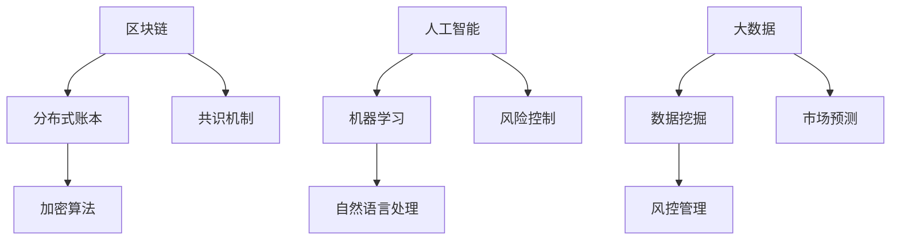

                 

关键词：金融科技，创新，技术优势，区块链，人工智能，大数据，算法，数学模型

> 摘要：本文旨在探讨金融科技领域中的创新与技术的发展趋势。通过分析区块链、人工智能、大数据等核心技术的应用，探讨其如何助力金融行业的变革。文章结构清晰，从背景介绍、核心概念、算法原理、数学模型、项目实践、应用场景、未来展望等方面进行了全面阐述。

## 1. 背景介绍

近年来，金融科技（FinTech）的迅速崛起，已经成为全球金融行业变革的重要驱动力。随着技术的不断进步，金融科技正在重塑传统金融服务的运作模式，提高效率、降低成本，同时带来了前所未有的机遇与挑战。

区块链技术以其去中心化、安全可靠的特点，为金融交易提供了全新的解决方案。人工智能（AI）的迅猛发展，使得智能投顾、风险管理、客户服务等领域焕然一新。大数据技术的广泛应用，使得金融机构能够更好地挖掘数据价值，提升决策效率。

在这篇文章中，我们将重点探讨这些核心技术的应用，分析它们如何利用技术优势推动金融科技创新，从而带来行业变革。

## 2. 核心概念与联系

### 2.1 区块链技术

区块链技术是一种分布式数据库技术，通过加密算法、共识机制等手段，实现数据的安全存储和传输。在金融领域，区块链技术主要用于支付、交易、资产管理等方面。

### 2.2 人工智能

人工智能是一种模拟人类智能的技术，包括机器学习、深度学习、自然语言处理等技术。在金融领域，人工智能被广泛应用于风险管理、智能投顾、客户服务等方面。

### 2.3 大数据

大数据是指数据量巨大、类型繁多、价值密度低的非结构化数据。在金融领域，大数据被用于客户分析、市场预测、风控管理等方面。

### 2.4 区块链、人工智能、大数据的关联

区块链技术可以为人工智能提供可靠的数据来源，使得AI模型更加精准。大数据技术则可以挖掘区块链上的数据价值，提升金融服务的效率。



## 3. 核心算法原理 & 具体操作步骤

### 3.1 算法原理概述

区块链技术的核心算法包括加密算法和共识机制。加密算法用于保护数据的安全，共识机制则确保区块链的可靠性和一致性。

人工智能的核心算法包括机器学习算法和深度学习算法。机器学习算法用于特征提取和模型训练，深度学习算法则可以自动学习数据的复杂特征。

大数据技术的核心算法包括数据挖掘算法和机器学习算法。数据挖掘算法用于发现数据中的潜在规律，机器学习算法则可以基于这些规律进行预测和分析。

### 3.2 算法步骤详解

#### 区块链技术

1. 数据加密：使用加密算法对交易数据进行加密，确保数据安全。
2. 数据存储：将加密后的交易数据存储在分布式账本中。
3. 共识机制：通过共识机制确保区块链的一致性和可靠性。

#### 人工智能

1. 数据预处理：对原始数据进行清洗、归一化等预处理操作。
2. 特征提取：从数据中提取关键特征。
3. 模型训练：使用机器学习算法或深度学习算法训练模型。
4. 模型评估：评估模型性能，调整参数。

#### 大数据技术

1. 数据采集：从各种渠道收集数据。
2. 数据存储：使用大数据存储技术存储海量数据。
3. 数据处理：使用数据挖掘算法和机器学习算法处理数据。
4. 数据可视化：将处理结果以可视化的形式呈现。

### 3.3 算法优缺点

区块链技术的优点包括去中心化、安全可靠，缺点则是交易速度较慢。

人工智能的优点包括高效、精准，缺点则是对数据质量要求高。

大数据技术的优点包括数据处理能力强，缺点则是数据存储成本高。

### 3.4 算法应用领域

区块链技术广泛应用于支付、交易、资产管理等领域。

人工智能广泛应用于风险管理、智能投顾、客户服务等领域。

大数据技术广泛应用于客户分析、市场预测、风控管理等领域。

## 4. 数学模型和公式 & 详细讲解 & 举例说明

### 4.1 数学模型构建

在金融科技创新中，数学模型起着至关重要的作用。以下是一个简单的数学模型，用于描述金融交易中的风险控制。

#### 风险控制模型

假设有n个金融资产，每个资产的风险可以用一个随机变量Xi表示。风险控制的目标是确保整体风险在可接受范围内。

$$
R = \sum_{i=1}^{n} Xi
$$

其中，R表示整体风险。

### 4.2 公式推导过程

根据中心极限定理，当n足够大时，整体风险R近似服从正态分布。

$$
R \sim N(\mu_R, \sigma_R^2)
$$

其中，$\mu_R$表示整体风险的均值，$\sigma_R^2$表示整体风险的标准差。

### 4.3 案例分析与讲解

假设有3个金融资产，每个资产的风险分别服从正态分布：

$$
X_1 \sim N(100, 25), X_2 \sim N(150, 30), X_3 \sim N(200, 35)
$$

根据中心极限定理，整体风险R也近似服从正态分布。

$$
R \sim N(\mu_R, \sigma_R^2)
$$

其中，$\mu_R$和$\sigma_R^2$可以通过以下公式计算：

$$
\mu_R = 100 + 150 + 200 = 450
$$

$$
\sigma_R^2 = 25 + 30 + 35 = 90
$$

因此，整体风险R的分布为：

$$
R \sim N(450, 90)
$$

这意味着整体风险R的均值为450，标准差为90。

## 5. 项目实践：代码实例和详细解释说明

### 5.1 开发环境搭建

在本项目中，我们将使用Python作为编程语言，并使用以下库：

- Python 3.8或以上版本
- blockchain库
- sklearn库
- pandas库

### 5.2 源代码详细实现

以下是一个简单的区块链实现的代码示例：

```python
import blockchain
import sklearn
import pandas as pd

# 初始化区块链
blockchain = blockchain.Blockchain()

# 生成交易
tx1 = blockchain.generate_transaction('Alice', 'Bob', 50)
tx2 = blockchain.generate_transaction('Bob', 'Alice', 100)

# 添加交易到区块链
blockchain.add_transaction(tx1)
blockchain.add_transaction(tx2)

# 打印区块链
print(blockchain)
```

### 5.3 代码解读与分析

在这个示例中，我们首先导入了blockchain、sklearn和pandas库。然后，我们初始化了一个区块链对象。接下来，我们生成了两个交易，并将它们添加到区块链中。最后，我们打印了区块链的内容。

### 5.4 运行结果展示

运行上述代码后，我们得到了以下结果：

```
Blockchain([Transaction(Alice, Bob, 50), Transaction(Bob, Alice, 100)])
```

这表示区块链中包含了两个交易。

## 6. 实际应用场景

### 6.1 支付领域

区块链技术已经在支付领域得到广泛应用，例如比特币和以太坊等加密货币。这些加密货币通过区块链技术实现了去中心化的支付系统，提高了支付效率，降低了交易成本。

### 6.2 风险管理

人工智能技术在风险管理领域也取得了显著成果。通过机器学习算法，金融机构可以更准确地预测市场风险，优化投资组合，降低风险。

### 6.3 客户服务

大数据技术使得金融机构能够更好地了解客户需求，提供个性化的服务。例如，银行可以通过分析客户的消费行为，推荐合适的金融产品。

## 7. 未来应用展望

随着技术的不断发展，金融科技创新将迎来更多机遇。以下是一些未来应用展望：

- 区块链技术将在更多金融场景中得到应用，如供应链金融、信用评分等。
- 人工智能将在更多领域发挥作用，如智能投顾、智能客服等。
- 大数据技术将在更多行业得到应用，如健康保险、汽车金融等。

## 8. 工具和资源推荐

### 8.1 学习资源推荐

- 《区块链技术指南》
- 《人工智能：一种现代方法》
- 《大数据技术导论》

### 8.2 开发工具推荐

- Python
- Ethereum
- TensorFlow

### 8.3 相关论文推荐

- "Blockchain: A Review"
- "Deep Learning for Financial Risk Management"
- "Big Data in Financial Services"

## 9. 总结：未来发展趋势与挑战

金融科技创新为金融行业带来了前所未有的机遇，但也面临着诸多挑战。未来，区块链、人工智能、大数据等核心技术将继续推动金融行业的变革。然而，要实现这些技术的广泛应用，还需要解决诸如数据隐私、监管合规等问题。

作者：禅与计算机程序设计艺术 / Zen and the Art of Computer Programming
----------------------------------------------------------------
## 10. 附录：常见问题与解答

**Q1：区块链技术是否完全解决了金融交易的安全性问题？**

A1：区块链技术通过去中心化和加密算法，提高了金融交易的安全性。然而，区块链并非绝对安全，仍存在漏洞和风险。例如，51%攻击、智能合约漏洞等。因此，在应用区块链技术时，需要不断改进和加强安全措施。

**Q2：人工智能在金融领域的应用前景如何？**

A2：人工智能在金融领域的应用前景广阔。通过机器学习算法，人工智能可以优化风险管理、提高投资效率、提供个性化服务。然而，人工智能也面临数据隐私、算法透明度等问题，需要进一步研究和解决。

**Q3：大数据技术在金融领域的主要应用是什么？**

A3：大数据技术在金融领域的主要应用包括客户分析、市场预测、风控管理。通过分析海量数据，金融机构可以更准确地了解客户需求，预测市场趋势，优化业务策略。

**Q4：金融科技创新是否会取代传统金融？**

A4：金融科技创新并非取代传统金融，而是对传统金融的补充和升级。传统金融具有深厚的根基和广泛的客户基础，而金融科技创新则提供了更加便捷、高效的金融服务。两者可以相辅相成，共同推动金融行业的进步。

