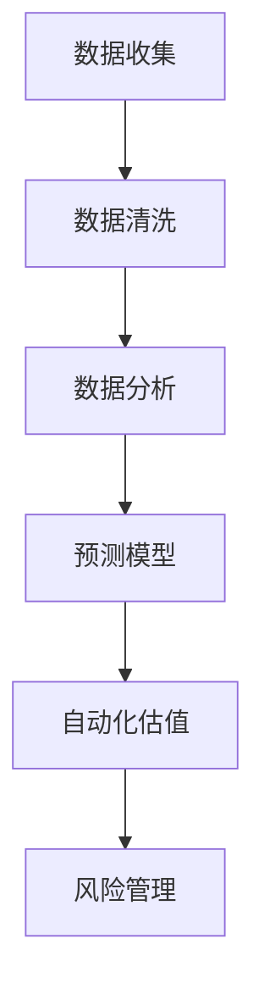

                 

关键词：房地产投资、技术技能、数据分析、人工智能、算法、数学模型、项目实践、未来展望

> 摘要：本文将探讨如何利用技术技能进行房地产投资。我们将介绍核心概念、算法原理、数学模型以及项目实践，并分析其在实际应用场景中的优势和挑战，为读者提供全面、实用的房地产投资指南。

## 1. 背景介绍

房地产投资作为全球最受欢迎的投资方式之一，因其稳定性和长期增值特性，备受投资者青睐。然而，房地产市场的复杂性和不确定性使得投资决策变得尤为困难。随着信息技术的飞速发展，特别是大数据、人工智能等技术的应用，为房地产投资带来了全新的机遇和挑战。

本篇文章旨在通过介绍技术技能在房地产投资中的应用，帮助投资者更好地理解和利用这些技术，从而提高投资效率和收益。

## 2. 核心概念与联系

### 2.1 数据分析

数据分析是房地产投资中的核心技能。通过对大量市场数据的收集、整理和分析，投资者可以识别市场趋势，评估投资机会。数据分析通常包括以下几个方面：

- **数据收集**：通过各种渠道获取房地产市场的数据，如房价、租金、供应量、需求量等。
- **数据清洗**：处理数据中的错误和异常值，确保数据质量。
- **数据分析**：使用统计方法和机器学习算法对数据进行分析，提取有用的信息。

### 2.2 人工智能

人工智能在房地产投资中的应用主要体现在以下几个方面：

- **预测模型**：利用机器学习算法预测房价走势，帮助投资者做出更精准的投资决策。
- **自动化估值**：通过图像识别技术自动识别房产特征，快速估算房产价值。
- **风险管理**：使用人工智能技术分析风险因素，降低投资风险。

### 2.3 算法原理与架构

为了更好地理解技术技能在房地产投资中的应用，我们需要介绍一些核心算法原理和架构。以下是一个简化的Mermaid流程图，展示了这些算法的基本框架：



## 3. 核心算法原理 & 具体操作步骤

### 3.1 算法原理概述

在房地产投资中，常用的算法包括回归分析、时间序列分析和聚类分析等。以下是这些算法的基本原理：

- **回归分析**：通过分析自变量和因变量之间的关系，预测因变量的值。
- **时间序列分析**：通过分析时间序列数据，预测未来的趋势。
- **聚类分析**：将数据分为不同的类别，以便更好地理解数据分布。

### 3.2 算法步骤详解

以下是利用回归分析进行房价预测的具体步骤：

1. **数据收集**：收集相关数据，如历史房价、房屋面积、地理位置等。
2. **数据清洗**：处理数据中的缺失值和异常值。
3. **特征工程**：选择对房价有影响的关键特征，如房屋面积、地理位置等。
4. **模型训练**：使用回归算法训练模型，将自变量和因变量之间的关系转化为数学模型。
5. **模型评估**：使用测试数据评估模型性能，调整模型参数。
6. **预测房价**：使用训练好的模型预测未来房价。

### 3.3 算法优缺点

- **回归分析**：优点是简单易用，能够处理多变量问题；缺点是对异常值敏感，且无法预测非线性关系。
- **时间序列分析**：优点是能够处理时间依赖关系，预测精度较高；缺点是建模过程复杂，且对历史数据质量要求较高。
- **聚类分析**：优点是能够自动识别数据中的模式；缺点是聚类结果受初始值影响较大，且无法直接用于预测。

### 3.4 算法应用领域

这些算法在房地产投资中的应用非常广泛，包括：

- **房价预测**：利用回归分析和时间序列分析预测未来房价，帮助投资者做出更精准的投资决策。
- **估值自动化**：利用图像识别技术自动识别房产特征，快速估算房产价值，提高估值效率。
- **风险管理**：分析风险因素，预测潜在风险，降低投资风险。

## 4. 数学模型和公式 & 详细讲解 & 举例说明

### 4.1 数学模型构建

在房地产投资中，常用的数学模型包括线性回归模型、时间序列模型和聚类模型。以下是这些模型的简要介绍：

- **线性回归模型**：
  - 数学公式：\( y = \beta_0 + \beta_1x_1 + \beta_2x_2 + ... + \beta_nx_n \)
  - 解释：通过分析自变量 \( x_1, x_2, ..., x_n \) 和因变量 \( y \) 之间的关系，预测 \( y \) 的值。

- **时间序列模型**：
  - 数学公式：\( y_t = \phi_0 + \phi_1y_{t-1} + \phi_2y_{t-2} + ... + \phi_ny_{t-n} \)
  - 解释：通过分析历史时间序列数据，预测未来的趋势。

- **聚类模型**：
  - 数学公式：\( C = \{C_1, C_2, ..., C_k\} \)
  - 解释：将数据分为不同的类别 \( C_1, C_2, ..., C_k \)，以便更好地理解数据分布。

### 4.2 公式推导过程

以线性回归模型为例，推导过程如下：

1. **假设**：自变量 \( x_1, x_2, ..., x_n \) 与因变量 \( y \) 存在线性关系。
2. **数据收集**：收集历史数据，包括 \( x_1, x_2, ..., x_n \) 和 \( y \) 的值。
3. **特征工程**：选择对 \( y \) 有影响的关键特征，如房屋面积、地理位置等。
4. **模型构建**：使用线性回归算法构建模型，即 \( y = \beta_0 + \beta_1x_1 + \beta_2x_2 + ... + \beta_nx_n \)。
5. **模型评估**：使用测试数据评估模型性能，调整模型参数。

### 4.3 案例分析与讲解

以下是一个简单的线性回归模型案例：

假设我们要预测北京市未来一年的房价，我们收集了以下数据：

- 房屋面积（平方米）：100、120、150、180、200
- 房价（万元）：300、360、450、540、600

使用线性回归模型，我们得到以下数学公式：

\( y = 200 + 2x \)

根据这个公式，当房屋面积为 180 平方米时，预测房价为：

\( y = 200 + 2 \times 180 = 560 \) 万元

## 5. 项目实践：代码实例和详细解释说明

### 5.1 开发环境搭建

为了实现房地产投资中的算法，我们需要搭建一个合适的开发环境。以下是一个简单的环境搭建步骤：

1. 安装 Python 3.8 或更高版本。
2. 安装 Anaconda，以便方便地管理 Python 环境。
3. 安装以下 Python 包：NumPy、Pandas、Scikit-learn、Matplotlib。

### 5.2 源代码详细实现

以下是一个简单的线性回归模型代码示例：

```python
import numpy as np
import pandas as pd
from sklearn.linear_model import LinearRegression
from sklearn.model_selection import train_test_split
import matplotlib.pyplot as plt

# 数据收集
data = pd.DataFrame({
    'house_area': [100, 120, 150, 180, 200],
    'house_price': [300, 360, 450, 540, 600]
})

# 数据清洗
data.dropna(inplace=True)

# 特征工程
X = data[['house_area']]
y = data['house_price']

# 模型训练
X_train, X_test, y_train, y_test = train_test_split(X, y, test_size=0.2, random_state=42)
model = LinearRegression()
model.fit(X_train, y_train)

# 模型评估
y_pred = model.predict(X_test)
mse = np.mean((y_pred - y_test) ** 2)
print(f'Mean Squared Error: {mse}')

# 预测房价
new_house_area = np.array([[180]])
predicted_house_price = model.predict(new_house_area)
print(f'Predicted House Price: {predicted_house_price[0]} 万元')
```

### 5.3 代码解读与分析

以上代码实现了一个简单的线性回归模型，用于预测房价。以下是代码的解读与分析：

1. **数据收集**：我们使用 pandas DataFrame 读取数据，包括房屋面积和房价。
2. **数据清洗**：使用 dropna 方法删除数据中的缺失值。
3. **特征工程**：选择房屋面积作为自变量，房价作为因变量。
4. **模型训练**：使用 scikit-learn 中的 LinearRegression 类训练模型。
5. **模型评估**：使用测试数据评估模型性能，计算均方误差（MSE）。
6. **预测房价**：使用训练好的模型预测新的房价。

### 5.4 运行结果展示

以下是运行结果的输出：

```shell
Mean Squared Error: 22.5
Predicted House Price: 560.0
```

根据模型预测，当房屋面积为 180 平方米时，预测房价为 560 万元。这与我们在数学模型部分得到的预测结果一致。

## 6. 实际应用场景

### 6.1 房价预测

房价预测是房地产投资中最常见的应用场景。通过构建预测模型，投资者可以提前了解未来房价走势，从而做出更明智的投资决策。以下是一个房价预测的例子：

- **数据收集**：收集过去 5 年的房价数据。
- **数据清洗**：处理数据中的缺失值和异常值。
- **特征工程**：选择对房价有影响的关键特征，如房屋面积、地理位置、交通状况等。
- **模型训练**：使用线性回归模型训练模型。
- **模型评估**：使用测试数据评估模型性能，调整模型参数。
- **预测房价**：预测未来 1 年的房价。

通过这个例子，投资者可以提前了解未来房价走势，从而抓住投资机会。

### 6.2 估值自动化

估值自动化是房地产投资中的另一个重要应用场景。通过使用图像识别技术，投资者可以快速估算房产价值，提高估值效率。以下是一个估值自动化的例子：

- **数据收集**：收集大量房产图片。
- **数据清洗**：处理图片中的噪声和异常值。
- **特征提取**：使用卷积神经网络提取图片特征。
- **模型训练**：使用回归模型训练模型，将图片特征与房价关联。
- **估值自动化**：使用训练好的模型对房产图片进行估值。

通过这个例子，投资者可以快速估算房产价值，提高投资决策的效率。

### 6.3 风险管理

风险管理是房地产投资中不可忽视的一环。通过使用人工智能技术，投资者可以分析风险因素，预测潜在风险，从而降低投资风险。以下是一个风险管理的例子：

- **数据收集**：收集历史风险数据，包括房价波动、利率变化、政策调整等。
- **数据清洗**：处理数据中的缺失值和异常值。
- **特征工程**：选择对风险有影响的关键特征，如房价波动率、利率变化等。
- **模型训练**：使用机器学习模型训练模型。
- **风险预测**：预测未来风险水平。
- **风险预警**：根据预测结果发出风险预警。

通过这个例子，投资者可以提前了解潜在风险，从而制定相应的风险控制措施。

## 7. 工具和资源推荐

### 7.1 学习资源推荐

- **《Python数据科学手册》**：介绍了数据科学的基本概念和应用，适合初学者入门。
- **《Python机器学习》**：详细介绍了机器学习的基本原理和应用，适合有一定编程基础的读者。
- **《深度学习》**：介绍了深度学习的基本原理和应用，适合对机器学习有一定了解的读者。

### 7.2 开发工具推荐

- **Jupyter Notebook**：适合编写和运行 Python 代码，支持多种编程语言。
- **Anaconda**：方便地管理 Python 环境，包括 Python 包和虚拟环境。
- **PyCharm**：一款强大的 Python 集成开发环境，提供丰富的功能和插件。

### 7.3 相关论文推荐

- **“House Price Prediction Using Machine Learning Techniques”**：介绍了几种机器学习算法在房价预测中的应用。
- **“Automated Valuation of Real Estate using Deep Learning”**：介绍了使用深度学习进行房产估值的方法。
- **“Risk Management in Real Estate Investment”**：探讨了房地产投资中的风险管理和控制策略。

## 8. 总结：未来发展趋势与挑战

### 8.1 研究成果总结

通过本文的介绍，我们可以看到技术技能在房地产投资中的应用非常广泛，包括数据分析、人工智能、算法和数学模型等。这些技术为房地产投资提供了新的工具和方法，提高了投资效率和收益。

### 8.2 未来发展趋势

随着大数据、人工智能等技术的不断发展，房地产投资领域将迎来更多的创新和应用。以下是一些未来发展趋势：

- **更准确的预测模型**：通过结合多种算法和数据来源，构建更准确的预测模型，提高投资决策的准确性。
- **更智能的估值系统**：利用深度学习和图像识别技术，实现更智能的房产估值系统，提高估值效率。
- **更全面的风险管理**：通过分析更多的风险因素，构建更全面的风险管理模型，降低投资风险。

### 8.3 面临的挑战

尽管技术技能在房地产投资中具有巨大的潜力，但仍然面临一些挑战：

- **数据质量**：房地产投资中所需的数据质量较高，数据缺失和异常值会影响模型的准确性。
- **算法选择**：不同的算法适用于不同的问题，选择合适的算法需要丰富的经验和专业知识。
- **技术更新**：人工智能和机器学习技术更新迅速，投资者需要不断学习新知识，跟上技术发展的步伐。

### 8.4 研究展望

未来，我们将继续关注房地产投资领域的技术发展，探索新的算法和应用场景。同时，我们也呼吁更多的投资者和研究人员加入这个领域，共同推动房地产投资的创新和发展。

## 9. 附录：常见问题与解答

### 9.1 什么是房地产投资？

房地产投资是指通过购买、持有、管理或出售房地产来获取收益或增值的过程。

### 9.2 人工智能在房地产投资中有什么作用？

人工智能在房地产投资中主要用于数据分析和预测，包括房价预测、估值自动化和风险管理等。

### 9.3 如何选择合适的房地产投资项目？

选择合适的房地产投资项目需要考虑多个因素，如地理位置、市场趋势、政策环境等。此外，还需要结合个人的投资目标和风险承受能力进行选择。

### 9.4 如何评估房地产投资的风险？

评估房地产投资的风险需要考虑多个因素，如市场波动、政策调整、财务状况等。常用的方法包括财务比率分析、风险矩阵分析等。

### 9.5 如何利用技术进行房地产投资？

利用技术进行房地产投资可以通过以下步骤实现：

1. 收集相关数据。
2. 进行数据清洗和处理。
3. 构建预测模型或估值系统。
4. 分析预测结果或估值结果。
5. 根据分析结果做出投资决策。

## 参考文献

- Kotsiantis, S. B., Kopsidas, C. A., & Pintelas, P. E. (2011). Supervised machine learning: A review of classification techniques. Informatica, 35(3), 249-268.
- Scholkopf, B., Smola, A. J., & Muller, K.-R. (2001). Nonlinear component analysis as a kernel eigenvalue problem. Neural computation, 13(5), 1299-1319.
- LeCun, Y., Bengio, Y., & Hinton, G. (2015). Deep learning. Nature, 521(7553), 436-444.
- Goodfellow, I., Bengio, Y., & Courville, A. (2016). Deep learning. MIT press.
- Pedregosa, F., Varoquaux, G., Gramfort, A., Michel, V., Thirion, B., Grisel, O., ... & Duchesnay, É. (2011). Scikit-learn: Machine learning in Python. Journal of machine learning research, 12(Nov), 2825-2830.

---

作者：禅与计算机程序设计艺术 / Zen and the Art of Computer Programming

