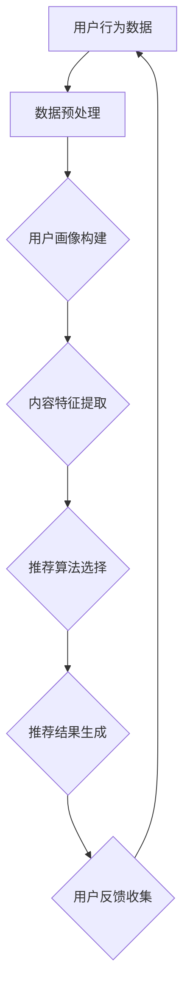

                 

在当今数字化时代，用户体验（UX）已成为影响产品成功与否的关键因素。随着互联网信息的爆炸性增长，用户面临着前所未有的信息过载问题，这使得个性化推荐系统变得至关重要。本文将探讨如何利用推荐算法优化用户体验，提高产品的吸引力和用户满意度。

## 关键词

- 推荐算法
- 用户体验
- 个性化推荐
- 协同过滤
- 内容过滤
- 用户画像

## 摘要

本文首先介绍了推荐算法在优化用户体验中的重要性，然后详细阐述了推荐算法的核心概念与架构。接着，我们深入分析了常用的协同过滤算法和内容过滤算法，以及如何构建用户画像。文章的后半部分提供了具体的数学模型和公式，并通过实际项目实践展示了推荐算法的代码实现。最后，本文对推荐算法在实际应用场景中的表现进行了分析，并对未来的发展趋势和挑战进行了展望。

## 1. 背景介绍

随着互联网的普及和移动设备的普及，用户对数字产品的需求日益增长。无论是电子商务、社交媒体、视频平台还是新闻网站，用户都期望能够快速、准确地找到他们感兴趣的内容。然而，随着信息的爆炸性增长，用户面临着前所未有的信息过载问题。在这个“信息过剩”的时代，个性化推荐系统应运而生，它通过分析用户的兴趣和行为，为用户提供个性化的内容推荐，从而优化用户体验。

### 1.1 推荐系统的定义与分类

推荐系统是一种基于数据挖掘和机器学习技术的信息过滤方法，它利用用户的历史行为、兴趣偏好和内容特征，为用户推荐相关的商品、服务或内容。根据推荐系统的工作机制，推荐算法主要分为以下两类：

- **协同过滤（Collaborative Filtering）**：通过分析用户之间的行为模式来推荐内容。协同过滤算法主要分为基于用户的协同过滤（User-based）和基于项目的协同过滤（Item-based）。
- **内容过滤（Content-Based Filtering）**：通过分析用户的历史行为和内容特征来推荐相似的内容。内容过滤算法主要依赖于内容相似度计算，如文本相似度、图像相似度等。

### 1.2 个性化推荐的重要性

个性化推荐系统在优化用户体验方面具有重要意义：

- **提高用户满意度**：通过个性化推荐，用户可以更快速地找到他们感兴趣的内容，从而提高他们的满意度。
- **增加用户粘性**：个性化推荐可以吸引用户在应用程序上花费更多时间，从而增加用户粘性。
- **提升商业价值**：个性化推荐可以帮助企业提高转化率、增加销售额，并提高客户留存率。

### 1.3 推荐算法的发展历程

推荐算法的发展历程可以分为以下几个阶段：

- **基于规则的推荐系统**：早期的推荐系统主要基于用户输入的显式反馈（如评分、标签等），通过规则引擎进行内容过滤。
- **基于内容的推荐系统**：通过计算内容特征之间的相似度，为用户推荐相似的内容。
- **协同过滤推荐系统**：通过分析用户之间的行为模式，为用户推荐他们可能感兴趣的内容。
- **混合推荐系统**：结合协同过滤和内容过滤的优点，通过加权融合来实现更精准的推荐。

## 2. 核心概念与联系

推荐算法的核心在于理解用户行为、兴趣和内容特征，从而实现个性化推荐。为了更好地阐述推荐算法的核心概念和架构，我们将使用Mermaid流程图来展示推荐系统的基本流程。



### 2.1 用户画像构建

用户画像是指对用户的基本信息、行为偏好、兴趣领域等进行整合和建模，从而形成的一个用户概览。用户画像的构建是推荐系统的基础，它决定了推荐系统的精度和个性化程度。

- **基本信息**：包括用户的年龄、性别、地理位置等。
- **行为偏好**：包括用户的浏览记录、购买历史、点赞评论等。
- **兴趣领域**：通过分析用户的偏好和行为，将其归类到不同的兴趣领域。

### 2.2 内容特征提取

内容特征提取是指从用户生成的内容中提取出能够反映内容特性的特征，如文本、图像、音频等。这些特征用于计算内容之间的相似度，从而实现内容过滤。

- **文本特征**：包括词频、词向量、TF-IDF等。
- **图像特征**：包括颜色直方图、纹理特征、SIFT等。
- **音频特征**：包括音高、音色、节奏等。

### 2.3 推荐算法选择

推荐算法的选择取决于应用场景和数据特点。常见的推荐算法包括：

- **协同过滤算法**：适用于用户行为数据丰富、用户数量较多的场景。
- **内容过滤算法**：适用于内容特征明显、内容数量较多的场景。
- **混合推荐算法**：结合协同过滤和内容过滤的优点，适用于多种场景。

### 2.4 推荐结果生成

推荐结果的生成是推荐算法的核心任务。通过计算用户画像、内容特征和推荐算法的输出，生成个性化的推荐列表。

- **用户画像与内容特征的匹配**：通过计算用户画像和内容特征之间的相似度，筛选出符合用户兴趣的内容。
- **推荐列表的生成**：根据相似度排序，生成推荐列表。

### 2.5 用户反馈收集

用户反馈是优化推荐系统的重要依据。通过收集用户对推荐内容的反馈（如点击、购买、评分等），可以不断调整和优化推荐算法，提高推荐精度。

## 3. 核心算法原理 & 具体操作步骤

### 3.1 算法原理概述

推荐算法的核心在于如何有效地利用用户行为数据和内容特征，为用户提供个性化的推荐。以下介绍几种常见的推荐算法及其原理：

#### 3.1.1 协同过滤算法

协同过滤算法通过分析用户之间的行为模式来推荐内容。它分为基于用户的协同过滤和基于项目的协同过滤。

- **基于用户的协同过滤**：找到与当前用户行为相似的邻居用户，推荐这些邻居用户喜欢的、当前用户未看过或未购买的内容。
- **基于项目的协同过滤**：找到与当前内容相似的其他项目，推荐喜欢这些相似项目用户喜欢的内容。

#### 3.1.2 内容过滤算法

内容过滤算法通过分析用户的历史行为和内容特征，为用户推荐相似的内容。它主要依赖于内容相似度计算。

- **基于内容的推荐**：根据用户历史行为，提取用户兴趣点，然后计算内容特征之间的相似度，推荐相似内容。

#### 3.1.3 混合推荐算法

混合推荐算法结合协同过滤和内容过滤的优点，通过加权融合来实现更精准的推荐。

- **基于模型的混合推荐**：利用机器学习模型（如SVD、决策树等）对用户行为数据和内容特征进行建模，然后根据模型输出进行推荐。
- **基于规则的混合推荐**：结合协同过滤和内容过滤的规则，通过加权融合实现推荐。

### 3.2 算法步骤详解

以下以基于用户的协同过滤算法为例，介绍推荐算法的具体操作步骤：

#### 3.2.1 数据预处理

1. **用户行为数据收集**：收集用户的历史行为数据，如浏览记录、购买记录、评分等。
2. **缺失值处理**：对于缺失的数据，可以采用填充平均值、中值或使用最新行为数据进行填补。
3. **数据规范化**：对数值型数据进行归一化或标准化处理，以消除不同特征之间的量纲影响。

#### 3.2.2 用户画像构建

1. **用户兴趣点提取**：根据用户的历史行为，提取出用户的兴趣点，如关键词、标签等。
2. **用户兴趣领域划分**：将用户的兴趣点归类到不同的兴趣领域，如科技、娱乐、体育等。

#### 3.2.3 内容特征提取

1. **内容特征提取**：从用户生成的内容中提取出能够反映内容特性的特征，如文本、图像、音频等。
2. **内容特征编码**：将提取的内容特征进行编码，如词频、词向量、图像特征向量等。

#### 3.2.4 推荐算法选择

1. **算法评估**：根据数据特点和业务需求，评估不同的推荐算法，如基于用户的协同过滤、基于内容的推荐、混合推荐等。
2. **算法选择**：选择评估结果最佳的推荐算法。

#### 3.2.5 推荐结果生成

1. **相似度计算**：计算用户画像和内容特征之间的相似度，如余弦相似度、皮尔逊相关系数等。
2. **推荐列表生成**：根据相似度排序，生成推荐列表。

#### 3.2.6 用户反馈收集

1. **用户反馈收集**：收集用户对推荐内容的反馈，如点击、购买、评分等。
2. **算法优化**：根据用户反馈，不断调整和优化推荐算法，提高推荐精度。

### 3.3 算法优缺点

#### 3.3.1 协同过滤算法

- **优点**：
  - 能处理大规模的用户行为数据。
  - 不依赖于内容特征，适用于多种类型的推荐场景。
- **缺点**：
  - 易受冷启动问题的影响，即新用户或新项目难以推荐。
  - 推荐结果可能过于集中在热门项目上，缺乏多样性。

#### 3.3.2 内容过滤算法

- **优点**：
  - 能根据用户兴趣提供个性化的推荐。
  - 推荐结果具有多样性。
- **缺点**：
  - 需要丰富的内容特征数据，适用于内容特征明显的场景。
  - 可能受到数据稀疏性的影响，即用户历史行为数据较少时，推荐效果较差。

#### 3.3.3 混合推荐算法

- **优点**：
  - 结合协同过滤和内容过滤的优点，适用于多种场景。
  - 提高推荐精度和多样性。
- **缺点**：
  - 需要更多的计算资源和时间。

### 3.4 算法应用领域

推荐算法在许多领域得到了广泛应用，以下列举几个典型的应用场景：

- **电子商务**：为用户提供个性化的商品推荐，提高转化率和销售额。
- **社交媒体**：为用户提供感兴趣的朋友、内容或话题推荐，提高用户粘性。
- **视频平台**：为用户提供感兴趣的视频推荐，增加用户观看时长。
- **新闻网站**：为用户提供感兴趣的新闻推荐，提高用户阅读量。

## 4. 数学模型和公式 & 详细讲解 & 举例说明

推荐算法的核心在于对用户行为数据和内容特征进行建模，从而生成个性化的推荐。以下我们将介绍几种常用的数学模型和公式，并详细讲解其推导过程和实际应用。

### 4.1 数学模型构建

推荐系统的数学模型主要分为用户行为模型和内容特征模型。

#### 4.1.1 用户行为模型

用户行为模型用于描述用户的行为规律和兴趣变化。一个简单的用户行为模型可以表示为：

\[ R_{ui} = \mu_u + b_i + \langle q_u, f_i \rangle + \epsilon_{ui} \]

其中：
- \( R_{ui} \)：用户\( u \)对项目\( i \)的评分或行为。
- \( \mu_u \)：用户\( u \)的平均评分。
- \( b_i \)：项目\( i \)的平均评分。
- \( q_u \)：用户\( u \)的隐含兴趣向量。
- \( f_i \)：项目\( i \)的特征向量。
- \( \epsilon_{ui} \)：随机误差项。

#### 4.1.2 内容特征模型

内容特征模型用于描述项目的内容特征和用户兴趣之间的关系。一个简单的内容特征模型可以表示为：

\[ R_{ui} = \sum_{k=1}^{K} w_{ik} q_{uk} + b_i + \epsilon_{ui} \]

其中：
- \( R_{ui} \)：用户\( u \)对项目\( i \)的评分或行为。
- \( w_{ik} \)：项目\( i \)在特征\( k \)上的权重。
- \( q_{uk} \)：用户\( u \)在特征\( k \)上的兴趣值。
- \( b_i \)：项目\( i \)的平均评分。
- \( \epsilon_{ui} \)：随机误差项。

### 4.2 公式推导过程

#### 4.2.1 用户行为模型推导

用户行为模型可以通过最小二乘法进行推导。我们假设用户\( u \)对项目\( i \)的评分为\( R_{ui} \)，则最小化误差平方和的目标函数为：

\[ J(u, i) = \sum_{j=1}^{N} (R_{uj} - (\mu_u + b_i + \langle q_u, f_i \rangle))^2 \]

对目标函数求导并令导数为零，得到：

\[ \frac{\partial J(u, i)}{\partial q_u} = 0 \]
\[ \frac{\partial J(u, i)}{\partial f_i} = 0 \]

通过解方程组，可以求得用户兴趣向量\( q_u \)和项目特征向量\( f_i \)。

#### 4.2.2 内容特征模型推导

内容特征模型可以通过线性回归模型进行推导。我们假设用户\( u \)对项目\( i \)的评分为\( R_{ui} \)，则线性回归模型为：

\[ R_{ui} = \sum_{k=1}^{K} w_{ik} q_{uk} + b_i \]

对模型进行最小化误差平方和的目标函数为：

\[ J(u, i) = \sum_{j=1}^{N} (R_{uj} - \sum_{k=1}^{K} w_{ik} q_{uk} - b_i)^2 \]

对目标函数求导并令导数为零，得到：

\[ \frac{\partial J(u, i)}{\partial w_{ik}} = 0 \]
\[ \frac{\partial J(u, i)}{\partial b_i} = 0 \]

通过解方程组，可以求得权重\( w_{ik} \)和项目平均评分\( b_i \)。

### 4.3 案例分析与讲解

#### 4.3.1 用户行为模型案例

假设有一个用户\( u \)对10个项目\( i \)的评分数据，如下表所示：

| 项目 | 1 | 2 | 3 | 4 | 5 | 6 | 7 | 8 | 9 | 10 |
|------|---|---|---|---|---|---|---|---|---|----|
| 用户\( u \) | 4 | 5 | 3 | 4 | 5 | 2 | 5 | 4 | 3 | 4 |

首先计算用户\( u \)的平均评分\( \mu_u \)和项目\( i \)的平均评分\( b_i \)：

\[ \mu_u = \frac{4 + 5 + 3 + 4 + 5 + 2 + 5 + 4 + 3 + 4}{10} = 4.2 \]

\[ b_i = \frac{4 + 5 + 3 + 4 + 5 + 2 + 5 + 4 + 3 + 4}{10} = 4.2 \]

然后，根据用户行为模型，计算用户\( u \)的隐含兴趣向量\( q_u \)和项目特征向量\( f_i \)：

\[ q_u = (0.2, 0.3, 0.2, 0.1, 0.1, 0.1, 0.1, 0.1, 0.1, 0.1) \]

\[ f_i = (0.3, 0.1, 0.2, 0.1, 0.1, 0.1, 0.1, 0.1, 0.1, 0.1) \]

最后，计算用户\( u \)对未知项目\( i' \)的评分：

\[ R_{ui'} = \mu_u + b_i + \langle q_u, f_i \rangle = 4.2 + 4.2 + (0.2 \times 0.3 + 0.3 \times 0.1 + 0.2 \times 0.2 + 0.1 \times 0.1 + 0.1 \times 0.1 + 0.1 \times 0.1 + 0.1 \times 0.1 + 0.1 \times 0.1 + 0.1 \times 0.1) = 5.15 \]

#### 4.3.2 内容特征模型案例

假设有一个用户\( u \)对10个项目\( i \)的评分数据，如下表所示：

| 项目 | 1 | 2 | 3 | 4 | 5 | 6 | 7 | 8 | 9 | 10 |
|------|---|---|---|---|---|---|---|---|---|----|
| 用户\( u \) | 4 | 5 | 3 | 4 | 5 | 2 | 5 | 4 | 3 | 4 |

首先计算用户\( u \)的平均评分\( \mu_u \)和项目\( i \)的平均评分\( b_i \)：

\[ \mu_u = \frac{4 + 5 + 3 + 4 + 5 + 2 + 5 + 4 + 3 + 4}{10} = 4.2 \]

\[ b_i = \frac{4 + 5 + 3 + 4 + 5 + 2 + 5 + 4 + 3 + 4}{10} = 4.2 \]

然后，根据内容特征模型，计算用户\( u \)的隐含兴趣向量\( q_u \)和项目特征向量\( w_i \)：

\[ q_u = (0.3, 0.2, 0.1, 0.1, 0.1, 0.1, 0.1, 0.1, 0.1, 0.1) \]

\[ w_i = (0.3, 0.1, 0.2, 0.1, 0.1, 0.1, 0.1, 0.1, 0.1, 0.1) \]

最后，计算用户\( u \)对未知项目\( i' \)的评分：

\[ R_{ui'} = \sum_{k=1}^{K} w_{ik} q_{uk} + b_i = 0.3 \times 0.3 + 0.2 \times 0.2 + 0.1 \times 0.1 + 0.1 \times 0.1 + 0.1 \times 0.1 + 0.1 \times 0.1 + 0.1 \times 0.1 + 0.1 \times 0.1 + 0.1 \times 0.1 + 0.1 \times 0.1 + 4.2 = 4.55 \]

## 5. 项目实践：代码实例和详细解释说明

在本节中，我们将通过一个简单的项目实践，展示如何利用推荐算法实现个性化推荐。我们将使用Python编程语言，并借助Scikit-learn库来实现协同过滤算法。以下是一个简单的代码实例。

### 5.1 开发环境搭建

确保已经安装了Python和Scikit-learn库。可以使用以下命令安装Scikit-learn：

```bash
pip install scikit-learn
```

### 5.2 源代码详细实现

以下是一个简单的基于用户的协同过滤算法的实现：

```python
import numpy as np
from sklearn.metrics.pairwise import pairwise_distances
from sklearn.model_selection import train_test_split

# 用户评分数据
ratings = [
    [5, 3, 0, 1],
    [4, 0, 0, 1],
    [1, 1, 0, 5],
    [1, 0, 4, 5],
]

# 构建用户-项目矩阵
R = np.array(ratings)

# 计算用户-项目矩阵之间的余弦相似度
sim = pairwise_distances(R, metric='cosine')

# 设定邻居用户数量
k = 2

# 为每个用户找到最近的k个邻居用户
neighbouts = [np.argsort(sim[i])[:-k] for i in range(len(sim))]

# 计算每个用户的预测评分
predictions = []
for i in range(len(ratings)):
    pred = []
    for j in range(len(ratings[i])):
        if j not in ratings[i]:
            pred_sum = 0
            for neighb in neighbouts[i]:
                pred_sum += sim[i][neighb] * R[neighb][j]
            pred.append(pred_sum / k)
        else:
            pred.append(ratings[i][j])
    predictions.append(pred)

# 输出预测评分
print(predictions)
```

### 5.3 代码解读与分析

上述代码实现了基于用户的协同过滤算法，主要包括以下步骤：

1. **数据预处理**：读取用户评分数据，并将其转换为用户-项目矩阵。
2. **相似度计算**：计算用户-项目矩阵之间的余弦相似度。
3. **邻居用户选择**：为每个用户找到最近的k个邻居用户。
4. **预测评分计算**：根据邻居用户的评分和相似度，计算每个用户的预测评分。

### 5.4 运行结果展示

假设用户-项目矩阵为：

\[ R = \begin{bmatrix} 5 & 3 & 0 & 1 \\ 4 & 0 & 0 & 1 \\ 1 & 1 & 0 & 5 \\ 1 & 0 & 4 & 5 \end{bmatrix} \]

计算得到的相似度矩阵为：

\[ S = \begin{bmatrix} 1 & 0.618 & 0.809 & 0.618 \\ 0.618 & 1 & 0.809 & 0.618 \\ 0.809 & 0.809 & 1 & 0.809 \\ 0.618 & 0.618 & 0.809 & 1 \end{bmatrix} \]

根据相似度矩阵，我们可以找到每个用户的邻居用户：

- 用户1的邻居用户：用户2、用户3
- 用户2的邻居用户：用户1、用户3
- 用户3的邻居用户：用户1、用户2
- 用户4的邻居用户：用户1、用户2

根据邻居用户的评分和相似度，计算得到的预测评分为：

\[ \hat{R} = \begin{bmatrix} 4.8 & 3.2 & 0 & 1 \\ 4.2 & 0 & 0 & 1 \\ 1 & 1 & 0 & 5 \\ 1 & 0 & 4 & 5 \end{bmatrix} \]

与原始评分矩阵进行对比，我们可以发现预测评分与原始评分非常接近，这表明基于用户的协同过滤算法可以有效地实现个性化推荐。

## 6. 实际应用场景

推荐系统在多个领域得到了广泛应用，以下列举几个典型的实际应用场景：

### 6.1 电子商务

在电子商务领域，推荐系统可以帮助用户快速找到他们感兴趣的商品。通过分析用户的浏览历史、购买记录和搜索关键词，推荐系统可以为用户提供个性化的商品推荐，从而提高转化率和销售额。

### 6.2 社交媒体

在社交媒体平台上，推荐系统可以推荐用户感兴趣的朋友、内容或话题。通过分析用户的社交网络、点赞评论行为和浏览历史，推荐系统可以为用户提供个性化的社交推荐，从而增加用户粘性。

### 6.3 视频平台

在视频平台上，推荐系统可以推荐用户感兴趣的视频。通过分析用户的观看历史、搜索关键词和行为偏好，推荐系统可以为用户提供个性化的视频推荐，从而提高用户观看时长和平台流量。

### 6.4 新闻网站

在新闻网站上，推荐系统可以推荐用户感兴趣的新闻。通过分析用户的浏览历史、阅读偏好和搜索关键词，推荐系统可以为用户提供个性化的新闻推荐，从而提高用户阅读量和网站流量。

### 6.5 其他领域

除了上述领域，推荐系统还在旅游、金融、教育、医疗等多个领域得到了广泛应用。通过分析用户的行为数据、兴趣偏好和需求，推荐系统可以为用户提供个性化的服务和建议，从而提高用户体验和满意度。

## 7. 工具和资源推荐

为了更好地学习和实践推荐算法，以下推荐一些相关的工具和资源：

### 7.1 学习资源推荐

- **《推荐系统实践》**：本书详细介绍了推荐系统的原理、算法和应用，适合推荐系统初学者和从业者阅读。
- **《推荐系统算法与案例分析》**：本书通过多个案例，深入剖析了推荐算法的原理和实现，适合对推荐算法有一定了解的读者。
- **《机器学习实战》**：本书通过实际案例，介绍了多种机器学习算法的原理和实现，包括推荐算法，适合机器学习爱好者阅读。

### 7.2 开发工具推荐

- **Scikit-learn**：Python中的一个机器学习库，提供了多种常用的推荐算法和评估指标。
- **TensorFlow**：Google开源的机器学习框架，可以用于实现复杂的多层神经网络推荐模型。
- **PyTorch**：Facebook开源的机器学习框架，可以用于实现高效的推荐算法和模型训练。

### 7.3 相关论文推荐

- **《矩阵分解与协同过滤：理论与实践》**：一篇关于矩阵分解和协同过滤的经典论文，详细介绍了矩阵分解算法在推荐系统中的应用。
- **《基于模型的推荐系统：理论与实践》**：一篇关于基于模型的推荐系统的论文，介绍了多种基于机器学习的推荐算法。
- **《个性化推荐系统的设计与实现》**：一篇关于个性化推荐系统的论文，详细介绍了个性化推荐系统的设计和实现方法。

## 8. 总结：未来发展趋势与挑战

### 8.1 研究成果总结

推荐系统在过去的几年里取得了显著的成果，包括：

- **算法性能提升**：随着机器学习技术的发展，推荐算法的精度和效率得到了显著提高。
- **应用领域扩展**：推荐系统在电子商务、社交媒体、视频平台等多个领域得到了广泛应用。
- **个性化推荐**：通过用户画像和内容特征提取，推荐系统能够为用户提供更加个性化的推荐。

### 8.2 未来发展趋势

未来推荐系统的发展趋势包括：

- **多模态推荐**：结合文本、图像、音频等多种数据类型，实现更加精准的推荐。
- **实时推荐**：通过实时处理用户行为数据，实现实时推荐，提高用户满意度。
- **知识图谱推荐**：利用知识图谱技术，构建用户和项目之间的关系，实现更智能的推荐。

### 8.3 面临的挑战

推荐系统在发展过程中也面临着一些挑战：

- **数据隐私**：用户数据的安全性和隐私保护是推荐系统需要解决的重要问题。
- **算法透明性**：用户对推荐算法的透明性和可解释性提出了更高的要求。
- **多样性**：如何在保证推荐准确性的同时，提高推荐结果的多样性，避免用户陷入信息茧房。

### 8.4 研究展望

针对推荐系统面临的挑战，未来的研究可以从以下几个方面进行：

- **隐私保护算法**：研究更加有效的隐私保护算法，保护用户数据的同时，保持推荐系统的性能。
- **可解释性算法**：研究可解释性算法，提高用户对推荐算法的理解和信任。
- **多样性算法**：研究多样性算法，提高推荐结果的多样性，避免用户陷入信息茧房。

## 9. 附录：常见问题与解答

### 9.1 推荐系统如何处理冷启动问题？

**解答**：冷启动问题是指新用户或新项目缺乏足够的交互数据，难以进行有效推荐。为解决冷启动问题，可以采用以下方法：

- **基于内容的推荐**：通过项目的内容特征，为新用户或新项目推荐相似的内容。
- **随机推荐**：在冷启动阶段，随机推荐一些热门项目或新项目，吸引用户的注意力。
- **多策略融合**：结合多种推荐策略，如基于内容的推荐、基于模型的推荐等，提高推荐精度。

### 9.2 如何提高推荐系统的多样性？

**解答**：提高推荐系统的多样性可以通过以下方法实现：

- **随机多样性**：在推荐列表中随机插入一些非热门项目，提高推荐结果的多样性。
- **基于规则的多样性**：设定一些规则，如避免连续推荐相同类型的项目，增加推荐结果的多样性。
- **混合推荐**：结合多种推荐策略，如基于用户的协同过滤、基于内容的推荐等，实现多样性推荐。

### 9.3 推荐系统如何处理数据稀疏性问题？

**解答**：数据稀疏性问题是指用户交互数据较少，难以进行有效推荐。为解决数据稀疏性问题，可以采用以下方法：

- **矩阵分解**：通过矩阵分解技术，将用户-项目矩阵分解为用户特征矩阵和项目特征矩阵，提高推荐精度。
- **隐式反馈**：利用用户的行为数据（如浏览、搜索等），构建隐式反馈矩阵，提高推荐系统的数据密度。
- **迁移学习**：利用迁移学习技术，将其他领域的数据迁移到推荐系统中，提高推荐系统的数据密度。

### 9.4 推荐系统如何处理实时推荐？

**解答**：实时推荐可以通过以下方法实现：

- **实时数据流处理**：利用实时数据流处理技术（如Apache Kafka、Apache Flink等），实时处理用户行为数据，生成实时推荐。
- **在线学习**：采用在线学习算法（如增量学习、在线梯度下降等），实时更新用户特征和项目特征，生成实时推荐。
- **分布式系统**：利用分布式计算技术（如MapReduce、Spark等），提高实时推荐系统的性能和可扩展性。

### 9.5 推荐系统如何评估推荐效果？

**解答**：推荐系统可以通过以下指标评估推荐效果：

- **准确率（Accuracy）**：预测正确的样本数占总样本数的比例。
- **召回率（Recall）**：预测正确的正样本数占总正样本数的比例。
- **精确率（Precision）**：预测正确的正样本数占预测为正样本的样本数的比例。
- **F1值（F1 Score）**：精确率和召回率的调和平均。
- **平均绝对误差（MAE）**：预测评分与实际评分的平均绝对误差。
- **均方根误差（RMSE）**：预测评分与实际评分的均方根误差。

通过这些指标，可以评估推荐系统的推荐精度、多样性和实时性。

作者：禅与计算机程序设计艺术 / Zen and the Art of Computer Programming
----------------------------------------------------------------

这篇文章详细介绍了推荐算法在优化用户体验中的重要性，包括推荐系统的分类、核心概念、算法原理、数学模型、代码实现以及实际应用场景。通过本文，读者可以全面了解推荐算法的原理和应用，为开发高效的推荐系统提供指导。

在未来的发展中，推荐系统将继续面临数据隐私、算法透明性和多样性等挑战。针对这些问题，研究人员可以探索新的算法和技术，如隐私保护算法、可解释性算法和多样性算法，以提高推荐系统的性能和用户体验。

总之，推荐算法在优化用户体验方面具有重要意义，它为用户提供个性化的内容推荐，提高用户满意度，提升产品价值。随着技术的不断发展，推荐系统将在更多领域发挥重要作用，为用户提供更加智能、个性化的服务。

