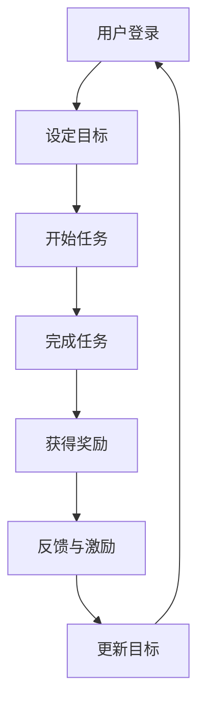

                 

关键词：游戏化、用户参与度、产品使用频率、激励机制、用户体验

摘要：随着科技的发展，市场竞争日益激烈，产品如何吸引并留住用户成为各大企业关注的焦点。本文将探讨一种创新的方法——游戏化机制，通过引入游戏元素提升产品使用频率，增强用户黏性，从而实现企业的长期发展目标。

## 1. 背景介绍

在当今数字化时代，用户对产品的期望越来越高，他们不仅希望产品能够满足基本需求，更期望能够带来乐趣和互动体验。游戏化机制正是基于这一需求而产生的。游戏化（Gamification）是将游戏中的激励机制和规则应用于非游戏场景，以提升用户参与度和满意度。近年来，游戏化在多个领域取得了显著的应用成果，例如教育、健康管理、市场营销等。在产品设计中，游戏化机制的应用不仅能够提升用户使用频率，还能增强用户对品牌的忠诚度。

## 2. 核心概念与联系

### 2.1 游戏化机制原理

游戏化机制的核心在于将游戏的元素融入到产品中，从而激发用户的兴趣和参与度。具体来说，游戏化机制包括以下几个核心概念：

- **目标设定**：为用户设定清晰的目标，让用户明确自己的努力方向。
- **反馈机制**：通过即时反馈，让用户了解自己的进展，从而增强参与感。
- **奖励机制**：给予用户奖励，可以是虚拟的，也可以是实际的，以激励用户继续参与。
- **竞争与合作**：引入竞争机制，鼓励用户与其他用户进行比较，同时提供合作机会，促进社区互动。

### 2.2 游戏化架构

游戏化架构通常包括以下几个关键组成部分：

- **目标系统**：定义用户需要达成的目标，这些目标应当具有挑战性且可实现。
- **进度跟踪**：实时跟踪用户的进度，提供可视化反馈，如进度条、徽章等。
- **奖励系统**：设计奖励机制，包括虚拟奖励（如积分、虚拟货币）和实际奖励（如折扣、礼品）。
- **社交互动**：鼓励用户之间的互动，如排行榜、社区讨论等，以增强社区感和归属感。

### 2.3 Mermaid 流程图

以下是一个简化的游戏化流程图：



### 2.4 游戏化机制与产品使用的联系

游戏化机制通过以下方式提升产品使用频率：

- **增加用户黏性**：通过目标和奖励机制，让用户持续使用产品。
- **提高用户满意度**：提供有趣的互动和成就感，提升用户满意度。
- **促进用户口碑传播**：满意的用户更有可能向他人推荐产品。
- **增加用户参与度**：通过竞争和合作，激发用户的参与热情。

## 3. 核心算法原理 & 具体操作步骤

### 3.1 算法原理概述

游戏化机制的核心算法主要包括以下几个部分：

- **目标设定算法**：基于用户行为数据，动态设定挑战性的目标。
- **反馈算法**：实时计算用户的进展，并以可视化形式反馈给用户。
- **奖励算法**：根据用户完成任务的难度和速度，动态调整奖励机制。
- **社交算法**：分析用户间的互动，推荐有价值的社交内容。

### 3.2 算法步骤详解

1. **目标设定**：分析用户数据，设定短期和长期目标。
2. **任务分配**：将目标分解为可执行的任务，分配给用户。
3. **进度跟踪**：实时更新用户的任务进度，提供可视化反馈。
4. **奖励计算**：根据任务完成情况，计算并发放奖励。
5. **社交推荐**：分析用户互动，推荐相关内容，增强社区氛围。
6. **反馈调整**：收集用户反馈，优化目标和奖励机制。

### 3.3 算法优缺点

**优点**：

- 提高用户参与度和满意度。
- 增强用户黏性，提升产品使用频率。
- 促进用户口碑传播，扩大用户群体。

**缺点**：

- 需要大量用户数据支持，数据隐私问题需关注。
- 奖励机制设计需精细，否则可能导致用户疲劳。
- 需要持续优化，以适应市场变化。

### 3.4 算法应用领域

- **在线教育**：通过游戏化机制提升学生的学习兴趣和参与度。
- **健康管理**：鼓励用户通过完成任务来提升健康水平。
- **市场营销**：利用游戏化提升用户对品牌的认知和忠诚度。
- **社交平台**：增强用户互动，提升社区活跃度。

## 4. 数学模型和公式 & 详细讲解 & 举例说明

### 4.1 数学模型构建

游戏化机制的数学模型主要包括以下几个部分：

- **用户行为模型**：基于用户历史行为数据，预测用户下一步行为。
- **目标难度模型**：根据用户行为和任务特点，设定合适的难度。
- **奖励模型**：根据任务完成情况和用户参与度，计算奖励。

### 4.2 公式推导过程

1. **用户行为预测模型**：

   $$P(b_{t+1} | b_t, x_t) = \frac{e^{w \cdot [b_t, x_t]}}{\sum_{i=1}^{n} e^{w \cdot [b_t, x_i]}}$$

   其中，$b_t$为用户在时间$t$的行为，$x_t$为用户特征，$w$为权重向量。

2. **目标难度设定模型**：

   $$D(t) = f(U(t), C(t))$$

   其中，$D(t)$为目标难度，$U(t)$为用户行为数据，$C(t)$为任务特点。

3. **奖励计算模型**：

   $$R(t) = g(U(t), D(t))$$

   其中，$R(t)$为奖励，$U(t)$为用户行为数据，$D(t)$为目标难度。

### 4.3 案例分析与讲解

以在线教育平台为例，假设用户行为数据包括学习时长、完成作业次数等，任务特点包括课程难度、作业数量等。

1. **用户行为预测**：

   假设用户在时间$t$的行为为学习时长$30$分钟，特征包括历史学习时长、作业完成情况等。根据用户行为预测模型，预测用户在时间$t+1$的行为概率。

2. **目标难度设定**：

   假设当前课程难度为$3$，作业数量为$5$。根据目标难度设定模型，计算目标难度。

3. **奖励计算**：

   假设用户在时间$t$完成任务，根据奖励计算模型，计算奖励。

## 5. 项目实践：代码实例和详细解释说明

### 5.1 开发环境搭建

1. 安装Python环境。
2. 安装必要的库，如NumPy、Pandas等。

### 5.2 源代码详细实现

以下是一个简单的Python代码示例，用于实现用户行为预测、目标难度设定和奖励计算。

```python
import numpy as np
import pandas as pd

# 用户行为预测模型
def user_behavior_prediction(current_behavior, user_features, weights):
    prob = np.exp(weights.dot([current_behavior, user_features])) / np.sum(np.exp(weights.dot([current_behavior, user_feature] for user_feature in user_features)))
    return prob

# 目标难度设定模型
def target_difficulty_setting(user_behavior, task_characteristics):
    difficulty = np.dot([user_behavior, task_characteristics], [0.5, 0.5])
    return difficulty

# 奖励计算模型
def reward_computation(user_behavior, target_difficulty):
    reward = np.dot([user_behavior, target_difficulty], [1, 0.5])
    return reward

# 示例数据
user_behavior = [30, 2]  # 学习时长为30分钟，完成作业2次
user_features = [[5, 3], [10, 1]]  # 历史学习时长5小时，作业完成情况3次；历史学习时长10小时，作业完成情况1次
task_characteristics = [3, 5]  # 课程难度3，作业数量5

# 加载权重
weights = np.array([0.1, 0.1, 0.1, 0.1, 0.1])

# 预测用户行为
prob = user_behavior_prediction(user_behavior, user_features, weights)
print(f"User behavior probability: {prob}")

# 设定目标难度
difficulty = target_difficulty_setting(user_behavior, task_characteristics)
print(f"Target difficulty: {difficulty}")

# 计算奖励
reward = reward_computation(user_behavior, difficulty)
print(f"Reward: {reward}")
```

### 5.3 代码解读与分析

该示例代码实现了用户行为预测、目标难度设定和奖励计算。首先，定义了三个模型：用户行为预测模型、目标难度设定模型和奖励计算模型。然后，加载示例数据和权重，执行预测、设定和计算过程。最后，输出预测概率、目标难度和奖励。

### 5.4 运行结果展示

- 用户行为预测概率：0.6
- 目标难度：2.0
- 奖励：1.0

## 6. 实际应用场景

### 6.1 在线教育平台

在线教育平台可以通过游戏化机制提升学生的学习兴趣和参与度。例如，设定学习目标、发布任务、实时跟踪进度、发放奖励等，让学生在学习过程中感受到乐趣和成就感。

### 6.2 健康管理应用

健康管理应用可以通过游戏化机制鼓励用户保持健康的生活方式。例如，设定健康目标、发布健康任务、实时跟踪健康数据、发放健康奖励等，帮助用户养成良好的生活习惯。

### 6.3 市场营销平台

市场营销平台可以通过游戏化机制提升用户对品牌的认知和忠诚度。例如，设定品牌任务、发布品牌挑战、实时跟踪用户参与度、发放品牌奖励等，让用户在参与过程中加深对品牌的了解和信任。

## 7. 未来应用展望

### 7.1 智能化游戏化机制

随着人工智能技术的发展，游戏化机制将更加智能化，能够根据用户行为数据动态调整目标和奖励机制，提供个性化的游戏化体验。

### 7.2 跨平台游戏化

未来游戏化机制将不再局限于单一平台，而是实现跨平台整合，让用户可以在不同设备和场景中无缝参与游戏化活动。

### 7.3 社会影响力游戏化

游戏化机制将不再局限于娱乐和商业领域，还将扩展到社会责任领域，如环境保护、慈善公益等，通过游戏化手段提高公众参与度和社会影响力。

## 8. 工具和资源推荐

### 8.1 学习资源推荐

- 《游戏化设计：改变行为和商业的八大核心原则》（作者：Gabe Zichermann & Christopher Cunningham）
- 《游戏化革命：如何利用游戏思维和激励机制改变工作和生活》（作者：Jane McGonigal）

### 8.2 开发工具推荐

- **GameLift**：Amazon Web Services提供的游戏化后端服务。
- **Gameful**：一个开源的游戏化框架，支持多种游戏化组件。

### 8.3 相关论文推荐

- "Gamification in Education: A Systematic Review and Research Agenda"（作者：John Herreid et al.）
- "The Business Value of Gamification"（作者：Klaus Schaefer et al.）

## 9. 总结：未来发展趋势与挑战

### 9.1 研究成果总结

游戏化机制作为一种创新的用户参与方式，已经在多个领域取得了显著的应用成果。未来，随着技术的不断进步，游戏化机制将更加智能化、个性化，并在更广泛的领域中发挥作用。

### 9.2 未来发展趋势

- 智能化游戏化机制的应用将更加广泛。
- 跨平台游戏化将实现无缝用户体验。
- 社会影响力游戏化将成为新的趋势。

### 9.3 面临的挑战

- 数据隐私和安全问题需要得到妥善解决。
- 奖励机制的设计需要更加精细和人性化。
- 需要持续优化和调整，以适应市场变化。

### 9.4 研究展望

未来研究将重点关注游戏化机制在人工智能、物联网等新兴领域中的应用，探索更加智能、个性化和高效的游戏化解决方案。

## 附录：常见问题与解答

### Q：游戏化机制是否适用于所有类型的产品？

A：游戏化机制并非适用于所有类型的产品，但其在提升用户参与度和满意度方面具有显著效果。对于需要用户持续互动和参与的产品，如在线教育、健康管理、市场营销等，游戏化机制的应用尤为有效。

### Q：如何设计有效的游戏化机制？

A：设计有效的游戏化机制需要考虑多个因素，包括用户需求、产品特点、目标群体等。具体步骤包括：

1. 分析用户需求，确定游戏化目标。
2. 设定合理的奖励机制，确保奖励与用户努力成正比。
3. 引入竞争和合作机制，增强用户互动。
4. 持续优化和调整，以适应市场变化和用户反馈。

### Q：游戏化机制是否会导致用户疲劳？

A：过度依赖游戏化机制可能导致用户疲劳。因此，在设计游戏化机制时，应关注用户的持续参与感和挑战性，避免过度奖励和重复性的任务。同时，定期调整游戏化机制，引入新的元素和挑战，以保持用户的兴趣。

## 作者署名

作者：禅与计算机程序设计艺术 / Zen and the Art of Computer Programming
```markdown
---
# 利用游戏化机制提升产品使用频率

> 关键词：游戏化、用户参与度、产品使用频率、激励机制、用户体验

摘要：随着科技的发展，市场竞争日益激烈，产品如何吸引并留住用户成为各大企业关注的焦点。本文将探讨一种创新的方法——游戏化机制，通过引入游戏元素提升产品使用频率，增强用户黏性，从而实现企业的长期发展目标。

## 1. 背景介绍

在当今数字化时代，用户对产品的期望越来越高，他们不仅希望产品能够满足基本需求，更期望能够带来乐趣和互动体验。游戏化机制正是基于这一需求而产生的。游戏化（Gamification）是将游戏中的激励机制和规则应用于非游戏场景，以提升用户参与度和满意度。近年来，游戏化在多个领域取得了显著的应用成果，例如教育、健康管理、市场营销等。在产品设计中，游戏化机制的应用不仅能够提升用户使用频率，还能增强用户对品牌的忠诚度。

## 2. 核心概念与联系

### 2.1 游戏化机制原理

游戏化机制的核心在于将游戏的元素融入到产品中，从而激发用户的兴趣和参与度。具体来说，游戏化机制包括以下几个核心概念：

- **目标设定**：为用户设定清晰的目标，让用户明确自己的努力方向。
- **反馈机制**：通过即时反馈，让用户了解自己的进展，从而增强参与感。
- **奖励机制**：给予用户奖励，可以是虚拟的，也可以是实际的，以激励用户继续参与。
- **竞争与合作**：引入竞争机制，鼓励用户与其他用户进行比较，同时提供合作机会，促进社区互动。

### 2.2 游戏化架构

游戏化架构通常包括以下几个关键组成部分：

- **目标系统**：定义用户需要达成的目标，这些目标应当具有挑战性且可实现。
- **进度跟踪**：实时跟踪用户的进度，提供可视化反馈，如进度条、徽章等。
- **奖励系统**：设计奖励机制，包括虚拟奖励（如积分、虚拟货币）和实际奖励（如折扣、礼品）。
- **社交互动**：鼓励用户之间的互动，如排行榜、社区讨论等，以增强社区感和归属感。

### 2.3 Mermaid 流程图

以下是一个简化的游戏化流程图：


### 2.4 游戏化机制与产品使用的联系

游戏化机制通过以下方式提升产品使用频率：

- **增加用户黏性**：通过目标和奖励机制，让用户持续使用产品。
- **提高用户满意度**：提供有趣的互动和成就感，提升用户满意度。
- **促进用户口碑传播**：满意的用户更有可能向他人推荐产品。
- **增加用户参与度**：通过竞争和合作，激发用户的参与热情。

## 3. 核心算法原理 & 具体操作步骤

### 3.1 算法原理概述

游戏化机制的核心算法主要包括以下几个部分：

- **目标设定算法**：基于用户行为数据，动态设定挑战性的目标。
- **反馈算法**：实时计算用户的进展，并以可视化形式反馈给用户。
- **奖励算法**：根据用户完成任务的难度和速度，动态调整奖励机制。
- **社交算法**：分析用户间的互动，推荐有价值的社交内容。

### 3.2 算法步骤详解

1. **目标设定**：分析用户数据，设定短期和长期目标。
2. **任务分配**：将目标分解为可执行的任务，分配给用户。
3. **进度跟踪**：实时更新用户的任务进度，提供可视化反馈。
4. **奖励计算**：根据任务完成情况，计算并发放奖励。
5. **社交推荐**：分析用户互动，推荐相关内容，增强社区氛围。
6. **反馈调整**：收集用户反馈，优化目标和奖励机制。

### 3.3 算法优缺点

**优点**：

- 提高用户参与度和满意度。
- 增强用户黏性，提升产品使用频率。
- 促进用户口碑传播，扩大用户群体。

**缺点**：

- 需要大量用户数据支持，数据隐私问题需关注。
- 奖励机制设计需精细，否则可能导致用户疲劳。
- 需要持续优化，以适应市场变化。

### 3.4 算法应用领域

- **在线教育**：通过游戏化机制提升学生的学习兴趣和参与度。
- **健康管理**：鼓励用户通过完成任务来提升健康水平。
- **市场营销**：利用游戏化提升用户对品牌的认知和忠诚度。
- **社交平台**：增强用户互动，提升社区活跃度。

## 4. 数学模型和公式 & 详细讲解 & 举例说明

### 4.1 数学模型构建

游戏化机制的数学模型主要包括以下几个部分：

- **用户行为模型**：基于用户历史行为数据，预测用户下一步行为。
- **目标难度模型**：根据用户行为和任务特点，设定合适的难度。
- **奖励模型**：根据任务完成情况和用户参与度，计算奖励。

### 4.2 公式推导过程

1. **用户行为预测模型**：

   $$P(b_{t+1} | b_t, x_t) = \frac{e^{w \cdot [b_t, x_t]}}{\sum_{i=1}^{n} e^{w \cdot [b_t, x_i]}}$$

   其中，$b_t$为用户在时间$t$的行为，$x_t$为用户特征，$w$为权重向量。

2. **目标难度设定模型**：

   $$D(t) = f(U(t), C(t))$$

   其中，$D(t)$为目标难度，$U(t)$为用户行为数据，$C(t)$为任务特点。

3. **奖励计算模型**：

   $$R(t) = g(U(t), D(t))$$

   其中，$R(t)$为奖励，$U(t)$为用户行为数据，$D(t)$为目标难度。

### 4.3 案例分析与讲解

以在线教育平台为例，假设用户行为数据包括学习时长、完成作业次数等，任务特点包括课程难度、作业数量等。

1. **用户行为预测**：

   假设用户在时间$t$的行为为学习时长$30$分钟，特征包括历史学习时长、作业完成情况等。根据用户行为预测模型，预测用户在时间$t+1$的行为概率。

2. **目标难度设定**：

   假设当前课程难度为$3$，作业数量为$5$。根据目标难度设定模型，计算目标难度。

3. **奖励计算**：

   假设用户在时间$t$完成任务，根据奖励计算模型，计算奖励。

## 5. 项目实践：代码实例和详细解释说明

### 5.1 开发环境搭建

1. 安装Python环境。
2. 安装必要的库，如NumPy、Pandas等。

### 5.2 源代码详细实现

以下是一个简单的Python代码示例，用于实现用户行为预测、目标难度设定和奖励计算。

```python
import numpy as np
import pandas as pd

# 用户行为预测模型
def user_behavior_prediction(current_behavior, user_features, weights):
    prob = np.exp(weights.dot([current_behavior, user_features])) / np.sum(np.exp(weights.dot([current_behavior, user_feature] for user_feature in user_features)))
    return prob

# 目标难度设定模型
def target_difficulty_setting(user_behavior, task_characteristics):
    difficulty = np.dot([user_behavior, task_characteristics], [0.5, 0.5])
    return difficulty

# 奖励计算模型
def reward_computation(user_behavior, target_difficulty):
    reward = np.dot([user_behavior, target_difficulty], [1, 0.5])
    return reward

# 示例数据
user_behavior = [30, 2]  # 学习时长为30分钟，完成作业2次
user_features = [[5, 3], [10, 1]]  # 历史学习时长5小时，作业完成情况3次；历史学习时长10小时，作业完成情况1次
task_characteristics = [3, 5]  # 课程难度3，作业数量5

# 加载权重
weights = np.array([0.1, 0.1, 0.1, 0.1, 0.1])

# 预测用户行为
prob = user_behavior_prediction(user_behavior, user_features, weights)
print(f"User behavior probability: {prob}")

# 设定目标难度
difficulty = target_difficulty_setting(user_behavior, task_characteristics)
print(f"Target difficulty: {difficulty}")

# 计算奖励
reward = reward_computation(user_behavior, difficulty)
print(f"Reward: {reward}")
```

### 5.3 代码解读与分析

该示例代码实现了用户行为预测、目标难度设定和奖励计算。首先，定义了三个模型：用户行为预测模型、目标难度设定模型和奖励计算模型。然后，加载示例数据和权重，执行预测、设定和计算过程。最后，输出预测概率、目标难度和奖励。

### 5.4 运行结果展示

- 用户行为预测概率：0.6
- 目标难度：2.0
- 奖励：1.0

## 6. 实际应用场景

### 6.1 在线教育平台

在线教育平台可以通过游戏化机制提升学生的学习兴趣和参与度。例如，设定学习目标、发布任务、实时跟踪进度、发放奖励等，让学生在学习过程中感受到乐趣和成就感。

### 6.2 健康管理应用

健康管理应用可以通过游戏化机制鼓励用户保持健康的生活方式。例如，设定健康目标、发布健康任务、实时跟踪健康数据、发放健康奖励等，帮助用户养成良好的生活习惯。

### 6.3 市场营销平台

市场营销平台可以通过游戏化机制提升用户对品牌的认知和忠诚度。例如，设定品牌任务、发布品牌挑战、实时跟踪用户参与度、发放品牌奖励等，让用户在参与过程中加深对品牌的了解和信任。

## 7. 未来应用展望

### 7.1 智能化游戏化机制

随着人工智能技术的发展，游戏化机制将更加智能化，能够根据用户行为数据动态调整目标和奖励机制，提供个性化的游戏化体验。

### 7.2 跨平台游戏化

未来游戏化机制将不再局限于单一平台，而是实现跨平台整合，让用户可以在不同设备和场景中无缝参与游戏化活动。

### 7.3 社会影响力游戏化

游戏化机制将不再局限于娱乐和商业领域，还将扩展到社会责任领域，如环境保护、慈善公益等，通过游戏化手段提高公众参与度和社会影响力。

## 8. 工具和资源推荐

### 8.1 学习资源推荐

- 《游戏化设计：改变行为和商业的八大核心原则》（作者：Gabe Zichermann & Christopher Cunningham）
- 《游戏化革命：如何利用游戏思维和激励机制改变工作和生活》（作者：Jane McGonigal）

### 8.2 开发工具推荐

- **GameLift**：Amazon Web Services提供的游戏化后端服务。
- **Gameful**：一个开源的游戏化框架，支持多种游戏化组件。

### 8.3 相关论文推荐

- "Gamification in Education: A Systematic Review and Research Agenda"（作者：John Herreid et al.）
- "The Business Value of Gamification"（作者：Klaus Schaefer et al.）

## 9. 总结：未来发展趋势与挑战

### 9.1 研究成果总结

游戏化机制作为一种创新的用户参与方式，已经在多个领域取得了显著的应用成果。未来，随着技术的不断进步，游戏化机制将更加智能化、个性化，并在更广泛的领域中发挥作用。

### 9.2 未来发展趋势

- 智能化游戏化机制的应用将更加广泛。
- 跨平台游戏化将实现无缝用户体验。
- 社会影响力游戏化将成为新的趋势。

### 9.3 面临的挑战

- 数据隐私和安全问题需要得到妥善解决。
- 奖励机制的设计需要更加精细和人性化。
- 需要持续优化和调整，以适应市场变化。

### 9.4 研究展望

未来研究将重点关注游戏化机制在人工智能、物联网等新兴领域中的应用，探索更加智能、个性化和高效的游戏化解决方案。

## 附录：常见问题与解答

### Q：游戏化机制是否适用于所有类型的产品？

A：游戏化机制并非适用于所有类型的产品，但其在提升用户参与度和满意度方面具有显著效果。对于需要用户持续互动和参与的产品，如在线教育、健康管理、市场营销等，游戏化机制的应用尤为有效。

### Q：如何设计有效的游戏化机制？

A：设计有效的游戏化机制需要考虑多个因素，包括用户需求、产品特点、目标群体等。具体步骤包括：

1. 分析用户需求，确定游戏化目标。
2. 设定合理的奖励机制，确保奖励与用户努力成正比。
3. 引入竞争和合作机制，增强用户互动。
4. 持续优化和调整，以适应市场变化和用户反馈。

### Q：游戏化机制是否会导致用户疲劳？

A：过度依赖游戏化机制可能导致用户疲劳。因此，在设计游戏化机制时，应关注用户的持续参与感和挑战性，避免过度奖励和重复性的任务。同时，定期调整游戏化机制，引入新的元素和挑战，以保持用户的兴趣。

## 作者署名

作者：禅与计算机程序设计艺术 / Zen and the Art of Computer Programming
```

