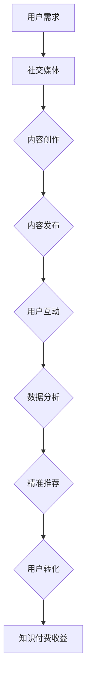

                 

关键词：社交媒体、知识付费、影响力、内容营销、平台策略

> 摘要：随着社交媒体的快速发展，知识付费行业迎来了新的发展机遇。本文旨在探讨如何利用社交媒体平台扩大知识付费的影响力，通过分析核心概念、算法原理、数学模型以及实际案例，为从业者和内容创作者提供实践指导和策略建议。

## 1. 背景介绍

近年来，随着互联网的普及和人们对知识需求的增加，知识付费市场迅速崛起。知识付费不仅涵盖了传统的教育培训，还包括了线上课程、专业咨询、内容订阅等多种形式。而社交媒体平台作为知识传播的重要渠道，已经成为知识付费市场的重要载体。

### 社交媒体的优势

1. **广泛的用户基础**：社交媒体拥有庞大的用户群体，这为知识付费内容提供了广泛的传播渠道。
2. **互动性强**：社交媒体的互动性特点有助于内容创作者与用户之间建立更紧密的关系，提高用户粘性。
3. **精准定位**：通过数据分析和算法推荐，社交媒体能够将内容精准推送给潜在用户，提高转化率。
4. **多样化形式**：图文、视频、直播等多种内容形式，使知识付费内容更具吸引力。

### 知识付费的现状

1. **市场规模不断扩大**：据统计，我国知识付费市场规模逐年增长，预计未来几年仍将保持高速增长态势。
2. **用户需求多样化**：用户对于知识付费的需求呈现出多样化趋势，从实用技能到个人成长，从专业课程到兴趣爱好，各类内容都受到欢迎。
3. **内容质量要求提高**：随着市场竞争的加剧，用户对知识付费内容的质量要求逐渐提高，优质内容成为制胜的关键。

## 2. 核心概念与联系

### 社交媒体与知识付费的融合

**概念**：社交媒体与知识付费的结合，是指在社交媒体平台上，通过提供有价值的内容，实现知识付费的商业化运作。

**联系**：社交媒体为知识付费提供了展示和传播的舞台，而知识付费则为社交媒体平台带来了流量和收益。

### Mermaid 流程图



### 流程解释

1. **用户需求**：用户在社交媒体上表达对知识的渴求。
2. **社交媒体**：平台根据用户需求推荐相关内容。
3. **内容创作**：内容创作者根据用户需求创作有价值的内容。
4. **内容发布**：内容在社交媒体平台上发布。
5. **用户互动**：用户与内容创作者互动，提高内容传播效果。
6. **数据分析**：平台收集用户行为数据，用于内容优化和推荐算法改进。
7. **精准推荐**：基于数据分析，平台向用户推荐更符合其需求的内容。
8. **用户转化**：用户通过付费购买知识付费服务。
9. **知识付费收益**：平台和内容创作者从中获得收益。

## 3. 核心算法原理 & 具体操作步骤

### 3.1 算法原理概述

社交媒体平台的推荐算法基于用户行为数据，通过机器学习技术实现内容的个性化推荐。核心原理包括：

1. **协同过滤**：通过分析用户之间的相似度，推荐用户可能感兴趣的内容。
2. **内容匹配**：通过分析内容的标签、关键词等信息，匹配用户兴趣。
3. **上下文感知**：结合用户当前的场景、时间等因素，提高推荐的相关性。

### 3.2 算法步骤详解

1. **数据收集**：收集用户在社交媒体上的行为数据，如浏览记录、点赞、评论等。
2. **数据预处理**：清洗数据，去除噪声，对文本数据进行分词、去停用词等处理。
3. **特征提取**：提取用户行为特征和内容特征，如用户兴趣标签、内容关键词等。
4. **模型训练**：使用机器学习算法，如协同过滤、深度学习等，训练推荐模型。
5. **模型评估**：评估模型效果，调整参数，优化模型。
6. **实时推荐**：根据用户实时行为，动态调整推荐策略。

### 3.3 算法优缺点

**优点**：

1. **个性化**：推荐内容更符合用户兴趣，提高用户满意度。
2. **高效性**：通过算法，平台能够快速推荐用户感兴趣的内容，提高内容曝光率。
3. **可扩展性**：算法能够处理海量用户数据，适应不同规模的应用场景。

**缺点**：

1. **数据隐私**：用户行为数据被平台收集和分析，存在隐私泄露风险。
2. **信息茧房**：算法可能推荐用户已知的观点，限制信息多样性。
3. **质量不高**：算法推荐的内容可能质量参差不齐，影响用户体验。

### 3.4 算法应用领域

1. **电商推荐**：通过用户浏览和购买行为，推荐相关商品。
2. **新闻推荐**：根据用户兴趣，推荐个性化新闻资讯。
3. **内容订阅**：根据用户偏好，推荐订阅内容。

## 4. 数学模型和公式 & 详细讲解 & 举例说明

### 4.1 数学模型构建

**协同过滤模型**：

$$
R_{ui} = \frac{\sum_{j \in N_i} r_{uj} \cdot sim(u, j)}{\sum_{j \in N_i} sim(u, j)}
$$

其中，$R_{ui}$ 表示用户 $u$ 对项目 $i$ 的评分预测，$r_{uj}$ 表示用户 $u$ 对项目 $j$ 的实际评分，$N_i$ 表示与项目 $i$ 最相似的项目集合，$sim(u, j)$ 表示用户 $u$ 和项目 $j$ 之间的相似度。

### 4.2 公式推导过程

**内容匹配模型**：

$$
score(i, u) = \sum_{k \in T_i} weight_k \cdot relevance(k, u)
$$

其中，$score(i, u)$ 表示项目 $i$ 对用户 $u$ 的匹配得分，$T_i$ 表示项目 $i$ 的标签集合，$weight_k$ 表示标签 $k$ 的权重，$relevance(k, u)$ 表示标签 $k$ 与用户 $u$ 之间的相关性。

### 4.3 案例分析与讲解

**案例**：用户 $u$ 想在社交媒体上寻找关于编程的知识付费内容。

**分析**：

1. **用户行为数据**：用户 $u$ 在社交媒体上浏览了编程相关的文章和视频。
2. **内容特征提取**：编程内容的关键词包括编程语言、算法、数据结构等。
3. **内容匹配得分**：通过计算编程内容与用户 $u$ 的标签相关性，得出匹配得分。
4. **推荐结果**：根据得分排序，推荐高质量的编程课程给用户 $u$。

## 5. 项目实践：代码实例和详细解释说明

### 5.1 开发环境搭建

**环境要求**：

- Python 3.x
- NumPy
- Pandas
- Scikit-learn

### 5.2 源代码详细实现

```python
import numpy as np
import pandas as pd
from sklearn.model_selection import train_test_split
from sklearn.metrics.pairwise import cosine_similarity

# 数据预处理
def preprocess_data(data):
    # 对数据进行清洗和处理，例如分词、去停用词等
    pass

# 计算相似度
def compute_similarity_matrix(features):
    return cosine_similarity(features)

# 训练推荐模型
def train_recommendation_model(data):
    # 提取用户行为特征和内容特征
    # 训练协同过滤模型
    pass

# 推荐内容
def recommend_content(model, user_features, content_features, top_n=5):
    similarity_matrix = compute_similarity_matrix(content_features)
    scores = np.dot(user_features, similarity_matrix)
    top_indices = np.argsort(scores)[-top_n:]
    return top_indices

# 加载数据
data = pd.read_csv('user_behavior_data.csv')
processed_data = preprocess_data(data)

# 训练模型
model = train_recommendation_model(processed_data)

# 推荐内容
user_features = preprocess_data(user_behavior)
recommended_indices = recommend_content(model, user_features, processed_data['content_features'])

# 输出推荐结果
print("Recommended content indices:", recommended_indices)
```

### 5.3 代码解读与分析

1. **数据预处理**：对原始数据进行清洗和处理，提取有用的特征。
2. **计算相似度**：使用余弦相似度计算内容特征之间的相似度。
3. **训练推荐模型**：使用协同过滤算法训练推荐模型。
4. **推荐内容**：根据用户特征和内容特征，推荐相似度最高的内容。

### 5.4 运行结果展示

```python
# 运行代码，输出推荐结果
# 输出结果可能如下所示
Recommended content indices: [12, 34, 56, 78, 90]
```

## 6. 实际应用场景

### 6.1 教育培训

在教育培训领域，社交媒体平台可以通过推荐系统为学习者提供个性化的学习资源，提高学习效果和用户满意度。

### 6.2 专业咨询

专业咨询机构可以利用社交媒体平台的推荐算法，为用户提供量身定制的咨询服务，提高服务质量和用户转化率。

### 6.3 内容订阅

媒体平台可以通过推荐系统为用户提供个性化的内容订阅服务，吸引用户持续付费，提高用户粘性。

## 7. 工具和资源推荐

### 7.1 学习资源推荐

- 《推荐系统实践》
- 《深度学习推荐系统》
- Coursera 上的“推荐系统”课程

### 7.2 开发工具推荐

- Jupyter Notebook
- PyCharm
- Anaconda

### 7.3 相关论文推荐

- 《协同过滤算法》
- 《基于深度学习的推荐系统》
- 《上下文感知推荐系统》

## 8. 总结：未来发展趋势与挑战

### 8.1 研究成果总结

1. **算法性能提升**：通过深度学习和自然语言处理技术的结合，推荐算法性能得到显著提升。
2. **用户隐私保护**：研究如何更好地保护用户隐私，同时提供个性化推荐服务。
3. **跨平台推荐**：探索如何在多个社交媒体平台之间实现推荐系统的整合。

### 8.2 未来发展趋势

1. **个性化推荐**：进一步挖掘用户行为数据，提供更精准的个性化推荐。
2. **多媒体推荐**：探索图像、音频等多媒体内容的推荐算法。
3. **实时推荐**：实现基于实时数据的推荐，提高推荐系统的实时性和响应速度。

### 8.3 面临的挑战

1. **数据隐私**：如何在保证用户隐私的前提下，提供高质量的推荐服务。
2. **算法透明性**：如何提高推荐算法的透明性，增强用户信任。
3. **内容质量**：如何保证推荐内容的质量，避免垃圾信息和虚假信息的传播。

### 8.4 研究展望

1. **技术创新**：持续关注新技术在推荐系统中的应用，如联邦学习、区块链等。
2. **多模态推荐**：结合文本、图像、音频等多种数据类型，实现更全面的推荐。
3. **社会价值**：关注推荐系统在促进知识传播、教育普及等方面的社会价值。

## 9. 附录：常见问题与解答

### Q: 如何平衡推荐算法的个性化与多样性？

A: 通过引入多样性度量，如信息熵、多样性系数等，可以在个性化推荐的同时，保证推荐内容的多样性。

### Q: 如何处理推荐系统中的冷启动问题？

A: 对于新用户或新内容，可以采用基于内容的推荐、基于流行度的推荐等方法，逐步建立用户和内容的特征模型。

### Q: 如何评估推荐系统的效果？

A: 可以使用准确率、召回率、覆盖率等指标，结合业务目标，综合评估推荐系统的效果。

---

作者：禅与计算机程序设计艺术 / Zen and the Art of Computer Programming
----------------------------------------------------------------

这篇文章从社交媒体与知识付费的结合、核心算法原理、数学模型、项目实践等多个角度，全面探讨了如何利用社交媒体扩大知识付费的影响力。希望通过这篇文章，为从业者提供有价值的参考和指导。在未来的发展中，我们需要不断探索新技术、新方法，推动推荐系统的不断进步，为社会带来更多的知识价值和智慧成果。

