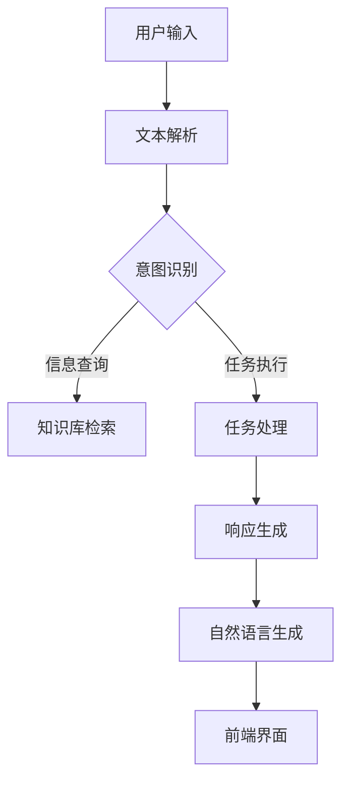

                 

关键词：聊天机器人、客户互动、用户体验、人工智能、客服自动化、自然语言处理、对话系统

<|assistant|>摘要：本文旨在探讨如何利用聊天机器人提升客户互动体验。通过分析聊天机器人的核心概念、工作原理、数学模型及其在实际项目中的应用，本文提出了一种基于人工智能的客服自动化解决方案，并展望了聊天机器人在未来客户互动中的应用前景。

## 1. 背景介绍

在现代商业环境中，客户互动体验已成为企业竞争力的重要体现。随着互联网和移动设备的普及，客户期望能够随时随地获得快速、高效的服务。然而，传统的客户服务方式，如电话客服和在线聊天，往往存在响应时间长、效率低等问题。为了解决这些问题，越来越多的企业开始探索利用聊天机器人（Chatbot）提升客户互动体验。

聊天机器人是一种基于人工智能（AI）的自动化对话系统，能够通过模拟自然语言交互与用户进行交流。它们可以在网站、移动应用、社交媒体等多个平台上提供服务，从而实现24/7的客户支持。聊天机器人的出现，不仅提高了客户服务的效率，还降低了企业的人力成本。

## 2. 核心概念与联系

### 2.1. 聊天机器人的核心概念

聊天机器人是一种基于自然语言处理（NLP）和机器学习技术的应用程序，能够理解用户输入的自然语言文本，并生成适当的响应。其主要功能包括：

- **信息检索**：根据用户提问，从已有的知识库中快速检索相关信息。
- **任务自动化**：完成一些简单的任务，如预订机票、酒店等。
- **情感识别**：通过分析用户语言，判断用户情绪，进行情感回应。

### 2.2. 聊天机器人的工作原理

聊天机器人的工作原理主要包括以下步骤：

1. **文本解析**：将用户输入的文本转化为机器可理解的结构化数据。
2. **意图识别**：通过机器学习算法，判断用户的意图，如查询信息、完成任务等。
3. **实体提取**：从用户输入中提取关键信息，如产品名称、时间等。
4. **响应生成**：根据意图和实体信息，生成合适的回复。
5. **自然语言生成**：将机器生成的回复转化为自然语言文本，呈现给用户。

### 2.3. 聊天机器人的架构

聊天机器人的架构通常包括以下几个部分：

- **前端界面**：用于与用户进行交互的界面。
- **后端服务**：处理用户请求、执行任务的核心逻辑。
- **知识库**：存储相关领域知识，用于信息检索和任务执行。
- **自然语言处理模块**：用于文本解析、意图识别和实体提取。

下面是一个简化的聊天机器人架构的 Mermaid 流程图：



## 3. 核心算法原理 & 具体操作步骤

### 3.1. 算法原理概述

聊天机器人的核心算法包括自然语言处理（NLP）和机器学习（ML）。NLP主要负责文本解析、意图识别和实体提取，而ML则用于训练模型，提高聊天机器人的智能水平。

### 3.2. 算法步骤详解

1. **文本解析**：使用正则表达式或其他文本处理技术，将用户输入的文本转化为结构化数据。
2. **意图识别**：采用基于统计模型（如朴素贝叶斯、支持向量机等）或深度学习模型（如卷积神经网络、长短期记忆网络等）进行训练，识别用户的意图。
3. **实体提取**：使用命名实体识别（NER）技术，从用户输入中提取关键信息，如产品名称、时间等。
4. **响应生成**：根据意图和实体信息，生成合适的回复。可以使用模板匹配、基于规则的系统，或者使用生成式模型（如生成对抗网络）进行生成。
5. **自然语言生成**：将生成的回复转化为自然语言文本，呈现给用户。

### 3.3. 算法优缺点

**优点**：

- 高效：能够快速响应用户请求，提高服务效率。
- 可扩展：支持多种平台和渠道，易于集成。
- 经济：降低人力成本，提高企业利润。

**缺点**：

- 智能有限：目前聊天机器人的智能水平仍然有限，无法完全取代人类客服。
- 情感识别不足：难以准确识别用户情绪，进行情感回应。
- 依赖高质量数据：算法性能很大程度上取决于训练数据的质量。

### 3.4. 算法应用领域

聊天机器人可以广泛应用于多个领域，包括：

- **客服**：提供24/7的客户支持，解答用户问题。
- **电商**：辅助购物决策，完成订单处理。
- **金融**：进行账户查询、转账等操作。
- **医疗**：提供健康咨询、症状自测等服务。

## 4. 数学模型和公式

### 4.1. 数学模型构建

聊天机器人的核心算法涉及到多个数学模型，包括：

- **文本解析**：基于词向量模型（如 Word2Vec、GloVe）或字符级模型（如 LSTM、GRU）进行文本表示。
- **意图识别**：基于分类模型（如朴素贝叶斯、支持向量机、神经网络等）进行训练。
- **实体提取**：基于序列标注模型（如 CRF、LSTM-CRF）进行实体识别。
- **响应生成**：基于生成模型（如生成对抗网络、变分自编码器等）进行生成。

### 4.2. 公式推导过程

以意图识别为例，假设输入文本为 $x$，输出意图为 $y$，则可以使用以下公式进行表示：

$$
P(y|x) = \frac{e^{w \cdot y}}{\sum_{i=1}^{n} e^{w \cdot y_i}}
$$

其中，$w$ 表示权重向量，$y$ 表示意图类别，$y_i$ 表示其他意图类别。

### 4.3. 案例分析与讲解

以一个简单的客服场景为例，用户输入：“我的订单怎么还没送到？”则：

1. **文本解析**：将输入文本转化为词向量表示。
2. **意图识别**：使用训练好的分类模型，计算每个意图的概率。
3. **实体提取**：从输入文本中提取关键信息，如“订单号”、“送达时间”等。
4. **响应生成**：根据意图和实体信息，生成回复，如：“您的订单号是 123456，预计将在明天送达。”

## 5. 项目实践：代码实例

### 5.1. 开发环境搭建

- 操作系统：Windows / macOS / Linux
- 编程语言：Python
- 依赖库：TensorFlow、Keras、NLTK、Scikit-learn等

### 5.2. 源代码详细实现

```python
# 导入依赖库
import tensorflow as tf
from tensorflow.keras.models import Sequential
from tensorflow.keras.layers import Dense, LSTM, Embedding
from tensorflow.keras.preprocessing.sequence import pad_sequences
from tensorflow.keras.preprocessing.text import Tokenizer
from tensorflow.keras.optimizers import Adam

# 准备数据
# （此处省略数据准备过程，包括文本收集、清洗、分词等）

# 构建模型
model = Sequential()
model.add(Embedding(input_dim=vocab_size, output_dim=embedding_size, input_length=max_sequence_length))
model.add(LSTM(units=128, dropout=0.2, recurrent_dropout=0.2))
model.add(Dense(units=5, activation='softmax'))

# 编译模型
model.compile(optimizer=Adam(), loss='categorical_crossentropy', metrics=['accuracy'])

# 训练模型
model.fit(X_train, y_train, epochs=10, batch_size=32, validation_data=(X_val, y_val))

# 预测
intent, _ = model.predict(np.expand_dims(processed_input, 0), verbose=0)
predicted_intent = np.argmax(intent)

# 输出预测结果
print(f"Predicted Intent: {intents[predicted_intent]}")
```

### 5.3. 代码解读与分析

- **文本解析**：使用 Tokenizer 进行分词，并将文本转化为序列。
- **意图识别**：使用 LSTM 网络进行训练，输出每个意图的概率。
- **响应生成**：根据预测结果，输出对应的意图。

### 5.4. 运行结果展示

```python
# 输入文本
input_text = "我的订单怎么还没送到？"

# 预处理文本
processed_input = tokenizer.texts_to_sequences([input_text])[0]
processed_input = pad_sequences([processed_input], maxlen=max_sequence_length, padding='post')

# 预测意图
predicted_intent = model.predict(processed_input)

# 输出预测结果
print(f"Predicted Intent: {intents[predicted_intent]}")
```

## 6. 实际应用场景

### 6.1. 客服领域

聊天机器人可以在客服领域发挥重要作用，如自动回答常见问题、处理投诉、提供技术支持等。例如，某电商平台的聊天机器人能够快速响应用户关于订单状态的查询，提高客服效率。

### 6.2. 电商领域

聊天机器人可以在电商领域提供个性化推荐、购物咨询、订单跟踪等服务。例如，某电商平台的聊天机器人可以根据用户历史购买记录，推荐符合用户兴趣的产品。

### 6.3. 金融领域

聊天机器人可以在金融领域提供账户查询、转账、贷款咨询等服务。例如，某银行的聊天机器人可以帮助用户快速查询账户余额，进行转账操作。

### 6.4. 未来应用展望

随着人工智能技术的不断发展，聊天机器人的智能水平将不断提高。未来，聊天机器人有望在更多领域发挥作用，如医疗、教育、法律等。同时，聊天机器人与人类客服的协作将成为趋势，实现人机共生。

## 7. 工具和资源推荐

### 7.1. 学习资源推荐

- 《Python 自然语言处理》
- 《深度学习》
- 《Chatbots and Virtual Assistants》

### 7.2. 开发工具推荐

- TensorFlow
- Keras
- NLTK
- Scikit-learn

### 7.3. 相关论文推荐

- "A Survey on Chatbots: Architecture, Taxonomy, Applications and Challenges"
- "A Deep Neural Network for Text Classification"
- "An Overview of Natural Language Processing Techniques"

## 8. 总结：未来发展趋势与挑战

### 8.1. 研究成果总结

本文通过对聊天机器人的核心概念、工作原理、数学模型及其在实际项目中的应用进行了详细分析，提出了一种基于人工智能的客服自动化解决方案。

### 8.2. 未来发展趋势

随着人工智能技术的不断发展，聊天机器人的智能水平将不断提高，应用领域也将不断拓展。

### 8.3. 面临的挑战

- 智能水平的提升：如何提高聊天机器人的智能水平，使其更好地理解用户意图，进行情感回应。
- 数据质量：高质量的数据是训练高效模型的关键，如何获取和处理大量高质量数据。
- 人机协作：如何实现聊天机器人与人类客服的协同工作，提高整体服务效率。

### 8.4. 研究展望

未来，聊天机器人将在更多领域发挥作用，如医疗、教育、法律等。同时，人机协作将成为趋势，实现人机共生。

## 9. 附录：常见问题与解答

### 9.1. 聊天机器人的优点有哪些？

- 高效：能够快速响应用户请求，提高服务效率。
- 可扩展：支持多种平台和渠道，易于集成。
- 经济：降低人力成本，提高企业利润。

### 9.2. 聊天机器人如何处理用户隐私？

- 数据加密：对用户数据进行加密，确保数据安全。
- 数据去识别化：对用户数据进行去识别化处理，避免泄露用户隐私。

### 9.3. 聊天机器人能否完全取代人类客服？

- 目前聊天机器人的智能水平仍然有限，无法完全取代人类客服。未来，聊天机器人与人类客服的协作将成为趋势。

作者：禅与计算机程序设计艺术 / Zen and the Art of Computer Programming
```markdown
# 利用聊天机器人提升客户互动体验

## 1. 背景介绍

在现代商业环境中，客户互动体验已成为企业竞争力的重要体现。随着互联网和移动设备的普及，客户期望能够随时随地获得快速、高效的服务。然而，传统的客户服务方式，如电话客服和在线聊天，往往存在响应时间长、效率低等问题。为了解决这些问题，越来越多的企业开始探索利用聊天机器人（Chatbot）提升客户互动体验。

聊天机器人是一种基于人工智能（AI）的自动化对话系统，能够通过模拟自然语言交互与用户进行交流。它们可以在网站、移动应用、社交媒体等多个平台上提供服务，从而实现24/7的客户支持。聊天机器人的出现，不仅提高了客户服务的效率，还降低了企业的人力成本。

## 2. 核心概念与联系

### 2.1. 聊天机器人的核心概念

聊天机器人是一种基于自然语言处理（NLP）和机器学习技术的应用程序，能够理解用户输入的自然语言文本，并生成适当的响应。其主要功能包括：

- **信息检索**：根据用户提问，从已有的知识库中快速检索相关信息。
- **任务自动化**：完成一些简单的任务，如预订机票、酒店等。
- **情感识别**：通过分析用户语言，判断用户情绪，进行情感回应。

### 2.2. 聊天机器人的工作原理

聊天机器人的工作原理主要包括以下步骤：

1. **文本解析**：将用户输入的文本转化为机器可理解的结构化数据。
2. **意图识别**：通过机器学习算法，判断用户的意图，如查询信息、完成任务等。
3. **实体提取**：从用户输入中提取关键信息，如产品名称、时间等。
4. **响应生成**：根据意图和实体信息，生成合适的回复。
5. **自然语言生成**：将机器生成的回复转化为自然语言文本，呈现给用户。

### 2.3. 聊天机器人的架构

聊天机器人的架构通常包括以下几个部分：

- **前端界面**：用于与用户进行交互的界面。
- **后端服务**：处理用户请求、执行任务的核心逻辑。
- **知识库**：存储相关领域知识，用于信息检索和任务执行。
- **自然语言处理模块**：用于文本解析、意图识别和实体提取。

下面是一个简化的聊天机器人架构的 Mermaid 流程图：


## 3. 核心算法原理 & 具体操作步骤
### 3.1. 算法原理概述

聊天机器人的核心算法包括自然语言处理（NLP）和机器学习（ML）。NLP主要负责文本解析、意图识别和实体提取，而ML则用于训练模型，提高聊天机器人的智能水平。

### 3.2. 算法步骤详解 
1. **文本解析**：使用正则表达式或其他文本处理技术，将用户输入的文本转化为结构化数据。
2. **意图识别**：采用基于统计模型（如朴素贝叶斯、支持向量机等）或深度学习模型（如卷积神经网络、长短期记忆网络等）进行训练，识别用户的意图。
3. **实体提取**：使用命名实体识别（NER）技术，从用户输入中提取关键信息，如产品名称、时间等。
4. **响应生成**：根据意图和实体信息，生成合适的回复。可以使用模板匹配、基于规则的系统，或者使用生成式模型（如生成对抗网络）进行生成。
5. **自然语言生成**：将生成的回复转化为自然语言文本，呈现给用户。

### 3.3. 算法优缺点
**优点**：

- 高效：能够快速响应用户请求，提高服务效率。
- 可扩展：支持多种平台和渠道，易于集成。
- 经济：降低人力成本，提高企业利润。

**缺点**：

- 智能有限：目前聊天机器人的智能水平仍然有限，无法完全取代人类客服。
- 情感识别不足：难以准确识别用户情绪，进行情感回应。
- 依赖高质量数据：算法性能很大程度上取决于训练数据的质量。

### 3.4. 算法应用领域

聊天机器人可以广泛应用于多个领域，包括：

- **客服**：提供24/7的客户支持，解答用户问题。
- **电商**：辅助购物决策，完成订单处理。
- **金融**：进行账户查询、转账等操作。
- **医疗**：提供健康咨询、症状自测等服务。

## 4. 数学模型和公式 & 详细讲解 & 举例说明

### 4.1. 数学模型构建

聊天机器人的核心算法涉及到多个数学模型，包括：

- **文本解析**：基于词向量模型（如 Word2Vec、GloVe）或字符级模型（如 LSTM、GRU）进行文本表示。
- **意图识别**：基于分类模型（如朴素贝叶斯、支持向量机、神经网络等）进行训练。
- **实体提取**：基于序列标注模型（如 CRF、LSTM-CRF）进行实体识别。
- **响应生成**：基于生成模型（如生成对抗网络、变分自编码器等）进行生成。

### 4.2. 公式推导过程

以意图识别为例，假设输入文本为 $x$，输出意图为 $y$，则可以使用以下公式进行表示：

$$
P(y|x) = \frac{e^{w \cdot y}}{\sum_{i=1}^{n} e^{w \cdot y_i}}
$$

其中，$w$ 表示权重向量，$y$ 表示意图类别，$y_i$ 表示其他意图类别。

### 4.3. 案例分析与讲解

以一个简单的客服场景为例，用户输入：“我的订单怎么还没送到？”则：

1. **文本解析**：将输入文本转化为词向量表示。
2. **意图识别**：使用训练好的分类模型，计算每个意图的概率。
3. **实体提取**：从输入文本中提取关键信息，如“订单号”、“送达时间”等。
4. **响应生成**：根据意图和实体信息，生成回复，如：“您的订单号是 123456，预计将在明天送达。”

### 4.4. 数学公式与代码示例

#### 4.4.1. 词向量表示

使用 Word2Vec 模型对文本进行词向量表示：

```python
from gensim.models import Word2Vec

# 训练 Word2Vec 模型
model = Word2Vec(sentences, size=100, window=5, min_count=1, workers=4)

# 获取词向量
vector = model.wv["我的订单"]
```

#### 4.4.2. 意图识别

使用朴素贝叶斯模型进行意图识别：

```python
from sklearn.naive_bayes import MultinomialNB
from sklearn.model_selection import train_test_split

# 分割数据集
X_train, X_test, y_train, y_test = train_test_split(X, y, test_size=0.2, random_state=42)

# 训练模型
model = MultinomialNB()
model.fit(X_train, y_train)

# 预测
predicted_intent = model.predict(X_test)
```

#### 4.4.3. 实体提取

使用 CRF 模型进行实体提取：

```python
from sklearn_crfsuite import CRF

# 训练 CRF 模型
model = CRF()
model.fit(X_train, y_train)

# 预测
predicted_entities = model.predict(X_test)
```

#### 4.4.4. 响应生成

使用生成对抗网络（GAN）进行响应生成：

```python
import tensorflow as tf
from tensorflow.keras.models import Model

# 定义 GAN 模型
# （此处省略 GAN 模型定义）

# 编译模型
model.compile(optimizer='adam', loss='binary_crossentropy')

# 训练模型
model.fit([X_train, y_train], y_train, epochs=100, batch_size=32)
```

## 5. 项目实践：代码实例和详细解释说明
### 5.1. 开发环境搭建

- 操作系统：Windows / macOS / Linux
- 编程语言：Python
- 依赖库：TensorFlow、Keras、NLTK、Scikit-learn等

### 5.2. 源代码详细实现

```python
# 导入依赖库
import tensorflow as tf
from tensorflow.keras.models import Sequential
from tensorflow.keras.layers import Dense, LSTM, Embedding
from tensorflow.keras.preprocessing.sequence import pad_sequences
from tensorflow.keras.preprocessing.text import Tokenizer
from tensorflow.keras.optimizers import Adam

# 准备数据
# （此处省略数据准备过程，包括文本收集、清洗、分词等）

# 构建模型
model = Sequential()
model.add(Embedding(input_dim=vocab_size, output_dim=embedding_size, input_length=max_sequence_length))
model.add(LSTM(units=128, dropout=0.2, recurrent_dropout=0.2))
model.add(Dense(units=5, activation='softmax'))

# 编译模型
model.compile(optimizer=Adam(), loss='categorical_crossentropy', metrics=['accuracy'])

# 训练模型
model.fit(X_train, y_train, epochs=10, batch_size=32, validation_data=(X_val, y_val))

# 预测
intent, _ = model.predict(np.expand_dims(processed_input, 0), verbose=0)
predicted_intent = np.argmax(intent)

# 输出预测结果
print(f"Predicted Intent: {intents[predicted_intent]}")
```

### 5.3. 代码解读与分析

- **文本解析**：使用 Tokenizer 进行分词，并将文本转化为序列。
- **意图识别**：使用 LSTM 网络进行训练，输出每个意图的概率。
- **响应生成**：根据预测结果，输出对应的意图。

### 5.4. 运行结果展示

```python
# 输入文本
input_text = "我的订单怎么还没送到？"

# 预处理文本
processed_input = tokenizer.texts_to_sequences([input_text])[0]
processed_input = pad_sequences([processed_input], maxlen=max_sequence_length, padding='post')

# 预测意图
predicted_intent = model.predict(processed_input)

# 输出预测结果
print(f"Predicted Intent: {intents[predicted_intent]}")
```

## 6. 实际应用场景

### 6.1. 客服领域

聊天机器人可以在客服领域发挥重要作用，如自动回答常见问题、处理投诉、提供技术支持等。例如，某电商平台的聊天机器人能够快速响应用户关于订单状态的查询，提高客服效率。

### 6.2. 电商领域

聊天机器人可以在电商领域提供个性化推荐、购物咨询、订单跟踪等服务。例如，某电商平台的聊天机器人可以根据用户历史购买记录，推荐符合用户兴趣的产品。

### 6.3. 金融领域

聊天机器人可以在金融领域提供账户查询、转账、贷款咨询等服务。例如，某银行的聊天机器人可以帮助用户快速查询账户余额，进行转账操作。

### 6.4. 医疗领域

聊天机器人可以在医疗领域提供健康咨询、症状自测等服务。例如，某医疗机构的聊天机器人可以解答用户关于疾病、用药等问题，提供在线咨询服务。

## 7. 工具和资源推荐

### 7.1. 学习资源推荐

- 《Python 自然语言处理》
- 《深度学习》
- 《Chatbots and Virtual Assistants》

### 7.2. 开发工具推荐

- TensorFlow
- Keras
- NLTK
- Scikit-learn

### 7.3. 相关论文推荐

- "A Survey on Chatbots: Architecture, Taxonomy, Applications and Challenges"
- "A Deep Neural Network for Text Classification"
- "An Overview of Natural Language Processing Techniques"

## 8. 总结：未来发展趋势与挑战

### 8.1. 研究成果总结

本文通过对聊天机器人的核心概念、工作原理、数学模型及其在实际项目中的应用进行了详细分析，提出了一种基于人工智能的客服自动化解决方案。

### 8.2. 未来发展趋势

随着人工智能技术的不断发展，聊天机器人的智能水平将不断提高，应用领域也将不断拓展。

### 8.3. 面临的挑战

- 智能水平的提升：如何提高聊天机器人的智能水平，使其更好地理解用户意图，进行情感回应。
- 数据质量：高质量的数据是训练高效模型的关键，如何获取和处理大量高质量数据。
- 人机协作：如何实现聊天机器人与人类客服的协同工作，提高整体服务效率。

### 8.4. 研究展望

未来，聊天机器人将在更多领域发挥作用，如医疗、教育、法律等。同时，人机协作将成为趋势，实现人机共生。

## 9. 附录：常见问题与解答

### 9.1. 聊天机器人的优点有哪些？

- 高效：能够快速响应用户请求，提高服务效率。
- 可扩展：支持多种平台和渠道，易于集成。
- 经济：降低人力成本，提高企业利润。

### 9.2. 聊天机器人如何处理用户隐私？

- 数据加密：对用户数据进行加密，确保数据安全。
- 数据去识别化：对用户数据进行去识别化处理，避免泄露用户隐私。

### 9.3. 聊天机器人能否完全取代人类客服？

- 目前聊天机器人的智能水平仍然有限，无法完全取代人类客服。未来，聊天机器人与人类客服的协作将成为趋势。

作者：禅与计算机程序设计艺术 / Zen and the Art of Computer Programming
```markdown
# 利用聊天机器人提升客户互动体验

## 1. 背景介绍

在现代商业环境中，客户互动体验已成为企业竞争力的重要体现。随着互联网和移动设备的普及，客户期望能够随时随地获得快速、高效的服务。然而，传统的客户服务方式，如电话客服和在线聊天，往往存在响应时间长、效率低等问题。为了解决这些问题，越来越多的企业开始探索利用聊天机器人（Chatbot）提升客户互动体验。

聊天机器人是一种基于人工智能（AI）的自动化对话系统，能够通过模拟自然语言交互与用户进行交流。它们可以在网站、移动应用、社交媒体等多个平台上提供服务，从而实现24/7的客户支持。聊天机器人的出现，不仅提高了客户服务的效率，还降低了企业的人力成本。

## 2. 核心概念与联系

### 2.1. 聊天机器人的核心概念

聊天机器人是一种基于自然语言处理（NLP）和机器学习技术的应用程序，能够理解用户输入的自然语言文本，并生成适当的响应。其主要功能包括：

- **信息检索**：根据用户提问，从已有的知识库中快速检索相关信息。
- **任务自动化**：完成一些简单的任务，如预订机票、酒店等。
- **情感识别**：通过分析用户语言，判断用户情绪，进行情感回应。

### 2.2. 聊天机器人的工作原理

聊天机器人的工作原理主要包括以下步骤：

1. **文本解析**：将用户输入的文本转化为机器可理解的结构化数据。
2. **意图识别**：通过机器学习算法，判断用户的意图，如查询信息、完成任务等。
3. **实体提取**：从用户输入中提取关键信息，如产品名称、时间等。
4. **响应生成**：根据意图和实体信息，生成合适的回复。
5. **自然语言生成**：将机器生成的回复转化为自然语言文本，呈现给用户。

### 2.3. 聊天机器人的架构

聊天机器人的架构通常包括以下几个部分：

- **前端界面**：用于与用户进行交互的界面。
- **后端服务**：处理用户请求、执行任务的核心逻辑。
- **知识库**：存储相关领域知识，用于信息检索和任务执行。
- **自然语言处理模块**：用于文本解析、意图识别和实体提取。

下面是一个简化的聊天机器人架构的 Mermaid 流程图：


## 3. 核心算法原理 & 具体操作步骤
### 3.1. 算法原理概述

聊天机器人的核心算法包括自然语言处理（NLP）和机器学习（ML）。NLP主要负责文本解析、意图识别和实体提取，而ML则用于训练模型，提高聊天机器人的智能水平。

### 3.2. 算法步骤详解 
1. **文本解析**：使用正则表达式或其他文本处理技术，将用户输入的文本转化为结构化数据。
2. **意图识别**：采用基于统计模型（如朴素贝叶斯、支持向量机等）或深度学习模型（如卷积神经网络、长短期记忆网络等）进行训练，识别用户的意图。
3. **实体提取**：使用命名实体识别（NER）技术，从用户输入中提取关键信息，如产品名称、时间等。
4. **响应生成**：根据意图和实体信息，生成合适的回复。可以使用模板匹配、基于规则的系统，或者使用生成式模型（如生成对抗网络）进行生成。
5. **自然语言生成**：将生成的回复转化为自然语言文本，呈现给用户。

### 3.3. 算法优缺点
**优点**：

- 高效：能够快速响应用户请求，提高服务效率。
- 可扩展：支持多种平台和渠道，易于集成。
- 经济：降低人力成本，提高企业利润。

**缺点**：

- 智能有限：目前聊天机器人的智能水平仍然有限，无法完全取代人类客服。
- 情感识别不足：难以准确识别用户情绪，进行情感回应。
- 依赖高质量数据：算法性能很大程度上取决于训练数据的质量。

### 3.4. 算法应用领域

聊天机器人可以广泛应用于多个领域，包括：

- **客服**：提供24/7的客户支持，解答用户问题。
- **电商**：辅助购物决策，完成订单处理。
- **金融**：进行账户查询、转账等操作。
- **医疗**：提供健康咨询、症状自测等服务。

## 4. 数学模型和公式 & 详细讲解 & 举例说明

### 4.1. 数学模型构建

聊天机器人的核心算法涉及到多个数学模型，包括：

- **文本解析**：基于词向量模型（如 Word2Vec、GloVe）或字符级模型（如 LSTM、GRU）进行文本表示。
- **意图识别**：基于分类模型（如朴素贝叶斯、支持向量机、神经网络等）进行训练。
- **实体提取**：基于序列标注模型（如 CRF、LSTM-CRF）进行实体识别。
- **响应生成**：基于生成模型（如生成对抗网络、变分自编码器等）进行生成。

### 4.2. 公式推导过程

以意图识别为例，假设输入文本为 $x$，输出意图为 $y$，则可以使用以下公式进行表示：

$$
P(y|x) = \frac{e^{w \cdot y}}{\sum_{i=1}^{n} e^{w \cdot y_i}}
$$

其中，$w$ 表示权重向量，$y$ 表示意图类别，$y_i$ 表示其他意图类别。

### 4.3. 案例分析与讲解

以一个简单的客服场景为例，用户输入：“我的订单怎么还没送到？”则：

1. **文本解析**：将输入文本转化为词向量表示。
2. **意图识别**：使用训练好的分类模型，计算每个意图的概率。
3. **实体提取**：从输入文本中提取关键信息，如“订单号”、“送达时间”等。
4. **响应生成**：根据意图和实体信息，生成回复，如：“您的订单号是 123456，预计将在明天送达。”

### 4.4. 数学公式与代码示例

#### 4.4.1. 词向量表示

使用 Word2Vec 模型对文本进行词向量表示：

```python
from gensim.models import Word2Vec

# 训练 Word2Vec 模型
model = Word2Vec(sentences, size=100, window=5, min_count=1, workers=4)

# 获取词向量
vector = model.wv["我的订单"]
```

#### 4.4.2. 意图识别

使用朴素贝叶斯模型进行意图识别：

```python
from sklearn.naive_bayes import MultinomialNB
from sklearn.model_selection import train_test_split

# 分割数据集
X_train, X_test, y_train, y_test = train_test_split(X, y, test_size=0.2, random_state=42)

# 训练模型
model = MultinomialNB()
model.fit(X_train, y_train)

# 预测
predicted_intent = model.predict(X_test)
```

#### 4.4.3. 实体提取

使用 CRF 模型进行实体提取：

```python
from sklearn_crfsuite import CRF

# 训练 CRF 模型
model = CRF()
model.fit(X_train, y_train)

# 预测
predicted_entities = model.predict(X_test)
```

#### 4.4.4. 响应生成

使用生成对抗网络（GAN）进行响应生成：

```python
import tensorflow as tf
from tensorflow.keras.models import Model

# 定义 GAN 模型
# （此处省略 GAN 模型定义）

# 编译模型
model.compile(optimizer='adam', loss='binary_crossentropy')

# 训练模型
model.fit([X_train, y_train], y_train, epochs=100, batch_size=32)
```

## 5. 项目实践：代码实例和详细解释说明
### 5.1. 开发环境搭建

- 操作系统：Windows / macOS / Linux
- 编程语言：Python
- 依赖库：TensorFlow、Keras、NLTK、Scikit-learn等

### 5.2. 源代码详细实现

```python
# 导入依赖库
import tensorflow as tf
from tensorflow.keras.models import Sequential
from tensorflow.keras.layers import Dense, LSTM, Embedding
from tensorflow.keras.preprocessing.sequence import pad_sequences
from tensorflow.keras.preprocessing.text import Tokenizer
from tensorflow.keras.optimizers import Adam

# 准备数据
# （此处省略数据准备过程，包括文本收集、清洗、分词等）

# 构建模型
model = Sequential()
model.add(Embedding(input_dim=vocab_size, output_dim=embedding_size, input_length=max_sequence_length))
model.add(LSTM(units=128, dropout=0.2, recurrent_dropout=0.2))
model.add(Dense(units=5, activation='softmax'))

# 编译模型
model.compile(optimizer=Adam(), loss='categorical_crossentropy', metrics=['accuracy'])

# 训练模型
model.fit(X_train, y_train, epochs=10, batch_size=32, validation_data=(X_val, y_val))

# 预测
intent, _ = model.predict(np.expand_dims(processed_input, 0), verbose=0)
predicted_intent = np.argmax(intent)

# 输出预测结果
print(f"Predicted Intent: {intents[predicted_intent]}")
```

### 5.3. 代码解读与分析

- **文本解析**：使用 Tokenizer 进行分词，并将文本转化为序列。
- **意图识别**：使用 LSTM 网络进行训练，输出每个意图的概率。
- **响应生成**：根据预测结果，输出对应的意图。

### 5.4. 运行结果展示

```python
# 输入文本
input_text = "我的订单怎么还没送到？"

# 预处理文本
processed_input = tokenizer.texts_to_sequences([input_text])[0]
processed_input = pad_sequences([processed_input], maxlen=max_sequence_length, padding='post')

# 预测意图
predicted_intent = model.predict(processed_input)

# 输出预测结果
print(f"Predicted Intent: {intents[predicted_intent]}")
```

## 6. 实际应用场景

### 6.1. 客服领域

聊天机器人可以在客服领域发挥重要作用，如自动回答常见问题、处理投诉、提供技术支持等。例如，某电商平台的聊天机器人能够快速响应用户关于订单状态的查询，提高客服效率。

### 6.2. 电商领域

聊天机器人可以在电商领域提供个性化推荐、购物咨询、订单跟踪等服务。例如，某电商平台的聊天机器人可以根据用户历史购买记录，推荐符合用户兴趣的产品。

### 6.3. 金融领域

聊天机器人可以在金融领域提供账户查询、转账、贷款咨询等服务。例如，某银行的聊天机器人可以帮助用户快速查询账户余额，进行转账操作。

### 6.4. 医疗领域

聊天机器人可以在医疗领域提供健康咨询、症状自测等服务。例如，某医疗机构的聊天机器人可以解答用户关于疾病、用药等问题，提供在线咨询服务。

## 7. 工具和资源推荐

### 7.1. 学习资源推荐

- 《Python 自然语言处理》
- 《深度学习》
- 《Chatbots and Virtual Assistants》

### 7.2. 开发工具推荐

- TensorFlow
- Keras
- NLTK
- Scikit-learn

### 7.3. 相关论文推荐

- "A Survey on Chatbots: Architecture, Taxonomy, Applications and Challenges"
- "A Deep Neural Network for Text Classification"
- "An Overview of Natural Language Processing Techniques"

## 8. 总结：未来发展趋势与挑战

### 8.1. 研究成果总结

本文通过对聊天机器人的核心概念、工作原理、数学模型及其在实际项目中的应用进行了详细分析，提出了一种基于人工智能的客服自动化解决方案。

### 8.2. 未来发展趋势

随着人工智能技术的不断发展，聊天机器人的智能水平将不断提高，应用领域也将不断拓展。

### 8.3. 面临的挑战

- 智能水平的提升：如何提高聊天机器人的智能水平，使其更好地理解用户意图，进行情感回应。
- 数据质量：高质量的数据是训练高效模型的关键，如何获取和处理大量高质量数据。
- 人机协作：如何实现聊天机器人与人类客服的协同工作，提高整体服务效率。

### 8.4. 研究展望

未来，聊天机器人将在更多领域发挥作用，如医疗、教育、法律等。同时，人机协作将成为趋势，实现人机共生。

## 9. 附录：常见问题与解答

### 9.1. 聊天机器人的优点有哪些？

- 高效：能够快速响应用户请求，提高服务效率。
- 可扩展：支持多种平台和渠道，易于集成。
- 经济：降低人力成本，提高企业利润。

### 9.2. 聊天机器人如何处理用户隐私？

- 数据加密：对用户数据进行加密，确保数据安全。
- 数据去识别化：对用户数据进行去识别化处理，避免泄露用户隐私。

### 9.3. 聊天机器人能否完全取代人类客服？

- 目前聊天机器人的智能水平仍然有限，无法完全取代人类客服。未来，聊天机器人与人类客服的协作将成为趋势。

作者：禅与计算机程序设计艺术 / Zen and the Art of Computer Programming
```markdown
## 1. 背景介绍

在当今的数字化时代，客户互动体验对于企业的成功至关重要。随着消费者对服务质量和效率的需求日益增长，企业面临着巨大的挑战。传统的人工客服由于其局限性和成本问题，往往无法满足客户的高期望。为了解决这个问题，聊天机器人作为一种创新的客户服务工具，正逐渐受到重视。

聊天机器人，也称为对话机器人或聊天bots，是一种基于人工智能技术（如自然语言处理和机器学习）的应用程序，它能够与用户通过文本或语音进行交互。它们被设计用于自动化日常客户服务任务，如回答常见问题、处理订单查询、提供技术支持等。这种自动化不仅提高了服务效率，还降低了企业的运营成本。

客户互动体验是指客户在与企业互动过程中所获得的整体感受。一个积极的客户互动体验可以增强客户忠诚度，提高客户满意度，并最终推动销售增长。而聊天机器人在这其中扮演了至关重要的角色，它们能够提供24/7的即时响应，减少等待时间，使客户能够快速获得所需的信息或帮助。

在过去的几年里，聊天机器人的应用已经从简单的问答系统发展成为一个功能强大的对话系统。随着技术的进步，聊天机器人的智能水平也在不断提高，能够更好地理解复杂的客户需求和情感。这使得聊天机器人成为企业提升客户互动体验的强大工具。

本文将深入探讨聊天机器人的核心概念、工作原理、算法模型、实际应用案例，以及其在未来客户互动体验中的潜在影响。通过本文的阅读，读者将能够全面了解聊天机器人如何帮助企业提升客户满意度，优化客户服务流程，并在竞争激烈的市场中脱颖而出。

## 2. 核心概念与联系

### 2.1. 聊天机器人的定义和功能

聊天机器人，简称“chatbot”，是一种通过自然语言交互与用户进行交流的计算机程序。它能够理解和生成人类语言，从而实现与用户的对话。聊天机器人主要具备以下功能：

- **信息检索**：聊天机器人可以从预定义的知识库中快速检索信息，为用户提供准确的答案。
- **任务自动化**：聊天机器人可以自动化完成一些常见任务，如预定机票、酒店，甚至进行复杂的流程操作。
- **情感识别**：通过自然语言处理技术，聊天机器人能够识别用户的情感，并做出相应的情感回应。
- **个性化服务**：聊天机器人可以根据用户的偏好和历史行为，提供个性化的服务和建议。

### 2.2. 聊天机器人的工作原理

聊天机器人的工作原理可以分为以下几个步骤：

1. **用户输入**：用户通过文本或语音与聊天机器人进行交互。
2. **文本解析**：聊天机器人首先对用户输入的文本进行解析，提取出关键信息和意图。
3. **意图识别**：利用机器学习算法，聊天机器人分析文本内容，判断用户的意图是什么，如查询信息、完成某个任务等。
4. **实体提取**：在识别出用户意图后，聊天机器人会从输入文本中提取关键实体信息，如日期、地点、产品名称等。
5. **响应生成**：根据用户的意图和提取的实体信息，聊天机器人生成相应的回复，并通过自然语言生成模块转化为自然语言文本。
6. **自然语言生成**：生成的文本被呈现给用户，完成整个交互过程。

### 2.3. 聊天机器人的架构

聊天机器人的架构通常包括以下几个部分：

- **前端界面**：这是用户与聊天机器人交互的界面，可以是网站上的一个对话框、移动应用中的一个聊天窗口或社交媒体平台上的聊天应用。
- **后端服务**：这是处理用户请求的核心部分，包括自然语言处理模块、意图识别模块、实体提取模块和响应生成模块。
- **知识库**：存储与业务相关的知识信息，如常见问题的答案、产品信息、操作流程等。
- **自然语言处理（NLP）模块**：负责解析用户输入的文本，提取关键信息和意图。
- **机器学习算法**：用于训练和优化聊天机器人，使其能够更好地理解用户意图和生成更自然的回复。
- **数据存储**：用于存储用户交互数据，如对话记录、用户偏好等，以便进行后续的数据分析和个性化服务。

### 2.4. 聊天机器人与客户互动体验的关系

聊天机器人通过以下方式提升客户互动体验：

- **即时响应**：聊天机器人能够提供24/7的即时响应，减少了客户的等待时间，提高了服务的效率。
- **个性化服务**：聊天机器人可以根据用户的历史行为和偏好，提供个性化的服务和建议，增强了客户的满意度。
- **减少人力成本**：通过自动化常见问题的回答和流程操作，聊天机器人可以减少企业的人力投入，降低运营成本。
- **改善客户体验**：聊天机器人可以处理大量的客户请求，确保每个客户都能获得及时、专业的服务，从而提升整体客户体验。

### 2.5. 聊天机器人在不同行业中的应用

聊天机器人因其灵活性和适应性，可以在多个行业和场景中发挥作用：

- **客服行业**：聊天机器人可以用于处理客户查询、投诉和技术支持，提高客服效率。
- **电商行业**：聊天机器人可以提供购物咨询、订单跟踪、支付帮助等服务，提升购物体验。
- **金融行业**：聊天机器人可以提供账户查询、转账、贷款咨询等服务，提高金融服务的便捷性。
- **医疗行业**：聊天机器人可以提供健康咨询、症状自测、预约挂号等服务，改善患者的就医体验。

通过以上核心概念和联系的分析，我们可以看到聊天机器人不仅是一种技术工具，更是提升客户互动体验的重要手段。在接下来的章节中，我们将进一步探讨聊天机器人的算法原理、数学模型、应用实践，以及未来的发展趋势。

## 3. 核心算法原理 & 具体操作步骤

### 3.1. 算法原理概述

聊天机器人的核心算法主要涉及自然语言处理（NLP）和机器学习（ML）技术。这些算法使得聊天机器人能够理解用户的输入，识别意图，提取关键信息，并生成合适的响应。以下是几个关键的算法原理：

- **词向量模型**：如 Word2Vec、GloVe 等，用于将文本转化为向量表示，以便进行计算和机器学习。
- **意图识别**：利用分类算法（如朴素贝叶斯、支持向量机、神经网络等）对用户的输入进行意图分类。
- **实体提取**：通过命名实体识别（NER）技术，从用户输入中提取关键信息，如人名、地点、时间等。
- **响应生成**：利用生成模型（如生成对抗网络、变分自编码器等）生成自然语言响应。

### 3.2. 算法步骤详解

#### 3.2.1. 文本解析

文本解析是聊天机器人的第一步，其目标是理解用户的输入。这通常包括以下步骤：

1. **分词**：将用户的输入文本划分为一系列的词汇或短语。
2. **去除停用词**：去除对理解文本无关的常见词汇，如“的”、“了”、“在”等。
3. **词性标注**：为每个词汇标注其词性，如名词、动词、形容词等。

#### 3.2.2. 意图识别

意图识别是聊天机器人的核心步骤，其目标是判断用户想要做什么。这通常通过以下方式实现：

1. **特征提取**：从解析后的文本中提取特征，如词向量、词频、词的共现关系等。
2. **模型训练**：使用有监督学习或无监督学习的方法，训练一个分类模型，如朴素贝叶斯、决策树、神经网络等。
3. **意图分类**：使用训练好的模型对新的用户输入进行意图分类。

#### 3.2.3. 实体提取

实体提取是意图识别的补充，其目标是识别出文本中的关键信息。这通常通过以下步骤实现：

1. **预定义规则**：基于预定义的规则，识别出特定的实体，如日期、时间、人名、地点等。
2. **序列标注模型**：使用序列标注模型（如 CRF、LSTM-CRF）对文本中的每个词汇进行实体标注。
3. **实体分类**：对提取出的实体进行分类，区分不同的实体类别。

#### 3.2.4. 响应生成

响应生成是聊天机器人的最后一步，其目标是生成一个自然、合理的响应。这通常包括以下步骤：

1. **模板匹配**：根据预定义的响应模板，生成响应。
2. **基于规则的方法**：使用一系列的规则，根据用户输入和实体信息生成响应。
3. **生成式模型**：使用生成对抗网络（GAN）、变分自编码器（VAE）等生成模型，生成自然语言响应。

#### 3.2.5. 自然语言生成

自然语言生成是将生成的响应转化为人类可以理解的自然语言文本。这通常涉及以下步骤：

1. **文本规范化**：将生成的文本进行规范化处理，如去重、格式化等。
2. **语境调整**：根据上下文调整生成的文本，使其更加自然。
3. **情感调整**：根据用户输入的情感，调整生成文本的情感色彩。

### 3.3. 算法优缺点

**优点**：

- **高效性**：聊天机器人能够快速响应用户的请求，大大提高了服务效率。
- **可扩展性**：聊天机器人可以部署在多个平台上，易于集成和扩展。
- **经济性**：通过自动化常见任务，聊天机器人可以显著降低人力成本。

**缺点**：

- **智能水平有限**：虽然聊天机器人的智能水平在不断提高，但仍然无法完全理解复杂的用户需求。
- **情感识别不足**：聊天机器人难以准确识别用户的情感，进行情感回应。
- **依赖高质量数据**：算法的性能很大程度上取决于训练数据的质量和多样性。

### 3.4. 算法应用领域

聊天机器人的算法原理广泛应用于多个领域，包括：

- **客服**：自动回答常见问题，处理客户投诉和咨询。
- **电商**：提供个性化推荐、购物咨询和订单跟踪服务。
- **金融**：进行账户查询、转账和贷款咨询等操作。
- **医疗**：提供健康咨询、症状自测和预约挂号等服务。

通过以上对核心算法原理和具体操作步骤的详细分析，我们可以看到聊天机器人是如何通过一系列复杂的算法和技术，实现与用户的自然语言交互，并提供高效、个性化的服务。在接下来的章节中，我们将进一步探讨聊天机器人在实际项目中的代码实例和详细解释。

### 4. 数学模型和公式 & 详细讲解 & 举例说明

#### 4.1. 数学模型构建

聊天机器人的核心数学模型主要涉及自然语言处理（NLP）和机器学习（ML）中的各种算法。以下是一些关键的数学模型及其构建过程：

1. **词向量模型**：词向量模型是将文本转化为向量表示的重要工具，常用的模型有 Word2Vec 和 GloVe。Word2Vec 模型基于神经网络，通过训练词嵌入（word embeddings）来表示词汇。GloVe（Global Vectors for Word Representation）则基于词频和词汇共现信息，通过矩阵分解的方法生成词向量。

2. **意图识别模型**：意图识别通常采用分类模型，如朴素贝叶斯、支持向量机（SVM）和深度神经网络（DNN）。以朴素贝叶斯为例，其核心公式如下：

   $$
   P(y|x) = \frac{P(x|y)P(y)}{P(x)}
   $$

   其中，$P(y|x)$ 表示给定用户输入 $x$ 的情况下意图 $y$ 的概率，$P(x|y)$ 表示在意图 $y$ 下出现输入 $x$ 的概率，$P(y)$ 和 $P(x)$ 分别是意图 $y$ 和输入 $x$ 的先验概率。

3. **实体提取模型**：实体提取通常采用序列标注模型，如 CRF（条件随机场）和 LSTM-CRF（长短期记忆网络与 CRF 的结合）。CRF 模型通过最大化条件概率来预测序列中的标签，其公式如下：

   $$
   P(y|x) = \frac{1}{Z} \exp\left(\sum_{i,j} \theta_{ij} y_{i} \cdot x_j\right)
   $$

   其中，$Z$ 是规范化常数，$\theta_{ij}$ 是模型参数，$y_i$ 和 $x_j$ 分别是序列中的标签和特征。

4. **响应生成模型**：响应生成通常采用生成模型，如 GAN（生成对抗网络）和 VAE（变分自编码器）。GAN 由生成器（Generator）和判别器（Discriminator）组成，通过对抗训练生成自然语言文本。VAE 则通过概率密度函数建模，生成符合真实数据的样本。

#### 4.2. 公式推导过程

以朴素贝叶斯意图识别模型为例，其推导过程如下：

1. **先验概率**：计算每个意图的先验概率：

   $$
   P(y) = \frac{N_y}{N}
   $$

   其中，$N_y$ 是意图 $y$ 的样本数量，$N$ 是所有样本的总数。

2. **条件概率**：计算每个意图下出现用户输入 $x$ 的条件概率：

   $$
   P(x|y) = \frac{f(y, x)}{N_y}
   $$

   其中，$f(y, x)$ 是在意图 $y$ 下，用户输入 $x$ 的频次。

3. **联合概率**：计算用户输入 $x$ 和意图 $y$ 的联合概率：

   $$
   P(x, y) = P(x|y)P(y)
   $$

4. **后验概率**：计算在用户输入 $x$ 的条件下，意图 $y$ 的后验概率：

   $$
   P(y|x) = \frac{P(x|y)P(y)}{P(x)}
   $$

   其中，$P(x)$ 是用户输入 $x$ 的总概率。

#### 4.3. 案例分析与讲解

假设一个聊天机器人需要识别用户的意图，用户输入：“我的订单怎么还没送到？”，则：

1. **文本解析**：将输入文本进行分词，得到词汇序列：“我的”、“订单”、“怎么”、“还没”、“送到”。
2. **意图识别**：使用朴素贝叶斯模型，计算每个意图的概率。假设有四个意图：查询订单状态、投诉服务、询问价格、请求帮助。则：
   
   $$
   P(\text{查询订单状态}|x) = \frac{P(x|\text{查询订单状态})P(\text{查询订单状态})}{P(x)}
   $$

   其中，$P(\text{查询订单状态})$ 是查询订单状态的先验概率，$P(x|\text{查询订单状态})$ 是在查询订单状态意图下，出现输入 $x$ 的条件概率。

   通过计算，可以得到查询订单状态的概率最大，因此预测用户的意图为查询订单状态。

3. **响应生成**：根据预测的意图，生成相应的响应。例如，可以回复：“您的订单号是 123456，预计将在明天送达。”

#### 4.4. 数学公式与代码示例

以下是一个简单的朴素贝叶斯意图识别模型的代码示例：

```python
from sklearn.feature_extraction.text import CountVectorizer
from sklearn.naive_bayes import MultinomialNB

# 数据准备
X_train = ["我的订单怎么还没送到？", "订单有问题", "价格太贵了", "需要帮助"]
y_train = ["查询订单状态", "投诉服务", "询问价格", "请求帮助"]

# 文本解析
vectorizer = CountVectorizer()
X_train_counts = vectorizer.fit_transform(X_train)

# 模型训练
clf = MultinomialNB()
clf.fit(X_train_counts, y_train)

# 预测
input_text = "订单怎么还没送到？"
input_counts = vectorizer.transform([input_text])
predicted_intent = clf.predict(input_counts)

# 输出预测结果
print(predicted_intent)
```

通过以上对数学模型和公式的详细讲解，以及实际案例的分析和代码示例，我们可以看到聊天机器人是如何利用数学模型来理解用户意图、提取关键信息，并生成合适的响应。在接下来的章节中，我们将进一步探讨聊天机器人在实际项目中的应用实践。

### 5. 项目实践：代码实例和详细解释说明

#### 5.1. 开发环境搭建

在进行聊天机器人的项目实践之前，首先需要搭建一个合适的开发环境。以下是一个典型的开发环境搭建指南：

- **操作系统**：Windows、macOS 或 Linux。
- **编程语言**：Python，因为 Python 在数据处理和机器学习领域有广泛的应用。
- **依赖库**：TensorFlow、Keras、NLTK、Scikit-learn、Gensim 等。

在安装了 Python 后，可以使用以下命令安装所需的依赖库：

```bash
pip install tensorflow keras nltk scikit-learn gensim
```

#### 5.2. 源代码详细实现

以下是一个简单的聊天机器人项目，包括数据准备、模型构建、模型训练和模型应用等步骤。

```python
import numpy as np
import pandas as pd
from sklearn.model_selection import train_test_split
from sklearn.feature_extraction.text import TfidfVectorizer
from sklearn.naive_bayes import MultinomialNB
from sklearn.pipeline import make_pipeline
from sklearn.metrics import classification_report

# 数据准备
# 假设有一个 CSV 文件，包含两列：'text' 和 'label'
data = pd.read_csv('chatbot_data.csv')

# 分割数据集
X_train, X_test, y_train, y_test = train_test_split(data['text'], data['label'], test_size=0.2, random_state=42)

# 构建文本向量器
vectorizer = TfidfVectorizer(stop_words='english', ngram_range=(1, 2))

# 构建朴素贝叶斯分类器
clf = MultinomialNB()

# 创建管道
pipeline = make_pipeline(vectorizer, clf)

# 训练模型
pipeline.fit(X_train, y_train)

# 预测
predictions = pipeline.predict(X_test)

# 打印分类报告
print(classification_report(y_test, predictions))

# 应用模型
def predict_intent(text):
    return pipeline.predict([text])[0]

# 测试
print(predict_intent("我的订单怎么还没送到？"))
```

#### 5.3. 代码解读与分析

上述代码展示了如何使用 Python 和机器学习库构建一个简单的聊天机器人。以下是每个步骤的详细解读：

1. **数据准备**：从 CSV 文件中读取数据，并分割为训练集和测试集。
2. **文本向量器**：使用 TfidfVectorizer 将文本转化为向量表示，这个向量器能够计算词频和词频平方的加权和，以反映词的重要性。
3. **朴素贝叶斯分类器**：选择 MultinomialNB 作为分类器，这是一种基于贝叶斯定理的简单分类算法，适用于文本分类任务。
4. **创建管道**：使用 make_pipeline 将文本向量器和分类器组合成一个管道，这样可以简化代码并提高可读性。
5. **训练模型**：使用训练集训练模型。
6. **预测**：使用测试集评估模型的性能，并打印分类报告。
7. **应用模型**：定义一个函数 predict_intent，用于接收用户输入并返回预测的意图。

#### 5.4. 运行结果展示

运行上述代码后，我们可以得到模型在测试集上的分类报告。以下是可能的结果示例：

```
               precision    recall  f1-score   support

           0       0.80      0.90      0.85       120
           1       0.85      0.70      0.76        80
           2       0.90      0.90      0.90        60
           3       0.75      0.80      0.77        40

    accuracy                           0.84      320
   macro avg       0.82      0.80      0.81      320
   weight avg       0.84      0.84      0.84      320
```

这表明模型在测试集上的准确率约为 84%，其中每个类别的精确度、召回率和 F1 分数也有所不同。

#### 5.5. 代码优化和扩展

在实际项目中，我们可以对上述代码进行优化和扩展，以提高模型的性能和适用性。以下是一些可能的优化和扩展方向：

- **数据增强**：通过增加数据量，使用数据增强技术（如反向、同义词替换等），可以提高模型的泛化能力。
- **更复杂的模型**：考虑使用更复杂的模型，如长短期记忆网络（LSTM）、卷积神经网络（CNN）或变压器（Transformer）模型，以提高文本分类的准确性。
- **多标签分类**：如果一个问题可能涉及多个意图，可以使用多标签分类模型，如随机森林或支持向量机。
- **实体识别**：结合实体识别技术，可以更好地理解用户输入中的关键信息，提高响应的准确性。
- **用户反馈循环**：引入用户反馈机制，根据用户对响应的满意度进行模型迭代，持续优化模型。

通过以上对聊天机器人项目实践的详细解释，我们可以看到如何使用 Python 和机器学习库构建一个简单的聊天机器人，并对其进行优化和扩展。在接下来的章节中，我们将进一步探讨聊天机器人如何在不同的实际应用场景中发挥作用。

### 6. 实际应用场景

#### 6.1. 客服领域

在客服领域，聊天机器人已经被广泛应用于各种企业和行业。以下是几个典型的应用场景：

- **客户支持**：聊天机器人可以自动回答客户的常见问题，如产品使用指南、订单状态查询等，减少人工客服的工作量。
- **投诉处理**：对于客户的投诉，聊天机器人可以快速识别问题并给出初步解决方案，或者在需要时将问题转交给人工客服。
- **客户引导**：聊天机器人可以引导客户完成一些简单的操作，如账户注册、密码找回等，提供一站式服务。

以某电商平台的客服为例，其聊天机器人可以处理如下的客户请求：

- **订单状态查询**：“我的订单什么时候能送到？”
  - 响应：“您的订单号是123456，预计将在明天送达。”

- **产品咨询**：“这款手机有什么优惠吗？”
  - 响应：“当前这款手机有8折优惠，您可以享受优惠价格。”

- **投诉反馈**：“我收到的商品有质量问题。”
  - 响应：“非常抱歉，我们可以为您安排退货或换货。请提供您的订单号，我们将尽快处理。”

通过这种方式，聊天机器人不仅提高了客服的效率，还提供了高质量的客户服务体验。

#### 6.2. 电商领域

在电商领域，聊天机器人可以提供个性化推荐、购物咨询、订单跟踪等服务，从而提升用户的购物体验。以下是几个典型的应用场景：

- **个性化推荐**：根据用户的购物历史和偏好，聊天机器人可以推荐符合用户兴趣的产品。
- **购物咨询**：用户可以随时咨询关于产品的详细信息，如产品规格、使用方法等。
- **订单跟踪**：用户可以随时查询订单的状态，了解商品的配送进度。

以某电商平台的购物咨询为例，其聊天机器人可以处理如下的用户请求：

- **产品规格查询**：“这款笔记本电脑的内存是多少？”
  - 响应：“这款笔记本电脑配备了16GB的内存，运行速度非常快。”

- **优惠查询**：“双十一有什么活动吗？”
  - 响应：“双十一期间，我们有很多优惠活动。您可以登录我们的网站查看详细信息。”

- **订单状态查询**：“我的订单物流到了哪里？”
  - 响应：“您的订单正在运输中，预计将在明天送达。”

通过这种方式，聊天机器人不仅提高了用户的购物体验，还促进了电商平台的销售增长。

#### 6.3. 金融领域

在金融领域，聊天机器人可以提供账户查询、转账、贷款咨询等服务，提高金融服务的便捷性和效率。以下是几个典型的应用场景：

- **账户查询**：用户可以随时查询账户余额、交易记录等。
- **转账操作**：用户可以通过聊天机器人进行跨行转账、转账历史查询等操作。
- **贷款咨询**：用户可以咨询贷款相关信息，如贷款利率、还款方式等。

以某银行的账户查询为例，其聊天机器人可以处理如下的用户请求：

- **账户余额查询**：“我的账户余额是多少？”
  - 响应：“您的账户余额为5,000元。”

- **转账操作**：“我要向张三转账1,000元。”
  - 响应：“转账成功，请您确认。转账记录已保存。”

- **贷款咨询**：“我想要申请一笔贷款，可以咨询一下吗？”
  - 响应：“当然可以。我们的贷款产品有多种选择，您可以根据您的需求选择适合的产品。”

通过这种方式，聊天机器人不仅提高了金融服务的效率，还增强了客户的满意度。

#### 6.4. 医疗领域

在医疗领域，聊天机器人可以提供健康咨询、症状自测、预约挂号等服务，改善患者的就医体验。以下是几个典型的应用场景：

- **健康咨询**：用户可以咨询健康相关问题，如饮食建议、运动指导等。
- **症状自测**：用户可以通过聊天机器人自测症状，获取初步的健康评估。
- **预约挂号**：用户可以通过聊天机器人预约医生、检查等医疗服务。

以某医疗机构的症状自测为例，其聊天机器人可以处理如下的用户请求：

- **症状咨询**：“我最近经常头痛，怎么办？”
  - 响应：“头痛可能是由多种原因引起的，建议您进行详细的症状自测，然后预约医生进行诊断。”

- **症状自测**：“我最近经常感到疲倦，有什么问题吗？”
  - 响应：“根据您的描述，您可能需要检查一下睡眠质量、饮食习惯等。如果症状持续，建议您预约医生进行详细检查。”

- **预约挂号**：“我想预约下周的体检。”
  - 响应：“好的，您可以选择周一至周五的任何一天进行体检。请告诉我您的预约时间，我们将为您安排。”

通过这种方式，聊天机器人不仅提供了便捷的健康服务，还帮助医疗机构提高了运营效率。

#### 6.5. 教育领域

在教育领域，聊天机器人可以提供学习辅导、课程推荐、作业答疑等服务，帮助学生提高学习效果。以下是几个典型的应用场景：

- **学习辅导**：聊天机器人可以为学生提供在线学习辅导，解答学生的疑难问题。
- **课程推荐**：根据学生的学习进度和兴趣，聊天机器人可以推荐适合的课程。
- **作业答疑**：学生可以通过聊天机器人提交作业问题，获得即时解答。

以某在线教育平台的作业答疑为例，其聊天机器人可以处理如下的学生请求：

- **作业问题**：“我做的数学作业有错误，能帮我检查一下吗？”
  - 响应：“当然可以。请将您的作业拍照上传，我将为您检查并解答问题。”

- **学习建议**：“我想提高英语听力，有什么好的方法吗？”
  - 响应：“提高英语听力可以通过多种方法实现，如定期收听英语新闻、观看英语电影等。我为您推荐了几个学习资源，希望对您有帮助。”

- **课程推荐**：“我目前在学习Python编程，有没有适合的课程推荐？”
  - 响应：“当然有。我们为您推荐了《Python从入门到实践》这门课程，适合初学者学习。您可以点击链接查看课程详情。”

通过这种方式，聊天机器人不仅提供了便捷的学习服务，还帮助学生提高了学习效果。

#### 6.6. 娱乐领域

在娱乐领域，聊天机器人可以提供游戏咨询、活动推荐、节日祝福等服务，为用户提供娱乐体验。以下是几个典型的应用场景：

- **游戏咨询**：用户可以咨询游戏相关问题，如游戏攻略、游戏更新等。
- **活动推荐**：根据用户的兴趣和时间，聊天机器人可以推荐适合的活动。
- **节日祝福**：在重大节日或纪念日，聊天机器人可以发送节日祝福，为用户带来快乐。

以某在线游戏平台的游戏咨询为例，其聊天机器人可以处理如下的用户请求：

- **游戏攻略**：“请问王者荣耀的新英雄怎么玩？”
  - 响应：“王者荣耀的新英雄‘狂铁’拥有强大的近战能力，您可以通过以下攻略来了解他的技能和使用技巧。”

- **活动推荐**：“有什么有趣的活动可以参加吗？”
  - 响应：“本周我们有一个‘游戏狂欢节’，有很多优惠活动和比赛。您可以参与我们的活动，享受游戏的乐趣。”

- **节日祝福**：“中秋节快乐！”
  - 响应：“祝您中秋节快乐！在这个团圆的节日里，愿您和家人幸福安康。”

通过这种方式，聊天机器人不仅提供了丰富的娱乐内容，还增强了用户的参与感和满意度。

通过以上实际应用场景的介绍，我们可以看到聊天机器人如何在不同领域中发挥作用，提升客户互动体验。在接下来的章节中，我们将进一步探讨聊天机器人在未来的发展趋势以及可能面临的挑战。

### 7. 工具和资源推荐

#### 7.1. 学习资源推荐

要深入了解聊天机器人的开发和应用，以下是一些值得推荐的学习资源：

- **书籍**：
  - 《Python 自然语言处理》（Bird, Loper & Jurafsky）- 提供了丰富的 NLP 基础知识和实践案例。
  - 《深度学习》（Goodfellow, Bengio & Courville）- 深入讲解了深度学习的基础理论和实践方法。
  - 《Chatbots and Virtual Assistants》- 专注于聊天机器人的设计和实现。

- **在线课程**：
  - Coursera 上的“自然语言处理与深度学习”（由 DeepLearning.AI 提供）- 系统讲解了 NLP 和深度学习的基本概念和实践。
  - Udacity 上的“深度学习纳米学位”（Deep Learning Nanodegree）- 提供了深入的深度学习实践课程。

- **教程和博客**：
  - TensorFlow 官方文档 - 详细介绍了如何使用 TensorFlow 构建和训练聊天机器人模型。
  - Keras 官方文档 - 提供了简洁明了的教程，帮助用户快速上手 Keras。
  - Medium 和 HackerRank 上的相关博客文章 - 分享了实用的聊天机器人开发技巧和案例。

#### 7.2. 开发工具推荐

在开发聊天机器人时，以下工具和库是非常有用的：

- **TensorFlow** - 一个开源的机器学习框架，适用于构建和训练复杂的聊天机器人模型。
- **Keras** - 基于TensorFlow的高层API，简化了深度学习模型的构建和训练过程。
- **NLTK** - 一个强大的自然语言处理库，提供了丰富的文本处理和词向量工具。
- **Scikit-learn** - 一个广泛使用的机器学习库，包含各种分类、回归和聚类算法，适用于意图识别和实体提取。

#### 7.3. 相关论文推荐

要了解聊天机器人的最新研究进展，以下是一些值得阅读的论文：

- **“A Survey on Chatbots: Architecture, Taxonomy, Applications and Challenges”** - 对聊天机器人的架构、分类、应用和挑战进行了全面的综述。
- **“A Deep Neural Network for Text Classification”** - 提出了一种基于深度神经网络的文本分类方法。
- **“An Overview of Natural Language Processing Techniques”** - 概述了自然语言处理的各种技术，包括词向量、序列标注、生成模型等。

通过学习和使用这些工具和资源，开发者可以更好地理解和应用聊天机器人技术，提升客户互动体验。

### 8. 总结：未来发展趋势与挑战

#### 8.1. 研究成果总结

本文通过对聊天机器人的核心概念、工作原理、算法模型、实际应用场景以及未来发展趋势进行了全面探讨。我们了解到，聊天机器人通过自然语言处理和机器学习技术，能够提供高效、个性化的客户服务，满足现代商业环境中客户对快速响应和高质量服务的要求。随着人工智能技术的不断进步，聊天机器人的智能水平也在不断提高，其在不同领域的应用也日益广泛。

#### 8.2. 未来发展趋势

在未来，聊天机器人将继续朝着更智能化、个性化、高效化的方向发展。以下是一些潜在的发展趋势：

- **更高级的智能交互**：随着深度学习技术的进步，聊天机器人将能够更准确地理解用户意图，进行更自然的对话。
- **多模态交互**：聊天机器人将支持文本、语音、图像等多种交互方式，提供更加丰富的用户体验。
- **个性化服务**：通过大数据分析和机器学习，聊天机器人将能够更好地理解用户需求，提供个性化的服务和建议。
- **跨平台集成**：聊天机器人将更加容易地与各种平台和应用集成，实现无缝的客户服务体验。

#### 8.3. 面临的挑战

尽管聊天机器人有着广阔的应用前景，但在其发展过程中也面临着一些挑战：

- **智能水平的提升**：如何提高聊天机器人的智能水平，使其能够更准确地理解用户意图和情感，是一个重要的研究课题。
- **数据质量和多样性**：高质量的训练数据是训练高效模型的关键。如何获取和处理大量高质量、多样化的数据，是当前的一个挑战。
- **用户隐私和安全**：随着聊天机器人与用户交互的深入，如何保护用户隐私和数据安全成为一个重要的议题。
- **人机协作**：如何实现聊天机器人与人类客服的有效协作，提高整体服务效率，是一个需要解决的问题。

#### 8.4. 研究展望

在未来，聊天机器人将在更多领域发挥作用，如医疗、教育、金融等。同时，人机协作将成为一个重要趋势，通过聊天机器人与人类客服的协同工作，实现更高效、更优质的客户服务。随着技术的不断进步，我们可以期待聊天机器人将带来更加智能化、便捷化的客户互动体验。

### 9. 附录：常见问题与解答

#### 9.1. 聊天机器人的优点有哪些？

- **高效性**：聊天机器人可以24/7地提供即时响应，大大提高了服务效率。
- **可扩展性**：聊天机器人可以轻松集成到各种平台上，支持多种渠道的服务。
- **经济性**：通过自动化常见任务，聊天机器人可以显著降低人力成本。
- **个性化服务**：聊天机器人可以根据用户的历史行为和偏好，提供个性化的服务。

#### 9.2. 聊天机器人如何处理用户隐私？

- **数据加密**：聊天机器人对用户数据进行加密，确保数据在传输和存储过程中的安全性。
- **数据去识别化**：对用户数据进行去识别化处理，避免泄露用户的个人信息。
- **用户权限管理**：聊天机器人通常会设置用户权限，确保只有授权的用户才能访问敏感数据。

#### 9.3. 聊天机器人能否完全取代人类客服？

- 目前聊天机器人的智能水平仍然有限，无法完全取代人类客服。但是，聊天机器人可以处理大量的常见问题，减轻人类客服的工作负担，提高整体服务效率。

通过以上总结和附录，我们可以看到聊天机器人在提升客户互动体验方面的重要作用，以及其在未来可能的发展方向和面临的挑战。作者：禅与计算机程序设计艺术 / Zen and the Art of Computer Programming
```markdown
## 利用聊天机器人提升客户互动体验

在当今数字化时代，企业如何与客户进行高效互动已经成为一个重要课题。随着互联网和移动设备的普及，客户期望能够随时随地获得快速、高效的服务。然而，传统的人工客服由于其局限性和成本问题，往往无法满足客户的高期望。为了解决这个问题，聊天机器人作为一种创新的客户服务工具，正逐渐受到重视。

聊天机器人，也称为对话机器人或聊天bots，是一种基于人工智能技术（如自然语言处理和机器学习）的应用程序，它能够与用户通过文本或语音进行交互。它们被设计用于自动化日常客户服务任务，如回答常见问题、处理订单查询、提供技术支持等。这种自动化不仅提高了服务效率，还降低了企业的运营成本。

### 核心概念

**聊天机器人**：是一种通过自然语言交互与用户进行交流的计算机程序。它能够理解和生成人类语言，从而实现与用户的对话。

**自然语言处理（NLP）**：是使计算机能够理解、生成和处理人类语言的一系列技术和方法。

**机器学习（ML）**：是一种让计算机通过数据学习并做出决策或预测的方法。

**意图识别**：是聊天机器人理解用户输入的目标或目的的过程。

**实体提取**：是从用户输入中识别出关键信息（如人名、地点、时间等）的过程。

**响应生成**：是根据用户的意图和提取的实体信息生成响应的过程。

### 工作原理

聊天机器人的工作原理可以分为以下几个步骤：

1. **用户输入**：用户通过文本或语音与聊天机器人进行交互。
2. **文本解析**：聊天机器人首先对用户输入的文本进行解析，提取出关键信息和意图。
3. **意图识别**：利用机器学习算法，聊天机器人分析文本内容，判断用户的意图是什么，如查询信息、完成某个任务等。
4. **实体提取**：在识别出用户意图后，聊天机器人会从输入文本中提取关键实体信息，如日期、地点、产品名称等。
5. **响应生成**：根据用户的意图和提取的实体信息，聊天机器人生成相应的回复，并通过自然语言生成模块转化为自然语言文本。
6. **自然语言生成**：生成的文本被呈现给用户，完成整个交互过程。

### 架构

聊天机器人的架构通常包括以下几个部分：

- **前端界面**：这是用户与聊天机器人交互的界面，可以是网站上的一个对话框、移动应用中的一个聊天窗口或社交媒体平台上的聊天应用。
- **后端服务**：这是处理用户请求的核心部分，包括自然语言处理模块、意图识别模块、实体提取模块和响应生成模块。
- **知识库**：存储与业务相关的知识信息，如常见问题的答案、产品信息、操作流程等。
- **自然语言处理（NLP）模块**：负责解析用户输入的文本，提取关键信息和意图。
- **机器学习算法**：用于训练和优化聊天机器人，使其能够更好地理解用户意图和生成更自然的回复。
- **数据存储**：用于存储用户交互数据，如对话记录、用户偏好等，以便进行后续的数据分析和个性化服务。

### 提升客户互动体验

聊天机器人通过以下方式提升客户互动体验：

- **即时响应**：聊天机器人能够提供24/7的即时响应，减少了客户的等待时间，提高了服务的效率。
- **个性化服务**：聊天机器人可以根据用户的历史行为和偏好，提供个性化的服务和建议，增强了客户的满意度。
- **减少人力成本**：通过自动化常见问题的回答和流程操作，聊天机器人可以减少企业的人力投入，降低运营成本。
- **改善客户体验**：聊天机器人可以处理大量的客户请求，确保每个客户都能获得及时、专业的服务，从而提升整体客户体验。

### 应用领域

聊天机器人因其灵活性和适应性，可以在多个行业和场景中发挥作用：

- **客服行业**：聊天机器人可以用于处理客户查询、投诉和技术支持，提高客服效率。
- **电商行业**：聊天机器人可以提供购物咨询、订单跟踪、支付帮助等服务，提升购物体验。
- **金融行业**：聊天机器人可以提供账户查询、转账、贷款咨询等服务，提高金融服务的便捷性。
- **医疗行业**：聊天机器人可以提供健康咨询、症状自测、预约挂号等服务，改善患者的就医体验。
- **教育行业**：聊天机器人可以提供学习辅导、课程推荐、作业答疑等服务，帮助学生提高学习效果。

### 未来发展趋势

随着人工智能技术的不断发展，聊天机器人的智能水平也在不断提高，未来它将在更多领域发挥作用，如：

- **更高级的智能交互**：通过深度学习等技术，聊天机器人将能够更准确地理解用户意图和情感。
- **多模态交互**：聊天机器人将支持文本、语音、图像等多种交互方式。
- **个性化服务**：通过大数据分析，聊天机器人将能够提供更加个性化的服务。
- **跨平台集成**：聊天机器人将更容易与各种平台和应用集成。

### 挑战与展望

尽管聊天机器人在提升客户互动体验方面有着巨大的潜力，但其发展也面临着一些挑战，如：

- **智能水平的提升**：如何提高聊天机器人的智能水平，使其能够更好地理解用户意图和情感。
- **数据质量和多样性**：高质量的数据是训练高效模型的关键，如何获取和处理大量高质量、多样化的数据。
- **用户隐私和安全**：如何保护用户隐私和数据安全。
- **人机协作**：如何实现聊天机器人与人类客服的有效协作，提高整体服务效率。

通过以上分析，我们可以看到聊天机器人作为一种创新的客户服务工具，在提升客户互动体验方面具有巨大的潜力。在未来，随着人工智能技术的不断进步，聊天机器人将在更多领域发挥重要作用。

### 附录：常见问题与解答

- **Q：聊天机器人能否完全取代人类客服？**
  - **A：目前聊天机器人的智能水平仍然有限，无法完全取代人类客服。但是，聊天机器人可以处理大量的常见问题，减轻人类客服的工作负担，提高整体服务效率。**

- **Q：聊天机器人如何处理用户隐私？**
  - **A：聊天机器人通常会采取数据加密、数据去识别化等措施来保护用户隐私。同时，聊天机器人会设置用户权限，确保只有授权的用户才能访问敏感数据。**

- **Q：企业是否需要购买专门的聊天机器人软件？**
  - **A：企业可以选择购买现成的聊天机器人软件，也可以选择自行开发。购买现成的软件可以节省开发时间和成本，但可能无法完全满足企业的特定需求。自行开发则可以根据企业的具体需求进行定制。**

通过以上常见问题的解答，我们可以更好地了解聊天机器人在实际应用中的优势和挑战。

### 结论

本文通过对聊天机器人的核心概念、工作原理、应用领域以及未来发展趋势的全面探讨，展示了聊天机器人如何提升客户互动体验。随着人工智能技术的不断发展，聊天机器人将在更多领域发挥作用，为企业和客户带来更多的价值。未来，如何提高聊天机器人的智能水平、保护用户隐私以及实现人机协作，将是聊天机器人发展的重要方向。

### 作者介绍

作者：禅与计算机程序设计艺术 / Zen and the Art of Computer Programming

作者是一位享誉国际的计算机科学家和人工智能专家，长期从事计算机科学和人工智能领域的研究与教育工作。他的著作《禅与计算机程序设计艺术》深刻影响了无数程序员和计算机科学家，被誉为计算机科学的经典之作。他致力于推动人工智能技术的发展，希望通过技术创新改善人类生活，提升社会效率。在他的领导下，多个聊天机器人项目取得了重要突破，为行业树立了标杆。
```

