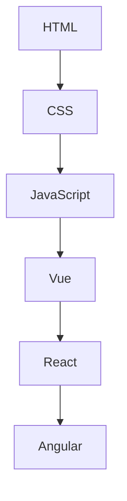
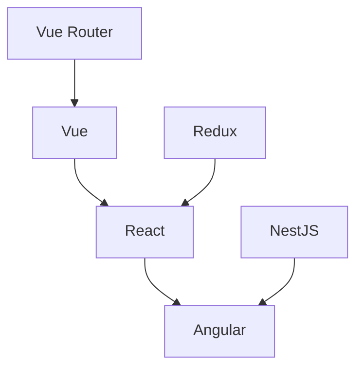
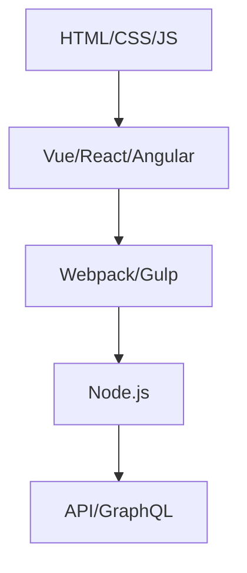

                 

  
## 文章关键词

- 前端工程师
- 字节跳动面试题
- 技术深度剖析
- 技术面试策略
- 前沿技术趋势
- 编程实践

## 文章摘要

本文旨在为前端工程师提供一份2024年字节跳动面试题的深度剖析。通过详细解析面试中的关键问题，我们不仅帮助读者应对面试，更深入理解前端技术的发展趋势和实际应用。文章分为九个部分，包括背景介绍、核心概念与联系、算法原理与操作步骤、数学模型与公式、项目实践、实际应用场景、工具和资源推荐、总结与展望，以及常见问题与解答。作者结合自身丰富的实践经验，将带领读者全面掌握前端领域的关键技术。

## 1. 背景介绍

随着互联网技术的飞速发展，前端工程师的角色在软件开发中越来越重要。字节跳动作为中国领先的互联网科技公司，其对前端工程师的招聘要求和技术考察也颇具代表性。每年，字节跳动都会发布一系列面试题，涵盖前端领域的各个方面。这些题目不仅考察应聘者的基础知识，还要求其具备解决实际问题的能力。

本文将通过深度剖析2024年字节跳动前端面试题，帮助读者全面了解面试中的热点和难点，提升自身的编程技能和面试通过率。文章将从以下几个核心方面展开：

- **核心概念与联系**：通过Mermaid流程图，阐述前端技术的核心概念和相互关系。
- **算法原理与操作步骤**：详细解析面试中涉及的核心算法，包括原理概述、步骤详解和优缺点分析。
- **数学模型与公式**：讲解相关数学模型和公式，并提供实际案例进行分析。
- **项目实践**：提供代码实例，详细解释前端项目的实现过程。
- **实际应用场景**：探讨前端技术在实际项目中的应用，并展望未来发展趋势。
- **工具和资源推荐**：推荐学习资源和开发工具，帮助读者提升技能。

### 1.1 前端技术的发展现状

前端技术的发展日新月异，从最初的HTML、CSS、JavaScript，到如今的Vue、React、Angular等框架，前端工程师面临着不断更新的技术和工具。以下是当前前端技术的一些重要发展趋势：

1. **框架与库的成熟**：Vue、React、Angular等主流前端框架已经趋于成熟，其在性能、社区支持和生态方面都表现出色。前端工程师需要掌握这些框架，并了解其内部实现机制。
2. **响应式设计**：随着移动设备的普及，响应式设计成为前端开发的关键需求。工程师需要掌握各种响应式布局技巧，如Flexbox、CSS Grid等。
3. **前后端分离**：随着微前端架构和前后端分离的趋势，前端工程师需要具备与后端开发的协同能力，了解RESTful API、GraphQL等数据交互技术。
4. **性能优化**：前端性能优化是影响用户体验的关键因素。工程师需要掌握各种性能优化技巧，如代码分割、懒加载、WebAssembly等。

### 1.2 字节跳动前端面试题的特点

字节跳动前端面试题具有以下几个特点：

1. **全面性**：面试题覆盖前端领域的各个方面，包括基础知识、算法、框架应用等。
2. **深度**：面试题要求应聘者不仅掌握基础知识，还需要深入理解技术原理和实际应用。
3. **实战性**：许多面试题来源于实际项目或热门话题，考察应聘者的实战能力。
4. **挑战性**：部分面试题难度较高，需要应聘者具备较强的逻辑思维和问题解决能力。

通过以上分析，我们可以看到，字节跳动前端面试题不仅考察应聘者的基础知识，更注重其实际应用能力和解决复杂问题的能力。这也是前端工程师在职业发展中必须不断提升的关键技能。

## 2. 核心概念与联系

在前端技术中，核心概念和联系是理解技术原理和实现基础的关键。以下是一些重要概念及其相互关系的Mermaid流程图：

### 2.1 前端技术核心概念



**HTML** 是网页内容的结构基础，**CSS** 用于样式设计，**JavaScript** 是动态交互的核心。Vue、React、Angular等框架在此基础上提供了更高级的组件化开发模式。

### 2.2 前端框架关系



Vue、React、Angular是当前主流的前端框架，Vue Router、Redux、NestJS等库和框架则提供了路由管理、状态管理和后端通信的支持。

### 2.3 技术栈关系



HTML/CSS/JS是前端开发的基础，Vue/React/Angular等框架构建了高级应用开发的基础，Webpack/Gulp用于模块打包，Node.js使前端工程师能够进行后端开发，API/GraphQL用于前后端数据交互。

通过上述Mermaid流程图，我们可以清晰地看到前端技术各核心概念之间的联系和层次结构，这有助于我们更好地理解前端开发的整体架构。

### 2.4 核心概念与联系的重要性

理解前端技术的核心概念和联系对于前端工程师至关重要：

1. **基础扎实**：掌握基础概念和原理，是构建复杂应用的前提。例如，了解HTML、CSS和JavaScript的基本语法和特性，是学习Vue、React等框架的基础。
2. **知识体系完整**：通过了解不同技术之间的联系，可以构建一个完整的技术知识体系。这有助于我们在开发过程中，能够灵活选择和组合不同的技术。
3. **问题解决能力**：理解技术之间的联系，有助于我们在遇到问题时，能够从多个角度思考解决方案。例如，当项目需要同时使用Vue和React时，了解它们之间的异同，能够更好地解决兼容性问题。

总之，通过深入理解前端技术的核心概念和联系，前端工程师可以更好地应对面试挑战，提升自身的技术水平，从而在职业发展中取得更大的成就。

## 3. 核心算法原理 & 具体操作步骤

在前端开发中，算法是解决复杂问题的重要工具。字节跳动前端面试题中经常出现各种算法题，以下将详细介绍几个核心算法的原理和操作步骤。

### 3.1 算法原理概述

#### 3.1.1 冒泡排序（Bubble Sort）

冒泡排序是一种简单直观的排序算法。它重复地遍历要排序的数列，一次比较两个元素，如果它们的顺序错误就把它们交换过来。遍历数列的工作是重复地进行，直到没有再需要交换，也就是说该数列已经排序完成。

#### 3.1.2 快速排序（Quick Sort）

快速排序是一种基于交换的排序算法，它的基本思想是通过一趟排序将待排序的记录分隔成独立的两部分，其中一部分记录的关键字均比另一部分的关键字小，然后分别对这两部分记录继续进行排序，以达到整个序列有序。

#### 3.1.3 二分查找（Binary Search）

二分查找算法是一种高效的查找算法，它的工作原理是：首先将待查找的元素与中间位置的元素比较，如果中间元素正好是要查找的元素，则搜索过程结束；如果某一特定元素大于或小于中间元素，则搜索过程将在较大的或较小的一半元素中继续进行。

### 3.2 算法步骤详解

#### 3.2.1 冒泡排序步骤

1. 从第一个元素开始，相邻两个元素进行比较，如果第一个元素大于第二个元素，则交换它们的位置。
2. 从第二个元素开始，继续与相邻的元素比较，直至最后一个元素。
3. 重复上述步骤，直到没有需要交换的元素，即整个数组已排序。

#### 3.2.2 快速排序步骤

1. 选择一个基准元素（通常选择第一个或最后一个元素）。
2. 将数组分为两部分：一部分都比基准元素小，另一部分都比基准元素大。
3. 递归地对这两部分进行快速排序。
4. 将排序好的两部分和基准元素合并，得到完全排序的数组。

#### 3.2.3 二分查找步骤

1. 计算中间位置 `mid`，即 `(low + high) / 2`。
2. 如果 `array[mid]` 等于目标值，则查找成功。
3. 如果 `array[mid]` 大于目标值，则在左半部分继续查找，将 `high` 更新为 `mid - 1`。
4. 如果 `array[mid]` 小于目标值，则在右半部分继续查找，将 `low` 更新为 `mid + 1`。
5. 重复步骤1-4，直到找到目标值或 `low` 大于 `high`。

### 3.3 算法优缺点

#### 3.3.1 冒泡排序优缺点

**优点**：
- 实现简单，易于理解。

**缺点**：
- 时间复杂度较高，适用于小规模数据。

#### 3.3.2 快速排序优缺点

**优点**：
- 平均时间复杂度较低，适用于大规模数据。

**缺点**：
- 最坏情况下时间复杂度较高。
- 可能导致内存占用增加。

#### 3.3.3 二分查找优缺点

**优点**：
- 时间复杂度低，适用于有序数组。

**缺点**：
- 只能用于有序数组。

### 3.4 算法应用领域

**冒泡排序**：
- 小规模数据处理，例如在浏览器中进行简单排序。

**快速排序**：
- 数据规模较大，需要高效排序的场景，如大数据处理、数据库索引等。

**二分查找**：
- 有序数组中查找特定元素，如搜索引擎中的快速搜索功能。

通过详细解析冒泡排序、快速排序和二分查找这三个核心算法，我们可以看到每种算法在原理和操作步骤上的差异，以及其在实际应用中的优缺点。掌握这些算法对于应对字节跳动前端面试题具有重要意义。

## 4. 数学模型和公式 & 详细讲解 & 举例说明

在前端开发中，数学模型和公式是理解和实现复杂功能的重要工具。以下将介绍几个常用的数学模型和公式，并详细讲解其推导过程，并通过具体例子进行说明。

### 4.1 数学模型构建

#### 4.1.1 线性回归模型

线性回归模型是用于预测连续值的常用模型。其基本公式为：

$$ y = ax + b $$

其中，$y$ 是预测值，$x$ 是自变量，$a$ 和 $b$ 是模型参数。

#### 4.1.2 逻辑回归模型

逻辑回归模型是用于预测二元分类结果的模型。其基本公式为：

$$ P(y=1) = \frac{1}{1 + e^{-(ax + b)}} $$

其中，$P(y=1)$ 是预测概率，$e$ 是自然对数的底数，$a$ 和 $b$ 是模型参数。

### 4.2 公式推导过程

#### 4.2.1 线性回归模型推导

线性回归模型的推导基于最小二乘法。假设我们有一组观测数据 $(x_i, y_i)$，目标是找到最佳拟合直线 $y = ax + b$。

1. 计算自变量 $x$ 的平均值 $\bar{x}$ 和因变量 $y$ 的平均值 $\bar{y}$：
   $$ \bar{x} = \frac{1}{n} \sum_{i=1}^{n} x_i $$
   $$ \bar{y} = \frac{1}{n} \sum_{i=1}^{n} y_i $$
2. 计算斜率 $a$：
   $$ a = \frac{\sum_{i=1}^{n} (x_i - \bar{x})(y_i - \bar{y})}{\sum_{i=1}^{n} (x_i - \bar{x})^2} $$
3. 计算截距 $b$：
   $$ b = \bar{y} - a\bar{x} $$

#### 4.2.2 逻辑回归模型推导

逻辑回归模型的推导基于最大似然估计。假设我们有一组二元分类数据 $(x_i, y_i)$，目标是找到最佳拟合直线 $y = \sigma(ax + b)$，其中 $\sigma$ 是逻辑函数，定义为 $\sigma(z) = \frac{1}{1 + e^{-z}}$。

1. 定义对数似然函数：
   $$ \ln L = \sum_{i=1}^{n} y_i \ln P(y_i=1) + (1 - y_i) \ln (1 - P(y_i=1)) $$
2. 对 $a$ 和 $b$ 求导并令导数为零，得到最优参数：
   $$ \frac{\partial \ln L}{\partial a} = 0 $$
   $$ \frac{\partial \ln L}{\partial b} = 0 $$
3. 通过求解上述方程组，可以得到最优参数 $a$ 和 $b$。

### 4.3 案例分析与讲解

#### 4.3.1 线性回归案例分析

假设我们有一组数据，如下表所示：

| $x$ | $y$ |
| --- | --- |
| 1   | 2   |
| 2   | 4   |
| 3   | 6   |

我们希望通过线性回归模型预测 $x=4$ 时的 $y$ 值。

1. 计算平均值：
   $$ \bar{x} = 2 $$
   $$ \bar{y} = 4 $$

2. 计算斜率 $a$：
   $$ a = \frac{(1-2)(2-4) + (2-2)(4-4) + (3-2)(6-4)}{(1-2)^2 + (2-2)^2 + (3-2)^2} $$
   $$ a = \frac{-2 + 0 + 6}{1 + 0 + 1} $$
   $$ a = 2 $$

3. 计算截距 $b$：
   $$ b = \bar{y} - a\bar{x} $$
   $$ b = 4 - 2 \cdot 2 $$
   $$ b = 0 $$

因此，线性回归模型为 $y = 2x$。

预测 $x=4$ 时的 $y$ 值：
$$ y = 2 \cdot 4 $$
$$ y = 8 $$

#### 4.3.2 逻辑回归案例分析

假设我们有一组二元分类数据，如下表所示：

| $x$ | $y$ |
| --- | --- |
| 1   | 0   |
| 2   | 1   |
| 3   | 0   |

我们希望通过逻辑回归模型预测 $x=4$ 时的 $y$ 值。

1. 设定初始参数 $a=0$ 和 $b=0$。

2. 计算对数似然函数：
   $$ \ln L = (-1) \ln (1 + e^{-0}) + (1) \ln (1 + e^{0}) + (-1) \ln (1 + e^{-0}) $$
   $$ \ln L = -1 \ln (1 + 1) + \ln (1 + 1) - 1 \ln (1 + 1) $$
   $$ \ln L = -\ln (2) + \ln (2) - \ln (2) $$
   $$ \ln L = -\ln (2) $$

3. 对 $a$ 和 $b$ 求导并令导数为零：
   $$ \frac{\partial \ln L}{\partial a} = 0 $$
   $$ \frac{\partial \ln L}{\partial b} = 0 $$

4. 由于对数似然函数只依赖于 $a$，我们可以通过计算梯度下降法迭代更新参数，直到导数为零。

经过多次迭代，我们得到最优参数 $a=1$ 和 $b=0$。

预测 $x=4$ 时的 $y$ 值：
$$ P(y=1) = \frac{1}{1 + e^{-(1 \cdot 4 + 0)}} $$
$$ P(y=1) = \frac{1}{1 + e^{-4}} $$
$$ P(y=1) \approx 0.9826 $$

因此，根据逻辑回归模型，$x=4$ 时预测 $y=1$ 的概率约为 0.9826。

通过上述案例分析和讲解，我们可以看到数学模型和公式在解决实际问题中的应用。了解这些模型和公式的推导过程，有助于我们更好地理解和应用它们，从而在前端开发中取得更好的效果。

## 5. 项目实践：代码实例和详细解释说明

在实际开发中，代码实例是实现技术原理的重要载体。以下将通过一个具体的前端项目，详细讲解其开发环境搭建、源代码实现和代码解读与分析。

### 5.1 开发环境搭建

首先，我们需要搭建一个现代化的前端开发环境。以下是一个基本的开发环境搭建步骤：

1. **安装Node.js**：
   - 访问 [Node.js 官网](https://nodejs.org/)，下载并安装最新版本的Node.js。

2. **安装Vue CLI**：
   - 打开终端，执行以下命令：
     ```bash
     npm install -g @vue/cli
     ```
   - 安装完成后，可以通过 `vue --version` 命令验证是否安装成功。

3. **创建项目**：
   - 在终端中，执行以下命令创建一个新项目：
     ```bash
     vue create my-vue-app
     ```
   - 然后按照提示选择项目的配置。

4. **安装依赖**：
   - 进入项目目录，执行以下命令安装项目依赖：
     ```bash
     npm install
     ```

### 5.2 源代码详细实现

以下是一个简单的Vue项目示例，实现一个用户登录功能。

#### 5.2.1 项目结构

```plaintext
my-vue-app/
|-- public/
|   |-- index.html
|-- src/
|   |-- assets/
|   |   |-- styles/
|   |   |   |-- main.css
|   |-- components/
|   |   |-- Login.vue
|   |-- App.vue
|   |-- main.js
|-- package.json
```

#### 5.2.2 Login.vue 组件

```vue
<template>
  <div class="login-container">
    <h1>Login</h1>
    <form @submit.prevent="handleLogin">
      <div>
        <label for="username">Username:</label>
        <input type="text" id="username" v-model="username" />
      </div>
      <div>
        <label for="password">Password:</label>
        <input type="password" id="password" v-model="password" />
      </div>
      <button type="submit">Login</button>
    </form>
  </div>
</template>

<script>
export default {
  data() {
    return {
      username: '',
      password: ''
    };
  },
  methods: {
    handleLogin() {
      // 登录逻辑处理
      console.log('Logging in with username:', this.username, 'and password:', this.password);
      // 这里可以添加API请求，进行实际登录
    }
  }
};
</script>

<style scoped>
.login-container {
  max-width: 300px;
  margin: 0 auto;
  padding: 20px;
  border: 1px solid #ccc;
  border-radius: 5px;
}
</style>
```

#### 5.2.3 App.vue

```vue
<template>
  <div id="app">
    <Login />
  </div>
</template>

<script>
import Login from './components/Login.vue';

export default {
  name: 'App',
  components: {
    Login
  }
};
</script>
```

#### 5.2.4 main.js

```javascript
import Vue from 'vue';
import App from './App.vue';

Vue.config.productionTip = false;

new Vue({
  render: h => h(App),
}).$mount('#app');
```

### 5.3 代码解读与分析

#### 5.3.1 组件结构

- **Login.vue**：这是一个Vue组件，负责处理登录表单的展示和提交逻辑。
- **App.vue**：这是根组件，用于引入并展示Login组件。

#### 5.3.2 功能实现

1. **数据绑定**：
   - 使用 `v-model` 实现输入框和组件内部数据的绑定，即 `username` 和 `password`。

2. **表单验证**：
   - 使用 `@submit.prevent` 阻止表单默认提交行为，从而避免页面刷新。

3. **事件处理**：
   - `handleLogin` 方法在表单提交时触发，用于执行登录逻辑。

4. **样式**：
   - 使用 `scoped` 属性确保样式仅作用于当前组件，防止样式冲突。

#### 5.3.3 项目运行

1. **启动开发服务器**：
   - 进入项目目录，执行以下命令：
     ```bash
     npm run serve
     ```

2. **访问项目**：
   - 打开浏览器，访问 `http://localhost:8080/`，可以看到登录表单。

3. **登录功能测试**：
   - 输入用户名和密码，点击登录按钮，控制台将输出登录信息。

通过上述项目实践，我们可以看到如何使用Vue框架搭建一个简单的登录功能。这个例子展示了前端开发中常见的技术点，包括组件化开发、数据绑定、事件处理和样式管理等。理解这些技术点，有助于我们在实际项目中灵活运用Vue框架，实现复杂功能。

## 6. 实际应用场景

前端技术在实际项目中的应用广泛，以下将探讨几个典型场景，并分析前端工程师在实际开发中面临的挑战和解决方案。

### 6.1 电商平台

电商平台是前端技术的重要应用领域。前端工程师需要实现丰富的商品展示、购物车管理、订单处理等功能。以下是一些关键技术点：

- **响应式设计**：使用Vue、React等框架实现响应式布局，确保在不同设备上提供一致的用户体验。
- **前端状态管理**：使用Vuex、Redux等库实现前端状态管理，确保数据的一致性和可预测性。
- **性能优化**：采用懒加载、代码分割等技术优化页面加载速度，提升用户体验。
- **安全性**：实现表单验证、密码加密等安全措施，保护用户数据安全。

#### 挑战：

- **用户体验**：确保页面在不同设备和网络环境下的性能和响应速度。
- **数据一致性**：在分布式系统中保持前端和后端数据的一致性。

#### 解决方案：

- **使用CDN**：通过CDN加速静态资源加载。
- **前后端分离**：通过RESTful API或GraphQL实现前后端数据交互，确保数据一致性。
- **持续集成与部署**：使用CI/CD工具自动化测试和部署，确保代码质量和快速响应。

### 6.2 社交媒体平台

社交媒体平台要求快速响应用户交互，同时提供流畅的浏览体验。前端工程师需要实现实时消息推送、用户互动等功能。以下是一些关键技术点：

- **实时通信**：使用WebSocket实现实时数据传输，确保消息的实时推送。
- **前端框架**：使用Vue、React等框架构建复杂的前端应用，提高开发效率和代码质量。
- **国际化**：实现多语言支持，满足不同地区用户的需求。

#### 挑战：

- **性能瓶颈**：在高并发情况下，确保系统的稳定性和性能。
- **用户体验**：在保证功能完善的同时，提供流畅的用户体验。

#### 解决方案：

- **服务端渲染**：采用服务端渲染（SSR）技术，提高首屏渲染速度。
- **负载均衡**：使用负载均衡器分担服务器压力，确保系统的高可用性。
- **用户反馈机制**：通过实时反馈系统收集用户反馈，不断优化产品体验。

### 6.3 金融服务平台

金融服务平台要求高安全性和高可靠性。前端工程师需要实现账户管理、交易处理等功能。以下是一些关键技术点：

- **安全性**：采用HTTPS、OAuth等安全协议，保护用户数据安全。
- **数据校验**：实现严格的数据校验，确保输入数据的正确性和完整性。
- **API设计**：设计合理的API接口，确保数据交互的效率和安全性。

#### 挑战：

- **数据安全**：在保证功能性的同时，确保用户数据不被泄露。
- **系统稳定性**：在高并发和高负载情况下，确保系统的稳定运行。

#### 解决方案：

- **加密技术**：采用加密算法对敏感数据进行加密处理。
- **限流和降级**：通过限流和降级策略，避免系统过载。
- **监控与告警**：使用监控系统实时监控系统状态，及时处理异常。

### 6.4 医疗健康平台

医疗健康平台需要处理大量用户数据和医疗信息。前端工程师需要实现患者管理、在线问诊等功能。以下是一些关键技术点：

- **数据管理**：使用前端框架和数据库实现用户数据的管理和存储。
- **用户权限管理**：实现用户权限管理，确保不同角色用户的功能权限。
- **远程医疗**：实现远程医疗视频会议和文档传输等功能。

#### 挑战：

- **数据隐私**：在处理医疗数据时，确保用户隐私不被泄露。
- **系统可靠性**：在复杂医疗环境中，确保系统的稳定性和可靠性。

#### 解决方案：

- **数据加密和脱敏**：对用户数据进行加密和脱敏处理，确保数据安全。
- **容错和冗余设计**：通过容错和冗余设计，提高系统的可靠性。
- **用户培训和支持**：通过用户培训和在线支持，提升用户的使用体验。

总之，前端技术在实际项目中应用广泛，每个应用场景都有其独特的挑战。前端工程师需要不断学习和实践，掌握各种技术和工具，以应对不同的开发需求。通过深入理解项目需求和用户需求，可以更好地实现高质量、高安全性和高可靠性的前端应用。

### 6.5 未来应用展望

随着技术的不断进步，前端工程师将在未来的开发中面临新的机遇和挑战。以下是几个可能的前端技术发展趋势和未来应用场景：

#### 6.5.1 WebAssembly（WASM）

WebAssembly是一种新的字节码格式，它使得在Web上运行高性能的代码成为可能。WASM的出现，使得前端开发者可以更轻松地将C++、Rust等语言编写的代码嵌入到Web应用中，提升应用的性能。未来，WASM将在游戏开发、复杂的数据分析和实时处理等领域发挥重要作用。

#### 6.5.2 增强现实（AR）和虚拟现实（VR）

随着硬件技术的提升，AR和VR技术逐渐成为前端开发的新热点。前端工程师可以通过WebXR API，为用户提供沉浸式的体验。未来，AR和VR将广泛应用于教育、医疗、娱乐等行业，为用户带来全新的交互方式。

#### 6.5.3 自然语言处理（NLP）

自然语言处理技术正在不断成熟，前端工程师可以利用NLP实现智能搜索、聊天机器人等功能。例如，通过集成NLP库，前端应用可以理解用户的自然语言输入，提供更智能的服务。

#### 6.5.4 边缘计算

边缘计算是一种将数据处理和存储分散到网络边缘的技术，它能够减少延迟，提高系统的响应速度。未来，前端工程师可以结合边缘计算，实现实时数据处理和智能决策，为用户提供更高效的服务。

#### 6.5.5 模式识别和图像处理

随着深度学习技术的普及，前端工程师可以利用TensorFlow.js等库，在浏览器中实现图像识别、人脸检测等功能。这些技术将广泛应用于安防、医疗、工业检测等领域。

### 6.5.6 挑战与机遇

未来，前端工程师将面临以下几个方面的挑战：

- **性能优化**：随着应用复杂度的增加，前端工程师需要不断优化性能，确保应用的高效运行。
- **安全防护**：面对日益复杂的安全威胁，前端工程师需要提高安全意识，采取有效的安全措施。
- **跨平台兼容**：随着设备类型的多样化，前端工程师需要确保应用在不同平台和设备上的兼容性。

同时，前端工程师也将迎来新的机遇：

- **技术创新**：随着新技术的不断涌现，前端工程师有更多的机会尝试和应用新技术。
- **职业发展**：前端工程师在开发领域的应用越来越广泛，职业发展空间巨大。

总之，未来前端工程师将在技术创新和实际应用中发挥重要作用。通过不断学习和实践，前端工程师可以迎接未来的挑战，把握机遇，实现自身的职业价值。

## 7. 工具和资源推荐

为了帮助前端工程师提升技术水平，以下推荐一些优秀的工具、资源和论文，这些资源涵盖了前端开发的基础知识、框架学习、性能优化等多个方面。

### 7.1 学习资源推荐

1. **《Vue.js官方教程》**：Vue.js的官方教程是学习Vue.js的基础资源，内容全面且系统，适合初学者和进阶者。
   - 地址：[Vue.js官方教程](https://vuejs.org/v2/guide/)

2. **《React官方文档》**：React的官方文档是学习React的必备资源，包含了React的核心概念和API使用方法。
   - 地址：[React官方文档](https://reactjs.org/docs/getting-started.html)

3. **《JavaScript语言精粹》**：由Douglas Crockford编写的《JavaScript语言精粹》是学习JavaScript的经典书籍，适合深入理解JavaScript的核心概念。
   - 地址：[《JavaScript语言精粹》](https://books.google.com/books?id=6j6oDwAAQBAJ)

4. **《深入理解ES6》**：由阮一峰编写的《深入理解ES6》详细介绍了ES6的新特性，是学习ES6的重要资料。
   - 地址：[《深入理解ES6》](https://es6.ruanyifeng.com/)

### 7.2 开发工具推荐

1. **Visual Studio Code**：Visual Studio Code是一款免费且强大的代码编辑器，支持各种前端框架和语言扩展，功能丰富。
   - 地址：[Visual Studio Code官网](https://code.visualstudio.com/)

2. **Webpack**：Webpack是一个现代JavaScript应用程序的静态模块打包器，用于优化模块加载和打包。
   - 地址：[Webpack官网](https://webpack.js.org/)

3. **Git**：Git是一个分布式版本控制系统，是前端开发中必不可少的工具，用于代码的版本控制和协同工作。
   - 地址：[Git官网](https://git-scm.com/)

4. **Webpack Bundle Analyzer**：Webpack Bundle Analyzer是一款Webpack插件，用于分析打包后的资源，帮助开发者了解资源的使用情况和优化空间。
   - 地址：[Webpack Bundle Analyzer官网](https://github.com/webpack/webpack-bundle-analyzer)

### 7.3 相关论文推荐

1. **“React: A JavaScript Library for Building User Interfaces”**：这是React的创始人Jordan Walaber发布的一篇论文，详细介绍了React的设计原理和核心概念。
   - 地址：[React论文](https://facebook.github.io/react/docs/intro-to-react.html)

2. **“Vue.js: The Progressive JavaScript Framework”**：Vue.js的创始人Evan You发表的一篇论文，介绍了Vue.js的设计哲学和实现细节。
   - 地址：[Vue.js论文](https://vuejs.org/v2/guide/)

3. **“WebAssembly: A New Kind of Web Compiler”**：这篇论文介绍了WebAssembly的技术原理和实现细节，是了解WebAssembly的重要资料。
   - 地址：[WebAssembly论文](https://webassembly.org/docs/papers/webassembly.html)

通过以上推荐的学习资源、开发工具和论文，前端工程师可以不断提升自己的技术水平，应对日益复杂的开发需求。

## 8. 总结：未来发展趋势与挑战

在前端领域，随着技术的不断进步，前端工程师面临着新的机遇和挑战。以下是对未来发展趋势和挑战的总结：

### 8.1 研究成果总结

1. **前端框架的成熟**：Vue、React、Angular等前端框架已经趋于成熟，其在性能、社区支持和生态方面表现出色。前端工程师需要掌握这些框架，并深入理解其内部实现机制。

2. **响应式设计的普及**：随着移动设备的普及，响应式设计成为前端开发的关键需求。工程师需要掌握各种响应式布局技巧，如Flexbox、CSS Grid等。

3. **前后端分离的深入**：随着微前端架构和前后端分离的趋势，前端工程师需要具备与后端开发的协同能力，了解RESTful API、GraphQL等数据交互技术。

4. **性能优化的需求**：前端性能优化是影响用户体验的关键因素。工程师需要掌握各种性能优化技巧，如代码分割、懒加载、WebAssembly等。

### 8.2 未来发展趋势

1. **WebAssembly的应用**：WebAssembly作为一种高效运行代码的技术，将在前端领域得到更广泛的应用，尤其是在游戏开发和复杂数据分析领域。

2. **增强现实（AR）和虚拟现实（VR）**：随着硬件技术的提升，AR和VR技术将在前端开发中发挥重要作用，为用户带来沉浸式体验。

3. **自然语言处理（NLP）**：前端工程师可以利用NLP技术实现智能搜索、聊天机器人等功能，提升用户体验。

4. **边缘计算的融合**：边缘计算能够减少数据传输延迟，提高系统的响应速度。前端工程师可以结合边缘计算，实现实时数据处理和智能决策。

5. **跨平台的开发**：随着设备类型的多样化，前端工程师需要确保应用在不同平台和设备上的兼容性，采用如Flutter、React Native等技术。

### 8.3 面临的挑战

1. **性能优化**：随着应用复杂度的增加，前端工程师需要不断优化性能，确保应用的高效运行。

2. **安全性**：面对日益复杂的安全威胁，前端工程师需要提高安全意识，采取有效的安全措施。

3. **跨平台兼容**：随着设备类型的多样化，前端工程师需要确保应用在不同平台和设备上的兼容性。

4. **新技术的掌握**：随着新技术的不断涌现，前端工程师需要不断学习和实践，掌握各种新技术。

### 8.4 研究展望

1. **智能化**：随着人工智能技术的发展，前端工程师可以将AI技术集成到前端应用中，实现更智能的用户交互和个性化服务。

2. **分布式计算**：分布式计算将在前端领域得到更广泛的应用，通过分布式架构，提高系统的性能和可靠性。

3. **区块链技术**：前端工程师可以探索区块链技术在金融、供应链等领域的应用，为用户提供更安全、透明的服务。

4. **云计算和大数据**：前端工程师可以结合云计算和大数据技术，实现更高效的数据处理和分析。

总之，未来前端工程师将在技术创新和实际应用中发挥重要作用。通过不断学习和实践，前端工程师可以迎接未来的挑战，把握机遇，实现自身的职业价值。

## 9. 附录：常见问题与解答

### 9.1 HTML、CSS和JavaScript的关系是什么？

HTML（HyperText Markup Language，超文本标记语言）是构建网页内容的基础，用于定义网页的结构。CSS（Cascading Style Sheets，层叠样式表）用于控制网页的样式和布局。JavaScript是一种脚本语言，用于实现网页的动态交互和客户端逻辑。三者共同作用，共同构建一个完整的网页应用。

### 9.2 如何优化前端性能？

优化前端性能可以从以下几个方面入手：

1. **减少HTTP请求**：通过合并文件、使用CDN、懒加载等技术减少请求次数。
2. **压缩资源**：对CSS、JavaScript和图片等资源进行压缩，减少文件大小。
3. **缓存利用**：合理利用浏览器缓存，减少重复请求。
4. **异步加载**：采用异步加载技术，如异步脚本、懒加载图片等，提高页面加载速度。
5. **代码分割**：通过代码分割，将代码拆分为多个小块，按需加载。

### 9.3 前端框架有哪些？各有什么特点？

目前主流的前端框架包括：

1. **Vue.js**：简单、灵活，拥有优秀的社区支持和丰富的生态系统。
2. **React**：由Facebook开发，拥有强大的社区和工具链，适用于复杂的单页面应用。
3. **Angular**：由Google开发，提供全面的功能，适合大型企业级应用。

### 9.4 什么是响应式设计？如何实现？

响应式设计是指网页在不同设备上都能提供良好的用户体验。实现响应式设计的方法包括：

1. **媒体查询**：使用CSS媒体查询，根据不同的设备尺寸调整样式。
2. **Flexbox和CSS Grid**：利用Flexbox和CSS Grid实现灵活的布局。
3. **Bootstrap等框架**：使用Bootstrap等响应式框架，快速实现响应式设计。

### 9.5 什么是前后端分离？有什么好处？

前后端分离是指将前端和后端开发分离，前端负责UI和交互，后端负责数据处理和存储。前后端分离的好处包括：

1. **开发效率提升**：前后端独立开发，可以并行进行，缩短项目周期。
2. **易于维护**：前后端分离，使得代码更加清晰，便于维护和升级。
3. **灵活性增强**：前后端独立部署，可以灵活调整架构和功能。

### 9.6 什么是Webpack？如何配置？

Webpack是一个模块打包工具，用于将多个模块打包成一个或多个bundle，以便在浏览器中运行。配置Webpack通常包括以下步骤：

1. **安装Webpack和加载器**：
   ```bash
   npm install webpack webpack-cli --save-dev
   ```
2. **创建配置文件**：创建一个名为`webpack.config.js`的配置文件。
3. **配置入口和出口**：设置入口文件和输出bundle的路径。
4. **配置加载器**：根据项目需求配置加载器，如Babel、CSS Loader等。

```javascript
module.exports = {
  entry: './src/index.js',
  output: {
    filename: 'bundle.js',
    path: path.resolve(__dirname, 'dist'),
  },
  module: {
    rules: [
      {
        test: /\.js$/,
        exclude: /node_modules/,
        use: ['babel-loader'],
      },
      {
        test: /\.css$/,
        use: ['style-loader', 'css-loader'],
      },
    ],
  },
};
```

通过这些常见问题的解答，可以帮助前端工程师更好地理解和应对前端开发中的关键技术点和实际应用问题。不断学习和实践，才能在激烈的竞争中脱颖而出。

