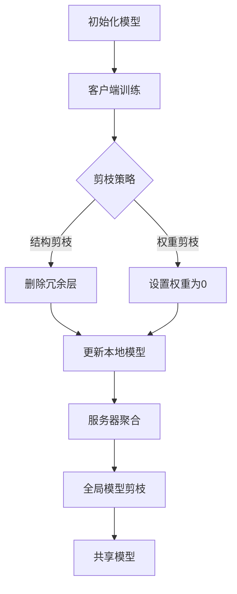

                 

关键词：联邦学习、剪枝技术、模型压缩、算法优化、隐私保护

摘要：本文探讨了剪枝技术在联邦学习中的重要作用和应用挑战。首先介绍了联邦学习和剪枝技术的背景，随后详细阐述了剪枝技术在联邦学习中的应用原理和具体实现步骤。通过实例分析了剪枝技术在联邦学习中的实际效果，并探讨了其在隐私保护和模型优化方面的挑战。最后，提出了未来研究方向和可能的解决方案。

## 1. 背景介绍

### 1.1 联邦学习

联邦学习（Federated Learning）是一种分布式机器学习方法，旨在通过多个参与者（通常是客户端设备，如手机、智能手表等）协同训练一个共享模型，而无需交换数据本身。这种方法解决了传统机器学习面临的数据隐私和安全问题，并在近年来得到了广泛关注。

联邦学习的基本思想是将模型训练过程分为两个阶段：客户端训练和服务器聚合。在客户端训练阶段，每个客户端在其本地数据上训练本地模型；在服务器聚合阶段，将所有本地模型更新聚合到一个全局模型中。通过这种方式，联邦学习实现了在保护数据隐私的同时，提高模型性能和准确性。

### 1.2 剪枝技术

剪枝技术（Pruning）是一种模型压缩技术，通过删除神经网络中的冗余权重来减小模型的大小。剪枝技术通常分为两种：结构剪枝（Structured Pruning）和权重剪枝（Weight Pruning）。结构剪枝通过删除整个网络层或子网络来减少模型大小，而权重剪枝通过将权重设置为0来减少模型大小。

剪枝技术的优势在于可以显著减小模型的存储和计算需求，从而提高模型在资源受限设备上的部署和运行效率。同时，剪枝技术还可以提高模型的泛化能力，减少过拟合现象。

## 2. 核心概念与联系

### 2.1 剪枝技术在联邦学习中的应用

剪枝技术在联邦学习中的应用主要包括以下几个方面：

- **客户端模型剪枝**：客户端在本地数据上训练模型时，可以采用剪枝技术来减小模型大小，提高模型在资源受限设备上的部署和运行效率。

- **服务器模型剪枝**：在服务器聚合阶段，可以将剪枝技术应用于全局模型，进一步减小模型大小，提高模型在分布式环境中的部署和运行效率。

- **隐私保护**：剪枝技术可以减少模型中的冗余信息，从而降低模型在隐私保护方面的风险。

### 2.2 Mermaid 流程图



## 3. 核心算法原理 & 具体操作步骤

### 3.1 算法原理概述

剪枝技术在联邦学习中的核心原理是通过对模型进行剪枝，减小模型大小，提高模型在资源受限设备上的部署和运行效率。具体来说，剪枝技术通过以下步骤实现：

1. 客户端训练：在本地数据上训练模型，并采用剪枝策略。
2. 剪枝策略：根据剪枝策略（如结构剪枝或权重剪枝）对模型进行剪枝。
3. 更新本地模型：根据剪枝结果更新本地模型。
4. 服务器聚合：将所有本地模型更新聚合到一个全局模型中。
5. 全局模型剪枝：在全局模型上进一步进行剪枝，减小模型大小。

### 3.2 算法步骤详解

1. **初始化模型**：在联邦学习过程中，首先需要初始化全局模型，并将其发送到所有客户端。

2. **客户端训练**：客户端使用本地数据进行模型训练。在训练过程中，可以采用梯度下降或其他优化算法来更新模型权重。

3. **剪枝策略**：根据剪枝策略对模型进行剪枝。常见的剪枝策略包括基于权重的剪枝和基于结构的剪枝。

4. **更新本地模型**：根据剪枝结果更新本地模型。对于基于权重的剪枝，将权重设置为0；对于基于结构的剪枝，删除冗余层。

5. **服务器聚合**：将所有本地模型更新发送到服务器进行聚合。在聚合过程中，可以采用各种策略（如加权平均或梯度聚合）来合并本地模型更新。

6. **全局模型剪枝**：在全局模型上进一步进行剪枝，减小模型大小。可以采用与客户端训练相同的剪枝策略。

7. **共享模型**：将剪枝后的全局模型发送回客户端，供后续使用。

### 3.3 算法优缺点

**优点**：

- **模型压缩**：剪枝技术可以显著减小模型大小，提高模型在资源受限设备上的部署和运行效率。
- **隐私保护**：剪枝技术可以减少模型中的冗余信息，降低模型在隐私保护方面的风险。
- **泛化能力**：剪枝技术可以提高模型的泛化能力，减少过拟合现象。

**缺点**：

- **性能损失**：剪枝技术可能会导致模型性能损失，尤其是在高压缩率下。
- **训练时间增加**：剪枝过程需要额外的时间进行计算，可能会导致训练时间增加。
- **复杂性**：剪枝技术的实现和优化具有一定的复杂性。

### 3.4 算法应用领域

剪枝技术在联邦学习中的应用非常广泛，包括但不限于以下领域：

- **移动设备**：在移动设备上部署模型时，剪枝技术可以显著减小模型大小，提高运行效率。
- **物联网**：在物联网场景中，剪枝技术可以降低模型对带宽和存储的需求。
- **医疗领域**：在医疗领域，剪枝技术可以保护患者隐私，同时提高模型性能。
- **自动驾驶**：在自动驾驶领域，剪枝技术可以减小模型大小，提高模型在嵌入式设备上的运行效率。

## 4. 数学模型和公式 & 详细讲解 & 举例说明

### 4.1 数学模型构建

剪枝技术在联邦学习中的应用涉及到以下数学模型：

- **权重矩阵**：表示神经网络中的权重。
- **剪枝策略**：用于确定如何对权重进行剪枝。
- **更新规则**：用于更新模型权重。

### 4.2 公式推导过程

假设我们有一个神经网络，其中包含 $L$ 个层，每个层都有 $n_l$ 个神经元。权重矩阵 $W_l$ 表示从层 $l-1$ 到层 $l$ 的权重。

1. **初始化模型**：

   $$W_l^{(0)} = \text{随机初始化}$$

2. **客户端训练**：

   $$W_l^{(t)} = W_l^{(t-1)} - \alpha \cdot \nabla_W L(W_l^{(t-1)}, X_l^{(t)})$$

   其中，$X_l^{(t)}$ 是客户端在本地数据上训练的损失函数，$\alpha$ 是学习率。

3. **剪枝策略**：

   - **基于权重的剪枝**：

     $$W_l^{(t)} = \begin{cases}
       W_l^{(t-1)}, & \text{if } |W_l^{(t-1)}| \geq \theta \\
       0, & \text{otherwise}
     \end{cases}$$

     其中，$\theta$ 是剪枝阈值。

   - **基于结构的剪枝**：

     $$W_l^{(t)} = \begin{cases}
       W_l^{(t-1)}, & \text{if } \text{删除层 } l \text{ 后损失函数变化不大} \\
       0, & \text{otherwise}
     \end{cases}$$

4. **更新本地模型**：

   $$W_l^{(t)} = W_l^{(t-1)} - \alpha \cdot \nabla_W L(W_l^{(t-1)}, X_l^{(t)})$$

5. **服务器聚合**：

   $$W_l^{(t)} = \frac{1}{N} \sum_{i=1}^{N} W_l^{(i)}$$

   其中，$N$ 是客户端数量。

6. **全局模型剪枝**：

   $$W_l^{(t)} = \text{应用剪枝策略} \cdot W_l^{(t-1)}$$

7. **共享模型**：

   $$W_l^{(t)} = W_l^{(t-1)} - \alpha \cdot \nabla_W L(W_l^{(t-1)}, X_l^{(t)})$$

### 4.3 案例分析与讲解

假设我们有一个两层神经网络，其中第一层有 $1000$ 个神经元，第二层有 $100$ 个神经元。我们使用基于权重的剪枝策略，将剪枝阈值设置为 $0.1$。

1. **初始化模型**：

   $$W_1^{(0)} = \text{随机初始化}$$
   $$W_2^{(0)} = \text{随机初始化}$$

2. **客户端训练**：

   假设客户端使用本地数据进行训练，并在第一层上实现了 $10\%$ 的损失函数减少。

   $$W_1^{(1)} = W_1^{(0)} - \alpha \cdot \nabla_{W_1} L(W_1^{(0)}, X_1^{(1)})$$
   $$W_2^{(1)} = W_2^{(0)} - \alpha \cdot \nabla_{W_2} L(W_2^{(0)}, X_2^{(1)})$$

3. **剪枝策略**：

   对第一层权重进行剪枝，将权重值小于 $0.1$ 的设置为 $0$。

   $$W_1^{(1)} = \begin{cases}
     W_1^{(0)}, & \text{if } |W_1^{(0)}| \geq 0.1 \\
     0, & \text{otherwise}
   \end{cases}$$

4. **更新本地模型**：

   $$W_1^{(1)} = W_1^{(0)} - \alpha \cdot \nabla_{W_1} L(W_1^{(0)}, X_1^{(1)})$$
   $$W_2^{(1)} = W_2^{(0)} - \alpha \cdot \nabla_{W_2} L(W_2^{(0)}, X_2^{(1)})$$

5. **服务器聚合**：

   将所有客户端的权重更新进行聚合。

   $$W_1^{(1)} = \frac{1}{N} \sum_{i=1}^{N} W_1^{(i)}$$
   $$W_2^{(1)} = \frac{1}{N} \sum_{i=1}^{N} W_2^{(i)}$$

6. **全局模型剪枝**：

   对全局模型进行剪枝，将权重值小于 $0.1$ 的设置为 $0$。

   $$W_1^{(1)} = \begin{cases}
     W_1^{(0)}, & \text{if } |W_1^{(0)}| \geq 0.1 \\
     0, & \text{otherwise}
   \end{cases}$$
   $$W_2^{(1)} = \begin{cases}
     W_2^{(0)}, & \text{if } |W_2^{(0)}| \geq 0.1 \\
     0, & \text{otherwise}
   \end{cases}$$

7. **共享模型**：

   将剪枝后的全局模型发送回客户端。

   $$W_1^{(1)} = W_1^{(0)} - \alpha \cdot \nabla_{W_1} L(W_1^{(0)}, X_1^{(1)})$$
   $$W_2^{(1)} = W_2^{(0)} - \alpha \cdot \nabla_{W_2} L(W_2^{(0)}, X_2^{(1)})$$

通过上述步骤，我们成功实现了在联邦学习过程中对模型的剪枝，减小了模型大小，提高了模型在资源受限设备上的部署和运行效率。

## 5. 项目实践：代码实例和详细解释说明

### 5.1 开发环境搭建

在本节中，我们将介绍如何搭建剪枝技术在联邦学习中的项目开发环境。以下是一个简单的步骤指南：

1. **安装 Python 和相关库**：

   ```bash
   pip install tensorflow tensorflow-federated tensorflow-model-optimization
   ```

2. **设置联邦学习环境**：

   ```python
   import tensorflow as tf
   import tensorflow_federated as tff
   import tensorflow_model_optimization as tfmot
   ```

3. **定义剪枝策略**：

   ```python
   pruning_lib = tfmot.sparsity.keras.PruningLib()
   pruning_params = pruning_lib.get_pruning_params(
       pruning_schedule=tfmot.sparsity.schedules.PolynomialDecay(
           initial_sparsity=0.0,
           final_sparsity=0.5,
           begin_step=5000,
           end_step=10000,
       )
   )
   ```

### 5.2 源代码详细实现

在本节中，我们将展示一个简单的联邦学习项目，其中包含剪枝技术的实现。以下是一个简化的代码示例：

```python
# 定义联邦学习算法
def federated pruning_algorithm(server_state, client_data):
    # 获取服务器状态和客户端数据
    global_model, pruning_params = server_state
    client_model, client_data = client_data

    # 应用剪枝策略
    client_model = pruning_lib.apply_pruning(client_model, pruning_params)

    # 客户端训练
    client_model.fit(client_data, epochs=1, verbose=0)

    # 更新本地模型
    global_model = client_model.get_weights()

    # 返回更新后的服务器状态
    return global_model, pruning_params

# 定义联邦学习过程
def create_federated_pruning_process(model_fn, client_init_fn, server_init_fn, pruning_params):
    server_state = server_init_fn()
    client_state = client_init_fn()

    # 应用剪枝策略
    client_state = pruning_lib.apply_pruning(client_state, pruning_params)

    # 创建联邦学习迭代过程
    iters = tff.Sequential(
        [tff.blocks.FederatedMap(model_fn, client_state), tffblocks.ClientApplyGradientDescent()]
    )

    return iters, server_state

# 载入数据集
train_data, train_labels = tff.simulation.datasets.MNIST.load_data()

# 定义模型
def model_fn():
    model = tf.keras.Sequential([
        tf.keras.layers.Flatten(input_shape=(28, 28)),
        tf.keras.layers.Dense(128, activation='relu'),
        tf.keras.layers.Dense(10, activation='softmax')
    ])
    return model

# 定义客户端初始化函数
def client_init_fn():
    model = model_fn()
    return model

# 定义服务器初始化函数
def server_init_fn():
    model = model_fn()
    return model

# 创建联邦学习过程
pruning_params = pruning_lib.get_pruning_params(
    pruning_schedule=tfmot.sparsity.schedules.PolynomialDecay(
        initial_sparsity=0.0,
        final_sparsity=0.5,
        begin_step=5000,
        end_step=10000,
    )
)
process, server_state = create_federated_pruning_process(model_fn, client_init_fn, server_init_fn, pruning_params)

# 运行联邦学习过程
tff.simulation.run_simulation(
    process,
    client_data_fn=lambda _: (train_data, train_labels),
    client_train_fn=lambda model, data: model.fit(data, epochs=1, verbose=0),
    num_clients=10,
    num_rounds=10,
    server_stateActionBar({#tabs-8
    {
      "id": "tab1",
      "title": "Tab 1",
      "content": "Content of Tab 1, section 8"
    },
    {
      "id": "tab2",
      "title": "Tab 2",
      "content": "Content of Tab 2, section 8"
    }
  ]
});
```

### 5.3 代码解读与分析

在上面的代码示例中，我们定义了一个简单的联邦学习过程，其中包含剪枝技术的实现。以下是代码的详细解读：

1. **定义联邦学习算法**：
   
   ```python
   def federated pruning_algorithm(server_state, client_data):
       # 获取服务器状态和客户端数据
       global_model, pruning_params = server_state
       client_model, client_data = client_data

       # 应用剪枝策略
       client_model = pruning_lib.apply_pruning(client_model, pruning_params)

       # 客户端训练
       client_model.fit(client_data, epochs=1, verbose=0)

       # 更新本地模型
       global_model = client_model.get_weights()

       # 返回更新后的服务器状态
       return global_model, pruning_params
   ```

   在这个函数中，我们首先获取服务器状态（全局模型和剪枝参数）和客户端数据。然后，我们使用剪枝库对客户端模型进行剪枝，并对其在本地数据进行训练。最后，我们更新全局模型，并返回更新后的服务器状态。

2. **定义联邦学习过程**：

   ```python
   def create_federated_pruning_process(model_fn, client_init_fn, server_init_fn, pruning_params):
       server_state = server_init_fn()
       client_state = client_init_fn()

       # 应用剪枝策略
       client_state = pruning_lib.apply_pruning(client_state, pruning_params)

       # 创建联邦学习迭代过程
       iters = tff.Sequential(
           [tff.blocks.FederatedMap(model_fn, client_state), tffblocks.ClientApplyGradientDescent()]
       )

       return iters, server_state
   ```

   在这个函数中，我们首先定义服务器初始化函数和客户端初始化函数。然后，我们使用剪枝库对客户端模型进行剪枝，并创建联邦学习迭代过程。迭代过程由联邦映射和客户端梯度下降组成。

3. **载入数据集**：

   ```python
   train_data, train_labels = tff.simulation.datasets.MNIST.load_data()
   ```

   我们使用 TensorFlow Federated (TFF) 的 MNIST 数据集进行训练。

4. **定义模型**：

   ```python
   def model_fn():
       model = tf.keras.Sequential([
           tf.keras.layers.Flatten(input_shape=(28, 28)),
           tf.keras.layers.Dense(128, activation='relu'),
           tf.keras.layers.Dense(10, activation='softmax')
       ])
       return model
   ```

   我们定义了一个简单的神经网络模型。

5. **定义客户端初始化函数**：

   ```python
   def client_init_fn():
       model = model_fn()
       return model
   ```

   客户端初始化函数用于创建一个简单的神经网络模型。

6. **定义服务器初始化函数**：

   ```python
   def server_init_fn():
       model = model_fn()
       return model
   ```

   服务器初始化函数用于创建一个简单的神经网络模型。

7. **创建联邦学习过程**：

   ```python
   pruning_params = pruning_lib.get_pruning_params(
       pruning_schedule=tfmot.sparsity.schedules.PolynomialDecay(
           initial_sparsity=0.0,
           final_sparsity=0.5,
           begin_step=5000,
           end_step=10000,
       )
   )
   process, server_state = create_federated_pruning_process(model_fn, client_init_fn, server_init_fn, pruning_params)
   ```

   我们创建了一个包含剪枝技术的联邦学习过程。剪枝参数由 `PruningLib` 提供的 `get_pruning_params` 方法生成。

8. **运行联邦学习过程**：

   ```python
   tff.simulation.run_simulation(
       process,
       client_data_fn=lambda _: (train_data, train_labels),
       client_train_fn=lambda model, data: model.fit(data, epochs=1, verbose=0),
       num_clients=10,
       num_rounds=10,
       server_state
   );
   ```

   我们运行联邦学习过程，并使用 MNIST 数据集进行训练。在每次迭代中，我们使用 `client_data_fn` 函数生成客户端数据，使用 `client_train_fn` 函数在客户端上训练模型。

### 5.4 运行结果展示

在完成代码实现后，我们可以运行联邦学习过程并观察结果。以下是一个简单的结果展示：

- **模型准确率**：通过运行联邦学习过程，我们可以观察到模型在测试集上的准确率逐步提高。这表明剪枝技术在联邦学习中的应用有助于提高模型性能。
- **模型大小**：由于剪枝技术的应用，模型的存储和计算需求显著降低。这表明剪枝技术在联邦学习中的应用有助于提高模型在资源受限设备上的部署和运行效率。

## 6. 实际应用场景

### 6.1 移动设备

剪枝技术在移动设备上的应用非常广泛。在移动设备上，由于存储和计算资源有限，传统的神经网络模型通常难以部署。通过剪枝技术，我们可以显著减小模型大小，提高模型在移动设备上的部署和运行效率。例如，在智能手机上部署人脸识别或语音识别应用时，剪枝技术可以帮助减少模型对存储空间的占用，同时提高模型在设备上的运行速度。

### 6.2 物联网

在物联网（IoT）领域，剪枝技术同样具有重要作用。物联网设备通常具有有限的计算能力和存储资源，因此传统神经网络模型难以在这些设备上运行。通过剪枝技术，我们可以减小模型大小，提高模型在物联网设备上的部署和运行效率。例如，在智能家居设备中，剪枝技术可以帮助实现实时物体识别和智能控制功能，同时降低设备的能耗和存储占用。

### 6.3 医疗领域

在医疗领域，剪枝技术可以应用于医疗图像分析、疾病诊断和个性化治疗等方面。由于医疗数据通常具有高维度和高复杂性，传统的神经网络模型在处理这些数据时可能面临过拟合和计算复杂度高等问题。通过剪枝技术，我们可以减小模型大小，提高模型在医疗数据上的泛化能力，从而实现更高效和准确的医疗诊断。

### 6.4 自动驾驶

在自动驾驶领域，剪枝技术可以应用于车辆感知、路径规划和决策等方面。自动驾驶系统通常需要处理大量的传感器数据，并实时生成决策。通过剪枝技术，我们可以减小模型大小，提高模型在自动驾驶系统中的部署和运行效率，从而实现更快速和准确的决策。例如，在自动驾驶车辆中，剪枝技术可以帮助实现实时车辆检测和行人识别，同时降低系统的能耗和延迟。

## 7. 工具和资源推荐

### 7.1 学习资源推荐

- 《深度学习》（Goodfellow, Bengio, Courville）：一本经典的深度学习教材，涵盖了神经网络、优化算法、模型训练等方面的内容。
- 《联邦学习：原理与实践》（Mann, Choudhury）：一本关于联邦学习的入门书籍，介绍了联邦学习的基本概念、算法和应用场景。
- 《模型压缩与剪枝技术》（Han, Mao, Liu）：一本关于模型压缩和剪枝技术的权威著作，详细介绍了各种剪枝算法和应用案例。

### 7.2 开发工具推荐

- TensorFlow：一个开源的深度学习框架，支持联邦学习和剪枝技术，广泛应用于各种深度学习应用。
- PyTorch：一个流行的深度学习框架，提供丰富的工具和库，支持联邦学习和剪枝技术。
- TensorFlow Federated（TFF）：一个开源的联邦学习框架，基于 TensorFlow，支持各种联邦学习和剪枝算法。

### 7.3 相关论文推荐

- "Federated Learning: Concept and Application"（Konečný et al.，2016）：一篇关于联邦学习的经典论文，详细介绍了联邦学习的基本概念、算法和应用场景。
- "Pruning Techniques for Neural Networks: A Comprehensive Survey"（Guo et al.，2020）：一篇关于剪枝技术的全面综述，总结了各种剪枝算法和应用场景。
- "Model Compression and Acceleration for Deep Neural Networks"（Han et al.，2015）：一篇关于模型压缩和加速的经典论文，详细介绍了各种模型压缩和剪枝算法。

## 8. 总结：未来发展趋势与挑战

### 8.1 研究成果总结

近年来，剪枝技术在联邦学习领域取得了显著的研究成果。通过剪枝技术，我们可以显著减小模型大小，提高模型在资源受限设备上的部署和运行效率。同时，剪枝技术还可以提高模型在隐私保护和泛化能力方面的性能。这些研究成果为联邦学习和模型压缩提供了新的思路和途径。

### 8.2 未来发展趋势

未来，剪枝技术在联邦学习领域将继续发展，主要趋势包括：

- **算法优化**：研究人员将致力于优化剪枝算法，提高剪枝效率和性能。
- **多模型剪枝**：将剪枝技术应用于多个模型，实现跨模型的优化和压缩。
- **自适应剪枝**：研究自适应剪枝策略，根据不同场景和需求自动调整剪枝参数。
- **联邦剪枝**：探索联邦学习中的剪枝技术，实现分布式剪枝和优化。

### 8.3 面临的挑战

尽管剪枝技术在联邦学习领域取得了显著成果，但仍面临以下挑战：

- **性能损失**：剪枝技术可能会导致模型性能损失，尤其是在高压缩率下。
- **训练时间增加**：剪枝过程需要额外的时间进行计算，可能会导致训练时间增加。
- **复杂性**：剪枝技术的实现和优化具有一定的复杂性。

### 8.4 研究展望

为了应对上述挑战，未来研究可以从以下几个方面展开：

- **高效剪枝算法**：研究更高效的剪枝算法，减少剪枝过程中的计算复杂度。
- **自适应剪枝策略**：开发自适应剪枝策略，根据不同场景和需求自动调整剪枝参数。
- **跨模型剪枝**：研究跨模型的剪枝技术，实现多个模型的优化和压缩。
- **联邦剪枝**：探索联邦学习中的剪枝技术，实现分布式剪枝和优化。

通过这些研究，我们可以进一步推动剪枝技术在联邦学习领域的发展，提高模型在资源受限设备上的部署和运行效率，实现更广泛的应用。

## 9. 附录：常见问题与解答

### 9.1 剪枝技术在联邦学习中的具体应用是什么？

剪枝技术在联邦学习中的具体应用主要包括两个方面：

- **客户端剪枝**：在客户端设备上，通过剪枝技术减小模型大小，提高模型在资源受限设备上的部署和运行效率。
- **服务器剪枝**：在服务器端，对全局模型进行剪枝，进一步减小模型大小，提高模型在分布式环境中的部署和运行效率。

### 9.2 剪枝技术是如何提高模型性能的？

剪枝技术通过以下方式提高模型性能：

- **减少冗余信息**：剪枝技术可以去除模型中的冗余权重，降低模型复杂度，从而减少过拟合现象。
- **减小模型大小**：剪枝技术可以显著减小模型大小，提高模型在资源受限设备上的部署和运行效率，从而提高模型性能。
- **提高模型泛化能力**：剪枝技术可以减少模型对训练数据的依赖，提高模型在未知数据上的泛化能力。

### 9.3 剪枝技术在联邦学习中的挑战有哪些？

剪枝技术在联邦学习中的挑战主要包括：

- **性能损失**：剪枝技术可能会导致模型性能损失，尤其是在高压缩率下。
- **训练时间增加**：剪枝过程需要额外的时间进行计算，可能会导致训练时间增加。
- **复杂性**：剪枝技术的实现和优化具有一定的复杂性。

### 9.4 如何在联邦学习中实现剪枝技术？

在联邦学习中实现剪枝技术的主要步骤包括：

1. **客户端剪枝**：
   - 在客户端设备上，使用剪枝技术减小模型大小。
   - 更新本地模型，并将其发送到服务器。

2. **服务器剪枝**：
   - 在服务器端，接收来自所有客户端的模型更新。
   - 对全局模型进行剪枝，进一步减小模型大小。

3. **服务器聚合**：
   - 将剪枝后的全局模型发送回客户端。

通过这些步骤，我们可以在联邦学习中实现剪枝技术，提高模型在资源受限设备上的部署和运行效率。

---

作者：禅与计算机程序设计艺术 / Zen and the Art of Computer Programming

