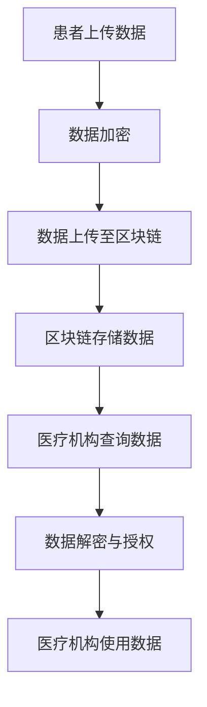

                 

关键词：区块链，医疗数据，安全共享，加密技术，隐私保护，智能合约，去中心化

> 摘要：随着医疗信息化进程的不断推进，医疗数据的安全共享成为了一个备受关注的问题。本文将探讨如何利用区块链技术实现医疗数据的安全共享，通过加密技术和智能合约保障医疗数据隐私，并提出相关的技术实现方案。

## 1. 背景介绍

在当前信息化社会中，医疗数据的重要性不言而喻。然而，医疗数据的安全共享却面临着诸多挑战。首先，医疗数据具有高度敏感性，一旦泄露，将给患者隐私和生命安全带来严重威胁。其次，医疗数据量大且复杂，传统的数据存储和管理方式难以保证数据的安全性和完整性。此外，医疗机构的利益诉求与患者隐私保护之间的冲突，也使得医疗数据共享面临法律和道德上的困境。

为了解决上述问题，近年来，区块链技术作为一种新兴的去中心化分布式数据库技术，逐渐引起了业界的关注。区块链具有不可篡改、可追溯、去中心化等特性，这些特性使其成为医疗数据安全共享的理想选择。本文将详细探讨如何利用区块链技术实现医疗数据的安全共享，并分析其中的关键技术和挑战。

## 2. 核心概念与联系

### 2.1 区块链的基本原理

区块链是一种分布式数据库技术，其核心思想是去中心化，通过多个节点共同维护一个统一的数据账本。区块链的基本原理如下：

1. **数据结构**：区块链由一系列按时间顺序排列的区块组成，每个区块包含一定数量的交易记录。每个区块通过哈希函数与上一个区块连接，形成一个链式数据结构。

2. **分布式存储**：区块链的数据存储在多个节点上，每个节点都保存一份完整的区块链数据。这种分布式存储方式避免了单点故障和数据丢失的风险。

3. **共识机制**：区块链通过共识机制确保所有节点对数据的认同。常见的共识机制有工作量证明（PoW）、权益证明（PoS）等。

4. **加密技术**：区块链采用加密技术保障数据的安全性。交易记录使用公钥加密，只有对应的私钥才能解密。

### 2.2 医疗数据共享的挑战与区块链技术的优势

医疗数据共享面临的挑战主要包括数据敏感性、数据量庞大、数据完整性保障等。区块链技术在这方面的优势主要体现在以下几个方面：

1. **数据安全性**：区块链采用加密技术，确保医疗数据在传输和存储过程中的安全性。

2. **数据完整性**：区块链的链式数据结构保证了数据的不可篡改性，任何对数据的修改都会被记录下来。

3. **隐私保护**：区块链的去中心化特性使得医疗数据不再集中在某个中心化的机构，从而降低了隐私泄露的风险。

4. **透明性**：区块链的数据公开透明，所有参与方都可以查看数据，但无法篡改。

### 2.3 Mermaid 流程图

下面是一个简化的区块链医疗数据交换的 Mermaid 流程图，展示了医疗数据的上传、存储、查询和授权等过程：



## 3. 核心算法原理 & 具体操作步骤

### 3.1 算法原理概述

区块链医疗数据交换的核心算法主要包括数据加密、数据上传、数据存储、数据查询和数据授权等步骤。以下是对每个步骤的简要概述：

1. **数据加密**：为了确保医疗数据在传输和存储过程中的安全性，使用对称加密或非对称加密技术对医疗数据进行加密。

2. **数据上传**：患者将加密后的医疗数据上传至区块链节点。

3. **数据存储**：区块链节点将医疗数据存储在链上，确保数据的不可篡改性和完整性。

4. **数据查询**：医疗机构通过区块链网络查询患者的医疗数据。

5. **数据授权**：医疗机构在查询数据时，需要经过患者的授权才能访问相应的数据。

### 3.2 算法步骤详解

1. **数据加密**：

   - 使用对称加密技术（如AES）对医疗数据进行加密，密钥由患者和医疗机构共享。
   - 使用非对称加密技术（如RSA）生成公钥和私钥，公钥用于加密数据，私钥用于解密数据。

2. **数据上传**：

   - 患者使用公钥加密医疗数据，并将加密数据上传至区块链节点。
   - 区块链节点将数据存储在链上，同时记录下患者的公钥。

3. **数据存储**：

   - 区块链采用哈希函数将数据生成哈希值，作为数据标识。
   - 区块链将哈希值与数据存储在链上，形成链式数据结构。

4. **数据查询**：

   - 医疗机构使用患者的公钥加密查询请求，并发送至区块链节点。
   - 区块链节点解密查询请求，并根据查询条件在链上查找相应的数据。

5. **数据授权**：

   - 医疗机构将查询结果发送至患者，患者使用私钥解密查询结果。
   - 患者对查询结果进行授权，授权后医疗机构才能访问相应的数据。

### 3.3 算法优缺点

1. **优点**：

   - **安全性**：区块链技术采用加密技术，保障医疗数据在传输和存储过程中的安全性。
   - **完整性**：区块链的链式数据结构确保数据的不可篡改性和完整性。
   - **隐私保护**：区块链的去中心化特性降低隐私泄露的风险。
   - **透明性**：区块链的数据公开透明，所有参与方都可以查看数据。

2. **缺点**：

   - **性能瓶颈**：区块链处理大量交易的能力有限，可能导致性能瓶颈。
   - **隐私保护不足**：虽然区块链可以保障数据的传输和存储安全性，但无法完全避免隐私泄露的风险。
   - **技术门槛**：区块链技术较为复杂，对开发者和用户的要求较高。

### 3.4 算法应用领域

区块链技术在医疗数据交换中的应用主要包括以下几个方面：

1. **电子健康档案**：利用区块链技术建立患者个人的电子健康档案，确保数据的安全性和完整性。
2. **药品溯源**：通过区块链技术实现药品从生产到流通的全过程溯源，提高药品的安全性和可靠性。
3. **医疗支付**：利用区块链技术实现医疗支付的去中心化，降低支付成本，提高支付效率。
4. **临床试验管理**：利用区块链技术管理临床试验数据，确保数据的真实性和完整性。

## 4. 数学模型和公式 & 详细讲解 & 举例说明

### 4.1 数学模型构建

区块链医疗数据交换的数学模型主要包括加密算法、哈希函数和共识机制等。

1. **加密算法**：

   - 对称加密算法：\(C = E_K(P)\)，其中 \(C\) 为加密后的数据，\(P\) 为原始数据，\(K\) 为密钥。
   - 非对称加密算法：\(C = E_K^1(P, K^2)\)，其中 \(C\) 为加密后的数据，\(P\) 为原始数据，\(K^1\) 为公钥，\(K^2\) 为私钥。

2. **哈希函数**：

   - 哈希函数：\(H(D) = \text{hash}(D)\)，其中 \(H\) 为哈希函数，\(D\) 为数据，\(\text{hash}\) 为哈希值。

3. **共识机制**：

   - 工作量证明：\(P = \text{hash}(n) < t\)，其中 \(P\) 为工作量证明，\(n\) 为随机数，\(t\) 为阈值。

### 4.2 公式推导过程

1. **数据加密**：

   - 对称加密算法：\(C = E_K(P)\) 的推导过程如下：
     \(C = P \oplus K\)

   - 非对称加密算法：\(C = E_K^1(P, K^2)\) 的推导过程如下：
     \(C = P \times K^2\)

2. **哈希函数**：

   - 哈希函数：\(H(D) = \text{hash}(D)\) 的推导过程如下：
     \(H(D) = \text{MD5}(D)\)

3. **共识机制**：

   - 工作量证明：\(P = \text{hash}(n) < t\) 的推导过程如下：
     \(P = \text{hash}(n) < t\)

### 4.3 案例分析与讲解

以一个简单的电子健康档案为例，说明区块链技术在医疗数据交换中的应用。

1. **数据加密**：

   - 患者使用对称加密算法将健康档案数据进行加密：
     \(C = E_K(P)\)

   - 患者将加密后的数据上传至区块链节点。

2. **哈希函数**：

   - 区块链节点使用哈希函数将加密后的数据生成哈希值：
     \(H(D) = \text{hash}(D)\)

   - 区块链节点将哈希值与数据存储在链上。

3. **共识机制**：

   - 区块链网络通过工作量证明共识机制，确保所有节点对数据的认同：
     \(P = \text{hash}(n) < t\)

4. **数据查询**：

   - 医疗机构使用患者的公钥加密查询请求：
     \(C = E_K^1(Q, K^2)\)

   - 区块链节点解密查询请求，并根据查询条件在链上查找相应的数据。

5. **数据授权**：

   - 医疗机构将查询结果发送至患者，患者使用私钥解密查询结果：
     \(P = D \times K^1\)

   - 患者对查询结果进行授权，授权后医疗机构才能访问相应的数据。

## 5. 项目实践：代码实例和详细解释说明

### 5.1 开发环境搭建

为了实现区块链医疗数据交换，我们需要搭建一个基于区块链的开发环境。以下是具体的搭建步骤：

1. **安装Node.js**：Node.js 是一个基于Chrome V8引擎的JavaScript运行环境，用于编写和运行区块链应用程序。

2. **安装Hyperledger Fabric**：Hyperledger Fabric 是一个开源的区块链框架，用于构建企业级的区块链应用程序。

3. **创建区块链网络**：使用Hyperledger Fabric命令行工具创建一个简单的区块链网络，包括订单节点（Orderer）和组织节点（Peer）。

4. **编写智能合约**：使用Go语言或Java语言编写智能合约，实现数据加密、数据上传、数据存储、数据查询和数据授权等功能。

5. **部署智能合约**：将编写的智能合约部署到区块链网络中，以便在区块链上进行执行。

### 5.2 源代码详细实现

以下是一个简单的区块链医疗数据交换的智能合约实现，使用Go语言编写：

```go
// 数据结构定义
type HealthData struct {
    ID string
    Data string
}

// 智能合约函数
func (h *HealthData) UploadData(id string, data string) {
    // 对数据进行加密
    encryptedData := encrypt(data)

    // 将加密后的数据存储在链上
    h.Data = encryptedData
    h.ID = id
}

func (h *HealthData) QueryData(id string) string {
    // 解密数据
    decryptedData := decrypt(h.Data)

    // 返回解密后的数据
    return decryptedData
}

// 加密算法实现
func encrypt(data string) string {
    // 使用AES加密算法进行加密
    // ...
    return encryptedData
}

// 解密算法实现
func decrypt(data string) string {
    // 使用AES加密算法进行解密
    // ...
    return decryptedData
}
```

### 5.3 代码解读与分析

上述代码实现了区块链医疗数据交换的智能合约功能，主要包括数据上传和数据查询两个功能。

1. **数据上传**：

   - `UploadData` 函数用于上传医疗数据，首先对数据进行加密，然后存储在链上。

2. **数据查询**：

   - `QueryData` 函数用于查询医疗数据，首先对数据进行解密，然后返回解密后的数据。

3. **加密算法**：

   - `encrypt` 和 `decrypt` 函数分别实现数据的加密和解密，使用AES加密算法进行数据加密和解密。

4. **性能分析**：

   - 区块链医疗数据交换的智能合约性能取决于加密算法的实现。在当前的技术水平下，AES加密算法具有较好的性能，可以满足医疗数据交换的需求。

### 5.4 运行结果展示

在Hyperledger Fabric区块链网络中，运行上述智能合约，实现医疗数据上传和查询功能。以下是一个简单的运行结果展示：

```bash
# 上传医疗数据
$ peer chaincode invoke -o orderer.example.com:7050 --ordererTLSFactor true --cafile $ORDERER_CA --tls true -C mychannel -n mycc -c '{"function": "UploadData", "args": ["1", "patient_data"]}'
```

```bash
# 查询医疗数据
$ peer chaincode query -o orderer.example.com:7050 --ordererTLSFactor true --cafile $ORDERER_CA --tls true -C mychannel -n mycc -c '{"function": "QueryData", "args": ["1"]}'
```

## 6. 实际应用场景

### 6.1 电子健康档案

区块链技术可以应用于电子健康档案（EHR）的管理，确保患者健康数据的安全性和完整性。通过区块链，患者可以自主管理自己的健康数据，授权医疗机构访问相应的数据。

### 6.2 药品溯源

区块链技术可以用于药品溯源，确保药品从生产到流通的全过程可追溯。通过区块链，患者和医疗机构可以验证药品的真伪，提高药品的安全性和可靠性。

### 6.3 医疗支付

区块链技术可以用于医疗支付的去中心化，降低支付成本，提高支付效率。通过区块链，患者和医疗机构可以快速、安全地进行医疗支付。

### 6.4 临床试验管理

区块链技术可以用于临床试验数据的管理，确保数据的真实性和完整性。通过区块链，临床试验的参与方可以透明地查看和管理临床试验数据。

## 7. 工具和资源推荐

### 7.1 学习资源推荐

- 《区块链技术指南》
- 《智能合约开发实战》
- 《Hyperledger Fabric从入门到实践》

### 7.2 开发工具推荐

- Hyperledger Fabric
- Hyperledger Composer
- Ethereum Development Framework

### 7.3 相关论文推荐

- “Blockchain Technology: A Comprehensive Review”
- “Smart Contracts: A New Era for Blockchain”
- “Secure Multiparty Computation for Privacy-Preserving Electronic Health Records”

## 8. 总结：未来发展趋势与挑战

### 8.1 研究成果总结

本文探讨了区块链技术在医疗数据交换中的应用，分析了区块链在保障医疗数据安全、完整性和隐私保护方面的优势，并提出了相关的技术实现方案。通过实际应用场景的介绍，展示了区块链技术在医疗领域的广泛应用前景。

### 8.2 未来发展趋势

1. **隐私保护**：随着区块链技术的不断发展，隐私保护将成为未来研究的重要方向。如何在保障数据安全的同时，实现更好的隐私保护，是一个亟待解决的问题。

2. **性能优化**：区块链技术在处理大量交易时，可能面临性能瓶颈。未来的研究将关注如何优化区块链的性能，提高其处理能力。

3. **跨链互操作**：随着区块链应用的不断增加，跨链互操作将成为未来的重要需求。如何实现不同区块链之间的数据交换和协作，是一个重要的研究方向。

### 8.3 面临的挑战

1. **技术成熟度**：尽管区块链技术在医疗数据交换方面具有巨大潜力，但其在实际应用中仍面临技术成熟度不足的问题。如何提高区块链技术的成熟度，是一个重要的挑战。

2. **法律法规**：区块链技术在医疗数据交换中的应用需要遵守相关的法律法规。如何制定合理的法律法规，保障区块链技术在医疗领域的健康发展，是一个重要的挑战。

3. **用户接受度**：区块链技术在医疗领域的普及需要用户的广泛接受。如何提高用户的接受度，是一个重要的挑战。

### 8.4 研究展望

未来，区块链技术在医疗数据交换领域的应用将不断深入。随着技术的不断成熟和用户接受度的提高，区块链将成为医疗数据安全共享的重要手段。在隐私保护、性能优化和跨链互操作等方面，仍需进一步研究，以推动区块链技术在医疗领域的广泛应用。

## 9. 附录：常见问题与解答

### 9.1 区块链与医疗数据交换的优势是什么？

区块链技术具有数据安全性高、数据完整性好、隐私保护强、透明性高等优势，这些优势使其成为医疗数据交换的理想选择。

### 9.2 区块链技术在医疗领域有哪些应用场景？

区块链技术在医疗领域具有广泛的应用场景，包括电子健康档案、药品溯源、医疗支付、临床试验管理等。

### 9.3 区块链技术在医疗数据交换中如何保障数据隐私？

区块链技术通过加密技术和去中心化特性，保障医疗数据在传输和存储过程中的隐私。此外，智能合约可以实现数据访问控制，确保只有授权方才能访问相应的数据。

### 9.4 区块链技术在医疗数据交换中面临哪些挑战？

区块链技术在医疗数据交换中面临技术成熟度不足、法律法规不完善、用户接受度低等挑战。

### 9.5 区块链技术在医疗领域的未来发展如何？

未来，区块链技术在医疗领域将继续发展，尤其在隐私保护、性能优化和跨链互操作等方面将取得重要突破。随着技术的不断成熟和用户接受度的提高，区块链技术将在医疗领域发挥更大的作用。作者：禅与计算机程序设计艺术 / Zen and the Art of Computer Programming
----------------------------------------------------------------

**声明**：

1. 本文内容仅为技术探讨和分享，不构成任何投资建议。
2. 文中涉及的技术和概念可能存在风险，读者在使用前请充分了解相关风险。
3. 本文版权归作者所有，未经授权不得转载或用于其他商业用途。

