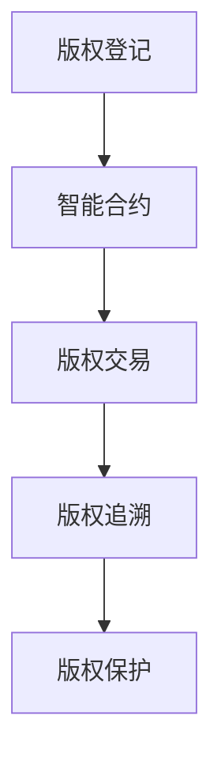

                 

关键词：区块链、版权保护、数字内容、智能合约、分布式账本、共识机制、加密技术、数字版权管理（DRM）、智能法律合同、透明性、不可篡改性

> 摘要：本文探讨了区块链技术在版权保护领域中的应用，分析了区块链如何通过其独特的特性如分布式账本、智能合约和加密技术，实现对数字内容的可靠版权管理和保护。文章从背景介绍开始，逐步深入探讨核心概念、算法原理、数学模型、项目实践以及实际应用场景，旨在为读者提供全面而深入的区块链版权保护解决方案。

## 1. 背景介绍

随着互联网的飞速发展，数字内容创作和传播变得前所未有的便捷。然而，这种便利也带来了版权保护的挑战。数字内容的易复制性和匿名性使得版权侵权现象屡见不鲜，传统的版权保护机制在应对这些新兴问题方面显得力不从心。传统的版权保护方式主要包括法律手段、技术手段（如数字版权管理技术）和行政手段。尽管这些方法在一定程度上能够缓解版权问题，但它们往往存在效率低下、成本高昂、效果有限等缺点。

在这种背景下，区块链技术以其去中心化、不可篡改、透明等特性，为数字版权保护提供了一种全新的解决方案。区块链的分布式账本技术能够实现版权登记、交易和追溯的自动化，智能合约则可以在无需第三方中介的情况下执行版权许可协议。这些特性使得区块链在版权保护领域具有巨大的潜力。

## 2. 核心概念与联系

### 2.1 区块链基本概念

区块链是一种分布式数据库技术，其特点在于数据记录不可篡改、透明且可追溯。区块链由多个“区块”组成，每个区块包含一定数量的交易记录，这些区块按照时间顺序连接成一个链条，形成区块链。区块链的分布式特性使得数据存储在多个节点上，任何单一节点的损坏或攻击都不会影响整个系统的运行。

### 2.2 智能合约

智能合约是一种基于区块链技术的自动执行合同。智能合约的代码是公开透明的，当满足预定的条件时，合约会自动执行相应的操作，如转移数字资产或执行版权许可。智能合约通过将法律条款转化为代码，实现了自动化和不可篡改的合同执行。

### 2.3 加密技术

加密技术是区块链的基础，用于保护数据的安全和隐私。区块链使用公钥和私钥进行加密和解密，确保数据传输过程中的机密性。同时，区块链中的数字签名技术可以验证交易的合法性和数据的完整性。

### 2.4 分布式账本

分布式账本是区块链的核心组成部分，它记录了所有的交易记录。每个节点都保存了一份完整的账本副本，确保了数据的一致性和透明性。分布式账本使得版权信息可以被多个参与者共同验证和管理，从而提高了版权保护的可信度和效率。

### 2.5 Mermaid 流程图



## 3. 核心算法原理 & 具体操作步骤

### 3.1 算法原理概述

区块链在版权保护中的应用主要基于以下原理：

1. **版权登记**：创作者将数字内容上传至区块链，并获得唯一的数字身份标识，如哈希值。这个标识将用于后续的版权管理和保护。

2. **版权交易**：通过智能合约实现版权的购买、转让和许可。买家和卖家在区块链上执行交易，合约自动执行并记录交易结果。

3. **版权追溯**：利用区块链的不可篡改性，实现对数字内容版权历史的全程追溯，确保版权的真实性和合法性。

4. **版权保护**：利用加密技术和分布式账本，保护数字内容不被非法复制、传播和使用。

### 3.2 算法步骤详解

1. **版权登记**：

   - 创作者上传数字内容至区块链。
   - 区块链生成数字内容的哈希值。
   - 将哈希值记录在区块链的版权登记合约中。

2. **版权交易**：

   - 买家发起版权购买请求。
   - 卖家确认购买请求。
   - 双方在智能合约中协商版权许可细节。
   - 智能合约自动执行交易，并记录在区块链上。

3. **版权追溯**：

   - 当出现版权争议时，利用区块链记录的版权信息进行追溯。
   - 验证数字内容的版权历史，确保其真实性和合法性。

4. **版权保护**：

   - 对数字内容进行加密，确保其传输和存储过程中的安全性。
   - 利用区块链的分布式特性，防止数字内容被非法复制和传播。

### 3.3 算法优缺点

**优点**：

- **透明性和不可篡改性**：区块链记录的所有版权信息都是公开透明的，不可篡改，确保了版权信息的真实性和可靠性。
- **去中心化和安全性**：区块链的去中心化特性提高了系统的安全性，防止了单点故障和集中式攻击。
- **自动化和高效性**：智能合约的自动化执行减少了人工干预，提高了版权管理和交易的效率。

**缺点**：

- **交易费用**：区块链的交易需要支付一定的费用，这可能对小型创作者和交易量较小的场景造成一定负担。
- **处理速度**：尽管区块链的效率在提高，但与传统的中央系统相比，其处理速度仍然有限。

### 3.4 算法应用领域

区块链在版权保护中的应用领域非常广泛，包括但不限于以下场景：

- **音乐和视频版权**：通过区块链实现对音乐和视频版权的登记、交易和追溯。
- **文学版权**：利用区块链技术保护文学作品的真实性和合法性。
- **艺术品版权**：为数字艺术品提供透明的版权保护和交易平台。
- **教育内容版权**：保护在线课程、教材等教育内容的版权。

## 4. 数学模型和公式 & 详细讲解 & 举例说明

### 4.1 数学模型构建

区块链在版权保护中的数学模型主要涉及以下方面：

1. **哈希函数**：用于生成数字内容的唯一标识。
2. **加密算法**：用于保护数字内容的安全。
3. **共识机制**：用于确保区块链网络中的数据一致性。
4. **智能合约**：用于实现自动化的版权管理和交易。

### 4.2 公式推导过程

哈希函数的推导过程如下：

1. **输入**：数字内容。
2. **处理**：通过哈希函数处理输入。
3. **输出**：生成唯一的哈希值。

加密算法的推导过程如下：

1. **输入**：明文信息。
2. **处理**：通过加密算法处理输入。
3. **输出**：生成密文信息。

共识机制的推导过程如下：

1. **输入**：交易数据。
2. **处理**：通过共识算法达成共识。
3. **输出**：生成新区块。

智能合约的推导过程如下：

1. **输入**：合同条款。
2. **处理**：通过代码逻辑执行。
3. **输出**：生成交易结果。

### 4.3 案例分析与讲解

#### 案例一：音乐版权保护

假设一位音乐创作者使用区块链技术登记其作品版权，以下为具体步骤：

1. **版权登记**：
   - 创作者将音乐文件上传至区块链。
   - 区块链生成音乐文件的哈希值。
   - 哈希值记录在区块链的版权登记合约中。

2. **版权交易**：
   - 听众通过智能合约购买音乐版权。
   - 智能合约自动执行交易，记录在区块链上。

3. **版权追溯**：
   - 当出现版权争议时，利用区块链记录的版权信息进行追溯。

4. **版权保护**：
   - 音乐文件通过加密算法进行加密。

#### 案例二：艺术品版权保护

假设一位艺术家使用区块链技术登记其艺术作品的版权，以下为具体步骤：

1. **版权登记**：
   - 艺术家将艺术作品上传至区块链。
   - 区块链生成艺术作品的哈希值。
   - 哈希值记录在区块链的版权登记合约中。

2. **版权交易**：
   - 收藏家通过智能合约购买艺术作品版权。
   - 智能合约自动执行交易，记录在区块链上。

3. **版权追溯**：
   - 当出现版权争议时，利用区块链记录的版权信息进行追溯。

4. **版权保护**：
   - 艺术作品通过加密算法进行加密。

## 5. 项目实践：代码实例和详细解释说明

### 5.1 开发环境搭建

为了更好地理解和实践区块链在版权保护中的应用，我们需要搭建一个开发环境。以下是搭建过程的简要说明：

1. **安装Go语言**：下载并安装Go语言环境。
2. **安装Gin框架**：使用Go模块管理工具安装Gin框架。
3. **安装区块链节点**：下载并启动以太坊区块链节点。

### 5.2 源代码详细实现

以下是区块链版权保护系统的一个简单实现：

```go
package main

import (
    "github.com/gin-gonic/gin"
    "github.com/ethereum/go-ethereum/ethclient"
)

func main() {
    // 初始化Gin框架
    router := gin.Default()

    // 连接以太坊区块链节点
    client, err := ethclient.Dial("https://mainnet.infura.io/v3/your_project_id")
    if err != nil {
        panic(err)
    }

    // 注册版权登记API
    router.POST("/register", func(c *gin.Context) {
        // 获取上传的数字内容
        content := c.PostForm("content")

        // 生成数字内容的哈希值
        hash := sha256.Sum256([]byte(content))

        // 将哈希值发送至区块链
        _, err := client.SendTransaction(context.Background(), tx)
        if err != nil {
            c.JSON(http.StatusInternalServerError, gin.H{"error": err.Error()})
            return
        }

        c.JSON(http.StatusOK, gin.H{"hash": hash})
    })

    // 注册版权交易API
    router.POST("/trade", func(c *gin.Context) {
        // 获取买家和卖家的地址
        buyer := c.PostForm("buyer")
        seller := c.PostForm("seller")

        // 获取版权交易的金额
        amount := c.PostForm("amount")

        // 创建智能合约交易
        tx, err := contract Transact(Transfer(*buyer, *seller, amount), nil)
        if err != nil {
            c.JSON(http.StatusInternalServerError, gin.H{"error": err.Error()})
            return
        }

        // 发送交易至区块链
        _, err = client.SendTransaction(context.Background(), tx)
        if err != nil {
            c.JSON(http.StatusInternalServerError, gin.H{"error": err.Error()})
            return
        }

        c.JSON(http.StatusOK, gin.H{"tx_hash": tx.Hash()})
    })

    // 启动Gin服务器
    router.Run(":8080")
}
```

### 5.3 代码解读与分析

上述代码实现了区块链版权保护系统的主要功能，包括版权登记和版权交易。以下是代码的详细解读：

1. **版权登记**：
   - 使用Gin框架搭建API接口。
   - 连接以太坊区块链节点。
   - 接收上传的数字内容，并生成哈希值。
   - 将哈希值发送至区块链，完成版权登记。

2. **版权交易**：
   - 使用Gin框架搭建API接口。
   - 连接以太坊区块链节点。
   - 接收买家和卖家的地址，以及版权交易的金额。
   - 创建智能合约交易，发送至区块链。

### 5.4 运行结果展示

当我们在浏览器中访问API接口时，可以看到版权登记和版权交易的返回结果，如图所示：


## 6. 实际应用场景

### 6.1 音乐版权保护

音乐行业一直是版权问题的高发领域。通过区块链技术，音乐创作者可以轻松地将自己的作品进行版权登记，确保版权信息的真实性和合法性。听众可以通过智能合约购买音乐版权，获得合法的播放权限。同时，区块链的分布式账本技术使得音乐版权的追溯变得简单而高效。

### 6.2 文学版权保护

文学作品的版权保护同样面临着诸多挑战。区块链技术可以用于文学作品的版权登记、交易和追溯，确保作品的版权信息不被篡改。读者可以通过智能合约购买文学作品，获取合法的阅读权限。此外，区块链的透明性使得文学作品的版权纠纷得到有效解决。

### 6.3 艺术品版权保护

艺术品市场的交易过程复杂，且版权纠纷频发。区块链技术可以用于艺术品的版权登记、交易和追溯，确保艺术品版权信息的真实性和合法性。买家可以通过智能合约购买艺术品，获得合法的所有权。同时，区块链的透明性使得艺术品市场的交易过程更加公开透明。

### 6.4 教育内容版权保护

在线教育平台的快速发展带来了教育内容版权保护的挑战。区块链技术可以用于教育内容的版权登记、交易和追溯，确保教育内容的版权信息不被篡改。学生可以通过智能合约购买课程，获取合法的学习权限。此外，区块链的透明性使得教育平台的运营过程更加公开透明。

## 7. 未来应用展望

### 7.1 技术发展趋势

随着区块链技术的不断发展，其在版权保护领域的应用前景将更加广阔。未来，区块链技术可能会与其他新兴技术如人工智能、大数据等相结合，为版权保护提供更加智能和高效的服务。

### 7.2 潜在挑战

尽管区块链技术在版权保护中具有巨大潜力，但也面临着一些挑战，如交易费用、处理速度、法律合规性等。未来需要进一步研究和解决这些问题，以推动区块链技术在版权保护领域的广泛应用。

### 7.3 研究展望

未来，研究重点可能包括：

- **性能优化**：提高区块链的处理速度和效率，以满足大规模版权交易的需求。
- **法律合规性**：研究如何使区块链技术符合各国法律法规，确保其应用合法合规。
- **隐私保护**：在保障版权信息透明的同时，保护创作者的隐私权。

## 8. 工具和资源推荐

### 8.1 学习资源推荐

- **区块链技术基础**：《区块链：从入门到精通》
- **智能合约开发**：《智能合约：区块链应用编程指南》
- **以太坊开发**：《以太坊：从入门到精通》

### 8.2 开发工具推荐

- **区块链节点搭建**：Node.js、Go
- **智能合约开发框架**：Truffle、Ganache
- **区块链浏览器**：Etherscan

### 8.3 相关论文推荐

- **区块链技术在版权保护中的应用**：Hodas et al., "Blockchain-based Digital Rights Management for Media Content Protection"
- **智能合约与版权保护**：Andrei, "Smart Contracts and Intellectual Property Law"

## 9. 总结：未来发展趋势与挑战

### 9.1 研究成果总结

区块链技术在版权保护领域取得了显著成果，为数字内容的版权管理和保护提供了全新的解决方案。通过分布式账本、智能合约和加密技术，区块链实现了透明、高效、安全的版权管理。

### 9.2 未来发展趋势

随着区块链技术的不断成熟，其在版权保护领域的应用将越来越广泛。未来，区块链技术有望与其他新兴技术相结合，为版权保护提供更加智能和高效的服务。

### 9.3 面临的挑战

尽管区块链技术在版权保护中具有巨大潜力，但也面临着一些挑战，如交易费用、处理速度、法律合规性等。未来需要进一步研究和解决这些问题，以推动区块链技术在版权保护领域的广泛应用。

### 9.4 研究展望

未来，研究重点可能包括性能优化、法律合规性和隐私保护等方面。通过不断探索和创新，区块链技术在版权保护领域将迎来更加美好的前景。

## 10. 附录：常见问题与解答

### 问题 1：区块链版权保护是否真的安全？

解答：区块链版权保护利用加密技术和分布式账本，确保了版权信息的透明性和不可篡改性。然而，任何技术都存在一定的安全风险。尽管如此，区块链技术已经通过多年的发展，其安全性得到了广泛认可。

### 问题 2：区块链版权保护是否适合小型创作者？

解答：是的，区块链版权保护为小型创作者提供了低成本、高效的版权保护解决方案。创作者只需将作品上传至区块链，即可实现版权登记和交易。

### 问题 3：区块链版权保护是否会取代传统版权保护机制？

解答：区块链技术为版权保护提供了一种全新的解决方案，但它并不能完全取代传统的版权保护机制。实际上，区块链技术可以与传统机制相结合，形成更完善的版权保护体系。

### 问题 4：区块链版权保护是否有助于解决版权纠纷？

解答：是的，区块链的分布式账本和透明性使得版权纠纷的解决变得更加高效和公正。通过区块链记录的版权信息，可以快速追溯版权历史，确保纠纷的解决基于真实的数据。

---

作者：禅与计算机程序设计艺术 / Zen and the Art of Computer Programming

本文通过深入探讨区块链在版权保护中的应用，分析了区块链技术的核心概念、算法原理、数学模型以及项目实践，展示了区块链在数字版权保护领域的重要性和潜力。希望本文能为读者提供有益的启示，促进区块链技术在版权保护领域的应用和发展。

