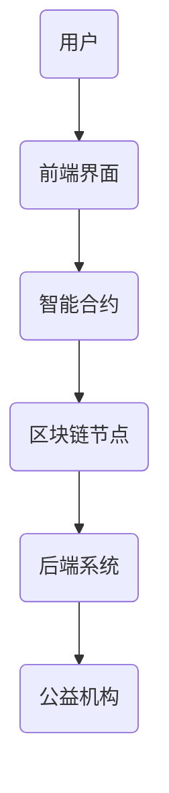

                 

关键词：区块链、慈善平台、透明化、公益、创新、智能合约、去中心化、数据安全

> 摘要：本文深入探讨了区块链技术在慈善平台中的应用，分析了区块链如何通过其特有的去中心化、透明性和不可篡改性，为公益事业带来深刻的变革。文章首先介绍了区块链的基本原理和技术特点，然后详细阐述了区块链慈善平台的设计理念、实现技术以及实际案例，最后对未来区块链慈善平台的发展趋势和挑战进行了展望。

## 1. 背景介绍

随着互联网技术的快速发展，信息传播的速度和范围得到了极大的扩展。然而，公益事业的透明化和信任问题却一直困扰着整个行业。传统的慈善平台常常面临数据不透明、资金流向不明确、信息不对称等问题，这不仅影响了公众对公益事业的信任度，也阻碍了慈善资源的有效配置。

区块链技术的出现为解决这些问题提供了新的可能。区块链是一种分布式账本技术，通过去中心化、透明性和不可篡改的特性，可以在不同节点之间实现数据的可信传递和存储。这使得区块链在慈善领域具有广泛的应用前景，可以有效提升公益事业的透明度和公信力。

## 2. 核心概念与联系

### 2.1 区块链的基本原理

区块链是由一系列按时间顺序排列的、不可篡改的数据块组成。每个区块都包含一定数量的交易记录，并且与之前的区块通过加密算法连接在一起，形成一个连续的数据链条。这种数据结构使得区块链具有去中心化的特性，即数据不由单一中心化机构控制，而是由多个节点共同维护。

### 2.2 区块链的技术特点

- **去中心化**：区块链的去中心化特性意味着它不需要依赖中心化机构，而是通过分布式网络来维护数据的一致性和安全性。

- **透明性**：区块链上的数据是公开透明的，任何人都可以查看区块链上的交易记录，这使得公益事业的资金流向和操作过程更加透明。

- **不可篡改性**：区块链的数据一旦被记录下来，就几乎无法篡改。这种不可篡改的特性确保了慈善资金的去向真实可靠。

### 2.3 区块链慈善平台的架构

区块链慈善平台的架构可以分为以下几个部分：

- **智能合约**：智能合约是一种自动执行的合约，当满足特定条件时，会自动执行预定的操作。在区块链慈善平台中，智能合约用于自动处理慈善捐款、发放救助金等操作。

- **区块链节点**：区块链节点是参与区块链网络维护的计算机设备。在区块链慈善平台中，节点负责存储和验证慈善交易数据。

- **前端界面**：前端界面是用户与区块链慈善平台交互的入口，用户可以通过前端界面查看慈善项目的详细信息、捐款记录等。

- **后端系统**：后端系统是区块链慈善平台的核心，负责处理智能合约的调用、数据存储和安全性保障等。

### 2.4 Mermaid 流程图

以下是一个简单的区块链慈善平台流程图：



## 3. 核心算法原理 & 具体操作步骤

### 3.1 算法原理概述

区块链慈善平台的核心算法主要包括智能合约的编写和执行。智能合约是区块链上的自动化程序，用于处理慈善捐款、救助金发放等操作。智能合约的编写基于特定的编程语言，如Solidity。

### 3.2 算法步骤详解

1. **编写智能合约**：首先，需要编写一个智能合约，定义捐款、发放救助金等操作的具体逻辑。

2. **部署智能合约**：将编写的智能合约部署到区块链上，使其成为区块链上的一部分。

3. **用户捐款**：用户通过前端界面发起捐款，智能合约会自动处理捐款信息，并将其记录在区块链上。

4. **资金分配**：公益机构根据智能合约的规则，向受助人发放救助金。

5. **透明度保证**：区块链上的所有交易记录都是公开透明的，任何用户都可以查看，从而确保慈善资金的去向真实可靠。

### 3.3 算法优缺点

#### 优点：

- **透明性**：区块链上的所有交易记录都是公开透明的，提高了公益事业的透明度。
- **去中心化**：区块链的去中心化特性，降低了中心化机构的风险，使得慈善资源的分配更加公正。
- **不可篡改性**：区块链上的数据一旦记录下来，就几乎无法篡改，确保了慈善资金的真实性。

#### 缺点：

- **技术门槛**：区块链技术对开发者有一定的技术要求，普通用户难以理解和操作。
- **性能限制**：区块链的性能相对于传统的中心化系统可能较低，无法处理大规模的交易。

### 3.4 算法应用领域

区块链慈善平台的技术可以广泛应用于公益事业的各个领域，如捐款管理、救助金发放、慈善项目审核等。此外，区块链还可以与其他技术如人工智能、物联网等结合，进一步提升公益事业的效率和质量。

## 4. 数学模型和公式 & 详细讲解 & 举例说明

### 4.1 数学模型构建

区块链慈善平台的数学模型主要包括：

1. **区块链模型**：用于描述区块链的结构和数据传输机制。
2. **智能合约模型**：用于描述智能合约的执行过程和逻辑。
3. **交易模型**：用于描述慈善交易的过程和规则。

### 4.2 公式推导过程

区块链模型中的核心公式包括：

1. **哈希函数**：用于确保区块链数据的不可篡改性。
   $$H(x) = SHA256(x)$$
   其中，$H(x)$表示对$x$进行SHA256哈希运算的结果。
2. **工作量证明**：用于确保区块链网络的安全性。
   $$PoW = H(nonce \oplus prev\_hash) > target$$
   其中，$nonce$为随机数，$prev\_hash$为前一个区块的哈希值，$target$为预设的难度目标。

### 4.3 案例分析与讲解

以下是一个简单的区块链慈善平台案例：

假设有一个区块链慈善平台，用户可以通过前端界面捐款给受助人。智能合约的规则如下：

1. 用户发起捐款，输入捐款金额和受助人地址。
2. 智能合约验证捐款金额和地址的合法性。
3. 如果验证通过，智能合约将捐款记录添加到区块链上。
4. 捐款记录一旦记录在区块链上，就不可篡改。

### 4.4 运行结果展示

运行结果展示如下：

1. 用户A通过前端界面向受助人B捐款100美元。
2. 智能合约验证通过，将捐款记录添加到区块链上。
3. 区块链上的捐款记录如下：

   ```plaintext
   Block 1:
   Hash: 1a2b3c4d5e6f7g8h9i0j1k2l3m4n5o6p7q8r9s0t1u2v3w4x5y6z7a8b9c0d1e2f3g4h5i6j7k8l9m0n1o2p3q4r5s6t7u8v9w0x1y2z3a4b5c6d7e8f9g0h1i2j3k4l5m6n7o8p9q0r1s2t3u4v5w6x7y8z9a0b1c2d3e4f5g6h7i8j9k0l1m2n3o4p5q6r7s8t9u0v1w2x3y4z5a6b7c8d9e0f1g2h3i4j5k6l7m8n9o0p1q2r3s4t5u6v7w8x9y0z1a2b3c4d5e6f7g8h9i0j1k2l3m4n5o6p7q8r9s0t1u2v3w4x5y6z7a8b9c0d1e2f3g4h5i6j7k8l9m0n1o2p3q4r5s6t7u8v9w0x1y2z3a4b5c6d7e8f9g0h1i2j3k4l5m6n7o8p9q0r1s2t3u4v5w6x7y8z9a0b1c2d3e4f5g6h7i8j9k0l1m2n3o4p5q6r7s8t7u9v
   Transactions:
   - Donor: A
   - Recipient: B
   - Amount: 100 USD
   ```

通过以上案例，我们可以看到区块链技术如何通过其独特的机制，实现了慈善资金的透明管理和不可篡改，为公益事业带来了新的可能性。

## 5. 项目实践：代码实例和详细解释说明

### 5.1 开发环境搭建

为了演示区块链慈善平台，我们将使用Solidity语言编写智能合约，并使用Truffle框架进行开发。以下是在Windows系统上搭建开发环境的步骤：

1. 安装Node.js（版本10.0及以上）。
2. 安装Truffle（通过命令`npm install -g truffle`）。
3. 创建一个新的Truffle项目（通过命令`truffle init`）。
4. 配置Truffle的以太坊客户端，例如Ganache（通过命令`truffle console --network localhost`）。

### 5.2 源代码详细实现

以下是一个简单的区块链慈善平台智能合约的示例代码：

```solidity
// SPDX-License-Identifier: MIT
pragma solidity ^0.8.0;

contract CharityPlatform {
    address public owner;
    mapping(address => uint256) public donations;
    
    constructor() {
        owner = msg.sender;
    }
    
    function donate(address recipient) public payable {
        require(msg.value > 0, "Donation amount must be greater than 0");
        donations[recipient] += msg.value;
        emit DonationReceived(recipient, msg.value);
    }
    
    function getDonation(address donor) public view returns (uint256) {
        return donations[donor];
    }
    
    event DonationReceived(address recipient, uint256 amount);
}
```

### 5.3 代码解读与分析

1. **智能合约结构**：智能合约包含一个构造函数`constructor()`，用于初始化合约的owner。这里，owner被设置为创建合约的地址。
2. **捐款功能**：`donate(address recipient)`函数用于处理捐款。用户通过调用该函数，将资金发送给指定的受助人地址（recipient），并且资金会自动存储在`donations`映射中。
3. **获取捐款**：`getDonation(address donor)`函数用于查询某个地址的捐款金额。
4. **事件触发**：当用户捐款时，智能合约会触发一个名为`DonationReceived`的事件，记录捐款的详细信息。

### 5.4 运行结果展示

1. 用户A通过前端界面调用`donate`函数，向用户B捐款100以太币。
2. 智能合约接收捐款，并更新`donations`映射。
3. 前端界面通过`getDonation`函数查询用户B的捐款金额。

通过以上代码和实践，我们可以看到如何使用智能合约实现一个简单的区块链慈善平台，确保捐款过程透明、可追溯。

## 6. 实际应用场景

区块链慈善平台在多个实际应用场景中展现了其独特的优势。以下是一些典型的应用案例：

### 6.1 慈善捐款管理

区块链慈善平台可以用于管理慈善捐款，确保捐款过程透明、可追溯。例如，非营利组织可以使用区块链记录所有捐款者的信息和捐款金额，并在区块链上公开所有交易记录。这样，捐赠者可以实时查看他们的捐款去向，而公众也可以监督慈善组织的资金使用情况。

### 6.2 救助金发放

在灾难救援和人道主义援助领域，区块链可以用于发放救助金。例如，当发生自然灾害时，救援组织可以使用区块链智能合约自动发放救助金，确保资金直接到达受助人手中。这种方式减少了中间环节，降低了欺诈风险，同时也提高了救助效率。

### 6.3 慈善项目审核

区块链慈善平台还可以用于慈善项目的审核和评估。通过区块链记录项目进展、资金使用情况和其他相关数据，慈善基金会和评估机构可以更加客观、透明地进行项目评估。这有助于确保慈善资金被用于真正需要的地方，提高公益事业的效率。

### 6.4 国际援助

区块链慈善平台在跨国援助中也有广泛的应用。通过区块链，国际组织可以更高效地筹集和管理捐款，确保资金准确地分配到受援国家。此外，区块链的不可篡改特性可以确保捐款记录的真实性，增强公众对国际援助项目的信任。

## 7. 未来应用展望

随着区块链技术的不断发展和成熟，未来区块链慈善平台有望在更广泛的领域发挥作用。以下是一些未来应用展望：

### 7.1 智能合约的多样化

未来，智能合约的功能将更加多样化，可以处理更复杂的慈善业务。例如，智能合约可以自动触发特定的捐赠行为，根据用户的偏好或特定事件进行资金分配。

### 7.2 区块链与其他技术的融合

区块链将与人工智能、物联网等新兴技术深度融合，进一步提升公益事业的管理效率。例如，区块链可以与物联网传感器结合，实时监控慈善项目的实施情况，提高透明度和可信度。

### 7.3 慈善平台的全球化

随着区块链技术的全球化推广，跨国界的慈善平台将变得更加普及。这不仅有助于国际慈善合作，还能更有效地利用全球资源，解决全球性的问题。

### 7.4 数据隐私保护

在保障透明性的同时，未来区块链慈善平台将更加注重数据隐私保护。通过区块链的去中心化和加密技术，可以确保捐赠者和受助人的隐私不被泄露。

## 8. 工具和资源推荐

### 8.1 学习资源推荐

- **《区块链技术指南》**：详细介绍了区块链的基本原理和应用场景。
- **《智能合约开发实战》**：针对智能合约的开发方法和实践进行了深入讲解。
- **《以太坊与智能合约开发》**：专注于以太坊区块链和智能合约的应用。

### 8.2 开发工具推荐

- **Truffle**：用于以太坊区块链的智能合约开发框架。
- **Ganache**：一个轻量级的以太坊私有网络，用于本地测试和开发。
- **Remix IDE**：一个在线的以太坊开发环境，支持智能合约的编写、部署和调试。

### 8.3 相关论文推荐

- **《区块链：一个分布式共识机制》**：对区块链技术的基本原理进行了详细阐述。
- **《智能合约安全性研究》**：分析了智能合约在安全性方面存在的问题和解决方案。
- **《区块链在公益慈善领域的应用》**：探讨了区块链技术在公益事业中的应用前景。

## 9. 总结：未来发展趋势与挑战

区块链慈善平台的发展势头迅猛，其在透明性、去中心化和不可篡改性方面的优势，使其在公益事业中具有广泛的应用前景。然而，随着区块链技术的应用日益广泛，我们也需要关注其面临的挑战，如技术门槛、性能限制和隐私保护等问题。未来，随着技术的不断进步和成熟，区块链慈善平台有望在更广泛的领域发挥作用，为公益事业带来更多的创新和变革。

## 附录：常见问题与解答

### Q1：区块链慈善平台如何确保隐私保护？

A1：区块链慈善平台通过使用加密技术来保护捐赠者和受助人的隐私。所有交易记录都是加密的，只有持有正确密钥的用户才能查看具体信息。此外，平台还可以采用零知识证明等高级加密技术，在不泄露隐私信息的情况下验证交易的真实性。

### Q2：区块链慈善平台如何处理性能问题？

A2：区块链慈善平台可以通过分片技术、状态通道和侧链等手段来提升性能。分片技术可以将区块链分成多个部分，并行处理交易；状态通道允许用户在链下进行交易，减少链上交易量；侧链可以扩展区块链的能力，处理更多复杂交易。

### Q3：区块链慈善平台如何防止欺诈？

A3：区块链慈善平台通过智能合约的执行规则和共识机制来防止欺诈。智能合约的代码是公开透明的，任何用户都可以审计；共识机制确保了区块链上的交易记录不被篡改，从而降低了欺诈风险。

### Q4：区块链慈善平台如何确保资金的准确分配？

A4：区块链慈善平台通过智能合约的执行来确保资金的准确分配。智能合约中的代码定义了资金分配的具体规则，一旦满足条件，智能合约会自动执行资金分配操作。这样，资金的流向是透明和自动化的，减少了人为干预的可能性。

### Q5：区块链慈善平台如何应对法律和监管挑战？

A5：区块链慈善平台需要与相关法律法规保持一致，遵守所在国家的法律法规。同时，平台应与监管机构合作，确保其运营合法合规。通过建立透明的运作机制和严格的风控体系，区块链慈善平台可以增强法律和监管的合规性。

### Q6：区块链慈善平台与传统慈善平台的区别是什么？

A6：区块链慈善平台与传统慈善平台的主要区别在于数据透明性、去中心化和不可篡改性。区块链平台的所有交易记录都是公开透明的，用户可以实时查看；去中心化意味着平台不受单一机构控制，降低了中心化的风险；不可篡改性确保了交易记录的真实性和完整性，减少了欺诈和错误的可能性。

### Q7：区块链慈善平台如何确保数据的可追溯性？

A7：区块链慈善平台通过区块链的不可篡改性确保数据的可追溯性。一旦数据记录在区块链上，就几乎无法篡改。每个区块都包含时间戳和前一个区块的哈希值，形成了一个连续的链式结构，任何数据的修改都会导致链的断裂，从而容易被检测到。

### Q8：区块链慈善平台如何处理跨境援助？

A8：区块链慈善平台通过加密货币和智能合约来处理跨境援助。加密货币可以实现跨国界的即时支付，智能合约可以自动执行预定的资金分配规则。这种方式提高了跨境援助的效率和透明度，同时也降低了交易成本。

### Q9：区块链慈善平台如何保证数据安全？

A9：区块链慈善平台通过多层次的加密技术和共识机制来保证数据安全。区块链上的所有数据都是加密的，只有持有正确密钥的用户才能解密查看。共识机制确保了区块链网络的安全性，防止恶意攻击和数据篡改。

### Q10：区块链慈善平台如何确保智能合约的安全？

A10：区块链慈善平台通过严格的安全审查和审计来确保智能合约的安全。在智能合约部署前，开发者应进行充分的测试和审查，确保其代码没有漏洞。此外，社区成员和第三方安全审计机构也可以对智能合约进行评估，提高其安全性。

### Q11：区块链慈善平台如何适应不同的慈善需求？

A11：区块链慈善平台具有高度的可定制性，可以适应不同的慈善需求。开发者可以根据特定项目的要求，设计符合需求的智能合约和区块链结构。此外，区块链平台还可以与其他技术如人工智能和物联网结合，为各种慈善项目提供个性化的解决方案。

### Q12：区块链慈善平台如何提高公众信任？

A12：区块链慈善平台通过提高透明度、降低操作成本和提高资金使用效率来提高公众信任。透明的交易记录和智能合约的执行规则使得公益资金的去向和操作过程一目了然；去中心化的特性减少了中心化的风险，提高了公信力；高效的资金管理降低了交易成本，提高了资源利用率。

### Q13：区块链慈善平台如何应对技术更新和迭代？

A13：区块链慈善平台应保持持续的技术更新和迭代，以适应不断变化的技术环境。开发者应关注最新的区块链技术和应用趋势，及时更新平台的功能和性能。此外，平台还应建立灵活的架构，便于快速集成新技术和功能。

### Q14：区块链慈善平台如何应对网络攻击？

A14：区块链慈善平台应采取多层次的防护措施来应对网络攻击。这包括使用高级加密算法保护数据安全、建立强大的共识机制来防止攻击、定期进行安全审计和漏洞修复。此外，平台还应建立应急响应机制，以快速应对可能发生的攻击事件。

### Q15：区块链慈善平台如何与其他慈善组织合作？

A15：区块链慈善平台可以通过开放API和合作协议与其他慈善组织进行合作。平台可以提供标准化的接口和协议，方便其他组织接入和使用区块链服务。此外，平台还可以与慈善基金会、政府机构和国际组织合作，共同推动区块链在公益事业中的应用。

### Q16：区块链慈善平台如何处理跨国界的慈善项目？

A16：区块链慈善平台通过使用加密货币和智能合约来处理跨国界的慈善项目。加密货币可以实现快速、安全的跨境支付，智能合约可以自动化执行跨国资金分配规则。平台还应遵守不同国家的法律法规，确保跨境慈善项目的合法合规。

### Q17：区块链慈善平台如何处理捐款退款？

A17：区块链慈善平台可以通过智能合约处理捐款退款。当捐款者提出退款请求时，智能合约会根据预定的规则进行退款操作。例如，如果捐款者捐款后项目未成功，智能合约会自动将捐款退回到捐款者账户。

### Q18：区块链慈善平台如何处理纠纷和争议？

A18：区块链慈善平台可以通过智能合约和共识机制来处理纠纷和争议。智能合约中的条款应明确处理纠纷的具体规则，例如退款、赔偿等。共识机制可以确保争议解决过程公正、透明，减少人为干预。

### Q19：区块链慈善平台如何提高用户体验？

A19：区块链慈善平台可以通过简化用户界面、提供个性化服务、优化交易流程等方式提高用户体验。例如，平台可以提供简单易懂的操作指南，使用户更容易理解和使用区块链服务。此外，平台还可以根据用户的行为和偏好，提供个性化的慈善项目推荐。

### Q20：区块链慈善平台如何实现可持续发展？

A20：区块链慈善平台可以通过提高公益事业的效率、降低运营成本、增加公众信任等方式实现可持续发展。平台应不断优化技术，提高服务质量和用户体验。此外，平台还可以通过合作和联盟，扩大影响力，推动区块链技术在公益事业中的应用。同时，平台应注重社会责任，确保公益项目的可持续性和有效性。

