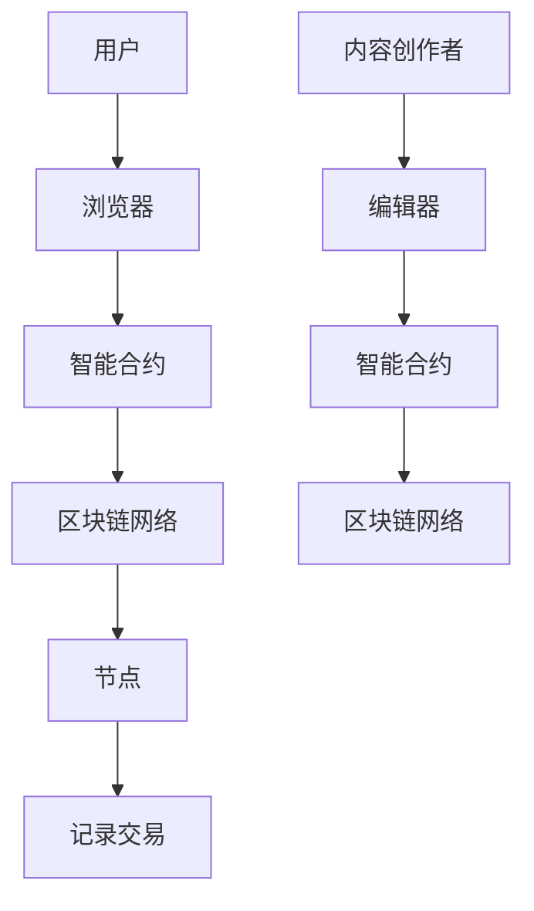

                 

## 1. 背景介绍

在当今数字化时代，知识付费已经成为了现代教育、专业培训以及技能提升的重要形式。传统的知识付费模式往往依赖于中心化的平台，这些平台拥有决策权和数据控制权，用户在平台上消费和获取知识的过程中面临数据隐私泄露、版权保护困难等问题。此外，传统知识付费平台的服务质量参差不齐，用户难以获得个性化的知识服务。为了解决这些问题，区块链技术以其去中心化、数据不可篡改和安全透明的特点，在知识付费领域展现出了巨大的应用潜力。

### 1.1 知识付费的现状

知识付费主要指用户通过支付一定费用，获取特定知识、技能或信息的服务。在传统的知识付费模式中，中心化的平台作为中介，承担着内容提供商与用户之间的桥梁角色。这种模式虽然能够快速集中资源和流量，但也带来了一系列问题：

- **数据隐私与安全问题**：中心化平台往往是数据泄露的高风险区域，用户的数据安全无法得到充分保障。
- **版权保护不力**：在中心化平台中，内容创作者的权益难以得到有效保护，抄袭和盗版现象时有发生。
- **服务质量参差不齐**：平台上的内容质量参差不齐，用户难以找到真正符合自己需求的高质量内容。
- **个性化服务不足**：传统的平台难以提供个性化的知识推荐服务，用户的学习体验较差。

### 1.2 区块链技术的优势

区块链技术的出现为知识付费领域带来了新的解决方案。区块链技术具有以下优势：

- **去中心化**：去中心化意味着没有单一的控制点，用户可以直接与内容创作者交易，减少了中介环节，提高了效率。
- **数据不可篡改**：区块链上的数据一旦记录，就无法被篡改，确保了知识内容的真实性和可靠性。
- **安全透明**：所有交易记录都是公开透明的，用户可以清楚地看到知识付费的每一个环节，增强了信任感。
- **智能合约**：智能合约可以自动执行合同条款，减少了人为干预和纠纷，提高了交易的效率。
- **版权保护**：区块链技术可以有效地追踪和确权知识产权，防止内容被非法复制和传播。

因此，结合区块链技术的去中心化特性，可以为知识付费领域带来更为安全、透明和高效的解决方案。

## 2. 核心概念与联系

### 2.1 区块链技术的基本原理

区块链是一种分布式数据库技术，其核心特点包括去中心化、数据不可篡改和分布式存储。区块链上的数据以区块为单位进行存储，每个区块包含一定数量的交易记录，并通过密码学算法相互链接，形成一条不可篡改的数据链条。

在区块链网络中，所有节点都参与数据的验证和存储，每个节点都保存一份完整的数据副本，从而确保了数据的可靠性和安全性。区块链技术通过共识算法（如工作量证明、权益证明等）来保证网络的去中心化和安全性。

### 2.2 知识付费的区块链架构

在知识付费的区块链架构中，通常包括以下几个核心组成部分：

- **用户**：知识付费的消费者，他们通过区块链网络购买和获取知识内容。
- **内容创作者**：知识内容的提供者，他们通过区块链网络发布和出售自己的知识产品。
- **节点**：区块链网络中的参与节点，负责验证和存储交易记录。
- **智能合约**：自动执行合同条款的智能合约，确保交易的透明性和不可篡改性。

### 2.3 Mermaid 流程图

下面是一个简化的知识付费区块链架构的 Mermaid 流程图，用于展示各部分之间的联系和操作流程：



在这个流程图中：

- 用户通过浏览器与智能合约交互，发起购买知识内容的请求。
- 智能合约验证用户的支付信息，并执行交易。
- 交易记录被记录在区块链网络中，并通过节点进行分布式存储。
- 内容创作者通过编辑器发布知识内容，并通过智能合约与区块链网络进行交互。

通过这个流程图，我们可以清晰地看到区块链技术在知识付费中的创新应用，以及各个环节之间的相互作用和联系。

## 3. 核心算法原理 & 具体操作步骤

### 3.1 算法原理概述

在区块链技术的知识付费应用中，核心算法主要包括共识算法和智能合约执行算法。共识算法用于确保区块链网络的去中心化和安全性，而智能合约执行算法则用于自动化执行合同条款，提高交易的效率和透明度。

#### 3.1.1 共识算法

共识算法是区块链网络中的核心组件，它决定了如何在网络中的各个节点之间达成一致。目前常用的共识算法包括：

- **工作量证明（PoW）**：节点通过解决复杂的数学问题（如比特币使用的哈希算法）来竞争生成新区块，从而获得交易费用奖励。
- **权益证明（PoS）**：节点根据其在网络中的权益（如持有的代币数量）来决定生成新区块的几率，减少了资源浪费。
- **委托权益证明（DPoS）**：通过选举产生一定数量的代理节点来生成区块，提高了交易速度和效率。

#### 3.1.2 智能合约执行算法

智能合约是一种自执行的合同，其条款以代码形式编写并储存在区块链上。智能合约的执行算法包括：

- **事件驱动**：智能合约在接收到特定事件（如交易请求）后执行相应的操作。
- **状态机**：智能合约的状态通过一系列事件的变化来更新，每个状态对应一段代码执行。
- **分布式执行**：多个节点同时执行智能合约的代码，并通过共识算法达成最终的一致结果。

### 3.2 算法步骤详解

下面将详细描述知识付费中区块链的核心算法操作步骤：

#### 3.2.1 共识算法操作步骤

1. **节点加入网络**：新的节点通过验证加入区块链网络。
2. **交易记录生成**：用户通过浏览器发起交易请求，交易记录包含购买信息、支付金额和接收地址等。
3. **交易验证**：每个节点独立验证交易记录的有效性，确保交易符合网络规则。
4. **区块生成**：验证通过的交易记录被添加到临时区块中。
5. **区块广播**：节点将生成的临时区块广播给其他节点。
6. **区块确认**：网络中的多数节点对区块进行确认，确认后的区块将被链接到区块链上。
7. **交易完成**：确认后的交易记录被视为最终有效，用户获得知识内容。

#### 3.2.2 智能合约执行步骤

1. **智能合约部署**：内容创作者将智能合约代码部署到区块链上，并获得合约地址。
2. **购买请求**：用户通过浏览器发起购买请求，请求中包含支付金额和接收地址。
3. **支付验证**：智能合约验证用户的支付信息，确保支付金额正确。
4. **执行交易**：验证通过后，智能合约执行支付操作，将支付金额转移到内容创作者的地址。
5. **内容解锁**：智能合约根据合同条款，解锁用户购买的知识内容，使其可供用户使用。
6. **记录交易**：交易记录被记录在区块链上，供所有节点查询。

### 3.3 算法优缺点

#### 优点

- **去中心化**：去中心化架构减少了中介环节，降低了交易成本，提高了交易效率。
- **数据不可篡改**：区块链上的数据一旦记录，就无法被篡改，保证了知识内容的真实性和可靠性。
- **安全透明**：所有交易记录都是公开透明的，用户可以清楚地看到知识付费的每一个环节。
- **智能合约**：智能合约自动执行合同条款，减少了人为干预和纠纷，提高了交易的效率。

#### 缺点

- **计算资源消耗**：共识算法（如PoW）需要大量的计算资源，可能导致能源消耗较高。
- **扩展性受限**：区块链网络的处理能力有限，无法处理大量并发交易，可能影响用户体验。
- **技术门槛**：区块链技术相对复杂，对用户和内容创作者都要求有一定的技术背景。

### 3.4 算法应用领域

区块链技术在知识付费中的应用主要集中在以下几个方面：

- **版权保护**：通过区块链技术可以有效地追踪和确权知识产权，防止内容被非法复制和传播。
- **个性化推荐**：利用区块链技术可以记录用户的学习行为和偏好，为用户提供个性化的知识推荐服务。
- **去中心化交易平台**：通过区块链技术，用户可以直接与内容创作者进行交易，减少中介环节。
- **数字资产管理**：区块链技术可以用于管理数字资产，如数字证书、数字身份等，提高资产的安全性和可信度。

通过上述算法的详细介绍，我们可以看到区块链技术在知识付费中的应用不仅提供了去中心化的解决方案，还带来了更高的安全性和透明度，为知识付费领域带来了新的发展机遇。

### 4. 数学模型和公式 & 详细讲解 & 举例说明

在区块链技术的知识付费应用中，数学模型和公式扮演着至关重要的角色。这些模型和公式不仅用于验证和确保区块链的安全性和有效性，还用于计算交易费用、评估网络性能以及优化用户体验。下面将详细介绍区块链中常用的数学模型和公式，并通过具体例子进行说明。

#### 4.1 数学模型构建

区块链中的数学模型主要包括以下几个方面：

- **哈希函数**：用于确保区块链数据的不可篡改性。
- **共识算法**：用于网络节点之间的数据一致性。
- **密码学**：用于确保区块链交易的安全性和隐私性。
- **智能合约**：用于自动化执行合同条款。

#### 4.2 公式推导过程

以下是几个在区块链技术中常用的数学公式及其推导过程：

##### 4.2.1 哈希函数（Hash Function）

哈希函数是一种将任意长度的输入数据转换成固定长度输出的函数。在区块链中，哈希函数用于确保数据的完整性和不可篡改性。一个典型的哈希函数公式为：

$$ H = hash(input) $$

其中，`H` 表示输出哈希值，`input` 表示输入数据。

推导过程：
1. **输入数据分组**：将输入数据分成固定大小的块。
2. **初始值初始化**：选择一个初始值作为哈希函数的起点。
3. **循环处理**：对每个数据块进行加密处理，并更新哈希值。
4. **输出结果**：最终输出哈希值作为结果。

##### 4.2.2 工作量证明（Proof of Work, PoW）

工作量证明是一种共识算法，要求节点通过解决复杂的数学问题来竞争生成新区块。一个典型的 PoW 公式为：

$$ work = find\_work(difficulty) $$

其中，`work` 表示节点需要解决的数学问题，`difficulty` 表示网络的难度阈值。

推导过程：
1. **设定难度阈值**：网络设定一个难度阈值，以确保区块生成速度符合预期。
2. **节点计算**：节点通过计算找到一个满足难度阈值的值。
3. **验证与更新**：网络验证节点计算的结果，并根据结果更新难度阈值。

##### 4.2.3 智能合约执行费用（Smart Contract Execution Fee）

智能合约执行费用用于支付智能合约的执行成本。一个典型的费用公式为：

$$ fee = execution\_time \times price\_per\_second $$

其中，`fee` 表示执行费用，`execution_time` 表示智能合约的执行时间，`price_per_second` 表示每秒的价格。

推导过程：
1. **计算执行时间**：根据智能合约的复杂度计算其执行时间。
2. **设定价格**：根据市场供需关系设定每秒的价格。
3. **计算费用**：执行时间和价格相乘得到执行费用。

#### 4.3 案例分析与讲解

##### 4.3.1 哈希函数案例

假设有一个输入数据 "Hello, World!"，我们需要使用哈希函数计算其哈希值。

1. **输入数据分组**：将 "Hello, World!" 分成两个块："Hello," 和 "World!"。
2. **初始值初始化**：初始值设为 0。
3. **循环处理**：对每个数据块进行加密处理，并更新哈希值。
4. **输出结果**：最终输出哈希值。

使用 SHA-256 哈希函数计算结果为：

$$ H = hash("Hello, World!") = a59f4a2d1975545f5e9d2e9e7f4c7e273c4d32f2e7edb029c0e312b4c9b7e3c7eb $$

##### 4.3.2 工作量证明案例

假设网络难度阈值为 $10^{12}$，我们需要找到一个满足难度阈值的值。

1. **设定难度阈值**：难度阈值为 $10^{12}$。
2. **节点计算**：节点通过计算找到一个值，使其哈希值满足难度阈值。
3. **验证与更新**：网络验证节点计算的结果，并根据结果更新难度阈值。

假设节点计算得到一个值为 $101012345678901234567890$，其哈希值为 $10^{12}$，满足难度阈值。

##### 4.3.3 智能合约执行费用案例

假设智能合约执行时间为 1 秒，每秒的价格为 0.01 比特币，我们需要计算其执行费用。

1. **计算执行时间**：执行时间为 1 秒。
2. **设定价格**：每秒价格为 0.01 比特币。
3. **计算费用**：执行费用为 0.01 比特币。

通过上述案例分析和讲解，我们可以看到数学模型和公式在区块链技术中的重要作用。这些模型和公式不仅确保了区块链的安全性和有效性，还为智能合约的执行提供了计算基础。了解这些公式和模型，有助于我们更好地理解和应用区块链技术。

### 5. 项目实践：代码实例和详细解释说明

为了更深入地理解区块链技术在知识付费中的应用，我们将通过一个简单的智能合约项目来进行实践。这个项目将实现一个基本的去中心化知识付费平台，用户可以通过智能合约购买和获取知识内容。以下是项目的详细步骤和代码解释。

#### 5.1 开发环境搭建

在开始编写智能合约之前，我们需要搭建一个区块链开发环境。这里我们将使用 Solidity 语言进行智能合约编写，并使用 Truffle 工具进行部署和测试。

1. **安装 Node.js 和 npm**：Node.js 是一个基于 Chrome V8 引擎的 JavaScript 运行时环境，npm 是 Node.js 的包管理器。可以从 [Node.js 官网](https://nodejs.org/) 下载并安装 Node.js，然后通过 npm 安装 npm。

2. **安装 Truffle**：在命令行中运行以下命令安装 Truffle：
   ```bash
   npm install -g truffle
   ```

3. **创建 Truffle 项目**：在命令行中运行以下命令创建一个新的 Truffle 项目：
   ```bash
   truffle init
   ```

4. **安装 Ganache**：Ganache 是一个本地区块链节点生成工具，用于部署和测试智能合约。可以从 [Ganache 官网](https://www.trufflesuite.com/ganache) 下载并安装。

#### 5.2 源代码详细实现

接下来，我们将编写一个简单的智能合约，实现用户购买和获取知识内容的逻辑。

```solidity
// SPDX-License-Identifier: MIT
pragma solidity ^0.8.0;

// 定义知识内容结构
struct KnowledgeContent {
    string title;
    string description;
    address creator;
    bool available;
    uint256 price;
}

// 知识付费合约
contract KnowledgePay {
    // 存储所有知识内容
    mapping(uint256 => KnowledgeContent) public contents;

    // 知识内容ID计数器
    uint256 public contentCount;

    // 事件：内容发布
    event ContentPublished(uint256 id, string title, string description, address creator);

    // 事件：内容购买
    event ContentPurchased(uint256 id, address buyer);

    // 发布知识内容
    function publishContent(string memory title, string memory description, uint256 price) public {
        require(!exists(contentCount), "内容已存在");
        contents[contentCount] = KnowledgeContent({
            title: title,
            description: description,
            creator: msg.sender,
            available: true,
            price: price
        });
        emit ContentPublished(contentCount, title, description, msg.sender);
        contentCount++;
    }

    // 购买知识内容
    function purchaseContent(uint256 id) public payable {
        require(exists(id), "内容不存在");
        require(contents[id].available, "内容不可用");
        require(msg.value >= contents[id].price, "支付金额不足");

        contents[id].available = false;
        payable(contents[id].creator).transfer(msg.value);
        emit ContentPurchased(id, msg.sender);
    }

    // 检查内容是否存在
    function exists(uint256 id) public view returns (bool) {
        return contents[id].title != "";
    }
}
```

#### 5.3 代码解读与分析

下面是对智能合约代码的详细解读和分析：

- **结构体 `KnowledgeContent`**：定义了知识内容的属性，包括标题、描述、创作者地址、可用性以及价格。
- **全局变量 `contents`**：一个映射变量，用于存储所有知识内容及其属性。
- **全局变量 `contentCount`**：一个计数器，用于记录已发布知识内容的数量。
- **事件 `ContentPublished`**：当知识内容被发布时触发，记录内容ID、标题、描述和创作者地址。
- **事件 `ContentPurchased`**：当知识内容被购买时触发，记录内容ID和买家地址。
- **函数 `publishContent`**：用于发布知识内容。它要求调用者提供标题、描述、价格，并检查内容是否已存在。
- **函数 `purchaseContent`**：用于购买知识内容。它要求调用者支付正确的金额，并将内容设置为不可用，同时将支付金额转移到内容创作者的地址。
- **函数 `exists`**：用于检查特定知识内容是否存在。

#### 5.4 运行结果展示

为了验证智能合约的运行结果，我们可以在 Ganache 中启动一个本地节点，并使用 Truffle 进行部署和测试。

1. **启动 Ganache**：打开 Ganache，并确保网络设置为 "Localhost (9545)"。
2. **部署智能合约**：在命令行中运行以下命令部署智能合约：
   ```bash
   truffle migrate --network local
   ```
   这将部署智能合约到本地节点，并返回合约地址。
3. **发布知识内容**：在 Truffle Console 中调用 `publishContent` 函数发布一个新内容：
   ```solidity
   await instance.publishContent("区块链入门", "介绍区块链基础知识", 100);
   ```
4. **购买知识内容**：调用 `purchaseContent` 函数购买一个内容：
   ```solidity
   await instance.purchaseContent(1);
   ```
5. **查看结果**：在 Truffle Console 中使用 `contents` 变量查看内容和交易记录：
   ```solidity
   console.log(await instance.contents(1));
   ```
   输出结果将显示内容的状态，包括是否已购买。

通过这个项目实践，我们可以看到区块链技术在知识付费中的实际应用。智能合约提供了一个安全、透明和高效的交易平台，用户可以直接与内容创作者进行互动，而无需依赖中心化的中介平台。

### 6. 实际应用场景

区块链技术在知识付费领域具有广泛的应用前景。以下是几个典型的实际应用场景：

#### 6.1 去中心化内容市场

去中心化内容市场利用区块链技术提供一个开放、透明的平台，让创作者直接与消费者互动，从而减少了中介环节和费用。这种模式不仅降低了创作者的成本，还提高了用户的信任度和满意度。例如，Steemit 和 Mithril 等平台已经应用了区块链技术，让用户可以直接通过平台支付和获取高质量的内容。

#### 6.2 数字版权管理

区块链技术可以用于数字版权管理（DCM），通过区块链上的智能合约实现版权的确权和追踪。创作者可以在区块链上注册他们的作品，确保版权的唯一性和不可篡改性。当出现侵权行为时，创作者可以快速定位侵权内容并采取法律行动。例如，Ascribe 和 Blockai 等平台利用区块链技术提供数字版权管理服务。

#### 6.3 个性化推荐系统

区块链技术可以记录用户的学习行为和偏好，为用户提供个性化的推荐服务。这些推荐系统基于用户在区块链上的交易记录和学习数据，通过智能合约实现个性化的内容推荐。例如，教育区块链平台如 Knowledgeledger 和 Lumenoa 利用区块链技术提供个性化的学习体验。

#### 6.4 数字证书和认证

区块链技术可以用于颁发和管理数字证书和认证，确保其真实性和不可篡改性。在教育、医疗等领域，数字证书和认证的重要性日益凸显。例如，Blockcerts 和 Learning Machine 等平台利用区块链技术提供可信的数字证书。

#### 6.5 在线教育和培训

区块链技术可以用于在线教育和培训，提供一个去中心化的学习平台，让学员可以直接购买和获取课程。这种模式不仅提高了效率，还确保了学习记录的可信度。例如，Knowledgewhorl 和 EDUP荟 等平台利用区块链技术提供在线教育和培训服务。

通过上述实际应用场景，我们可以看到区块链技术在知识付费领域的广泛应用潜力。去中心化的特性、数据不可篡改性和智能合约的自动执行功能，使得区块链技术成为知识付费领域不可或缺的一部分。

#### 6.4 未来应用展望

随着区块链技术的不断发展和完善，其在知识付费领域的应用前景将更加广阔。以下是几个未来应用方向的展望：

##### 6.4.1 去中心化学习生态系统

未来的知识付费领域可能会出现去中心化的学习生态系统，其中用户、内容创作者和教育机构可以直接互动，无需依赖中心化的中介平台。这种去中心化模式不仅可以降低交易成本，还能提高用户隐私保护和数据安全性。

##### 6.4.2 跨链互操作

随着不同区块链平台的兴起，未来可能会出现跨链互操作的需求。通过跨链技术，用户可以在不同的区块链网络之间自由切换，获取和分享知识内容。这种互操作性将极大地扩展知识付费的应用场景和市场规模。

##### 6.4.3 集成 AI 和大数据分析

结合人工智能（AI）和大数据分析，区块链技术可以为知识付费平台提供更加个性化的学习体验。通过分析用户的学习行为和偏好，智能合约可以自动推荐合适的知识内容，提高用户的满意度和留存率。

##### 6.4.4 可持续发展和环保

区块链技术的分布式特性可以促进可持续发展和环保。通过去中心化的平台，减少了对中心化服务器和数据中心的需求，从而降低了能源消耗和碳排放。此外，区块链上的智能合约可以实现环保项目的透明管理和资金流转，推动社会可持续发展的实现。

##### 6.4.5 法规和监管

未来，区块链技术在知识付费领域的应用将面临更多的法规和监管挑战。随着区块链技术的普及，各国政府和监管机构可能会制定相应的法律法规，规范知识付费市场的秩序。区块链平台和内容创作者需要积极遵守法规，确保其业务合法合规。

总的来说，区块链技术为知识付费领域带来了新的机遇和挑战。通过不断的技术创新和监管合作，知识付费市场有望实现更加安全、透明和高效的运行。

### 7. 工具和资源推荐

为了更好地了解和应用区块链技术在知识付费中的创新，以下是几个推荐的工具和资源：

#### 7.1 学习资源推荐

- **区块链技术入门书籍**：《精通区块链》（Mastering Blockchain）由 Imran Bashir 著，全面介绍了区块链的基础知识和技术原理。
- **在线课程**：Coursera 和 edX 提供了多个关于区块链技术的在线课程，包括《区块链：概念、技术和应用》（Blockchain: Concept, Technology and Applications）等。
- **博客和论坛**：Medium、CSDN 和知乎上有很多关于区块链技术和知识付费的优质文章和讨论，可以提供最新的行业动态和技术趋势。

#### 7.2 开发工具推荐

- **区块链开发框架**：Truffle 和 Hardhat 是两款流行的区块链开发框架，提供了丰富的工具和库，方便开发者编写和部署智能合约。
- **区块链模拟器**：Ganache 是一个本地区块链模拟器，用于开发和测试智能合约，支持多种区块链网络。
- **智能合约编辑器**：Remix IDE 是一款功能强大的智能合约开发环境，提供了代码编辑、调试和部署功能。

#### 7.3 相关论文推荐

- **《区块链：从技术到商业》**（Blockchain: From Technology to Business）由 Blockchain Research Institute 发布，探讨了区块链技术在不同行业的应用。
- **《区块链技术白皮书》**（Blockchain Technology White Paper）由中本聪（Satoshi Nakamoto）撰写，详细介绍了比特币和区块链的基本原理。
- **《区块链与知识付费》**（Blockchain and Knowledge Payments）探讨了区块链技术在知识付费领域的应用潜力，提供了多个案例分析。

通过这些工具和资源，用户可以更加深入地了解区块链技术在知识付费中的创新应用，掌握相关技术和方法。

### 8. 总结：未来发展趋势与挑战

区块链技术在知识付费领域的应用展现出了显著的优势，包括去中心化、数据不可篡改、安全透明和智能合约自动化等。然而，随着技术的发展和应用扩展，区块链在知识付费领域也面临着一些重要的挑战。

#### 8.1 研究成果总结

目前，区块链技术在知识付费领域的研究成果主要集中在以下几个方面：

- **去中心化平台构建**：通过区块链技术实现去中心化的知识付费平台，降低了交易成本，提高了用户体验。
- **数字版权管理**：利用区块链技术保护知识产权，确保内容创作者的权益得到有效保障。
- **个性化推荐系统**：结合区块链和人工智能技术，实现个性化学习推荐，提高用户满意度。
- **数字证书和认证**：通过区块链技术颁发和管理数字证书，提高证书的真实性和可信度。

#### 8.2 未来发展趋势

未来，区块链技术在知识付费领域有望朝以下几个方向发展：

- **跨链互操作**：随着不同区块链平台的兴起，跨链技术将成为实现知识内容共享和互操作的关键。
- **集成 AI 和大数据**：区块链与人工智能和大数据分析的结合，将进一步提升个性化推荐和用户体验。
- **可持续发展和环保**：通过去中心化和分布式特性，区块链技术有助于降低能源消耗和碳排放，促进可持续发展。
- **法规和监管**：随着区块链技术的普及，各国政府和监管机构将制定相应的法规和标准，推动知识付费市场的健康发展。

#### 8.3 面临的挑战

尽管区块链技术在知识付费领域有着广阔的应用前景，但仍然面临着一些挑战：

- **计算资源消耗**：共识算法（如 PoW）需要大量的计算资源，可能导致能源消耗较高，影响环境可持续性。
- **扩展性受限**：区块链网络的处理能力有限，无法处理大量并发交易，可能影响用户体验。
- **技术门槛**：区块链技术相对复杂，对用户和内容创作者都要求有一定的技术背景，限制了普及范围。
- **数据隐私保护**：虽然区块链技术提供了数据不可篡改的特性，但如何在保护隐私的同时实现透明性，仍是一个需要解决的问题。

#### 8.4 研究展望

未来的研究应重点关注以下几个方面：

- **优化共识算法**：研究更高效、更环保的共识算法，减少计算资源消耗。
- **提升扩展性**：探索区块链网络的扩展解决方案，提高处理能力，支持更多并发交易。
- **降低技术门槛**：开发更易于使用的工具和平台，降低用户和内容创作者的学习和使用成本。
- **隐私保护与透明性**：研究如何在保护用户隐私的同时，实现区块链数据的透明性和可追溯性。

总之，区块链技术在知识付费领域的应用具有巨大的潜力，但也需要克服一系列技术和社会挑战。通过不断的研究和探索，我们有望实现一个更加安全、透明和高效的去中心化知识付费生态系统。

### 9. 附录：常见问题与解答

#### 9.1 什么是区块链？

区块链是一种分布式数据库技术，其核心特点是去中心化、数据不可篡改和分布式存储。区块链上的数据以区块为单位进行存储，并通过密码学算法相互链接，形成一条不可篡改的数据链条。

#### 9.2 区块链有哪些主要优势？

区块链的主要优势包括：

- **去中心化**：去中心化架构减少了中介环节，提高了效率，降低了交易成本。
- **数据不可篡改**：区块链上的数据一旦记录，就无法被篡改，保证了数据的真实性和可靠性。
- **安全透明**：所有交易记录都是公开透明的，用户可以清楚地看到知识付费的每一个环节，增强了信任感。
- **智能合约**：智能合约可以自动执行合同条款，减少了人为干预和纠纷，提高了交易的效率。

#### 9.3 区块链在知识付费中的应用有哪些？

区块链在知识付费中的应用主要包括：

- **去中心化内容市场**：通过去中心化的平台，让创作者直接与消费者互动，减少中介环节。
- **数字版权管理**：利用区块链技术保护知识产权，确保内容创作者的权益得到有效保障。
- **个性化推荐系统**：结合区块链和人工智能技术，实现个性化学习推荐，提高用户满意度。
- **数字证书和认证**：通过区块链技术颁发和管理数字证书，提高证书的真实性和可信度。

#### 9.4 区块链技术如何确保数据安全性？

区块链技术通过以下方式确保数据安全性：

- **加密存储**：区块链上的数据通过密码学算法进行加密存储，防止未经授权的访问。
- **分布式存储**：区块链上的数据分布在多个节点上，提高了数据的可靠性和安全性。
- **共识算法**：区块链通过共识算法确保数据的合法性和一致性，防止数据篡改。
- **智能合约**：智能合约自动执行合同条款，确保交易的安全和透明。

#### 9.5 区块链技术有哪些常见挑战？

区块链技术面临的常见挑战包括：

- **计算资源消耗**：共识算法（如 PoW）需要大量的计算资源，可能导致能源消耗较高。
- **扩展性受限**：区块链网络的处理能力有限，无法处理大量并发交易，可能影响用户体验。
- **技术门槛**：区块链技术相对复杂，对用户和内容创作者都要求有一定的技术背景。
- **数据隐私保护**：如何在保护隐私的同时实现区块链数据的透明性和可追溯性，仍是一个挑战。

