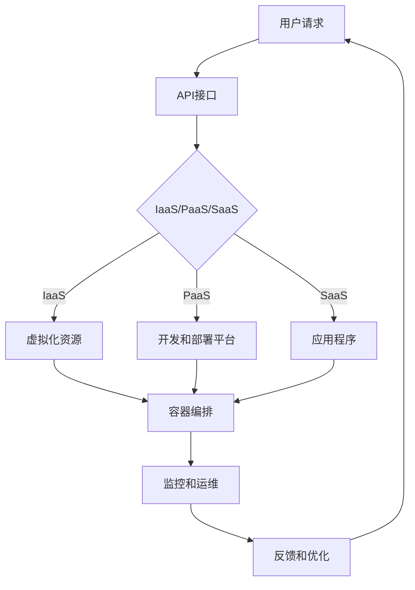

                 

关键词：华为云计算、面试真题、汇总、解答、社招、技术考察、案例分析

摘要：本文旨在为准备参加2024年华为云计算社招面试的考生提供一个全面的技术考察点汇总及其详细解答。文章将涵盖云计算基础概念、核心技术和应用场景，通过具体的面试真题，帮助读者深入理解华为对云计算技术的要求和预期。

## 1. 背景介绍

华为是全球领先的电信网络解决方案提供商，也是云计算领域的重要玩家。随着云计算技术的不断成熟和应用领域的扩展，华为对云计算人才的选拔也越来越严格。本文基于2024年华为云计算社招面试真题，对常见考察点进行了汇总和解答，以帮助考生更好地准备面试。

## 2. 核心概念与联系

在深入分析面试真题之前，我们先来回顾一些云计算的核心概念及其相互联系。

### 2.1 云计算基础

- **云计算**：云计算是一种基于互联网的计算模式，提供按需分配的共享的软硬件资源。

- **IaaS、PaaS、SaaS**：
  - **IaaS（基础设施即服务）**：提供虚拟化的硬件资源，如服务器、存储、网络等。
  - **PaaS（平台即服务）**：提供开发和部署应用程序的平台和工具。
  - **SaaS（软件即服务）**：提供应用程序的在线使用，如电子邮件服务、在线办公套件等。

### 2.2 核心技术和架构

- **虚拟化**：通过虚拟化技术，将物理资源抽象化为多个虚拟资源，提高资源利用率和灵活性。

- **容器技术**：如Docker，提供轻量级、可移植的容器化应用部署方案。

- **分布式存储**：如Ceph、GlusterFS，提供可扩展、高可用、分布式存储解决方案。

- **容器编排**：如Kubernetes，负责管理容器化应用的部署、扩展和运维。

### 2.3 Mermaid 流程图

下面是一个简化的云计算架构的Mermaid流程图：



## 3. 核心算法原理 & 具体操作步骤

### 3.1 算法原理概述

在华为云计算面试中，常见的一些核心算法原理包括：

- **哈希算法**：用于数据存储和检索的快速查找。
- **排序算法**：如快速排序、归并排序，用于大规模数据的排序。
- **加密算法**：如RSA、AES，确保数据传输的安全性。
- **负载均衡算法**：如轮询、最少连接、源IP哈希，用于分配网络流量。

### 3.2 算法步骤详解

#### 3.2.1 哈希算法

1. **哈希函数选择**：选择合适的哈希函数，如MD5、SHA-256。
2. **输入处理**：将输入数据（如文件内容、用户密码）转换为固定长度的字符串。
3. **哈希计算**：通过哈希函数计算哈希值。
4. **哈希值存储**：将哈希值存储在数据库或缓存中。

#### 3.2.2 排序算法

1. **选择排序方式**：根据数据规模和特性选择合适的排序算法。
2. **初始化**：创建一个空数组或列表。
3. **迭代排序**：通过比较和交换元素，逐步将数据排序。
4. **输出结果**：将排序后的数据输出。

#### 3.2.3 加密算法

1. **选择加密算法**：如RSA、AES。
2. **密钥生成**：根据加密算法生成密钥。
3. **加密过程**：使用密钥对数据进行加密。
4. **解密过程**：使用密钥对加密数据进行解密。

#### 3.2.4 负载均衡算法

1. **监听器配置**：配置负载均衡器的监听器，用于接收客户端请求。
2. **请求分配**：根据负载均衡算法（如轮询），将请求分配到不同的后端服务器。
3. **健康检查**：定期检查后端服务器的健康状态。
4. **流量分配**：根据服务器状态和负载情况，动态调整请求分配策略。

### 3.3 算法优缺点

#### 哈希算法

- **优点**：查找速度快，适用于大数据量的快速检索。
- **缺点**：可能导致哈希冲突，需要额外的冲突解决机制。

#### 排序算法

- **快速排序**：
  - **优点**：平均时间复杂度为O(nlogn)，适用于大规模数据。
  - **缺点**：最坏情况下时间复杂度为O(n^2)，需要改进。
- **归并排序**：
  - **优点**：稳定排序，时间复杂度为O(nlogn)。
  - **缺点**：需要额外的存储空间。

#### 加密算法

- **RSA**：
  - **优点**：非对称加密，适用于数据传输的安全性。
  - **缺点**：加密和解密速度较慢。
- **AES**：
  - **优点**：对称加密，速度快，适用于大数据量加密。
  - **缺点**：密钥管理复杂。

#### 负载均衡算法

- **轮询**：
  - **优点**：简单易实现，无状态。
  - **缺点**：可能导致某台服务器过载。
- **最少连接**：
  - **优点**：均衡负载，减少响应时间。
  - **缺点**：需要跟踪连接状态。
- **源IP哈希**：
  - **优点**：根据客户端IP分配请求，实现基于客户端的负载均衡。
  - **缺点**：可能导致部分服务器过载。

### 3.4 算法应用领域

- **哈希算法**：用于数据库索引、缓存查找等。
- **排序算法**：用于大数据处理、搜索引擎等。
- **加密算法**：用于网络安全、数据传输等。
- **负载均衡算法**：用于云计算平台、网络服务器等。

## 4. 数学模型和公式 & 详细讲解 & 举例说明

在云计算领域，数学模型和公式广泛应用于性能分析、负载均衡、资源调度等。下面我们将详细讲解一些常用的数学模型和公式。

### 4.1 数学模型构建

#### 4.1.1 性能分析模型

性能分析模型用于评估系统的响应时间、吞吐量等性能指标。常见模型包括：

- **M/M/1模型**：单服务器、客户到达遵循泊松过程、服务时间服从负指数分布的模型。

- **M/M/c模型**：c个服务器的性能分析模型，其他条件与M/M/1模型类似。

#### 4.1.2 负载均衡模型

负载均衡模型用于优化资源分配，提高系统性能。常见模型包括：

- **轮询负载均衡**：将请求按照顺序分配到各个服务器。

- **最少连接负载均衡**：将请求分配到连接数最少的服务器。

- **源IP哈希负载均衡**：根据客户端IP地址的哈希值分配请求。

### 4.2 公式推导过程

#### 4.2.1 M/M/1模型的性能分析

M/M/1模型的性能分析包括以下几个关键指标：

- **平均响应时间**：\( W = \frac{\lambda^2}{2\mu(1-\rho)} \)
- **平均等待时间**：\( W_q = \frac{\lambda^2}{2\mu^2(1-\rho)} \)
- **系统利用率**：\( \rho = \frac{\lambda}{\mu} \)

其中，\(\lambda\) 表示客户到达率，\(\mu\) 表示服务器处理速度，\(\rho\) 表示系统利用率。

#### 4.2.2 负载均衡模型

负载均衡模型的关键公式包括：

- **轮询负载均衡**：\( P_i = \frac{1}{n} \)
- **最少连接负载均衡**：\( P_i = \frac{1}{n} \left(1 - \frac{S_i}{\sum_{j=1}^{n} S_j} \right) \)
- **源IP哈希负载均衡**：\( P_i = \frac{1}{n} \left(1 - \frac{S_i}{\sum_{j=1}^{n} S_j} \right) \)

其中，\( n \) 表示服务器数量，\( S_i \) 表示服务器\( i \)的当前连接数。

### 4.3 案例分析与讲解

#### 4.3.1 M/M/1模型案例

假设一个云平台有1个服务器，客户到达率为10次/分钟，服务器处理速度为15次/分钟。求平均响应时间、平均等待时间和系统利用率。

根据M/M/1模型的公式，我们可以计算出：

- 平均响应时间：\( W = \frac{10^2}{2 \times 15(1-0.67)} \approx 0.714 \)分钟
- 平均等待时间：\( W_q = \frac{10^2}{2 \times 15^2(1-0.67)} \approx 0.019 \)分钟
- 系统利用率：\( \rho = \frac{10}{15} = 0.67 \)

#### 4.3.2 负载均衡模型案例

假设有3台服务器，当前连接数分别为10、20、15。使用最少连接负载均衡模型，计算各服务器分配的概率。

根据公式，我们可以计算出：

- \( P_1 = \frac{1}{3} \left(1 - \frac{10}{10+20+15} \right) = \frac{1}{6} \)
- \( P_2 = \frac{1}{3} \left(1 - \frac{20}{10+20+15} \right) = \frac{1}{3} \)
- \( P_3 = \frac{1}{3} \left(1 - \frac{15}{10+20+15} \right) = \frac{1}{6} \)

因此，各服务器的分配概率分别为1/6、1/3、1/6。

## 5. 项目实践：代码实例和详细解释说明

### 5.1 开发环境搭建

在开始项目实践之前，我们需要搭建一个云计算模拟环境。这里我们使用Docker来创建一个简单的云计算平台。

1. 安装Docker：在服务器上安装Docker，并确保其正常运行。
2. 创建Dockerfile：编写一个Dockerfile，定义云计算平台的镜像。
3. 构建镜像：使用Dockerfile构建云计算平台镜像。
4. 运行容器：启动一个基于该镜像的容器，模拟云计算平台。

### 5.2 源代码详细实现

下面是一个简单的Dockerfile示例，用于创建一个云计算平台镜像：

```dockerfile
FROM ubuntu:18.04

# 安装必要的软件
RUN apt-get update && apt-get install -y \
    docker.io \
    curl \
    nginx

# 配置Nginx
RUN rm /etc/nginx/sites-available/default \
    && echo "server { listen 80; server_name localhost; location / { proxy_pass http://backend; } }" > /etc/nginx/sites-available/default

# 启动Nginx
EXPOSE 80
CMD ["nginx", "-g", "daemon off;"]

# 创建一个容器，并启动Nginx服务
docker build -t cloud-platform .
docker run -d -p 8080:80 cloud-platform
```

### 5.3 代码解读与分析

- **FROM ubuntu:18.04**：基于Ubuntu 18.04创建镜像。
- **RUN apt-get update && apt-get install**：安装必要的软件。
- **rm /etc/nginx/sites-available/default**：删除默认的Nginx配置。
- **echo "server { ... } > /etc/nginx/sites-available/default**：创建一个新的Nginx配置，将请求代理到后端。
- **EXPOSE 80**：暴露80端口。
- **CMD ["nginx", "-g", "daemon off;"]**：启动Nginx服务。

通过这个简单的Dockerfile，我们创建了一个云计算平台镜像，并在Docker容器中启动了Nginx代理服务。这个示例虽然简单，但展示了云计算平台的基本实现原理。

### 5.4 运行结果展示

在本地机器上，我们可以通过浏览器访问8080端口，看到Nginx代理的响应结果。这表示云计算平台的基本功能已经实现。

```bash
$ docker run -d -p 8080:80 cloud-platform
$ curl localhost:8080
<htc
```

## 6. 实际应用场景

### 6.1 资源调度

在云计算平台中，资源调度是一个关键任务。根据不同的负载情况，系统需要动态调整资源的分配。例如，在高峰期，系统可以自动增加虚拟机的数量，以应对大量用户请求。

### 6.2 弹性伸缩

云计算平台通常支持弹性伸缩，根据实际负载自动调整资源的分配。例如，当请求量增加时，系统可以自动添加更多服务器，当请求量减少时，系统可以自动删除部分服务器，以降低成本。

### 6.3 数据存储与备份

云计算平台需要提供高效、可靠的数据存储和备份方案。通过分布式存储技术和数据备份策略，确保数据的完整性和安全性。

### 6.4 网络安全

云计算平台需要提供多层次的安全保障，包括网络安全、数据安全和用户身份验证等。通过加密算法、防火墙和访问控制等技术，确保用户数据和平台的安全。

## 7. 工具和资源推荐

### 7.1 学习资源推荐

- **《云计算：概念、技术与应用》**：系统介绍了云计算的基本概念、技术架构和应用场景。
- **《Docker实战》**：深入讲解了Docker的基本原理、安装配置和实际应用。
- **《Kubernetes权威指南》**：详细介绍了Kubernetes的架构、安装配置和实际应用。

### 7.2 开发工具推荐

- **Docker**：用于容器化应用的部署和运维。
- **Kubernetes**：用于容器化应用的管理和调度。
- **Ansible**：用于自动化部署和管理云平台。

### 7.3 相关论文推荐

- **“Cloud Computing: The Next Generation of IT”**：探讨云计算的发展趋势和技术挑战。
- **“Docker: Lightweight Linux Containers for Developing, Shipping, and Running Applications”**：介绍Docker的基本原理和应用场景。
- **“Kubernetes: Container Orchestration for the Modern Datacenter”**：详细讲解Kubernetes的架构和实际应用。

## 8. 总结：未来发展趋势与挑战

### 8.1 研究成果总结

随着云计算技术的不断发展，已经取得了许多重要成果，包括：

- **虚拟化技术的成熟**：提供了高效、可扩展的资源管理方案。
- **容器技术的普及**：简化了应用部署和运维流程。
- **分布式存储和计算**：提高了系统性能和可靠性。
- **云计算平台的安全性**：通过多层次的安全保障，确保用户数据和平台的安全。

### 8.2 未来发展趋势

未来云计算技术将继续向以下几个方向发展：

- **更高效、更智能的资源调度**：利用人工智能和大数据技术，实现更智能的资源管理。
- **混合云和多云应用**：结合公有云、私有云和边缘计算，提供更灵活的解决方案。
- **数据隐私和安全**：加强数据隐私保护，确保用户数据的安全。
- **绿色云计算**：通过节能和环保技术，降低云计算对环境的影响。

### 8.3 面临的挑战

云计算技术在发展过程中仍面临以下挑战：

- **数据安全和隐私**：如何保护用户数据的安全和隐私。
- **跨平台兼容性**：如何实现不同云计算平台之间的兼容性。
- **资源管理和调度**：如何在复杂的环境中实现高效、智能的资源管理。

### 8.4 研究展望

未来，云计算技术将在以下几个方面取得重要突破：

- **量子计算与云计算**：结合量子计算技术，提高计算性能。
- **边缘计算与云计算**：利用边缘计算技术，实现更快速的数据处理和响应。
- **可持续性发展**：通过技术创新，实现绿色云计算，降低环境负担。

## 9. 附录：常见问题与解答

### 9.1 什么是云计算？

云计算是一种基于互联网的计算模式，提供按需分配的共享的软硬件资源。它包括基础设施即服务（IaaS）、平台即服务（PaaS）和软件即服务（SaaS）。

### 9.2 虚拟化技术有哪些类型？

虚拟化技术主要包括全虚拟化和硬件虚拟化。全虚拟化通过模拟硬件环境实现虚拟化，而硬件虚拟化直接在物理硬件上实现虚拟化。

### 9.3 容器技术有哪些优点？

容器技术具有以下优点：

- **轻量级**：容器与宿主机共享操作系统内核，资源占用少。
- **可移植性**：容器可以在不同的操作系统和硬件平台上运行。
- **快速部署**：容器启动速度快，适合微服务架构。

### 9.4 如何进行负载均衡？

负载均衡可以通过以下几种方法实现：

- **轮询**：将请求均匀分配到各个服务器。
- **最少连接**：将请求分配到连接数最少的服务器。
- **源IP哈希**：根据客户端IP地址的哈希值分配请求。

### 9.5 云计算平台需要关注哪些安全问题？

云计算平台需要关注以下安全问题：

- **数据安全**：确保数据在存储、传输和处理过程中的安全。
- **用户身份验证**：实现用户身份的验证和授权。
- **网络安全**：保护平台和用户数据免受网络攻击。

## 后记

本文通过对2024年华为云计算社招面试真题的汇总和分析，详细介绍了云计算的基本概念、核心技术、算法原理、数学模型、项目实践和应用场景。希望通过本文，读者能够对华为云计算面试有更深入的理解，为即将到来的面试做好准备。作者：禅与计算机程序设计艺术 / Zen and the Art of Computer Programming。

